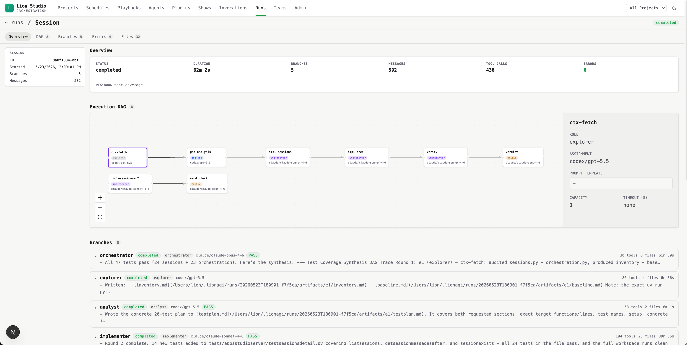

[](https://codecov.io/github/ohdearquant/lionagi)

# lionagi

**lionagi is a governed multi-agent orchestration framework.** Build agent
workflows in Python with typed, inspectable state, or run them straight from
the terminal with the `li` CLI: single agents, parallel fan-outs, and DAG
flows where an orchestrator plans specialist workers. Built continuously
since 2023.

[Docs](https://ohdearquant.github.io/lionagi/) |
[How lionagi Compares](https://ohdearquant.github.io/lionagi/comparison/) |
[Discord](https://discord.gg/JDj9ENhUE8) |
[PyPI](https://pypi.org/project/lionagi/) |
[Changelog](CHANGELOG.md)

## Quick start

```bash
pip install lionagi

# one agent
li agent claude/sonnet "Explain the observer pattern in 3 sentences"

# three workers in parallel, then a synthesis pass
li o fanout claude/sonnet "Identify code smells in this codebase" -n 3 --with-synthesis

# an orchestrator plans a DAG of specialists; workers run as dependencies resolve
li o flow claude/sonnet "Audit the auth module for security issues" --cwd .
```

CLI model aliases (`claude`, `codex`, ...) spawn the provider's own CLI as a
subprocess, so an existing `claude login` subscription works with no API key.
API providers take the usual environment keys (`OPENAI_API_KEY`, ...).
Details in [Providers](#providers).

The same engine from Python, with structured output as a first-class result:

```python
import asyncio
from pydantic import BaseModel
from lionagi import Branch

class Assessment(BaseModel):
    risk: str
    reasons: list[str]

async def main():
    b = Branch(chat_model="openai/gpt-5.4", system="You are a careful reviewer.")
    result = await b.operate(
        instruction="Assess the risk of enabling auto-merge on this repository.",
        response_format=Assessment,
    )
    print(result.risk, result.reasons)

asyncio.run(main())
```

## Why lionagi

- **You own the loop.** Branches, sessions, and flows are ordinary Python
  objects and CLI commands. There is no framework runtime to surrender
  control to, and no hidden prompt assembly between you and the model.
- **Typed, inspectable state.** Every conversation is a collection of typed
  messages with an explicit ordering. State serializes, persists, and
  resumes; it is never an opaque blob inside a chain.
- **CLI agents are first-class endpoints.** Claude Code, Codex, and other
  coding CLIs sit in the same orchestration graph as API models, so
  subscription-based agents and API calls compose in one flow.
- **Durable runs.** Every run persists under `~/.lionagi/runs/`. Resume any
  branch with `li agent -r`, reattach with `-c`, watch live work with
  `li monitor`, and schedule recurring runs with `li schedule`.
- **Governance built in.** Permission policies per tool call, guard hooks
  that block destructive commands and off-limits paths, and git-worktree
  sandboxing for speculative edits that never touch your branch until you
  merge them.

For the architecture-level comparison with LangChain / LangGraph (and a field
matrix covering LlamaIndex and AG2), see
[How lionagi Compares](https://ohdearquant.github.io/lionagi/comparison/).

## Concepts

| Term | What it is |
|------|------------|
| **Branch** | Single conversation thread — message history, tools, model config. Primary API surface. |
| **Session** | Coordinates multiple Branches; runs DAG workflows across them. |
| **flow** | `li o flow` — orchestrator plans a DAG, workers execute with dependency edges resolved. |
| **team** | Persistent inbox messaging between agents via `li team send/receive`. |
| **operate** | `branch.operate(instruction=…)` — tool use + structured output + optional streaming. |
| **persist** | Every run saved to `~/.lionagi/runs/{run_id}/`. Resume with `li agent -r <branch-id>`. |

## The `li` CLI

```bash
# Single agent, resumable
li agent claude/sonnet "Explain the observer pattern in 3 sentences"
li agent -r <branch-id> "follow up on your findings"

# Fan-out: N workers in parallel, optional synthesis
li o fanout claude/sonnet "Identify code smells in this codebase" -n 3 --with-synthesis

# DAG flow: orchestrator plans agents with dependency edges
li o flow claude/sonnet "Audit the auth module for security issues" --cwd .

# Playbook: parametric flow spec at ~/.lionagi/playbooks/audit.playbook.yaml
li play audit --mode security "the auth service"

# Team messaging: inbox coordination between agents
li team create "review" && li team send "Start analysis" -t <id> --to analyst

# Observe and operate
li monitor --since 1h              # live and recent sessions, flows, plays
li schedule create ...             # cron / interval / repo-event triggers
li kill <id>                       # stop a running session or invocation

# Time-bounded run: injects a [DEADLINE] preamble so the agent paces itself
li agent claude/sonnet --timeout 300 "Audit the auth module and produce a summary"
```

Every command and flag: [CLI Reference](docs/cli-reference.md). Installable
playbook and skill templates: [examples/](examples/).

## Python API

**Chat**

```python
from lionagi import Branch

b = Branch(chat_model="openai/gpt-5.4", system="You are a concise assistant.")
reply = await b.communicate("What causes rainbows?")
```

**Structured output**

```python
from pydantic import BaseModel

class Summary(BaseModel):
    points: list[str]
    confidence: float

result = await b.operate(instruction="Summarize this text.", response_format=Summary)
```

**Tools + ReAct**

```python
from lionagi.tools.types import ReaderTool

branch = Branch(tools=[ReaderTool])
result = await branch.ReAct(
    instruct={"instruction": "Summarize /path/to/paper.pdf"},
)
```

Full reference → [docs/api/](docs/api/)

## Lion Studio

Lion Studio is the built-in web UI for operating your agent workflows:
projects, schedules, playbooks, execution DAGs, and run inspection in one
place.

```bash
li studio          # Docker (recommended): auto-pulls ghcr.io/ohdearquant/lion-studio
                   # UI → http://localhost:3000   API → http://localhost:8765
li studio --dev    # from a source checkout: backend + frontend with hot reload
```



## Providers

CLI aliases spawn subprocess tools, not REST API calls:

- `claude`: install [Claude Code CLI](https://docs.anthropic.com/en/docs/claude-code) → `claude login` (subscription) or `export ANTHROPIC_API_KEY=sk-ant-...`
- `codex`: requires ChatGPT Plus/Pro → `npm install -g @openai/codex` → `codex login`
- `deepseek`: `export DEEPSEEK_API_KEY=sk-...`
- `pi`: install [Pi Code CLI](https://pi.ai)
- Python API (`iModel`, `Branch`): `export OPENAI_API_KEY=sk-...` for the default model

API-endpoint providers (OpenAI, Anthropic, Gemini, Ollama, NVIDIA NIM,
Perplexity, Groq, OpenRouter): [Providers reference](docs/reference/providers.md).

## Docs

| | |
|--|--|
| [Getting Started](docs/getting-started/first-flow.md) | Install, first flow, API key setup |
| [Concepts](docs/concepts.md) | Branch, Session, flow, team, operate, persist |
| [How lionagi Compares](https://ohdearquant.github.io/lionagi/comparison/) | Architecture-level comparison with LangChain / LangGraph |
| [CLI Reference](docs/cli-reference.md) | `li agent`, `li o fanout`, `li o flow`, `li team` — all flags |
| [Cookbook](docs/cookbook/) | 5 runnable scenarios: codebase audit, research synthesis, multi-model pipeline, team coordination, resumable background run |
| [API Reference](docs/api/) | `branch.operate`, `branch.ReAct`, `iModel`, `Session` |
| [Architecture (DeepWiki)](https://deepwiki.com/ohdearquant/lionagi) | Auto-generated architecture walkthrough |
| [Contributing](docs/contributing.md) | Dev setup, PR workflow |

## Optional Extras

```bash
uv add "lionagi[reader]"    # Document reading (PDF, HTML, DOCX)
uv add "lionagi[mcp]"       # MCP server support
uv add "lionagi[ollama]"    # Local models via Ollama
uv add "lionagi[rich]"      # Rich terminal output
uv add "lionagi[graph]"     # Flow visualization
uv add "lionagi[postgres]"  # PostgreSQL persistence
uv add "lionagi[all]"       # Everything
```

## Claude Code Marketplace

Installable Claude Code plugins for the lionagi agent runtime — structured
show runs, memory management, playbook authoring, developer tooling, and
multi-agent orchestration:

```bash
claude /plugin marketplace add ohdearquant/lionagi
```

Full plugin list: [marketplace/README.md](marketplace/README.md).

## Community

- [Discord](https://discord.gg/JDj9ENhUE8) — questions, ideas, help
- [Issues](https://github.com/ohdearquant/lionagi/issues) — bugs and feature requests
- [Contributing](docs/contributing.md) — PR workflow

**Citation**

```bibtex
@software{Li_LionAGI_2023,
  author = {Haiyang Li},
  year   = {2023},
  title  = {LionAGI: Towards Automated General Intelligence},
  url    = {https://github.com/ohdearquant/lionagi},
}
```
