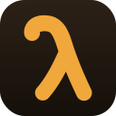

<p align="center">
  
</p>

<h1 align="center">Den</h1>

<p align="center">
  <b>Mission control for every agent on your machine.</b>
</p>

<p align="center">
  Watch your <code>lionagi</code> runs and Claude Code sessions live, without leaving VS Code.
</p>

<p align="center">
  
  
  
</p>

---

## Why Den

Every agent you run (`li agent`, `li o`, Claude Code) lands in **one live tree**, grouped by project and streamed as it happens. No web app, no dashboard tab to babysit, and nothing leaves your machine. Den runs a small local backend (`python -m lionagi.studio`) over `localhost` and renders everything as native VS Code.

It is **read-only observability**: you start runs the way you already do, and Den watches them.

## What shows up

| What | Description |
|---|---|
| **lionagi runs** | Everything from `li agent` and `li o`, grouped by project and streamed live. |
| **Claude Code sessions** | Your local Claude Code transcripts, mirrored into the same tree. |
| **Active band** | A pinned group at the top with everything running right now, across every project. |

## Two ways to look at a run

- **Observe**: the run detail panel attaches to any run and streams its output live over SSE.
- **Trace**: **Den: View Run Tree** draws the run's branch and agent DAG with typed nodes and per-run cost, refreshed as it progresses.

## Get started

```bash
pip install 'lionagi[studio]'
```

1. Install Den from the Marketplace, or from Open VSX for Cursor / VSCodium / Windsurf.
2. Open the **Den** panel in the activity bar.
3. Den auto-starts the local backend (configurable). Start a run from your terminal or Claude Code, and it appears in the tree live.

## Settings

| Setting | Default | Description |
|---|---|---|
| `den.url` | `""` | Attach to an already-running backend. Empty means auto-spawn. |
| `den.pythonPath` | `""` | Python interpreter. Empty means auto-detect (`.venv`, then `uv`, then `python3`). |
| `den.port` | `8765` | Port when spawning the backend. |
| `den.host` | `"127.0.0.1"` | Host when spawning the backend. |
| `den.autoStart` | `true` | Spawn the backend when the extension activates. |
| `den.authToken` | `""` | Bearer token (`LIONAGI_STUDIO_AUTH_TOKEN`). |

## License

Apache 2.0, part of [lionagi](https://github.com/ohdearquant/lionagi). If Den is useful to you, a ⭐ on the repo helps.
