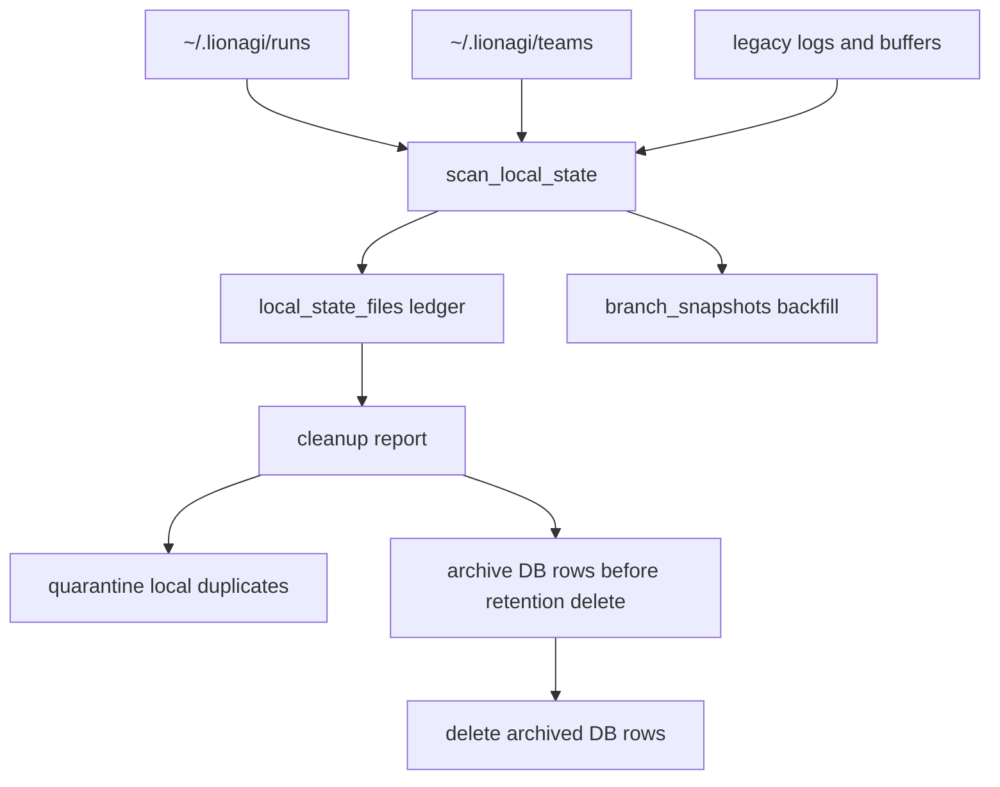

# ADR-0054: Local State File Cleanup and DB Migration Completion

Status: proposed
Date: 2026-05-27
Decision owners: @governance-maintainers
Depends on: ADR-0009 (SQLite state layer), ADR-0019 (teams DB migration), ADR-0027 (scheduler engine / state.db), ADR-0053 (artifact persistence), ADR-0059 (StateStore backend boundary)
Related: ADR-0024 (session health and admin surface), ADR-0028 (status reason model), ADR-0033 (unified entity state)

## Context

LionAGI has already moved most user-facing operational state into `state.db`, but local files
still keep enough authority to block safe cleanup. The current SQLite schema contains sessions,
branches, messages, progressions, projects, definitions, shows, plays, teams, invocations,
schedules, artifacts, admin events, and status transitions (`lionagi/state/schema.sql:41`,
`lionagi/state/schema.sql:69`, `lionagi/state/schema.sql:79`, `lionagi/state/schema.sql:97`,
`lionagi/state/schema.sql:193`, `lionagi/state/schema.sql:220`, `lionagi/state/schema.sql:239`,
`lionagi/state/schema.sql:265`, `lionagi/state/schema.sql:310`,
`lionagi/state/schema.sql:354`, `lionagi/state/schema.sql:380`,
`lionagi/state/schema.sql:485`, `lionagi/state/schema.sql:540`). `StateDB` exposes async methods
for those surfaces, including sessions (`lionagi/state/db.py:755`), projects
(`lionagi/state/db.py:1096`), schedules (`lionagi/state/db.py:1185`), artifacts
(`lionagi/state/db.py:1658`), branches (`lionagi/state/db.py:1784`), shows
(`lionagi/state/db.py:1935`), plays (`lionagi/state/db.py:2059`), and definitions
(`lionagi/state/db.py:2252`).

The remaining local state is not only a disk-usage problem. It is a correctness and governance
problem:

- `~/.lionagi/runs/{run_id}/run.json` and `branches/{branch_id}.json` are still used for resume
  and some Studio detail paths.
- `~/.lionagi/teams/*.json` remains a compatibility source for team workflows.
- legacy logs and stream buffers can contain prompts, model outputs, tool payloads, and secrets.
- cleanup decisions need a durable audit trail so an operator can explain why a file was retained,
  quarantined, or removed.

The existing import and prune commands expose the sequencing bug. `_import_runs()` skips a run
as soon as the session row already exists (`lionagi/cli/state.py:87`). That means a machine that
previously imported sessions can still lack DB branch snapshots. A later "backfill by running
import again" would silently skip the exact runs needing snapshot backfill. `_prune()` deletes DB
sessions and then sweeps messages through direct SQLite calls (`lionagi/cli/state.py:644`,
`lionagi/cli/state.py:683`, `lionagi/cli/state.py:690`) without an archive step. This conflicts
with the archive-before-delete rule needed for governed retention.

Studio security also affects cleanup. When `LIONAGI_STUDIO_AUTH_TOKEN` is set, current middleware
does not protect ordinary GET routes such as `/api/stats` (`apps/studio/server/app.py:52`,
`apps/studio/server/app.py:86`). Cleanup reports, run detail, artifact detail, logs, and path
provenance are shared state and must not be readable without the bearer token.

ADR-0054 completes the local migration by making DB records authoritative for resume and Studio
reads, adding a cleanup ledger in Phase 0, backfilling branch snapshots even when session rows
already exist, and making destructive DB retention impossible without an archive.



## Decision

### 1. Make `state.db` authoritative for local execution state

The authoritative store for local execution state is the `StateStore` boundary from ADR-0059,
backed by SQLite by default. Local files under `~/.lionagi/runs/`, `~/.lionagi/logs/agents/`,
and `~/.lionagi/teams/` become compatibility caches or explicit export artifacts.

| Surface | Current source | New source | Fallback window |
|---|---|---|---|
| `li agent -r` / resume | branch JSON files | `branch_snapshots`, then normalized DB reconstruction, then local file fallback | one release |
| Studio runs list | DB sessions | unchanged | none |
| Studio run detail | `run.json` plus branch JSON | sessions, branches, progressions, messages, artifacts, branch snapshots | one release |
| Studio teams | team JSON files | `teams` and `team_messages` | one release |
| Team CLI | JSON files and file locking | StateStore transaction | one release |
| stream buffers | JSONL files | messages and session event APIs | no Studio fallback |

### 2. Add Phase 0 schema before scan classification depends on it

Phase 0 must add every table and API the scan uses. The first shippable phase therefore includes
`branch_snapshots`, `local_state_files`, and `archive_manifest`, plus async `StateDB` methods for
all three. Scan-only cleanup must not claim to classify branch snapshots or record ledger rows
until these schema changes are applied.

```sql
CREATE TABLE IF NOT EXISTS branch_snapshots (
  branch_id       TEXT PRIMARY KEY REFERENCES branches(id) ON DELETE CASCADE,
  session_id      TEXT NOT NULL REFERENCES sessions(id) ON DELETE CASCADE,
  created_at      REAL NOT NULL,
  updated_at      REAL NOT NULL,
  snapshot_json   JSON NOT NULL,
  sha256          TEXT NOT NULL,
  source_path     TEXT,
  source_mtime    REAL,
  source_size     INTEGER,
  schema_version  INTEGER NOT NULL DEFAULT 1
);

CREATE INDEX IF NOT EXISTS idx_branch_snapshots_session
  ON branch_snapshots(session_id);
CREATE INDEX IF NOT EXISTS idx_branch_snapshots_updated
  ON branch_snapshots(updated_at DESC);

CREATE TABLE IF NOT EXISTS local_state_files (
  id                   TEXT PRIMARY KEY,
  kind                 TEXT NOT NULL CHECK(
                         kind IN (
                           'run_dir', 'run_manifest', 'branch_snapshot',
                           'stream_buffer', 'team_json', 'legacy_agent_log',
                           'artifact_cache', 'unknown'
                         )
                       ),
  path                 TEXT NOT NULL UNIQUE,
  sha256               TEXT,
  size_bytes           INTEGER NOT NULL DEFAULT 0,
  mtime                REAL,
  linked_entity_type   TEXT CHECK(
                         linked_entity_type IS NULL
                         OR linked_entity_type IN ('session', 'branch', 'team', 'artifact')
                       ),
  linked_entity_id     TEXT,
  verification_status  TEXT NOT NULL CHECK(
                         verification_status IN (
                           'verified', 'orphan', 'active', 'corrupt',
                           'unsafe_path', 'unsupported', 'skipped'
                         )
                       ),
  verification_reason  TEXT NOT NULL,
  scanned_at           REAL NOT NULL,
  pruned_at            REAL,
  quarantine_path      TEXT,
  cleanup_run_id       TEXT,
  node_metadata        JSON
);

CREATE INDEX IF NOT EXISTS idx_local_state_files_kind_status
  ON local_state_files(kind, verification_status);
CREATE INDEX IF NOT EXISTS idx_local_state_files_entity
  ON local_state_files(linked_entity_type, linked_entity_id)
  WHERE linked_entity_id IS NOT NULL;
CREATE INDEX IF NOT EXISTS idx_local_state_files_cleanup_run
  ON local_state_files(cleanup_run_id)
  WHERE cleanup_run_id IS NOT NULL;

CREATE TABLE IF NOT EXISTS archive_manifest (
  id              TEXT PRIMARY KEY,
  created_at      REAL NOT NULL,
  source_db       TEXT NOT NULL,
  cutoff          REAL NOT NULL,
  keep_recent     INTEGER NOT NULL,
  entity_counts   JSON NOT NULL,
  sha256          TEXT NOT NULL,
  tool_version    TEXT NOT NULL
);
```

`source_path` and `path` are internal ledger values. Studio and CLI JSON responses must redact or
relativize paths before display.

### 3. Publish async snapshot, ledger, cleanup, and archive APIs

All new APIs are async and go through `StateStore` / `StateDB`. The implementation must not use
database-specific transaction setup in CLI code; it uses `async with store.transaction()`.

```python
async def upsert_branch_snapshot(
    self,
    *,
    branch_id: str,
    session_id: str,
    snapshot: dict[str, Any],
    source_path: str | None = None,
    source_mtime: float | None = None,
    source_size: int | None = None,
) -> None: ...

async def get_branch_snapshot(self, branch_id: str) -> dict[str, Any] | None: ...

async def list_branch_snapshots_for_session(
    self, session_id: str
) -> list[dict[str, Any]]: ...

async def record_local_state_file(self, record: dict[str, Any]) -> None: ...

async def list_local_state_files(
    self,
    *,
    kind: str | None = None,
    verification_status: str | None = None,
    cleanup_run_id: str | None = None,
    limit: int = 500,
) -> list[dict[str, Any]]: ...

async def archive_rows_before_delete(
    self,
    *,
    archive_path: Path,
    session_ids: Sequence[str],
    actor: str,
) -> dict[str, Any]: ...
```

Cleanup API:

```python
@dataclass(frozen=True, slots=True)
class CleanupConfig:
    roots: tuple[Path, ...]
    include_kinds: frozenset[str]
    older_than_seconds: int
    keep_recent_runs: int
    dry_run: bool = True
    quarantine: bool = True
    include_orphans: bool = False
    archive_db: Path | None = None
    require_snapshot: bool = True


@dataclass(frozen=True, slots=True)
class CleanupCandidate:
    kind: str
    path: Path
    size_bytes: int
    mtime: float
    linked_entity_type: str | None
    linked_entity_id: str | None
    verification_status: str
    reason: str
    sha256: str | None = None
    inode: int | None = None
    device: int | None = None


@dataclass(frozen=True, slots=True)
class CleanupReport:
    scanned: int
    verified: int
    orphan: int
    active: int
    corrupt: int
    unsafe_path: int
    prunable: int
    quarantined: int
    deleted: int
    bytes_reclaimable: int
    bytes_reclaimed: int
    cleanup_run_id: str
    candidates: tuple[CleanupCandidate, ...]


async def scan_local_state(store: StateStore, config: CleanupConfig) -> CleanupReport: ...

async def cleanup_local_state(store: StateStore, config: CleanupConfig) -> CleanupReport: ...

async def verify_run_dir(store: StateStore, path: Path) -> CleanupCandidate: ...
async def verify_branch_snapshot(store: StateStore, path: Path) -> CleanupCandidate: ...
async def verify_team_json(store: StateStore, path: Path) -> CleanupCandidate: ...
async def verify_legacy_agent_log(store: StateStore, path: Path) -> CleanupCandidate: ...
```

Resume API:

```python
async def load_branch_for_resume(branch_id: str, store: StateStore) -> tuple[str | None, Branch]:
    snapshot = await store.get_branch_snapshot(branch_id)
    if snapshot is not None:
        return snapshot["session_id"], Branch.from_dict(snapshot["snapshot_json"])
    return await load_branch_from_local_fallback(branch_id)
```

The fallback helper may remain synchronous internally because it reads one local JSON file, but
the public resume loader is async and is awaited from async CLI call sites.

### 4. Backfill snapshots even when session rows already exist

`li state import` must stop treating "session row exists" as "nothing else to do." Import remains
idempotent, but snapshot backfill is a separate pass that always scans branch JSON files and
upserts missing or stale `branch_snapshots`.

```python
async def import_runs(*, backfill_snapshots: bool = True) -> dict[str, int]:
    async with StateDB() as db:
        for run_dir in iter_run_dirs():
            manifest = read_manifest(run_dir)
            session = await db.get_session(manifest.run_id)
            if session is None:
                await import_normalized_rows(db, run_dir, manifest)
            if backfill_snapshots:
                await backfill_branch_snapshots_for_run(db, run_dir, manifest.run_id)
```

`backfill_branch_snapshots_for_run()` reads every `branches/*.json`, computes SHA-256, extracts
`branch_id` and `session_id`, verifies that the branch row exists or can be created from the
snapshot metadata, and upserts `branch_snapshots`. A test fixture must cover the critical case:
sessions and branches already exist, `branch_snapshots` is empty, and rerunning import fills the
snapshot table.

### 5. Implement archive-before-delete in Phase 0

Archive-before-delete is not deferred. Phase 0 changes destructive DB retention so it cannot
delete sessions, branches, messages, teams, artifacts, or related status rows unless one of these
is true:

1. the command is a dry run;
2. the command supplies `--archive-db` and `archive_rows_before_delete()` writes a valid
   `archive_manifest`; or
3. the command deletes only duplicated local files and leaves all DB rows live.

`li state prune` is therefore updated in Phase 0:

```bash
li state prune --keep-days 30 --keep-n 100 --dry-run
li state prune --keep-days 30 --keep-n 100 --archive-db ~/.lionagi/state-archive.db --apply
```

A non-dry-run DB prune without `--archive-db` fails closed with a clear error. Local file cleanup
can quarantine verified duplicate files without archiving DB rows because the authoritative DB
records remain live.

Archive contents include FK closure for selected sessions: sessions, branches, related
progressions, messages referenced by those progressions, artifacts, status transitions,
schedule_runs, invocations where selected sessions are the only remaining children, and
admin_events for the retention action.

### 6. Revalidate filesystem objects at apply time

Scan-time verification is advisory. Before moving or deleting any file, apply must:

1. `lstat` the path immediately before action.
2. Reject symlinks.
3. Reject unexpected hard-link counts for file kinds where link count should be one.
4. Compare device, inode, mtime, size, and SHA-256 where the scan ledger has a hash.
5. Resolve the destination under `~/.lionagi/trash/state-cleanup/{cleanup_run_id}/`.
6. Move to quarantine first with no-follow semantics.
7. Record the ledger update and `admin_events` entry inside a StateStore transaction.
8. Purge quarantine only through a separate explicit command after another dry-run preview.

The old "Studio active connection counter" is not used by standalone CLI cleanup because it is
process-local. Cross-process safety is provided by the StateStore transaction and a maintenance
lock. A Studio-hosted admin cleanup endpoint may additionally check its in-process connection
counter before it calls the same cleanup service.

### 7. Require bearer auth for Studio cleanup, run, artifact, and state reads

When `LIONAGI_STUDIO_AUTH_TOKEN` is set, all `/api/*` endpoints require bearer auth for all HTTP
methods. Cleanup reports, run detail, artifact reads, schedules, projects, stats, logs, and admin
events are not public read surfaces. This ADR relies on ADR-0059's middleware change and adds no
exception for cleanup endpoints.

## Implementation

| Phase | Scope | Files | Estimate |
|---|---|---|---|
| 0. Schema, archive gate, and import backfill contract | Add `branch_snapshots`, `local_state_files`, and `archive_manifest`; add async DB APIs; update `li state prune` so DB deletes require archive; change `li state import` to run snapshot backfill even when sessions already exist. | `lionagi/state/schema.sql`, `lionagi/state/db.py`, `lionagi/cli/state.py`, `tests/state/test_branch_snapshots.py`, `tests/cli/test_state_archive_gate.py` | 550-850 LOC |
| 1. Scan-only cleanup | Implement `state_cleanup.py` scan, ledger writes, path classification, hashing, and stable dry-run reports. No file deletion. | `lionagi/cli/state_cleanup.py`, `lionagi/cli/state.py`, `tests/cli/test_state_cleanup_scan.py` | 350-550 LOC |
| 2. DB-first resume and Studio detail | Write snapshots for new agent and flow runs; use async `load_branch_for_resume`; build Studio run detail from DB first and local files only as one-release fallback. | `lionagi/cli/agent.py`, `lionagi/cli/orchestrate/_orchestration.py`, `lionagi/cli/_runs.py`, `apps/studio/server/services/runs.py` | 300-550 LOC |
| 3. Team DB primary path | Route team CLI and Studio teams through `teams` and `team_messages`; keep JSON export as an explicit command. | `lionagi/cli/team.py`, `apps/studio/server/services/teams.py`, tests | 250-450 LOC |
| 4. Apply cleanup and quarantine | Implement apply-time revalidation, quarantine moves, ledger updates, maintenance lock, and purge command. | `lionagi/cli/state_cleanup.py`, `lionagi/cli/state.py`, tests | 300-500 LOC |
| 5. Remove fallbacks | After one release, remove local run/team read fallbacks from Studio and CLI resume; keep explicit export/import tools. | `apps/studio/server/services/runs.py`, `lionagi/cli/_runs.py`, `lionagi/cli/team.py` | 150-300 LOC net reduction |

MVP acceptance:

- `li state import` backfills branch snapshots for runs whose session rows already exist.
- `li state prune --apply` without archive fails closed.
- `li state cleanup --dry-run` records `local_state_files` and mutates no local files.
- `li agent -r <branch_id>` uses DB snapshots when local branch JSON is absent.
- Studio GET routes are bearer-protected when the token is configured.

Testability estimate `tau = 0.84`: schema, backfill, archive gate, dry-run idempotence, and
resume behavior are directly testable. The residual risk is platform-specific filesystem
rename behavior, covered by integration tests on supported OS targets.

## Security

1. All Studio `/api/*` routes require bearer auth when `LIONAGI_STUDIO_AUTH_TOKEN` is set,
   including GET routes.
2. Cleanup reports must not include message content, artifact content, raw logs, secrets, or
   unredacted absolute paths. Internal ledgers may store paths for forensics.
3. Cleanup follows symlink-safe path handling. Deletion never follows symlinks.
4. Apply revalidates device, inode, mtime, size, and hash where available to reduce time-of-check
   to time-of-use risk.
5. Active sessions are never deleted or quarantined by default. Running sessions, recently updated
   sessions, and the most recent `keep_recent_runs` are retained.
6. Local JSON is untrusted input. Parse failures become `corrupt`; corrupt files are reported and
   retained unless a future explicit orphan policy says otherwise.
7. DB retention deletion requires an archive manifest and FK-clean archive copy before live rows
   are deleted.
8. SQL values use parameter binding. Dynamic table and column names come only from internal
   allowlists.
9. Quarantine is the default apply behavior. Hard purge is a separate command with a dry-run
   preview.
10. Hashes are migration integrity checks, not a tamper-proof evidence chain.

## Migration

1. Apply the Phase 0 schema migration to SQLite. Postgres receives the same logical columns through
   ADR-0059 schema parity.
2. Run import with snapshot backfill:

   ```bash
   li state import --backfill-snapshots
   li state import-teams
   ```

   This command scans branch JSON files even when `sessions.id` already exists.

3. Verify snapshot coverage:

   ```bash
   li state cleanup --dry-run --include runs,teams,logs
   ```

4. Switch resume and Studio detail to DB-first reads.
5. Run cleanup scan repeatedly until counts are stable.
6. Apply local duplicate cleanup:

   ```bash
   li state cleanup --apply --include runs,teams,logs --older-than 30d --keep-recent-runs 100
   ```

7. For DB retention, archive first:

   ```bash
   li state prune \
     --keep-days 90 \
     --keep-n 100 \
     --archive-db ~/.lionagi/state-archive.db \
     --apply
   ```

8. Keep quarantined files for 14 days by default.
9. Remove local-file fallbacks after one release once CI and developer migration reports show
   DB-first paths cover resume, Studio detail, and team workflows.

Migration invariants:

- No file is removed unless its matching DB state exists or the operator explicitly includes
  orphans in a later non-MVP command.
- No DB row is deleted unless archive succeeds first.
- Cleanup is idempotent.
- Paths are canonicalized under `LIONAGI_HOME` or the configured quarantine/archive root.
- Snapshot backfill is idempotent and independent of session-row existence.

## Testing

- `tests/state/test_branch_snapshots.py`: schema creation, upsert idempotency, SHA changes,
  cascade on branch/session delete, and branch resume round trip.
- `tests/cli/test_import_snapshot_backfill.py`: session and branch rows already exist,
  `branch_snapshots` is empty, rerunning import fills snapshots.
- `tests/cli/test_state_archive_gate.py`: non-dry-run DB prune without archive fails; prune with
  archive writes `archive_manifest` before deleting rows.
- `tests/cli/test_state_cleanup_scan.py`: verified run dirs, branch snapshots, stream buffers,
  team JSON, legacy logs, corrupt JSON, missing DB rows, unsafe paths, and active sessions.
- `tests/cli/test_state_cleanup_apply.py`: dry-run non-mutation, apply-time revalidation,
  quarantine move, repeated apply, ledger rows, and `admin_events` insertion.
- `tests/studio/test_auth.py`: `/api/stats`, run detail, artifacts, schedules, projects, teams,
  and cleanup/admin GETs return 401 without token when auth is configured.
- Integration test: run a real temp `LIONAGI_HOME`, create an agent session, backfill snapshots,
  move branch JSON to quarantine, and resume by branch ID from DB.
- Integration test: seed a flow run, remove `run.json`, and verify Studio run detail from DB.
- Integration test: run retention prune with archive and confirm live DB FK checks pass.

## Consequences

- Phase 0 is larger than the prior draft because it includes the schema and archive gates the
  cleanup contract needs.
- Local cleanup becomes auditable before it becomes destructive.
- Existing imported runs get snapshot backfill instead of being skipped.
- DB retention becomes slower but defensible because archive precedes delete.
- Resume and Studio detail become portable across local cleanup and future Postgres deployment.
- The one-release fallback window preserves compatibility while making the DB-first path the
  default.
