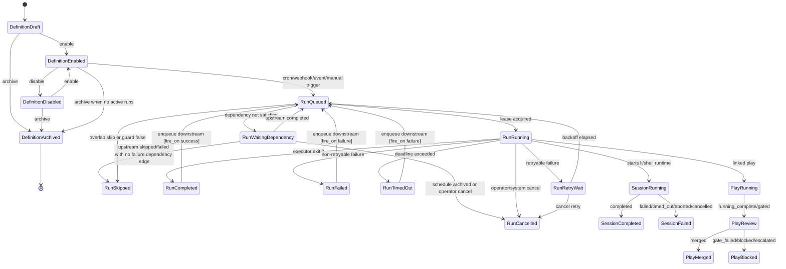

# ADR-0062: Scheduled Item State Machine

Status: accepted — activated by ADR-0101 (task-application surface & durable queue), 2026-07-08
Date: 2026-05-27
Decision owners: @governance-maintainers
Depends on: ADR-0025 (session status), ADR-0028 (status reasons), ADR-0056 (play control), ADR-0059 (StateStore)
Related: ADR-0061 (universal scheduler — consumes lifecycle_status and state_events defined here), ADR-0063 (task board work center)

## Context

LionAGI has several lifecycle vocabularies today, each useful in isolation but incomplete for
scheduled work. Sessions use the runtime statuses `running`, `completed`, `failed`, `timed_out`,
`aborted`, and `cancelled` in Python (`lionagi/state/db.py:203`, `lionagi/state/db.py:213`) and
store them without a SQLite `CHECK` so Python remains the source of truth
(`lionagi/state/schema.sql:122`, `lionagi/state/schema.sql:127`). Plays use workflow statuses such
as `pending`, `prepared`, `running`, `running_complete`, `gated`, `gate_failed`, `redoing`,
`merged`, `escalated`, `blocked`, and `aborted_after_finish`
(`lionagi/state/schema.sql:271`, `lionagi/state/schema.sql:273`, `lionagi/state/db.py:243`).
Invocations share the runtime terminal vocabulary (`lionagi/state/schema.sql:361`).

Schedule runs are narrower. The schema allows only `running`, `completed`, `failed`, `skipped`,
and `cancelled` (`lionagi/state/schema.sql:430`). The engine creates runs directly in `running`
state (`apps/studio/server/scheduler/engine.py:391`, `apps/studio/server/scheduler/engine.py:399`)
and then updates to `completed` or `failed` after the subprocess exits
(`apps/studio/server/scheduler/engine.py:437`, `apps/studio/server/scheduler/engine.py:454`).
This omits queueing, leasing, retry waits, dependency waits, manual cancellation, and webhook/event
deduplication.

ADR-0028 already established the correct audit pattern: every status-bearing entity has
denormalized current reason columns and append-only `status_transitions`
(`lionagi/state/schema.sql:531`, `lionagi/state/schema.sql:540`). `StateDB.update_status()` is the
single sanctioned mutation point today (`lionagi/state/db.py:905`, `lionagi/state/db.py:917`) and
inserts a transition history row in the same transaction (`lionagi/state/db.py:1004`,
`lionagi/state/db.py:1026`). However, the current implementation uses `BEGIN IMMEDIATE`
(`lionagi/state/db.py:970`), so this ADR defines the backend-neutral compare-and-swap API that
ADR-0059 must expose through `StateStore.transaction()`.

ADR-0056 adds play control states such as `paused`, `cancelling`, `killing`, and `retrying`
(`docs/adrs/ADR-0056-play-control-api.md:90`, `docs/adrs/ADR-0056-play-control-api.md:108`).
Those states are runner-control states, not play workflow states. Scheduled work must integrate
with pause/resume/cancel from Studio without adding control states to `plays.status`.

Coupling estimate after this decision: components `{TransitionService, StateStore, EventBus,
SchedulerEngine, PlayControl, StudioSSE, TaskBoard}` with deps `{TransitionService->StateStore,
TransitionService->EventBus, SchedulerEngine->TransitionService, PlayControl->TransitionService,
StudioSSE->EventBus, TaskBoard->EventBus, TaskBoard->StateStore}` gives `7 / (7 * 6) = 0.17`.

## Decision

Define one scheduled item lifecycle model with three layers:

1. **Schedule definition state**: whether a definition can produce future runs.
2. **Schedule run state**: the actual execution instance lifecycle.
3. **Linked runtime/workflow states**: session, invocation, play, and runner states remain owned by
   their existing ADRs but publish transition events consumed by the scheduler and task board.

All transitions go through an idempotent compare-and-swap API:

```python
await transition(
    entity_type="schedule_run",
    entity_id=run_id,
    from_state="queued",
    to_state="running",
    reason=StateReason(code="schedule_run.running.leased"),
    actor=Actor(type="scheduler", id=worker_id),
    idempotency_key=f"lease:{run_id}:{worker_id}",
)
```

If the current state is already `to_state` with the same idempotency key, the API returns the
existing transition. If the current state is not `from_state`, the API returns a conflict without
writing. Every successful transition emits an event for downstream triggers and Studio real-time
updates.

### Unified State Machine



### State Vocabulary

```python
# lionagi/state/lifecycle.py
from __future__ import annotations

from enum import StrEnum
from typing import Literal

from pydantic import BaseModel, Field


class ScheduleDefinitionState(StrEnum):
    DRAFT = "draft"
    ENABLED = "enabled"
    DISABLED = "disabled"
    ARCHIVED = "archived"


class ScheduleRunState(StrEnum):
    QUEUED = "queued"
    WAITING_DEPENDENCY = "waiting_dependency"
    RUNNING = "running"
    RETRY_WAIT = "retry_wait"
    COMPLETED = "completed"
    FAILED = "failed"
    TIMED_OUT = "timed_out"
    SKIPPED = "skipped"
    CANCELLED = "cancelled"


class Actor(BaseModel):
    type: Literal["scheduler", "operator", "system", "webhook", "agent"]
    id: str


class StateReason(BaseModel):
    code: str
    summary: str = ""
    evidence_refs: list[dict] = Field(default_factory=list)
    metadata: dict = Field(default_factory=dict)


class TransitionRequest(BaseModel):
    entity_type: str
    entity_id: str
    from_state: str | None
    to_state: str
    reason: StateReason
    actor: Actor
    idempotency_key: str


class TransitionResult(BaseModel):
    applied: bool
    conflict: bool = False
    previous_state: str | None = None
    current_state: str
    transition_id: str
    event_id: str | None = None
```

### Transition Rules

| Entity | From | To | Actor | Guard |
|---|---|---|---|---|
| schedule | `draft` | `enabled` | operator/system | action template validates; trigger validates; authz permits scheduling |
| schedule | `enabled` | `disabled` | operator/system | no guard; active runs are not cancelled automatically |
| schedule | `enabled` | `archived` | operator | no `queued`, `running`, or `retry_wait` runs |
| schedule_run | none | `queued` | scheduler/webhook/operator/system | definition is `enabled`; idempotency key has not fired |
| schedule_run | `queued` | `waiting_dependency` | scheduler | at least one dependency is unsatisfied |
| schedule_run | `waiting_dependency` | `queued` | scheduler/system | all required upstream runs completed successfully |
| schedule_run | `waiting_dependency` | `cancelled` | operator/system | schedule archived or operator cancel issued while waiting |
| schedule_run | `waiting_dependency` | `skipped` | scheduler/system | upstream run skipped or failed and no `fire_on='failure'` dependency edge exists |
| schedule_run | `queued` | `running` | scheduler | lease acquired; per-schedule and global concurrency limits pass |
| schedule_run | `queued` | `skipped` | scheduler | overlap policy is `skip`, guard false, or missed fire policy is `skip` |
| schedule_run | `running` | `completed` | scheduler | executor exit code is 0 and linked session/invocation terminal state is successful |
| schedule_run | `running` | `failed` | scheduler | nonzero exit or exception and retry policy exhausted |
| schedule_run | `running` | `timed_out` | scheduler/system | timeout deadline exceeded |
| schedule_run | `running` | `cancelled` | operator/system | ADR-0056 control accepted or process cancelled |
| schedule_run | `running` | `retry_wait` | scheduler | status in `retry_on` and attempt <= max_retries |
| schedule_run | `retry_wait` | `queued` | scheduler | backoff elapsed and schedule not archived |
| session | `running` | terminal | executor/operator/system | existing ADR-0025 transition rules; admin targets remain restricted to failed/aborted/cancelled (`lionagi/state/db.py:217`) |
| play | workflow states | workflow states | executor/operator | existing play guards; pause/resume is runner state, not `plays.status` |

### Reason Code Vocabulary

ADR-0028 uses three-segment reason codes and a Python source of truth in
`lionagi/state/reasons.py` (`lionagi/state/reasons.py:60`, `lionagi/state/reasons.py:147`). Extend
that pattern with:

```python
class ScheduleDefinitionReasons:
    ENABLED_OPERATOR = "schedule.enabled.operator"
    DISABLED_OPERATOR = "schedule.disabled.operator"
    DISABLED_POLICY = "schedule.disabled.policy"
    ARCHIVED_OPERATOR = "schedule.archived.operator"
    ARCHIVED_REPLACED = "schedule.archived.replaced"


class ScheduleRunReasons:
    QUEUED_CRON = "schedule_run.queued.cron"
    QUEUED_WEBHOOK = "schedule_run.queued.webhook"
    QUEUED_EVENT = "schedule_run.queued.event"
    QUEUED_MANUAL = "schedule_run.queued.manual"
    WAITING_DEPENDENCY = "schedule_run.waiting_dependency.upstream"
    CANCELLED_WHILE_WAITING = "schedule_run.cancelled.waiting_dependency"
    SKIPPED_UPSTREAM_TERMINAL = "schedule_run.skipped.upstream_terminal"
    RUNNING_LEASED = "schedule_run.running.leased"
    COMPLETED_OK = "schedule_run.completed.ok"
    FAILED_EXIT_NONZERO = "schedule_run.failed.exit_nonzero"
    FAILED_EXCEPTION = "schedule_run.failed.exception"
    TIMED_OUT_DEADLINE = "schedule_run.timed_out.deadline"
    SKIPPED_OVERLAP = "schedule_run.skipped.overlap"
    SKIPPED_MISSED_FIRE = "schedule_run.skipped.missed_fire"
    CANCELLED_OPERATOR = "schedule_run.cancelled.operator"
    RETRY_WAIT_BACKOFF = "schedule_run.retry_wait.backoff"
```

Existing `ScheduleReasons.FIRED_DUE`, `SKIPPED_OVERLAP`, and `SKIPPED_MISSED_FIRE`
(`lionagi/state/reasons.py:119`, `lionagi/state/reasons.py:122`) remain aliases during migration,
then become deprecated compatibility names.

### Event Emission

Every applied transition emits one event row and one in-process notification:

```python
class StateTransitionEvent(BaseModel):
    id: str
    entity_type: str
    entity_id: str
    previous_state: str | None
    state: str
    reason_code: str
    actor_type: str
    actor_id: str
    idempotency_key: str
    created_at: float
    metadata: dict = Field(default_factory=dict)
```

Event names are deterministic: `state.<entity_type>.<state>`, for example
`state.schedule_run.completed` and `state.play.gate_failed`. ADR-0061 event triggers subscribe to
these events for `on-session-complete`, `on-artifact-created`, and `on-gate-verdict`. ADR-0063 uses
the same stream for task board updates. Studio may expose this via SSE using the existing streaming
pattern in sessions (`apps/studio/server/routers/sessions.py:29`, `apps/studio/server/routers/sessions.py:62`)
and shows (`apps/studio/server/routers/shows.py:35`, `apps/studio/server/routers/shows.py:40`).

## Implementation

### Backend-Neutral Transition API

```python
# lionagi/state/transitions.py
from __future__ import annotations

from typing import Protocol


class TransitionStore(Protocol):
    async def transition(self, request: TransitionRequest) -> TransitionResult: ...
    async def list_transitions(
        self,
        entity_type: str,
        entity_id: str,
        *,
        limit: int = 100,
    ) -> list[StateTransitionEvent]: ...
```

Implementation requirements:

1. Use `async with store.transaction() as txn:` from ADR-0059 rather than SQLite-specific
   `BEGIN IMMEDIATE`.
2. Write the entity status, denormalized reason fields, `status_transitions`, and transition event
   atomically.
3. Use `(entity_type, entity_id, idempotency_key)` uniqueness to make retries safe.
4. Reject invalid `from_state` with a conflict result, not an exception.
5. Return the existing transition for duplicate idempotency keys.

### Schema Changes

```sql
ALTER TABLE schedules ADD COLUMN lifecycle_status TEXT NOT NULL DEFAULT 'enabled';
ALTER TABLE schedules ADD COLUMN status_reason_code TEXT;
ALTER TABLE schedules ADD COLUMN status_reason_summary TEXT;
ALTER TABLE schedules ADD COLUMN status_evidence_refs JSON;

ALTER TABLE status_transitions ADD COLUMN idempotency_key TEXT;
CREATE UNIQUE INDEX IF NOT EXISTS idx_status_transitions_idempotent
  ON status_transitions(entity_type, entity_id, idempotency_key)
  WHERE idempotency_key IS NOT NULL;

CREATE TABLE IF NOT EXISTS state_events (
  id              TEXT PRIMARY KEY,
  transition_id   TEXT NOT NULL REFERENCES status_transitions(id),
  event_name      TEXT NOT NULL,
  entity_type     TEXT NOT NULL,
  entity_id       TEXT NOT NULL,
  payload         JSON NOT NULL,
  created_at      REAL NOT NULL,
  delivered_at    REAL
);

CREATE INDEX IF NOT EXISTS idx_state_events_name_time
  ON state_events(event_name, created_at DESC);
CREATE INDEX IF NOT EXISTS idx_state_events_entity
  ON state_events(entity_type, entity_id, created_at DESC);
```

Add `schedule` to `VALID_ENTITY_TYPES` and `ENTITY_TYPE_TO_TABLE`, which currently list
`session`, `show`, `play`, `invocation`, `team`, and `schedule_run`
(`lionagi/state/reasons.py:21`, `lionagi/state/reasons.py:201`).

### StateMachine Implementation (`lionagi/runtime/state_machine.py`)

The generic state machine that backs both lifecycle definitions lives at
`lionagi/runtime/state_machine.py`. It is table-driven, thread-safe via `threading.Lock`, and
audit-ready via a history log.  No async, no metaclasses.

#### State Transition Diagrams (ASCII)

**Runner lifecycle** (`RUNNER_LIFECYCLE`):

```text
[start]
   │
   ▼
┌──────┐  start   ┌──────────┐  started  ┌─────────┐
│ idle │ ───────► │ starting │ ─────────► │ running │
└──────┘          └──────────┘           └────┬────┘
   ▲                    │  │              │   │   │
   │ reset              │  │ stop    pause│   │   │ fail
   │               fail │  │              ▼   │   ▼
   │               ─────┘  │        ┌────────┐│ ┌────────┐
   │                        │        │pausing ││ │ failed │
   │                        ▼        └────┬───┘│ └────────┘
   │                  ┌──────────┐   paused│   │ stop    ▲
   │                  │ stopping │◄────────┘   │         │ fail
   │                  └────┬─────┘◄────────────┘         │
   │                  stopped│        (stop from pausing/ │
   │                        ▼          paused/starting)   │
   │                  ┌─────────┐                         │
   └──────────────────│ stopped │   ─── fail ─────────────┘
         reset        └─────────┘   (stopping → failed)
```

Key transitions:

| From | Trigger | To |
|------|---------|----|
| idle | start | starting |
| starting | started | running |
| running | pause | pausing |
| pausing | paused | paused |
| paused | resume | running |
| running | stop | stopping |
| pausing | stop | stopping |
| paused | stop | stopping |
| starting | stop | stopping |
| stopping | stopped | stopped |
| starting / running / pausing / paused / stopping | fail | failed |
| stopped | reset | idle |
| failed | reset | idle |

**Schedule run lifecycle** (`SCHEDULE_LIFECYCLE`):

```text
[trigger]
   │
   ▼
┌─────────┐  activate  ┌────────┐  run   ┌─────────┐
│ pending │ ──────────►│ active │────────►│ running │
└────┬────┘            └───┬────┘         └────┬────┘
     │                     │ pause             │ complete
     │ cancel              ▼                   ▼
     │              ┌────────┐         ┌───────────┐
     │              │ paused │         │ completed │
     │              └────┬───┘         └───────────┘
     │              resume│ cancel
     │                   ▼     │    fail from active/running
     │               (active)  │         ▼
     │                         │    ┌────────┐
     └────────────────►         │    │ failed │
              cancel            ▼    └────────┘
                          ┌───────────┐
                          │ cancelled │
                          └───────────┘
```

Key transitions:

| From | Trigger | To |
|------|---------|----|
| pending | activate | active |
| pending | cancel | cancelled |
| active | run | running |
| active | pause | paused |
| active | fail | failed |
| active | cancel | cancelled |
| running | complete | completed |
| running | fail | failed |
| running | pause | paused |
| running | cancel | cancelled |
| paused | resume | active |
| paused | cancel | cancelled |

#### Guard Condition Examples

Guards are plain callables `(from_state, to_state, **ctx) -> bool` passed in `context` via
`sm.trigger(event, **context)`.

```python
# Guard: only allow a schedule run to start if concurrency limit is not reached
def concurrency_guard(from_state: str, to_state: str, *, active_count: int, limit: int, **_kw) -> bool:
    return active_count < limit

sm.trigger("run", active_count=3, limit=5)   # passes
sm.trigger("run", active_count=5, limit=5)   # blocked → StateMachineError

# Guard: only allow cancel if the operator has the right role
def operator_guard(from_state: str, to_state: str, *, role: str, **_kw) -> bool:
    return role in {"admin", "operator"}

sm.trigger("cancel", role="viewer")   # blocked
sm.trigger("cancel", role="operator") # passes

# Multiple guards on the same (from_state, trigger): evaluated left-to-right,
# first passing candidate wins.
sm2 = StateMachine(
    "multi_guard",
    initial_state="queued",
    transitions=[
        Transition("queued", "running", "run",
                   guard=lambda _f, _t, *, worker_ready=False, **kw: worker_ready),
        Transition("queued", "skipped", "run",
                   guard=lambda _f, _t, *, overlap=False, **kw: overlap),
    ],
)
sm2.trigger("run", worker_ready=True)   # → running
```

#### Action Callback Examples

Actions are plain callables `(from_state, to_state, **ctx) -> None` that fire **after** the
guard passes but **before** the state is committed.  If the action raises, the state remains
unchanged.

```python
from lionagi.runtime.state_machine import StateMachine, Transition

audit_log: list[str] = []

def log_transition(from_state: str, to_state: str, *, run_id: str = "", **_kw) -> None:
    audit_log.append(f"{run_id}: {from_state} -> {to_state}")

sm = StateMachine(
    "audited_schedule",
    initial_state="pending",
    transitions=[
        Transition("pending", "active", "activate", action=log_transition),
        Transition("active",  "running", "run",      action=log_transition),
    ],
)
sm.trigger("activate", run_id="run-42")
sm.trigger("run",      run_id="run-42")
# audit_log == ["run-42: pending -> active", "run-42: active -> running"]

# Action that publishes an event (illustrative, not a real dependency):
def emit_event(from_state: str, to_state: str, *, entity_id: str, bus=None, **_kw) -> None:
    if bus is not None:
        bus.publish(f"state.schedule_run.{to_state}", {"entity_id": entity_id})

sm2 = StateMachine(
    "eventing",
    initial_state="pending",
    transitions=[Transition("pending", "active", "activate", action=emit_event)],
)
sm2.trigger("activate", entity_id="sched-7", bus=my_event_bus)
```

#### Integration Pattern with Existing `control.py`

`control.py` owns the `RunnerState` enum and `VALID_TRANSITIONS` dict used by `ControlService`
and `LocalRunner`.  `state_machine.py` provides an orthogonal, generic abstraction that does not
replace those tables; instead callers can wire a `StateMachine` as the authoritative gate before
delegating to the runner:

```python
from lionagi.runtime.control import ControlVerb, RunnerState
from lionagi.runtime.state_machine import RUNNER_LIFECYCLE, StateMachineError

class GatedControlService:
    """Wraps ControlService with a StateMachine gate."""

    def __init__(self, inner_service, *, run_id: str) -> None:
        self._svc = inner_service
        self._sm = RUNNER_LIFECYCLE.create()
        self._run_id = run_id

    async def dispatch(self, verb: ControlVerb, reason: str) -> None:
        trigger_map = {
            ControlVerb.PAUSE:   "pause",
            ControlVerb.RESUME:  "resume",
            ControlVerb.CANCEL:  "stop",
            ControlVerb.KILL:    "stop",
        }
        trigger = trigger_map.get(verb)
        if trigger is None:
            raise ValueError(f"Unsupported verb: {verb!r}")
        try:
            self._sm.trigger(trigger)   # raises StateMachineError if invalid
        except StateMachineError as exc:
            raise ValueError(str(exc)) from exc

        await self._svc.dispatch("session", self._run_id, ...)
```

The `RUNNER_LIFECYCLE` definition uses triggers (`start`, `started`, `pause`, `paused`,
`resume`, `stop`, `stopped`, `fail`, `reset`) that map cleanly to `ControlVerb` values and
the state updates already performed by `LocalRunner._cancel()` and friends.

### ADR-0056 Integration

Play control pause/resume/cancel targets runner state first. When a schedule run owns the linked
session, accepted controls also transition the schedule run:

| ADR-0056 control | Runner state | Schedule run effect |
|---|---|---|
| pause | `running -> pausing -> paused` | no schedule_run state change; emit `state.runner_handle.paused` |
| resume | `paused -> resuming -> running` | no schedule_run state change |
| cancel | `running/paused -> cancelling -> cancelled` | `schedule_run.running -> cancelled` |
| kill | `running/paused -> killing -> killed` | `schedule_run.running -> cancelled` with force-kill reason |
| retry | terminal -> `retrying` | new schedule_run attempt, linked by `retry_of_run_id` |

This preserves existing `plays.status` as workflow state and avoids adding `paused` to the play
vocabulary.

### Phasing and Estimates

| Phase | Scope | LOC estimate |
|---|---|---:|
| 0 | Add states/types, reason codes, schedule entity support in reason registry | 120-180 |
| 1 | Backend-neutral `transition()` with idempotency and tests for all schedule_run transitions | 260-420 |
| 2 | State event table, SSE adapter, event trigger bridge for ADR-0061 | 220-360 |
| 3 | ADR-0056 integration for cancel/retry and Studio control propagation | 180-280 |
| 4 | Migration/backfill and documentation | 120-220 |

Testability target: `tau = 0.90`. The transition graph is table-driven and can be tested with
parameterized cases for every allowed and rejected transition.

## Security

Transition writes require an authenticated actor. Scheduler/system actors use service identities;
operator actors come from Studio bearer auth. When `LIONAGI_STUDIO_AUTH_TOKEN` is set, all status
read endpoints and SSE streams that expose transition metadata require auth. The current middleware
does not protect all non-admin GETs (`apps/studio/server/app.py:56`, `apps/studio/server/app.py:60`),
so routers exposing transition history must enforce auth explicitly until the global floor is fixed.

Reason summaries are display text and may contain operational details. They must not include secret
values, raw webhook tokens, absolute filesystem paths, or full command env. Evidence references use
typed ids and public paths only.

## Migration

1. Add `lifecycle_status='enabled'` to existing schedules where `enabled=1`, `disabled` where
   `enabled=0`.
2. Backfill current running schedule rows to `running` with reason `schedule_run.running.leased`.
3. Backfill completed/failed/skipped/cancelled rows using existing reason columns when present,
   falling back to legacy imported reasons.
4. Keep `enabled` as a generated/compatibility field for one release; new code reads
   `lifecycle_status`.
5. Move current calls to `StateDB.update_status()` for schedule runs
   (`apps/studio/server/scheduler/engine.py:405`, `apps/studio/server/scheduler/engine.py:454`)
   onto `transition()`.

## Alternatives Considered

| Alternative | Why rejected |
|---|---|
| Reuse session statuses for schedule runs | Schedule runs need queued, waiting dependency, retry wait, and skipped states that are not session runtime states. |
| Add pause/resume to `plays.status` | ADR-0056 already owns runner control state; mixing control and workflow state breaks existing play semantics. |
| Let each subsystem emit ad hoc events | This repeats the reason-code problem ADR-0028 solved and makes webhook/event scheduling unreliable. |

## Consequences

Positive: every scheduled item has one auditable lifecycle, one reason vocabulary, and one event
stream. ADR-0061 can chain schedules and ADR-0063 can render operator work without reverse
engineering sessions or play rows.

Negative: transition writes become a shared platform primitive. Bugs in `transition()` affect
scheduler, play control, and task board behavior, so the implementation needs exhaustive transition
tests before use in production.

## References

- `lionagi/state/schema.sql:379`
- `lionagi/state/schema.sql:422`
- `lionagi/state/schema.sql:540`
- `lionagi/state/db.py:917`
- `lionagi/state/reasons.py:21`
