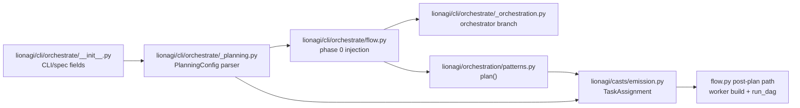
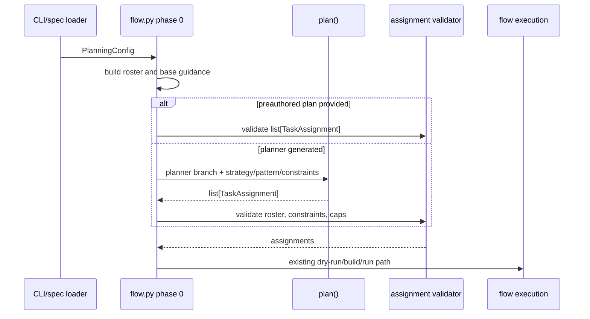

# ADR-0081: Configurable Flow Planning

**Status**: Proposed
**Date**: 2026-06-03
**Related**: #1197, [ADR-0079](ADR-0079-substrate-executor-provider-interface.md), [ADR-0080](ADR-0080-remote-sandbox-substrate-execution.md)

## Context

Issue #1197 asks for `li o flow` planning to expose the planner model, strategy,
planning pattern, constraints, and pre-authored/custom plans. The current code
has one live plan shape: `list[TaskAssignment]`. `lionagi/orchestration/patterns.py:56`
states the plan is not a bespoke model, and `_ASSIGNMENTS_FIELD` parses
`assignments` as `list[TaskAssignment]` at `lionagi/orchestration/patterns.py:58`.
`TaskAssignment` carries `task`, `assignee`, `inputs`, `exit_criteria`,
`depends_on`, and `modes` at `lionagi/casts/emission.py:256` through `:276`.

Flow planning is fixed today. `_run_flow_inner(...)` has no planning config
parameter at `lionagi/cli/orchestrate/flow.py:477`. Phase 0 builds a role/mode
guidance string at `lionagi/cli/orchestrate/flow.py:500` through `:511`, then
hard-codes a DAG planner call:

```python
# current: lionagi/cli/orchestrate/flow.py:513-516
progress("Planning DAG...")
assignments = await plan(
    env.orc_branch, prompt, roles=roster, dag=True, guidance=guidance, max_tasks=max_ops
)
```

The retry repeats the same `dag=True` planner path with stronger guidance at
`lionagi/cli/orchestrate/flow.py:521` through `:528`. After a plan exists, the
rest of flow already has the useful common path: cap runaway plans at
`lionagi/cli/orchestrate/flow.py:538` through `:542`, compute dependencies at
`lionagi/cli/orchestrate/flow.py:554`, display dry-run output at
`lionagi/cli/orchestrate/flow.py:567`, build workers at
`lionagi/cli/orchestrate/flow.py:653`, add operation nodes at
`lionagi/cli/orchestrate/flow.py:697`, and execute through `PlanningEngine.run_dag`
at `lionagi/cli/orchestrate/flow.py:865`.

The planner model is also fixed to the orchestrator branch. `_run_flow(...)`
accepts one `model_spec` at `lionagi/cli/orchestrate/flow.py:284`, passes it to
`setup_orchestration(...)` at `lionagi/cli/orchestrate/flow.py:336`, and
`setup_orchestration(...)` builds `env.orc_branch` from that model at
`lionagi/cli/orchestrate/_orchestration.py:424` through `:445`. That same
`env.default_model_spec` is shown to the planner as the worker default at
`lionagi/cli/orchestrate/flow.py:509` and used as worker fallback at
`lionagi/cli/orchestrate/_orchestration.py:551`.

The current CLI/spec surface has no planning fields. The flow parser defines
`model`, `prompt`, `--file`, `--playbook`, and `--agent` at
`lionagi/cli/orchestrate/__init__.py:139` through `:183`; later flow-specific
options include `--workers`, `--max-ops`, `--dry-run`, and `--reactive` but no
planner model, strategy, pattern, constraints, or pre-authored plan. Spec
validation accepts string fields `model`, `agent`, `team_mode`, `team_attach`,
and `reactive` at `lionagi/cli/orchestrate/__init__.py:638`; hydration passes
only the existing fields to `_run_flow(...)` at `lionagi/cli/orchestrate/__init__.py:937`
through `:967`.

## Problem

The planner is not configurable at the seam where the plan is produced. Users
can change the orchestrator/default model and cap total ops with `max_ops`, but
they cannot select a planner-only model, choose a planning strategy or prompt
pattern, provide structured plan constraints, or bypass model planning with a
pre-authored `list[TaskAssignment]`. Without a typed config object, adding these
knobs one by one would spread planning concerns across CLI parsing, spec
hydration, `flow.py`, and `patterns.py`.

## Decision

Add a small typed planning configuration layer that preserves
`list[TaskAssignment]` as the only executable plan contract. Flow injects this
configuration exactly before the current first `await plan(...)` call at
`lionagi/cli/orchestrate/flow.py:513` through `:516`. If a pre-authored plan is
present, flow validates it and skips both planner calls. Otherwise flow calls the
existing `plan(...)` helper with planner model, strategy, pattern, and
constraints applied.

## Concrete Proposed Design

### Component Diagram



### Sequence Diagram



### New Typed Planning Config

Add a CLI-facing helper module so parsing and validation do not bloat
`flow.py`.

```python
# lionagi/cli/orchestrate/_planning.py
from __future__ import annotations

from dataclasses import dataclass, field
from pathlib import Path
from typing import Literal, Mapping

from lionagi.casts.emission import TaskAssignment

PlanningStrategy = Literal["dag", "fanout"]


@dataclass(frozen=True, slots=True)
class PlanningConstraints:
    max_tasks: int = 0
    max_width: int | None = None
    max_depth: int | None = None
    allowed_operations: tuple[str, ...] = ("operate",)
    allowed_roles: tuple[str, ...] = ()


@dataclass(frozen=True, slots=True)
class PlanningPattern:
    name: str = "default"
    instruction: str | None = None
    guidance: str = ""
    discipline: str | None = None


@dataclass(frozen=True, slots=True)
class PlanningConfig:
    planner_model_spec: str | None = None
    strategy: PlanningStrategy = "dag"
    pattern: PlanningPattern = field(default_factory=PlanningPattern)
    constraints: PlanningConstraints = field(default_factory=PlanningConstraints)
    preauthored_plan: tuple[TaskAssignment, ...] = ()
    source_path: Path | None = None
```

`PlanningPattern` may customize instructions and guidance, but the executable
output remains `list[TaskAssignment]`. A custom pattern that emits any other
shape must include an adapter that converts it to `TaskAssignment` before flow
continues. This avoids reintroducing the removed `FlowPlan`/`FlowAgent` surface.

### Signature Sketches

Current outer flow signature:

```python
# lionagi/cli/orchestrate/flow.py:284-315
async def _run_flow(
    model_spec: str,
    prompt: str,
    *,
    ...
    max_ops: int = 0,
    dry_run: bool = False,
    show_graph: bool = False,
    reactive_spec: str = "all",
    ...
) -> tuple[str, str]: ...
```

Proposed outer flow signature:

```python
async def _run_flow(
    model_spec: str,
    prompt: str,
    *,
    ...
    max_ops: int = 0,
    planning: PlanningConfig | None = None,
    dry_run: bool = False,
    show_graph: bool = False,
    reactive_spec: str = "all",
    ...
) -> tuple[str, str]: ...
```

Current inner flow signature:

```python
# lionagi/cli/orchestrate/flow.py:477-493
async def _run_flow_inner(
    model_spec: str,
    prompt: str,
    *,
    env: OrchestrationEnv,
    ...
    max_ops: int = 0,
    dry_run: bool = False,
    show_graph: bool = False,
    reactive_spec: str = "all",
) -> str: ...
```

Proposed inner flow signature:

```python
async def _run_flow_inner(
    model_spec: str,
    prompt: str,
    *,
    env: OrchestrationEnv,
    ...
    max_ops: int = 0,
    planning: PlanningConfig | None = None,
    dry_run: bool = False,
    show_graph: bool = False,
    reactive_spec: str = "all",
) -> str: ...
```

Current planner helper signature:

```python
# lionagi/orchestration/patterns.py:123-132
async def plan(
    orchestrator: Branch,
    prompt: str,
    *,
    roles: list[str] | set[str],
    dag: bool = True,
    guidance: str = "",
    max_tasks: int = 0,
    context: dict | None = None,
) -> list[TaskAssignment]: ...
```

Proposed planner helper signature:

```python
async def plan(
    orchestrator: Branch,
    prompt: str,
    *,
    roles: list[str] | set[str],
    strategy: PlanningStrategy = "dag",
    pattern: PlanningPattern | None = None,
    constraints: PlanningConstraints | None = None,
    guidance: str = "",
    max_tasks: int = 0,
    context: dict | None = None,
) -> list[TaskAssignment]: ...
```

For compatibility, keep `dag: bool | None = None` as a deprecated keyword for
one release and translate `dag=True` to `strategy="dag"` and `dag=False` to
`strategy="fanout"`. This protects `fanout.py`, `PlanningEngine._plan`, and
tests that monkeypatch or inspect `plan(...)`.

### Exact Injection Point in `flow.py:plan()`

Inject after guidance construction and before the first planner call:

```python
# replace lionagi/cli/orchestrate/flow.py:513-516
progress("Planning DAG...")
assignments = await resolve_flow_plan(
    env=env,
    prompt=prompt,
    roles=roster,
    guidance=guidance,
    max_tasks=max_ops,
    planning=planning,
)
```

`resolve_flow_plan(...)` lives in `lionagi/cli/orchestrate/_planning.py` and
has this behavior:

1. If `planning.preauthored_plan` is non-empty, validate those assignments
   against the roster and constraints, then return them. This skips the current
   initial planner call and the empty-plan retry at
   `lionagi/cli/orchestrate/flow.py:521` through `:528`.
2. Otherwise call `plan(...)` with `strategy`, `pattern`, `constraints`, and
   `max_tasks`.
3. If the first generated plan is empty, retry once with the same config and the
   existing reinforced guidance, preserving the #1236 failure behavior at
   `lionagi/cli/orchestrate/flow.py:517` through `:536`.
4. Return `list[TaskAssignment]` to the existing cap/dependency/dry-run/build
   path starting at `lionagi/cli/orchestrate/flow.py:538`.

### Planner Model Injection

Extend `setup_orchestration(...)`, because the planner branch is created there:

```python
# current: lionagi/cli/orchestrate/_orchestration.py:386-401
def setup_orchestration(
    *,
    pattern_name: str,
    model_spec: str,
    agent_name: str | None,
    ...
) -> OrchestrationEnv: ...
```

```python
# proposed
def setup_orchestration(
    *,
    pattern_name: str,
    model_spec: str,
    agent_name: str | None,
    planner_model_spec: str | None = None,
    ...
) -> OrchestrationEnv: ...
```

`model_spec` remains the default worker model for compatibility.
`planner_model_spec or model_spec` builds `orc_imodel` at the current
`build_imodel_from_spec(...)` call site (`lionagi/cli/orchestrate/_orchestration.py:424`).
`env.default_model_spec` remains the worker fallback consumed by
`build_worker_branch(...)` at `lionagi/cli/orchestrate/_orchestration.py:551`.
If `agent_name` supplies an orchestrator profile and no `planner_model_spec`,
current behavior remains: the profile can fill the planner model and, when no
worker model is provided, the default worker fallback.

### CLI and Spec Surface

Add flow CLI options next to the existing model/prompt/file/playbook/agent
surface at `lionagi/cli/orchestrate/__init__.py:139` through `:183`:

```text
--planner-model MODEL
--planning-strategy {dag,fanout}
--planning-pattern PATH_OR_NAME
--plan PATH
```

Add spec fields to `_validate_spec_fields(...)` around
`lionagi/cli/orchestrate/__init__.py:638`:

```yaml
planner_model: codex/gpt-5.5
planning_strategy: dag
planning_pattern:
  name: dependency-first
  instruction: "Decompose by dependency boundary..."
  guidance: "Prefer narrow verification gates."
planning_constraints:
  max_width: 4
  max_depth: 5
  allowed_operations: [operate]
plan:
  - task: "inventory current planning seams"
    assignee: explorer
    depends_on: []
```

Hydrate those fields in the existing file/playbook block at
`lionagi/cli/orchestrate/__init__.py:827` through `:859`, then pass
`planning=...` to `_run_flow(...)` at `lionagi/cli/orchestrate/__init__.py:937`
through `:967`.

### Constraint Semantics

`max_tasks` keeps current truncation behavior for generated plans. New
constraints should be fail-loud for pre-authored plans and warn/drop for
generated plans:

- Unknown assignees continue to be dropped by `plan(...)` as today at
  `lionagi/orchestration/patterns.py:155`.
- `allowed_roles` narrows the roster before planning and validates
  pre-authored plans.
- `allowed_operations` defaults to `("operate",)` because flow currently adds
  `"operate"` nodes at `lionagi/cli/orchestrate/flow.py:697`.
- `max_width` and `max_depth` validate dependency structure after
  `_earlier_dep_indices(...)` is computed at `lionagi/cli/orchestrate/flow.py:554`.

### Library Planning Engine

`PlanningEngine.__init__` currently exposes role and reactive knobs only at
`lionagi/engines/planning.py:82` through `:90`, and `_plan(...)` calls
`plan(..., dag=True, max_tasks=max_ops)` at `lionagi/engines/planning.py:128`
through `:132`. After CLI flow support lands, mirror `PlanningConfig` into
`PlanningEngine` with the same defaults so library and CLI users do not diverge.
Do not block the CLI #1197 slice on that secondary integration.

## Coupling and Testability

Proposed components: CLI parser/spec loader, `_planning.py`, `flow.py`,
`_orchestration.py`, and `patterns.py`. Required direct dependencies are:

- CLI parser/spec loader -> `_planning.py`
- `_planning.py` -> `TaskAssignment`
- `flow.py` -> `_planning.py`
- `_planning.py` -> `patterns.plan`
- `_orchestration.py` -> planner model field

With 5 components and 5 direct dependencies, `k = 5 / (5 * 4) = 0.25`, below
the 0.3 target. Testability target `tau = 0.85`: unit tests can cover config
parsing, pre-authored plan validation, planner retry preservation, planner model
selection, and dry-run output without invoking real providers.

## Consequences

**Positive**

- Keeps the executable plan contract as `list[TaskAssignment]`.
- Adds planner-only model routing without changing worker model precedence.
- Gives custom plans an exact insertion point before the current planner call.
- Keeps #1236 empty-plan retry and failure behavior for generated plans.
- Avoids a second execution/provider stack; planner model strings still use
  `build_imodel_from_spec(...)`.

**Negative**

- Flow gains one more configuration object and parser surface.
- `plan(...)` becomes broader; compatibility requires a one-release `dag=`
  adapter.
- Constraint validation must be carefully split between pre-authored and
  model-generated plans so generated plans remain usable.

## Alternatives Considered

| Alternative | Trade-off |
|-------------|-----------|
| Prompt-only configuration through extra guidance | Lowest implementation cost, but it hides strategy and constraints in prose, makes custom plans impossible, and leaves planner model selection unsolved. |
| Reintroduce `FlowPlan`/`FlowAgent`/`FlowOp` | Could carry more planning metadata, but it contradicts the current clean-break contract in `patterns.py:56` and would force downstream execution code to support two plan shapes. |
| Build a separate planner engine/provider stack | Gives maximum flexibility, but duplicates `Branch`, `iModel`, and provider resolution. The existing `env.orc_branch` and `build_imodel_from_spec(...)` path already provides the needed planner model seam. |
| Treat pre-authored plans as executable graphs, not `TaskAssignment` lists | Bypasses planner limitations, but skips the role, mode, dependency, dry-run, artifact, and reactive plumbing already built around `TaskAssignment`. |

## Migration and Compatibility

1. Land `_planning.py` with default `PlanningConfig()` and no behavior change.
2. Add `planner_model_spec` to `setup_orchestration(...)`; default to current
   `model_spec` behavior when absent.
3. Add `planning` to `_run_flow(...)` and `_run_flow_inner(...)`; default to
   generated DAG planning.
4. Extend `plan(...)` with `strategy`, `pattern`, and `constraints`; keep `dag=`
   as a deprecated compatibility keyword for one release.
5. Add CLI/spec fields and hydrate them into `PlanningConfig`.
6. Add tests in `tests/cli/orchestrate/test_flow_planning.py` for pre-authored
   plan dry-run, empty generated plan retry, planner model selection, and spec
   validation. Add focused `patterns.plan` tests for strategy and pattern
   instruction selection.

Existing commands without planning flags continue to plan the same DAG with the
same orchestrator/default model and the same `max_ops` behavior.

## Open Questions

- Preferred CLI names: `--planner-model` vs `--planning-model`, and `--plan`
  vs `--custom-plan`.
- Should `planning_pattern` accept arbitrary files on first release, or only a
  named built-in set plus inline spec fields?
- Should `max_width`/`max_depth` fail generated plans or warn and retry with
  reinforced guidance?
- Should planner-only model selection also apply to `fanout` now, or should
  this ADR scope stay limited to `flow` because #1197 names the auto-DAG seam?
- Should `PlanningEngine` receive `PlanningConfig` in the same implementation
  slice, or should CLI flow land first with a follow-up library parity issue?

## References

- #1197: Configurable planning.
- `../explorer-3/planning_inventory.md`.
- `lionagi/cli/orchestrate/flow.py:284`, `:477`, `:500`, `:513`, `:521`, `:538`, `:653`, `:697`, `:865`.
- `lionagi/cli/orchestrate/__init__.py:139`, `:638`, `:827`, `:937`.
- `lionagi/cli/orchestrate/_orchestration.py:386`, `:424`, `:551`.
- `lionagi/orchestration/patterns.py:56`, `:58`, `:123`, `:143`, `:155`.
- `lionagi/casts/emission.py:256`.
- `lionagi/engines/planning.py:82`, `:128`.
