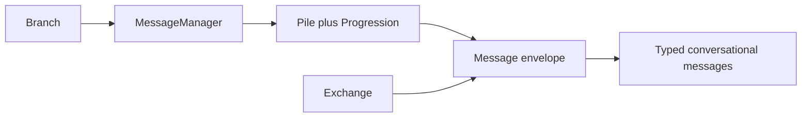

# ADR-0006: Conversational Message Envelope and Ordered History

- **Status**: Proposed
- **Kind**: Retrospective
- **Area**: messages-context
- **Date**: 2026-07-09
- **Relations**: none

## Context

LionAGI uses one identifiable record shape for conversation turns and routed inter-branch traffic.
`Message` inherits graph identity and metadata from `Node`, adds `sender`, `recipient`, and an
optional grouping `channel`, and renders either its content object's `rendered` value or the string
form of arbitrary content. The generic envelope is used directly by `Exchange`; conversational
records specialize it with typed content.

A message's role is fixed by its concrete class rather than accepted from serialized or caller
input. `System`, `Instruction`, and `AssistantResponse` have the `system`, `user`, and `assistant`
roles, while `ActionRequest` and `ActionResponse` both have the `action` role. The generic
`Message` has the `unset` role. This prevents a caller-supplied role from changing the semantics of
a typed message.

Subtype content retains provider-neutral conversational data. Assistant responses keep normalized
display text in content and the raw provider response in metadata. Action content keeps the
function, arguments, output or error, and counterpart identifier; responses created through
`MessageManager`'s new-response factory establish links in both directions. Instruction content
also carries rendering and current-call configuration, a boundary addressed by ADR-0007.

Each `Branch` owns one `MessageManager`. The manager owns a `Pile[Message]`, its ordered
`Progression`, the optional canonical system message, construction factories, typed history views,
and message-added callbacks. The branch exposes the manager and its records as facade properties
while retaining ownership of turn execution.

Two public labels are weaker than their names suggest. `Sendable` is an empty marker and does not
enforce sender or recipient fields. `RoledMessage` is exactly an alias of `Message`, with no runtime
or semantic distinction. Routing also distinguishes `recipient=None`, which is broadcast, from the
default `MessageRole.UNSET`, which `is_direct` currently classifies as direct.

## Decision

`Message` is the single concrete identity, routing, and rendering envelope, and `MessageManager` is
the branch-owned ordered record store. The load-bearing invariants are:

- role is a read-only class-level property; construction and deserialization discard a supplied
  `role` value;
- `sender` and `recipient` accept a `MessageRole`, UUID, plain string, or observable identity;
  non-null values serialize as strings, while `channel` is optional grouping metadata;
- generic routed traffic may use `Message` directly, while conversational turns use the five typed
  subclasses and their fixed roles;
- assistant raw responses remain metadata, and action request/response correlation remains durable
  message content;
- `MessageManager` owns record membership, order, the single system record, factories, and typed
  views; `Branch` owns operation execution and exposes those records through its facade;
- synchronous addition rejects asynchronous callbacks before mutating history, while callback
  failures after either synchronous or asynchronous addition are surfaced after the record has
  been inserted; and
- `RoledMessage` is a compatibility alias only, and `Sendable` is not the enforceable public data
  contract.

The implementation anchors are `lionagi/protocols/messages/message.py`,
`lionagi/protocols/messages/manager.py`, the role-specific modules under
`lionagi/protocols/messages/`, `lionagi/session/branch.py`, and `lionagi/session/exchange.py`.

## Consequences

Conversation history and inter-branch traffic share identity, serialization, routing metadata, and
rendering without a second transport hierarchy. Fixed subtype roles prevent role spoofing through
input data, and durable action links support tool-call correlation.

The broad envelope also exposes ambiguity. `Sendable` cannot be used to type a data-bearing routing
contract, `RoledMessage` suggests a hierarchy that does not exist, and default recipients are
classified differently from explicit broadcasts. Callback failure is not a transaction rollback:
a caller may receive an exception after the message is already present.

## Current-vs-ideal delta

| # | Delta | Size | Issue |
|---|-------|------|-------|
| 1 | Deprecate `RoledMessage` in public exports and type annotations, migrate internal and documented uses to `Message`, and remove the alias only at a declared breaking-change boundary; acceptance requires compatibility warnings and import coverage through the deprecation window. | S | (filled at issue-open time) |
| 2 | Define one routing state model for absent, unset, direct, and broadcast recipients; acceptance requires constructor defaults, validation, serialization, `is_direct`, and `is_broadcast` to agree under round-trip tests. | S | (filled at issue-open time) |
| 3 | Either replace `Sendable` with a runtime-checkable structural contract for typed sender and recipient fields or document and rename it as a marker; acceptance requires public annotations and conformance tests to match the chosen meaning. | S | (filled at issue-open time) |
| 4 | Publish message-added callback transaction semantics; acceptance requires sync and async tests to specify pre-mutation rejection, post-insertion callback failures, error aggregation, and any durable-hook retry responsibility. | S | (filled at issue-open time) |
| 5 | Implement the canonical turn-request compiler defined by ADR-0007 and remove prompt policy from durable records and `MessageManager`; acceptance requires chat and run payload characterization tests, transient fields absent from replayed history, and every legacy preparation entry point removed or delegated. | M | (filled at issue-open time) |

## Notes

Alternatives considered were separate envelopes for routed traffic and conversational turns, and a
mutable serialized role on one untyped record. The first duplicates identity and routing rules; the
second allows record data to contradict the concrete conversational type. The existing shared
envelope with fixed subtype roles preserves both use cases with less protocol surface.
