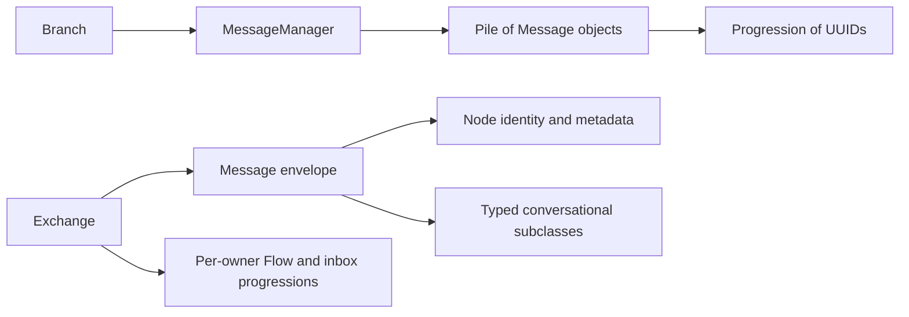

# ADR-0006: Conversational message envelope and ordered history

- **Status**: Accepted
- **Kind**: Retrospective
- **Area**: messages-context
- **Date**: 2026-07-09
- **Relations**: none

## Context

LionAGI uses one identifiable record shape for both conversational turns and routed inter-branch
traffic. That shared shape solves several distinct problems.

**P1 — Conversation records need durable identity without making identity part of prompt text.**
Messages participate in piles, progressions, cloning, serialization, and routing. They therefore
need the `Node` identity fields (`id`, `created_at`, `metadata`) independently of their rendered
content (`lionagi/protocols/graph/node.py`; `lionagi/protocols/generic/element.py`).

**P2 — The conversational role must not disagree with the concrete message type.** A serialized
record that says `role="assistant"` while carrying `InstructionContent` would make replay and
provider compilation ambiguous. The implementation fixes role on the concrete class and discards
caller-supplied role input (`lionagi/protocols/messages/message.py`).

**P3 — Provider-neutral content has several real shapes.** System policy, user instructions,
assistant output, action calls, and action results do not share one useful field set. They do share
identity, sender/recipient metadata, rendering, and serialization. Typed content dataclasses keep
those differences explicit without making the envelope provider-specific.

**P4 — Membership and order have different mutation and lookup needs.** History needs UUID lookup
and strict record membership, but model context needs an explicit ordered view. `Pile[Message]`
owns the objects; its `Progression` owns UUID order. A `Branch` may expose a selected progression
without deleting records (`lionagi/protocols/messages/manager.py`; `lionagi/session/branch.py`).

**P5 — Action results must remain correlated after intervening records and serialization.** An
action request and response cannot rely only on adjacency. Their content stores reciprocal IDs
when the manager constructs a new response.

**P6 — Message-added observers run across synchronous and asynchronous callers.** Persistence and
session observers need a stable rule for when callbacks run, what happens when one fails, and
whether a failed callback means the record was rolled back. The implementation deliberately
inserts first and reports callback failures afterward, except that the synchronous path rejects an
asynchronous callback before mutation.

**P7 — Routed traffic needs direct and broadcast delivery without a second envelope.** `Exchange`
queues the generic `Message` itself. Its routing semantics expose an existing ambiguity: explicit
`recipient=None` is broadcast, while the constructor default is `MessageRole.UNSET`, which
`is_direct` classifies as direct even though it is not a registered UUID.

| Concern | Decision |
|---------|----------|
| Identity, routing, role, and rendering | D1: Use `Message(Node, Sendable)` as the shared envelope and fix role by concrete class. |
| Provider-neutral conversational content | D2: Use five typed message classes with dataclass content and durable action correlation. |
| Ordered branch history | D3: Let `MessageManager` own `Pile[Message]`, its `Progression`, the one system record, factories, and typed views. |
| Observer transaction semantics | D4: Insert or replace the message before firing a callback snapshot; reject async hooks on the sync path before mutation. |
| Inter-branch routing | D5: Route the same generic `Message` through per-owner `Exchange` flows, with `None` as broadcast. |
| Compatibility labels | D6: Treat `RoledMessage` as an alias and `Sendable` as a marker, not as distinct enforceable contracts. |

This ADR deliberately does **not** decide:

- provider request compilation; ADR-0007 owns the target compilation boundary because request
  shaping is an operation concern, not a durable-record concern;
- pre-turn context retrieval and attribution; ADR-0008 owns that operational input;
- tool registration, invocation strategy, or tool error policy; those are action-operation
  concerns even though their outcomes are recorded as action messages;
- branch persistence backends; this ADR fixes the in-memory record contract that a persistence
  adapter serializes, not where it stores it; or
- a repaired recipient state model. The current ambiguity is recorded in the delta table rather
  than described as solved.

## Decision

### D1 — One identifiable envelope with a class-fixed role

`Message` is the single concrete identity, routing, grouping, content, and rendering envelope.
The shipped model contract is:

```python
# lionagi/protocols/generic/element.py
class Element(BaseModel, Observable):
    id: UUID = Field(default_factory=uuid4, frozen=True)
    created_at: float = Field(default_factory=lambda: now_utc().timestamp(), frozen=True)
    metadata: dict = Field(default_factory=dict)


# lionagi/protocols/graph/node.py
class Node(Element, Relational, AsyncAdaptable, Adaptable):
    content: Any = None
    embedding: list[float] | None = None


# lionagi/protocols/messages/message.py
class Message(Node, Sendable):
    _role: ClassVar[MessageRole] = MessageRole.UNSET
    _content_type: ClassVar[type] = MessageContent

    content: Any = None
    sender: MessageRole | str | UUID | None = MessageRole.UNSET
    recipient: MessageRole | str | UUID | None = MessageRole.UNSET
    channel: str | None = None

    @property
    def role(self) -> MessageRole: ...

    @property
    def is_broadcast(self) -> bool: ...

    @property
    def is_direct(self) -> bool: ...

    @property
    def chat_msg(self) -> dict[str, Any] | None: ...

    @property
    def rendered(self) -> str: ...
```

`MessageRole` is the closed role vocabulary used by these records:

```python
class MessageRole(str, Enum):
    SYSTEM = "system"
    USER = "user"
    ASSISTANT = "assistant"
    UNSET = "unset"
    ACTION = "action"
```

Exact semantics:

- **Construction and deserialization:** `Message.__init__` removes a supplied `role` key before
  Pydantic validation. `role` is read from `self.__class__._role`; input cannot override it.
- **Serialization:** `to_dict()` and `model_dump()` add the concrete role value back to output.
  Deserializing that output ignores the role field again, so the concrete class remains
  authoritative.
- **Sender and recipient normalization:** a `MessageRole` remains a role, a UUID remains a UUID,
  an observable object becomes its UUID, a known role string becomes `MessageRole`, a UUID string
  becomes a UUID, and any other plain string remains a string. Other values raise
  `ValueError("Invalid sender or recipient")`.
- **Explicit null versus absent value:** the field validator preserves explicit `None`. Omission
  uses `MessageRole.UNSET`. Serialization emits non-null values as strings and emits `None` as
  null.
- **Routing predicates:** `recipient is None` is broadcast; every non-null recipient—including
  `MessageRole.UNSET`—is direct. The predicates do not validate deliverability.
- **Channel:** `channel` is optional grouping/filtering metadata. It does not affect `Exchange`
  delivery.
- **Generic content:** base `Message` accepts arbitrary content without coercion. A typed subclass
  accepts its content dataclass, converts a dictionary through `from_dict`, creates an empty
  content instance for `None`, and rejects any other value with `TypeError`.
- **Rendering:** if content exposes `rendered`, the envelope returns it. Otherwise non-null content
  is converted with `str`; null content renders as `""`.
- **Chat projection:** `chat_msg` is `{ "role": <role string>, "content": rendered }`. Any
  exception during that projection is contained and returns `None`.
- **Update:** `update(sender=..., recipient=..., **content_fields)` changes sender or recipient
  only when the supplied value is truthy. It therefore cannot set either field to `None`. Content
  updates rebuild dataclass content through `to_dict()` and `from_dict()` rather than mutating its
  individual fields in place.
- **Clone:** `clone()` removes `id`, `created_at`, and serialized `role`, reconstructs the same
  concrete class, receives a new identity, and records the source UUID in
  `metadata["clone_from"]`.

The shared envelope prevents identity and routing rules from diverging between conversation and
mailbox records. It also means that a generic routed `Message` has role `unset`; being routable is
not the same as being a provider conversation turn.

### D2 — Typed conversational content and durable action correlation

Conversational records specialize the envelope with fixed roles and content dataclasses:

| Message class | Fixed role | Content class |
|---------------|------------|---------------|
| `System` | `system` | `SystemContent` |
| `Instruction` | `user` | `InstructionContent` |
| `AssistantResponse` | `assistant` | `AssistantResponseContent` |
| `ActionRequest` | `action` | `ActionRequestContent` |
| `ActionResponse` | `action` | `ActionResponseContent` |

```python
@dataclass(slots=True)
class SystemContent(MessageContent):
    system_message: str = "You are a helpful AI assistant. Let's think step by step."
    system_datetime: str | None = None


@dataclass(slots=True)
class InstructionContent(MessageContent):
    instruction: str | None = None
    guidance: str | None = None
    prompt_context: list[Any] = field(default_factory=list)
    plain_content: str | None = None
    tool_schemas: list[dict[str, Any]] = field(default_factory=list)
    response_format: type[BaseModel] | dict[str, Any] | BaseModel | None = None
    structure: type | str | None = None
    _structure_instance: Any = field(default=None, repr=False)
    images: list[str] = field(default_factory=list)
    image_detail: Literal["low", "high", "auto"] | None = None


@dataclass(slots=True)
class AssistantResponseContent(MessageContent):
    assistant_response: str = ""


@dataclass(slots=True)
class ActionRequestContent(MessageContent):
    function: str = ""
    arguments: dict[str, Any] = field(default_factory=dict)
    action_response_id: str | None = None


@dataclass(slots=True)
class ActionResponseContent(MessageContent):
    function: str = ""
    arguments: dict[str, Any] = field(default_factory=dict)
    output: Any = None
    action_request_id: str | None = None
    error: str | None = None
```

Anchors are the role-specific modules under `lionagi/protocols/messages/`. Mutable defaults in the
table are per-instance factories, not shared objects.

Exact semantics by subtype:

- **System:** `system_datetime=True` becomes the current UTC time at minute precision;
  `False` or `None` becomes no datetime. Rendering joins the optional `System Time: ...` prefix and
  `system_message` with two newlines. Defaults route from `system` to `assistant`.
- **Instruction context:** `context` is the compatibility input name for `prompt_context`.
  Scalars become one-element lists. `handle_context="extend"` appends; `"replace"` replaces; any
  other value raises `ValueError`.
- **Instruction tools:** a flat schema list stays flat. A `{ "tools": [...] }` wrapper is
  unwrapped. A single non-list schema becomes a one-element list.
- **Instruction response format:** a dictionary, a `BaseModel` type, or a `BaseModel` instance can
  create a rendering structure. Type and model-instance references, `structure`, and the private
  structure instance are omitted from ordinary `to_dict()` because they cannot round-trip as
  plain data. A dictionary response format is retained because it is serializable.
- **Instruction structure resolution:** `None`, `"json"`, and every other string resolve to
  `JsonStructure`; a supplied type is used directly. A structure instance is built only when a
  response format is also present.
- **Instruction rendering:** `plain_content`, when truthy, replaces structured text rendering.
  Otherwise the content renders non-empty Guidance, Instruction, Context, Tools, ResponseSchema,
  and ResponseFormat sections through the minimal-YAML renderer. Images change the rendered value
  from a string to a provider-neutral list containing one text part followed by `image_url` parts.
- **Instruction image safety:** HTTP and HTTPS URLs pass the URL validator; inline data accepts
  only non-empty base64 PNG, JPEG, GIF, or WebP; other URI schemes are rejected; raw base64 is
  wrapped as JPEG data. This is a content-format contract, not an image-fetch guarantee.
- **Assistant normalization:** `AssistantResponse.from_response()` extracts text from supported
  content, choices, output-message, result, or string shapes. Normalized display text goes into
  `AssistantResponseContent`; the original provider value goes into
  `metadata["model_response"]`. Multiple text fragments concatenate without an added delimiter.
- **Action request parsing:** callable functions become `__name__`; objects with `.function` use
  that value; a non-string function after normalization raises `ValueError`. Arguments are copied
  and, when not already a dictionary, pass through fuzzy dictionary conversion.
- **Action response state:** `success` is exactly `error is None`; `request_id` aliases
  `action_request_id`; `result` aliases `output`. A successful null output summarizes as `"ok"`;
  a failed response summarizes as `"error: <message>"`.
- **New response correlation:** `MessageManager.create_action_response(action_request=..., ...)`
  requires an `ActionRequest`, copies its function and arguments, stores the request UUID in the
  response, then stores the new response UUID in the request. Passing an already-created
  `ActionResponse` updates and returns it but does not establish a missing reciprocal link.

The action IDs make correlation independent of progression adjacency. Raw assistant provider
responses remain metadata so ordinary prompt rendering does not replay provider-specific payloads.

### D3 — Branch-owned membership, order, system record, factories, and views

Each `Branch` constructs one `MessageManager`; the manager contract is:

```python
# lionagi/protocols/messages/manager.py
class MessageManager(Manager):
    def __init__(
        self,
        messages: list[Message] | None = None,
        progression: Progression | None = None,
        system: System | None = None,
        on_message_added: list | None = None,
    ): ...

    messages: Pile[Message]
    system: System | None

    @property
    def progression(self) -> Progression: ...

    def set_system(self, system: System) -> None: ...
    def clear_messages(self) -> None: ...
    def add_message(...) -> Message: ...
    async def a_add_message(self, **kwargs) -> Message: ...
    def to_chat_msgs(self, progression=None) -> list[dict]: ...
```

The manager's `Pile` is configured with `item_type={Message}`, `strict_type=False`, and the
supplied progression. It accepts subclasses of `Message`. Its progression is the authoritative
ordering for the full pile.

Exact history semantics:

- **Initialization:** list entries that are dictionaries are reconstructed through
  `Message.from_dict`; non-message entries are ignored. A dictionary-shaped serialized pile is
  reconstructed through `Pile.from_dict`. A separately supplied system must be a `System` or
  construction raises `ValueError`.
- **Single system:** setting the first system inserts it at progression index zero. Replacing it
  inserts the new system at zero and excludes the old record. `clear_messages()` clears the pile
  and then reinserts the current system at zero.
- **Add or replace:** factories create or update exactly one message. If its UUID is already in
  the pile, the manager removes and reinserts it at the same progression index. Otherwise it is
  appended through `Pile.include`.
- **Factory selection:** conflicting truthy instruction, assistant-response, system, or standalone
  action-request inputs raise `ValueError("Only one message type can be added at a time.")`.
  Action output uses an `is not None` check so falsy results such as `0`, `""`, `[]`, or `{}` still
  create an action response. With no other selected kind, the factory creates an instruction.
- **Typed views:** `assistant_responses`, `actions`, `action_requests`, `action_responses`, and
  `instructions` are strict-type filtered piles. `last_response` and `last_instruction` search the
  progression in reverse and return `None` on miss.
- **Raw projection:** `to_chat_msgs(progression=[])` returns an empty list. Otherwise it projects
  the supplied order, or the full manager progression when none/falsy is supplied, through each
  record's `chat_msg`. An invalid ID is wrapped as `ValueError("One or more messages in the
  requested progression are invalid.")`. The method does not perform action folding, system
  folding, transient-field stripping, or empty-content filtering.

`Branch` remains the operation owner and exposes the records as a facade:

```python
# lionagi/session/branch.py
@property
def msgs(self) -> MessageManager: ...

@property
def messages(self) -> Pile[RoledMessage]: ...

@property
def progression(self) -> Progression:
    # metadata["current_progression"] wins when present
    ...
```

`Branch.progression` may therefore be an agent-managed subset stored in
`metadata["current_progression"]`; selecting that view does not remove records from
`MessageManager.messages`. Request compilation, not the manager, decides how that selected history
becomes provider input.

### D4 — Message-added callbacks are post-insertion observers

The synchronous and asynchronous add paths share insertion behavior but have different callback
admission rules.

```text
sync add_message
  snapshot callbacks and reject any coroutine function
  → construct message
  → insert or replace message
  → call every callback in the snapshot
  → raise collected callback failure(s), if any

async a_add_message
  lock pile
  → construct and insert or replace message
  → release pile lock
  → snapshot callbacks
  → call/await every callback
  → raise collected callback failure(s), if any
```

Exact semantics:

- **Sync preflight:** if any snapshot member is a coroutine function, `add_message()` raises a
  `RuntimeError` before construction or pile mutation and directs the caller to `a_add_message()`.
- **Snapshot isolation:** adding or removing callbacks during a callback does not change the
  callbacks for that add operation. The changed list applies to the next addition.
- **Failure continuation:** one callback failure does not prevent later callbacks in the snapshot
  from running.
- **Failure result:** one failure is re-raised directly. Multiple failures are raised as one
  `BaseExceptionGroup("on_message_added hooks failed", errors)` (using the compatibility backport
  on Python 3.10).
- **Mutation is committed:** callback failure never removes the inserted message. A caller can
  receive an exception while the message is already present.
- **Re-entrant async callbacks:** callbacks run after the pile lock is released, so an async
  callback may call `a_add_message()` again without deadlocking. The nested addition receives its
  own callback snapshot.

This is observer behavior, not a transaction boundary. Any callback providing durable side effects
must own its retry and idempotency policy.

### D5 — `Exchange` routes the generic envelope through ordered mailbox flows

`Exchange` deliberately uses `Message`, not a conversational subtype:

```python
# lionagi/session/exchange.py
class Exchange(Element):
    flows: Pile[Flow[Message, Progression]]

    def register(self, owner_id: UUID) -> Flow[Message, Progression]: ...
    def unregister(self, owner_id: UUID) -> Flow[Message, Progression] | None: ...
    def send(
        self,
        sender: UUID,
        recipient: UUID | None,
        content: Any,
        channel: str | None = None,
    ) -> Message: ...
    async def collect(self, owner_id: UUID) -> int: ...
    def receive(self, owner_id: UUID, sender: UUID | None = None) -> list[Message]: ...
    def pop_message(self, owner_id: UUID, sender: UUID) -> Message | None: ...
```

Each registered owner gets one `Flow` with an `outbox` progression. Delivery creates an
`inbox_<sender UUID>` progression on the recipient flow.

Exact routing semantics:

- duplicate registration and sending or collecting for an unregistered sender raise `ValueError`;
- unregistering, getting, receiving for, or popping from an unknown owner returns `None` or `[]` as
  appropriate;
- `send()` creates a base `Message`, enqueues it in the sender's outbox, and does not require the
  recipient to be registered yet;
- `collect()` consumes outbox entries. A missing queued object is skipped;
- explicit `recipient=None` broadcasts a model copy to every other registered owner; the sender
  does not receive its own broadcast;
- a direct message is delivered only when its recipient is a key in the UUID owner index. An
  unknown recipient, a plain string, or `MessageRole.UNSET` is consumed and dropped;
- delivery is best-effort: fan-out uses `gather(..., return_exceptions=True)`, and a recipient that
  unregisters before delivery receives nothing. Delivery failures are not returned to the sender;
- the return value is the number of unique message UUIDs delivered, so a broadcast delivered to
  multiple owners counts as one message;
- `receive()` is non-destructive and optionally filters by sender inbox; `pop_message()` removes
  the oldest message from one sender inbox and returns `None` on an empty or missing inbox; and
- `collect_all()` visits a snapshot of registered owner IDs sequentially and skips owners removed
  before their turn. `sync()` is its alias.

This routing contract explains why explicit `None` must remain distinguishable from the current
unset default until the recipient state model is repaired.

### D6 — `RoledMessage` and `Sendable` are compatibility surfaces only

The shipped declarations are literal:

```python
# lionagi/protocols/messages/message.py
RoledMessage = Message


# lionagi/protocols/_concepts.py
class Sendable(ABC):
    pass
```

`RoledMessage` creates no subclass, validation boundary, or role guarantee. `Sendable` documents an
intention in its docstring but has no abstract sender or recipient member. Runtime enforcement
comes from the concrete `Message` fields and validators. New code must not infer stronger semantics
from either label.



## Consequences

### Positive

- Conversation history and inter-branch traffic share identity, serialization, routing metadata,
  and rendering without a duplicate transport hierarchy.
- Fixed subtype roles prevent serialized data from contradicting the concrete conversational type.
- Pile membership and progression order can evolve independently, and `Branch` can select a view
  without deleting history.
- Durable reciprocal IDs preserve action correlation across serialization and non-adjacent records.
- Callback snapshot and aggregation rules are testable for sync, async, failure, and re-entrant
  paths.

### Negative

- The broad envelope permits generic `Message` values that are routable but not valid provider
  turns; compilation must filter or reject them deliberately.
- `Sendable` and `RoledMessage` overstate their runtime meaning and can mislead type annotations.
- `recipient=None`, `MessageRole.UNSET`, strings, and UUIDs form a routing state space that the two
  boolean predicates do not model accurately.
- A callback error does not roll back history. Callers must not retry blindly without checking
  whether the message UUID already exists.
- `Exchange` consumes messages addressed to unknown recipients and contains delivery failures,
  providing no dead-letter or acknowledgement record.

### Maintenance and reversal cost

- Adding a message subtype requires a content dataclass, fixed `_role`, rendering and
  serialization behavior, manager factory or caller construction, and compiler treatment.
- Changing `Message` fields or role serialization affects branch snapshots, mailbox traffic, and
  provider-history tooling simultaneously; splitting the envelope later would require a migration
  adapter for both stored records and `Exchange` flows.
- Replacing `Pile + Progression` with a list would simplify storage but require rebuilding UUID
  lookup, selected views, and same-index replacement.
- Making callbacks transactional would require a rollback protocol for in-memory membership and
  every external side effect already performed by earlier callbacks; it is not a local reorder.

## Current-vs-ideal delta

| # | Delta | Size | Issue |
|---|-------|------|-------|
| 1 | Deprecate `RoledMessage` in public exports and type annotations, migrate internal and documented uses to `Message`, and remove the alias only at a declared breaking-change boundary; acceptance requires compatibility warnings and import coverage through the deprecation window. | S | (filled at issue-open time) |
| 2 | Define one routing state model for absent, unset, direct, and broadcast recipients; acceptance requires constructor defaults, validation, serialization, `is_direct`, and `is_broadcast` to agree under round-trip tests. | S | (filled at issue-open time) |
| 3 | Either replace `Sendable` with a runtime-checkable structural contract for typed sender and recipient fields or document and rename it as a marker; acceptance requires public annotations and conformance tests to match the chosen meaning. | S | (filled at issue-open time) |
| 4 | Publish message-added callback transaction semantics; acceptance requires sync and async tests to specify pre-mutation rejection, post-insertion callback failures, error aggregation, and any durable-hook retry responsibility. | S | (filled at issue-open time) |
| 5 | Implement the canonical turn-request compiler defined by ADR-0007 and remove prompt policy from durable records and `MessageManager`; acceptance requires chat and run payload characterization tests, transient fields absent from replayed history, and every legacy preparation entry point removed or delegated. | M | (filled at issue-open time) |

## Alternatives considered

### Separate envelopes for routed traffic and conversational turns

A `MailboxMessage` could carry sender, recipient, and arbitrary content while a separate
`ConversationMessage` hierarchy carried roles and provider rendering. This would make invalid
cross-use harder and could give mailbox delivery its own acknowledgement fields. It lost because
identity, metadata, cloning, sender/recipient normalization, channel grouping, and serialization
would be duplicated or require another shared base almost identical to `Message`. The shipped
`Exchange` demonstrates that arbitrary content can use the generic base without weakening typed
conversation content.

### One untyped record with a mutable serialized role

One model with `role`, `content`, and optional action fields would reduce the class count and map
directly to common provider payloads. It lost because the data can become internally contradictory:
role, content fields, and rendering policy can drift independently. Class-fixed roles make such a
state unconstructable for typed conversation records and make role spoofing through deserialization
ineffective.

### A list as the sole history structure

An append-only `list[Message]` would make order obvious and reduce the number of collection types.
It lost because the manager performs UUID membership, replacement at the existing index, typed
views, selected progressions, and serialization of identity independently from order. Rebuilding
those operations over a list would either be linear or recreate a side index and progression under
different names.

### Infer action correlation from adjacency

The compiler could pair each `ActionResponse` with the nearest preceding `ActionRequest`, avoiding
two ID fields. It lost because filtering, selected progressions, concurrent tool calls, and
intervening messages can break adjacency. Reciprocal identifiers survive those transformations and
allow `ActionRequest.is_responded()` to answer without scanning history.

### Fire callbacks before insertion or roll back on callback error

Pre-insertion callbacks would let failure veto a record; rollback would give callers transactional
intuition. Both lose against the observer use case. Callbacks such as session emission need the
record to exist when observed, multiple callbacks must still run after one failure, and external
effects from an earlier callback cannot be generally undone. The implementation instead has one
safe preflight rule—reject an async callback on the sync path—then treats callbacks as
post-commit observers.

### Make `Sendable` and `RoledMessage` real hierarchies immediately

Abstract sender/recipient members and a separate roled subclass would improve static meaning. This
was not taken in the shipped design because it would change public imports and subclass identity
without changing the concrete `Message` fields that already enforce actual data. The delta table
retains the narrower migration: clarify or deprecate the labels at a declared compatibility
boundary.

## Notes

Implementation anchors: `lionagi/protocols/messages/message.py`, the role-specific modules and
`manager.py` under `lionagi/protocols/messages/`, `lionagi/protocols/generic/element.py`,
`lionagi/protocols/generic/pile.py`, `lionagi/protocols/generic/progression.py`,
`lionagi/protocols/graph/node.py`, `lionagi/session/branch.py`, and
`lionagi/session/exchange.py`.
