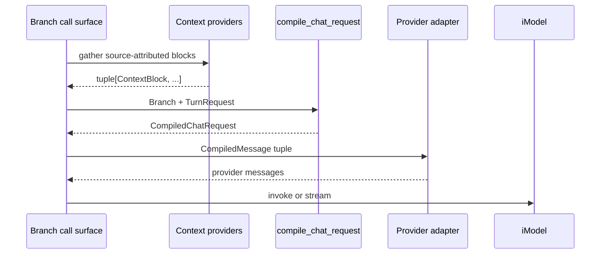

# ADR-0007: Canonical turn-request compilation boundary

- **Status**: Proposed
- **Kind**: Aspirational
- **Area**: messages-context
- **Date**: 2026-07-09
- **Relations**: extends ADR-0006

## Context

LionAGI currently distributes provider-request preparation across durable message content, a raw
projection, an unused general preparation helper, and the active chat/run preparation path. The
result works for ordinary turns but does not give one place an exact request contract.

**P1 — `Instruction` currently mixes durable and one-call lifetimes.** `InstructionContent`
contains stable user material (`instruction`, `guidance`, `prompt_context`, `plain_content`, and
images) alongside current-call tool schemas, response-format objects, structure objects, and a
rendering instance (`lionagi/protocols/messages/instruction.py`). Serialization conditionally strips
the objects that cannot round-trip, and in-memory copies carry special cases to keep them alive.
Replay therefore depends on remembering which fields are transient rather than making that
lifetime explicit.

**P2 — Three surfaces project history with different semantics.**

- `MessageManager.to_chat_msgs()` is a raw ordered `chat_msg` projection. It does no prompt
  shaping (`lionagi/protocols/messages/manager.py`).
- `prepare_messages_for_chat()` extracts a leading system record, folds action results, clears
  historical schemas, merges assistant messages, and can render round notifications. It has no
  production caller (`lionagi/protocols/messages/prepare.py`).
- `_prepare_run_kwargs()` is the active chat and run path. It performs a different action fold,
  assistant merge, system fold, context-provider injection, filtering, and final rendering
  (`lionagi/operations/chat/_prepare.py`).

Two helpers can therefore assign different provider-visible meanings to the same record sequence.

**P3 — History selection and malformed-history behavior are implicit.** The active path chooses
`param.progression or branch.progression`, looks up every UUID, ignores some message kinds, and
requires the first retained item to be an instruction only when a system message exists. Invalid
IDs surface through collection lookup; adjacent non-assistant retained records can be silently
dropped by the current merge loop. Those are control-flow accidents, not a named contract.

**P4 — Ephemeral context needs attribution and syntax boundaries.** ADR-0008 records that current
provider blocks are joined and concatenated directly between system text and guidance. The request
compiler needs a typed block input and an exact encoding so source attribution survives to the
provider request and retrieved text cannot become adjacent to policy merely because delimiters
were omitted. This is a data-boundary improvement, not a claim that retrieved text becomes trusted.

**P5 — Chat and run must agree before transport-specific execution begins.** Both paths already
call `_prepare_run_kwargs()`, but they then mutate call arguments differently: chat invokes an API
event, while run adds streaming, resume, deadline, and persistence behavior. Compilation belongs
before that fork so transport mechanics cannot redefine history.

**P6 — Migration must preserve normal provider payloads while removing duplicate authority.** The
existing `Branch.chat`, `communicate`, `operate`, and `run` signatures cannot all change at once.
They need an adapter into one typed request, characterization tests for current successful
histories, and one removal/delegation plan for legacy helpers.

| Concern | Decision |
|---------|----------|
| Durable versus transient turn data | D1: Introduce immutable `TurnRequest`, `ContextBlock`, `CompiledMessage`, and `CompiledChatRequest` contracts. |
| History selection and folding | D2: Make `compile_chat_request()` the sole owner of validation, action folding, assistant normalization, system placement, and rendering. |
| Context attribution and boundaries | D3: Encode context blocks as canonical JSON in a separately delimited guidance section. |
| Service boundary | D4: Keep compiled messages provider-neutral; adapters translate them only at model invocation. |
| Chat/run parity | D5: Require chat and run to consume the same compiled result before adding transport-only keyword arguments. |
| Migration and old helpers | D6: Adapt existing Branch arguments into `TurnRequest`, characterize payloads, then delegate or remove every competing preparation path. |

This ADR deliberately does **not** decide:

- how context providers retrieve or prioritize blocks; ADR-0008 owns provider execution and
  supplies `ContextBlock` values to this boundary;
- tool execution, action concurrency, or action-result writeback; compilation only represents
  recorded results in model context;
- response parsing or Pydantic validation after the model call;
- provider transport, retry, rate-limit, streaming, or persistence behavior;
- a new public `Branch.chat` or `Branch.run` signature. Existing call surfaces adapt into the new
  contract first; or
- a new system-role wire message. The target keeps the shipped system-into-first-user-message fold
  so this refactor does not also change the role sequence.

## Decision

### D1 — Separate record-ready instruction data from transient call data

The operation layer introduces the following exact Python-native contract in
`lionagi/operations/types.py`:

```python
from collections.abc import Mapping
from dataclasses import dataclass, field
from types import MappingProxyType
from typing import Any
from uuid import UUID

from pydantic import BaseModel

from lionagi.operations.schema.structure import Structure
from lionagi.protocols.messages import Instruction, MessageRole


@dataclass(frozen=True, slots=True)
class ContextBlock:
    provider_name: str
    content: str


@dataclass(frozen=True, slots=True)
class CompiledMessage:
    role: MessageRole
    content: str | list[dict[str, Any]]


@dataclass(frozen=True, slots=True)
class TurnRequest:
    instruction: Instruction
    progression: tuple[UUID, ...] | None = None
    tool_schemas: tuple[dict[str, Any], ...] = ()
    response_format: type[BaseModel] | dict[str, Any] | BaseModel | None = None
    structure: type[Structure] | str | None = None
    context_blocks: tuple[ContextBlock, ...] = ()
    provider_kwargs: Mapping[str, Any] = field(
        default_factory=lambda: MappingProxyType({})
    )


@dataclass(frozen=True, slots=True)
class CompiledChatRequest:
    instruction: Instruction
    messages: tuple[CompiledMessage, ...]
    provider_kwargs: Mapping[str, Any]


def compile_chat_request(
    branch: Branch,
    request: TurnRequest,
) -> CompiledChatRequest: ...
```

The per-instance mapping factory avoids sharing mutable call state and exposes a read-only empty
default.

After migration, the durable instruction content contract is reduced to provider-neutral fields:

```python
# lionagi/protocols/messages/instruction.py
@dataclass(slots=True)
class InstructionContent(MessageContent):
    instruction: str | None = None
    guidance: str | None = None
    prompt_context: list[Any] = field(default_factory=list)
    plain_content: str | None = None
    images: list[str] = field(default_factory=list)
    image_detail: Literal["low", "high", "auto"] | None = None
```

`tool_schemas`, `response_format`, `structure`, and `_structure_instance` no longer remain fields on
the target durable dataclass. During the compatibility window, `InstructionContent.from_dict()`
accepts those keys from legacy serialized content and ignores them; replay cannot reconstruct a
current-call option. The Branch call adapters continue accepting their existing arguments and place
them on `TurnRequest`.

The lifetime split is normative:

| Data | Durable `CompiledChatRequest.instruction` | Transient `TurnRequest` / compiled messages |
|------|---------------------------------------------|---------------------------------------------|
| instruction text | yes | rendered from durable copy |
| stable guidance and prompt context | yes | rendered from durable copy |
| plain content and images | yes | rendered from durable copy |
| sender, recipient, identity, metadata | yes | used only as needed for compilation |
| tool schemas | no | `TurnRequest.tool_schemas` |
| response format and structure | no | `TurnRequest.response_format` / `structure` |
| selected progression | no | `TurnRequest.progression` |
| context-provider blocks | no | `TurnRequest.context_blocks` |
| model-call keyword arguments | no | `TurnRequest.provider_kwargs` |

Exact construction semantics:

- `TurnRequest.instruction` is an `Instruction`, not raw text. Existing Branch entry points first
  build it through the current instruction factory so sender/recipient, context, images, and
  content validation retain their public behavior.
- The compiler makes a deep model copy of the supplied instruction, preserving its `id`,
  `created_at`, sender, recipient, and metadata values. It replaces that copy's content with the
  target `InstructionContent` built from only instruction, guidance, prompt context, plain content,
  images, and image detail. The supplied `Instruction` is never mutated.
- The compiler builds a private ephemeral rendering view for the current call. That view combines
  durable content with `tool_schemas`, `response_format`, and `structure` from `TurnRequest` and
  preserves the current minimal-YAML Tools, ResponseSchema, and ResponseFormat sections.
- Historical instruction copies use only the target durable fields, so an old in-memory record
  created before migration cannot replay a schema into a later call.
- `CompiledChatRequest.instruction` is the only instruction object that chat/communicate/run may
  record after compilation. It contains no context blocks or current-call model kwargs.
- The frozen dataclasses prevent field reassignment but do not make nested dictionaries or
  multimodal lists immutable. The compiler uses `copy.deepcopy()` for schema dictionaries,
  provider kwargs, and rendered list content, then exposes compiled kwargs through
  `MappingProxyType`. Caller-owned mutable containers are not retained by the compiled request.
- `provider_kwargs` may not contain the reserved key `"messages"`. A collision raises
  `ValueError("provider_kwargs must not contain reserved key 'messages'")` rather than silently
  overwriting either value.

This decision removes the need for serialization to be the mechanism that distinguishes durable
from transient state. Serialization remains a compatibility safeguard, not the lifetime boundary.

### D2 — One deterministic compiler owns selection, folding, and rendering

`compile_chat_request()` is a pure compilation step with respect to branch history: it reads the
branch and returns new values without mutating any stored message, progression, or content object.
Its algorithm is normative.

#### 1. Resolve and validate the history view

- `request.progression is None` selects `branch.progression`, including any
  `metadata["current_progression"]` override described by ADR-0006.
- An explicit empty tuple selects no historical messages.
- Existing public adapters preserve the current falsy-list behavior during migration by mapping a
  legacy `progression=[]` argument to `None`. Direct internal `TurnRequest(progression=())` is the
  unambiguous empty-history form.
- Every UUID must exist in `branch.msgs.messages`. Missing IDs are collected and reported in one
  `ValueError` before any compilation output is produced.
- Duplicate UUIDs are rejected with `ValueError`; replaying the same record twice is not an
  implicit feature.
- Order is exactly tuple/progression order, not creation time.

#### 2. Project provider-relevant history

The compiler walks the selected records once:

- `System` records are not emitted from the selected progression; the canonical
  `branch.msgs.system` is handled in the system fold below.
- `ActionRequest` records are not emitted independently. Their function and arguments are already
  present on the correlated `ActionResponse` content.
- `ActionResponse` records are accumulated until the next historical `Instruction`.
- `AssistantResponse` becomes an ephemeral copy of `AssistantResponseContent`.
- `Instruction` becomes an ephemeral copy with `tool_schemas=()`, `response_format=None`, and no
  structure instance. Pending action responses are appended to its prompt context.
- A base `Message` or other record whose role is `unset` is ignored; routed traffic is not a
  provider conversation turn.
- Any future fixed-role conversational subtype not covered above raises `TypeError` so adding a
  subtype cannot silently change prompt semantics.

Action responses use the current provider-visible projection:

```python
{
    "function": response.content.function,
    "arguments": response.content.arguments,
    "output": response.content.output,
}
```

For each target instruction, projected dictionaries append in action-response order. A dictionary
already equal to an existing prompt-context item is not appended again. Pending responses after
the last historical instruction append to the current ephemeral instruction.

#### 3. Validate conversation ordering and merge assistant runs

- Consecutive `AssistantResponseContent` objects merge into one assistant message by joining their
  text with exactly `"\n\n"`.
- Adjacent retained instructions are rejected with `ValueError("Consecutive instructions require
  an intervening assistant response")`. The compiler does not preserve the current accidental
  silent drop.
- If a system message exists and retained history is non-empty, the first retained content must be
  an instruction. Otherwise compilation raises
  `ValueError("First message in progression must be an Instruction or System")`, preserving the
  active path's explicit error.
- With no retained history, the current ephemeral instruction is the first content.
- The current instruction is appended exactly once after retained history.

#### 4. Fold system, context, and guidance

The compiler keeps the shipped role sequence: it does not emit a provider `system` message. It
builds one guidance prefix and applies it to the first instruction content:

```text
<system.rendered, when present>

<context section from D3, when blocks are present>

<that instruction's existing guidance, when present>
```

Each non-empty section is joined with exactly two newline characters. Non-string guidance renders
through the existing minimal-YAML renderer before joining.

When retained history exists, the fold applies to its first instruction, matching current system
placement. Otherwise it applies to the current instruction. Context blocks can compile without a
system message; whether the provider registry runs on a systemless branch remains a migration
decision in ADR-0008.

#### 5. Render immutable provider-neutral messages

- Each instruction uses the existing structured instruction renderer and has role `user`.
  Historical views render only durable sections; the current ephemeral view additionally renders
  the TurnRequest's Tools, ResponseSchema, and ResponseFormat sections.
- Each assistant response renders its normalized text and has role `assistant`.
- A falsy rendered value is omitted, matching the active path.
- Multimodal instruction content remains a list containing a text part and `image_url` parts.
- The returned `messages` tuple preserves the final content order.
- `CompiledMessage` contains only `role` and rendered `content`; message UUIDs and metadata do not
  enter the provider request.

The algorithm has no retry, timeout, token cap, or provider call. It is deterministic for the
branch snapshot and `TurnRequest` supplied. Callers that require a stable snapshot must avoid
concurrent history mutation while compiling; cross-task branch locking is outside this ADR.

### D3 — Context blocks use a canonical source-attributed JSON section

`ContextBlock` is data, not preformatted policy text. The compiler renders all blocks as one
canonical JSON array:

```python
from lionagi.ln import json_dumps

payload = [
    {"provider_name": block.provider_name, "content": block.content}
    for block in request.context_blocks
]
encoded = json_dumps(payload, sort_keys=True)
section = "LIONAGI_CONTEXT_BLOCKS_JSON\n" + encoded + "\nEND_LIONAGI_CONTEXT_BLOCKS_JSON"
```

The exact provider-visible shape for two blocks is:

```text
LIONAGI_CONTEXT_BLOCKS_JSON
[{"content":"first retrieved value","provider_name":"catalog"},{"content":"second retrieved value","provider_name":"memory"}]
END_LIONAGI_CONTEXT_BLOCKS_JSON
```

Exact semantics:

- block order is `TurnRequest.context_blocks` order, which ADR-0008 defines as retained
  registration order;
- empty `provider_name` or `content` is rejected with `ValueError`; the registry should omit empty
  results before constructing blocks;
- JSON escaping preserves quotes, newlines, and control characters inside the `content` field;
- system text, the context section, and guidance are separate two-newline-delimited sections;
- context content remains untrusted model input. Attribution and syntactic encoding prevent
  accidental string adjacency; they do not authorize instructions found in retrieved data or
  guarantee resistance to semantic prompt injection; and
- the context section exists only in compiled content. Neither the JSON text nor the source blocks
  are copied into the record-ready instruction.

This target is the concrete source-attributed envelope required by ADR-0008 delta 1.

### D4 — Provider translation occurs after neutral compilation

The operation compiler returns `CompiledMessage`, not OpenAI-, Anthropic-, or CLI-specific request
objects. The default service projection is mechanically:

```python
provider_messages = [
    {"role": message.role.value, "content": message.content}
    for message in compiled.messages
]
```

Provider adapters may translate multimodal part names or other service-specific shapes at the
`iModel` boundary. They may not re-read `Branch.messages`, refold actions, move system policy,
re-run context providers, or mutate the compiled instruction. If a provider needs a native tools
field or response-format field, that translation is driven from explicit operation parameters,
not reconstructed from durable history.

An adapter error occurs before model invocation and leaves history unchanged. Recording happens
only after compilation succeeds and follows each operation's existing behavior: direct `chat()`
does not automatically record, `communicate()` records its instruction/response, and `run()`
records streamed messages.

### D5 — Chat and run share compilation and diverge only for execution

Both operation paths use the same sequence:



After compilation:

- chat selects the model from its existing `ChatParam`/Branch operation state, adds the deprecated
  `include_token_usage_to_model` value only when explicitly present, and invokes once;
- run verifies a CLI model, adds resume state, `stream=True`, an optional stream deadline, and
  optional persistence callbacks; and
- neither path changes `compiled.messages` or compiles a second time.

There is no separate `compile_run_request()`. Run-only settings such as `stream_persist`,
`persist_dir`, and `snapshot_dir` remain execution parameters and never enter `TurnRequest`.

### D6 — Migrate by adaptation, characterization, and removal of competing policy

The target module ownership is:

```text
lionagi/operations/
├── types.py                 TurnRequest, ContextBlock, CompiledMessage,
│                            CompiledChatRequest
└── chat/
    ├── _compile.py          compile_chat_request and pure helpers
    ├── _prepare.py          temporary compatibility adapter; then removed/delegated
    └── chat.py              provider invocation only

lionagi/protocols/messages/
├── manager.py              ordered raw records and factories only
└── prepare.py              compatibility delegation, then deprecation/removal
```

Migration order is part of the decision:

1. Capture current successful provider-visible payloads for chat and run: empty history, systemful
   and systemless history, action results, consecutive assistant responses, images, tools,
   response formats, selected progressions, and context-provider blocks.
2. Add the typed contracts and compiler without changing public Branch signatures.
3. Adapt `ChatParam`/`RunParam` plus the newly built instruction into `TurnRequest`. Preserve the
   legacy empty-progression behavior in that adapter.
4. Route both chat and run through the compiler. Any intentional difference—canonical context
   delimiters and explicit malformed-history errors in this ADR—gets a focused expectation rather
   than an accidental snapshot update.
5. Make `MessageManager.to_chat_msgs()` explicitly raw and keep it only for callers that want a
   literal record projection.
6. Delegate `prepare_messages_for_chat()` to the compiler where compatible, deprecate unsupported
   option combinations, then remove independent prompt policy at the declared compatibility
   boundary.
7. Remove `_prepare_run_kwargs()` after all production callers use the compiler.

Completion requires one payload test matrix shared by chat and run. A change that updates only one
side fails the boundary contract.

## Consequences

### Positive

- Durable instructions no longer retain objects or schemas that exist only for one call.
- One deterministic compiler becomes the regression surface for history, actions, structured
  output instructions, tools, images, system policy, and injected context.
- Chat and run cannot drift in prompt semantics while retaining independent execution mechanics.
- Source attribution survives into provider-visible context without persisting retrieved text as a
  conversation record.
- Provider adapters consume a small frozen-field intermediate shape instead of depending on
  `MessageManager` internals.

### Negative

- Compilation allocates record-ready and ephemeral content copies. This is deliberate isolation
  overhead; no performance rationale or benchmark currently justifies in-place mutation.
- The migration touches a compatibility-sensitive request boundary and must distinguish intended
  changes from regressions in payload snapshots.
- Canonical JSON context encoding adds prompt characters compared with direct concatenation.
- `TurnRequest` introduces another internal type alongside `ChatParam` during migration. The overlap
  must be temporary; leaving both as prompt authorities would recreate P2.

### Maintenance and reversal cost

- Adding a new conversational message kind requires an explicit compiler case and shared chat/run
  tests. Silent fallback is forbidden.
- Adding a transient call option requires a `TurnRequest` field or explicit provider-adapter input;
  putting it back on durable `InstructionContent` violates D1.
- Reversing to provider-specific compilers would duplicate the history algorithm and invalidate
  the parity test matrix. Reversing the JSON context envelope would change provider-visible prompt
  text and requires a documented compatibility decision.
- The compiler is highly testable without a live model: branch records and a request are sufficient
  to assert the complete output.

## Alternatives considered

### Keep current-call configuration in `InstructionContent` and strip it on replay

This preserves existing factories and keeps all rendering inputs on one object. It lost because
the object then has two lifetimes: record storage and request execution. Type/BaseModel response
formats cannot round-trip, dictionary formats behave differently, and every replay path must
remember to clear schemas. The current `to_dict()` and `with_updates()` exceptions are direct
evidence of that burden.

### Move all compilation into `MessageManager`

The manager already owns messages and could expose one `prepare()` method. This would reduce the
number of modules a caller touches. It lost because the manager would need current model kwargs,
tool schemas, response formats, provider blocks, and system-fold policy—operation inputs unrelated
to durable membership and order. It would reverse ADR-0006's manager boundary.

### Let each provider adapter compile raw history

Provider-local compilation could use native system, tool, and multimodal features directly. It
lost because action folding, historical schema stripping, progression validation, and assistant
normalization would be repeated for every provider. Equivalent turns could then change meaning
when only the model provider changes.

### Keep `_prepare_run_kwargs()` as the canonical boundary without typed intermediates

This is the smallest code change because chat and run already call it. It lost because its input is
a branch plus broad `ChatParam`, its output mixes messages into a mutable kwargs dictionary, and it
uses a private branch slot for context. The signature does not separate durable data, transient
data, compiled messages, or reserved provider keys.

### Emit a native provider `system` message

A dedicated system-role item would avoid folding policy into the first user message and maps to
many chat APIs. It lost for this migration because it changes the provider-visible role sequence,
and not every CLI or provider surface treats native system messages identically. This ADR keeps the
current fold; a future role-sequence change needs its own characterization and decision.

### Preserve context as direct string concatenation

This is shortest and has the lowest token overhead. It lost because source names disappear and
empty delimiters let system text, retrieved text, and guidance become one syntactic run. Canonical
JSON costs characters but preserves source/content fields and escaping deterministically.

### Mutate historical content in place to avoid copies

In-place clearing of old schemas and folding of action outputs would allocate less. It lost because
compilation failure or concurrent inspection could observe partially rewritten history, and later
turns would inherit previous call policy. The compiler's primary invariant is non-mutation.

## Notes

Current implementation anchors used to define migration behavior:
`lionagi/protocols/messages/instruction.py`, `lionagi/protocols/messages/manager.py`,
`lionagi/protocols/messages/prepare.py`, `lionagi/operations/types.py`,
`lionagi/operations/chat/_prepare.py`, `lionagi/operations/chat/chat.py`,
`lionagi/operations/communicate/communicate.py`, and `lionagi/operations/run/run.py`.
