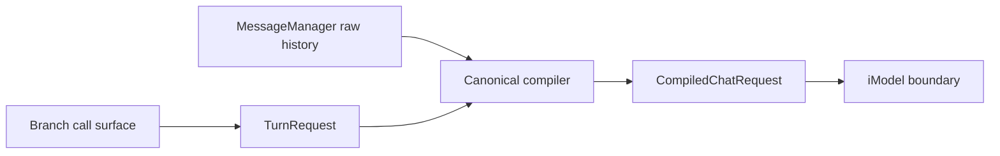

# ADR-0007: Canonical Turn-Request Compilation Boundary

- **Status**: Proposed
- **Kind**: Aspirational
- **Area**: messages-context
- **Date**: 2026-07-09
- **Relations**: extends ADR-0006

## Context

An `Instruction` currently serves two lifetimes. It is the durable user-turn record containing
instruction text, guidance, prompt context, plain content, and images, but its content also carries
current-call tool schemas, response-format objects, and a rendering strategy. Historical replay
then has to remove tool schemas and response formats, while in-memory copying has special cases for
objects that cannot survive normal serialization.

Provider messages are produced by three overlapping surfaces. `MessageManager.to_chat_msgs()` is a
raw record projection. `prepare_messages_for_chat()` folds system and action records and merges
assistant turns but has no production caller. The active chat and run path performs a different fold
in `_prepare_run_kwargs()`, including context-provider blocks from ADR-0008. These paths can assign
different prompt semantics to the same history.

Provider request construction is an operation concern: it selects history, applies current-turn
options, folds action results, injects ephemeral context, and produces arguments for an `iModel`
call. Durable record ownership remains with `MessageManager`; it must not depend on provider request
policy.

## Decision

The operation layer will introduce one typed `TurnRequest` and one canonical
`compile_chat_request(branch, request)` boundary. The minimum interface is:

```python
@dataclass(frozen=True, slots=True)
class ContextBlock:
    provider_name: str
    content: str


@dataclass(frozen=True, slots=True)
class CompiledMessage:
    role: MessageRole
    content: str | list[dict[str, Any]]


@dataclass(frozen=True, slots=True)
class TurnRequest:
    instruction: Instruction
    progression: tuple[UUID, ...] | None
    tool_schemas: tuple[dict[str, Any], ...]
    response_format: type[BaseModel] | dict[str, Any] | BaseModel | None
    structure: type[Structure] | str | None
    context_blocks: tuple[ContextBlock, ...]
    provider_kwargs: Mapping[str, Any]


@dataclass(frozen=True, slots=True)
class CompiledChatRequest:
    instruction: Instruction
    messages: tuple[CompiledMessage, ...]
    provider_kwargs: Mapping[str, Any]


def compile_chat_request(branch: Branch, request: TurnRequest) -> CompiledChatRequest: ...
```

Provider adapters may translate `CompiledMessage` at the service boundary. The load-bearing
invariants are:

- durable `InstructionContent` retains provider-neutral user content only: instruction, stable
  guidance and prompt context, plain content, and multimodal input;
- tool schemas, response-format and structure objects, selected progression, context-provider
  blocks, and model-call keyword arguments are transient `TurnRequest` data;
- compilation does not mutate durable messages and historical turns cannot replay transient schemas
  or current-call options;
- one compiler owns system-policy folding, action-result correlation, consecutive-assistant
  normalization, selected-history validation, and final role and content rendering;
- context blocks are source-attributed and isolated in explicit data envelopes so retrieved text
  cannot merge syntactically with system policy or user guidance;
- chat and run use the same compiler and preserve their existing provider-visible message semantics
  until a separately documented behavioral change is accepted;
- `MessageManager` exposes raw ordered records only; prompt-shaping helpers migrate to the compiler;
  and
- the existing Branch call surface adapts arguments into `TurnRequest`, so the boundary can be
  introduced before public call signatures change.

The target implementation anchors are `lionagi/operations/types.py` and
`lionagi/operations/chat/_prepare.py`. Migration removes independent policy from
`lionagi/protocols/messages/prepare.py` and makes the raw nature of
`lionagi/protocols/messages/manager.py` projections explicit.



## Consequences

One deterministic compiler becomes the regression surface for prompt history, action results,
structured output, tools, images, and injected context. Durable messages round-trip without
carrying objects that exist only for one model call, and provider preparation no longer leaks into
the record manager.

The migration touches a high-risk compatibility boundary. It must pin current chat and run payloads
with characterization tests before delegating or removing legacy helpers. A typed intermediate
model adds a small allocation and translation cost, and provider-specific payload extensions must
pass through explicit adapter fields rather than mutating message records.

## Notes

Alternatives considered were retaining configuration in `InstructionContent` and stripping it on
replay, moving all compilation into `MessageManager`, and letting each provider build payloads from
raw history. The first preserves serialization exceptions, the second couples durable storage to
operation policy, and the third multiplies prompt semantics. One operation-owned compiler keeps the
record and service boundaries explicit.
