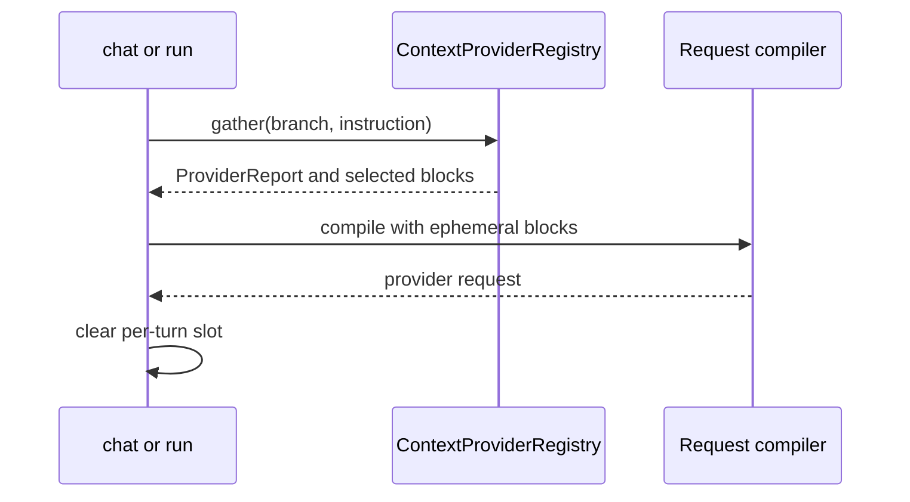

# ADR-0008: Pre-Turn Context-Provider Execution and Attribution

- **Status**: Proposed
- **Kind**: Retrospective
- **Area**: messages-context
- **Date**: 2026-07-09
- **Relations**: none

## Context

LionAGI can gather knowledge immediately before a chat or run turn without adding that knowledge to
durable conversation history. `ContextProvider` is a structural asynchronous interface whose
`provide(branch, instruction)` method returns a text block or no result. Each `Branch` lazily owns
an ordered `ContextProviderRegistry`; a branch that never registers providers does no provider work.

The registry invokes providers sequentially in registration order and contains provider exceptions.
It tokenizes every non-empty successful result, applies each provider's optional maximum, and then
selects blocks under a total token budget by descending priority. Kept blocks render in registration
order. The budget limits rendered text, not provider invocation: all providers run before any
total-budget result is dropped.

Chat and run gather providers before compiling the model request. A branch without a system message
does not invoke them because the current compiler has no injection target; the most recent report
marks every registered provider as skipped. With a system message, blocks are held in a private
per-turn slot, concatenated into the first instruction's system-guidance fold, and cleared in a
`finally` block after compilation. The text is sent to the model but is not inserted into
`Branch.messages`.

`ProviderReport` is an in-memory last-turn diagnostic. It retains rendered blocks, provider names
and token counts for selected results, and unclassified skipped and failed names. Empty results are
not represented, skip reasons are not distinguished, and reports are not emitted to logs or run
metadata. The current concatenation also supplies no guaranteed delimiter between system text, the
joined provider blocks, and guidance.

The registry is independent of `MemoryStore`. A provider may consult `branch.memory` or any external
source, but the context contract neither requires nor adapts the memory interface. Memory backend
and lifecycle semantics belong to the separate substrate boundary (see the substrates ADR on
memory-store contracts). The registry also exposes a contained `gather_writeback()` hook. One
production turn path invokes it: when providers are registered and an action-invoking turn produces
non-empty action results, the operate pipeline calls `gather_writeback()` with those results
(`lionagi/operations/operate/operate.py`). Turns without action results, and the chat and run
paths, do not trigger writeback.

## Decision

Pre-turn context is a Branch-owned, failure-contained operational input, not a conversational
message. The load-bearing invariants are:

- providers structurally implement `async provide(Branch, Instruction) -> str | None` and run in
  registration order;
- provider exceptions do not fail the turn, and an empty result contributes no rendered block;
- per-provider and total limits apply after retrieval, priority determines which successful blocks
  fit, and retained blocks preserve registration order;
- providers run only when a system message supplies the current render target; otherwise all
  registered names are reported as skipped without invocation;
- selected text exists only in the per-turn compiler input, never in durable message history, and
  the slot is cleared even when compilation fails;
- `last_context_report` retains only the latest in-memory report and is diagnostic rather than a
  durable audit record;
- context providers and memory stores remain independent structural interfaces; and
- provider writeback fires on the operate path when action results exist, and otherwise only when
  a caller explicitly invokes `gather_writeback()`; both follow the same exception-containment
  policy as retrieval.

The implementation anchors are `lionagi/protocols/context_providers.py`,
`lionagi/operations/chat/_prepare.py`, `lionagi/operations/chat/chat.py`,
`lionagi/operations/run/run.py`, and `lionagi/session/branch.py`.

## Consequences

Retrieval failures cannot block ordinary turns, context remains outside durable chat history, and
priority-based selection bounds the text sent to the model. Callers can inspect immediate
attribution without requiring a persistence backend, and providers are free to use memory, search,
or external services.

The current seam does not bound retrieval cost, cannot inject on a systemless branch, and cannot
reconstruct attribution across turns. Raw blocks retained in the latest report may contain
sensitive source material. Ambiguous skip outcomes and missing text boundaries make policy analysis
and prompt inspection less reliable than the provider interface implies.

## Current-vs-ideal delta

| # | Delta | Size | Issue |
|---|-------|------|-------|
| 1 | Add source-attributed data envelopes and separators between system text, each provider block, and guidance; acceptance requires retrieved text to remain syntactically isolated from instructions and exact-boundary regression tests for one and multiple providers across chat and run. | S | (filled at issue-open time) |
| 2 | Replace loose report lists with one typed outcome per registered provider covering rendered, empty, per-provider limit, total-budget exclusion, and failure; acceptance requires stable reason codes, token counts where available, and registration-order correlation. | M | (filled at issue-open time) |
| 3 | Define report retention and redaction, then emit a per-turn report reference to run metadata or logs; acceptance requires multi-turn attribution without persisting raw provider text unless the selected policy explicitly permits it. | M | (filled at issue-open time) |
| 4 | Name the existing total limit as a rendered-token budget and decide whether invocation cost also needs a bound; acceptance requires documentation of the chosen semantics and preflight eligibility or cost controls if invocation must be bounded. | M | (filled at issue-open time) |
| 5 | Decide the systemless-branch policy; acceptance requires chat and run either to compile a documented context envelope without a system message or to expose the current skip behavior as a stable public contract. | S | (filled at issue-open time) |
| 6 | Define the lifecycle of provider writeback; acceptance requires either one documented post-turn invocation point with exactly-once-per-turn tests or renaming the hook as an explicitly caller-driven utility. | M | (filled at issue-open time) |

## Notes

Alternatives considered were persisting injected blocks as ordinary messages and requiring all
providers to retrieve through `MemoryStore`. Persisted blocks would contaminate durable user and
assistant history with operational context; a memory-only source contract cannot represent search,
composition, or other external providers. The Branch-owned structural registry preserves ephemeral
injection while keeping source selection pluggable.
