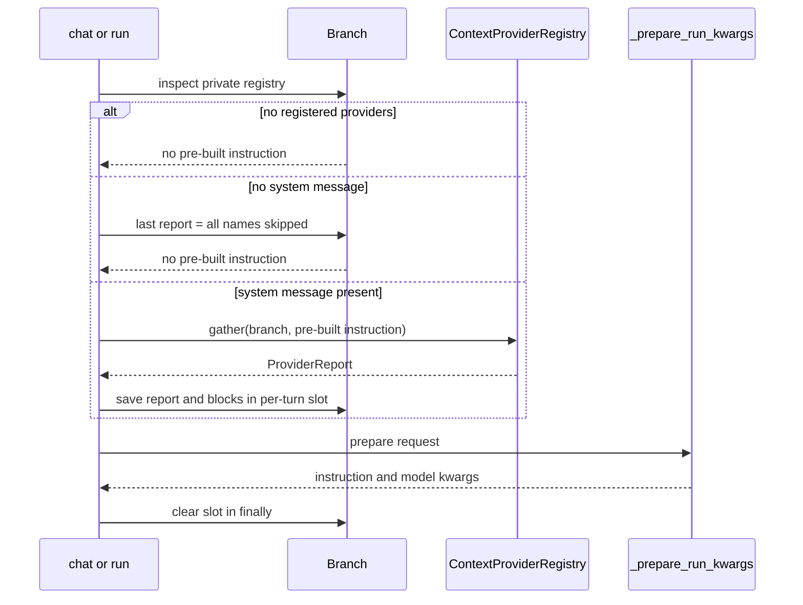

# ADR-0008: Pre-turn context-provider execution and attribution

- **Status**: Proposed
- **Kind**: Retrospective
- **Area**: messages-context
- **Date**: 2026-07-09
- **Relations**: none

## Context

LionAGI can gather knowledge immediately before a chat or run turn without adding that knowledge to
durable conversation history. The seam exists because model-visible context has a shorter lifetime
than recorded user and assistant turns.

**P1 — Optional retrieval must add no work to branches that do not use it.** Most branches have no
registered providers. Creating provider infrastructure or running a gather pass on every turn would
add overhead to the default path. `Branch.providers` therefore creates the registry lazily, and the
operation path tests the private registry without forcing creation (`lionagi/session/branch.py`;
`lionagi/operations/chat/_prepare.py`).

**P2 — External context sources fail independently of the model turn.** A provider may consult
memory, search, a local corpus, or an external service. Failure in one source should not suppress
other sources or prevent an ordinary turn. The registry invokes each provider under exception
containment and retains failures in a diagnostic report (`lionagi/protocols/context_providers.py`).

**P3 — Model-visible context needs a bounded rendered footprint.** Providers can return arbitrarily
large text. The registry applies an optional per-provider maximum and a total rendered-token budget,
protecting higher-priority results first. The current budget bounds selected output only: it does
not avoid provider calls or bound remote retrieval cost.

**P4 — Selection priority and rendering order answer different questions.** Priority decides which
blocks survive a budget conflict; registration order decides how retained blocks appear. Stable
selection plus original-order rendering preserves deterministic composition without making a
low-priority block jump ahead merely because it was evaluated later.

**P5 — Injection must be ephemeral.** The active compiler needs the selected text for one call, but
`Branch.messages` must not acquire retrieved context as a fake user or system turn. The
implementation uses a private per-turn slot, consumes it during request preparation, and clears it
in a `finally` block in both chat and run.

**P6 — Attribution exists, but only as last-turn diagnostics.** `ProviderReport` captures retained
raw blocks, provider names and token counts, skipped names, and failed names. It is overwritten on
the next provider pass, carries no turn identifier, conflates skip reasons, and is not persisted or
emitted to run metadata.

**P7 — The current render target requires a system message.** Provider blocks are inserted into the
system-guidance fold. A branch without `branch.msgs.system` skips every registered provider without
invocation and reports all names as skipped. This avoids wasted retrieval but makes system presence
an implicit eligibility rule.

**P8 — Post-action writeback has one production entry point, not a general turn lifecycle.** The
registry exposes optional provider `writeback` hooks. `operate()` invokes them after non-empty
action responses are produced; direct chat, communicate-without-actions, and run do not. The hook
is failure-contained but has no report or exactly-once guarantee
(`lionagi/operations/operate/operate.py`).

**P9 — Context providers and memory stores are separate seams.** `ContextProviderRegistry` imports
no `MemoryStore` and imposes no source backend. A provider may use `branch.memory`, a search service,
or another source, but provider selection and memory lifecycle are not the same contract.

| Concern | Decision |
|---------|----------|
| Ownership and registration | D1: Store one lazily-created ordered registry on each Branch. |
| Retrieval and failure behavior | D2: Invoke providers sequentially, contain provider exceptions, and ignore empty results. |
| Caps and priority | D3: Apply per-provider and total rendered-token limits after retrieval, select by descending priority, and render retained blocks in registration order. |
| Turn integration | D4: Gather before chat/run compilation, inject through a private per-turn slot only when a system render target exists, and always clear the slot after preparation. |
| Attribution | D5: Retain one in-memory `ProviderReport` describing selected, skipped, and failed providers. |
| Source independence | D6: Keep the provider protocol independent of `MemoryStore` and concrete adapters. |
| Post-action writeback | D7: Invoke optional async writeback hooks from the operate action-result path and contain their failures. |

This ADR deliberately does **not** decide:

- how any concrete provider queries, ranks, caches, authenticates to, or writes to its source;
- memory-store backend and lifecycle semantics, which belong to the substrates boundary;
- canonical source-attributed prompt encoding; ADR-0007 specifies the aspirational compiler shape,
  while this retrospective ADR records the current concatenation exactly;
- a timeout, retry, concurrency, or cost policy for provider invocation; none exists in the shipped
  registry;
- durable report retention, redaction, or privacy policy; these remain explicit deltas; or
- whether systemless branches should invoke providers. The current skip is descriptive, not an
  aspirational resolution.

See also ADR-0016 D3, which records the same provider registry from the Branch-aggregate side
(lifetime, cloning, and persistence semantics alongside the other branch-scoped extensions).
This ADR owns pre-turn execution ordering, budgeting, and attribution.

## Decision

### D1 — Each Branch lazily owns one ordered registry

The public protocol and registry signatures are:

```python
# lionagi/protocols/context_providers.py
@runtime_checkable
class ContextProvider(Protocol):
    async def provide(
        self,
        branch: Branch,
        instruction: Instruction,
    ) -> str | None: ...


class ContextProviderRegistry:
    def __init__(self, budget: int = 2000): ...

    def register(
        self,
        provider: ContextProvider,
        *,
        priority: int = 0,
        max_tokens: int | None = None,
        name: str | None = None,
    ) -> None: ...

    async def gather(
        self,
        branch: Branch,
        instruction: Instruction,
    ) -> ProviderReport: ...

    async def gather_writeback(
        self,
        branch: Branch,
        action_responses: list,
    ) -> None: ...
```

The registry stores private entries in append order:

```python
@dataclass
class _Entry:
    provider: ContextProvider
    priority: int
    max_tokens: int | None
    name: str
```

Branch ownership is:

```python
# lionagi/session/branch.py
class Branch(...):
    _context_providers: ContextProviderRegistry | None = PrivateAttr(None)
    _context_injection_slot: list[str] | None = PrivateAttr(None)
    _last_context_report: Any = PrivateAttr(None)

    @property
    def providers(self) -> ContextProviderRegistry:
        if self._context_providers is None:
            self._context_providers = ContextProviderRegistry()
        return self._context_providers

    @property
    def last_context_report(self):
        return self._last_context_report
```

Exact ownership and registration semantics:

- a newly constructed branch has no registry, no injection slot, and no report;
- the first access to `branch.providers` constructs `ContextProviderRegistry(budget=2000)` and all
  later accesses return the same object;
- operation code checks `branch._context_providers` directly. It does not touch the property and
  therefore does not create an empty registry on the zero-provider path;
- `register()` appends one `_Entry`; there is no duplicate-provider or duplicate-name check, no
  replacement by name, and no unregister method;
- name resolution is `explicit name`, then truthy `provider.name`, then the provider class name;
- `bool(registry)` and `len(registry)` reflect whether entries exist; `names` returns a new list in
  registration order; and
- `ContextProvider` is structural and runtime-checkable. Registration itself does not call
  `isinstance()` or validate the method; a missing or non-async `provide` raises during the awaited
  call and is recorded as a contained provider failure by `gather()`.

Branch-local ownership permits different provider sets and budgets on different conversation
branches. The registry itself holds provider objects strongly for the branch lifetime.

### D2 — Retrieval is sequential and provider exceptions are contained

`gather()` invokes `provide(branch, instruction)` for every registered entry in registration order.
It does not use parallel tasks.

Exact retrieval cases:

- **Empty registry:** returns a new report with four empty lists and imports no tokenizer.
- **Successful non-empty string:** tokenizes the string and enters it into budget selection.
- **`None` or any other falsy result:** contributes no block and no fired, skipped, or failed
  outcome. Empty results are therefore invisible in the report.
- **Provider raises `Exception`:** logs a warning with traceback, appends the provider name to
  `report.failed`, and continues to the next entry.
- **Provider raises `BaseException` outside `Exception`:** is not contained and propagates.
- **Protocol violation:** tokenization and later processing occur outside the `provide` try/except.
  The protocol requires `str | None`; the registry does not promise containment for arbitrary
  truthy non-string return values, though the current tokenizer returns zero on many encoding
  errors.
- **No timeout or retry:** a provider that waits indefinitely delays the turn indefinitely; a
  transient failure is attempted once.

All providers finish retrieval before the total budget selects any blocks. A result that is later
dropped may already have paid its full I/O and computation cost.

Sequential invocation was retained because order and failure isolation are deterministic and the
initial seam did not define concurrency or shared-source rate pressure. There is no measured
latency evidence in the code for preferring this shape; the absence of a timeout is a known cost,
not an assertion that provider latency is harmless.

### D3 — Limits bound selected rendered text, with priority-based admission

The token measurement is:

```python
tokens = TokenCalculator.tokenize(text)
```

With no explicit encoding or tokenizer, `TokenCalculator` resolves the default through
`get_encoding_name(None)`, which falls back to `o200k_base`. Tokenization exceptions are contained
inside `TokenCalculator.tokenize()` and return a count of zero. The budget is therefore a local
rendered-text estimate, not the exact token count for every eventual model.

Admission has two stages.

#### Per-provider maximum

```python
if entry.max_tokens and tokens > entry.max_tokens:
    report.skipped.append(entry.name)
    continue
```

Exact consequences of the truthiness check:

- `max_tokens=None` means no per-provider cap;
- a positive value skips the result only when `tokens` is strictly greater than the value; equality
  fits;
- `max_tokens=0` is falsy and therefore also means no cap in the shipped implementation; and
- a negative value is truthy and causes any non-empty result with a non-negative count to exceed
  it. The registry performs no constructor or registration validation.

A per-provider overflow does not truncate. The whole block is skipped and its name enters the
undifferentiated `skipped` list.

#### Total registry budget

Successful, per-provider-admitted results are stable-sorted by descending integer priority. The
registry then greedily admits a result when `total + tokens <= budget` and skips it otherwise.

Exact consequences:

- higher numeric priority is considered first;
- equal priorities retain registration order because Python sorting is stable;
- an oversized high-priority block may be skipped while a later smaller block still fits;
- a zero or negative budget skips any block with a positive token count; a zero-token block can fit
  a zero budget;
- there is no partial truncation and no reservation per provider;
- priority affects admission only. After selection, `report.blocks` and `report.fired` are rebuilt
  by walking successes in original registration order; and
- `report.fired` adds `{ "provider_name": entry.name, "tokens": tokens }` for each retained block.

The default total is **2000 tokens**. It was inherited from the initial context-injection design as
an approximately 2k hard cap to limit context creep while leaving the rest of the model window to
conversation and response. No benchmark, model-window derivation, or workload measurement is
recorded for the exact value 2000. It is mutable as `registry.budget` and is not an application
setting.

Priority is not a relevance score and is not normalized. It is a caller-assigned admission order
used only under budget pressure.

### D4 — Gather before compilation, inject ephemerally, and clear after preparation

The shared chat/run helper is:

```python
# lionagi/operations/chat/_prepare.py
async def _apply_context_providers(
    branch: Branch,
    instruction: JsonValue | Instruction,
    param: ChatParam,
) -> Instruction | None: ...
```

The active call sequence is:



Exact turn semantics:

- **No registry or empty registry:** `_apply_context_providers()` returns `None` and does not modify
  `_last_context_report` or `_context_injection_slot`. The ordinary preparation path builds the
  instruction once.
- **Systemless branch:** the helper does not build an instruction and does not call any provider.
  It overwrites `_last_context_report` with `ProviderReport(skipped=registry.names)` and returns
  `None`.
- **Systemful branch:** the helper builds the current `Instruction` once, passes that exact object
  to every provider, saves the returned report, and assigns `report.blocks` to the private slot.
  `_prepare_run_kwargs()` reuses the pre-built instruction instead of constructing another.
- **Rendering:** `_prepare_run_kwargs()` joins blocks with exactly one newline, then computes
  `branch.msgs.system.rendered + injected + guidance`. It adds no guaranteed delimiter between the
  system string and first block or between the last block and guidance. Non-string guidance first
  renders through minimal YAML.
- **History placement:** with retained history, that system/injection/guidance value becomes the
  guidance of the first historical instruction; with no retained history, it becomes guidance on
  the current instruction.
- **Clear on preparation success or failure:** chat and run wrap `_prepare_run_kwargs()` in
  `try/finally` and set `_context_injection_slot = None`. The slot is cleared before provider
  invocation/streaming begins.
- **Gather failure outside normal containment:** `_apply_context_providers()` is awaited before the
  `try/finally` in both callers. An unexpected error escaping `gather()` prevents compilation; the
  helper assigns the slot only after gather succeeds.
- **Durability:** direct `chat()` does not auto-record any messages; `communicate()` records its
  instruction and assistant response after invocation; `run()` records the instruction before
  streaming. None receives the private block list in its durable content. The injected text exists
  only in the ephemeral content copy rendered into model kwargs.

The budget therefore limits injected text sent to the model, not the stored history and not the
cost of calling providers.

### D5 — `ProviderReport` is a mutable-list, last-turn diagnostic

The shipped report contract is:

```python
# lionagi/protocols/context_providers.py
@dataclass(frozen=True)
class ProviderReport:
    blocks: list[str] = field(default_factory=list)
    fired: list[dict] = field(default_factory=list)
    skipped: list[str] = field(default_factory=list)
    failed: list[str] = field(default_factory=list)
```

The dataclass is frozen only at the attribute level. Its four lists remain mutable; `gather()`
appends to them while building the result, and callers can mutate them afterward.

Exact attribution semantics:

- `blocks[i]` and `fired[i]` describe the same retained provider result because both are appended
  in retained registration order;
- each fired entry has only `provider_name` and integer `tokens` keys;
- `skipped` combines per-provider overflow and total-budget exclusion without a reason code or
  token count;
- `failed` contains names whose `provide()` raised `Exception`, without the exception value in the
  report; the warning log carries traceback details;
- empty/falsy provider results have no outcome row;
- duplicate provider names make correlation ambiguous because entries have no stable entry ID;
- a systemless turn lists every registered name in `skipped`, also without a distinct reason;
- `branch.last_context_report` stores one reference, overwritten by the next provider-bearing or
  systemless provider pass; turns with no registry leave the previous value unchanged; and
- the report has no timestamp, turn/message ID, duration, budget total, redaction marker, or durable
  sink.

Raw selected blocks remain in memory through the report even after the private injection slot is
cleared. Clearing the slot is therefore not a privacy or erasure guarantee.

### D6 — Provider selection is independent of memory storage

`ContextProvider` requires only `provide(branch, instruction) -> str | None`. The registry has no
import from `lionagi/protocols/memory.py`, does not require `branch.memory`, and does not translate
memory records into blocks.

Exact boundary consequences:

- a provider may read `branch.memory`, another local store, a search index, computed state, or an
  external service;
- a branch with no provider can still use its memory store directly;
- a branch with providers need not instantiate `branch.memory`;
- registry priority and budget apply to returned text regardless of its source; and
- source-specific retries, caching, credentials, query construction, and result formatting belong
  to the provider implementation, not the registry.

This separation keeps the context seam composable with sources that are not memories and prevents
the registry from becoming a second memory lifecycle API.

### D7 — Optional writeback runs only after operate produces action responses

The registry does not declare a second protocol, but it discovers an optional method dynamically:

```python
async def writeback(
    branch: Branch,
    action_responses: list,
) -> None: ...
```

`gather_writeback()` walks entries in registration order. A provider without `writeback` is skipped.
For each present hook it executes `await hook(branch, action_responses)`.

Exact writeback semantics:

- `operate()` first obtains action responses, returns immediately when the result is empty, removes
  `None` entries, and returns again if the filtered list is empty;
- when the filtered list is non-empty and `branch._context_providers` is truthy, `operate()` calls
  `gather_writeback(branch, action_response_models)` once before attaching the responses to its
  structured result;
- direct chat and run do not call `gather_writeback()`. CLI tool-result messages yielded by run do
  not activate this hook;
- registry presence activates the scan, but each provider decides whether a writeback method exists
  and whether that method performs work;
- hooks execute sequentially in registration order;
- an `Exception` from one hook is warned with traceback and contained; later hooks still run and the
  turn result proceeds;
- there is no returned report, status list, retry, timeout, transaction, turn ID, or idempotency key;
  and
- the code provides at-most-one registry invocation for one successful pass through this section
  of one `operate()` call. It does not provide exactly-once durable effects if callers retry the
  operation or a provider performs a partial write before raising.

The source comment that writeback is “off by default” refers to provider policy: registration alone
does not create a writeback method or force one to persist. The operate call site is automatic once
non-empty action responses and a registry are present.

## Consequences

### Positive

- Branches that never access `providers` retain a zero-registry, zero-gather default path.
- One provider failure cannot suppress successful results from later providers or fail an ordinary
  turn.
- Priority-based selection bounds retained rendered text while preserving deterministic display
  order.
- Retrieved blocks reach chat and run without becoming durable messages.
- Immediate source names and token counts are inspectable without requiring a persistence backend.
- Providers can use memory, search, composition, or external sources behind one structural
  protocol.
- Post-action writeback failures cannot replace an otherwise successful operate result.

### Negative

- Sequential invocation and no timeout let one slow provider delay every later provider and the
  model turn.
- All providers run before the total budget drops any result, so the budget does not constrain
  retrieval cost.
- The default 2000-token cap and tokenizer are not calibrated to the selected model.
- Systemless branches silently change eligibility: all providers are reported skipped and none is
  called.
- Direct concatenation provides neither guaranteed section separators nor source names in the
  model-visible text.
- Last-turn reports lose history, conflate outcomes, and retain raw selected text in mutable lists.
- Writeback has a narrower lifecycle than its “post-turn” label suggests and no idempotency or
  outcome record.

### Maintenance and reversal cost

- Changing gather order or making it concurrent affects provider side-effect order and latency, so
  it requires explicit tests for equal priority, failures, and shared-source providers.
- Changing tokenization or the 2000 default changes which blocks fit and can alter model behavior
  without any message-history change.
- Persisting reports requires a redaction and retention decision because `blocks` contains raw
  source text.
- Moving injection into durable messages would require replay/migration rules to prevent stale
  context from accumulating.
- Unifying writeback across chat, run, and operate requires a turn-completion contract and
  idempotency identity; adding another call site alone would risk duplicate writes.

## Current-vs-ideal delta

| # | Delta | Size | Issue |
|---|-------|------|-------|
| 1 | Add source-attributed data envelopes and separators between system text, each provider block, and guidance; acceptance requires retrieved text to remain syntactically isolated from instructions and exact-boundary regression tests for one and multiple providers across chat and run. | S | (filled at issue-open time) |
| 2 | Replace loose report lists with one typed outcome per registered provider covering rendered, empty, per-provider limit, total-budget exclusion, and failure; acceptance requires stable reason codes, token counts where available, and registration-order correlation. | M | (filled at issue-open time) |
| 3 | Define report retention and redaction, then emit a per-turn report reference to run metadata or logs; acceptance requires multi-turn attribution without persisting raw provider text unless the selected policy explicitly permits it. | M | (filled at issue-open time) |
| 4 | Name the existing total limit as a rendered-token budget and decide whether invocation cost also needs a bound; acceptance requires documentation of the chosen semantics and preflight eligibility or cost controls if invocation must be bounded. | M | (filled at issue-open time) |
| 5 | Decide the systemless-branch policy; acceptance requires chat and run either to compile a documented context envelope without a system message or to expose the current skip behavior as a stable public contract. | S | (filled at issue-open time) |
| 6 | Define the lifecycle of provider writeback; acceptance requires either one documented post-turn invocation point with exactly-once-per-turn tests or renaming the hook as an explicitly caller-driven utility. | M | (filled at issue-open time) |

## Alternatives considered

### Persist selected blocks as ordinary messages

This would make replay and audit straightforward because model-visible context would live beside
the turn. It lost because retrieved material is operational, refreshed per turn, and subject to
budget/policy changes. Storing it as conversation history would replay stale source text, consume
future context windows, and misrepresent it as a user, assistant, or system utterance.

### Require every provider to retrieve through `MemoryStore`

A single storage interface would simplify adapter testing and could centralize persistence. It lost
because context can come from search, composition, computed branch state, or external services that
are not memory records. Forcing those sources through memory would either narrow the seam or turn
`MemoryStore` into a generic service locator.

### Invoke providers concurrently

Parallel gather would reduce wall-clock latency when providers are independent. It lost in the
shipped seam because no concurrency, cancellation, timeout, or shared-rate-limit contract was
defined, and provider side effects would no longer have registration-order execution. The current
sequential shape is deterministic, but its latency cost remains a delta candidate rather than a
claim of superiority.

### Use budget priority to avoid invoking providers

The registry could preselect providers before retrieval and save remote cost. It lost because the
actual token size is known only after `provide()` returns, and the protocol exposes no cost or size
estimate. Preflight selection would need a new provider contract; the current budget honestly caps
rendered output only.

### Fail the turn when any provider fails

Fail-fast behavior would make missing context unmistakable and could be appropriate when context is
mandatory policy. It lost for this general-purpose seam because providers are optional knowledge
inputs, may use independent services, and should degrade separately. The report and warning expose
failure without making model availability depend on every source.

### Persist a full report automatically

Durable per-turn outcomes would support longitudinal analysis and debugging. It lost from the
shipped minimum because raw `blocks` may contain sensitive source text and no retention/redaction
contract existed. The delta table preserves a report-reference design that must settle those
questions first.

### Synthesize a system envelope on systemless branches

This would make providers work uniformly and avoid system presence as an eligibility condition. It
was not taken because the current injection point is specifically the system-guidance fold; adding
another provider-visible role or guidance shape changes prompt semantics. The choice remains
explicitly open in delta 5 and ADR-0007 provides a target compiler capable of carrying blocks
without relying on the private slot.

### Invoke writeback after every chat and run turn

A universal post-turn hook would match the method's broad label. It lost because the current hook
accepts action responses, not an arbitrary turn result, and only `operate()` has the structured
post-action list at that point. Generalization requires an event shape, invocation timing, and
idempotency contract rather than adding calls with empty or incompatible payloads.

## Notes

Implementation anchors: `lionagi/protocols/context_providers.py`,
`lionagi/operations/chat/_prepare.py`, `lionagi/operations/chat/chat.py`,
`lionagi/operations/run/run.py`, `lionagi/operations/operate/operate.py`,
`lionagi/operations/types.py`, `lionagi/session/branch.py`, and
`lionagi/service/token_calculator.py`.
