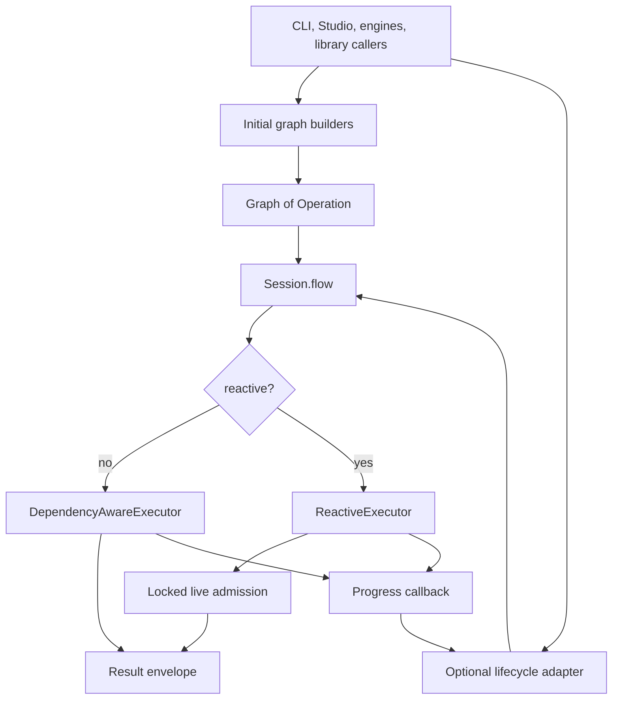

# ADR-0033: Operation-graph orchestration boundary

- **Status**: Accepted
- **Kind**: Retrospective
- **Area**: orchestration
- **Date**: 2026-07-09
- **Relations**: supersedes v0-0083, v0-0095

## Context

Lionagi has one operation-graph execution kernel, not separate executors for the
library, engines, and CLI. The boundary exists because six concrete problems must
have one answer:

**P1 — Execution semantics can drift between callers.** A graph submitted by a
library caller, a domain engine, Studio, or the CLI must use the same dependency
waits, edge-condition evaluation, branch allocation, concurrency limit, and result
collection. A second general executor in any caller would create a second answer.
`lionagi/session/session.py` and `lionagi/operations/flow.py` are the governing
anchors.

**P2 — Initial topology and live mutation have different authorities.** A caller
knows the intended initial plan, but only a running executor knows whether a live
injection would exceed capacity, introduce a cycle, or require a branch clone. The
initial graph therefore arrives complete; live mutation passes through one locked
admission path.

**P3 — Two graph builders currently disagree about an omitted dependency list.**
The role-task builders add only declared dependency or aggregation edges.
`OperationGraphBuilder.add_operation()` instead links a new operation after all
current heads when `depends_on` is falsey. The CLI uses that incremental builder,
so nominal fan-out and dependency-free DAG roots can be serialized accidentally.
`lionagi/orchestration/patterns.py`, `lionagi/operations/builder.py`,
`lionagi/cli/orchestrate/flow.py`, and `lionagi/cli/orchestrate/fanout.py` contain
the divergence.

**P4 — Model-emitted work is a request, not execution authority.** A
`SpawnRequest` can name an operation and assignee, but it must not reach arbitrary
registered operations or an unprovisioned branch. Role routing validates the
request first; graph admission separately decides whether the child enters the
live graph. `lionagi/casts/emission.py` and
`lionagi/orchestration/patterns.py` define the request and routing contracts.

**P5 — Lifecycle observation is canonical in vocabulary but optional in
transport.** The executor reports queued, started, completed, and failed progress
through a synchronous callback and emits spawn, pause, and escalation signals on
the Session bus. `flow_progress_signals()` translates callback progress into the
canonical node signals, but it lives under `lionagi/engines/` and is installed by
Engine DAG runs and Studio, not uniformly by direct CLI flow calls.

**P6 — Results must expose partial and rejected work without leaking executor
internals.** Ordinary and reactive runs return stable dictionary envelopes.
Reactive admission failures must remain inspectable because a dropped child is not
equivalent to a completed child and does not necessarily fail the parent.

| Concern | Decision |
|---------|----------|
| Shared execution boundary | D1: `Session.flow()` delegates every operation graph to the common dependency-aware or reactive executor. |
| Initial graph topology | D2: callers own initial topology; the two builder semantics and their current divergence remain explicit. |
| Planned and live work | D3: `TaskAssignment` and `SpawnRequest` are typed requests, with role routing before locked executor admission. |
| Dependencies, branches, and concurrency | D4: the kernel owns waits, context propagation, branch allocation, edge conditions, and capacity. |
| Lifecycle and result observation | D5: `op_id` is lifecycle identity; progress translation is opt-in today; result and rejection payloads are stable. |
| Adapter responsibility | D6: CLI, Studio, and engines may decorate and persist runs but do not become graph executors. |

Out of scope:

- Role, model, mode, artifact, and policy selection. Those are builder or adapter
  concerns; this ADR decides only how a selected operation graph executes.
- Domain reaction topology. ADR-0034 owns engines that coordinate non-DAG work.
- Persisted completion across process boundaries. ADR-0035 owns the completion
  record and machine-facing wait contract.
- Dynamic role-palette expansion and tier selection. ADR-0036 and ADR-0038 own
  those target policies; this ADR supplies their final admission chokepoint.
- Queue leases and resident process lifecycle. ADR-0037 owns host-level work
  acquisition and recovery.



## Decision

### D1 — One Session facade and execution kernel

Every initial operation graph enters through `Session.flow()`. The Session resolves
the default branch and delegates without redefining scheduling semantics.

**The contract** (`lionagi/session/session.py`; `lionagi/operations/flow.py`):

```python
async def Session.flow(
    self,
    graph: Graph,
    *,
    context: dict[str, Any] | None = None,
    parallel: bool = True,
    max_concurrent: int = 5,
    verbose: bool = False,
    default_branch: Branch | ID.Ref | None = None,
    alcall_params: Any = None,
    on_progress: Any = None,
    reactive: bool = False,
    spawn_type: type | None = None,
    node_builder: Any = None,
    max_spawn: int = 50,
    executor_ref: dict[str, Any] | None = None,
    on_branch_created: Callable[[Any], None] | None = None,
    spawn_branch_setup: Callable[[Any, Any], None] | None = None,
) -> dict[str, Any]: ...

async def flow_stream(
    session: Session,
    graph: Graph,
    *,
    branch: Branch = None,
    context: dict[str, Any] | None = None,
    max_concurrent: int | None = None,
    verbose: bool = False,
    alcall_params: AlcallParams | None = None,
    spawn_type: type | None = None,
    node_builder: Any = None,
    max_spawn: int = 50,
): ...  # yields FlowEvent
```

```python
@dataclass(slots=True)
class FlowEvent:
    operation_id: str
    name: str
    status: str          # "completed" | "failed" | "skipped"
    result: Any
    spawned: bool = False

    @property
    def ok(self) -> bool: ...
```

**Exact semantics**:

- `reactive=False` constructs `DependencyAwareExecutor`; `reactive=True`
  constructs `ReactiveExecutor`. There is no caller-specific executor selected by
  CLI, Studio, or engine identity.
- `parallel=False` forces `max_concurrent=1`. Otherwise the Session default is
  five concurrent operations.
- A `max_concurrent=None` passed to the lower-level executor uses
  `LIONAGI_MAX_CONCURRENCY`, defaulting to 10,000. This is a practical
  “effectively unlimited” fallback, not an actual absence of a limiter.
- The source records no design rationale for the values 5, 50, or 10,000. They
  are inherited compatibility defaults; changing them is behaviorally visible.
- Before work begins, both executors reject a cyclic graph with
  `OperationError("Graph must be acyclic for flow execution")` and validate every
  non-null edge condition.
- `flow_stream()` is always reactive and emits one `FlowEvent` after each
  operation settles. Closing the consumer early cancels and awaits its detached
  driver.
- `cleanup_flow_results()` may clear or filter operation results after execution;
  it is not part of scheduling.

**Why this way**: Session already owns branches, the observer, and registered
operations. Keeping execution immediately below that facade gives every surface
the same branch and signal context while leaving initial plan construction outside
the kernel.

### D2 — Caller-owned initial topology, with the shipped builder divergence recorded

Initial graph design remains outside the kernel. The two shipped construction
surfaces are not semantically interchangeable.

**The contracts** (`lionagi/operations/builder.py`;
`lionagi/orchestration/patterns.py`):

```python
def OperationGraphBuilder.add_operation(
    self,
    operation: str,
    node_id: str | None = None,
    depends_on: list[str] | None = None,
    inherit_context: bool = False,
    branch=None,
    **parameters,
) -> str: ...

def build_fanout_graph(
    session: Session,
    assignments: list[TaskAssignment],
    roles: dict[str, Branch],
    *,
    synthesis_role: str | None = None,
) -> tuple[Graph, list[str]]: ...

def build_dag_graph(
    session: Session,
    assignments: list[TaskAssignment],
    roles: dict[str, Branch],
) -> tuple[Graph, list[str | None]]: ...
```

| Construction case | Shipped edge semantics |
|-------------------|------------------------|
| `OperationGraphBuilder.add_operation(..., depends_on=[...])` | Add `depends_on` edges only for ids already present in `_operations`. Unknown ids are silently ignored. |
| `OperationGraphBuilder.add_operation(..., depends_on=None or [])` with current heads | Add `sequential` edges from every current head, then make the new node the sole head. |
| `build_fanout_graph()` worker | Add a worker node with no worker-to-worker edge. |
| `build_fanout_graph(..., synthesis_role=...)` | Add one synthesis node and an `aggregate` edge from every worker. |
| `build_dag_graph()` | Convert each one-based `TaskAssignment.depends_on` reference to an index and add only declared `depends_on` edges. |

**Exact semantics**:

- The role-task dependency normalizer strips each reference, parses it as an
  integer, subtracts one, and drops non-integer, self, and out-of-range values
  with a warning.
- Forward ordinal references are accepted by `_resolve_dep_indices()` because
  validity is checked against the final assignment count, not construction order.
- Duplicate dependency references are not deduplicated by the normalizer.
- An assignment whose role is absent produces no node. Fan-out skips it; DAG
  preserves a `None` placeholder so ordinal references remain aligned.
- If no assignment maps to a role, each role-task builder raises `ValueError`.
- The incremental builder's falsey `depends_on` branch means `None` and `[]` are
  indistinguishable. A caller cannot currently express an independent root after
  a head exists through `add_operation()`.
- The executor does not infer or repair intended initial topology. It executes
  the edges it receives.

**Why this way**: initial topology is policy, while dependency waiting is
mechanism. The divergence is retained as retrospective truth, not endorsed as
ideal; delta 1 makes independent construction explicit.

### D3 — Typed planned work, typed live requests, and two-stage authority

`TaskAssignment` is the planned-work contract. `SpawnRequest` is the live-growth
contract. Neither object authorizes execution by itself.

**The contracts** (`lionagi/casts/emission.py`;
`lionagi/orchestration/patterns.py`):

```python
class TaskAssignment(BaseModel):
    task: str
    assignee: str
    inputs: list[str] = Field(default_factory=list)
    exit_criteria: str | None = None
    depends_on: list[str] = Field(default_factory=list)
    modes: list[str] = Field(default_factory=list)

class SpawnRequest(BaseModel):
    instruction: str
    assignee: str | None = None
    operation: Literal["operate", "chat", "communicate", "ReAct"] = "operate"
    independent: bool = False
    reason: str | None = None

def role_node_builder(
    roles: dict[str, Branch],
    *,
    decorate_instruction: Callable[[SpawnRequest, str], str] | None = None,
): ...  # returns Callable[[SpawnRequest, Operation], Operation]
```

**Routing semantics**:

- `plan()` drops an assignment whose assignee is not in the supplied role set.
  If `max_tasks` is non-zero, it truncates the validated list to that count.
- `role_node_builder()` checks the requested operation against
  `SPAWN_ALLOWED_OPERATIONS` even though the Pydantic field is already a
  `Literal`. A value outside the allowlist falls back to `operate` and is logged;
  a model-emitted request cannot reach a custom registered operation.
- A named assignee must already exist in the role map. An unknown assignee raises
  `ValueError`, which reactive injection records as `builder_error`.
- An omitted assignee leaves `branch_id` unset; branch assignment then follows D4.
- Successful static routing allocates a monotonic `spawn-N` id after assignee
  validation, stores it as both `spawn_id` and `reference_id`, and stamps the
  assignee when present. A later cycle or cap rejection may leave a sequence gap.
- `decorate_instruction`, when provided, receives the request and allocated
  `spawn_id`; it changes instruction text but does not change admission authority.
- The executor extracts requests recursively from direct values, lists, tuples,
  Pydantic model fields, and dictionary values to depth four. The value four is
  an inherited defensive recursion cap with no recorded rationale.
- A request observed both on the signal bus and in the completed response is
  identity-deduplicated. The second sighting is recorded as `duplicate`.

**Admission semantics** (`ReactiveExecutor._accept_node()`):

1. Hold `_graph_lock` for cap, insertion, edge, and cycle checks.
2. Reject when `_spawn_count >= max_spawn`.
3. Add the child if its id is not already present.
4. Unless `independent=True`, add a `spawn` edge from the emitter when one exists.
5. Recheck graph acyclicity; remove the new edge and newly added node on failure.
6. Increment the accepted count and record the spawned id.
7. Outside the lock, clone and register a branch for a new child, emit
   `NodeSpawned`, and report queued progress.

The routing stage decides whether a request can become a candidate operation. The
admission stage decides whether that candidate can enter this running graph.

### D4 — Kernel-owned waits, branch allocation, context, and capacity

The kernel owns the runtime mechanics after a graph is submitted.

**The executor construction contract** (`lionagi/operations/flow.py`):

```python
class DependencyAwareExecutor:
    def __init__(
        self,
        session: Session,
        graph: Graph,
        context: dict[str, Any] | None = None,
        max_concurrent: int = 5,
        verbose: bool = False,
        default_branch: Branch = None,
        alcall_params: AlcallParams | None = None,
        executor_ref: dict[str, Any] | None = None,
        on_branch_created: Callable[[Any], None] | None = None,
    ): ...

class ReactiveExecutor(DependencyAwareExecutor):
    def __init__(
        self,
        *args: Any,
        spawn_type: type | None = None,
        node_builder: Any = None,
        max_spawn: int = 50,
        spawn_branch_setup: Callable[[Operation, Any], None] | None = None,
        **kwargs: Any,
    ): ...
```

**Exact semantics**:

- A node with a valid `branch_id` uses that Session branch. A node without one is
  preallocated a clone when it has predecessors or requests inheritance. Other
  nodes fall back to the supplied default branch or `session.default_branch`.
- Reactive children always receive a clone: first from their explicit branch
  template; otherwise from the emitter's branch when dependent; otherwise from
  the Session default branch. The clone is included in the Session before run.
- `on_branch_created` is called for ordinary preallocation. Reactive cloning uses
  the separate `spawn_branch_setup` callback; the general branch-created hook is
  not called on that path today.
- A dependent operation waits for every predecessor completion event. Edge
  conditions are evaluated after their head completes; a node runs when at least
  one incoming edge remains valid, and is skipped when all incoming paths fail or
  originate at skipped nodes.
- A skipped operation is placed in `skipped_operations`, marked `SKIPPED`, and
  reported through progress as `failed`; no operation result is inserted for the
  skip path.
- Predecessor results are added to the operation context under
  `<predecessor_uuid>_result`. Flow context is then merged into that dictionary.
  A completed response containing a dictionary `context` deep-merges that value
  back into the flow context.
- A soft pause takes effect only at an operation boundary. Operations already
  inside the capacity limiter finish; waiting operations emit `NodePaused` and
  resume after the installed event is released.
- Operation invocation failure is stored as `{"error": str(error)}`. Cancellation,
  `KeyboardInterrupt`, and `SystemExit` set the completion event and propagate.
  Other unexpected flow-level exceptions are converted to an error result.
- Existing terminal operations are not invoked again. Their response is reused
  when present and their completion event is set.

**Why this way**: dependency state, accepted live nodes, and branch clones are
shared mutable execution state. Keeping them under one executor prevents callers
from observing or mutating half-applied admission decisions.

### D5 — `op_id` lifecycle identity and stable result envelopes

Canonical lifecycle identity is the operation UUID serialized as `op_id`.
Authored `reference_id` and branch names are presentation names, not identity.

**The signal contract** (`lionagi/session/signal.py`):

```python
SIGNAL_SCHEMA_VERSION: int = 1

NodeLifecycleState = Literal[
    "queued",
    "running",
    "awaiting_approval",
    "paused",
    "succeeded",
    "failed",
    "escalated",
]

class NodeQueued(Signal):
    op_id: str = ""
    name: str = ""
    elapsed: float = 0.0
    parent_id: str | None = None
    depends_on: list[str] = []

class NodeStarted(NodeQueued): ...      # same payload fields in shipped source
class NodeCompleted(NodeQueued): ...    # same payload fields in shipped source
class NodeFailed(NodeQueued): ...       # same payload fields in shipped source

class NodeSpawned(Signal):
    op_id: str = ""
    parent_id: str | None = None
    independent: bool = False
    assignee: str | None = None
    instruction: str | None = None
```

The four progress classes are separate Pydantic classes in source rather than
subclasses of `NodeQueued`; the compact block above documents their identical
field shape, not Python inheritance.

**Progress adapter** (`lionagi/engines/flow_signals.py`):

```python
@asynccontextmanager
async def flow_progress_signals(
    session: Any,
    graph: Any,
) -> AsyncIterator[Callable[[str, str, str, float], None]]: ...
```

- The callback recognizes only `queued`, `started`, `completed`, and `failed`.
  Unknown progress strings are ignored.
- It prefers authored `reference_id` for `name`, retains predecessor ids, and
  updates its edge map when `NodeSpawned` arrives.
- Callback-to-bus emission is asynchronous, but context-manager exit awaits every
  scheduled emission with `return_exceptions=True`. Observer failure therefore
  does not replace the flow result, and installed observers drain before return.
- `lane_for()` starts at `queued`. Terminal states are sticky until a later
  `queued` or `running` signal explicitly begins another attempt.
- `NodeSpawned.instruction` is truncated to 512 characters. Dropped builder error
  text is truncated to 500 characters. The source records no rationale for those
  observability caps.

**Result payloads** (`lionagi/operations/flow.py`):

```python
# Every flow
{
    "completed_operations": list[UUID],
    "operation_results": dict[UUID, Any],
    "final_context": dict[str, Any],
    "skipped_operations": list[UUID],
}

# Additional keys when reactive=True
{
    "spawned_operations": int,
    "escalated_operations": list[UUID],
    "dropped_spawns": list[{
        "reason": Literal[
            "builder_error",
            "null_child",
            "cycle",
            "max_spawn_exceeded",
            "duplicate",
        ],
        "assignee": Any,
        "emitter_id": UUID | None,
        # optional error or op_id depending on reason
    }],
}
```

- Completed ids and skipped ids are validated to be disjoint.
- Result order follows dictionary/set materialization in the executor; the API
  does not promise graph order or completion order.
- `inject()` outside an active reactive run returns `False` and logs a warning.
  It has no result object in which to add a dropped entry.
- A prebuilt `inject()` bypasses `role_node_builder()` but not `_accept_node()`;
  it remains subject to cap, cycle, branch, and ledger rules.

### D6 — Adapters decorate runs but do not own execution

The CLI is an adapter and an initial-graph caller today. It legitimately owns
model and pack resolution, branch names, artifact directories, checkpoint and
state persistence, control polling, and terminal presentation. Studio and engines
likewise install observation and persistence around `Session.flow()`.

**Shipped boundary**:

```text
lionagi/session/session.py             public flow facade
lionagi/operations/flow.py             scheduling and live admission
lionagi/orchestration/patterns.py       library role/task planning and graph construction
lionagi/engines/flow_signals.py         optional callback-to-signal adapter
lionagi/cli/orchestrate/_orchestration.py model, branch, artifact, and persistence setup
lionagi/cli/orchestrate/flow.py         CLI plan, topology, checkpoint, control, synthesis
lionagi/cli/orchestrate/fanout.py       CLI fan-out construction and presentation
```

**Exact semantics**:

- `EngineRun.run_dag()` installs `flow_progress_signals()` and delegates to the
  Session. It does not plan or execute nodes itself.
- CLI graph code may decorate instructions and metadata before submission and
  correlate reactive children afterward, but accepted live graph mutation remains
  inside `ReactiveExecutor`.
- CLI use of `OperationGraphBuilder` means it currently participates in D2's
  topology divergence. That is a recorded defect, not a second executor.
- Direct CLI flow calls do not uniformly install the lifecycle translation
  adapter, so absence of a canonical signal does not prove a node did not run.

**Why this way**: forcing adapter-specific artifact, terminal, or persistence
policy into the kernel would couple generic scheduling to one surface. Letting an
adapter schedule independently would be worse: execution correctness would vary by
entry point.

## Consequences

- Scheduling, dependency waits, capacity, branch assignment, and runtime graph
  safety have one implementation and one failure model.
- Typed requests, result envelopes, and signals expose most failures without
  exposing task-group or lock internals.
- Callers must understand that initial topology is authoritative. The kernel does
  not infer “fan-out” from a list of nodes.
- Correcting the incremental-builder divergence can expose races that accidental
  serialization previously hid; migration therefore requires topology and
  concurrency tests together.
- Uniform lifecycle emission would increase observer traffic and make
  drain-before-return ordering a compatibility obligation for every caller.
- Reactive admission is best-effort and non-transactional with parent work. A
  rejected child is recorded; it does not roll back the emitter.
- Reversing D1 would be high cost because every caller and observation surface
  would need a new execution contract. Reversing D2 or D5 is medium cost because
  builders and observers are public integration points. Changing the numeric
  defaults is low implementation cost but potentially high behavioral impact.
- Contributors extending orchestration must decide whether they are adding plan
  policy (builder/engine/adapter) or runtime mechanism (kernel) before choosing a
  module.

## Current-vs-ideal delta

| # | Delta | Size | Issue |
|---|-------|------|-------|
| 1 | Make sequential linking explicit in `OperationGraphBuilder`, migrate CLI fan-out and dependency-free DAG roots to independent-node construction, and add topology tests proving that no undeclared worker-to-worker edges exist. | M | (filled at issue-open time) |
| 2 | Implement one `TaskAssignment.depends_on` normalizer for pattern and CLI builders, document whether forward ordinal references are accepted, and validate the normalized graph for cycles before execution. | S | #2027 |
| 3 | Move callback-to-node-signal conversion from `engines` to a neutral flow/session module, expose a named observed-flow facade, and migrate EngineRun, Studio, CLI fan-out, CLI synthesis, and main CLI flow without changing signal ordering or result shape. | M | (filled at issue-open time) |
| 4 | Parameterize the shared role-task builders with branch, instruction, identity, and artifact decorators, then remove CLI-owned duplicate edge wiring while preserving checkpoint and artifact identities. | M | (filled at issue-open time) |

## Alternatives considered

### Separate executors for engines or CLI

This would let each surface optimize its own scheduling and lifecycle handling. It
lost because the same `Graph[Operation]`, Session branches, edge conditions, and
reactive requests would acquire surface-dependent behavior. The existing code
already demonstrates that engines can wrap `Session.flow()` without becoming an
executor.

### Kernel-owned initial planning

Moving task decomposition, role selection, and edge construction into the executor
would guarantee one builder. It lost because those are domain and product policies:
the research engine is a reaction tree, the CLI carries artifacts and checkpoints,
and library callers may already own a graph. The executor needs a graph, not a
reason why the graph was chosen.

### Treat every omitted dependency as an independent root

This would fix fan-out callers but break the shipped incremental-builder
convenience where successive operations intentionally form a chain. It lost as an
unqualified compatibility change. The delta instead requires an explicit API so
both independent and sequential intent are representable.

### Treat every omitted dependency as “after current heads”

This is the current incremental-builder shape and makes simple chain construction
compact. It lost as the universal rule because a fan-out loop becomes a chain and
multiple independent DAG roots cannot be represented after the first node.

### Let emitted `SpawnRequest` call any registered operation

This would make reactive flows extensible without changing the request `Literal`.
It lost because model output would become authority to reach custom operations.
The allowlist and branch map are deliberate confinement boundaries.

### Put lifecycle translation in role-pattern code

Role builders see authored task and assignee data and could emit rich signals. It
lost because direct graph callers and injected prebuilt operations need the same
lifecycle, while role-pattern code does not observe all executor transitions.

### Emit canonical lifecycle signals directly and only from the executor

This would remove the opt-in adapter. It was not the shipped choice: the executor
retains a generic progress callback, while signal persistence is installed by
callers that need it. The current-vs-ideal delta records neutral observation as the
desired consolidation path without rewriting retrospective truth.

### Force CLI orchestration through the convenience `fanout()` helper

That would reuse library graph construction immediately. It lost because the CLI
also needs per-leg artifact directives, stable identities, checkpoints, resume,
control polling, and synthesis metadata. Shared builders need decorator seams
before the duplicate topology path can be removed safely.

### Roll back an emitter when a live child is rejected

This would make a spawn request appear atomic with its parent. It lost because the
parent operation has already completed and may have external effects; the graph
executor has no transaction spanning an LLM turn, tools, and arbitrary operations.
The honest contract is retained parent work plus a reasoned rejection ledger.

## Notes

Unknown Role and Mode diagnostics list the available catalog names, and
`examples/reactive_spawn.py` is constructed to produce an accepted spawn while
directing protected workflows to the engine layer. These improve discoverability
but do not change graph semantics.
