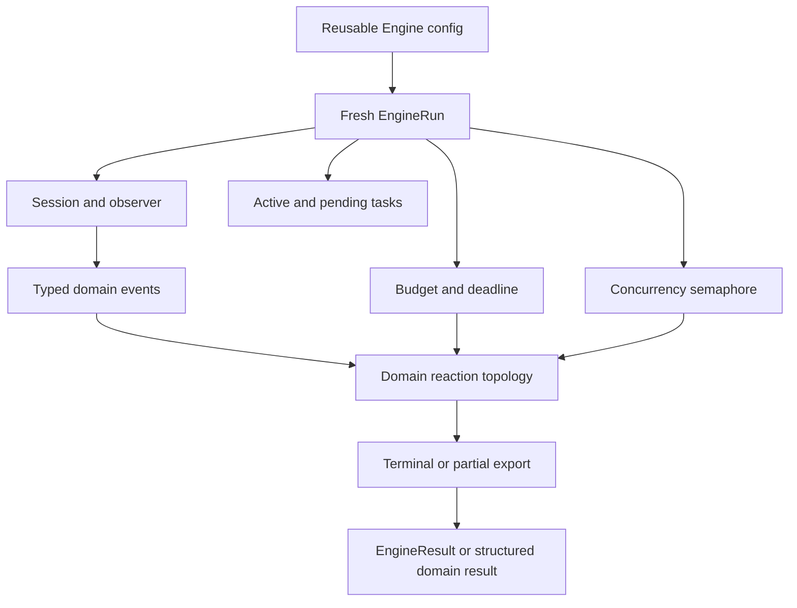

# ADR-0034: Domain-engine coordination and autonomy safeguards

- **Status**: Accepted
- **Kind**: Retrospective
- **Area**: orchestration
- **Date**: 2026-07-09
- **Relations**: supersedes v0-0075, v0-0077; extends ADR-0033

## Context

Domain engines encode reusable reaction topology for work whose decomposition is
stable enough to deserve code. Six problems shape that layer.

**P1 — Reusable policy and mutable run state have different lifetimes.** Model
routing, roles, thresholds, and caps may be reused. A Session, observed events,
deduplication keys, pending coroutines, counters, and a deadline must not leak from
one invocation into the next. `lionagi/engines/engine.py` separates `Engine` from
`EngineRun` for that reason.

**P2 — The shipped domains do not share one useful topology.** Research is a
novelty-bounded tree, review is dimensional fan-out plus verification and verdict,
hypothesis is an event-reference chain with pending experiments, coding is a
subprocess-gated plan/implement/test/fix/verify chain, and planning is a planned
operation DAG. Forcing all five through one topology would move domain semantics
into generic graph plumbing.

**P3 — Prompted autonomy limits are not safety controls.** Recursive or reactive
work must stop at hard agent and wall-clock bounds, and concurrent activity must
pass a semaphore. Semantic depth, deduplication, and a quality judge reduce work;
they cannot replace the hard bounds.

**P4 — Typed emissions can be absent or malformed.** Domain transitions depend on
events such as findings, questions, tests, and verdicts. A prose-only or invalid
response must be observable and may receive a bounded repair turn, but the engine
must not fabricate the missing domain event.

**P5 — Expansion quality and terminal reporting have different failure policy.** A
judge is advisory: infrastructure failure fails open while budget exhaustion fails
closed. Terminal synthesis or partial export is budget-exempt so evidence already
collected is not lost merely because discretionary expansion stopped.

**P6 — Bounded completion must remain distinguishable from a broken run.** String
results retain `str` compatibility while carrying a live run handle, skipped
emission diagnostics, and explicit degradation state. Internal deadline or
agent-budget exhaustion can return partial evidence; external cancellation and
non-budget failures still propagate.

| Concern | Decision |
|---------|----------|
| Configuration and state lifetime | D1: `Engine` is reusable configuration and `EngineRun` owns all invocation state. |
| Hard resource bounds | D2: agent creation and wall-clock deadlines dominate semantic gates; concurrency is separately bounded. |
| Typed event coordination | D3: event queries unwrap payloads, repair is bounded, and judge failures follow explicit policies. |
| Domain topology | D4: each concrete engine owns its reaction shape and typed events. |
| Terminal and degraded result | D5: string results use `EngineResult`; budget/deadline paths use bounded partial export and explicit reasons. |
| Operation-DAG interoperation | D6: engine DAG execution observes and delegates through ADR-0033 instead of scheduling again. |

Out of scope:

- Generic graph scheduling and reactive node admission. ADR-0033 owns them.
- Role-palette composition and dynamic role recruitment. ADR-0036 owns that target.
- Resident queue leases, task attempts, and process recovery. ADR-0037 owns the
  host boundary.
- Provider implementation and tool execution semantics. Engines select existing
  Branch configuration; they do not redefine providers or tools.
- A universal durable event-retention policy. The current store is in memory; the
  missing compaction contract is recorded in the delta.



## Decision

### D1 — Reusable `Engine`, isolated `EngineRun`

`Engine` stores stateless configuration. `new_run()` creates all mutable
invocation state, using a caller-provided Session only when explicitly supplied.

**The contracts** (`lionagi/engines/engine.py`):

```python
class Engine:
    run_context_cls: type[EngineRun] = EngineRun

    def __init__(
        self,
        *,
        model: str | None = None,
        models: dict[str, str] | None = None,
        max_depth: int = 3,
        max_concurrent: int = 5,
        max_agents: int = 50,
        deadline_s: float | None = None,
        judge_model: str | None = None,
        judge_role: str = "critic",
        cancel_timeout_s: float = 30.0,
    ) -> None: ...

    def new_run(
        self,
        *,
        session: Session | None = None,
        on_event: EventCallback | None = None,
        on_branch_created: Callable[[Any], None] | None = None,
    ) -> EngineRun: ...

class EngineRun:
    def __init__(
        self,
        engine: Engine,
        *,
        session: Session | None = None,
        on_event: EventCallback | None = None,
        on_branch_created: Callable[[Any], None] | None = None,
    ) -> None: ...
```

The fresh run owns:

```text
session: Session
root: str
agents_made: int
_sem: Semaphore(engine.max_concurrent)
_active: set[asyncio.Task]
_pending: deque[coroutine]
_seen: set[str]
_t0: monotonic timestamp
_deadline: monotonic timestamp | None
_run_task: asyncio.Task | None
_emission_failures: list[str]
_agent_errors: list[str]
```

**Exact semantics**:

- No Session supplied: the run constructs a new `Session()`.
- Session supplied: the run uses that Session and its observer; it does not clone
  or reset it.
- `models` is copied on Engine construction. `model_for(stage)` returns the
  stage-specific mapping when truthy, otherwise the base model.
- `seen(key)` strips and lowercases the key. It returns `True` for a duplicate and
  records a previously unseen key.
- `events` is the Session observer flow's item pile. Long-lived runs retain that
  in-memory history; no compaction occurs.
- `on_event`, when set, receives plain dictionaries of the form
  `{"type": kind, **data}`. Agent errors are additionally accumulated.
- `ChainRun` adds per-event-type lists, deterministic prefix counters, an
  `eid -> event` index, and pending-domain state in its concrete subclasses.

**Why this way**: the Engine object is safe to configure once and reuse. Mutable
state has a single owner and lifetime, which makes budget, quiescence, and cleanup
reasoning local to one invocation.

### D2 — Hard agent/deadline bounds and separate concurrency

Agent count and deadline are hard run controls. Concurrency limits simultaneous
work but does not grant more budget.

**The creation contract** (`lionagi/engines/engine.py`):

```python
async def EngineRun.make_agent(
    self,
    role: str,
    *,
    name: str | None = None,
    modes: list[str] | None = None,
    model: str | None = None,
    tools: tuple[str, ...] = (),
    emits: tuple[type, ...] = (),
    permissions: Any = None,
    cwd: str | None = None,
    secure: bool = True,
    exempt: bool = False,
    mcp_servers: list[str] | None = None,
    extra_prompt: str | None = None,
) -> Branch: ...

class EngineBudgetError(RuntimeError): ...
```

**Exact semantics**:

- `budget_left()` is false when `agents_made >= max_agents` or the monotonic
  deadline has arrived. Depth, novelty, deduplication, and judge results are not
  consulted by this hard predicate.
- A non-exempt `make_agent()` call without budget emits one `budget_exhausted`
  notification for the run and raises `EngineBudgetError`.
- An exempt terminal agent bypasses the pre-check but still increments
  `agents_made`. Exemption preserves reporting; it is not hidden from accounting.
- `spawn(coro)` checks the same predicate before scheduling. On exhaustion it
  closes the coroutine when possible, emits the one-time notification, and returns
  `None`.
- A spawn attempted without a running asyncio loop is queued in `_pending`;
  `drain_pending()` later schedules every queued coroutine.
- `wait_quiescence()` repeatedly gathers active tasks. `CancelledError` and
  `EngineBudgetError` are treated as bounded expansion stopping; any other task
  error is re-raised, singly or as an exception group.
- The deadline watchdog sleeps until `_deadline`, records exhaustion, and cancels
  the root `_run_task`. `Engine.run()` then cancels spawned tasks in cleanup.
- `cancel_active()` requests cancellation, waits at most `cancel_timeout_s`, warns
  about tasks still pending, issues a final cancel, and returns. A task that
  suppresses cancellation can therefore outlive the wait window, but the run does
  not wait indefinitely.
- `run_team()` is sequential even though the run owns a semaphore. One agent
  failure is converted to a notification and failure text so later team members
  continue.

**Shipped numeric defaults and their traceable rationale**:

| Setting | Default | Recorded reason |
|---------|---------|-----------------|
| `Engine.max_depth` | `3` | Inherited compatibility default; no rationale is recorded in source. |
| `Engine.max_concurrent` | `5` | Inherited compatibility default; no rationale is recorded in source. |
| `Engine.max_agents` | `50` | Inherited compatibility default; no rationale is recorded in source. |
| `Engine.deadline_s` | `None` | No wall-clock deadline unless the caller chooses one. |
| `Engine.cancel_timeout_s` | `30.0` seconds | Bounds cleanup of cancellation-resistant tasks; the exact value has no recorded rationale. |
| Partial-export timeout | `120.0` seconds | Kept short enough that a hung synthesis call cannot extend a cancelled run without bound; the exact value has no further recorded rationale. |

**Why this way**: semantic controls improve work selection but are fallible model or
domain policy. Agent creation and monotonic time are enforceable locally and remain
authoritative when those policies fail.

### D3 — Typed payload queries, bounded repair, and advisory judging

Domain coordination observes typed emissions on the Session bus. `EngineRun`
provides a payload-oriented query so callers do not depend on envelope shape.

**The contracts** (`lionagi/engines/engine.py`):

```python
class EngineEvent(BaseModel):
    model_config = ConfigDict(extra="forbid")

class JudgeVerdict(EngineEvent):
    subject: str = ""
    allow: bool = True
    reason: str = ""

def EngineRun.by_type(self, event_type: type) -> list[Any]: ...

async def EngineRun.operate_with_repair(
    self,
    branch: Branch,
    instruction: str,
    *,
    arrived: Callable[[], bool],
    emits: tuple[type, ...] = (),
    retries: int = 1,
) -> Any: ...

async def Engine.judge(
    self,
    run: EngineRun,
    eid: str,
    subject: str,
) -> bool: ...
```

**Exact semantics**:

- `by_type(T)` walks observer items, unwraps `Signal.data`, and delegates matching
  to the observer's type/callable filter. Matching values inside structured
  capability bundles are returned as payloads, not their envelopes.
- `operate_with_repair()` always performs the original operation once. While
  `arrived()` remains false, it re-prompts at most `retries` times.
- CLI-backed branches receive a complete fenced-JSON example built from required
  Pydantic fields. Other branches receive expected top-level emission keys and a
  schema-correction instruction.
- Repair asks the model to emit; it never constructs a domain event on the model's
  behalf.
- If all attempts finish without `arrived()`, the method emits
  `emission_missing`, records `<agent> x<attempt-count>`, and returns the last raw
  response.
- All concrete engine repair defaults are one retry. No comparative rationale for
  one rather than zero or two is recorded in source; it is a bounded compatibility
  default.
- No `judge_model`: judging is a no-op and returns `True`.
- A typed `JudgeVerdict` whose subject matches the requested id is authoritative.
  In its absence, response text containing `reject` fails the gate; other text
  passes.
- Judge `EngineBudgetError` returns `False`: no budget means no expansion.
- Other judge exceptions emit `judge_error` and return `True`: infrastructure
  failure is fail-open while D2 remains authoritative.

**Why this way**: payload-oriented queries keep engines independent of observer
transport. Bounded repair addresses common serialization failure without turning a
missing emission into invented evidence. The judge is an optimization, not a hard
availability dependency.

### D4 — Each engine owns its domain reaction topology

The concrete engines intentionally do not share one execution shape.

**Shipped topology and public configuration**:

| Engine | Constructor additions | Reaction shape and edge behavior |
|--------|-----------------------|----------------------------------|
| `ResearchEngine` (`lionagi/engines/research.py`) | `novelty_threshold=0.7`, roles `("researcher", "analyst", "critic")`, `synthesis_role="synthesizer"`, `repair_retries=1` | Runs each node's team sequentially; high-novelty findings and explicit depth requests spawn deeper nodes until `max_depth`; normalized topic dedup prevents re-exploration. |
| `ReviewEngine` (`lionagi/engines/review.py`) | four default dimensions, reviewer/verifier roles, `verify_severities=("critical", "major")`, `repair_retries=1` | Reviews dimensions concurrently; qualifying issues spawn adversarial verification; all verifiers quiesce before one exempt verdict turn. |
| `HypothesisEngine` (`lionagi/engines/hypothesis.py`) | seven stage roles, executable methods `("analysis", "comparison", "proof")`, `max_questions=8`, `repair_retries=1` | Typed events carry reference ids through question, evidence, hypothesis, experiment, result, conclusion, and application reactions; non-executable experiments enter `run.pending`. |
| `CodingEngine` (`lionagi/engines/coding.py`) | plan/implement/verify roles, `max_fix_rounds=3`, test and turn timeouts `600.0`, heartbeat `30.0`, optional stage timeout, guarded worker tool settings | Runs a plan/implement/test/fix/verify chain; subprocess results are ground truth; missing change metadata can be synthesized only when workspace delta proves work occurred. |
| `PlanningEngine` (`lionagi/engines/planning.py`) | orchestrator, five-role default roster, synthesis role, `reactive=True` | Plans `TaskAssignment` objects, retries an empty plan once, builds an operation DAG, delegates through D6, then synthesizes results. |

The exact domain event fields remain in their defining modules. The load-bearing
base shapes include:

```python
class ChainEvent(BaseModel):
    eid: str = ""  # engine-assigned

class FindingEmitted(Finding):
    novelty: float = Field(default=0.5, ge=0.0, le=1.0)
    depth: int = 0

class IssueFound(Finding):
    dimension: str
    location: str = ""
    severity: str = "minor"

class VerifyResult(EngineEvent):
    issue: str
    holds: bool = True
    rationale: str = ""
```

**Exact cross-engine semantics**:

- Research rejects an empty stripped topic. Hypothesis rejects an empty normalized
  seed list. Planning rejects an empty stripped prompt and raises `PlanError` after
  one empty-plan retry. Coding validates its spec before run state and requires a
  non-empty test command.
- Research and hypothesis override `_partial_export()` only when evidence exists;
  they prefix a budget-exhausted status and synthesize the retained events.
- Review's concurrent dimension failure cancels already-spawned verifier work and
  propagates. Individual research team-agent errors are recorded and the team
  continues.
- Hypothesis stage guards catch and notify ordinary stage errors so unrelated
  event chains can continue. Non-executable experiment methods are retained as
  pending rather than treated as failure.
- Coding's test timeout is 600 seconds, turn timeout is 600 seconds, maximum fix
  rounds is three, and heartbeat interval is 30 seconds by default. The source
  explains the behavioral role of each bound but records no rationale for the
  exact values.
- Research's 0.7 novelty threshold, hypothesis's eight-question cap, and coding's
  three-fix cap likewise have no recorded numeric rationale. They are explicit
  policy defaults and caller-overridable.
- Only PlanningEngine submits a `Graph[Operation]` through `Session.flow()`. The
  others coordinate Branch turns and typed domain events directly.

**Why this way**: the common layer is lifecycle, budget, event observation, repair,
and terminal behavior. Reaction edges encode domain meaning and stay with the
engine that can name and test that meaning.

### D5 — Explicit degradation and backward-compatible string results

String-producing engines return an `EngineResult`, a `str` subclass with structured
run metadata. Non-string domain results pass through unchanged.

**The contracts** (`lionagi/engines/engine.py`):

```python
class EngineResult(str):
    text: str
    skipped: list[str]
    degraded: bool
    degrade_reason: str
    run: EngineRun

    def __new__(
        cls,
        text: str,
        *,
        events_by_type: Callable[[type], list[Any]],
        skipped: list[str],
        degraded: bool,
        run: EngineRun,
        degrade_reason: str = "",
    ) -> EngineResult: ...

    def events_by_type(self, event_type: type) -> list[Any]: ...

async def Engine.run(
    self,
    *args: Any,
    session: Session | None = None,
    on_event: EventCallback | None = None,
    on_branch_created: Callable[[Any], None] | None = None,
    **kwargs: Any,
) -> Any: ...
```

**Exact semantics**:

- `str(result) == result.text`. `skipped` is a copy of missing-emission
  diagnostics. `events_by_type()` remains backed by the live run's query method.
- A clean string result has `degraded=False` and `degrade_reason=""`.
- If discretionary spawned work hit the budget but the root completed,
  `degrade_reason="budget"` is still set; truncation is not hidden by the success
  path.
- A root-level `EngineBudgetError`, or an exception group containing only budget
  errors, cancels active work, runs `_partial_export()`, and marks `budget`.
- An internal deadline cancellation follows the same export path and marks
  `deadline`.
- Partial export is shielded and bounded to 120 seconds. Timeout or export failure
  is logged and yields no partial result; external cancellation during partial
  export cancels the export task and propagates.
- An exception group with any non-budget leaf propagates. Budget handling does not
  launder ordinary failures into a degraded result.
- Caller cancellation propagates after run-owned cleanup. On Python 3.10, a caller
  cancellation simultaneous with the deadline may be classified as the internal
  deadline because the stronger `Task.cancelling()` signal is unavailable; the
  source records this compatibility edge case.
- `_wrap_result()` wraps only plain strings. Existing `EngineResult` and non-string
  values pass through. `CodingEngine` therefore returns its structured
  `CodeResultRecorded` rather than an `EngineResult`.
- The `run` property retains the whole Session and its branches. Consumers should
  not keep it longer than needed.

**Why this way**: callers that historically consumed a string keep working, while
new callers can distinguish full success, bounded partial completion, and missing
emissions without parsing report prose.

### D6 — Engine DAG execution delegates to the graph boundary

An engine may use a graph when its domain topology is naturally an operation DAG.
It does not gain a second scheduler.

**The contract** (`lionagi/engines/engine.py`):

```python
async def EngineRun.run_dag(
    self,
    graph: Any,
    *,
    reactive: bool = False,
    spawn_type: type | None = None,
    node_builder: Any = None,
    max_spawn: int = 50,
    max_concurrent: int = 5,
    verbose: bool = False,
    executor_ref: dict[str, Any] | None = None,
    context: dict[str, Any] | None = None,
    spawn_branch_setup: Any = None,
) -> dict[str, Any]: ...
```

**Exact semantics**:

- The method enters `flow_progress_signals(self.session, graph)`, passes the
  resulting callback to `Session.flow()`, awaits the result, then exits the context
  so observer emissions drain before return.
- It applies no planning, role, budget, or domain policy itself. PlanningEngine
  chooses the graph before calling it.
- `max_spawn=50` and `max_concurrent=5` mirror the ADR-0033 defaults. No separate
  engine rationale is recorded.
- The method's generic placement on every `EngineRun` is current package debt. The
  neutral observed-flow facade in ADR-0033's delta is the intended generic owner.

## Consequences

- Known workflows reuse tested domain policy without replanning every invocation.
- Resource bounds, typed-emission repair, judge behavior, cleanup, and terminal
  degradation are consistent across local, API, CLI-backed, and process-gated
  workers.
- New engines add real maintenance surface: event models, reaction edges, routing
  stages, partial-export semantics, and conformance tests.
- Advisory judging and repair add bounded model cost. Exempt terminal turns can
  take the recorded agent count beyond `max_agents` by design.
- The live `EngineResult.run` handle and retained observer history can consume
  substantial memory in long runs. Callers must release results they no longer
  need; a compaction contract is not yet shipped.
- Contributors must choose explicitly between a domain reaction loop and an
  operation DAG. That distinction is intentional and affects where failures,
  retries, and typed events belong.
- Reversing D1 or D5 is high cost because it changes reuse and caller-visible
  result semantics. Changing a concrete topology is scoped to that engine but can
  invalidate its event-reference and partial-export contracts.

## Current-vs-ideal delta

| # | Delta | Size | Issue |
|---|-------|------|-------|
| 1 | Define and implement an event-retention or compaction policy for long-running `EngineRun` instances, with a test proving that required audit and terminal-summary events survive compaction. | M | (filled at issue-open time) |
| 2 | Change `EngineRun.run_dag()` into a compatibility delegator over the neutral observed-flow facade and document the facade, rather than the engine method, as the generic graph-observation surface. | S | (filled at issue-open time) |
| 3 | Add one conformance suite that exercises agent budget, deadline cancellation, emission repair, judge failure, and terminal degradation across every concrete engine shape. | M | (filled at issue-open time) |

## Alternatives considered

### One DAG-only engine model

This would give every workflow one visualizable scheduling representation and
reuse ADR-0033 universally. It lost because research and hypothesis react to typed
events whose future branches do not exist at plan time, while coding contains
subprocess gates and workspace truth that are clearer as a guarded chain. Encoding
all of that as generic graph metadata would hide domain policy in node callbacks.

### One bespoke runtime per domain

This would let each engine choose its own task lifecycle and optimize aggressively.
It lost because agent budget, deadline cancellation, event observation, repair,
and cleanup are cross-domain invariants. Copying them would create inconsistent
failure and degradation behavior.

### Store mutable state on the reusable Engine

This would reduce the number of objects and make counters easy to inspect. It lost
because concurrent or sequential reuse would share Sessions, counters, pending
tasks, and dedup keys. A prior run could suppress or exhaust later work.

### Prompt-only autonomy limits

This would avoid counters, watchdogs, and cancellation machinery. It lost because a
model can ignore or misunderstand a prompt, and recursive reactions can be emitted
indirectly. Enforceable agent creation and monotonic deadline checks are required.

### Make the quality judge authoritative and fail-closed on every error

This would prevent expansion whenever quality cannot be proven. It lost because a
judge provider or parse failure would become a global availability dependency.
Budget exhaustion still fails closed; other judge errors fail open under the hard
bounds.

### Fabricate a minimal event after repair exhaustion

This would keep pipelines moving and simplify downstream code. It lost because a
syntactically valid placeholder is not evidence. Missing emission stays observable,
and downstream domain logic decides whether absence is legitimate or terminal.

### Raise on all budget exhaustion

This would make limits unmistakable. It lost because a bounded run may already
hold useful evidence, and losing terminal synthesis makes the budget less useful.
`EngineBudgetError` remains the internal control signal; the public string result
marks degradation explicitly.

### Return a new result model instead of a `str` subclass

This would be cleaner for new code. It lost on backward compatibility: existing
callers expect text. `EngineResult` preserves string behavior while adding a typed
inspection surface.

### Unbounded repair until a typed event arrives

This would maximize the chance of satisfying a stage contract. It lost because a
malformed or incapable worker could spend the entire run. One retry is the shipped
default; final absence is recorded rather than hidden.

### Put graph scheduling inside PlanningEngine

This would make the planning engine self-contained. It lost because graph
execution, branch allocation, lifecycle, and live admission already have one owner
in ADR-0033. `run_dag()` is an observation-and-delegation convenience only.
