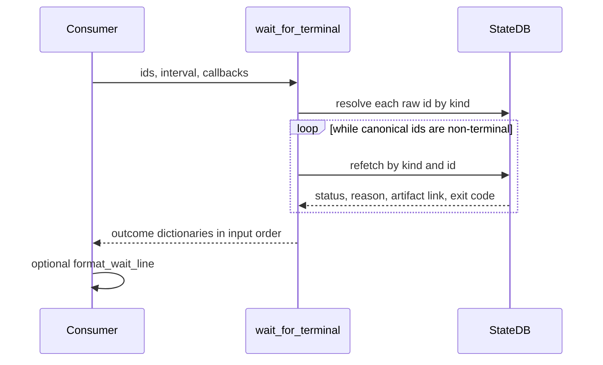

# ADR-0035: Persisted run-completion contract

- **Status**: Accepted
- **Kind**: Retrospective
- **Area**: orchestration
- **Date**: 2026-07-09
- **Relations**: supersedes v0-0094

## Context

An orchestration process ending is not sufficient evidence that its work
completed. Persisted state is the boundary because five problems cannot be solved
reliably from process exit or human output.

**P1 — Process exit and work completion are different facts.** A command may exit
normally after producing no evidence, after cancellation, or after recording a
failed run. Conversely, the process that started work may not be the process that
later observes completion.

**P2 — Completion spans heterogeneous records.** Lionagi records Sessions,
invocations, plays, and scheduled runs with kind-specific status vocabularies. A
consumer may wait for a mixed set and must not hard-code one terminal set for all
of them.

**P3 — Human monitoring output is not a machine contract.** Dashboards and monitor
lines may change presentation. Automation needs one frozen line grammar and one
importable structured API, with diagnostics kept off stdout.

**P4 — Artifact locations differ internally by kind.** A Session id maps directly
to a run directory. An invocation, play, or scheduled run must resolve through its
backing primary Session. Consumers should receive that stable manifest container,
not learn every record relationship.

**P5 — A completion record is useful only if status writes are trustworthy.** A
terminal record must not silently return to running or oscillate to another
terminal state. Concurrent writers must not win by racing a Python read-modify-
write gap. `lionagi/state/db.py` therefore owns both the vocabularies and the
guarded write path.

`lionagi/cli/wait.py` is the machine-facing read boundary. It resolves mixed run
kinds, polls until each reaches its schema-owned terminal status, produces a
structured outcome, and renders a tab-delimited line. The state layer owns the
write integrity that makes those outcomes meaningful.

| Concern | Decision |
|---------|----------|
| Completion authority | D1: persisted, kind-specific state is authoritative; process state is not. |
| Resolution and waiting | D2: `wait_for_terminal()` resolves mixed ids, refetches by canonical kind/id, and returns outcomes in input order. |
| Outcome and stdout contract | D3: one structured outcome shape and one frozen tab-delimited rendering expose status, reason, run directory, and exit code. |
| CLI diagnostics and aggregate exit | D4: stdout carries contract lines only; stderr and process exit report lookup, interruption, and aggregate success. |
| Status integrity | D5: one transactional update path validates vocabularies, protects terminal values, and performs storage-level compare-and-set. |

Out of scope:

- Certification of artifact contents. Completion reports where evidence lives; it
  does not assert that a manifest or artifact satisfies a caller's acceptance test.
- The human dashboard and monitor presentation. They may consume the same state but
  do not define this machine grammar.
- Push delivery. The shipped implementation polls; a subscription-backed transport
  is retained as a delta and must preserve identical outcomes and bytes.
- Persistence schema design beyond status integrity and backing-session resolution.
  The persistence-state area owns table lifecycle and storage architecture.
- Host queue acknowledgement. ADR-0037 defines the target TaskSource contract;
  `li wait` observes persisted run records, not queue leases.



## Decision

### D1 — Persisted kind-specific state is completion authority

Terminal predicates live beside record schemas, and the wait path imports them.
It does not infer completion from an exit code or maintain a duplicate vocabulary.

**The contract** (`lionagi/state/db.py`):

```python
SESSION_TERMINAL_STATUSES = frozenset({
    "completed",
    "completed_empty",
    "failed",
    "timed_out",
    "aborted",
    "cancelled",
})

INVOCATION_TERMINAL_STATUSES = SESSION_TERMINAL_STATUSES
SCHEDULE_RUN_TERMINAL_STATUSES = frozenset({
    "completed", "failed", "timed_out", "skipped", "cancelled"
})
PLAY_TERMINAL_STATUSES = frozenset({
    "merged", "escalated", "gate_failed", "blocked", "aborted_after_finish"
})

TERMINAL_STATUSES_BY_ENTITY_TYPE: dict[str, frozenset[str]] = {
    "session": SESSION_TERMINAL_STATUSES,
    "invocation": INVOCATION_TERMINAL_STATUSES,
    "schedule_run": SCHEDULE_RUN_TERMINAL_STATUSES,
    "show": frozenset({"completed", "aborted"}),
    "play": PLAY_TERMINAL_STATUSES,
    "team": frozenset({"archived"}),
}
```

The wait surface supports four of those kinds:

| Kind | Terminal statuses | Success statuses for aggregate CLI exit |
|------|-------------------|------------------------------------------|
| `session` | `completed`, `completed_empty`, `failed`, `timed_out`, `aborted`, `cancelled` | `completed` |
| `invocation` | same as Session | `completed` |
| `play` | `merged`, `escalated`, `gate_failed`, `blocked`, `aborted_after_finish` | `merged` |
| `schedule_run` | `completed`, `failed`, `timed_out`, `skipped`, `cancelled` | `completed` |

**Exact semantics**:

- A completed-empty Session or invocation is terminal but not successful for the
  aggregate CLI exit. Completion and acceptance remain separate.
- A terminal status with a non-zero recorded `exit_code` is still classified by
  the kind/status success table; the exit code is reported as evidence rather than
  used as the terminal predicate.
- `show` and `team` terminal sets are schema-owned but are not accepted by
  `_resolve_wait_target()` today.
- A kind absent from the terminal mapping has no terminal statuses in the wait
  loop and would not complete through that path. Supported resolvers always return
  one of the four documented kinds.
- Status reason vocabulary is separately validated by
  `lionagi/state/reasons.py`. A missing or unrecognized persisted code is reported
  as the literal `unknown`, never replaced with an invented valid reason.

**Why this way**: record owners know which states are terminal and what those
states mean. Centralizing the sets with the schema makes every observer and writer
share one vocabulary.

### D2 — Mixed-kind resolution and poll-until-terminal

`wait_for_terminal()` is the importable core. It contains no argument parsing,
signal-handler installation, or printing.

**The contract** (`lionagi/cli/wait.py`):

```python
async def wait_for_terminal(
    ids: list[str],
    *,
    interval: float = 1.0,
    on_result: Callable[[dict[str, Any]], None] | None = None,
    should_stop: Callable[[], bool] | None = None,
) -> list[dict[str, Any]]: ...
```

Resolution order is:

```text
raw id or accepted short prefix
  ├─ session / invocation / play through _resolve_any_target
  │    └─ branch-id fallback may resolve to its Session
  └─ schedule_run through _resolve_schedule_run
```

After resolution, refetch is closed by kind:

```python
if kind == "session":      db.get_session(entity_id)
if kind == "invocation":   db.get_invocation(entity_id)
if kind == "play":         db.get_play(entity_id)
if kind == "schedule_run": db.get_schedule_run(entity_id)
```

**Exact semantics**:

- Empty `ids` returns an empty list without polling.
- An id unresolved at the initial lookup produces an immediate outcome with
  `status="not_found"`, `kind=None`, `reason="unknown"`, no artifact or exit
  code, and `success=False`.
- A resolved terminal row produces an outcome immediately. A non-terminal row is
  keyed in `pending` by canonical id and refetched on each tick.
- If a row existed at resolution and disappears during polling, waiting does not
  hang. It produces `status="unknown"`, preserves the resolved kind, and marks the
  outcome unsuccessful.
- `on_result` is called once when each pending canonical run resolves. Immediate
  terminal and not-found inputs invoke it during initial resolution.
- `should_stop`, when supplied, is checked before and after each tick. A stop
  returns only outcomes already known; still-pending ids are omitted.
- Return order follows the input-resolution order. Raw aliases are replaced by
  canonical ids for resolved rows; unresolved ids retain the raw value.
- Duplicate canonical ids share one pending entry but remain duplicated in the
  final ordered projection. The callback follows resolution events rather than
  promising one call per duplicate list position.
- Polling sleeps only while pending work remains. The default interval is one
  second. Source records it as a responsiveness/load compromise only by usage;
  no explicit rationale for the exact value is recorded.
- A negative interval is not validated at this layer and will reach
  `asyncio.sleep()`, which returns immediately for non-positive delay. CLI parsing
  likewise accepts any float.

**Why this way**: the structured core can be called by Python consumers or wrapped
by CLI presentation. Kind-specific refetch remains explicit and auditable instead
of relying on a polymorphic row with ambiguous status semantics.

### D3 — Structured outcome and frozen line grammar

Every resolved or terminally classified item uses the same dictionary shape.

**Outcome payload** (`lionagi/cli/wait.py`):

```python
{
    "run_id": str,
    "kind": Literal["session", "invocation", "play", "schedule_run"] | None,
    "status": str,
    "reason": str,
    "artifact_dir": str | None,
    "exit_code": int | None,
    "success": bool,
}
```

**Renderer**:

```python
def format_wait_line(outcome: dict[str, Any]) -> str: ...
```

```text
<run_id>\tstatus=<status>\treason=<reason>\tartifact_dir=<dir-or-dash>\texit_code=<int-or-dash>
```

**Artifact-directory resolution**:

| Kind | Resolution |
|------|------------|
| Session | `RUNS_ROOT / row["id"]` |
| Invocation | Resolve primary Session, then `RUNS_ROOT / session["id"]` |
| Play | Resolve primary Session, then `RUNS_ROOT / session["id"]` |
| Scheduled run | Follow `invocation_id`, resolve that invocation's primary Session, then its run directory |

**Exact semantics**:

- The path is returned even when the directory does not yet exist. It identifies
  the manifest container by persisted relationship, not by filesystem probing.
- Missing backing Session or scheduled-run invocation produces
  `artifact_dir=None`, rendered as `-`.
- Missing `exit_code` is rendered as `-`; integers, including zero and negative
  values, are rendered with `str()`.
- Missing or invalid reason is rendered as `unknown`, not `-`.
- Fields are tab-delimited and ordered exactly as shown. There is no quoting or
  escaping layer. Persisted status and reason vocabularies are constrained; an
  artifact path containing a tab would make the line ambiguous, and no explicit
  sanitizer exists today.
- The structured `success` field is deliberately absent from the line. Consumers
  receive status and evidence; the CLI uses `success` only for aggregate process
  exit.

**Why this way**: one line is easy to consume from shell without requiring JSON,
while the Python dictionary preserves kind and success classification. Returning
the run directory gives every consumer the same stable place to inspect `run.json`
and artifacts.

### D4 — Stdout isolation and aggregate CLI exit

`run_wait()` is a thin CLI shim around D2 and D3.

**The contract** (`lionagi/cli/wait.py`; `lionagi/cli/status.py`):

```python
def run_wait(argv: list[str]) -> int: ...

EXIT_UNKNOWN = 2
EXIT_RUNNING = 3
```

CLI arguments:

```text
li wait <id> [<id> ...] [--interval SECS]
```

Ids may be comma- or space-separated and may mix supported kinds.

**Exact semantics**:

- The CLI prints `format_wait_line(outcome)` only for outcomes other than initial
  `not_found`. Not-found diagnostics use the CLI logging helper and go to stderr.
- A row that disappears during polling produces an `unknown` contract line and an
  aggregate unknown exit.
- A missing state database is diagnosed on stderr and returns `EXIT_UNKNOWN`
  without entering the async wait.
- SIGINT or SIGTERM is installed by `run_async`. Interruption, or any result list
  shorter than the watched-id list, returns `EXIT_RUNNING`; still-running work is
  neither declared successful nor failed.
- Any `not_found` or `unknown` outcome returns `EXIT_UNKNOWN`.
- Otherwise, all `success=True` returns zero; any terminal unsuccessful outcome
  returns one.
- Human diagnostics do not share stdout with the machine line. The line may be
  printed incrementally as each run becomes terminal rather than waiting for the
  entire set.

**Why this way**: stdout remains composable input for another process, while
process exit gives a coarse aggregate for shell control flow. Stderr remains free
to explain lookup and state problems without corrupting contract lines.

### D5 — Transactional status vocabulary, terminal protection, and CAS

Every ordinary status transition passes through `StateDB.update_status()`.

**The contract** (`lionagi/state/db.py`):

```python
async def StateDB.update_status(
    self,
    entity_type: str,
    entity_id: str,
    *,
    new_status: str,
    reason_code: str,
    reason_summary: str = "",
    evidence_refs: list[dict[str, Any]] | None = None,
    source: str = "executor",
    actor: str | None = None,
    metadata: dict[str, Any] | None = None,
    expected_statuses: set[str | None] | frozenset[str | None] | None = None,
    expected_updated_at: float | None = None,
    extra_fields: dict[str, Any] | None = None,
    override: bool = False,
    override_actor: str | None = None,
    override_justification: str | None = None,
) -> bool: ...
```

Allowed status sources are the closed set:

```python
frozenset({"executor", "agent", "admin", "system"})
```

**Exact semantics**:

- Unknown source, reason code, entity type, new status, or same-row extra field is
  rejected before the write.
- `expected_statuses` is an optional membership guard. Include `None` to match SQL
  NULL. A mismatch returns `False` without writing or auditing a rejection.
- The row is selected inside the transaction; non-SQLite dialects add
  `FOR UPDATE`.
- If the previous status is terminal and the new status differs, an ordinary
  write inserts `status_transition_rejected` into `admin_events`, commits that
  audit record, then raises `TransitionRejectedError` after the transaction.
- Rewriting the same terminal status is allowed. It may refresh reason metadata
  and is not considered leaving terminal.
- `override=True` requires both actor and justification. A valid repair inserts a
  distinct `status_transition_override` admin event, then applies the write.
- The SQL `UPDATE` repeats a NULL-safe previous-status predicate. A concurrent
  status change therefore yields zero affected rows even if Python read the old
  value first.
- `expected_updated_at`, when provided, adds an optimistic version predicate. If
  that guard loses, the method returns `False`; a concurrent writer owns the row.
- Without the version guard, a zero-row CAS result is treated as an unexpected
  storage race and raises `RuntimeError`.
- Status, reason fields, allowed extra fields, `updated_at`, and the corresponding
  `status_transitions` row are written in one transaction.
- Only Session may currently write an extra status field, `ended_at`.

**Why this way**: `li wait` can be stable only if terminal state cannot be silently
rewritten. Storage-level guards close the race that a Python pre-check alone would
leave, while explicit, attributed override preserves an operational repair path.

## Consequences

- Shell and Python consumers share one completion definition across four run
  kinds.
- Completed-empty, missing-artifact, cancelled, skipped, and failed outcomes
  remain distinguishable even when their launching processes exited normally.
- The frozen stdout grammar is a compatibility obligation. Adding or reordering a
  field requires a new contract version or separate output mode.
- Polling holds a process and issues repeated reads until terminal state. The
  one-second default can load the database when many waiters watch many ids.
- Strict terminal protection exposes legacy writers that attempted to overwrite
  completed records; this is intentional evidence of a state-integrity defect.
- Artifact presence and quality remain separate from completion. A consumer must
  inspect the run manifest when its acceptance policy requires contents.
- Reversing D1 or D5 is high cost because every consumer's trust in completion
  would weaken. Replacing polling behind D2 is low contract cost only if D3 bytes,
  ordering, and edge outcomes remain identical.

## Current-vs-ideal delta

| # | Delta | Size | Issue |
|---|-------|------|-------|
| 1 | Add a subscription-backed wait implementation over the durable dispatch boundary and prove byte-for-byte equivalence with poll-backed output for every supported run kind. | M | (filled at issue-open time) |
| 2 | Apply the same stdout-only machine-output discipline to orchestration commands that are consumed programmatically, with tests that route every advisory and provider diagnostic to stderr. | M | (filled at issue-open time) |

## Alternatives considered

### Treat process exit as completion

This would be simple for shell callers and require no database. It lost because a
normal exit can accompany completed-empty, cancelled, or recorded failure, and the
observer may be a different process from the launcher.

### Extend the human monitor line in place

This would reuse an existing presentation and avoid another command. It lost
because monitor output serves people, may include progress and styling, and does
not provide a frozen one-line-per-terminal-run grammar.

### Require consumers to query StateDB directly

This would expose all record fields and avoid a polling wrapper. It lost because
each consumer would duplicate kind resolution, terminal sets, backing-session
relationships, unknown-reason handling, and output formatting. Schema evolution
would become a consumer break rather than an adapter change.

### Use one universal terminal and success vocabulary

This would simplify the loop to `status in {completed, failed}`. It lost because a
play succeeds at `merged`, a scheduled run can terminate at `skipped`, and a
Session can terminate at `completed_empty`. Flattening those states would discard
meaning or misclassify success.

### Emit JSON Lines on stdout

JSON would escape paths safely and include kind and success. It lost as the shipped
compatibility format because the accepted contract is a compact tab-delimited
line. A future alternate mode may add JSON but cannot silently replace D3.

### Infer a valid reason from terminal status

This would eliminate `reason=unknown` and give every line a neat reason. It lost
because inference invents evidence. Persisted missing or invalid data must remain
visible as unknown.

### Verify artifact existence before reporting terminal

This would keep consumers from receiving a missing directory. It lost because the
completion record and artifact evidence are separate. A run can be terminal with
missing artifacts, and that distinction must remain observable rather than hang
the wait.

### Allow terminal rewrites when the new value is also terminal

This would make repairs convenient, for example failed to completed. It lost
because downstream automation may already have acted on the first terminal value.
Any such repair requires actor, justification, and a distinct audit event.

### Protect terminal writes only in Python

This would avoid a more complex SQL predicate. It lost because concurrent writers
can change the row after the Python read. The repeated previous-status and optional
`updated_at` predicates make the storage engine arbitrate the race.

### Poll faster or slower by default

A shorter interval improves latency and increases database load; a longer interval
does the reverse. The shipped value is one second and no measurement or recorded
rationale selects it. It remains caller-configurable rather than being presented
as an optimized constant.

## Notes

This ADR defines the orchestration-facing completion read and the integrity floor
it depends on. It does not take ownership of the broader persistence-state schema.
