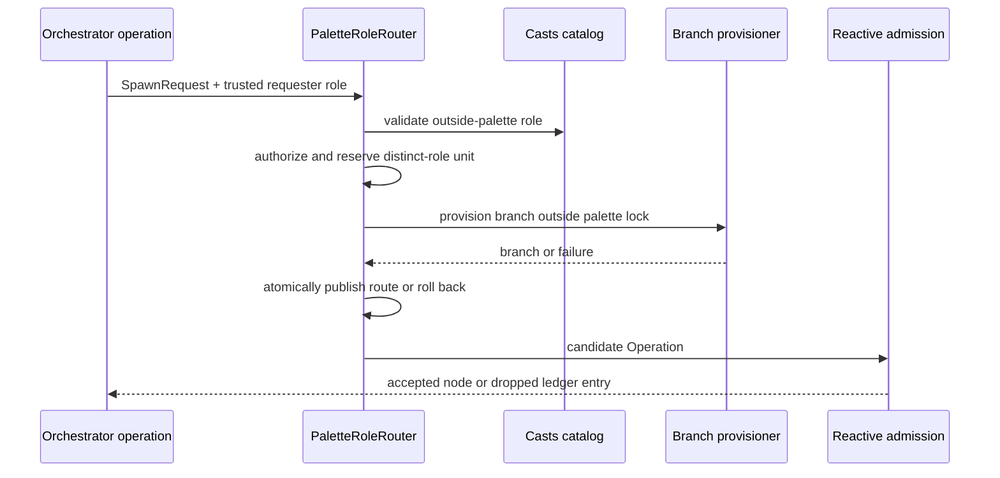

# ADR-0036: Casts Role Palettes as Playstyle

- **Status**: Proposed
- **Kind**: Aspirational
- **Area**: orchestration
- **Date**: 2026-07-09
- **Relations**: extends ADR-0033

## Context

Casts supplies a closed built-in catalog of behavioral roles and modes, ordinary
typed emission contracts, and pack overlays for model, effort, modes, and policy.
It does not yet make role composition part of a play. Five problems require a
target contract.

**P1 — A play's collaboration style is implicit.** Current CLI planning exposes
the full built-in role catalog plus user profiles to the orchestrator.
`PlanningEngine` instead defaults to a fixed five-role tuple unless a caller
supplies another roster. Playbooks describe prompts and runtime options but do not
declare the intended role composition as play data. `lionagi/casts/pattern.py`,
`lionagi/casts/catalog.py`, `lionagi/casts/pack.py`,
`lionagi/engines/planning.py`, and `lionagi/cli/orchestrate/__init__.py` are the
current anchors.

**P2 — Static routing cannot deliberately recruit a role.**
`role_node_builder()` resolves a `SpawnRequest` only against branches already in
its role map. An unknown assignee fails closed. This preserves authority but gives
an orchestrator no typed way to recruit a catalog role that was deliberately left
outside the initial composition.

**P3 — Behavioral role and delegation authority are conflated.** A casts role may
emit ordinary typed findings or verdicts and always retain escalation, yet should
not necessarily grow a live operation graph. Role name alone must not imply spawn
authority.

**P4 — Prompt guidance can contradict the capability grant.** Bare and fallback
workers receive a leaf-only system prompt from
`lionagi/cli/orchestrate/_common.py`. A later `grant_spawn()` appends the generic
schema block produced by `render_capabilities_prompt()` but does not revoke the
leaf sentence or explain the assignee and budget policy. Runtime enforcement wins,
but valid behavior is needlessly hard for the worker to infer.

**P5 — Dynamic recruitment creates authority and concurrency races.** Role
expansion must be limited separately from operation count, must authorize the
requester from trusted graph metadata, and must ensure two concurrent requests for
the same new role provision once and consume one unit.

Current source contracts that the target builds on are:

```python
@dataclass(init=False, frozen=True, slots=True)
class Role(Pattern):
    name: str
    description: str
    body: str = ""
    emits: tuple = ()
    artifact_defaults: dict | None = None

@dataclass(frozen=True, slots=True)
class RoleConfig:
    model: str | None = None
    effort: str | None = None
    default_modes: tuple[str, ...] = ()
    modes_allow: tuple[str, ...] = ()
    active: bool = True
```

`Role.load()` and `Mode.load()` fail with the available canonical names;
`list_roles()` and `list_modes()` enumerate the closed built-in modules. Pack
`active` is an overlay for ordinary roster membership, not a per-play authority
grant.

| Concern | Decision |
|---------|----------|
| Play composition | D1: every new play declares a non-empty typed role palette and expansion policy. |
| Initial planning and provisioning | D2: palette roles are assignable immediately; catalog roles outside it are expansion-only and pass one resolver. |
| Live role expansion | D3: an awaitable router authorizes, reserves, provisions, and atomically publishes new role routes. |
| Authority and budgets | D4: trusted requester identity, distinct-role budget, and operation spawn budget are separate and observable. |
| Prompt and enforcement agreement | D5: one authoritative delegation clause is composed and replaced on grant/revocation. |
| Checkpoint and compatibility | D6: palette state is persisted; legacy palette-free plays have a bounded compatibility path whose removal release is deferred. |

Out of scope:

- Operation admission after a candidate is built. ADR-0033 still owns cycle,
  `max_spawn`, branch clone, edge, and dropped-admission behavior.
- The contents of the built-in casts role and mode catalogs. This ADR selects from
  them; it does not add role definitions.
- Model-tier escalation. ADR-0038 owns stronger-route selection for an existing
  responsibility.
- Queue attempts and resident host recovery. ADR-0037 owns those bounds.
- Automatic recruitment from user profiles. Profiles are not a closed catalog and
  must be named in the initial palette.



## Decision

### D1 — A play declares a typed role palette

A role palette is part of playstyle. It is neither a fixed roster attached to a
playbook kind nor ambient access to the full catalog.

**The target contract** (`lionagi/orchestration/palette.py`):

```python
from typing import Literal, Protocol

from pydantic import BaseModel, Field, model_validator

RoleDisposition = Literal["emission_capable", "terminal"]


class PaletteRole(BaseModel):
    role: str
    disposition: RoleDisposition = "terminal"
    modes: tuple[str, ...] = ()


class PaletteExpansionPolicy(BaseModel):
    max_new_roles: int = Field(default=0, ge=0)
    orchestrator_may_expand: bool = True
    catalog: Literal["casts"] = "casts"


class PlayRolePalette(BaseModel):
    roles: tuple[PaletteRole, ...]
    expansion: PaletteExpansionPolicy = Field(
        default_factory=PaletteExpansionPolicy
    )


class PaletteRouteRejection(BaseModel):
    assignee: str
    reason: Literal[
        "unknown_catalog_role",
        "requester_not_authorized",
        "palette_budget_exhausted",
        "role_provision_failed",
    ]
    detail: str = ""
```

Validation occurs before planning or worker-branch construction:

1. `roles` must contain at least one item.
2. Each `role` name is non-empty after stripping and is unique by canonical name.
3. Each role is either a built-in casts role or an explicitly configured user
   profile named in this initial palette.
4. Every requested mode must exist in `list_modes()` and pass that role's pack
   `modes_allow` rule.
5. Duplicate modes within one palette role are rejected rather than silently
   deduplicated.
6. `max_new_roles` is non-negative by field validation.
7. Expansion source is exactly `casts`; no path, module, or arbitrary provider is
   accepted.

**Exact semantics**:

- Empty palette or any invalid entry rejects configuration as one Pydantic
  validation failure. No worker branch, graph node, artifact directory, or budget
  reservation is created.
- `terminal` describes delegation authority only. It does not change operation
  lifecycle, ordinary casts emission contracts, or universal escalation.
- `emission_capable` grants `SpawnRequest` emission and participation in graph
  growth under D3/D4. It does not bypass target-role or operation admission policy.
- `max_new_roles=0` is the default and makes every outside-palette request reject,
  even though `orchestrator_may_expand=True`. Expansion requires an explicit
  positive budget.
- Pack `active=False` may exclude a role from an ambient roster but does not
  override an explicit initial palette entry. The play declaration is the scoped
  authority; pack policy and model resolution still must succeed.

**Why this way**: composition and authority become inspectable data. The closed
catalog bounds automatic recruitment, while explicit initial entries retain the
ability to use a profile without turning all profiles into an expansion source.

### D2 — Palette-aware planning and initial provisioning

Planning sees two role sets with distinct meaning: immediately assignable palette
roles and expansion-only casts roles.

**The target planner input shape**:

```python
class PalettePlanningContext(BaseModel):
    assignable_roles: tuple[str, ...]
    expansion_only_roles: tuple[str, ...]
    max_new_roles: int
    orchestrator_may_expand: bool
```

**Target module boundary**:

```text
lionagi/orchestration/
├── palette.py          models, state, router protocol, validation
├── patterns.py         static role builder and palette-aware planner adapter
└── prompts.py          rendered palette roster and delegation clauses

lionagi/cli/orchestrate/
└── _orchestration.py   branch/model/artifact provisioner injected into router
```

**Exact semantics**:

- Every initial palette role is provisioned at most once before graph execution
  and entered in the run's role map, even when no initial assignment uses it. This
  makes its declared authority and routing availability deterministic.
- Planning output naming an initial palette role proceeds through ordinary
  `TaskAssignment` validation.
- Planning output naming a built-in expansion-only role is sent to the same
  palette resolver used for live requests before the existing unknown-assignee
  filter. A successful resolution provisions and publishes the role, then graph
  construction continues.
- Planning output naming an unknown catalog role rejects with
  `unknown_catalog_role`; it is not silently reinterpreted as a profile.
- Planning expansion is authorized as an orchestrator request. There is no model-
  supplied requester field in `TaskAssignment`; the planner call site supplies
  the trusted role.
- Empty or unusable planning output retains the owning planner's failure behavior;
  palette resolution does not fabricate an assignment.
- Ordinary workers can name only roles already present in the palette state. They
  cannot use a planning or live request to expand the authority set.
- A role admitted during planning consumes the same distinct-role budget as a role
  admitted during live execution.

**Why this way**: the planner can express deliberate recruitment without receiving
ambient authority to every role. Using one resolver prevents planned and live
expansion from acquiring different authorization or accounting rules.

### D3 — Awaitable, race-safe live role routing

The current synchronous `role_node_builder()` remains the static-map
implementation. Palette expansion uses a separate awaitable router because branch
provisioning may perform provider and filesystem work.

**The target contracts** (`lionagi/orchestration/palette.py`):

```python
class PaletteRoleRouter(Protocol):
    async def __call__(
        self,
        request: SpawnRequest,
        emitter: Operation,
        requester_role: str,
    ) -> Operation | PaletteRouteRejection: ...


class PaletteSnapshot(BaseModel):
    initial_roles: tuple[str, ...]
    expanded_roles: tuple[str, ...] = ()
    reserved_roles: tuple[str, ...] = ()
    max_new_roles: int
    consumed_new_roles: int = 0


class PaletteRuntimeState:
    role_routes: dict[str, Branch]
    lock: asyncio.Lock
    in_flight: dict[str, asyncio.Future[Branch]]
    snapshot: PaletteSnapshot
```

The runtime state is an implementation object; `PaletteSnapshot` is the persisted
contract.

**Routing algorithm**:

1. Normalize and read `request.assignee`. An omitted assignee uses the existing
   emitter-role route and performs no role expansion.
2. Under the palette lock, return an existing role route immediately when present.
3. Reject an outside role absent from the casts catalog.
4. Reject unless `requester_role == "orchestrator"` and
   `orchestrator_may_expand` is true.
5. If another request is provisioning the same role, capture its future, release
   the lock, and await that result without reserving another unit.
6. Otherwise reject when `consumed + len(reserved_roles) >= max_new_roles`.
7. Reserve the canonical role and publish one in-flight future; release the lock.
8. Provision the branch outside the lock.
9. Reacquire the lock. On success, publish the route, move the role from reserved
   to expanded, increment consumed once, and resolve all same-role waiters.
10. On exception or cancellation, remove the reservation and in-flight entry,
    resolve waiters with the same failure, and return `role_provision_failed`.
11. Build the child operation through the ordinary allowlisted role-operation
    builder and return it to ADR-0033 admission.

**Exact semantics**:

- Reusing an initial or previously expanded role consumes no new-role unit.
- Two concurrent requests for the same outside role share one provision attempt
  and consume at most one unit.
- Two concurrent requests for different roles may provision concurrently after
  each reserves a unit. The lock is never held across provider or filesystem I/O.
- Failed provisioning consumes no unit and publishes no role route or partially
  configured branch.
- A branch is added to the route map only after all model, tool, mode, policy, and
  artifact setup succeeds.
- Router exceptions are converted to `role_provision_failed` with bounded,
  non-sensitive detail; they do not escape as untyped executor errors.
- The reactive executor awaits routing before entering its existing synchronous
  `_accept_node()` lock. Palette locking and graph locking are never nested.
- A trusted code caller using prebuilt `ReactiveExecutor.inject()` bypasses the
  palette router, as it does today, but remains subject to graph admission. This is
  an operator API, not model authority.

**Why this way**: provisioning cannot safely occur while holding the graph's
synchronous lock, and a synchronous router cannot represent it honestly. Separate
reservation and commit phases bound authority while keeping slow work outside the
critical section.

### D4 — Trusted requester identity and two independent budgets

Palette expansion and operation spawning are different resources.

**The target metadata and ledger contracts**:

```python
# Trusted graph-builder metadata, never copied from model output.
operation.metadata["requester_role"] = <canonical role name>

# Palette rejection appended to the existing reactive dropped_spawns list.
{
    "reason": Literal[
        "unknown_catalog_role",
        "requester_not_authorized",
        "palette_budget_exhausted",
        "role_provision_failed",
    ],
    "assignee": str,
    "emitter_id": str | None,
    "detail": str,
}
```

**Exact semantics**:

- The graph builder stamps `requester_role` from the branch/role route it created.
  `SpawnRequest.assignee`, `reason`, instruction text, and any structured context
  cannot establish requester identity.
- Missing trusted requester metadata is unauthorized for outside-palette
  expansion. It is not treated as orchestrator by default.
- `max_new_roles` counts distinct roles added to the palette. ADR-0033
  `max_spawn` counts accepted operations. A request can consume a palette unit and
  later be rejected by graph cap or cycle admission; the role remains available
  because provisioning itself succeeded.
- Conversely, an existing-role request consumes no palette unit but still consumes
  one ordinary spawn admission when accepted.
- Palette rejections join `dropped_spawns` with their specific reason. Existing
  reasons (`builder_error`, `null_child`, `cycle`, `max_spawn_exceeded`,
  `duplicate`) remain unchanged for their stages.
- The default `max_new_roles=0` is a least-authority default. No empirical reason
  selects another universal number, so plays choose their own explicit cap.

**Why this way**: a role route expands who can perform work; an operation expands
how much work runs. Combining the counters would let many new roles hide behind one
operation or let one role exhaust recruitment by doing ordinary work.

### D5 — One authoritative delegation clause in the prompt

Capability prompts must agree with runtime enforcement without becoming the
enforcement mechanism.

**The target prompt contract** (`lionagi/orchestration/prompts.py`):

```python
def render_delegation_clause(
    *,
    role: str,
    disposition: RoleDisposition,
    allowed_assignees: tuple[str, ...],
    may_expand_palette: bool,
    remaining_new_roles: int,
    remaining_spawns: int,
) -> str: ...
```

**Exact semantics**:

- A terminal role receives one leaf clause stating it cannot create graph work.
  It may still emit its ordinary role results and `EscalationRequest`.
- An emission-capable role receives one block naming spawn permission, currently
  allowed assignees, whether outside-palette expansion is available, both budget
  values, and the fact that rejected requests appear in the run ledger.
- The block replaces any existing leaf or delegation clause using stable markers;
  it does not append contradictory prose.
- Granting spawn installs both the runtime Operable and the rendered clause.
  Revocation removes the SpawnRequest grant and restores the terminal leaf clause.
- A changing remaining-budget value need not rewrite the system message after
  every spawn. The prompt states the value at turn construction and that runtime
  state is authoritative.
- Ignored or manipulated prompt text cannot expand authority. Schema validation,
  requester metadata, router policy, and both budgets remain enforcement.

**Why this way**: valid behavior should be discoverable. A single replaceable
clause removes the current leaf-versus-grant contradiction while retaining hard
checks below the prompt.

### D6 — Persisted palette state and migration compatibility

Checkpoints record enough state to resume without resetting recruitment authority
or charging the same role twice.

**The persisted contract** is `PaletteSnapshot` from D3 plus the original
`PlayRolePalette` specification and ADR-0033's ordinary spawn counters.

**Exact semantics**:

- A checkpoint writes the declared initial palette, accepted expanded roles,
  current reservations, maximum and consumed distinct-role counts, and the
  operation spawn count in the same checkpoint boundary.
- A clean checkpoint contains no reservations. If a process stops with a reserved
  role, resume treats the reservation as uncommitted: it removes it and permits a
  fresh provision attempt without incrementing consumed count.
- Resume validates the saved palette against the current catalogs and pack before
  accepting new work. Missing roles or now-invalid modes fail resume explicitly;
  they are not silently dropped.
- Expanded roles are reconstructed into the route map once. Their saved membership
  is authoritative for budget accounting; reconstruction does not charge again.
- A changed play specification whose palette or maximum differs from the
  checkpoint is a resume conflict and requires a new run or an explicit migration.
- User profiles remain valid only when present in `initial_roles`; an expanded role
  must resolve from the casts catalog.

**DEFERRED — palette-free compatibility cutoff**: legacy playbooks without a
palette temporarily resolve to the current full planning roster and emit a
deprecation warning. The removal release is not verified or decided in the current
corpus. Implementers must set and document that compatibility window before making
palette declarations mandatory; until then, new and migrated built-ins must
declare palettes while legacy fallback remains explicit.

**Why this way**: a restart must not restore a larger authority set or a fresh
budget. Persisting declarative and consumed state makes replay deterministic; a
partially provisioned branch is treated as uncommitted work.

## Consequences

- Plays can express narrow terminal pipelines, exploratory emitter-heavy teams,
  and mixed collaboration styles using the same objective.
- Delegation authority and recruitment spend become visible in data instead of
  being inferred from role names or prompt prose.
- Dynamic recruitment adds branch-provisioning failure, reservation cleanup, and
  two-dimensional budget accounting. These are observable and testable but
  materially expand orchestration state.
- A catalog role can remain unavailable because model, tools, modes, or policy
  cannot be resolved. Such failure occurs before route publication.
- Persisted runs gain a compatibility obligation for palette snapshots and resume
  conflicts.
- The design gives up ambient access to every role and prompt-only flexibility. A
  role named in prose cannot execute unless typed state and routing policy allow
  it.
- Reversing D1 or D4 is high cost because play data and checkpoint accounting
  depend on them. Changing prompt rendering is lower cost as long as runtime
  authority and stable markers remain.

## Alternatives considered

### Fixed role sets per playbook kind

This would be easy to validate and document. It lost because collaboration style
is a property of a play instance: two plays using the same operational template may
need a narrow review pair or a broad exploratory team. A fixed set would push
variation back into prose or new playbook kinds.

### Expose the full casts catalog to every run

This matches current CLI discoverability and eliminates recruitment failures. It
lost because role availability becomes ambient authority and cost. A play cannot
state or enforce a narrow collaboration boundary.

### Use pack `active` as the palette

This would reuse an existing boolean. It lost because `active` is a reusable pack
overlay, not per-play composition, and carries neither disposition, modes, nor a
distinct-role expansion budget.

### Infer spawn authority from role name

This would avoid `RoleDisposition`; orchestrators and coordinators could spawn,
other roles could not. It lost because behavioral identity and delegation policy
change independently. A researcher may be allowed to decompose one play and be a
terminal specialist in another.

### Let any worker recruit any catalog role

This would maximize adaptive collaboration. It lost because every emission-capable
worker could expand the authority set and consume provider setup without an
orchestrator decision. Ordinary workers are limited to already-published routes.

### Provision every catalog role at startup

This would make routing synchronous and eliminate provision races. It lost because
unused roles would still incur model, tool, prompt, branch, and artifact setup, and
the runtime would possess more configured capability than the play declared.

### Hold one lock across reservation and branch provisioning

This would make the algorithm easy to reason about. It lost because provider and
filesystem work would serialize all palette requests and risk blocking unrelated
role lookups. Reservation plus an in-flight future preserves correctness without
holding the lock across I/O.

### Reuse the synchronous `role_node_builder()` for expansion

This would avoid a second interface. It lost because the existing builder assumes a
complete static role map and cannot await branch provisioning. Making it sometimes
async would also break ADR-0033's current synchronous node-builder contract.

### Combine `max_new_roles` with `max_spawn`

This would expose one intuitive budget. It lost because distinct authority growth
and operation volume are not interchangeable. A reused role should not spend a new-
role unit, and a newly provisioned role can exist even if its first operation loses
graph admission.

### Trust a model-emitted requester field

This would make routing self-contained. It lost because the requester could claim
to be the orchestrator. Identity comes from the operation/branch construction path,
not the payload being authorized.

### Keep the generic capability schema block as the only prompt guidance

This would avoid prompt-specific rendering. It lost because schema alone does not
resolve the current contradiction with the leaf instruction and does not explain
assignee or budget policy.

### Automatically expand user profiles

This would make custom workers as flexible as built-ins. It lost because profiles
are not a bounded, centrally enumerable authority source. They remain available by
explicit initial declaration.
