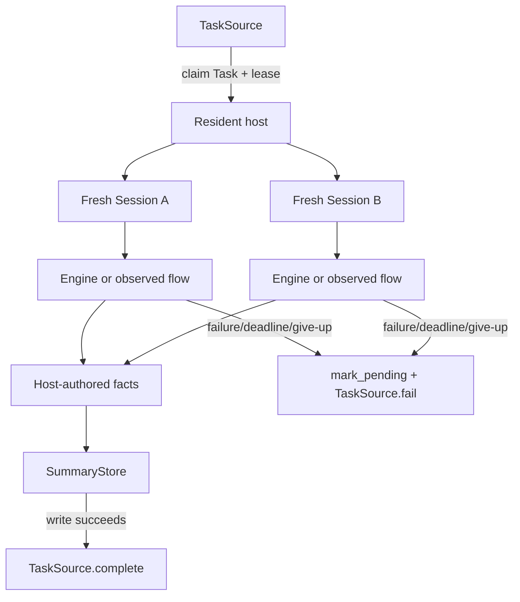

# ADR-0037: Resident Engine Host and Task Queue

- **Status**: Proposed
- **Kind**: Aspirational
- **Area**: orchestration
- **Date**: 2026-07-09
- **Relations**: supersedes v0-0098; extends ADR-0033, ADR-0034

## Context

Long-running orchestration needs a structured way to receive work, isolate
concurrent tasks, report boundary state, and recover from process loss. The current
engine layer can accept a caller-provided Session, and a Session may run more than
one graph sequentially, but no `TaskSource`, `SummaryStore`, or resident host exists
under `lionagi/` or `tests/`.

Six concrete problems define the target.

**P1 — Work acquisition is not a flow-control operation.** `Branch.control()`
steers an existing operation's control flow, while ADR-0033 reactive spawn admits a
new operation to an already-running graph. Neither claims a new queued task with a
lease and attempt number.

**P2 — Concurrent tasks cannot safely share a Session.** Branch ownership,
observer traffic, message history, operation ids, run budgets, and lifecycle
signals are Session-scoped. Sharing one Session would let one task observe or
mutate another task's state.

**P3 — A process crash needs a durable recovery owner.** In-memory task groups can
cancel cleanly but cannot prove whether abandoned work should be retried. Atomic
claim plus lease allows another host to recover after expiry without pretending
execution is exactly once.

**P4 — Flow completion, summary persistence, and queue acknowledgement form an
ordered boundary.** A queue item must not be marked complete before its durable
summary is written. A partial or failed summary must remain distinguishable from a
complete one.

**P5 — Poison work needs a global attempt ceiling.** A host-local retry counter
resets on restart and permits an infinite cross-process loop. Attempt accounting
and terminal/dead-letter disposition belong to the queue.

**P6 — The seam is only justified if the repository exercises it.** Protocols with
no in-tree source and summary implementation merely move integration names. The
first version must ship a real implementation used by end-to-end tests.

The resident host is valuable for lease, isolation, summary, and host lifecycle
contracts, not primarily import-time savings. It stays above ADR-0033: it claims a
Task and awaits a flow or engine; it does not execute graph nodes itself.

| Concern | Decision |
|---------|----------|
| Queue and summary ports | D1: introduce typed `TaskSource` and `SummaryStore` protocols plus frozen payload models. |
| Claim, lease, and acknowledgement | D2: claim has one winner; completion/failure are lease-guarded and idempotent; the queue owns attempts and terminal disposition. |
| Host isolation and concurrency | D3: one bounded host task group creates a fresh Session and explicit working directory per claimed Task. |
| Flow-to-summary ordering | D4: normal flow return writes a complete summary before queue completion; every non-complete path marks pending and fails the task. |
| Crash, deadline, and restart | D5: leases provide at-least-once recovery; watchdogs bound live tasks; memory pressure stops claims and drains. |
| Implementations and extensions | D6: ship an in-tree exercised implementation; external durable adapters depend only on the two ports. |

Out of scope:

- Operation scheduling within one task. ADR-0033 remains the execution kernel.
- Engine reaction topology and agent budgets. ADR-0034 remains the domain-policy
  owner.
- Model-tier escalation inside a flow. ADR-0038 owns local escalation; this ADR
  only maps final give-up to a Task failure.
- A general state-store consolidation port. No verified method surface exists and
  the persistence-state area owns that decision.
- Exactly-once execution. A lease can expire after side effects but before
  acknowledgement; operations and adapters must tolerate at-least-once recovery.
- A first-version lease-renewal protocol. Deadline compatibility replaces renewal
  in D2.



## Decision

### D1 — Two narrow typed ports and their payloads

The resident host depends on task acquisition/acknowledgement and summary storage,
not on a particular queue or database.

**The target contract** (`lionagi/orchestration/host.py`):

```python
from datetime import datetime
from pathlib import Path
from typing import Any, Literal, Protocol

from pydantic import BaseModel, ConfigDict, Field, field_validator, model_validator


class HostModel(BaseModel):
    model_config = ConfigDict(extra="forbid", frozen=True)


class Task(HostModel):
    id: str
    objective: str
    cwd: Path
    lease_id: str
    lease_expires_at: datetime
    attempt: int = Field(ge=1)
    deadline: datetime


class TaskResult(HostModel):
    run_id: str
    status: Literal["completed"]
    summary_ref: str


class TaskFailure(HostModel):
    code: Literal[
        "invalid_task",
        "flow_failed",
        "cancelled",
        "deadline",
        "summary_failed",
        "escalation_give_up",
    ]
    detail: str
    retryable: bool


class TaskAck(HostModel):
    applied: bool
    rejection: Literal[
        "missing_holder",
        "stale_lease",
        "attempt_ceiling",
    ] | None = None


class SessionSummary(HostModel):
    facts: dict[str, Any]
    narrative: str | None
    manifest_ref: str


class TaskSource(Protocol):
    async def claim(self) -> Task | None: ...

    async def complete(
        self,
        task_id: str,
        lease_id: str,
        result: TaskResult,
    ) -> TaskAck: ...

    async def fail(
        self,
        task_id: str,
        lease_id: str,
        failure: TaskFailure,
    ) -> TaskAck: ...


class SummaryStore(Protocol):
    async def write(
        self,
        session_key: str,
        summary: SessionSummary,
    ) -> None: ...

    async def mark_pending(
        self,
        session_key: str,
        reason: str,
    ) -> None: ...
```

**Validation semantics**:

- All payloads reject unknown fields and are frozen after construction.
- Task id, objective, and lease id must be non-empty after stripping.
- `lease_expires_at` and `deadline` must be timezone-aware UTC datetimes. A naive
  datetime is invalid rather than being interpreted in local time.
- `deadline <= lease_expires_at` is required. The first protocol has no renewal,
  so a lease shorter than the task's permitted lifetime is an invalid claim.
- `attempt` starts at one and increases only when the queue reissues a Task.
- `TaskResult.status` has one value. Non-complete outcomes use `TaskFailure`, not a
  polymorphic result status.
- `SessionSummary.facts` is host-authored machine data. `narrative` is optional
  session-authored prose. `manifest_ref` identifies the durable run manifest.

**Why this way**: the two ports match two independent durability responsibilities.
The queue decides ownership and retry; the summary store decides durable evidence.
Neither needs a Session or executor dependency.

### D2 — Atomic claim, lease-guarded idempotent acknowledgement

`claim()` is an atomic dequeue-and-lease operation with exactly one winner per
attempt.

**Normative TaskSource state machine**:

```text
queued(attempt=N)
  --claim one winner--> leased(task_id, lease_id, attempt=N, expires_at)
  --complete same lease--> completed
  --fail retryable below ceiling--> queued(attempt=N+1)
  --fail non-retryable--> terminal_failed
  --fail retryable at ceiling--> dead_letter
  --lease expires--> reclaimable queued(attempt=N+1) or dead_letter at ceiling
```

**Exact semantics**:

- Claim returns `None` when no task is available. A polling source owns its own
  wait/backoff; a blocking source may await delivery. The host must not infer that
  `None` means shutdown.
- A source never returns a Task whose lease is already expired. The host still
  validates the timestamp defensively.
- `complete()` and `fail()` compare both task id and lease id. Task id alone never
  proves ownership.
- First valid acknowledgement records the transition atomically and returns
  `TaskAck(applied=True, rejection=None)`.
- An exact replay with the same lease and equivalent payload returns the same
  successful acknowledgement without repeating side effects.
- A different payload after a terminal acknowledgement, or an acknowledgement from
  an old/mismatched/expired lease, returns
  `TaskAck(applied=False, rejection="stale_lease")`.
- An unknown task or one with no retained holder/ack record returns
  `TaskAck(applied=False, rejection="missing_holder")`.
- A retryable failure at the configured global attempt ceiling is recorded as
  dead-letter. The failure acknowledgement is applied, but the requested retry is
  refused and reported as
  `TaskAck(applied=True, rejection="attempt_ceiling")`.
- Tasks at or above the ceiling are never returned by `claim()`.
- The attempt ceiling is queue configuration shared by all hosts. This ADR does
  not choose a universal numeric default because no workload evidence supports
  one; an implementation must require or document its configured value.
- Completion and failure do not extend or renew a lease. There is no renewal method
  in protocol version one.

**Why this way**: queue ownership must survive host restarts and concurrent
claimers. A lease-id compare-and-set makes stale work visible, while idempotent
acknowledgement allows safe retry after a lost response.

### D3 — Bounded host task group and per-task Session isolation

One host process may run several tasks, but every claimed Task receives independent
run state.

**The target host contract** (`lionagi/orchestration/host.py`):

```python
class ResidentEngineHost:
    def __init__(
        self,
        *,
        source: TaskSource,
        summaries: SummaryStore,
        max_concurrent_tasks: int,
        session_factory: Callable[[], Session],
        run_task: Callable[[Task, Session], Awaitable[dict[str, Any]]],
        summarize: Callable[
            [Task, Session, dict[str, Any]],
            Awaitable[str | None],
        ] | None = None,
        should_stop_claiming: Callable[[], bool] | None = None,
    ) -> None: ...

    async def serve(self) -> None: ...

    async def drain(self) -> None: ...
```

`max_concurrent_tasks` is required and must be at least one. There is no universal
default because task cost varies materially by engine and provider.

**Exact semantics**:

- The serve loop never holds more than `max_concurrent_tasks` leases for active
  host jobs. It does not prefetch unbounded queued work.
- For each valid claim it calls `session_factory()` exactly once. No Session,
  Branch, observer, engine-run counter, or operation graph is shared between
  concurrent Tasks.
- Immutable Engine configuration and process-level clients or connection pools may
  be shared. Mutable `EngineRun` is created inside the Task's Session.
- `cwd` must exist and be a directory before execution. Failure produces
  `invalid_task`; the host does not create a missing task workspace implicitly.
- Concurrent tasks do not call process-global `os.chdir()`. The Task cwd is passed
  into Branch/tool/provider/workspace configuration explicitly.
- A Task whose deadline is already reached fails with `deadline` before creating a
  flow. A Task whose lease cannot cover its deadline fails with `invalid_task`.
- Session creation or runner setup failure is `invalid_task` when caused by Task
  data and `flow_failed` otherwise.
- `run_task` must await the selected Engine or ADR-0033 observed-flow façade. The
  host does not inspect or schedule individual graph nodes.
- `should_stop_claiming()` true stops new claims but does not cancel active Tasks.
  `drain()` awaits all active jobs and returns only after their cooperative ack
  paths settle.
- `serve()` cancellation stops claiming, cooperatively cancels active host jobs,
  and lets D4 report `cancelled` when the process remains alive long enough. A hard
  process loss is handled only by lease expiry.

**Why this way**: Session is the isolation boundary already used by Branch,
observer, and engine state. A process may safely amortize immutable setup without
making concurrent tasks share conversational or scheduling state.

### D4 — Summary-before-complete ordering

Normal flow return is not queue completion until a complete summary is durably
written.

**Host-authored fact payload**:

```json
{
  "task_id": "task-...",
  "attempt": 1,
  "run_id": "run-...",
  "started_at": "UTC timestamp",
  "ended_at": "UTC timestamp",
  "elapsed_ms": 0.0,
  "operation_statuses": {},
  "artifact_refs": [],
  "usage": {},
  "degraded": false,
  "degrade_reason": ""
}
```

Fields unavailable for a runner are represented by empty objects/lists or null
values defined by that adapter; the host never invents usage or artifact evidence.

**Success sequence**:

1. Await the Engine or observed flow to return normally.
2. Read machine facts from recorded run state and manifest data.
3. Optionally request one best-effort narrative turn.
4. Construct `SessionSummary(facts=..., narrative=..., manifest_ref=...)`.
5. `await SummaryStore.write(session_key, summary)`.
6. `await TaskSource.complete(task.id, task.lease_id, TaskResult(...))`.
7. Treat `TaskAck.applied=False` as an ownership loss, not as successful host
   completion.

**Failure sequence**:

1. Classify the failure as `invalid_task`, `flow_failed`, `cancelled`, `deadline`,
   `summary_failed`, or `escalation_give_up`.
2. Best-effort `SummaryStore.mark_pending(session_key, reason)`.
3. `await TaskSource.fail(task.id, task.lease_id, TaskFailure(...))`.
4. Retain/log both a `mark_pending` error and an acknowledgement error; neither is
   rewritten as completion.

**Exact semantics**:

- `SummaryStore.write()` is idempotent by `session_key`. Replaying the same summary
  succeeds without duplicating it; a different summary for a completed key is a
  conflict and raises.
- `mark_pending()` is also idempotent and may update diagnostic reason while the
  key remains non-complete. It never converts an existing complete summary back to
  pending.
- The default `session_key` is the durable `run_id`, not task id, because queue
  retries create distinct run attempts.
- Narrative failure is best-effort: facts and manifest can still be written with
  `narrative=None`, and the Task may complete.
- Failure to build facts, resolve the manifest, or write the complete summary is
  `summary_failed`, retryable unless the adapter classifies the storage error as
  permanent.
- Flow failure, cooperative cancellation, watchdog expiry, or escalation give-up
  never writes a partial summary as complete. Existing partial files remain
  referenced only through pending state.
- A queue completion acknowledgement lost after summary write is safe to retry:
  both summary write and completion are idempotent by their keys.

**Why this way**: the summary is the durable evidence promised by a completed
TaskResult. Completing first creates a crash window in which the queue says done
but no evidence can be found.

### D5 — Deadline, crash recovery, and graceful memory-pressure restart

Leases make task execution recoverable, not exactly once or free of interruption.

**Exact semantics**:

- Each host job installs a watchdog for `Task.deadline`. Expiry cancels the local
  Engine/flow, drains run-owned tasks through their existing cleanup, marks summary
  pending, and calls `fail(code="deadline", retryable=True)` while the lease is
  valid.
- Because `deadline <= lease_expires_at`, normal watchdog and failure reporting
  have a lease-valid window. An adapter should include operational slack when
  issuing the lease; the protocol does not prescribe a numeric slack value without
  latency evidence.
- If the process dies before acknowledgement, the queue reclaims only after lease
  expiry and increments attempt. Any external side effect from the abandoned run
  may already exist.
- A stale host that later resumes cannot complete the new attempt because its old
  lease id fails D2.
- A host crash interrupts every active Task in that process. Other host processes
  and future claims are independent.
- Memory-pressure detection invokes `should_stop_claiming`, drains current jobs,
  and exits for supervisor restart. It does not cancel unrelated Tasks merely to
  reach a lower resident set faster.
- The first protocol has no heartbeat or lease renewal. A Task whose legitimate
  maximum deadline does not fit one lease must be rejected or split; silently
  running past the lease is forbidden.

**Crash matrix**:

| Crash point | Durable state | Recovery |
|-------------|---------------|----------|
| Before claim commit | Task remains queued | Any host may claim. |
| After lease, before Session creation | Lease held, no run | Reclaim after expiry. |
| During flow | Lease held, partial effects possible | Reclaim after expiry; operations must tolerate retry. |
| After summary write, before complete ack | Complete summary, Task still leased | Idempotent write and ack retry; otherwise reclaim can discover prior summary. |
| After complete ack | Task completed | Exact ack replay is harmless; no further claim. |
| During pending/fail path | Pending or absent summary, lease may remain | Idempotent mark/fail retry or lease reclaim. |

**Why this way**: cross-process recovery needs durable ownership, while the
operation layer cannot promise rollback of arbitrary tools and provider calls.
Lease expiry plus idempotent boundaries is the honest at-least-once contract.

### D6 — Exercised in-tree adapters and extension boundary

The protocol pair ships only with a real in-tree implementation used by end-to-end
tests.

**Target module tree**:

```text
lionagi/orchestration/
├── host.py                 contracts and ResidentEngineHost
└── queue/
    ├── __init__.py
    └── local.py            in-tree TaskSource and SummaryStore implementation

tests/orchestration/
├── test_resident_host.py
└── test_local_task_queue.py
```

**Required conformance cases**:

- concurrent claimers yield one lease winner;
- fresh Session per concurrent Task;
- identical complete/fail retries are idempotent;
- stale lease rejection after reclaim;
- invalid cwd and lease-shorter-than-deadline rejection;
- summary write happens before complete;
- summary failure produces pending plus fail, never complete;
- deadline cancellation and crash-style lease reclaim;
- attempt ceiling dead-letters poison work;
- stop-claiming drains without cancelling active Tasks.

External durable adapters import the models and implement only `TaskSource` and
`SummaryStore`. Product-specific queue clients do not enter core orchestration.

A future steering adapter may retain a live executor reference for a claimed Task,
but that does not change acquisition or acknowledgement and is not part of protocol
version one.

**Why this way**: an exercised local implementation proves the protocols support a
complete host loop and gives adapter authors a behavioral reference. Keeping
external clients behind the ports prevents host logic from depending on one queue.

## Consequences

- Queue ownership, task isolation, completion, and summary ordering become
  explicit and testable.
- A process can reuse expensive immutable clients while a Task crash remains
  recoverable through its lease.
- Host and queue provide at-least-once, not exactly-once, execution. Tool and
  operation idempotency become more important for retried Tasks.
- Long leases delay crash recovery; short leases increase stale-completion and
  duplicate-execution risk. Version one requires the queue to size a lease for the
  declared deadline rather than renew it.
- Summary storage becomes part of the completion critical path. Its outage leaves
  Tasks failed or retryable rather than falsely complete.
- Reversing D1/D2 is high cost because external adapters depend on the models and
  lease semantics. Changing host concurrency is configuration-only because it is
  required rather than frozen to a universal default.

## Alternatives considered

### Share one Session across concurrent Tasks

This would reuse branches and observer setup. It lost because histories, signals,
budgets, and operation ids would interleave, and cancellation or cleanup for one
Task could affect another. Process clients may be shared; Session state may not.

### Start one subprocess per Task and use process exit as queue completion

This gives strong memory isolation and simple cancellation. It lost as the queue
contract because exit does not prove summary persistence or a semantic result and
does not provide lease-guarded acknowledgement. A runner may still use a subprocess
internally under the same host protocol.

### Observe `RunEnd` instead of awaiting the owned flow

This would make the host event-driven. It lost because the host already owns the
awaitable, and an observed signal can race persistence/drain or be absent on a
failure path. Awaiting defines lifetime; signals provide observation.

### Add lease renewal in protocol version one

Renewal would support unbounded tasks and shorter recovery windows. It lost for the
first contract because it adds heartbeat races, holder fencing, and another method
without a current implementation. Requiring lease expiry no earlier than deadline
keeps version one closed and testable.

### Use task id as the summary idempotency key

This would put every attempt under one record. It lost because retries are distinct
runs with distinct evidence. `run_id` keeps attempts inspectable while the queue
links them through task id and attempt.

### Mark queue complete before writing the summary

This reduces acknowledgement latency and allows asynchronous summarization. It
lost because a crash creates a completed Task with no promised evidence. Summary
write is deliberately on the completion path.

### Make session-authored narrative mandatory

This would guarantee a readable report. It lost because one extra model turn can
fail after otherwise complete, durable machine facts. Narrative is best-effort;
facts and manifest are authoritative.

### Let the host own retry count

This would simplify queue adapters. It lost because host restart or another host's
claim resets local state. Only the durable queue can enforce a global attempt
ceiling.

### Requeue poison work indefinitely

This maximizes eventual-success chance. It lost because permanent invalid input or
deterministic flow failure would consume capacity forever. A configured ceiling
and dead-letter outcome make operator action explicit.

### Put a specific durable queue client in the core package

This would ship production connectivity immediately. It lost because queue client
configuration and lifecycle would couple core orchestration to one external
system. The target ships an in-tree reference implementation and narrow ports.

### Define protocols without an in-tree implementation

This would let external adapters proceed sooner. It lost because no end-to-end
path would prove claim, summary, and ack semantics compose. Interfaces are accepted
only with exercised behavior.
