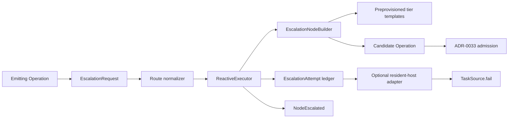

# ADR-0038: Escalation Tier Routing

- **Status**: Proposed
- **Kind**: Aspirational
- **Area**: orchestration
- **Date**: 2026-07-09
- **Relations**: supersedes v0-0099; extends ADR-0033, ADR-0037

## Context

`EscalationRequest` is the universal typed escape hatch available to casts roles
that emit structured results. The reactive executor already observes it, records
the emitter id, and emits `NodeEscalated`. That substrate exists, but it does not
yet perform tier routing. Six problems define the target.

**P1 — `higher_tier` does not select a higher tier.**
`ReactiveExecutor._schedule_escalation()` currently creates a child with the
emitter's same operation name, copies its dictionary parameters, prefixes the
instruction with `[escalation]`, and admits the child independently. It neither
consults `node_builder` nor deliberately selects a stronger branch or model.
Because the child has no explicit branch and is independent, branch allocation
clones the Session default branch rather than the emitter's branch; that route may
or may not use the emitter's model, but it is not a tier decision.
`lionagi/operations/flow.py` is the governing anchor.

**P2 — Route policy is hidden in an evidence map.** The shipped request has
`reason`, `context`, `blocking`, and `from_role` fields. The executor reads
`context["route"]`, accepting an untyped value and defaulting a missing key to
`higher_tier`. `context` is otherwise described as evidence for a recipient, not
as control policy. `lionagi/casts/emission.py` contains the current model.

**P3 — Spawn and escalation have different authority.** A `SpawnRequest` asks to
create a new responsibility and may select an assignee and operation. An
escalation retries the emitter's existing responsibility through a configured
stronger route. Reusing `role_node_builder()` would let spawn assignee policy and
its monotonic `spawn-N` identity decide model-tier progression while leaving the
escalation rung implicit. `lionagi/orchestration/patterns.py` defines the current
spawn boundary.

**P4 — Local retries need a hard bound independent of graph growth.** The
ordinary `max_spawn` cap limits all accepted live nodes, but it does not state how
many of them one escalation lineage may consume. A child that emits another
`EscalationRequest` can currently repeat until the shared graph cap happens to
stop it. Local tier progression needs its own lineage bound while still consuming
the shared admission budget.

**P5 — Routing failure and explicit give-up are not fully inspectable.** The
current result exposes `escalated_operations` as a set-derived id list but does
not record source tier, target tier, rung, accepted/rejected outcome, or the reason
no route was available. `NodeEscalated.route` is a plain string, and emission is
best-effort. A maintainer cannot reconstruct the routing decision from the final
result alone. `lionagi/session/signal.py` and `lionagi/operations/flow.py` define
the current observation surfaces.

**P6 — A flow does not necessarily own a queue lease.** A resident host may need
to translate terminal give-up into a failed Task attempt, while a library flow
has no `TaskSource` to call. Direct queue access from the executor would make
standalone flows depend on host infrastructure and duplicate the queue's global
attempt accounting.

The current contracts from which the target migrates are:

```python
# lionagi/casts/emission.py
class EscalationRequest(BaseModel):
    reason: str
    context: dict = Field(default_factory=dict)
    blocking: bool = True
    from_role: str | None = None

# lionagi/casts/pack.py — no ordered ladder exists today
@dataclass(frozen=True, slots=True)
class RoleConfig:
    model: str | None = None
    effort: str | None = None
    default_modes: tuple[str, ...] = ()
    modes_allow: tuple[str, ...] = ()
    active: bool = True

# lionagi/session/signal.py
class NodeEscalated(Signal):
    op_id: str = ""
    name: str = ""
    reason: str = ""
    route: str = ""
    escalation_request: Any = None

# lionagi/operations/flow.py — reactive result additions
{
    "spawned_operations": int,
    "escalated_operations": list[UUID],
    "dropped_spawns": list[dict[str, Any]],
}
```

| Concern | Decision |
|---------|----------|
| Request route | D1: `route` becomes a first-class closed field with an explicit legacy-context normalizer. |
| Tier authority | D2: orchestration consumes prevalidated, preprovisioned tier branch templates through a separate synchronous builder. |
| Local routing and bounds | D3: each lineage advances at most two configured rungs and every child re-enters the common admission chokepoint. |
| Observation and results | D4: an append-only typed attempt ledger and additive signal fields expose requested route, resolved route, tiers, rung, and outcome. |
| Host handoff | D5: the executor returns terminal give-up; only a resident-host adapter may translate it to queue failure. |
| Migration and integration | D6: Session, streaming, Engine, CLI, and legacy producers receive one additive compatibility path with explicit removal work. |

Out of scope:

- Defining which concrete model is objectively stronger. The selected role-pack
  order is the authority; orchestration validates structure and progression, not
  benchmark quality.
- General role composition or recruitment. ADR-0036 owns who may join a play;
  escalation retains the emitter's responsibility and role.
- Operation-graph scheduling, cycle checks, branch cloning, and the shared spawn
  cap. ADR-0033 owns the admission mechanism this ADR calls.
- Queue leases and attempt disposition. ADR-0037 owns at-least-once recovery and
  the global attempt ceiling.
- Human approval routing and tool-permission escalation. Those are distinct
  authorization paths; this ADR concerns typed operation-result escalation.



## Decision

### D1 — First-class route with fail-closed legacy normalization

`EscalationRequest` gains a typed route. `context` remains recipient evidence and
new producers do not encode routing control inside it.

**The target contract** (`lionagi/casts/emission.py`;
`lionagi/orchestration/escalation.py`):

```python
EscalationRoute = Literal["higher_tier", "give_up"]


class EscalationRequest(_EmissionModel):
    reason: str
    context: dict = Field(default_factory=dict)
    blocking: bool = True
    from_role: str | None = None
    route: EscalationRoute = "higher_tier"


class NormalizedEscalationRoute(BaseModel):
    model_config = ConfigDict(extra="forbid", frozen=True)

    route: EscalationRoute
    source: Literal["field", "legacy_context", "default", "invalid_legacy"]


def normalize_escalation_route(
    request: EscalationRequest,
) -> NormalizedEscalationRoute: ...
```

**Exact semantics**:

- An explicitly supplied `request.route` is authoritative. A conflicting
  `context["route"]` is retained as evidence but ignored for routing.
- Pydantic's `model_fields_set` distinguishes an omitted route from an explicitly
  supplied default. This is required because both otherwise read as
  `"higher_tier"` after model construction.
- When the field was omitted and the legacy context value is exactly
  `"higher_tier"` or `"give_up"`, that value is honored with
  `source="legacy_context"`.
- When both field and legacy key were omitted, the route is `higher_tier` with
  `source="default"`, preserving current producer behavior.
- When the field was omitted but the legacy key is present with any other value,
  normalization returns `give_up` with `source="invalid_legacy"`. An invalid
  untyped value must not trigger a retry accidentally.
- A first-class route outside the two-value `Literal` fails model validation
  before reaching the executor because `_EmissionModel` also forbids unknown
  fields.
- `blocking` and `from_role` remain payload evidence. Neither grants routing
  authority, selects a branch, nor changes the rung. Trusted role and tier come
  from the emitter's operation metadata and registered tier templates.
- Requests are still observed through both Session-bus delivery and settled-result
  extraction. Recursive extraction retains the shipped depth-four defensive cap;
  the source records no rationale for exactly four.
- The same request object observed twice is processed once by identity. The
  duplicate produces no second child, signal, or attempt row. Semantically equal
  but separately constructed requests remain separate requests.
- A request delivered while no reactive run is active is ignored, as today. A
  request delivered during a run without a current emitter is recorded as an
  orphan give-up under D4; it is never allowed to select an arbitrary operation.

**Why this way**: route is control data and needs a closed schema. The compatibility
normalizer preserves existing valid producers without allowing arbitrary legacy
strings to become execution authority.

### D2 — Separate builder over preprovisioned tier templates

Escalation uses a dedicated synchronous builder. It does not reuse the spawn
builder, inspect providers, load packs, or provision branches while the graph is
mutating.

**The target contracts** (`lionagi/orchestration/escalation.py`):

```python
from collections.abc import Mapping
from typing import Protocol
from uuid import UUID


class TierBranchTemplate(BaseModel):
    model_config = ConfigDict(extra="forbid", frozen=True)

    role: str
    tier: str
    branch_id: UUID
    model: str
    effort: str | None = None


class EscalationRouteContext(BaseModel):
    model_config = ConfigDict(
        arbitrary_types_allowed=True,
        extra="forbid",
        frozen=True,
    )

    emitter: Operation
    request: EscalationRequest
    role: str | None
    current_tier: str | None
    rung: int = Field(ge=0, le=2)


class EscalationNodeBuilder(Protocol):
    def __call__(
        self,
        context: EscalationRouteContext,
        /,
    ) -> Operation | None: ...


def escalation_node_builder(
    routes: Mapping[str, tuple[TierBranchTemplate, ...]],
) -> EscalationNodeBuilder: ...
```

`routes` is the runtime projection consumed by orchestration. The agent-role
configuration owner decides how a selected pack declares the ordered tiers. The
orchestration setup adapter resolves that declaration into concrete branch
templates before the flow starts.

**Template validation semantics**:

- Role and tier names must be non-empty after stripping. Role keys and each
  role's tier names are unique after canonical normalization.
- Each role has an ordered weak-to-strong tuple. “Higher” means the next item in
  this configured tuple; orchestration never infers strength from provider name,
  price, token limit, or model spelling.
- Every `branch_id` must already exist in the Session and must identify a branch
  provisioned with the declared model and effort fingerprint.
- Adjacent templates must not have the same `(model, effort)` pair. A configured
  tier name change without an execution-route change is rejected as a false bump.
- The base operation's tier must occur in its role's tuple. Missing role or tier
  metadata means the route is unavailable; model-emitted `from_role` is not used
  as a fallback.
- All templates reachable within `max_escalation_rungs` are provisioned before
  execution. Provider, filesystem, mode, tool, policy, or branch setup failure
  rejects orchestration setup before an operation runs.
- A template branch is a clone source, not a shared mutable worker. ADR-0033's
  admission path clones it for each accepted child and includes the clone in the
  Session.

**Builder semantics**:

- The builder selects exactly the template after `current_tier`. It never skips a
  configured rung to find an available provider.
- It creates a new `Operation` with the same `operation` value as the emitter.
  Every non-`instruction` entry from `emitter.request` is shallow-copied. The
  instruction retains the shipped compatibility form:

  ```text
  [escalation] <request.reason>
  Original: <original instruction or empty string>
  ```

- The child points at the selected template through `branch_id` and receives
  trusted metadata:

  ```python
  {
      "assignee": <emitter role>,
      "model_tier": <target tier>,
      "escalation_rung": <source rung + 1>,
      "escalated_from": <emitter operation id as str>,
      "escalation_id": "escalation-<full child operation UUID>",
      "reference_id": "escalation-<full child operation UUID>",
  }
  ```

- The full child UUID makes escalation identity collision-free without a second
  mutable counter. `spawn_id` is never copied or minted: `spawn-N` remains owned
  by `role_node_builder()`, while adapters use `escalation_id` for artifact and
  persistence correlation.
- `None` means no stronger configured route. It is a normal give-up outcome, not
  an executor exception.
- A builder exception is caught by the executor, logged, and converted to
  `builder_error`. It neither fails unrelated graph nodes nor falls back to the
  current branch.
- The executor verifies that a returned child is an `Operation`, retains the
  emitter's operation name, has a registered template branch, advances exactly
  one rung, and names the selected tier before admission. A malformed child is a
  `builder_invalid` give-up.

**Why this way**: branch and provider setup can perform I/O and belongs before the
run. The synchronous builder then performs a deterministic lookup and node
construction without nesting provisioning work inside the graph lock.

### D3 — Two local rungs, followed by common admission

The root operation has escalation rung zero. Each accepted tier child increments
that trusted metadata by one. A lineage may accept at most two escalation
children.

**The target executor and façade parameters**
(`lionagi/operations/flow.py`; `lionagi/session/session.py`):

```python
class EscalationPolicy(BaseModel):
    model_config = ConfigDict(extra="forbid", frozen=True)

    max_escalation_rungs: int = Field(default=2, ge=0, le=2)


class ReactiveExecutor(DependencyAwareExecutor):
    def __init__(
        self,
        *args: Any,
        spawn_type: type | None = None,
        node_builder: Any = None,
        escalation_builder: EscalationNodeBuilder | None = None,
        max_spawn: int = 50,
        max_escalation_rungs: int = 2,
        spawn_branch_setup: Callable[[Operation, Any], None] | None = None,
        **kwargs: Any,
    ): ...


async def Session.flow(
    self,
    graph: Graph,
    *,
    context: dict[str, Any] | None = None,
    parallel: bool = True,
    max_concurrent: int = 5,
    verbose: bool = False,
    default_branch: Branch | ID.Ref | None = None,
    alcall_params: Any = None,
    on_progress: Any = None,
    reactive: bool = False,
    spawn_type: type | None = None,
    node_builder: Any = None,
    escalation_builder: EscalationNodeBuilder | None = None,
    max_spawn: int = 50,
    max_escalation_rungs: int = 2,
    executor_ref: dict[str, Any] | None = None,
    on_branch_created: Callable[[Any], None] | None = None,
    spawn_branch_setup: Callable[[Any, Any], None] | None = None,
) -> dict[str, Any]: ...


async def Session.flow_stream(
    self,
    graph: Graph,
    *,
    context: dict[str, Any] | None = None,
    max_concurrent: int = 5,
    verbose: bool = False,
    default_branch: Branch | ID.Ref | None = None,
    alcall_params: Any = None,
    spawn_type: type | None = None,
    node_builder: Any = None,
    escalation_builder: EscalationNodeBuilder | None = None,
    max_spawn: int = 50,
    max_escalation_rungs: int = 2,
): ...  # yields FlowEvent


async def EngineRun.run_dag(
    self,
    graph: Any,
    *,
    reactive: bool = False,
    spawn_type: type | None = None,
    node_builder: Any = None,
    escalation_builder: EscalationNodeBuilder | None = None,
    max_spawn: int = 50,
    max_escalation_rungs: int = 2,
    max_concurrent: int = 5,
    verbose: bool = False,
    executor_ref: dict[str, Any] | None = None,
    context: dict[str, Any] | None = None,
    spawn_branch_setup: Any = None,
) -> dict[str, Any]: ...
```

The lower-level `flow()` and `flow_stream()` functions mirror their Session
facades and forward the same two new arguments. No surface silently drops the
escalation builder or chooses a different rung default.

**Routing sequence**:

```mermaid
sequenceDiagram
    participant O as Emitter operation
    participant X as ReactiveExecutor
    participant B as EscalationNodeBuilder
    participant A as Locked admission
    participant S as Session observer
    O->>X: EscalationRequest
    X->>X: normalize route; derive trusted role/tier/rung
    alt explicit give_up or missing emitter
        X->>X: append give-up attempt
    else rung is already 2
        X->>X: append rung_exhausted give-up
    else no builder or no next template
        X->>X: append route_unavailable give-up
    else candidate requested
        X->>B: EscalationRouteContext
        B-->>X: child Operation or None
        X->>A: _accept_node(child, independent=True)
        A-->>X: accepted or rejected
        X->>X: append attempt; schedule only if accepted
    end
    X-->>S: NodeEscalated with resolved outcome
```

**Exact semantics**:

- `max_escalation_rungs` accepts only `0`, `1`, or `2`. Other values raise
  `ValueError` before observer registration or graph execution.
- The default two permits base → tier 1 → tier 2, then stops. It is the smallest
  retained design that permits two demonstrably different stronger attempts while
  placing a fixed ceiling on local cost. No measurement establishes two as an
  optimal universal value; callers may lower it but may not raise it in this
  contract.
- A missing `escalation_rung` is zero. A non-integer, negative, or greater-than-two
  metadata value is invalid trusted state and resolves to give-up with
  `invalid_rung`; it is not clamped.
- `route="give_up"` never calls the builder. `route="higher_tier"` calls it only
  when there is an emitter, the rung is below the configured maximum, and a
  builder is installed.
- A missing builder, missing role/tier metadata, absent next template, builder
  `None`, builder exception, or invalid child all resolve to give-up. The executor
  never performs the current unqualified default-branch replay.
- A valid child enters `_accept_node(..., independent=True)`, preserving shipped
  escalation independence and `escalated_from` provenance. It is subject to the
  same lock, graph insertion, completion event, acyclicity check, branch clone,
  `spawn_branch_setup`, progress callback, and task group as every injected node.
- An accepted escalation child increments the ordinary `spawned_operations`
  count and consumes one `max_spawn` unit. Initial nodes still do not consume that
  cap. The exact inherited default of 50 has no recorded workload rationale and
  is not changed here.
- The rung limit bounds depth, not breadth. Distinct request objects emitted by
  one operation are distinct routing attempts and may each propose the same next
  tier; their accepted children all consume the shared `max_spawn` budget. This
  ADR does not introduce semantic request coalescing beyond shipped identity
  de-duplication.
- Admission rejection does not try a different tier. The candidate is not run,
  and the attempt resolves to give-up with `admission_rejected`; the detailed
  cycle or cap cause remains in the existing `dropped_spawns` ledger.
- Accepted child execution failure follows ordinary operation failure semantics.
  It is not automatically converted into another escalation; only a typed request
  emitted by that child can request the next rung.
- Cancellation while an accepted child is running follows ADR-0033 task-group
  cleanup. No rung refund is performed because the operation was admitted and may
  have produced effects.

**Why this way**: lineage rungs bound repeated escalation; `max_spawn` bounds the
whole live graph. Both checks are necessary because they protect different
resources, and admission remains the sole graph-mutation authority.

### D4 — Typed attempt ledger and additive signal details

Every non-duplicate request processed during a running flow produces one attempt
row, including requests that cannot identify an emitter.

**The target contracts** (`lionagi/orchestration/escalation.py`;
`lionagi/session/signal.py`):

```python
EscalationRoutingReason = Literal[
    "explicit_give_up",
    "invalid_legacy_route",
    "orphan_request",
    "invalid_rung",
    "rung_exhausted",
    "route_unavailable",
    "builder_error",
    "builder_invalid",
    "admission_rejected",
    "accepted",
]


class EscalationAttempt(BaseModel):
    model_config = ConfigDict(extra="forbid", frozen=True)

    emitter_id: str
    child_id: str | None = None
    source_tier: str | None = None
    target_tier: str | None = None
    rung: int | None = Field(default=None, ge=0, le=2)
    requested_route: str | None = None
    route_source: Literal[
        "field", "legacy_context", "default", "invalid_legacy"
    ]
    route: Literal["higher_tier", "give_up"]
    outcome: Literal["accepted", "rejected", "give_up"]
    reason: EscalationRoutingReason
    request_reason: str = ""             # model-supplied reason


class NodeEscalated(Signal):
    op_id: str = ""
    name: str = ""
    reason: str = ""                 # request.reason, retained
    route: Literal["higher_tier", "give_up"] = "give_up"
    escalation_request: Any = None
    source_tier: str | None = None
    target_tier: str | None = None
    rung: int | None = None
    outcome: Literal["accepted", "rejected", "give_up"] | None = None
    routing_reason: str | None = None
```

The additive reactive result shape is:

```python
{
    # existing reactive fields retained
    "spawned_operations": int,
    "escalated_operations": list[UUID],
    "dropped_spawns": list[dict[str, Any]],

    # new authoritative routing history
    "escalation_attempts": list[EscalationAttempt],
}
```

`reason` uses stable machine codes:

| Condition | Resolved route | Outcome | Attempt reason |
|-----------|----------------|---------|----------------|
| Explicit valid `give_up` | `give_up` | `give_up` | `explicit_give_up` |
| Invalid legacy route | `give_up` | `give_up` | `invalid_legacy_route` |
| No current emitter | `give_up` | `give_up` | `orphan_request` |
| Invalid trusted rung | `give_up` | `give_up` | `invalid_rung` |
| Rung equals configured maximum | `give_up` | `give_up` | `rung_exhausted` |
| Builder absent, route missing, or builder returns `None` | `give_up` | `give_up` | `route_unavailable` |
| Builder raises | `give_up` | `give_up` | `builder_error` |
| Builder returns an invalid child | `give_up` | `give_up` | `builder_invalid` |
| Candidate fails graph admission | `give_up` | `rejected` | `admission_rejected` |
| Candidate enters the task group | `higher_tier` | `accepted` | `accepted` |

**Exact observation semantics**:

- The attempt is appended before the `NodeEscalated` emission is scheduled. The
  returned result is therefore authoritative even when a signal observer fails.
- The in-process list contains frozen `EscalationAttempt` instances. Persistence
  adapters serialize each with `model_dump(mode="json")`; they do not store
  `repr()` output or an untyped exception object.
- Attempt order is processing order. It is not graph order, completion order, or
  tier order across parallel lineages.
- `requested_route` preserves the normalized valid input. An invalid legacy
  string is retained verbatim; a non-string invalid value is represented as
  `None`. `route_source` records the compatibility path, and `route` is always
  the closed, resolved control outcome.
- `source_tier` is the trusted emitter tier when available. `target_tier` and
  `child_id` are present only when the builder produced a validated candidate;
  an admission-rejected candidate retains both for diagnosis.
- `rung` is the emitter's current rung. Root operations use zero; orphan or
  invalid-rung requests use `None`. An accepted child is stamped with `rung + 1`.
- `request_reason` preserves the model-supplied explanation while `reason`
  remains a stable machine code suitable for filtering and host policy.
- `NodeEscalated.route` reports the resolved route, not merely the requested one.
  A requested higher tier that cannot be built or admitted emits `give_up`.
- `NodeEscalated.reason` preserves the model-supplied reason.
  `routing_reason` carries the machine code from the attempt.
- New signal fields are nullable/additive, so `SIGNAL_SCHEMA_VERSION` remains one
  under the shipped version policy. A future removal or rename requires a bump.
- `escalation_request` remains a named field rather than `Signal.data`; otherwise
  the Session observer would match the same request again as a fresh payload.
- Signal emission remains observational and best-effort: observer failure does not
  replace the route result or cancel an accepted child. Persistence adapters must
  use the result ledger as their reconciliation source.
- `escalated_operations` retains compatibility as a de-duplicated emitter-id list.
  It contains every processed attempt with a real emitter, including terminal
  give-up and admission rejection. Its set-derived order is unspecified.
- `spawned_operations` continues to count accepted nodes from both spawn and
  escalation. Consumers needing the split count accepted rows in
  `escalation_attempts`.
- `flow_stream()` still yields operation `FlowEvent` values rather than attempt
  rows. Selected-tier observation arrives through `NodeEscalated`; the final
  non-streaming result remains the complete ledger.

**Why this way**: one append-only typed record makes every routing branch
reconstructable without turning observer delivery into control flow. Additive
signal fields improve live visibility while preserving the existing envelope.

### D5 — Give-up is returned to the owner, not sent to a queue by the kernel

The executor terminates its responsibility at the result boundary. It never
imports `TaskSource`, looks up a Task id, or acknowledges a lease.

**Exact semantics**:

- A standalone flow returns normally with its operation results and one or more
  `EscalationAttempt(outcome="give_up" | "rejected")` rows. Give-up does not
  manufacture an exception because partial sibling results remain useful.
- A result consumer determines terminal give-up by inspecting the attempt ledger,
  not by parsing operation prose or relying on eventual signal delivery.
- The CLI adapter treats a give-up without the required result/artifact evidence
  as an unsuccessful persisted run, preserving its existing escalation backstop.
- A resident host may map terminal give-up to ADR-0037's:

  ```python
  TaskFailure(
      code="escalation_give_up",
      detail=<bounded attempt summary>,
      retryable=<host policy>,
  )
  ```

  It first marks the Session summary pending, then calls
  `TaskSource.fail(task.id, task.lease_id, failure)` under the host's ordinary
  failure ordering.
- The host chooses `retryable` from Task policy and evidence. The model's
  `blocking` field does not decide queue disposition.
- ADR-0037's TaskSource owns the global attempt count and dead-letter ceiling.
  A reissued Task begins a new flow and a fresh local rung count; its queue
  attempt still increments globally.
- An acknowledgement from a stale lease remains rejected by TaskSource. The
  executor has no fallback queue write and does not retry acknowledgement.
- Runs not owned by a resident host have no queue handoff. Returning the typed
  give-up is complete behavior, not a missing integration.

**Why this way**: local routing depth and cross-run retry count have different
lifetimes and owners. The result boundary lets a host compose them without making
the graph kernel lease-aware.

### D6 — Compatibility migration and adapter parity

The target lands as an additive public surface, with one deliberate behavior
change: an unavailable higher tier gives up instead of silently repeating the
same operation on an unqualified default-branch route.

**Target module tree**:

```text
lionagi/
├── casts/emission.py                  EscalationRequest.route
├── orchestration/
│   ├── escalation.py                 models, normalizer, builder protocol/helper
│   └── __init__.py                   public escalation exports
├── operations/flow.py                rung checks, builder call, attempt ledger
├── session/
│   ├── session.py                    façade pass-through
│   └── signal.py                     additive NodeEscalated fields
├── engines/engine.py                 run_dag pass-through
└── cli/orchestrate/flow.py           route setup, templates, persistence projection

tests/
├── orchestration/test_escalation_builder.py
├── operations/test_escalation_routing.py
└── cli/orchestrate/test_escalation_tiers.py
```

**Compatibility and rollout semantics**:

- Existing `EscalationRequest(reason=..., context={"route": ...})` producers are
  accepted by D1. New examples, prompts, and tests use the first-class field.
- **DEFERRED — legacy-context cutoff**: the release that stops consulting
  `context["route"]` is not decided in this corpus. Before removal, maintainers
  must publish the compatibility window and add a diagnostic for legacy use.
- `escalation_builder=None` is accepted for API compatibility. A higher-tier
  request then resolves to `route_unavailable` give-up; it never invokes the
  shipped same-operation/default-branch replay path.
- `max_escalation_rungs=2` is forwarded identically by `Session.flow()`,
  `flow()`, `flow_stream()`, and `EngineRun.run_dag()`. A missing pass-through is
  a contract defect, not an adapter default.
- PlanningEngine and direct library users may omit tier routing. They continue to
  run ordinary DAG and spawn behavior, but escalation gives up when no builder is
  configured.
- CLI or other configured adapters validate role ladders and provision reachable
  tier branches before submitting the graph. Initial operations are stamped with
  trusted `assignee`, `model_tier`, and `escalation_rung=0` metadata.
- Escalation children receive `escalation_id` before admission. CLI
  artifact/workspace setup must not infer a role-attributed child id after it has
  run; the builder-supplied id drives branch setup, result projection, and
  artifacts.
- Persisted checkpoints include the attempt ledger and accepted child's tier/rung
  metadata. Resume does not rerun an already accepted attempt merely because its
  signal was absent.
- Tests cover explicit and legacy route precedence, invalid legacy fail-closed,
  missing emitter, missing builder, every builder outcome, exact one-rung
  progression, two-rung exhaustion, shared spawn cap, branch-template cloning,
  duplicate request identity, signal fields, streaming pass-through, and host
  mapping without a kernel queue import.

**Why this way**: the API can migrate without breaking construction of existing
requests, while the unsafe part of the current behavior—calling the same route a
“higher tier”—ends immediately when the target ships.

## Consequences

- A configured escalation can run the same responsibility on a genuinely
  different `(model, effort)` route without granting arbitrary operation or role
  selection.
- Missing or broken routing becomes a typed give-up instead of an unresolved
  same-operation/default-branch retry. Some runs that previously spent another attempt will now stop earlier;
  that is the intended behavior change.
- The executor gains a second builder interface and one append-only ledger, but it
  does not gain pack, provider, filesystem, or queue dependencies.
- Preprovisioning reachable tiers increases setup cost and Session branch count
  even when no escalation occurs. It makes the live builder deterministic and
  keeps I/O outside mutation locks.
- The two-rung ceiling bounds one lineage but does not replace the shared
  `max_spawn` cap or a host queue's global attempt ceiling.
- A selected pack can misorder weak and strong models. The configuration owner is
  accountable for model quality; orchestration can prove only that the route
  changed and advanced in declared order.
- Result consumers gain exact routing history. Signal-only consumers still need
  reconciliation because `NodeEscalated` remains observational and best-effort.
- Reversing D1 or D4 is high cost once producers and persistence depend on the
  typed route and ledger. Replacing the template source is moderate cost because
  the executor depends only on the builder protocol and runtime projection.

## Alternatives considered

### Keep the same-operation instruction retry

This preserves the current operation copy, default-branch allocation, and prompt
prefix without new setup. It can help when the extra instruction or default
branch changes behavior. It lost because it does not satisfy the meaning of
`higher_tier`, proves no stronger capability, and can spend multiple spawn units
on an unchanged failure condition. If a caller wants a retry, it should be named
and budgeted as retry policy rather than reported as tier escalation.

### Reuse `node_builder` and `role_node_builder()`

This would avoid another callback and reuse branch routing already exercised by
reactive spawn. It lost because that builder consumes `SpawnRequest`, selects an
assignee and operation, allocates `spawn-N`, and has no source-tier or rung input.
Adding escalation policy to it would couple new-work delegation and same-work
capability progression while making their ledgers ambiguous.

### Let the executor read Pack and build the higher-tier Branch

This would make escalation self-contained and allow lazy provisioning only when
needed. It lost because provider and filesystem setup can block or fail, Pack is a
configuration concern above the kernel, and the executor would gain dependencies
on model resolution, tools, modes, policy, and artifacts. Prevalidated branch
templates keep that coupling outside the graph mechanism.

### Infer tier order from provider or model names

This would avoid a new ordered configuration: larger version numbers, “pro”, or a
price table could imply strength. It lost because names and prices do not define
capability across providers, change over time, and cannot express a role-specific
preference. The selected configuration must state the order explicitly.

### Provision a higher tier asynchronously inside the routing callback

This would avoid paying setup cost for unused tiers. It lost for the first
contract because the shipped live builder is synchronous, provider/filesystem I/O
must not run under or adjacent to the mutation critical section, and cancellation
would create partially published routes. A later ADR may introduce an awaitable
reservation/provision protocol if measurements justify it.

### Permit unbounded local rungs

This maximizes the chance that some stronger model completes the work. It lost
because a misconfigured ladder or repeatedly escalating model can consume the
entire graph budget and provider spend. Two accepted transitions preserve a small
base/stronger/strongest ladder while guaranteeing local termination.

### Use only `max_spawn` as the escalation bound

This exposes one counter and already prevents infinite graph growth. It lost
because unrelated spawned work can change how many escalation retries a lineage
receives, and one lineage can consume all remaining live-node capacity. The
lineage rung and graph cap are independent limits.

### Use one counter for local rungs and queue attempts

This would expose a single end-to-end retry budget. It lost because a flow-local
counter disappears with the process while a queue attempt must survive leases and
host restarts. Combining them either makes the kernel queue-aware or makes global
accounting non-durable.

### Call `TaskSource.fail()` directly from the executor

This would make give-up automatically retry in hosted deployments. It lost because
many flows have no Task or lease, summary-before-fail ordering belongs to the
resident host, and stale-lease handling cannot be implemented from an Operation.
Typed return plus an adapter preserves both standalone and hosted semantics.

### Signal only, without an attempt ledger

This minimizes result size and reuses `NodeEscalated`. It lost because signal
delivery is best-effort, current signal fields do not identify selected tiers or
admission outcome, and persisted consumers need a deterministic reconciliation
source after restart.

## Notes

The local maximum of two is a deliberate safety ceiling inherited from the
superseded proposal, not an empirically optimized model-routing constant. The
target keeps it caller-lowerable and records the absence of measurement rather
than presenting the number as universal tuning guidance.
