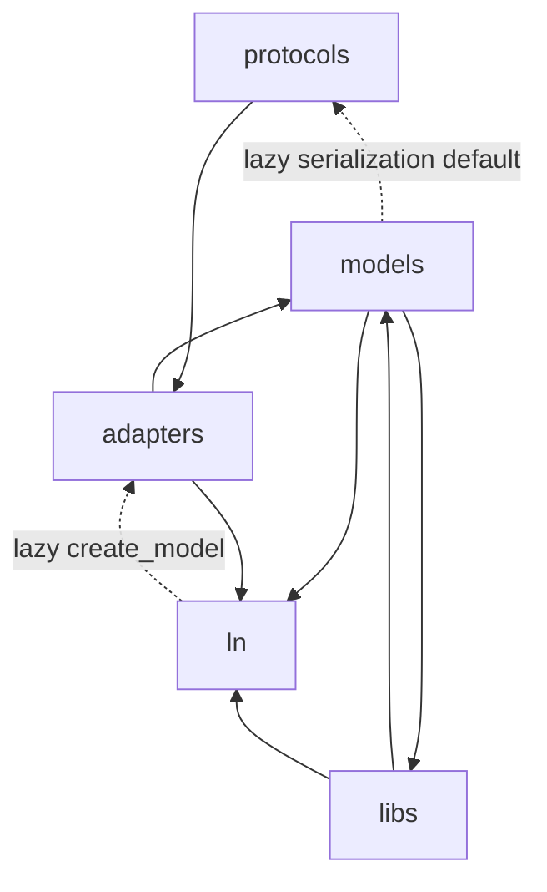

# ADR-0050: Foundational utility and typed adaptation strata

- **Status**: Proposed
- **Kind**: Retrospective
- **Area**: utilities
- **Date**: 2026-07-09
- **Relations**: none

## Context

The utility stack is a high-fan-in part of LionAGI: small changes at this layer can
alter serialization, hashing, field construction, file placement, and external-format
adaptation throughout the package. The current implementation answers six concrete
problems.

**P1 — Shared primitives need a dependency-light import surface.** Concurrency,
deterministic JSON and hashing, conversion, fuzzy repair, process and network
safeguards, path creation, and framework-neutral field specifications are needed by
many higher layers. If each consumer chooses a different helper or imports an
operations/session package to obtain it, behavior and dependencies drift.
`lionagi.ln` is the explicit high-fan-in surface (`lionagi/ln/__init__.py`). The
concurrent-execution surface is the largest of these fan-in primitives and is
consumed directly by the action, operation, and orchestration layers: ordered
batch execution with retry, timeout, and throttling (`alcall`, `bcall`,
`AlcallParams`, `BcallParams`) and the lower coordination helpers it and other
callers build on (`gather`, `race`, `bounded_map`, `CompletionStream`, `retry`)
(`lionagi/ln/_async_call.py`, `lionagi/ln/concurrency/patterns.py`).

**P2 — Omission is not one state.** A missing key and a declared-but-unassigned
parameter require different behavior from `None`, `False`, or an empty container.
`Undefined` represents absence; `Unset` represents a parameter that exists but has
not been assigned. Both must survive copying by identity and disappear from the
serialization paths that treat them as missing (`lionagi/ln/types/_sentinel.py`,
`lionagi/ln/types/base.py`, `lionagi/models/hashable_model.py`,
`lionagi/models/note.py`).

**P3 — Field meaning must precede framework materialization.** Callers need to
describe a field and an ordered output shape without importing Pydantic merely to
construct the description. The same description must later become real Pydantic
fields, validators, and model classes. `Spec` and `Operable` hold the
framework-neutral description; `FieldModel`, model builders, and
`PydanticSpecAdapter` materialize it (`lionagi/ln/types/spec.py`,
`lionagi/ln/types/operable.py`, `lionagi/models/field_model.py`,
`lionagi/adapters/spec_adapters/pydantic_field.py`).

**P4 — Format support must extend subject classes without hard-coding every
format.** `Node` and `Pile` need different supported formats, and the PostgreSQL
integration must remain optional. Keyed synchronous and asynchronous adapter
registries provide that extension seam; missing and failed adaptations need typed,
inspectable errors (`lionagi/adapters/_base.py`,
`lionagi/protocols/graph/node.py`, `lionagi/protocols/generic/pile.py`).

**P5 — A path constructor and a workspace policy are different contracts.** Some
callers need a convenient nested filename constructor. Other callers accept
caller-controlled paths and must reject traversal, protected targets, unsafe path
components, and symlink containment escapes. The current synchronous and
asynchronous path creators do not provide equivalent safety: `acreate_path()` fixes
the root before interpreting a slash-separated filename, while `create_path()`
creates parents without the equivalent containment checks (`lionagi/ln/_utils.py`,
`lionagi/libs/path_safety.py`).

**P6 — Expensive or diagnostic utility work needs explicit bounds.** Hashing and
fuzzy JSON parsing can consume memory proportional to input; generated field types
are cached; regex validation can backtrack; error context can accidentally become
large. The implementation therefore contains limits that are part of observable
behavior and must be recorded rather than left as unexplained constants.

The stack also contains acknowledged dependency exceptions. `Operable.create_model()`
lazily imports the Pydantic spec adapter, which imports model code. `Note` imports
generic nested-data helpers from `libs`, while schema utilities in `libs` import
`models`. These are current facts, not the intended permanent direction.

| Concern | Decision |
|---------|----------|
| Primitive package boundary | D1: Keep `ln` as the explicit dependency-light primitive surface and `libs` as LionAGI policy/helpers, with current exception edges documented. |
| Missing-value states and serialization | D2: Preserve identity-based `Undefined` and `Unset`, with configured omission through parameter and model serializers. |
| Typed field descriptions and model emission | D3: Keep `Spec`/`Operable` framework-neutral and materialize Pydantic types through model/adapter code; retain the current lazy convenience edge. |
| External-format adaptation | D4: Use subject-class, string-keyed sync/async registries with typed failures and lazy optional integrations. |
| Path safety | D5: Keep policy-grade workspace containment separate from path construction and document the current sync/async asymmetry. |
| Numeric guardrails | D6: Keep shipped input, cache, regex, and diagnostic bounds as explicit contracts, including where the exact value has no recorded rationale. |
| Concurrent batch execution and coordination primitives | D7: Keep `alcall`/`bcall` as the ordered, input-order-preserving, dual-layer-retryable batch surface, and the lower `ln.concurrency` coordination functions as completion-ordered or first-result primitives with independent retry defaults. |

This ADR deliberately does **not** decide:

- operation, session, provider, or protocol behavior; those layers consume these
  utilities but do not belong to the utility contract;
- a new serialization or adapter wire format; this records the shipped extension
  and materialization seams rather than choosing new formats;
- the migration that removes the `ln`/adapter and `libs`/models exception edges;
  the retrospective deltas state the required deliverables;
- a claim that `create_path()` is safe for caller-controlled filenames; the current
  implementation does not support that claim;
- filesystem race freedom after validation. The path checks validate the state they
  observe; they do not reserve a path or replace later open/write semantics.

## Decision

### D1 — Primitive and policy strata remain distinct

`lionagi.ln` is the compact common import surface. `lionagi.libs` owns workspace,
file, schema, content-ingestion, and Pydantic-oriented validation policy, plus some
generic helpers that remain placement exceptions. `lionagi.models` owns Pydantic
model construction and serialization. `lionagi.adapters` owns external-format
conversion seams.

**The contract** is the shipped module and dependency shape:

```text
lionagi/
├── ln/
│   ├── concurrency/          cancellation, task groups, retry, synchronization
│   ├── fuzzy/                JSON extraction/repair and fuzzy key validation
│   ├── types/                sentinels, Params/DataClass, Spec, Operable, filters
│   ├── _async_call.py        alcall/bcall ordered batch execution, AlcallParams/BcallParams
│   ├── _cache.py             bounded caching helpers
│   ├── _hash.py              stable and cryptographic hashing
│   ├── _json_dump.py         deterministic orjson configuration
│   ├── _lazy_init.py         lazy one-time initialization
│   ├── _list_call.py         synchronous list-mapped calls
│   ├── _proc.py              process-group termination
│   ├── _ssrf.py              SSRF target checks
│   ├── _to_list.py           to_list normalization (dropna/unique/flatten)
│   └── _utils.py             conversion, import, locking, and path constructors
├── libs/
│   ├── path_safety.py        workspace/path policy
│   ├── nested.py             current generic nested-data exception
│   ├── schema/               schema reflection and generation
│   └── validate/             LionAGI validation/coercion policy
├── models/
│   ├── field_model.py        Spec-compatible Pydantic field materialization
│   ├── hashable_model.py     deterministic model serialization and hashing
│   └── note.py               nested mapping model
└── adapters/
    ├── _base.py              sync/async registry and typed errors
    ├── json_.py, csv_.py, toml_.py
    ├── async_postgres_adapter.py
    └── spec_adapters/pydantic_field.py
```

`lionagi/ln/__init__.py` explicitly re-exports the public primitive names. It does
not import operations or session behavior. The logical dependency graph, including
deferred imports, is:



**Exact semantics**:

- Importing `lionagi.ln` exposes the names in its `__all__`; the package is not an
  automatic export of every private submodule symbol.
- The arrows above are logical dependencies. The dotted arrows execute only when
  the relevant method is called; they are not all exercised during base import.
- `libs` is not a synonym or compatibility facade for `ln`. Its workspace and
  schema behavior may depend on models and policy that the primitive layer must not
  acquire.
- `models` currently imports `libs.nested` through `Note`; `libs.schema` imports
  models. Contributors must account for that knot before moving either side.
- `HashableModel` installs its default serializer lazily. Its first serialization
  requiring the default imports `Element`; subsequent calls reuse the cached
  serializer (`lionagi/models/hashable_model.py`).

**Why this way**: a single primitive surface prevents helper drift without making
workspace/schema policy a dependency of every low-level consumer. The current
exceptions are documented because hiding them behind deferred imports would make
cycle-sensitive refactors unsafe.

### D2 — Two identity sentinels define omission

`Undefined` and `Unset` are the canonical states. `UNDEFINED` in
`lionagi/utils.py` and `lionagi/libs/nested.py` aliases the same `Undefined` object;
it is not a third state.

**The contract** (`lionagi/ln/types/_sentinel.py`,
`lionagi/ln/types/base.py`) is:

```python
Undefined: Final = UndefinedType()
Unset: Final = UnsetType()

def is_sentinel(
    value: Any,
    *,
    none_as_sentinel: bool = False,
    empty_as_sentinel: bool = False,
) -> bool: ...

@dataclass(slots=True, frozen=True)
class ModelConfig:
    none_as_sentinel: bool = False
    empty_as_sentinel: bool = False
    strict: bool = False
    prefill_unset: bool = True
    use_enum_values: bool = False
    serialize_exclude: frozenset[str] = frozenset()

@dataclass(slots=True, frozen=True, init=False)
class Params:
    def __init__(self, **kwargs: Any): ...
    def to_dict(self, exclude: set[str] = None) -> dict[str, str]: ...
    def with_updates(self, **kwargs: Any) -> DataClass: ...
```

Pydantic-side serializers preserve the same omission meaning:

```python
class HashableModel(BaseModel):
    def to_dict(self, mode: Literal["python", "json", "db"] = "python", **kw) -> dict: ...
    def to_json(self, decode: bool = True, **kw) -> bytes | str: ...

class Note(BaseModel):
    content: dict[str, Any] = Field(default_factory=dict)
    def to_dict(
        self,
        mode: Literal["python", "json"] = "python",
        exclude_none: bool = False,
        exclude_empty: bool = False,
    ) -> dict[str, Any]: ...
```

**Exact semantics**:

- `UndefinedType()` and `UnsetType()` return one cached instance per sentinel
  subclass. `copy` and `deepcopy` return that same instance; both objects are falsy
  and render as `Undefined` or `Unset`.
- `is_sentinel()` always recognizes the two objects by identity. It recognizes
  `None` only when `none_as_sentinel=True`, and the shipped empty tuple, set,
  frozenset, dict, list, and empty string only when `empty_as_sentinel=True`.
- `Params` rejects unknown constructor keys with `ValueError`. With
  `prefill_unset=True`, an allowed field that remains `Undefined` becomes `Unset`.
  With `strict=True`, any value considered a sentinel by the configured policy
  raises `ValueError("Missing required parameter: ...")`.
- `Params.to_dict()` omits configured sentinel values and requested exclusions;
  enum values are converted only when `use_enum_values=True`. `default_kw()` also
  flattens nested `kwargs` and `kw` dictionaries into the returned mapping.
- `HashableModel._to_dict()` removes top-level sentinel values. `mode="json"`
  round-trips through deterministic JSON; `mode="db"` additionally renames
  `metadata` to `node_metadata`. The inverse DB path renames it back.
- `Note.to_dict()` recursively removes sentinel values from dictionaries and lists.
  `exclude_none` and `exclude_empty` extend that recursive omission policy. The
  returned structure is a deep copy; JSON mode additionally runs recursive model
  and enum conversion.
- Unsupported `HashableModel` modes raise `ValueError`. A missing `Note.get()` or
  `Note.pop()` path follows the nested helper contract: it returns the supplied
  default, or raises when the default remains `UNDEFINED`.
- Restart does not change sentinel identity within the new process. Serialized
  application data must not rely on a process address; the stable contract is the
  sentinel name and omission behavior.

**Why this way**: collapsing both states into `None` makes optional-null values
indistinguishable from omission. Using identity rather than equality prevents
ordinary user values from accidentally comparing equal to a sentinel.

### D3 — Specs describe fields; Pydantic materializes them

`Spec` and `Operable` are dataclasses under `ln.types`; their module imports do not
require Pydantic. The current `Operable.create_model()` convenience method crosses
to the Pydantic adapter lazily.

**The framework-neutral contract** (`lionagi/ln/types/spec.py`,
`lionagi/ln/types/operable.py`) is:

```python
@dataclass(frozen=True, slots=True, init=False)
class Spec:
    base_type: type
    metadata: tuple[Meta, ...]

    def __init__(
        self,
        base_type: type = None,
        *args,
        metadata: tuple[Meta, ...] = None,
        **kw,
    ) -> None: ...

@dataclass(frozen=True, slots=True, init=False)
class Operable:
    __op_fields__: tuple[Spec, ...]
    name: str | None

    def __init__(
        self,
        specs: tuple[Spec, ...] | list[Spec] = (),
        *,
        name: str | None = None,
    ): ...

    def get_specs(
        self,
        *,
        include: set[str] | None = None,
        exclude: set[str] | None = None,
    ) -> tuple[Spec, ...]: ...

    def create_model(
        self,
        adapter: Literal["pydantic"] = "pydantic",
        model_name: str | None = None,
        include: set[str] | None = None,
        exclude: set[str] | None = None,
        **kw,
    ): ...
```

**The Pydantic materialization contract**
(`lionagi/adapters/spec_adapters/pydantic_field.py`) is:

```python
class PydanticSpecAdapter(SpecAdapter):
    @classmethod
    def create_field(cls, spec: Spec) -> FieldInfo: ...

    @classmethod
    def create_validator(cls, spec: Spec) -> dict | None: ...

    @classmethod
    def create_model(
        cls,
        op: Operable,
        model_name: str,
        include: set[str] | None = None,
        exclude: set[str] | None = None,
        base_type: type[BaseModel] | None = None,
        doc: str | None = None,
    ) -> type[BaseModel]: ...
```

`FieldModel` is the intermediate Pydantic-oriented field shape:

```python
@dataclass(slots=True, frozen=True, init=False)
class FieldModel(Params):
    _config = ModelConfig(prefill_unset=True, none_as_sentinel=True)
    base_type: type[Any]
    metadata: tuple[Meta, ...]

    def create_field(self) -> Any: ...
    @property
    def annotation(self) -> type[Any]: ...
    def to_spec(self) -> Spec: ...
```

**Exact semantics**:

- `Spec` rejects duplicate metadata keys, simultaneous `default` and
  `default_factory`, a non-callable default factory, a non-callable validator,
  and a `base_type` that is not a type or type annotation. An async default
  factory is accepted with a compatibility warning.
- `Operable` converts an input list to a tuple, rejects non-`Spec` items, and
  rejects duplicate non-`None` spec names. Multiple unnamed specs are allowed.
- `Operable.get()` returns `Unset` on a miss unless another default is supplied.
  Supplying both `include` and `exclude` is an error. `exclude` preserves original
  spec order; `include` iterates the caller's set and therefore does not promise
  original order.
- `create_model()` supports only the key `"pydantic"`. An unknown key raises
  `ValueError`. Import failure is re-raised with the explicit Pydantic installation
  message. The default generated class name is `model_name`, then `Operable.name`,
  then `"DynamicModel"`.
- `PydanticSpecAdapter` converts each named spec to a `FieldInfo`, collects one
  Pydantic field validator per spec carrying `validator` metadata, calls
  `build_model_type(..., inherit_base=True)`, then calls `model_rebuild()`.
  Unnamed specs do not become model fields.
- `FieldModel` accepts the legacy aliases `annotation -> base_type` and
  `field -> name`. A callable `default` becomes a Pydantic `default_factory`.
  Unknown Pydantic field metadata is placed in `json_schema_extra`, except type
  objects, which are skipped because they are not JSON-schema serializable.
- Nullable fields without an explicit default/default factory receive
  `default=None`; listable fields wrap a non-list base annotation in `list[...]`.

**Why this way**: the neutral description can be constructed and inspected by
lower layers, while Pydantic-specific imports and behavior remain behind the point
that asks for a Pydantic class. The current convenience method is retained because
it is public, but it is an exception rather than the desired dependency direction.

### D4 — Adapters are keyed subject-class registries

Synchronous and asynchronous adapters are registered against the subject class that
uses them. The registry selects an adapter with a runtime string key.

**The contract** (`lionagi/adapters/_base.py`) is:

```python
class Adapter(Protocol[T]):
    adapter_key: ClassVar[str]
    obj_key: ClassVar[str]  # compatibility spelling
    @classmethod
    def from_obj(cls, subj_cls: type[T], obj: Any, /, *, many: bool = False,
                 adapt_meth: str | Callable = "model_validate",
                 adapt_kw: dict[str, Any] | None = None, **kw: Any) -> T | list[T]: ...
    @classmethod
    def to_obj(cls, subj: T | list[T], /, *, many: bool = False,
               adapt_meth: str | Callable = "model_dump",
               adapt_kw: dict[str, Any] | None = None, **kw: Any) -> Any: ...

class Adaptable:
    @classmethod
    def register_adapter(cls, adapter_cls: type[Adapter]) -> None: ...
    @classmethod
    def adapt_from(cls, obj: Any, *, obj_key: str,
                   adapt_meth: str = "model_validate", **kw: Any) -> Any: ...
    def adapt_to(self, *, obj_key: str,
                 adapt_meth: str = "model_dump", **kw: Any) -> Any: ...

class AsyncAdaptable:
    @classmethod
    def register_async_adapter(cls, adapter_cls: type[AsyncAdapter]) -> None: ...
    @classmethod
    async def adapt_from_async(cls, obj: Any, *, obj_key: str,
                               adapt_meth: str = "model_validate", **kw: Any) -> Any: ...
    async def adapt_to_async(self, *, obj_key: str,
                             adapt_meth: str = "model_dump", **kw: Any) -> Any: ...
```

The typed error family is:

| Error | Default status | Meaning |
|-------|----------------|---------|
| `AdapterError` | 500 | Base or uncategorized adapter failure. |
| `AdapterValidationError` | 422 | Adapted data did not validate. |
| `AdapterParseError` | 400 | External representation could not be parsed. |
| `AdapterNotFoundError` | 404 | No adapter is registered under the requested key. |
| `AdapterConfigurationError` | 500 | Adapter or registry configuration is invalid. |
| `AdapterResourceError` | 404 | Required external resource is unavailable. |
| `AdapterConnectionError` | 503 | Connection establishment or use failed. |
| `AdapterQueryError` | 400 | External query execution failed. |

The shipped registrations are:

| Subject | Sync keys | Async key | Registration behavior |
|---------|-----------|-----------|-----------------------|
| `Node` | `json`, `toml` | `lionagi_async_pg` | JSON/TOML register when the node module loads; PostgreSQL is checked and registered only when that key is requested. |
| `Pile` | `csv`, `json` | none by default | CSV/JSON register when the pile module loads. |

**Exact semantics**:

- Registering a class without `adapter_key`/`obj_key` raises
  `AdapterConfigurationError`. Registering the same key again replaces that
  registry entry; there is no conflict error.
- A missing sync or async key raises `AdapterNotFoundError` and includes `obj_key`
  in its details. An adapter returning `None` raises `AdapterError` rather than
  being treated as a successful empty result.
- Existing `AdapterError`, `KeyError`, `ImportError`, `AttributeError`, and
  `ValueError` instances propagate from registry calls. Other exceptions are
  wrapped as `AdapterError` with the original error text.
- `AdapterBase._handle_error()` maps the categories `parse`, `validation`,
  `connection`, `query`, and `resource` to the corresponding typed class and
  preserves the original exception as the cause.
- Error string rendering recursively redacts known credential keys and sensitive
  URL query parameters. Long string details are truncated under D6.
- `Node` forces `to_dict(mode="db")` on synchronous and asynchronous output and
  `from_dict` on input. Requesting `lionagi_async_pg` runs the availability check
  once. Missing optional dependencies or construction failures are swallowed and
  leave the key unregistered; the subsequent registry lookup therefore fails with
  `AdapterNotFoundError` instead of making the base package unimportable.
- Registry contents are in memory. On process restart, module import and lazy
  registration reconstruct them; there is no persisted registry state.

**Why this way**: the subject class defines which representations it supports,
while adapters remain stateless conversion units. String keys allow optional and
third-party formats, so missing-key behavior must stay explicit and tested.

### D5 — Workspace path policy is stronger than path construction

Policy functions in `lionagi/libs/path_safety.py` and constructors in
`lionagi/ln/_utils.py` remain distinct APIs.

**The policy contract** includes:

```python
def resolve_workspace_path(path: str | Path, workspace_root: Path) -> Path: ...
def check_path_safe(value: str, field_name: str, *,
                    reject_absolute: bool = True, strip_at: bool = False) -> str: ...
def contain_and_resolve(path: str | Path, root: Path) -> Path: ...
def contain_path_in_root(value: str | Path, root: Path, field_name: str, *,
                         strip_at: bool = False) -> str: ...
def safe_join(root: Path, component: str) -> Path: ...
def validate_name(value: str, label: str = "name") -> str: ...
def validate_bare_name(name: str, label: str = "name") -> str: ...
def validate_path_component(component: str, label: str = "component") -> str: ...
```

**The constructor contract** is:

```python
async def acreate_path(
    directory: Path | AsyncPath | str,
    filename: str,
    extension: str | None = None,
    timestamp: bool = False,
    dir_exist_ok: bool = True,
    file_exist_ok: bool = False,
    time_prefix: bool = False,
    timestamp_format: str | None = None,
    random_hash_digits: int = 0,
    timeout: float | None = None,
) -> AsyncPath: ...

def create_path(
    directory: Path | str,
    filename: str,
    extension: str = None,
    timestamp: bool = False,
    dir_exist_ok: bool = True,
    file_exist_ok: bool = False,
    time_prefix: bool = False,
    timestamp_format: str | None = None,
    random_hash_digits: int = 0,
) -> Path: ...
```

**Exact semantics**:

- `resolve_workspace_path()` expands `~`, resolves relative inputs beneath the
  workspace root, rejects a candidate that is itself a symlink, rejects a resolved
  containment escape, and rejects the protected basenames `.env`, `.netrc`,
  `id_rsa`, `id_ed25519`, `id_ecdsa`, and `.htpasswd`. Violations are
  `PermissionError`.
- `check_path_safe()` rejects NUL bytes, `..` components, and—by default—absolute
  and Windows drive-letter paths. Batch forms validate each element and return the
  original list on success. These validation failures are `ValueError`.
- `safe_join()` accepts one non-empty component, rejects `.`/`..`, slash,
  backslash, and NUL, resolves symlinks, and then checks containment.
  `validate_name()` additionally rejects glob metacharacters; `validate_bare_name()`
  restricts input to ASCII letters, digits, underscores, and hyphens.
- `acreate_path()` captures a resolved `base_root` before a slash-separated filename
  can extend the directory. It rejects `.` or `..` components, backslashes, and any
  resolved directory/candidate outside that root. It creates parent directories,
  then raises `FileExistsError` if the result exists and `file_exist_ok=False`.
- `create_path()` accepts slash-separated filenames by moving their prefix under
  `directory`; it rejects backslashes but does not reject `.`/`..` or perform fixed-
  root/symlink containment. It otherwise has the same extension, timestamp, random
  suffix, parent creation, and existing-file behavior.
- An extension already present in `filename` wins over the separate `extension`.
  Timestamps default to `%Y%m%d%H%M%S`; `time_prefix` selects prefix versus suffix.
  A positive `random_hash_digits` appends that many leading UUID-hex characters.
- `acreate_path(timeout=None)` has no internal deadline. A supplied timeout wraps
  the entire construction and raises `TimeoutError` when the cancellation scope
  expires. `create_path()` has no timeout parameter.

**Why this way**: workspace containment is a policy decision and must be explicit at
the call site. The async constructor has since acquired containment checks, while the
older synchronous helper still preserves slash-separated construction behavior.
Until the delta is resolved, they are not interchangeable for untrusted input.

### D6 — Shipped numerical guardrails remain observable

The current limits are:

| Surface | Value/default | Behavior and rationale |
|---------|---------------|------------------------|
| `compute_hash()` payload | 10 MiB (`10 * 1024 * 1024`) | Raises `ValueError` before hashing a larger encoded payload. The source records DoS prevention as the reason; the exact 10 MiB choice is inherited with no more specific recorded rationale. |
| `fuzzy_json()` / JSON extraction input | 10 MiB by default | Rejects empty, non-string, or oversized input before repair/parsing. The source records memory-exhaustion prevention and calls 10 MiB generous for normal use; callers may pass a different `max_size`. |
| `Spec` annotated-type cache | 10,000 entries by default | LRU-style bounded cache configured by `LIONAGI_FIELD_CACHE_SIZE`. It prevents unbounded generated-type retention; no rationale is recorded for exactly 10,000. |
| `FieldModel` annotated-type cache | 10,000 entries by default | Thread-safe `BoundedLRUCache`, controlled by the same environment key. No rationale is recorded for exactly 10,000. |
| `FieldModel` metadata warning | 10 items by default | `LIONAGI_FIELD_META_LIMIT`; exceeding it warns but does not reject. The warning asks callers to simplify field definitions; no rationale is recorded for exactly 10. |
| Adapter string detail | 500 characters | Error rendering truncates longer string values after redaction. This bounds diagnostic output; no rationale is recorded for exactly 500. |
| `acreate_path()` timeout | `None` | No deadline unless supplied by the caller; there is no inherited numeric timeout. |
| `alcall()`/`AlcallParams` retry | `retry_attempts=0`, `retry_initial_delay=0`, `retry_backoff=1`, `retry_timeout=None` | Zero retries, no inter-attempt delay, no growth, and no per-attempt deadline by default — a failing item makes exactly one attempt unless the caller opts in. No rationale beyond fail-fast-by-default is recorded. |
| `alcall()` concurrency cap | `max_concurrent=None` (unbounded); `max_concurrent=0` is also unbounded because the semaphore is only built `if max_concurrent` | No rationale is recorded for treating `0` as unbounded rather than raising; it follows from the truthiness check in the source, not a stated design choice. |
| `ln.concurrency.retry()` | `attempts=3`, `base_delay=0.1`, `max_delay=2.0`, `backoff_factor=2.0`, `jitter=0.1` | Independent of `alcall`'s retry defaults (see D7); retries by default. No single rationale is recorded for the exact constants beyond the source's own "reasonable default backoff envelope" framing. |
| `bounded_map()`/`CompletionStream` concurrency `limit` | no default; `bounded_map(limit<=0)` raises `ValueError` before scheduling any task | The guardrail is a required-positive invariant, not a numeric default — every caller must state a concrete bound. |

These are implementation contracts, not performance guarantees. Environment values
are parsed with `int()` at import/construction time; malformed values fail rather than
silently reverting. Changing a default changes memory, acceptance, or diagnostics and
must be accompanied by tests and release documentation.

### D7 — Batch execution is input-ordered; coordination primitives are completion-ordered

`lionagi.ln` splits concurrent execution into two layers. `alcall`/`bcall` apply one
function across many items with input normalization, per-item retry, per-item
timeout, a concurrency cap, and throttled task start, returning results in the
original input order. Beneath them, `ln.concurrency.patterns` provides
lower-level, general-purpose coordination primitives (`gather`, `race`,
`bounded_map`, `CompletionStream`) plus a standalone `retry()` helper with its own,
independently defaulted retry envelope.

**The contract** (`lionagi/ln/_async_call.py`, `lionagi/ln/concurrency/patterns.py`) is:

```python
async def alcall(
    input_: list[Any],
    func: Callable[..., T],
    /,
    *,
    input_flatten: bool = False,
    input_dropna: bool = False,
    input_unique: bool = False,
    input_flatten_tuple_set: bool = False,
    output_flatten: bool = False,
    output_dropna: bool = False,
    output_unique: bool = False,
    output_flatten_tuple_set: bool = False,
    delay_before_start: float = 0,
    retry_initial_delay: float = 0,
    retry_backoff: float = 1,
    retry_default: Any = Unset,
    retry_timeout: float | None = None,
    retry_attempts: int = 0,
    max_concurrent: int | None = None,
    throttle_period: float | None = None,
    return_exceptions: bool = False,
    **kwargs: Any,
) -> list[T | BaseException]: ...

async def bcall(
    input_: list[Any],
    func: Callable[..., T],
    /,
    batch_size: int,
    **kwargs: Any,
) -> AsyncGenerator[list[T | BaseException], None]: ...

@dataclass(slots=True, init=False, frozen=True)
class AlcallParams(Params):
    _config: ClassVar[ModelConfig] = ModelConfig(none_as_sentinel=True)
    _func: ClassVar[Any] = alcall
    input_flatten: bool
    input_dropna: bool
    input_unique: bool
    input_flatten_tuple_set: bool
    output_flatten: bool
    output_dropna: bool
    output_unique: bool
    output_flatten_tuple_set: bool
    delay_before_start: float
    retry_initial_delay: float
    retry_backoff: float
    retry_default: Any
    retry_timeout: float
    retry_attempts: int
    max_concurrent: int
    throttle_period: float
    return_exceptions: bool
    kw: dict[str, Any] = Unset

    async def __call__(self, input_: list[Any], func: Callable[..., T], **kw) -> list[T]: ...

@dataclass(slots=True, init=False, frozen=True)
class BcallParams(AlcallParams):
    _func: ClassVar[Any] = bcall
    batch_size: int

    async def __call__(self, input_: list[Any], func: Callable[..., T], **kw) -> list[T]: ...
```

The lower coordination layer:

```python
async def gather(*aws: Awaitable[T], return_exceptions: bool = False) -> list[T | BaseException]: ...

async def race(*aws: Awaitable[T]) -> T: ...

async def bounded_map(
    func: Callable[[T], Awaitable[R]],
    items: Iterable[T],
    *,
    limit: int,
    return_exceptions: bool = False,
) -> list[R | BaseException]: ...

class CompletionStream:
    def __init__(
        self,
        aws: Sequence[Awaitable[T]],
        *,
        limit: int | None = None,
        return_exceptions: bool = False,
    ): ...
    async def __aenter__(self) -> "CompletionStream": ...
    async def __aexit__(self, exc_type, exc_val, exc_tb) -> bool: ...
    def __aiter__(self) -> "CompletionStream": ...
    async def __anext__(self) -> tuple[int, T]: ...

async def retry(
    fn: Callable[[], Awaitable[T]],
    *,
    attempts: int = 3,
    base_delay: float = 0.1,
    max_delay: float = 2.0,
    backoff_factor: float = 2.0,
    retry_on: tuple[type[BaseException], ...] = (Exception,),
    jitter: float = 0.1,
) -> T: ...
```

**Exact semantics**:

- `alcall` accepts `func` as a single callable or a one-element iterable containing
  exactly one callable; anything else raises `ValueError`. Input is normalized
  before scheduling: if `input_flatten` or `input_dropna` is set it routes through
  `to_list()`; otherwise a `list` is used as-is, a Pydantic `BaseModel`/`msgspec`
  `Struct` instance is wrapped as a single-element list (never iterated field by
  field), any other iterable is materialized to a list, and a non-iterable single
  value becomes a one-element list. An empty (post-normalization) input schedules
  no tasks and returns `[]` without creating a task group.
- Results are written to a pre-sized `list[None] * n_items` by original index
  inside each task, not appended in completion order — the returned list always
  preserves input order regardless of which item finishes first. This is the
  opposite ordering guarantee from `CompletionStream`/`race`, which are explicitly
  completion-ordered.
- Per item, `_execute_with_retry` makes one attempt, then up to `retry_attempts`
  further attempts on any non-cancellation `Exception` (the cancellation exception
  class from `get_cancelled_exc_class()` is never retried and always propagates
  immediately). With the default `retry_attempts=0`, a failing item makes exactly
  one attempt: if `retry_default` is still the sentinel `Unset`, the exception
  propagates; if the caller supplied a concrete `retry_default`, that value is
  returned instead. Delay between attempts starts at `retry_initial_delay` (default
  `0`, so no sleep) and is multiplied by `retry_backoff` (default `1`, so no growth)
  after each failed attempt that had a nonzero delay.
- `retry_timeout` wraps each individual attempt (not the whole retry sequence) in
  `move_on_after`; expiry raises `TimeoutError`, which is itself subject to the same
  retry policy as any other exception.
- `max_concurrent` gates concurrent execution with a `Semaphore`; the semaphore is
  only constructed `if max_concurrent` is truthy, so `max_concurrent=0` behaves
  identically to `max_concurrent=None` (unbounded) rather than being rejected or
  meaning "no concurrency."
- `throttle_period`, when set, sleeps that many seconds after starting each task
  except the last before starting the next — it throttles task *start* spacing, not
  per-item execution time, and does not apply after the final item.
- `return_exceptions=False` (default): a failing task stores its exception at
  `out[idx]` and re-raises into the task group. The resulting `BaseExceptionGroup`
  is unwrapped by `non_cancel_subgroup`: if every exception in the group is a
  cancellation, the original group re-raises unchanged; otherwise, if exactly one
  non-cancellation exception remains, it is raised directly (not wrapped in a
  group, `from rest`) for ergonomic single-exception catching; two or more
  non-cancellation exceptions raise the (sub)group itself, chained `from eg`.
  `return_exceptions=True` suppresses all of this: failing items leave their
  exception object in the corresponding output slot and nothing propagates.
- `input_unique`/`output_unique` are delegated to `to_list(..., unique=True)`,
  which requires `flatten=True` for the same call; requesting `*_unique` without
  the matching `*_flatten` raises `ValueError` from `to_list()`, not from `alcall`
  itself. `*_dropna` drops `None` and sentinel-singleton entries only — a
  `BaseException` instance left in the output by `return_exceptions=True` is not
  itself `None`/a sentinel, so `output_dropna=True` does not discard failed-item
  exceptions from the returned list.
- `bcall` slices its (always flattened-and-`dropna`'d, via an unconditional
  `to_list(input_, flatten=True, dropna=True)` regardless of any `input_flatten`/
  `input_dropna` passed in `**kwargs`) input into fixed-size chunks of `batch_size`
  (the final chunk may be shorter), and awaits one full `alcall(...)` call per
  chunk before starting the next — batches never overlap. `bcall` is an async
  generator: it yields one per-batch result list at a time; a caller that wants all
  results as a single list must async-iterate and concatenate, which is exactly
  what `BcallParams.__call__` does.
- `AlcallParams`/`BcallParams` are `Params` subclasses: only fields the caller
  explicitly sets at construction are recorded (unset fields read back as the
  sentinel `Undefined` via `getattr(self, k, Undefined)` and are excluded from
  `to_dict()`/`default_kw()`), so calling `AlcallParams(retry_attempts=2)(...)`
  leaves every other `alcall` parameter to fall back to `alcall`'s own defaults
  rather than passing an explicit override. `BcallParams.__call__` pops
  `batch_size` out of the merged kwargs before delegating (it is a positional
  parameter of `bcall`) and collects every yielded batch into one flat list, so
  invoking a `BcallParams` instance returns a list, not the async generator that
  calling `bcall()` directly returns.
- `gather()` returns `[]` immediately for zero awaitables without creating a task
  group. Otherwise it follows the same pre-sized, index-written, ordered-result and
  exception-group-unwrapping behavior as `alcall`, keyed by `return_exceptions`.
- `race()` raises `ValueError` immediately for zero awaitables. Otherwise every
  awaitable runs in its own task, each reporting `(True, result)` or
  `(False, exception)` into a capacity-1 memory stream; `race()` returns (or
  re-raises) whichever tuple arrives first and then cancels the task group's
  cancel scope, so the remaining tasks are cancelled at their next checkpoint. The
  winning exception is re-raised outside the task-group context specifically so it
  is not wrapped in an `ExceptionGroup`.
- `bounded_map()` raises `ValueError` for `limit <= 0` before touching `items`, and
  returns `[]` immediately for an empty (materialized) `items` sequence before
  constructing a `CapacityLimiter`. Otherwise it is index-ordered like `alcall`/
  `gather`, gated by a `CapacityLimiter(limit)` rather than a `Semaphore`.
- `CompletionStream` is an async context manager, not a coroutine: `__aenter__`
  opens a memory stream sized to `len(aws)` and starts one task per awaitable,
  each optionally gated by a shared `CapacityLimiter(limit)`. Iterating it (`async
  for idx, result in stream`) yields `(index, result)` pairs in first-completed
  order — the opposite ordering guarantee from `alcall`/`gather`/`bounded_map`.
  With `return_exceptions=True`, a failing awaitable's exception is yielded as the
  result half of its tuple; with the default `return_exceptions=False`, it
  propagates and is raised through `__aexit__` instead. If the consumer stops
  iterating before every result has arrived, a still-running runner's attempt to
  send its result raises `anyio.ClosedResourceError` internally, which is caught
  and the result silently discarded — early exit is a supported, non-error path,
  not a resource leak.
- `retry()` is a standalone helper independent of `alcall`'s retry parameters: it
  defaults to retrying (`attempts=3`) rather than `alcall`'s default of no retry
  (`retry_attempts=0`). It validates `attempts >= 1`, `base_delay > 0`,
  `max_delay >= 0`, `jitter >= 0`, `backoff_factor >= 1.0`, and rejects a
  `retry_on` tuple that includes the current async backend's cancellation
  exception type, all via `ValueError` before the first attempt. Backoff delay is
  `min(max_delay, base_delay * backoff_factor ** (attempt - 1))`, jittered by
  `delay *= 1 + random() * jitter`. When an effective deadline is active (a
  surrounding `move_on_at`/`fail_at` scope), a delay that would cross the deadline
  raises immediately instead of sleeping past it.

**Why this way**: centralizing retry, timeout, throttling, and ordering in
`alcall`/`bcall` keeps that logic out of every call site that needs to apply one
function across many items — the same problem P1 names for the rest of `ln`.
Preserving input order in `alcall`/`gather`/`bounded_map` matches how callers
index results back against their original request list; `race`/`CompletionStream`
exist specifically for the opposite case, where the caller wants the earliest
result(s) rather than a positional one, so they are completion-ordered instead.
The retry parameters on `alcall` and the standalone `retry()` helper are
independently defaulted because they answer different questions: `alcall`'s
`retry_attempts=0` default treats retry as an opt-in per-item safeguard for batch
work, while `retry()`'s `attempts=3` default targets a single call site that
already decided it wants resilience. Collapsing them into one shared default would
either make every batch call retry silently or make every explicit `retry()`
caller need to opt in to what they already asked for.

## Consequences

- Common primitives and the two-state sentinel convention remain available through
  stable, compact import surfaces. Framework-neutral field descriptions can be used
  before choosing Pydantic materialization.
- Deterministic JSON and hashing behavior is shared, but callers hashing content
  larger than 10 MiB must choose a different streaming design rather than expecting
  `compute_hash()` to accept it.
- Pydantic conversion and format adaptation can evolve without duplicating field
  semantics across protocol types. Adding a new `Node` or `Pile` format is localized
  to an adapter plus registration.
- Runtime string keys are not statically closed. A typo and an unavailable optional
  integration both surface as `AdapterNotFoundError`; callers must not treat a
  registry miss as a successful empty conversion.
- The lazy `ln`-to-adapter edge, the `libs`/`models` knot, and compatibility aliases
  constrain file moves. Reversing D1 or D3 requires an import migration and cycle
  tests, not only relocation.
- The synchronous and asynchronous path creators do not offer interchangeable safety
  guarantees. Code handling caller-controlled paths must use workspace-containment
  policy or the fixed-root async constructor.
- Callers get one ordered, retryable batch primitive (`alcall`/`bcall`) and a
  separate set of completion-ordered coordination primitives, instead of choosing
  ordering behavior ad hoc; but a caller that wants completion order from `alcall`
  itself has no parameter for that — they must switch to `CompletionStream`. The
  two independently defaulted retry mechanisms (`alcall`'s `retry_attempts=0` vs.
  `retry()`'s `attempts=3`) mean a contributor who assumes one governs the other
  will silently get the wrong retry behavior; this is now a recorded, testable
  contract rather than an implicit difference.
- Contributors changing sentinel handling must test constructor validation, Python,
  JSON, DB, and recursive `Note` serialization; omission is distributed across those
  paths.
- Reversing D4 would affect every adaptable subject and its error handling. Reversing
  a D6 bound affects accepted inputs or retained memory and therefore is not a
  private constant change.

## Current-vs-ideal delta

| # | Delta | Size | Issue |
|---|-------|------|-------|
| 1 | Relocate Pydantic model emission behind a Pydantic-side factory, preserve `Operable.create_model()` through a documented compatibility shim for one minor release, and add a test that fails if any `lionagi.ln` module imports adapters, models, protocols, operations, or session code. | M | (filled at issue-open time) |
| 2 | Move generic nested-data and scalar-coercion helpers into `lionagi.ln`, retain their `lionagi.libs` import paths as deprecated re-exports for one minor release, replace internal `UNDEFINED` spellings with `Undefined`, and verify that `Note` and LNDL behavior is unchanged. | M | (filled at issue-open time) |
| 3 | Give `create_path()` and `acreate_path()` equivalent traversal and symlink-containment semantics, or rename and document the synchronous helper as unconstrained path construction; add symmetric tests for nested filenames, `..` components, and symlink escapes. | S | (filled at issue-open time) |

## Alternatives considered

### Merge `ln` and `libs`

One package would remove the naming question and eliminate some imports between the
two. It lost because workspace containment, schema generation, content ingestion,
and Pydantic-oriented validation are policy-bearing dependencies. Moving them into
the high-fan-in primitive surface would make low-level concurrency, hashing, and
conversion consumers transitively depend on policy they do not use.

### Split every helper into a separate public package

Fine-grained packages could make dependency ownership visually precise. They would
also multiply import paths, public compatibility promises, and discovery cost without
creating new process or persistence boundaries. The existing `ln` submodules already
provide internal decomposition while `ln.__all__` provides one supported surface.

### Treat `None` as the only missing value

This would remove the sentinel classes and simplify signatures. It lost because a
caller must be able to submit an explicit null while separately expressing an absent
field or an unassigned declared parameter. Serialization and strict validation depend
on those distinctions today.

### Put Pydantic directly in `Spec` and `Operable`

Direct `FieldInfo` and `BaseModel` construction would make `create_model()` simpler
and remove the adapter hop. It lost because field descriptions would then import and
encode one materialization framework at the primitive layer. The adapter/model path
is the existing place where framework-specific defaults, validators, and schema
extras are interpreted.

### Keep the lazy Pydantic edge as the permanent layer direction

The current method is convenient and avoids an immediate compatibility change. It
lost as the ideal direction because the primitive package would permanently know its
materialization mechanism. The retrospective contract retains the method; the delta
requires a Pydantic-side factory plus a compatibility shim before removal.

### Use a global adapter registry for every subject

A global format-to-adapter map would simplify registration lookup. It lost because
`Node` and `Pile` intentionally support different formats and invoke different
serialization methods. Subject-class registries prevent a key from implying support
for types an adapter cannot reconstruct.

### Eagerly import all optional adapters

Eager registration would make adapter availability visible immediately. It lost
because importing the base package would then depend on optional database libraries
and configuration. The lazy PostgreSQL path preserves base importability and converts
unavailability into the standard missing-key failure.

### Declare `create_path()` and `acreate_path()` equivalent

One documented contract would be easier for callers. It is rejected as a description
of current code: the synchronous helper accepts slash-separated `..` components and
does not fix/check a root, while the asynchronous helper explicitly rejects traversal
and resolved escapes. The delta must change code or naming before equivalence can be
claimed.

## Notes

Primary source anchors for this retrospective record are
`lionagi/ln/__init__.py`, `lionagi/ln/_async_call.py`,
`lionagi/ln/concurrency/patterns.py`, `lionagi/ln/_hash.py`, `lionagi/ln/_utils.py`,
`lionagi/ln/fuzzy/_fuzzy_json.py`, `lionagi/ln/types/_sentinel.py`,
`lionagi/ln/types/base.py`, `lionagi/ln/types/spec.py`,
`lionagi/ln/types/operable.py`, `lionagi/libs/path_safety.py`,
`lionagi/libs/nested.py`, `lionagi/models/field_model.py`,
`lionagi/models/hashable_model.py`, `lionagi/models/note.py`,
`lionagi/adapters/_base.py`,
`lionagi/adapters/spec_adapters/pydantic_field.py`,
`lionagi/protocols/graph/node.py`, and
`lionagi/protocols/generic/pile.py`.
