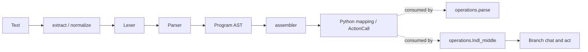
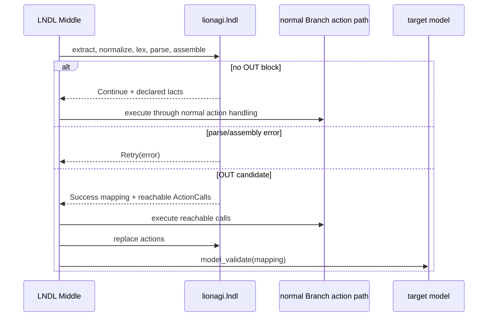

# ADR-0051: LNDL language and operations boundary

- **Status**: Proposed
- **Kind**: Retrospective
- **Area**: utilities
- **Date**: 2026-07-09
- **Relations**: none

## Context

LNDL is a structured-output language intended to let a model mix natural reasoning,
typed value declarations, action-call declarations, and an explicit `OUT{}` projection.
The shipped code must separate deterministic language processing from stateful model
and action execution. Four problems force that boundary.

**P1 — Syntax must remain deterministic and independently testable.** Tokenization,
parsing, AST construction, normalization, extraction, and assembly should run on text
and Python values. Requiring a `Branch`, a model endpoint, or session history to parse
one LNDL block would make grammar behavior depend on runtime state.

**P2 — Action declarations must be representable before execution.** A `<lact>` body
describes a function call, but the language package does not know whether that action
is permitted or how it should execute. The assembler therefore needs a typed
placeholder that can be collected, replaced, rejected, or revalidated after the
operations layer supplies results (`lionagi/lndl/types.py`,
`lionagi/lndl/assembler.py`).

**P3 — Model-produced syntax is imperfect but repair must be bounded and
explainable.** Models produce curly-brace tags, XML-like attributes, missing `>`,
capitalized note namespaces, scientific notation, duplicate aliases, malformed
constructors, and incomplete `OUT{}` blocks. The language package owns conservative
normalization and typed diagnostics; it must not hide operational retries behind the
parser (`lionagi/lndl/normalize.py`, `lionagi/lndl/lexer.py`,
`lionagi/lndl/parser.py`, `lionagi/lndl/errors.py`).

**P4 — The two production consumers need different behavior.** The ordinary parse
operation recognizes an explicitly supplied `Operable` and extracts the first fenced
LNDL block before the normal JSON/Pydantic route. The opt-in LNDL Middle runs a
multi-round loop, assembles values, sends action calls through normal branch action
handling, and validates the final result. They consume the same language package but
are not interchangeable (`lionagi/operations/parse/parse.py`,
`lionagi/operations/lndl_middle/lndl_middle.py`).

`lionagi.lndl` therefore has active integration paths, but it is not an independent
execution runtime.

| Concern | Decision |
|---------|----------|
| Package boundary and public surface | D1: Keep syntax, AST, assembly, extraction, normalization, diagnostics, prompts, and value types in `lionagi.lndl`, without Branch/session/operation imports. |
| Text-to-AST semantics | D2: Use the shipped fenced extraction, conservative normalization, single-pass lexer, and recursive-descent parser with explicit alias and nesting rules. |
| AST-to-value and action placeholders | D3: Assemble Python mappings against an optional target schema, representing unresolved actions as immutable `ActionCall` values and requiring explicit replacement/revalidation. |
| Operational consumption | D4: Keep the `Operable` extract-first parse path narrow and place multi-round chat, action execution, permissions, history, and budgets in the opt-in operations Middle. |
| Failures, outcomes, and diagnostics | D5: Preserve the LNDL error family and inert round/diagnostic value types; language errors carry information but do not schedule retries. |

This ADR deliberately does **not** decide:

- the multi-round action-selection policy, permission policy, history mutation,
  suppression behavior, or retry budget; those belong to the operations ADR on LNDL
  execution semantics;
- a scheduler, action runtime, session store, or independent LNDL service;
- whether LNDL becomes the default response format. Both current integrations are
  opt-in;
- arbitrary XML or Python compatibility. Normalization and constructor parsing accept
  only the documented subset;
- an input-size limit for the LNDL lexer/parser. The core currently has no byte/character
  cap; transport and operation callers must bound untrusted input where required.

## Decision

### D1 — `lionagi.lndl` owns the language, not execution

The package is public and intentionally decomposed by deterministic responsibility.

**The contract** is the shipped module tree and export surface
(`lionagi/lndl/__init__.py`):

```text
lionagi/lndl/
├── __init__.py              explicit public exports
├── lexer.py                 TokenType, Token, Lexer
├── parser.py                ParseError, Parser
├── ast.py                   Lvar, RLvar, Lact, OutBlock, Program
├── assembler.py             assemble, action/note collection and replacement
├── _parse_function_call.py  restricted Python-style lact constructor parser
├── extract.py               fenced-block extraction
├── normalize.py             conservative surface repair
├── types.py                 metadata, ActionCall, LNDLOutput, revalidation
├── errors.py                LNDLError family
├── diagnostics.py           chunk/round/trace inspection values
├── round_outcome.py         Success/Continue/Retry/Exhausted/Failed values
└── prompt.py                LNDL_SYSTEM_PROMPT and accessor
```

The public API explicitly exports the AST/value/error types and the language helpers
through `__all__`; it does not export `_parse_function_call` internals.



**Exact semantics**:

- `lionagi.lndl` imports Pydantic value types plus deterministic JSON and boolean
  coercion helpers, but no Branch, Session, provider, action execution, or operation
  module.
- Parsing and assembly hold no global conversation/session state. A `Lexer` and
  `Parser` are mutable single-use objects and are documented as not thread-safe;
  callers create one per parse.
- The parser's only process-global mutable value is the set used to emit a reserved
  action-name warning once per name. It does not affect AST content.
- Prompt, diagnostic, and round-outcome objects are data contracts. Importing or
  constructing them does not call a model or execute an action.
- The package boundary does not mean zero integration coupling: changes to
  `ActionCall`, `Program`, `assemble()`, prompts, or error classes can break both
  operation consumers.

**Why this way**: deterministic language behavior can be unit tested with plain text
and Python types. Runtime state remains in the layer that already owns model calls,
action permissions, messages, and failure policy.

### D2 — Fenced extraction, normalization, lexing, and parsing define the syntax

The core pipeline is explicit; callers choose whether to normalize before lexing.

**The primary signatures** are:

```python
def extract_lndl_blocks(text: str) -> list[str]: ...
def normalize_lndl_text(text: str) -> str: ...

@dataclass
class Token:
    type: TokenType
    value: str
    line: int
    column: int

class Lexer:
    def __init__(self, text: str): ...
    def tokenize(self) -> list[Token]: ...

class Parser:
    def __init__(self, tokens: list[Token], source_text: str | None = None): ...
    def parse(self) -> Program: ...
```

**The AST contract** (`lionagi/lndl/ast.py`) is:

```python
@dataclass(slots=True)
class Lvar:
    model: str
    field: str
    alias: str
    content: str

@dataclass(slots=True)
class RLvar:
    alias: str
    content: str
    extra_id: str | None = None

@dataclass(slots=True)
class Lact:
    model: str | None
    field: str | None
    alias: str
    call: str
    extra_id: str | None = None

@dataclass(slots=True)
class OutBlock:
    fields: dict[str, list[str] | str | int | float | bool]

@dataclass(slots=True)
class Program:
    lvars: list[Lvar | RLvar]
    lacts: list[Lact]
    out_block: OutBlock | None
```

**Accepted declaration forms** are:

| Form | AST meaning |
|------|-------------|
| `<lvar Model.field alias>text</lvar>` | Typed `Lvar`; explicit alias. |
| `<lvar Model.field>text</lvar>` | Typed `Lvar`; field name is the alias. |
| `<lvar hint alias>text</lvar>` | Raw `RLvar`; `hint` is retained as `extra_id` for OUT shortcut resolution. |
| `<lvar alias>text</lvar>` | Raw `RLvar` with no spec hint. |
| `<lact Model.field alias>fn(...)</lact>` | Typed action declaration with explicit alias. |
| `<lact Model.field>fn(...)</lact>` | Typed action declaration; field name is the alias. |
| `<lact hint alias>fn(...)</lact>` | Untyped action with retained `extra_id` hint. |
| `<lact alias>fn(...)</lact>` | Untyped action declaration. |

`OUT{}` accepts explicit mappings (`field: [alias]`, string, finite number, boolean,
or identifier), bare-alias shortcuts, flat alias lists, and nested list groups. The
parser resolves shortcuts using the declared field, then model, then two-token hint;
with no context it falls back to the bare identifier.

**Exact semantics**:

- `extract_lndl_blocks()` recognizes complete backtick or tilde fences whose language
  label case-folds to `lndl`; it returns code bodies in source order. An unfenced input
  or a differently labelled fence yields an empty list.
- `normalize_lndl_text("")` returns the empty input. If fenced blocks exist, it joins
  all of them with two newlines, then repairs only the documented patterns: a missing
  opening `>` when a parenthesized body and closing tag exist, curly `lvar`/`lact`
  tags, XML-style opening attributes (promoting `name=`), and `Note.` casing in tag
  bodies. It does not attempt arbitrary markup correction.
- The lexer emits positional tokens and a terminal `EOF`. It accepts quoted strings
  with common escapes and numbers with a valid `e`/`E` exponent. A trailing exponent
  marker without digits is not consumed as part of the number.
- `Parser.parse()` requires `source_text`; omitting it raises `ParseError`. Non-LNDL
  tokens outside declarations are skipped. Parsing stops after the first `OUT{}`;
  later declarations are not part of the `Program`.
- Aliases must be unique across both lvars and lacts. A duplicate raises `ParseError`.
  Missing `</lvar>` or `</lact>` raises `ParseError`; content is stripped at both ends.
- An action alias that is a Python reserved word or selected builtin is accepted but
  warns once per process/name.
- Nested OUT lists are limited to 32 levels. At level 32 the parser raises
  `ParseError`; the source records protection from excessive nesting but no rationale
  for exactly 32.
- Numeric literals containing `.` or an exponent become `float`; others become `int`.
  Non-finite float results (for example overflow to infinity) raise `ParseError`.
- Reaching EOF inside `OUT{}` returns the fields parsed so far; unlike unclosed lvar or
  lact tags, a missing final `}` is not currently rejected.
- An input containing no declarations returns `Program([], [], None)`. An input with
  declarations but no OUT block preserves those declarations and sets `out_block=None`.

**Why this way**: the grammar is permissive around surrounding prose and a small set
of common surface mistakes, but strict about reference identity, constructor shape,
and bounded nesting. This gives operation-level repair loops a useful typed failure
instead of embedding retries in the parser.

### D3 — Assembly yields mappings and explicit action placeholders

Assembly resolves a `Program` against an optional target class. It does not execute
actions and does not itself return a target-model instance.

**The value contracts** (`lionagi/lndl/types.py`) are:

```python
@dataclass(slots=True, frozen=True)
class ActionCall:
    name: str
    function: str
    arguments: dict[str, Any]
    raw_call: str

@dataclass(slots=True, frozen=True)
class LNDLOutput:
    fields: dict[str, BaseModel | ActionCall | Scalar]
    lvars: dict[str, str] | dict[str, LvarMetadata]
    lacts: dict[str, LactMetadata]
    actions: dict[str, ActionCall]
    raw_out_block: str
```

**The assembly and post-execution signatures** are:

```python
def build_action_call(alias: str, node: Lact) -> ActionCall: ...

def assemble_spec_value(
    refs: list[str],
    target_type: Any,
    lvars_by_alias: dict[str, Lvar | RLvar],
    lacts_by_alias: dict[str, Lact],
    action_results: dict[str, Any] | None = None,
    scratchpad: dict[str, Any] | None = None,
) -> Any: ...

def assemble(
    program: Program,
    target: Any,
    action_results: dict[str, Any] | None = None,
    scratchpad: dict[str, Any] | None = None,
) -> dict[str, Any]: ...

def collect_actions(value: Any) -> list[ActionCall]: ...
def replace_actions(value: Any, results_by_name: dict[str, Any]) -> Any: ...
def has_action_calls(model: BaseModel) -> bool: ...
def ensure_no_action_calls(model: BaseModel) -> BaseModel: ...
def revalidate_with_action_results(
    model: BaseModel,
    action_results: dict[str, Any],
) -> BaseModel: ...
```

A lact body is parsed as a restricted Python-style function call. The resulting
constructor payload is:

```python
{
    "action": str,
    "service": str,          # omitted when unqualified
    "arguments": dict[str, Any],
}
```

Positional arguments are stored as `_pos_0`, `_pos_1`, and so on. Reserved keyword
arguments in the supported set are rewritten with a trailing underscore. Literal
strings, numbers, booleans, nulls, dictionaries, lists, and tuples are accepted;
arbitrary names and `**kwargs` are rejected. `service.action(...)` becomes the
qualified function name `service.action` in `ActionCall`.

**Exact semantics**:

- `assemble()` returns `{}` when `program.out_block` is absent. It indexes lvars and
  lacts by alias and makes note declarations from the current round immediately
  available in a copied scratchpad.
- An lvar reference resolves to stripped text. A lact reference resolves to a supplied
  historical/current result when present, otherwise to an `ActionCall`. A historical
  action result can be referenced by alias in a later round without redeclaring the
  lact.
- `note.X` resolves from the scratchpad. A missing scratchpad note contributes no
  value. Any other undeclared alias raises `MissingLvarError`.
- If the target exposes `model_fields`, assembly uses field annotations for scalar,
  list, dictionary, and nested-model shaping. Required target fields absent from
  `OUT{}` raise `MissingFieldError`. Optional or unknown fields are not synthesized.
- `list[Model]` groups repeated fields into successive dictionaries; explicit nested
  OUT groups define item boundaries. Raw values fill unused model fields in declaration
  order. A `dict[K, V]` retains only references that carry a declared field name.
- A single string targeting `list[scalar]` is coerced in this order: JSON list,
  Python list literal, non-empty newline-separated lines, bracketed comma list, then
  one-item list. Ordinary comma-containing prose is not split.
- A malformed lact constructor raises `InvalidConstructorError`. A valid unresolved
  call remains a value until an operational caller executes it.
- `collect_actions()` recursively walks dictionaries and lists. `replace_actions()`
  recursively replaces calls whose names exist in the result mapping and leaves
  unmatched calls unchanged.
- `has_action_calls()` and `ensure_no_action_calls()` inspect nested models,
  dictionaries, and sequences. `ensure_no_action_calls()` raises `ValueError`, reports
  up to three field paths plus a remaining count, and otherwise returns the same model.
- `revalidate_with_action_results()` replaces direct action-valued model fields and
  nested Pydantic models, coerces scalar results to field annotations, and calls the
  model class's `model_validate()`. A missing named result raises `ValueError`. Boolean
  strings use LionAGI boolean validation rather than Python truthiness; dictionary
  results targeting a scalar are deterministic-JSON encoded; `None` passes through.

**Why this way**: a placeholder is an honest description of work not yet performed.
The language layer can assemble and inspect a result without acquiring action
permissions or runtime state, and the operations layer has explicit points to collect,
execute, replace, and validate.

### D4 — Operations own both consumption seams

The language package exposes values; operations decide whether and how to use them.

**The narrow parse seam** (`lionagi/operations/parse/parse.py`) is selected only when
`response_format` is an `Operable`:

```python
def _is_lndl_operable(response_format: Any) -> bool: ...
def _extract_lndl(text: str, operable: Operable) -> Any: ...
```

Its exact behavior is deliberately small:

- it extracts all fenced LNDL blocks and returns the first block;
- if there is no fenced block, it returns the original text;
- it does not lex, parse, assemble, execute lacts, or materialize/validate the supplied
  `Operable`;
- non-`Operable` response formats continue through ordinary JSON extraction, fuzzy
  mapping, and Pydantic validation.

**The multi-round seam** is opt-in through
`lionagi/operations/lndl_middle/lndl_middle.py`:

```python
DEFAULT_ROUND_BUDGET = 3

def build_lndl_middle(round_budget: int = DEFAULT_ROUND_BUDGET): ...

async def generated_middle(
    branch: Branch,
    instruction: JsonValue | Instruction,
    chat_param: ChatParam,
    parse_param: ParseParam | None = None,
    clear_messages: bool = False,
    skip_validation: bool = False,
) -> Any: ...
```



The operations seam strips native tool schemas and the native response format from
each inner chat call, supplies the LNDL prompt and rendered target spec as guidance,
and chooses API communication or CLI run-and-collect through the normal endpoint
family decision. Actions are translated into normal action requests and passed to
the ordinary action operation, so existing permissions and hooks remain in force.

Current round behavior is recorded here only to make the boundary exact:

- no fenced LNDL block produces `Continue()` with no actions;
- a parsed program without `OUT{}` produces `Continue()` and schedules every declared
  lact through the operations bridge;
- an LNDL parse/assembly error produces `Retry(error=...)` and no action dispatch;
- an OUT candidate schedules only `ActionCall` values reachable from the assembled
  output, replaces their results, and then validates the caller's target unless
  validation is skipped or no model-like target exists;
- inner validation failure consumes another round; committed messages/action results
  remain visible through the operation-owned history;
- action dispatch is concurrent and suppresses individual errors according to the
  operation's shared `ActionParam`; the language package does not implement that policy;
- exhausting the default three rounds raises `LNDLError` rather than returning a raw
  placeholder, raw error string, or `None`. The value three is inherited; no rationale
  for exactly three is recorded in the current source.

These loop and action-selection semantics belong to the operations contract (see the
operations ADR on LNDL execution semantics), not to the language package. This ADR
fixes which side of the boundary owns them.

**Why this way**: the parse operation needs a low-cost opt-in extraction path, while
the Middle needs history, model calls, action policy, and validation. Keeping both in
operations prevents the grammar package from becoming a second Branch runtime.

### D5 — Typed language failures and inert outcome values

The shipped error family (`lionagi/lndl/errors.py`, `lionagi/lndl/parser.py`) is:

```text
LNDLError
├── ParseError                 includes token line and column
├── MissingLvarError           OUT references an undeclared alias
├── MissingFieldError          required target field absent from OUT
├── TypeMismatchError          constructor/spec type mismatch
└── InvalidConstructorError    lact body cannot become a supported call
```

`ensure_no_action_calls()` intentionally raises `ValueError`, because it is guarding
a caller-supplied Pydantic value rather than reporting syntax construction.

The round outcome algebra is data only:

```python
@dataclass(slots=True, frozen=True)
class Success: output: Any

@dataclass(slots=True, frozen=True)
class Continue: notes_committed: tuple[str, ...] = ()

@dataclass(slots=True, frozen=True)
class Retry:
    error: str
    note_keys: tuple[str, ...] = ()

@dataclass(slots=True, frozen=True)
class Exhausted: last_error: str | None = None

@dataclass(slots=True, frozen=True)
class Failed: error: BaseException
```

`LndlChunkHealth`, `LndlRoundRecord`, and `LndlTrace` similarly classify and summarize
chunks/rounds without executing anything. The current Middle constructs
`Success`, `Continue`, and `Retry`; it raises directly at budget exhaustion rather
than returning an `Exhausted`, and it does not currently construct `Failed`.

**Exact failure semantics**:

- syntax position failures include the current token's one-based line and column;
- normalization does not suppress later parser/assembler errors;
- an operational loop may classify an `LNDLError` as retryable, but the language
  error itself carries no retry count or side effect;
- constructor parsing wraps `SyntaxError`/`ValueError` as
  `InvalidConstructorError` at the assembly boundary;
- Pydantic validation failures remain Pydantic `ValidationError` until the operations
  seam decides whether to retry or raise.

**Why this way**: typed errors let deterministic callers distinguish bad syntax,
missing references, missing schema fields, and bad constructors. Inert outcomes let an
operation implement a state machine without putting that state machine in the parser.

## Consequences

- Lexer, parser, assembler, normalization, extraction, and diagnostics can be tested
  without constructing a Branch or invoking a model.
- Operations can change model-call or action policy without placing runtime state in
  the grammar package, provided the shared AST/value contracts remain compatible.
- Action placeholders make incomplete execution visible. Callers must use
  `ensure_no_action_calls()` or explicit replacement/revalidation before treating a
  model as final.
- The two production paths are intentionally unequal: the parse path extracts one
  block and stops; the Middle parses, assembles, executes, and validates. Replacing one
  with the other changes semantics.
- The forgiving grammar has maintenance cost. Changes must test accepted tag forms,
  shortcut resolution, nested grouping, finite numbers, missing closers, and
  normalization before changing the repair surface.
- The core currently has no text-size cap and accepts EOF-terminated OUT blocks.
  Callers needing stricter untrusted-input behavior must enforce it outside the core
  or change the language contract explicitly.
- Reversing D1 would couple every syntax test to runtime construction. Reversing D3
  would require a new representation for unexecuted work. Reversing D4 would move
  permission/history policy into a second runtime and is therefore high cost.

## Current-vs-ideal delta

| # | Delta | Size | Issue |
|---|-------|------|-------|
| 1 | Add an import-boundary test that fails if `lionagi.lndl` imports Branch, Session, action execution, provider, or operation modules, while retaining integration tests for both the `Operable` extraction path and the opt-in LNDL Middle. | S | (filled at issue-open time) |

## Alternatives considered

### Embed lexer, parser, and assembler in operations

This would co-locate the language with both production consumers and make private
runtime helpers easy to call. It lost because deterministic text-to-value behavior
would then depend on an operations package that imports model, Branch, message, and
action machinery. Grammar tests would no longer define a reusable public language
contract.

### Give LNDL its own scheduler and action runtime

An independent runtime could own rounds, scratchpad state, tool execution, and retries
and present one end-to-end LNDL API. It lost because Branch operations already own
permissions, hooks, messages, API/CLI model selection, and failure policy. A second
runtime would duplicate those invariants and create a bypass risk.

### Represent lacts as immediately executed callbacks

The assembler could accept an executor and invoke it while resolving `OUT{}`. This
would remove `ActionCall` replacement steps. It lost because assembly would no longer
be deterministic or framework-neutral, and actions not reachable from the final output
would be difficult to reason about. Typed placeholders keep execution explicit.

### Reject all malformed surface syntax

A strict XML-like grammar would be smaller and every deviation would trigger an
operation retry. It lost because the shipped model-facing format sees a small,
repeatable set of harmless syntax drifts. Conservative repair handles those cases
without relaxing duplicate-alias, reference, constructor, or schema checks.

### Normalize arbitrary XML/Python-like input

Broader repair would accept more model output and perhaps reduce retries. It lost
because every new rewrite creates ambiguity about what the model meant and makes
failures harder to reproduce. The current normalizer is a closed set of local surface
repairs followed by ordinary typed errors.

### Make the `Operable` parse path perform full LNDL execution

One parse path could extract, parse, execute actions, and validate the generated model.
It lost because `parse()` is also used as a value conversion operation and should not
silently gain action side effects. Full execution remains an explicit Middle choice.

### Keep LNDL internal-only

An internal package would reduce compatibility obligations. It lost because the AST,
value types, prompts, diagnostics, and helpers are deliberately exported and used by
both integration paths. Downstream deterministic parsing and inspection are supported
uses, not repository-local accidents.

### Return `None` or raw text when the round budget is exhausted

This would let an outer caller decide what to do and avoid an exception. It lost at the
operations boundary because a caller expecting a validated model could receive a value
of the wrong type. The current seam raises a typed LNDL failure instead.

## Notes

Primary source anchors for this retrospective record are all modules under
`lionagi/lndl/`, plus `lionagi/operations/parse/parse.py` and
`lionagi/operations/lndl_middle/lndl_middle.py`. The latter two are read here to
document the boundary; their round/action policy remains owned by operations.
