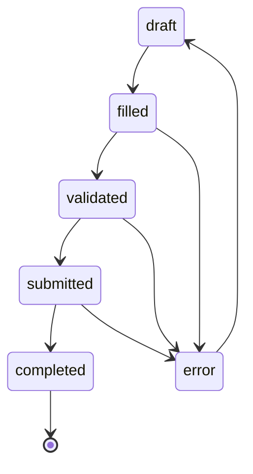

# ADR-0052: Supported validation and testing surfaces

- **Status**: Accepted
- **Kind**: Retrospective
- **Area**: utilities
- **Date**: 2026-07-09
- **Relations**: none

## Context

Two auxiliary packages sit outside LionAGI's primary session and operation surfaces
but are nevertheless public integration contracts: `lionagi.work` and
`lionagi.testing`. Their names can invite broader assumptions than the code supports,
so the shipped boundary and failure behavior must be explicit.

**P1 — Structured inputs need typed, reusable validation without a scheduler.** A
caller needs to declare fields, apply defaults, coerce common scalar/container types,
run ordered rules, and receive all validation errors. None of that requires task
dispatch, worker assignment, or persistence. `FieldSpec`, `WorkForm`, `Rule`, and
`RuleSet` provide the form contract (`lionagi/work/form.py`,
`lionagi/work/rules.py`).

**P2 — `li agent --form` must fail before a model call.** Treating a form as loose
prompt context would allow misspelled or undeclared values to bypass validation. The
CLI therefore owns a stricter closed-schema preflight boundary than direct
`fill_form()` callers: it validates the file shape, declared fields, values, and form
status before it constructs the eventual model invocation (`lionagi/cli/agent.py`).

**P3 — Lifecycle names must not imply a shipped execution engine.** `WorkForm` exposes
`submitted` and `completed` states, but no production submitter, dispatcher, worker
registry, or persistence projection consumes them. The states exist in the public
model; they do not prove a task engine exists.

**P4 — Downstream tests need deterministic coverage of the real Branch/iModel
boundary.** A separate fake Branch protocol would miss request construction,
streaming, structured response parsing, tool-call formatting, endpoint matching, and
copy behavior. `TestBranch` constructs a normal Branch and iModel around a registered
`ScriptedEndpoint`, which serves typed canned responses and records calls without an
external request (`lionagi/testing/_branch.py`,
`lionagi/testing/_endpoint.py`).

**P5 — The testing namespace participates in production endpoint discovery.** The
service registry imports `lionagi.testing._endpoint` so `provider="scripted"` is
selected through the normal endpoint registry. `lionagi.testing.__all__` also
publishes scripted infrastructure, response models, legacy mock helpers, async
helpers, and data loaders. It is not an unversioned repository-local helper directory
(`lionagi/testing/__init__.py`,
`lionagi/service/connections/registry.py`).

| Concern | Decision |
|---------|----------|
| Form data and lifecycle | D1: Keep `FieldSpec` and `WorkForm` as Element-based typed forms whose transitions are explicit but whose `submitted`/`completed` states have no execution semantics. |
| Filling and declarative rules | D2: Fill by declaration/default, coerce declared values, run every enabled rule in insertion order, and return a new validated/error form with collected failures. |
| CLI preflight | D3: Treat `li agent --form` as a closed, fail-before-model validation gate and render only validated values into the prompt preamble. |
| Public testing API and script matching | D4: Support the names in `lionagi.testing.__all__`, with typed script/response shapes, positional or conditional matching, and call inspection. |
| Scripted endpoint integration | D5: Register `provider="scripted"` through normal endpoint discovery and serve non-streaming/streaming/error entries without external I/O. |
| Numeric test and validation bounds | D6: Preserve the regex input cap, endpoint queue/concurrency defaults, scripted delay units, and async-helper budgets as visible defaults. |

This ADR deliberately does **not** decide:

- task scheduling, dispatch, worker execution, queues, or work persistence; no such
  engine exists in `lionagi.work`;
- a production business workflow for `submitted` or `completed`; they are currently
  only model transitions;
- model/provider behavior outside the scripted endpoint;
- pytest's own stability or fixture-discovery rules; this ADR records the shipped
  plugin surface;
- safety for untrusted regular-expression patterns. The rule layer bounds input
  length but still uses Python's backtracking `re` engine with caller-supplied patterns;
- performance guarantees implied by test timeout defaults. They are helper defaults,
  not service objectives.

## Decision

### D1 — Work forms are typed value containers, not work execution

`FieldSpec` and `WorkForm` both inherit `Element`, so they carry the normal Element
identity/metadata contract in addition to the fields below.

**The model contract** (`lionagi/work/form.py`) is:

```python
FieldType = Literal["str", "int", "float", "bool", "list", "dict"]
FormStatus = Literal[
    "draft", "filled", "validated", "error", "submitted", "completed"
]

class FieldSpec(Element):
    name: str
    type: FieldType = "str"
    required: bool = True
    default: Any = None
    description: str = ""

    def coerce(self, value: Any) -> Any: ...

class WorkForm(Element):
    title: str = ""
    fields: dict[str, FieldSpec] = Field(default_factory=dict)
    values: dict[str, Any] = Field(default_factory=dict)
    status: FormStatus = "draft"
    validation_errors: list[str] = Field(default_factory=list)

    @property
    def form_id(self) -> str: ...
    def get(self, name: str, default: Any = None) -> Any: ...
    def field_names(self) -> list[str]: ...
    def is_complete(self) -> bool: ...
    def transition_to(self, new_status: FormStatus) -> WorkForm: ...
```

Both Pydantic models allow arbitrary types, use enum values, populate by field name,
and forbid extra model fields.

The declared transition graph is:



**Exact semantics**:

- A field name must match `[A-Za-z_][A-Za-z0-9_]*`. Invalid names fail Pydantic
  construction with the validator's `ValueError`.
- A non-`None` default must already match the declared Python type, except an `int`
  default is accepted for a `float` field. Defaults are validated when the
  `FieldSpec` is constructed; they are not lazily coerced later.
- `coerce(None)` returns `None`. Existing instances of the target type pass through.
  `int -> float` widens; case-insensitive `true/1/yes` and `false/0/no` strings become
  booleans; numeric strings become `int` or `float`. Other mismatches raise
  `TypeError` containing field, expected type, actual type, and value.
- `form_id` is the string representation of the inherited Element UUID. `get()` is a
  mapping lookup with a default. `field_names()` preserves dictionary insertion order.
- `is_complete()` returns true for `validated` and `completed`, but not `submitted`.
  This is a readiness convenience, not evidence that external work completed.
- `transition_to()` validates only the transition table and returns `model_copy()`
  with the new status. Invalid, repeated, or outgoing-from-completed transitions raise
  `ValueError` and list the allowed destinations.
- The models are immutable by convention, not frozen. Functional helpers return
  copies, but direct assignment remains possible under the underlying Element/model
  configuration.
- No production code in this surface submits a form, marks it completed, dispatches
  it, persists its lifecycle, or resumes it after restart. Restart behavior belongs to
  whichever caller stores a serialized form.

**Why this way**: forms and lifecycle values are useful for validation independently
of execution. Retaining the explicit states preserves the public model while this ADR
refuses to infer components that are absent from source.

### D2 — Filling, coercion, and rules collect failures on new forms

The functional API never mutates the source form:

```python
def fill_form(
    form: WorkForm,
    values: dict[str, Any],
    *,
    ruleset: RuleSet | None = None,
) -> WorkForm: ...

def validate_form(
    form: WorkForm,
    *,
    ruleset: RuleSet | None = None,
) -> WorkForm: ...
```

The declarative rule contract (`lionagi/work/rules.py`) is:

```python
CheckKind = Literal["required", "type", "range", "pattern", "custom"]

class Rule(BaseModel):
    rule_id: str
    field: str
    check: CheckKind
    params: dict[str, Any] = Field(default_factory=dict)
    message: str | None = None
    enabled: bool = True

    def apply(self, form: WorkForm) -> str | None: ...

class RuleSet:
    def add(self, rule: Rule) -> RuleSet: ...
    def remove(self, rule_id: str) -> bool: ...
    def get(self, rule_id: str) -> Rule | None: ...
    def rules(self) -> list[Rule]: ...
    def apply_all(self, form: WorkForm) -> list[str]: ...
```

**Exact fill/validation semantics**:

- `fill_form()` iterates declared fields first. A supplied value wins; otherwise a
  non-`None` field default is copied; a required field with no value/default stays
  absent for validation to report.
- It then propagates every supplied undeclared key unchanged. This direct API is an
  open-value container; only the CLI seam in D3 closes it.
- The helper creates a `filled` copy with prior errors cleared, then immediately calls
  `validate_form()`. It returns `validated` or `error`, not an observable filled-only
  result.
- `fill_form()` and `validate_form()` do not call `transition_to()` and do not require
  the input form to be in a particular status. Their output status is derived from the
  current validation pass.
- A required field is missing when `values.get(name)` is `None`; an explicit `None`
  therefore fails required validation. Non-`None` values are coerced with the field
  contract from D1.
- A ruleset sees a copy containing successfully coerced values. Field errors do not
  short-circuit rules. All rule errors append after field errors.
- Output `values` preserves undeclared inputs and any declared values that failed
  coercion; successful declared coercions replace their original values. Output
  `validation_errors` is the complete collected list for that pass.

**Exact rule semantics**:

- Disabled rules return `None`. `RuleSet.apply_all()` visits every rule in insertion
  order and collects every non-`None` error; it never short-circuits.
- `required` fails only on `None`. `type` skips `None`, supports the six FieldType
  names, and accepts `int` where `float` is expected. An unknown type name returns a
  rule error rather than raising.
- `range` skips `None`, rejects non-numeric values, then applies inclusive `min` and
  `max` bounds when present.
- `pattern` skips `None`, rejects non-strings, applies the D6 input cap, compiles with
  integer `flags`, returns a rule error for invalid regex, and uses `re.search` rather
  than a full match.
- `custom` requires `params["callable"]`. Exceptions raised by the callable are
  converted to an error string; false uses `message`, then `params["error"]`, then the
  generated fallback.
- `RuleSet.add()` returns itself for chaining and raises `ValueError` on duplicate
  `rule_id`. `remove()` returns whether it removed a rule. `get()` returns `None` on a
  miss. `rules()` returns a shallow list copy.

**Why this way**: callers receive one immutable-by-convention result containing
coerced values and all failures, which is better for preflight reporting than
exception-at-first-error. Direct open-value behavior is retained as shipped but must
not be confused with the stricter CLI contract.

### D3 — `li agent --form` is a closed, fail-before-model gate

The CLI accepts a YAML or JSON mapping with exactly these top-level fields:

```yaml
title: optional string
fields:
  field_name:
    type: str | int | float | bool | list | dict
    required: true
    default: null
    description: ""
values:
  field_name: value
```

The implementation contract (`lionagi/cli/agent.py`) is:

```python
_FORM_SPEC_ALLOWED_KEYS = frozenset({"title", "fields", "values"})

def _load_form_spec(path: str) -> dict: ...
def _build_work_form(spec: dict, spec_path: str) -> WorkForm: ...
def _form_to_context_block(form: WorkForm) -> str: ...
```

**Exact semantics**:

- The path must exist and be a regular file. Missing paths raise
  `FileNotFoundError`; non-files raise `ValueError`.
- Loading tries `yaml.safe_load()` first (YAML also accepts JSON), then falls back to
  `json.loads()` only if YAML loading raises. The resulting top level must be a
  mapping.
- Unknown top-level keys are rejected. Present `fields` and `values` must each be
  mappings. Values with absent/empty fields are rejected because they would be
  unvalidated context.
- When fields exist, every value key must have a declaration. Each declaration must
  be a mapping and is constructed as `FieldSpec(name=<mapping key>, **declaration)`;
  invalid field specifications are wrapped in a path/field-specific `ValueError`.
- A `WorkForm` is created and `fill_form()` runs when there are fields or values. Thus
  declared required fields are validated even when the values mapping is empty. A
  completely empty form stays `draft` and contributes no values.
- File/build errors and `status == "error"` are logged and return CLI status 1. This
  happens before `run_async()` constructs the model invocation.
- A non-error form with values is rendered in insertion order as:

  ```text
  [Work Form: <title>]
    <key>: <Python repr(value)>
  ```

  followed by a blank line and the user's prompt. Only this validated form reaches the
  model call.
- The CLI does not currently accept or construct a `RuleSet`; its gate uses
  `FieldSpec` required/type/default behavior. Declarative rules remain a direct Python
  API.

```mermaid
sequenceDiagram
    participant CLI as li agent
    participant Work as lionagi.work
    participant Model as Branch/model call
    CLI->>CLI: load YAML/JSON and enforce closed schema
    CLI->>Work: construct fields; fill and validate values
    alt invalid spec or form
        Work-->>CLI: error(s)
        CLI--x Model: no invocation
    else accepted form
        Work-->>CLI: validated values (or empty draft)
        CLI->>Model: invoke with optional validated preamble
    end
```

**Why this way**: `--form` promises validation, so forwarding undeclared values would
violate the option's purpose. The CLI closes the direct API's open-value behavior at
the external input boundary.

### D4 — `lionagi.testing` is a supported typed scripting surface

Every name in `lionagi.testing.__all__` is part of the supported downstream surface.
The groups are scripted infrastructure/environment helpers, response entry types,
legacy mock builders, async/validation/data helpers, and test-data loaders
(`lionagi/testing/__init__.py`). Pytest fixtures are supplied separately by registering
`lionagi.testing.pytest_plugin`; the plugin itself exports no ordinary names.

**The script contract** (`lionagi/testing/_script.py`) is:

```python
class ScriptModel(BaseModel):
    version: int = 1
    mode: str = Field(default="auto", pattern="^(auto|positional|when_only)$")
    responses: list[ResponseEntry] = Field(default_factory=list)

    @classmethod
    def coerce(cls, source: Any) -> ScriptModel: ...
    @classmethod
    def from_yaml(cls, path: str | Path) -> ScriptModel: ...
    @classmethod
    def from_json(cls, path: str | Path) -> ScriptModel: ...
    @classmethod
    def from_responses(
        cls,
        responses: list[dict[str, Any] | ResponseEntry],
        **kwargs: Any,
    ) -> ScriptModel: ...
    def next(self, payload: dict[str, Any], call_index: int) -> tuple[ResponseEntry, str]: ...
    def reset(self) -> None: ...
```

Script models forbid extra top-level fields. Runtime `_cursor` and
`_served_by_when` are private and absent from serialization.

**The response payload shapes** (`lionagi/testing/_types.py`) are:

```python
class WhenMatcher(BaseModel):
    prompt_contains: str | None = None
    prompt_regex: str | None = None
    has_tool: str | None = None
    after_calls: int | None = None
    call_index: int | None = None

class TextResponse:
    type: Literal["text"] = "text"
    content: str
    when: WhenMatcher | None = None

class ToolCallResponse:
    type: Literal["tool_call"] = "tool_call"
    name: str
    arguments: dict[str, Any] = Field(default_factory=dict)
    id: str | None = None
    when: WhenMatcher | None = None

class StructuredResponse:
    type: Literal["structured"] = "structured"
    data: dict[str, Any]
    when: WhenMatcher | None = None

class StreamResponse:
    type: Literal["stream"] = "stream"
    chunks: list[StreamChunkSpec]
    when: WhenMatcher | None = None

class ErrorResponse:
    type: Literal["error"] = "error"
    kind: Literal["rate_limit", "timeout", "server_error", "bad_request", "value_error"] = "value_error"
    message: str = "scripted error"
    delay_ms: int = 0
    when: WhenMatcher | None = None
```

Response models and matchers forbid extra fields. `StreamChunkSpec.type` is one of
`system`, `thinking`, `text`, `tool_use`, `tool_result`, `result`, or `error`, with
optional content/tool fields, `is_error=False`, `is_delta=False`, and empty metadata.

**Exact loading and matching semantics**:

- `ScriptModel.coerce()` accepts a script model (deep-copied), YAML/JSON path, raw
  response list, or script mapping. Other types raise `TypeError`. Unknown response
  discriminators raise `ValueError`; non-mapping entries raise `TypeError`.
- In `auto` mode, unserved non-empty `when` entries are scanned in source order before
  positional fallback. A conditional entry is served at most once. Positional fallback
  skips conditional entries and advances its private cursor.
- In `positional` mode, conditional matching is disabled and conditional entries are
  skipped by the cursor. In `when_only` mode, absence of a match raises
  `ScriptExhaustedError` without positional fallback.
- `call_index` and `after_calls` are gating conditions. Current content-predicate
  evaluation then uses the first configured predicate in this fixed order:
  `prompt_contains`, `prompt_regex`, `has_tool`; returning success for an earlier one
  does not evaluate later configured predicates. Despite the matcher docstring's
  “AND-composed” wording, multiple content predicates are not currently ANDed.
- Prompt containment is case-insensitive; prompt regex uses `re.search`; tool matching
  compares the exact tool name. A matcher containing only `call_index` or
  `after_calls` can match.
- Exhaustion errors include the call index, available positional count or no-match
  condition, and the last user message when extractable. `reset()` clears both cursor
  and served-conditional state.

**The Branch factory contract** (`lionagi/testing/_branch.py`) is:

```python
def scripted_imodel(
    script: Any,
    *,
    model: str = "scripted-test",
    **imodel_kwargs: Any,
) -> iModel: ...

class TestBranch:
    @staticmethod
    def from_script(script, *, model="scripted-test", name="TestBranch",
                    user="tester", tools=None, system=None, **branch_kwargs) -> Branch: ...
    @staticmethod
    def from_responses(responses: list[dict[str, Any]], **kwargs) -> Branch: ...
    @staticmethod
    def from_text(text: str | list[str], **kwargs) -> Branch: ...
    @staticmethod
    def from_yaml(path: str | Path, **kwargs) -> Branch: ...
    @staticmethod
    def from_json(path: str | Path, **kwargs) -> Branch: ...
    @staticmethod
    def scripted(branch: Branch) -> ScriptedEndpoint: ...
    @staticmethod
    def calls(branch: Branch) -> list[RecordedCall]: ...
    @staticmethod
    def attach_script(branch: Branch, script: Any) -> None: ...
```

The returned normal Branch uses the same scripted iModel for chat and parse. Asking
`TestBranch.scripted()` about a non-scripted Branch raises `TypeError`, which protects
shared tests from accidental external-provider use.

**Why this way**: typed scripts fail early on malformed fixtures, while normal Branch
and iModel construction exercises the production request and response boundaries. A
public export list makes the compatibility obligation explicit.

### D5 — The scripted endpoint uses normal discovery and no external request

The provider registers through the standard decorator
(`lionagi/testing/_endpoint.py`):

```python
@register_endpoint(
    provider="scripted",
    endpoint="chat/completions",
    aliases=["chat", "query_cli", "cli"],
    endpoint_type=EndpointType.AGENTIC,
    base_url="internal",
    auth_type="bearer",
)
class ScriptedEndpoint(AgenticEndpoint):
    is_cli: ClassVar[bool] = True
    DEFAULT_QUEUE_CAPACITY: ClassVar[int] = 10
    DEFAULT_CONCURRENCY_LIMIT: ClassVar[int] = 3

    def __init__(self, config: Any = None, **kwargs: Any) -> None: ...
    def attach_script(self, source: Any) -> None: ...
    def clear_calls(self) -> None: ...
    async def _call(self, payload: dict[str, Any], headers: dict[str, Any],
                    **kwargs: Any) -> dict[str, Any]: ...
    async def stream(self, request: Any, extra_headers: dict | None = None,
                     **kwargs: Any) -> AsyncGenerator[StreamChunk]: ...
```

Service discovery imports the leaf module `lionagi.testing._endpoint` with the other
provider modules. Import failures are ignored consistently with optional providers;
successful import installs the standard registry metadata. `scripted_imodel()` selects
it through `provider="scripted", endpoint="chat"`.

**Exact endpoint semantics**:

- `script=` is removed before base endpoint configuration so it cannot leak into a
  request payload. If absent, `LIONAGI_TEST_SCRIPT` is consulted. A dummy API key and
  `requires_tokens=False` satisfy common endpoint machinery without token counting or
  external authentication.
- No script creates an empty `ScriptModel`, logs a warning when no script/env value was
  provided, and causes the first call to raise `ScriptExhaustedError`.
- Non-stream `TextResponse` becomes an OpenAI-chat-compatible response with assistant
  text, `finish_reason="stop"`, and zero token usage. `StructuredResponse.data` is JSON
  encoded into the assistant content so ordinary Branch parsing handles it.
- `ToolCallResponse` becomes one function tool call; a missing id receives a generated
  `call_...` id and arguments are JSON encoded. A script `StreamResponse` served through
  the non-stream path concatenates only text chunks.
- Streaming a `StreamResponse` yields each mapped `StreamChunk` in order. Streaming a
  text entry yields a text delta and then a done result. Streaming tool/structured
  entries yields one result chunk containing the encoded normal response.
- A scripted error optionally sleeps for `delay_ms / 1000`, records the call, then maps
  rate limit/server/bad request to HTTP-like 429/500/400 `ClientResponseError`, timeout
  to `asyncio.TimeoutError`, and other errors to `ValueError`. The streaming error path
  first yields an error chunk, then raises the mapped exception.
- Every served call appends a `RecordedCall` containing a shallow payload/header copy,
  response type/value, streamed flag, and matching reason. `clear_calls()` does not
  reset the script cursor; `attach_script()` replaces and resets the script.
- Copying endpoint runtime state deep-copies and resets the script cursor for the clone
  and shallow-copies prior call records. Future calls on original and clone do not
  consume each other's positional entries.
- All responses are constructed in process. The endpoint does not invoke an external
  HTTP service; `aiohttp` is used only to construct realistic error objects.

**Why this way**: normal endpoint registration exercises the same discovery, payload,
Branch, parse, stream, and copy paths as other providers. In-process serving keeps the
test deterministic and observable without defining a second fake-Branch interface.

### D6 — Validation and test defaults are explicit, not performance promises

The shipped numerical defaults are:

| Surface | Default | Behavior and rationale |
|---------|---------|------------------------|
| Pattern rule input | 4,096 characters | Longer strings return a validation error before `re.search`. This bounds the input dimension of backtracking but does not make a pathological trusted pattern safe. The exact 4,096 choice has no further recorded rationale. |
| Scripted endpoint queue capacity | 10 | Explicitly mirrors `AgenticEndpoint`; no rationale for exactly 10 is recorded in the scripted endpoint. |
| Scripted endpoint concurrency limit | 3 | Explicitly mirrors `AgenticEndpoint`; no rationale for exactly 3 is recorded in the scripted endpoint. |
| `ErrorResponse.delay_ms` | 0 ms | No artificial delay unless the script supplies one; any supplied integer is divided by 1,000 before `asyncio.sleep`. No maximum is enforced here. |
| `AsyncTestHelpers.assert_eventually` | 5.0 s timeout, 0.1 s interval | Polls until success, then raises `AssertionError` at timeout. Values are inherited testing conveniences with no recorded calibration. |
| `collect_async_results` | 100 items, 10.0 s | Stops at the item limit or soft timeout and returns collected results. It does not raise solely because the timeout elapsed. |
| `run_with_timeout` | 5.0 s | Uses a hard `fail_after` deadline and raises on expiry. |
| `wait_for_all` | 10.0 s | Hard deadline; cancels unfinished tasks and re-raises timeout. |
| Async cleanup grace | 0.01 s | Allows task cleanup before counting remaining tasks; no rationale for exactly 0.01 s is recorded. |

Changing these defaults affects validation acceptance or test timing/concurrency. They
are public defaults but not service-level latency or throughput guarantees.

## Consequences

- CLI callers receive structured input validation without introducing another
  scheduler or persistence model. Invalid form input cannot reach a model call through
  the `--form` path.
- Direct Python callers retain an open-value form container and ordered declarative
  rules. Callers requiring a closed schema must enforce it themselves or use the CLI
  gate.
- `submitted` and `completed` remain valid public statuses, but maintainers must not
  document them as a worker lifecycle until production consumers exist.
- Downstream projects can test normal Branch, iModel, streaming, structured response,
  tool-call, error, and endpoint-copy paths deterministically without external I/O.
- Treating `lionagi.testing.__all__` as supported increases compatibility obligations.
  Moving a symbol, changing a response discriminator, or altering script matching
  requires a deprecation/migration decision.
- Provider discovery has an intentional dependency on one leaf testing module.
  Reorganizing that module can break `provider="scripted"` even when pytest helpers are
  unused.
- The matcher docstring and multiple-content-predicate behavior currently disagree.
  Tests relying on more than one content predicate must account for the implemented
  priority until the delta is resolved.
- Reversing D3 changes an external safety boundary; reversing D5 would require either
  special-case provider construction or a parallel fake runtime. Both are higher cost
  than changing an internal helper.

## Current-vs-ideal delta

| # | Delta | Size | Issue |
|---|-------|------|-------|
| 1 | Decide whether `submitted` and `completed` are reserved compatibility states or remove them from the current WorkForm contract; document the selected lifecycle, test every retained transition, and avoid implying dispatch semantics without an execution engine. | S | (filled at issue-open time) |
| 2 | Publish a compatibility and deprecation policy for every name in `lionagi.testing.__all__`, and add a registry contract test proving that `provider="scripted"` remains discoverable and network-free without requiring pytest fixture imports. | S | (filled at issue-open time) |
| 3 | Make the undeclared-value policy explicit for direct `fill_form()` callers: either reject undeclared keys consistently with `li agent --form` or document and test the direct API as an open-value container. | S | (filled at issue-open time) |
| 4 | Align `WhenMatcher` documentation and implementation: either require all configured predicates to match or document the shipped `prompt_contains` → `prompt_regex` → `has_tool` priority; add a regression test with multiple content predicates. | S | (filled at issue-open time) |

## Alternatives considered

### Describe `lionagi.work` as a task engine

The lifecycle names and “work” package name could support that framing, and future
dispatch components might reuse the models. It lost because no submitter, worker
registry, dispatcher, queue, retry engine, or persistence projection exists. An ADR
must record shipped behavior rather than infer architecture from names.

### Use plain dictionaries for form validation

Dictionary schemas would reduce model classes and Element coupling. They would also
move field-name/default/type validation into every caller and lose the typed lifecycle
and reusable rule API. The current Pydantic/Element models provide one source of truth
for Python and CLI construction.

### Reject undeclared values in `fill_form()` itself

A closed direct API would match the CLI and prevent accidental extra context. It lost
as the retrospective decision because current code deliberately propagates extras and
downstream callers may rely on it. The delta requires an explicit compatibility choice
rather than silently changing behavior in documentation.

### Stop rule evaluation on the first failure

Fail-fast validation is simpler and may avoid expensive later checks. It lost because
the form is a preflight/reporting surface: callers benefit from correcting all field
and rule errors in one pass. Custom rule exceptions are already converted into data,
supporting collection rather than unwinding.

### Use unrestricted regex validation

Removing the 4,096-character cap would avoid rejecting legitimate long values. It
lost because Python's backtracking engine can consume disproportionate time on large
inputs. The current cap bounds one dimension while honestly leaving trusted-pattern
selection to the caller.

### Make `lionagi.testing` internal-only

This would allow aggressive refactors and reduce compatibility commitments. It lost
because the package declares a deliberate export list, provides a documented pytest
plugin, and is imported by normal endpoint discovery. Existing downstream use is a
supported interface, not an incidental repository test helper.

### Build a separate fake Branch protocol

A minimal fake would be faster to construct and easier to control. It lost because it
would bypass real iModel/endpoint matching, payload creation, parse handling,
streaming, action formatting, and copy behavior—the paths this surface exists to test.

### Move `ScriptedEndpoint` immediately into the service package

The production registry dependency would then no longer point into a testing
namespace. It lost for the current retrospective contract because public imports,
environment helpers, pytest fixtures, and endpoint construction all reference the
existing location. Moving it requires a compatibility/deprecation plan, not an
unannounced file relocation.

### Match script conditions with unconstrained callbacks

Python callbacks could express arbitrary request predicates and eliminate the fixed
`WhenMatcher` fields. They would make YAML/JSON scripts non-portable, complicate
serialization, and permit test behavior that cannot be inspected from fixture data.
The declarative matcher remains intentionally small.

## Notes

Primary source anchors for this retrospective record are
`lionagi/work/__init__.py`, `lionagi/work/form.py`,
`lionagi/work/rules.py`, `lionagi/cli/agent.py`, all public implementation modules
under `lionagi/testing/`, and `lionagi/service/connections/registry.py` for the
production registration exception.
