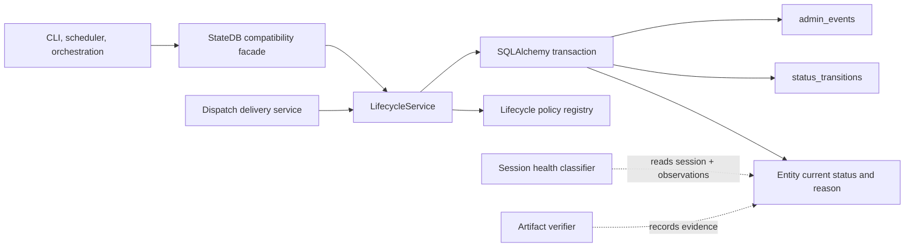
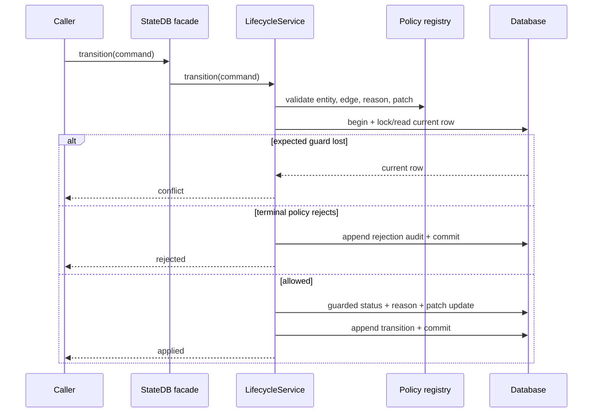

# ADR-0058: Unified lifecycle transition service

- **Status**: Proposed
- **Kind**: Aspirational
- **Area**: persistence-state
- **Date**: 2026-07-09
- **Relations**: supersedes v0-0033; extends ADR-0057

## Context

ADR-0057 records two overlapping transition implementations, incomplete entity coverage, creation
without initial history, split companion-field writes, and status declarations that can disagree
between schema, validator, and transition code. Adding more state machines to those paths would
multiply policy and conflict semantics.

This target answers six concrete problems:

**P1 — Callers need one typed command and one typed result.** Current callers see `bool`, raised
terminal exceptions, or a Pydantic result depending on which path they use. A conflict must have one
meaning regardless of entity.

**P2 — Policy needs one registry.** Table name, vocabulary, terminal set, allowed edges, same-status
behavior, patch fields, and reason namespace currently live in separate constants and database
constraints. A new entity must not become managed by adding only a status column.

**P3 — Creation is part of lifecycle history.** A history that starts at the first mutation cannot
distinguish an entity created in its current state from one whose creation event was lost. Initial
status and initial reason must commit with the entity row.

**P4 — Status-dependent fields must commit atomically.** `ended_at`, lease data, attempt counters,
and error fields can define the meaning of a status. A crash between separate writes must not leave
a terminal row without its terminal timestamp or a pending retry with exhausted accounting.

**P5 — Migration cannot break the `StateDB` facade.** The existing import and method surface is
widely used. Consolidation must happen behind compatibility wrappers and prove semantic parity
before old policy code is removed.

**P6 — Unification must stop at the mutation mechanism.** A session, play, schedule run, and
dispatch have different lifecycle vocabularies and legal edges. Process health is derived from
volatile observations, artifact verification is evidence about output, and dispatch delivery is a
transport lifecycle. Combining those concepts into one stored state object would create false
equivalences.

| Concern | Decision |
|---------|----------|
| Typed service boundary | D1: Introduce immutable Python command/result records and one service protocol. |
| Policy ownership | D2: Register one complete `LifecyclePolicy` per managed entity type. |
| Creation history | D3: Initialize entity status and its `previous_status=NULL` history row in one caller-owned transaction. |
| Transition algorithm | D4: Validate, lock, compare-and-set, patch, audit, and append through one implementation. |
| Compatibility migration | D5: Preserve `StateDB` and adapter surfaces as wrappers with staged parity gates. |
| Domain separation | D6: Unify writes only; keep health, artifact evidence, and per-domain vocabularies separate. |

This ADR deliberately does **not** decide:

- A universal `NormalizedState` read model. The target has no generic health, delivery, severity,
  tone, or policy-version fields.
- Event sourcing or replay of all operational behavior. Entity rows remain the current-state read
  model, and `status_transitions` remains an audit history.
- Dispatch retry/backoff values or transport guarantees. ADR-0059 owns them; this service only
  makes the dispatch status write atomic.
- Session health thresholds or process observation. ADR-0057 D6 remains the diagnostic contract.
- Idempotent transition-command replay. The current adapter's `idempotency_key` is not enforced;
  adding a durable result cache requires its own identity and retention decision.

## Decision

### D1 — Immutable typed command and result records

Introduce one typed lifecycle transition service behind `StateDB`. It owns transition policy and
atomic persistence while preserving per-entity vocabularies.

**The contract.** The target Python-native API is:

```python
from collections.abc import Mapping
from dataclasses import dataclass, field
from typing import Literal, Protocol
from sqlalchemy.ext.asyncio import AsyncConnection

JsonValue = (
    None
    | bool
    | int
    | float
    | str
    | list["JsonValue"]
    | dict[str, "JsonValue"]
)

ActorType = Literal["executor", "agent", "admin", "system", "scheduler", "operator", "webhook"]
TransitionResultKind = Literal["applied", "conflict", "rejected"]

@dataclass(frozen=True)
class ActorRecord:
    type: ActorType
    id: str

@dataclass(frozen=True)
class ReasonRecord:
    code: str
    summary: str = ""
    evidence_refs: tuple[Mapping[str, JsonValue], ...] = ()
    metadata: Mapping[str, JsonValue] = field(default_factory=dict)

@dataclass(frozen=True)
class OverrideRecord:
    actor: str
    justification: str

@dataclass(frozen=True)
class InitialStateCommand:
    entity_type: str
    entity_id: str
    status: str
    reason: ReasonRecord
    actor: ActorRecord

@dataclass(frozen=True)
class TransitionCommand:
    entity_type: str
    entity_id: str
    to_status: str
    reason: ReasonRecord
    actor: ActorRecord
    expected_statuses: frozenset[str | None] | None = None
    expected_version: float | None = None
    patch: Mapping[str, JsonValue] = field(default_factory=dict)
    override: OverrideRecord | None = None

@dataclass(frozen=True)
class TransitionOutcome:
    result: TransitionResultKind
    previous_status: str | None
    current_status: str
    transition_id: str | None

class LifecycleService(Protocol):
    async def initialize_in_transaction(
        self,
        connection: AsyncConnection,
        command: InitialStateCommand,
    ) -> str: ...

    async def transition(self, command: TransitionCommand) -> TransitionOutcome: ...
```

Target modules are:

```text
lionagi/state/lifecycle/
├── __init__.py   public records, protocol, and documented exceptions
├── models.py     immutable command/result/policy dataclasses
├── policy.py     policy registry and built-in policies
├── service.py    SQLAlchemy transaction implementation
└── adapters.py   StateDB and legacy transition compatibility mapping
```

**Exact semantics.**

- Commands are immutable values. The service never mutates caller mappings or fills fields back
  into them.
- `entity_type`, `entity_id`, actor id, reason code, and target status must be non-empty after
  validation. Invalid values raise a documented validation exception before database mutation.
- Evidence is an immutable tuple at the command boundary and becomes a JSON list on persistence.
- `expected_version` is the entity row's `updated_at` float during compatibility. A future integer
  version cannot replace it without an explicit migration because callers may already supply the
  timestamp.
- `applied` returns the previous status, new current status, and non-null transition id.
- `conflict` returns the status observed under lock as both `previous_status` and `current_status`,
  with `transition_id=None` because no history row was written.
- `rejected` returns the unchanged terminal status and `transition_id=None` after the rejection
  audit commits.
- Validation errors and not-found errors are exceptions, not `rejected`. Storage errors propagate
  after rollback; they are not converted into conflicts.

**Why this way.** Immutable dataclasses make the contract inspectable without importing persistence
internals. A three-way result distinguishes expected races from policy refusal and from invalid or
failed operations. Keeping exceptions for invalid commands and storage failure avoids hiding defects
inside a generic false result.

### D2 — One complete policy per managed entity

One registry maps each entity type to its table, vocabulary, initial states, terminal set, allowed
edges, same-status rule, allowed same-row patch fields, and reason-code namespace.

**The contract.**

```python
SameStatusRule = Literal["append", "noop", "reject"]

@dataclass(frozen=True)
class EdgePolicy:
    to_status: str
    actor_types: frozenset[ActorType] | None = None
    required_patch_fields: frozenset[str] = frozenset()

@dataclass(frozen=True)
class LifecyclePolicy:
    entity_type: str
    table: str
    statuses: frozenset[str]
    initial_statuses: frozenset[str]
    terminal_statuses: frozenset[str]
    edges: Mapping[str, tuple[EdgePolicy, ...]]
    same_status: SameStatusRule
    patch_fields: frozenset[str]
    reason_prefixes: frozenset[str]
```

The initial registry contains these policies:

| Entity | Initial | Nonterminal edges | Terminal/recovery rule |
|--------|---------|-------------------|------------------------|
| `session` | `running` | `running -> completed \| completed_empty \| failed \| timed_out \| aborted \| cancelled` | no exit without `override` |
| `invocation` | `running` | same execution graph as session | no exit without `override` |
| `show` | `active`, `imported` | compatibility graph: either nonterminal may move to any distinct declared show status | `completed`, `aborted` require `override` to exit |
| `play` | `pending` | compatibility graph: any nonterminal play status may move to any distinct declared play status | `merged`, `escalated`, `gate_failed`, `blocked`, `aborted_after_finish` require `override` to exit |
| `team` | `active` | `active -> archived` | `archived` requires `override` to exit |
| `schedule_run` | `queued`; compatibility creation also admits `running`, `failed`, and `skipped` | exact graph below | completion statuses have no ordinary exit |
| `dispatch` | `pending` | exact graph below | `dead_letter`/`expired` have operator recovery; other completion states have no exit |

The target schedule-run graph reconciles the shipped schema vocabulary:

```text
queued             -> waiting_dependency | running | skipped | cancelled
waiting_dependency -> queued | cancelled
running            -> completed | failed | timed_out | retry_wait | queued | cancelled
retry_wait         -> queued | cancelled
completed          -> (none)
failed             -> (none)
timed_out          -> (none)
skipped            -> (none)
cancelled          -> (none)
```

The target dispatch graph is:

```text
pending      -> delivering | expired | acked
delivering   -> delivering | pending | delivered | acked | dead_letter | expired
delivered    -> (none)
acked        -> (none)
dead_letter  -> pending  [actor type operator; patch attempt,next_attempt_at,last_error]
expired      -> pending  [actor type operator; patch attempt,next_attempt_at,last_error]
```

`delivering -> delivering` is the crash-recovery claim and requires an equivalent
expected-version/`attempt` guard even though it is a same-status edge — the service refuses the
edge outright without one, so two claimants racing the same pre-claim snapshot can never both win
it. Other same-status commands use the policy's `append` rule and record a reason refresh.

`delivering -> acked` is a deliberate fast-ack: a consumer may present its `ack_token` while the
delivery loop still holds the row mid-tick, and the ack must not have to wait for the row to loop
back to `pending` first. `ack_dispatch()` transitions from whatever status the row currently holds
to `acked`, so a row acked mid-delivery takes this edge rather than round-tripping through
`pending` or `delivered` first.

Allowed patch fields are:

```text
session:      ended_at, input_tokens, output_tokens, total_cost_usd,
              num_turns, duration_ms
invocation:   ended_at
show:         status_source
play:         ended_at, exit_code, merge_sha, merged_at, gate_passed, gate_feedback
team:         (none)
schedule_run: ended_at, exit_code, error_detail, invocation_id, queued_at,
              leased_by, lease_expires_at, lease_attempts
dispatch:     attempt, next_attempt_at, last_error
```

**Exact semantics.**

- Registration fails at startup if entity type or table is duplicated, a terminal/initial value is
  outside `statuses`, an edge references an unknown state, or a required patch field is not in the
  policy allowlist.
- Runtime table and column names come only from registered policy, never from request strings.
- Unknown entity, status, edge, reason prefix, actor restriction, or patch field fails before row
  mutation.
- Show and play initially use a deliberately permissive nonterminal compatibility graph because the
  current implementation enforces vocabulary and terminality but not a finer graph. Tightening
  either graph is a later domain decision, not an incidental service refactor.
- A generic terminal override may bypass an absent outgoing edge only when `OverrideRecord` is
  present and valid. Policy-authorized dispatch retry is an ordinary operator edge, not a generic
  override.
- Same-status `append` writes a new reason/history row. `noop` would return applied without a row
  change only if a future policy selects it; no initial built-in policy does. `reject` is available
  but unused initially.
- Policy objects are frozen after registry construction. Runtime mutation or hot reload is outside
  this ADR.

**Why this way.** The registry becomes the single reviewable answer to “what may this entity do?”
It keeps domain differences explicit while sharing validation and persistence. Compatibility graphs
for organically evolved domains avoid smuggling new workflow restrictions into a mechanical
extraction.

### D3 — Creation writes initial history in the entity transaction

Every newly managed entity writes its initial status and a reason-bearing `status_transitions` row
with `previous_status=NULL` in the same transaction.

**The contract.** Repository creation paths call:

```python
transition_id = await lifecycle.initialize_in_transaction(
    connection,
    InitialStateCommand(
        entity_type="session",
        entity_id=session_id,
        status="running",
        reason=ReasonRecord(code="run.started.ok"),
        actor=ActorRecord(type="system", id="create_session"),
    ),
)
```

The enclosing repository transaction performs:

```text
BEGIN
  INSERT entity row with initial status and current reason fields
  LifecycleService.initialize_in_transaction(...)
    -> validate policy and initial status
    -> assert entity row exists in the same transaction
    -> INSERT status_transitions(previous_status=NULL, status=initial)
COMMIT
```

**Exact semantics.**

- `initialize_in_transaction()` requires an active SQLAlchemy transaction supplied by the owning
  repository. It does not begin or commit independently.
- If entity insertion, initial-history insertion, or policy validation fails, the caller rolls back
  both rows.
- Initialization accepts only a policy's `initial_statuses`; it cannot be used as a shortcut for a
  later transition.
- Repeating initialization for an existing entity is an error. It does not silently return the
  first transition or append a second creation event.
- Existing rows are not assigned fabricated creation events during migration. Their historical gap
  remains truthful; only entities created after cutover receive the invariant.
- The dispatch enqueue path, which already writes an initial transition atomically, is adapted to
  this service without changing its observable row or reason.
- An imported entity may use an explicitly allowed imported initial state and a reason such as
  `legacy.imported`; it must not pretend to have been created by a live executor.

**Why this way.** The repository already owns the transaction that creates the domain row, so an
in-transaction lifecycle hook is the only way to guarantee atomic creation history without moving
all domain construction into a god service. Refusing synthetic backfill preserves audit honesty.

### D4 — One guarded transition algorithm

Every managed transition follows the same validation, lock, conflict, patch, audit, and history
algorithm.

**The contract.**

```text
1. Resolve frozen LifecyclePolicy by entity_type.
2. Validate actor, reason, target, patch keys, and statically checkable edge constraints.
3. BEGIN transaction using StateDB backend discipline.
4. SELECT status, updated_at, and guard/patch fields by id.
   PostgreSQL adds FOR UPDATE; SQLite is already inside BEGIN IMMEDIATE.
5. Missing row -> raise LifecycleNotFound; transaction rolls back.
6. Check expected_statuses and expected_version.
   Mismatch -> return conflict after rollback/no mutation.
7. Validate actual current->target edge and terminal/override rule.
8. Rejection -> INSERT admin_events(status_transition_rejected); commit; return rejected.
9. Override -> INSERT admin_events(status_transition_override) in the same transaction.
10. UPDATE entity status, current reason, allowed patch, updated_at
    WHERE id, previous status, optional expected version, and edge-required guards still match.
11. Zero rows -> return conflict; append nothing.
12. INSERT status_transitions with the same transition id returned to the caller.
13. COMMIT -> return applied.
```

The service publishes these exceptions:

```python
class LifecycleError(RuntimeError): ...
class LifecycleValidationError(ValueError): ...
class LifecycleNotFound(LookupError): ...
class LifecycleStorageError(LifecycleError): ...
```

**Exact semantics.**

- Static validation runs before `BEGIN`; edge validation that depends on current status runs after
  the locked read but before update.
- Conflict never appends transition or admin rows and never applies a partial patch.
- Rejection commits only its admin event. It does not append ordinary transition history because
  current status did not change or refresh.
- Override actor and non-blank justification are mandatory. The ordinary command actor remains in
  transition history; the override actor and justification are retained in the admin event.
- The SQL update reasserts every expected guard. A concurrent write between read and update yields
  conflict even on a backend/path where the row lock was bypassed by an external writer.
- Patch and current reason fields commit in the same update. There is no second bookkeeping
  transaction.
- Evidence and metadata must be JSON-serializable. Serialization failure is validation when
  detected before `BEGIN`, otherwise storage failure; either way no partial transition commits.
- A history insertion failure rolls back the entity update and override audit.
- The service does not catch database cancellation, connection loss, constraint failure, or disk
  errors and report them as `rejected`; callers receive a storage exception with the transaction
  rolled back according to the backend.

**Why this way.** One algorithm makes the difference between invalid, conflicting, rejected, and
failed operations stable. Applying status, reason, companion fields, and history together removes
the crash windows documented in ADR-0057 and ADR-0059.

### D5 — Facade-preserving staged migration

`StateDB.update_status()` and `lionagi/state/transitions.py` remain compatibility wrappers until all
callers use the service. They do not retain independent policy.

**The contract.** Compatibility mapping is:

| Existing surface | Service result | Existing observable result |
|------------------|----------------|----------------------------|
| `StateDB.update_status()` | `applied` | `True` |
| `StateDB.update_status()` | `conflict` | `False` |
| `StateDB.update_status()` | `rejected` | raise existing `TransitionRejectedError` after audit commit |
| `transitions.transition()` | `applied` | `TransitionResult(applied=True, conflict=False, ...)` |
| `transitions.transition()` | `conflict` | `TransitionResult(applied=False, conflict=True, ...)` |
| adapter validation/not found | exception | preserve current `ValueError`/`LookupError` class at wrapper boundary |

Migration phases and gates are:

```text
Phase 1 — introduce lifecycle package and registry
  gate: registry self-validation; no caller behavior changes

Phase 2 — route both existing transition APIs through LifecycleService
  gate: dual-backend contract tests show identical success/conflict/rejection rows

Phase 3 — move companion fields into atomic patch maps
  gate: failure injection cannot observe status without its required companion data

Phase 4 — integrate managed creation paths
  gate: every new managed entity has exactly one previous_status=NULL history row

Phase 5 — migrate direct callers to typed commands; delete duplicate policy constants
  gate: exact-symbol search finds no independent lifecycle SQL or edge vocabulary outside registry,
        schema declarations, migrations, and compatibility adapters
```

**Exact semantics.**

- Wrapper arguments remain accepted during migration, including aliases and the current optional
  timestamp/status guards.
- Default reason inference remains only in compatibility wrappers and continues to warn. New typed
  calls require an explicit `ReasonRecord`.
- The legacy adapter may accept `idempotency_key` for source compatibility, but it is documented as
  correlation-only and is not passed off as durable deduplication.
- No phase rewrites existing transition ids or synthesizes history.
- Policy constants are removed only after both wrappers delegate to the registry; keeping two
  independently editable copies fails the phase-5 gate.
- SQLite and PostgreSQL execute the same behavioral contract tests. SQLite-only success is not
  sufficient for cutover.

**Why this way.** A facade-preserving extraction limits blast radius and allows behavior to be
compared at each seam. Removing duplicate policy last prevents a flag day while still establishing
one eventual authority.

### D6 — Unify mutation mechanics, not domain axes

Per-entity status vocabularies remain distinct. Session health stays a pure, session-scoped
diagnostic. Artifact verification and dispatch transport are not relabeled as generic lifecycle
health or delivery fields.

**The contract.** Architectural boundaries are:





**Exact semantics.**

- The lifecycle service never calls process inspection, scans artifact paths, executes a dispatch
  transport, or computes health.
- The health classifier may read lifecycle status, but its result is not written back as that
  status.
- Dispatch delivery decides *when* and *why* to transition; the lifecycle service decides whether
  the edge and guarded write are valid and atomic.
- Artifact verification may supply evidence references or influence a caller's chosen transition,
  but the service does not reinterpret a verification result as a generic delivery axis.
- Adding a new entity requires a policy and creation integration. Adding a new diagnostic does not
  require widening every lifecycle row.

**Why this way.** The common architecture is the mutation protocol: validation, concurrency,
current reason, history, and audit. Domain interpretation remains with the domain that owns the
status, preventing a universal object from becoming a bag of unrelated optional fields.

## Consequences

- Lifecycle validation, conflict behavior, terminal policy, companion fields, and audit persistence
  become consistent across existing state machines.
- The stable `StateDB` facade limits migration cost, while explicit per-entity policies retain
  domain meaning and make transition graphs directly testable.
- The policy registry becomes a critical shared component. Adding an entity requires a complete
  policy and creation-path integration rather than only a new status column.
- Atomic patches remove known crash windows but make patch allowlists part of the public behavioral
  contract; contributors must update policy and tests when a status gains a companion field.
- The migration temporarily carries wrappers and the new service together. Test surface grows
  during cutover and shrinks only after duplicate policy is removed.
- Reversing D1/D4 after caller migration is expensive because result and failure semantics become
  depended upon. D2 policy data and individual graphs remain replaceable behind the service with an
  explicit domain decision.
- This ADR deliberately gives up a uniform stored “state of everything.” Consumers that need a
  dashboard projection must compose lifecycle, health, artifact, and dispatch views rather than
  treating them as one row.

## Alternatives considered

### Universal `NormalizedState`

Persist lifecycle, health, delivery, severity, tone, evidence, and policy metadata in one model.
This would give UIs a uniform shape and make generic filtering easy. It lost because the axes have
different authorities and clocks: health is a volatile observation, delivery is transport state,
and lifecycle is a guarded domain value. Sparse generic fields would conceal rather than remove
those distinctions.

### Keep the two current transition engines

Let `StateDB.update_status()` handle reason-bearing domain entities and
`transitions.transition()` handle claim-oriented entities. This avoids migration and keeps smaller
modules. It lost because schedule run already belongs to both, and the paths disagree on vocabulary,
edges, guards, patches, idempotency, terminal behavior, and result shape.

### Full event sourcing

Make transition events authoritative and rebuild entity state by replay. This would provide a
single immutable history and powerful temporal reconstruction. It lost because the requirement is
audited current-state transition, not replay of all operational behavior. Existing queries and
indexes rely on current status columns, and migration would be disproportionate.

### Database triggers for transition history

Use triggers to append history whenever a status column changes. This would catch raw SQL writers
and make history difficult to forget. It lost because a trigger cannot reliably infer the typed
reason, actor, evidence, override justification, edge policy, or caller conflict semantics. It would
also duplicate logic across SQLite and PostgreSQL.

### One generic repository owning entity creation

Move all inserts into `LifecycleService.create()`. This could make initial history automatically
atomic. It lost because the service would need every domain's required columns and construction
rules, becoming a god repository. `initialize_in_transaction()` preserves atomicity while leaving
row construction with the owning repository.

### Permissive graph for every entity

Allow any nonterminal value to any declared target and rely only on terminal protection. This would
match much of current behavior and minimize migration failures. It lost as the final target because
session, schedule-run, and dispatch edges are already well-defined and benefit from enforcement.
Compatibility graphs remain temporarily explicit only for show and play, where silently inventing a
stricter workflow would exceed this ADR's evidence.

### Strict graph for show and play during extraction

Infer a minimal legal graph from current call sites and reject every other edge immediately. This
would maximize integrity on day one. It lost because call-site observation is not proof that other
valid operational repairs or imported workflows are forbidden. Tightening those domain graphs
requires a separate decision with owner evidence.

### Return exceptions instead of structured outcomes

Raise on conflict and terminal refusal. This would reduce result variants. It lost because expected
compare-and-set races are routine and should not be indistinguishable from invalid input or storage
failure. `applied/conflict/rejected` is a stable control-flow contract.

### Break the `StateDB` facade and migrate all callers at once

Expose only the new service. This would produce a clean boundary immediately. It lost because the
facade is widely used and the change would combine architecture extraction with a broad caller
migration, making parity defects harder to isolate.

## Notes

This is a target-state ADR. The dataclasses, package, registry, and service named here do not exist
in the current source. Implementation is complete only when the phase gates pass; merely adding the
types without routing all policy and writes through them does not satisfy the decision.
