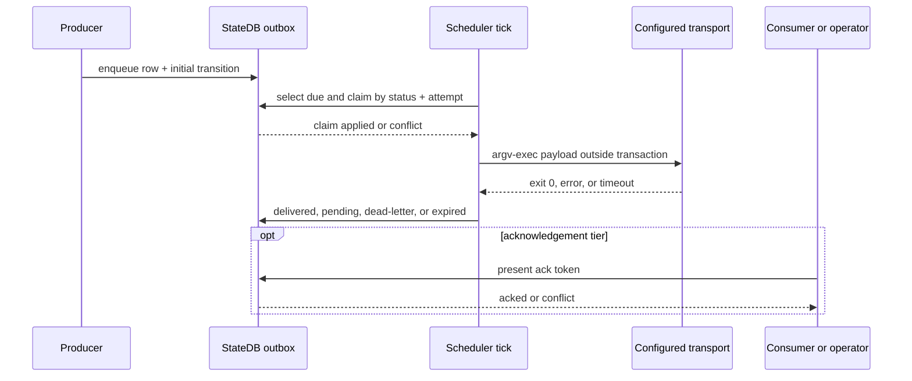

# ADR-0059: Durable dispatch outbox

- **Status**: Accepted
- **Kind**: Retrospective
- **Area**: persistence-state
- **Date**: 2026-07-09
- **Relations**: supersedes v0-0092

## Context

Outbound notifications cannot rely on a consumer being alive when work completes or a schedule
fires. A transport process may be absent, fail, time out, or report success before the destination
consumer has durably processed anything. A notification that exists only in memory disappears when
the producer restarts.

This ADR answers six concrete problems in the shipped dispatch path:

**P1 — Enqueue must survive producer restart.** The producer needs to commit routing, payload,
attempt bounds, acknowledgement policy, and expiry before any transport execution begins.

**P2 — Repeated production needs an idempotency option.** A missed-fire recovery or repeated
heartbeat can submit the same logical notification more than once. When a producer supplies a
deduplication key, it needs the previously committed identity rather than another row.

**P3 — Scans must claim without holding a transport transaction.** The notify command can take up
to ten seconds. Keeping a database transaction open across the subprocess would extend write locks
and still would not make the external effect transactional. A short durable claim plus guarded
attempt counter must establish one claimant for each attempt.

**P4 — Failure and crash recovery need bounded scheduling.** A transport can fail repeatedly, a
claimant can crash, and an expiry can pass. The row needs an inspectable lifecycle, backoff, maximum
attempt count, and a recoverable `delivering` state.

**P5 — Transport success is not consumer acknowledgement.** Exit code zero proves only that the
configured command reported success. Consumers that need end-to-end confirmation require an
optional token and a bounded resend loop.

**P6 — Operators and a surviving scheduler need direct durable control.** Delivery is driven from
the Studio scheduler tick, while inspection, acknowledgement, forced retry, and purge operate
directly on `StateDB` so a daemon outage does not strand administrative action.

The guarantee is producer-driven at-least-once **transport attempt**, not exactly-once delivery or
consumer processing. A crash after an external send and before the final status write can cause the
same stored payload to be sent again after the claim lease expires.

| Concern | Decision |
|---------|----------|
| Stored request and payload | D1: Persist a six-state outbox row carrying a versioned `DispatchSignal` JSON envelope. |
| Enqueue and deduplication | D2: Insert pending row and initial transition atomically; deduplicate only when a key is supplied. |
| Claim and transport execution | D3: Claim by status-plus-attempt CAS, lease briefly, then execute argv outside the transaction. |
| Retry, expiry, and terminal outcomes | D4: Use bounded exponential backoff, maximum attempts, expiry, and dead letter. |
| Optional consumer acknowledgement | D5: Loop successful sends back to pending until token acknowledgement or a bound wins. |
| Scheduler and operator integration | D6: Scan each scheduler tick and expose direct list/show/ack/retry/purge operations. |

This ADR deliberately does **not** decide:

- The delivery guarantees of a configured destination. A notify command is an adapter; its exit
  status cannot prove destination durability.
- A built-in messaging vendor, broker, or protocol. The transport is a configured argv template.
- A separate dispatch database. The outbox participates in existing state transactions and
  references sessions and schedule runs.
- Universal lifecycle policy. ADR-0058 owns consolidation of the temporary transition adapter.
- Retention duration or purge-history policy. The current purge behavior is recorded, and delta 3
  requires the missing decision.

## Decision

### D1 — Durable row and versioned signal payload

`dispatch_outbox` persists the delivery request independently of consumer and producer process
liveness. Its status is a transport lifecycle, not a session or schedule-run status axis.

**The contract.**

```text
dispatch_outbox
  id               TEXT PRIMARY KEY
  kind             TEXT NOT NULL
  deliver_to       TEXT NOT NULL
  payload          JSON NOT NULL
  dedup_key        TEXT NULL
  status           TEXT NOT NULL DEFAULT 'pending'
                   CHECK status IN (
                     'pending', 'delivering', 'delivered',
                     'acked', 'dead_letter', 'expired'
                   )
  attempt          INTEGER NOT NULL DEFAULT 0
  max_attempts     INTEGER NOT NULL DEFAULT 8
  next_attempt_at  FLOAT NOT NULL
  ack_required     INTEGER NOT NULL DEFAULT 0
  ack_token        TEXT NULL
  session_id       TEXT NULL REFERENCES sessions(id)
  schedule_run_id  TEXT NULL REFERENCES schedule_runs(id)
  last_error       TEXT NULL
  created_at       FLOAT NOT NULL
  expires_at       FLOAT NULL
  updated_at       FLOAT NULL

UNIQUE(dedup_key) WHERE dedup_key IS NOT NULL
INDEX(status, next_attempt_at) WHERE status IN ('pending', 'delivering')
```

The payload model is:

```python
SIGNAL_SCHEMA_VERSION: int = 1

class Signal(Element):
    data: Any = None
    emitter_role: str | None = None
    schema_version: int = SIGNAL_SCHEMA_VERSION

class DispatchSignal(Signal):
    dispatch_id: str = ""
    kind: str = ""
    deliver_to: str = ""
    attempt: int = 0
    ack_token: str | None = None
    body: dict = {}
```

Because `Signal` extends `Element`, JSON mode also includes a generated element `id`, `created_at`,
and `metadata` with the concrete `lion_class`. A representative stored payload is:

```json
{
  "id": "<signal UUID>",
  "created_at": 0.0,
  "metadata": {"lion_class": "lionagi.session.signal.DispatchSignal"},
  "data": null,
  "emitter_role": null,
  "schema_version": 1,
  "dispatch_id": "<outbox id>",
  "kind": "terminal_notify",
  "deliver_to": "seat-1",
  "attempt": 0,
  "ack_token": null,
  "body": {}
}
```

The timestamp is generated at enqueue in real payloads; `0.0` above is a shape placeholder, not a
default.

Code anchors: `lionagi/state/schema_meta.py`; `lionagi/session/signal.py`;
`lionagi/dispatch/outbox.py`.

**Exact semantics.**

- Status is constrained by the database to the six listed values.
- `ack_required` is stored as integer 0/1; the current table has no explicit CHECK on that column.
- `attempt` and `max_attempts` have defaults but no non-negative database CHECK.
- `expires_at=NULL` means no time expiry; maximum attempts still bounds delivery.
- `session_id` and `schedule_run_id` are optional provenance links. An ad-hoc dispatch may have
  neither.
- `payload` is produced once at enqueue and is not rewritten when the row's `attempt` increments.
  The serialized `DispatchSignal.attempt` therefore remains `0` on every retry in the current
  implementation; current attempt truth is the outbox column.
- `schema_version=1` changes only on breaking signal field removal or rename; adding nullable fields
  is treated as non-breaking by the signal module's policy.
- A stored payload and route survive process restart as database state. No delivery occurs unless a
  producer process later scans the row.

**Why this way.** The row contains enough state to resume attempts without the original producer.
One stable signal envelope prevents the transport template from changing for each dispatch kind.
Keeping row attempt separate makes claim CAS cheap, though the stale payload attempt is a current
contract limitation maintainers must not overlook.

### D2 — Atomic enqueue with optional deduplication

`enqueue_dispatch()` inserts the pending row and its initial reason-bearing transition in one
transaction. A non-null deduplication key is unique, and re-enqueue returns the existing row id.

**The contract.**

```python
DEFAULT_MAX_ATTEMPTS = 8

async def enqueue_dispatch(
    db: Any,
    *,
    kind: str,
    deliver_to: str,
    body: dict | None = None,
    dedup_key: str | None = None,
    ack_required: bool = False,
    max_attempts: int = DEFAULT_MAX_ATTEMPTS,
    expires_at: float | None = None,
    session_id: str | None = None,
    schedule_run_id: str | None = None,
) -> str: ...
```

The initial transition is:

```text
entity_type:     dispatch
entity_id:       <dispatch id>
previous_status: NULL
status:          pending
reason_code:     dispatch.pending.enqueued
reason_summary:  "enqueued kind=<kind>"
source:          system
actor:           enqueue_dispatch
evidence_refs:   []
metadata:        {}
```

Code anchors: `lionagi/dispatch/outbox.py`; `lionagi/state/reasons.py`;
`lionagi/state/schema_meta.py`.

**Exact semantics.**

- The dispatch id is a full 32-hex-character UUID value. The optional ack token uses the same hex
  representation and is generated only when `ack_required=True`.
- `body=None` and an empty body both serialize as `{}`.
- The signal is serialized with `to_dict(mode="json")` before the transaction.
- With `dedup_key=None`, every call creates a new row even when all other arguments match.
- With a key, the transaction first selects an existing id. A hit returns immediately and writes no
  new row or initial transition.
- A dedup hit does not compare or update kind, route, body, acknowledgement policy, attempt bound,
  expiry, or provenance. The first committed row wins the meaning of that key.
- A miss inserts row and initial transition in one transaction; either both commit or neither does.
- The partial unique index is the final authority for concurrent same-key inserts. The function has
  no explicit integrity-error-to-existing-id retry path if separate PostgreSQL transactions race
  after both miss the preliminary select.
- The function does not reject empty `kind` or `deliver_to` strings and does not validate that
  `max_attempts` is positive. Non-null database constraints reject only `None`/SQL null.
- Default `max_attempts=8` is inherited. The repository records the boundedness purpose but no
  workload-derived rationale for exactly eight sends.

**Why this way.** Enqueue must be durable before execution, and the initial history row makes the
creation reason auditable. Optional deduplication supports producers with a stable logical identity
without forcing unrelated notifications with identical payloads to collapse.

### D3 — Guarded claim, leased recovery, argv-safe execution

Each due row is claimed with a guarded status-and-attempt compare-and-set and a short lease. The
configured process executes after that transaction commits.

**The contract.**

```python
NOTIFY_TIMEOUT_SECONDS = 10.0
_CLAIM_LEASE_SECONDS = NOTIFY_TIMEOUT_SECONDS + 5.0  # 15 seconds

def resolve_notify_template(
    project_dir: str | Path | None = None,
) -> list[str] | None: ...

async def deliver_due_dispatches(
    db: Any,
    *,
    now: float | None = None,
    notify_template: list[str] | None = None,
) -> dict[str, int]: ...
```

Settings shape:

```yaml
dispatch:
  notify_template:
    - command
    - "{deliver_to}"
    - "{payload}"
```

Claim writes atomically:

```text
from status: pending or delivering
to status:   delivering
guard:       attempt == value read by scan
patch:       attempt = old + 1
             next_attempt_at = scan_now + 15 seconds
reason:      dispatch.delivering.attempt
```

Code anchors: `lionagi/dispatch/outbox.py`; `lionagi/state/transitions.py`.

**Exact semantics.**

- A scan selects rows whose status is `pending` or `delivering` and whose `next_attempt_at <= now`.
  There is no row limit or explicit ordering in the current query.
- `counts["attempted"]` increments for every selected row before expiry or claim CAS. Two overlapping
  scans can both count a row as attempted even though only one executes the transport.
- Expiry is checked before claim. An expired due row attempts a guarded transition from its scanned
  status to `expired` and never executes transport in that scan.
- Claiming a stale `delivering` row is a same-status recovery transition. The attempt guard and
  atomic increment ensure two overlapping claimants cannot both win the same attempt.
- A claim conflict skips the row without raising and without transport execution.
- Missing or invalid `dispatch.notify_template` resolves to `None` and is handled as a transport
  failure, not a scheduler crash.
- Template configuration must be a non-empty list of strings. Otherwise it is treated as absent.
- Enqueue validates `deliver_to` as a non-blank string without NUL bytes. Delivery repeats that
  validation for legacy or externally-written rows before executing transport.
- A configured template must contain an exact `{deliver_to}` argv element. Omitting it is a
  destination-configuration failure and follows the same bounded retry/dead-letter path as a
  transport failure; a destination is never silently discarded.
- `{payload}` and `{deliver_to}` are substituted only when an entire argv element exactly equals the
  token. Partial-string interpolation is not performed.
- Execution uses `asyncio.create_subprocess_exec`, never a shell. Shell metacharacters in route or
  payload are inert argv/stdin data.
- If `{payload}` is absent, JSON payload is sent on stdin.
- Stdout and stderr are captured. Exit code zero means only that the transport command succeeded;
  it does not mean a consumer received, committed, or acknowledged the payload. A non-zero result
  uses stripped stderr or `exit <code>` and truncates the stored error to 2,000 characters; no
  rationale is recorded for that exact cap.
- A ten-second timeout kills the subprocess and reports a timeout error. The timeout value is
  inherited without a recorded transport benchmark. The additional five-second claim margin gives
  the live attempt a short window beyond the configured timeout before crash recovery may reclaim.
- No database transaction spans subprocess execution.

**Why this way.** The claim makes attempt ownership durable while avoiding a database lock around an
external command. Whole-argument substitution prevents payload data from becoming shell syntax.
The lease makes a crashed claim recoverable; it cannot make the external effect exactly once.

### D4 — Bounded retry, expiry, delivery, and dead letter

Transport failure retries with bounded exponential backoff. `max_attempts` bounds ordinary failures
and successful-but-unacknowledged sends; `expires_at` is an optional independent bound.

**The contract.**

```python
_BASE_BACKOFF_SECONDS = 30
_MAX_BACKOFF_SECONDS = 1800

def backoff_seconds(attempt: int) -> float:
    return min(30 * (2**attempt), 1800)
```

Delivery returns this exact counter mapping:

```python
{
    "attempted": int,
    "delivered": int,
    "dead_letter": int,
    "expired": int,
    "retried": int,
}
```

The ordinary outcome matrix is:

| Condition after claim | Target | Reason |
|-----------------------|--------|--------|
| command exits 0, no ack required | `delivered` | `dispatch.delivered.transport_ok` |
| command fails, attempts remain | `pending` | `dispatch.pending.retry_backoff` |
| command fails, attempts exhausted | `dead_letter` | `dispatch.dead_letter.max_attempts` |
| expiry reached before claim | `expired` | `dispatch.expired.deadline` |
| no template configured | same as command failure | retry or dead letter by attempt bound |

Code anchors: `lionagi/dispatch/outbox.py`; `lionagi/state/reasons.py`.

**Exact semantics.**

- `delivered` is transport-command success, not consumer acknowledgement. Only an
  `ack_required` row whose token is later presented reaches `acked`; a successful transport for
  such a row returns to `pending` while acknowledgement is outstanding.

- Attempt increments on claim before transport runs. With the standard flow, the first failure uses
  `backoff_seconds(1) = 60`, followed by 120, 240, 480, 960, then the 1,800-second cap. The
  function's 30-second value at attempt zero is not used as the ordinary post-first-attempt delay.
- The 30-second base, 1,800-second cap, and no-jitter choice are inherited; no measured rationale is
  recorded alongside them. The cap bounds delay growth but can align retries from many rows.
- Expiry wins before a new attempt even if attempts remain.
- A row dead-letters when `next_attempt >= max_attempts`. Because positive validation is absent, a
  non-positive `max_attempts` still allows the first claim and then immediately satisfies the bound.
- On failure, `last_error` is updated in its own transaction before the target status transition.
- When attempts remain, `delivering -> pending` commits before a separate transaction updates
  `next_attempt_at` to the full backoff. A crash in between leaves the 15-second claim lease as the
  pending row's due time, allowing an earlier retry than intended.
- A crash after `last_error` but before status transition leaves `delivering`; after the lease it is
  eligible for guarded recovery.
- A crash after external success but before `delivered` can cause a repeated transport execution
  after lease expiry. This is the core at-least-once window.
- Successful transition counters increment only when the guarded transition applies. Transport
  success followed by a transition conflict does not increment `delivered`.
- A historical `last_error` is not cleared by ordinary later success in the current implementation.

**Why this way.** Maximum attempts and expiry make the work finite and observable. Exponential
backoff reduces repeated pressure on a failing adapter. The small multi-transaction bookkeeping
windows are current limitations and are not described as atomic; ADR-0058 plus delta 2 define the
correction.

### D5 — Optional acknowledgement tier

The default tier stops after transport success at `delivered`. The acknowledgement tier returns a
successful send to `pending` until the generated token is presented, expiry wins, or the send bound
is exhausted.

**The contract.**

```python
async def ack_dispatch(
    db: Any,
    dispatch_id: str,
    ack_token: str,
) -> bool: ...
```

Acknowledgement-tier outcomes are:

| Condition | Target | Reason |
|-----------|--------|--------|
| successful send, attempts remain, no ack yet | `pending` with atomic next backoff | `dispatch.delivered.transport_ok` |
| successful send reaches max attempts without ack | `dead_letter` | `dispatch.dead_letter.ack_timeout` |
| consumer presents matching token | `acked` | `dispatch.acked.consumer` |
| expiry reached while pending/delivering | `expired` | `dispatch.expired.deadline` |

Code anchors: `lionagi/dispatch/outbox.py`; `lionagi/state/transitions.py`.

**Exact semantics.**

- An ack-required enqueue stores one generated token in both the row and payload envelope.
- Successful sends awaiting acknowledgement transition atomically to `pending` and patch
  `next_attempt_at` using the same backoff formula. Unlike the failure retry path, this due-time
  patch is in the transition transaction.
- A successful send counts under `delivered` even when its target state is `pending`; the counter
  means successful transport calls, not rows currently in the `delivered` state.
- Maximum attempts applies to successful unacknowledged sends as well as failures. `expires_at` is
  not required for boundedness.
- `ack_dispatch()` raises `LookupError` for a missing row, `ValueError` when acknowledgement was not
  requested, and `ValueError` for a token mismatch.
- After token validation, acknowledgement uses the status read from the row as its CAS source. A
  concurrent status change returns `False`.
- The dispatch adapter enforces the registered closed edge graph
  (`lionagi/state/lifecycle/policy.py:360-399`): `acked` is reachable only from `pending` and
  `delivering`, `dead_letter` and `expired` re-enter `pending` only through an operator-gated
  edge, and `delivered`/`acked` have no outgoing edges. An ack attempt against any other current
  status raises before the CAS runs.
- Tokens are stored in clear text in the state database and shown by the full-row inspection path.
  This ADR treats them as capability values for local operational use, not as hashed credentials.

**Why this way.** Most notifications only need transport acceptance and should not pay an
acknowledgement protocol cost. Opt-in tokens close the consumer-confirmation gap for callers that
need it, while the attempt/expiry bounds prevent a dead consumer from causing infinite sends.

### D6 — Scheduler-driven delivery and direct operator controls

The Studio scheduler invokes the due scan on every tick. `li dispatch` reads and performs guarded
acknowledgement, retry, and purge directly against `StateDB`; no transaction spans user input or
transport execution.

**The contract.**

```python
async def get_dispatch(db: Any, dispatch_id: str) -> dict[str, Any] | None: ...

async def list_dispatches(
    db: Any,
    *,
    status: str | None = None,
    limit: int = 50,
) -> list[dict[str, Any]]: ...

async def retry_dispatch(db: Any, dispatch_id: str) -> bool: ...
async def purge_dispatch(db: Any, dispatch_id: str) -> bool: ...

async def enqueue_revival_heartbeat(
    db: Any,
    seats: list[str],
    *,
    reset_epoch: float,
    ttl_seconds: float = 3600.0,
    max_attempts: int = DEFAULT_MAX_ATTEMPTS,
) -> list[str]: ...
```

CLI surface:

```text
li dispatch ls [--status STATUS] [--limit 50]
li dispatch show ID
li dispatch ack ID TOKEN
li dispatch retry ID
li dispatch purge ID
```



Code anchors: `lionagi/studio/scheduler/engine.py`; `lionagi/cli/dispatch.py`;
`lionagi/dispatch/revival.py`; `lionagi/dispatch/outbox.py`.

**Exact semantics.**

- The scheduler tick interval is 30 seconds. Dispatch scanning is not separately interval-gated;
  the tick is its idle-row latency floor, and `next_attempt_at` limits per-row retries. The 30-second
  value is inherited from the scheduler rather than selected specifically for dispatch.
- A scan error is logged by the scheduler and does not prevent later tick work; the next tick may
  retry.
- `get_dispatch()` returns `None` on miss and decodes payload JSON when the driver returns text.
- `list_dispatches()` orders newest created rows first, optionally filters status, and applies the
  supplied limit. It does not validate status against the six-value set before querying.
- Forced retry accepts only `dead_letter` or `expired`. It atomically transitions to `pending` and
  resets `attempt=0`, `next_attempt_at=now`, and `last_error=None`. A concurrent change returns
  `False`.
- Purge issues a guarded single-row delete and returns whether a row was deleted. It accepts any
  status and writes no purge transition or admin event.
- `status_transitions` has no foreign key to `dispatch_outbox`; purging the outbox row does not
  automatically delete its transition history.
- The CLI has no enqueue command. Producers call the library API.
- Revival heartbeat enqueues one `revival_ping` per seat with
  `dedup_key="revival:<seat>:<reset_epoch>"`, `ack_required=False`, and expiry at reset epoch plus
  the TTL when reset epoch is truthy. A zero reset epoch produces no expiry.
- Revival TTL defaults to 3,600 seconds. No tuning rationale for exactly one hour is recorded.
- Revival enqueue is sequential over the seat list; duplicate seat/key combinations return the
  first row id under ordinary dedup semantics.

**Why this way.** A surviving scheduler is the producer responsible for recovery; a dead consumer
cannot recover the notification intended to revive it. Direct database administration preserves
operability during daemon downtime. Keeping enqueue as a library operation prevents a generic CLI
from becoming an ungoverned notification producer.

## Consequences

- A dispatch survives consumer absence and producer restart as database state.
- Delivery attempts are bounded, reason-bearing, and inspectable; acknowledgement is opt-in.
- The transport remains configuration-driven and argv-safe rather than hard-coded to one tool.
- Delivery latency for a newly due idle row follows the 30-second scheduler tick, plus any database
  or process scheduling delay.
- End-to-end delivery is only as durable as the configured destination. Exit zero means the adapter
  reported success, not that a consumer committed the payload.
- At-least-once transport means consumers or destinations should tolerate duplicates, especially
  across producer crashes after external success.
- Current failure bookkeeping has multi-transaction windows, and the transition adapter lacks a
  closed dispatch edge graph. Both are maintenance costs, not hidden guarantees.
- Reversing D1/D2 requires migrating durable pending work. The transport adapter and retry numbers
  are more easily replaceable so long as row and lifecycle compatibility is preserved.

## Current-vs-ideal delta

| # | Delta | Size | Issue |
|---|-------|------|-------|
| 1 | Route dispatch lifecycle through the unified service in ADR-0058; acceptance requires an explicit dispatch edge graph, the existing attempt guard and lease, and unchanged acknowledgement and retry behavior. | M | (filled at issue-open time) |
| 2 | Make failure bookkeeping atomic with each dispatch transition by applying `last_error`, `next_attempt_at`, attempt counters, and target status in one guarded transaction; acceptance requires crash-injection tests that cannot leave pending rows with stale retry data. | S | (filled at issue-open time) |
| 3 | Define dispatch retention and purge audit semantics; acceptance requires a bounded retention policy, preservation or deliberate removal of transition history, and an auditable operator purge result. | S | (filled at issue-open time) |
| 4 | Verify and document the durability contract required of configured transport destinations; acceptance requires configuration validation and an integration test that distinguishes transport-command success from consumer acknowledgement. | M | (filled at issue-open time) |

## Alternatives considered

### In-memory notification queue

Queue work inside the producer process and retry while it remains alive. This would avoid schema and
polling overhead. It lost because restart loses queued work and a dead producer cannot recover the
notification. Durability is the primary requirement.

### Consumer polling without a producer outbox

Make each consumer poll operational state and infer notifications. This would eliminate outbound
delivery and use consumer-specific recovery. It lost because a dead consumer cannot be responsible
for discovering the notification intended to revive it, and every consumer would duplicate query
and checkpoint logic.

### Extend `schedule_runs`

Represent every dispatch as a schedule run. This would reuse status and scheduler machinery. It
lost because ad-hoc dispatches do not necessarily have a schedule or executable action, and
transport acknowledgement is not a schedule-run lifecycle.

### Separate dispatch database

Put outbox rows in an isolated store. This could reduce contention and permit independent retention.
It lost because enqueue can depend on existing state transactions and references sessions/schedule
runs; another database would introduce cross-store atomicity and operational overhead.

### Hold the database transaction across transport execution

Claim, execute, and finalize inside one transaction. This would appear to make each attempt atomic.
It lost because the external command cannot participate in the database transaction: rollback
cannot unsend a payload. The long transaction would only extend locks and worsen recovery.

### Shell command-string templates

Interpolate route and JSON into one shell string. This would make templates concise and allow pipes
or redirection. It lost because payload-controlled characters would become shell syntax and quoting
would be fragile. Whole argv tokens plus optional stdin are the shipped safety boundary.

### Exactly-once delivery

Guarantee one consumer-visible effect. This would simplify downstream deduplication. It lost because
the configured transport and destination do not share a transaction with `StateDB`; a crash between
external success and local finalization is fundamentally ambiguous. A destination-level idempotency
key can improve a specific adapter but is not implemented generically here.

### Mandatory consumer acknowledgement

Require every dispatch to reach `acked`. This would make delivery semantics uniform and stronger.
It lost because many notifications only need best-effort transport acceptance, and requiring every
destination to implement token callbacks would add unnecessary coupling. The tier remains opt-in.

### Unbounded retries

Keep retrying until success or optional expiry. This would maximize eventual delivery for transient
failures. It lost because no-expiry rows could consume resources forever, especially when transport
succeeds but the consumer never acknowledges. `max_attempts` bounds every path.

### Fixed retry interval

Retry at one constant delay. This would be easy to reason about and avoid long waits. It lost because
repeated failures would maintain constant pressure. Exponential backoff reduces that pressure,
though the current no-jitter schedule may still synchronize rows.

### First-class revival schedule action

Add a dedicated scheduler action kind for heartbeat dispatch. This would make the reference flow
directly configurable. It lost for the current slice because adding an action kind changes the
schedule vocabulary and SQLite compatibility migration. The library call proves the outbox without
expanding scheduler schema.

## Notes

An earlier revision of this record transcribed the pre-registry validator behavior; the unified lifecycle policy registry (`lionagi/state/lifecycle/policy.py`) reconciled the schedule-run and dispatch vocabularies, terminal sets, and edge graphs, and the corrected text above reflects that registry.

`DispatchSignal.attempt` and the row's `attempt` currently diverge after the first claim. Consumers
must use outbox inspection for current attempt count. A future payload rewrite or per-attempt
envelope is a wire-contract change and should not be introduced as an incidental bug fix.
