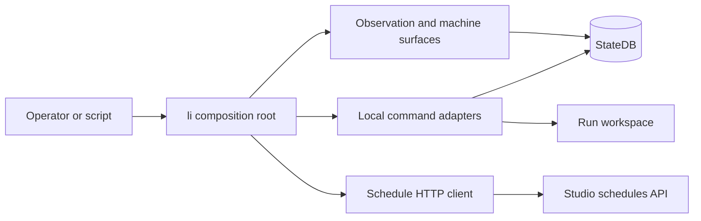

# ADR-0062: CLI command-surface ownership

- **Status**: Proposed
- **Kind**: Retrospective
- **Area**: cli-surface
- **Date**: 2026-07-09
- **Relations**: supersedes v0-0014

## Context

`li` is the public operator entry point, but it is not a single execution layer. The
root in `lionagi/cli/main.py` composes local execution commands, observation and control
commands, compatibility aliases, and clients for services owned elsewhere. That
composition answers five concrete problems.

**P1 — One namespace spans several execution loci.** Agent and orchestration commands
execute work in the CLI process, state and observation commands read local durable
state, `li studio` launches a service, and `li schedule` calls a running Studio service.
The fact that all are spelled `li ...` cannot be taken to mean that all run locally or
have the same availability requirements.

**P2 — Some public syntax must be handled before ordinary `argparse` dispatch.** `li
play` is rewritten to an orchestration flow; `li skill`, `li wait`, agent status, and
the monitor waiter are intercepted. If these forms entered the generic subparser path,
free-form prompts or identifiers would be consumed by incompatible positional slots.

**P3 — Flags and prompts may be interleaved without making prompt text executable
syntax.** Agent, flow, and fanout accept model/prompt positionals around flags. Their
parsers split at `--`, parse only the pre-sentinel portion as options, and fold remaining
tokens back into the query. A prompt token after `--` must never toggle a real CLI flag.

**P4 — Human output and machine output have different compatibility costs.** Tables,
progress, hints, and help are presentation. `li wait`, `li skill`, `li engine run`, and
JSON status modes deliberately give stdout a narrower purpose. Treating every print as
one global output protocol would freeze incidental human presentation or make scripts
depend on it accidentally.

**P5 — Delegation must not erase ownership.** Scheduling is registered at the root but
implemented in `lionagi/studio/cli.py` as an HTTP client for the Studio schedules API.
The CLI owns spelling, parsing, diagnostics, and process exit; the service owns durable
schedule behavior.

| Concern | Decision |
|---|---|
| Canonical operator namespace | D1: `lionagi.cli.main:main` composes and owns the top-level `li` surface. |
| Compatibility routing | D2: ordered pre-parser rewrites and intercepts are part of that same surface. |
| Execution ownership | D3: each command keeps a declared local, observation, launcher, or service-client locus. |
| Parsing and failure behavior | D4: special parser paths preserve sentinel safety and command-specific exit behavior. |
| Output stability | D5: machine-output contracts are explicit per command; no global output mode is inferred. |

This ADR deliberately does **not** decide:

- Agent, fanout, flow, or playbook execution semantics; the orchestration area owns
  those operations, while this ADR records only how the CLI reaches them.
- Fixed workflow and scheduler lifecycle semantics; the scheduling-control-plane area
  owns them, while D3 records the HTTP client boundary.
- StateDB record meaning; ADR-0064 owns the outcome and completion record read by the
  observation commands.
- Studio HTTP endpoint implementation; the CLI contract ends at the request/response
  boundary.
- A new declarative command registry; the lack of one is recorded as a retrospective
  delta rather than described as shipped architecture.

## Decision

### D1 — The root composition function owns the `li` namespace

The canonical process entry is:

```python
# lionagi/cli/main.py
def main(argv: list[str] | None = None) -> int: ...
```

`argv=None` means `sys.argv[1:]`. `main` sets `SIGPIPE` to the platform default,
configures logging, applies pre-parser routing, builds the parser, dispatches, and
returns the command's integer exit code. The module's `__main__` path passes that code
to `sys.exit`.

The shipped top-level composition is:

```text
li
├── pre-parser surfaces
│   ├── skill
│   ├── play
│   ├── wait
│   ├── agent status
│   └── monitor|mon run
└── argparse registrations
    ├── orchestrate|o
    ├── agent
    ├── casts
    ├── engine
    ├── team
    ├── studio
    ├── schedule
    ├── state
    ├── invoke
    ├── kill
    ├── mirror
    ├── monitor|mon
    ├── dispatch
    ├── doctor
    └── stats
```

The registration contract is composition, not implementation co-location:

| Surface | Registration/dispatch anchor | Current execution locus |
|---|---|---|
| `agent` | `lionagi/cli/agent.py`; `add_agent_subparser`, `run_agent` | Local adapter over a provider-backed Branch operation |
| `orchestrate\|o` | `lionagi/cli/orchestrate/__init__.py`; `add_orchestrate_subparser`, `run_orchestrate` | Local orchestration adapter |
| `play` | `lionagi/cli/main.py`; `_handle_play_shortcut` | Compatibility rewrite into `o flow` |
| `skill` | `lionagi/cli/skill.py`; `run_skill` | Local filesystem reader |
| `wait` | `lionagi/cli/wait.py`; `run_wait` | Local durable-state observation |
| `monitor\|mon`, status forms | `lionagi/cli/monitor.py`, `lionagi/cli/status.py` | Local durable-state observation/control |
| `schedule` | `lionagi/studio/cli.py`; `add_schedule_subparser`, `run_schedule` | Studio HTTP client |
| `studio` | `lionagi/studio/cli.py`; `add_studio_subparser`, `run_studio` | Local service launcher |
| Remaining registered commands | Their `lionagi/cli/*.py` modules | Local adapters over their owning state or execution subsystem |

**Exact semantics**:

- With no subcommand, the required root subparser causes `argparse` to terminate with
  usage failure rather than reaching the defensive `parser.print_help()` tail.
- `--version` is owned by the root parser and reports `lionagi.version.__version__`.
- The aliases `o` and `mon` enter the same dispatch branches as `orchestrate` and
  `monitor`; they are not separate applications.
- A command module may own its subcommands and arguments, but root command presence and
  final top-level routing remain `main.py` responsibilities.
- Adding a parser in a module does not publish it: `main` must call the corresponding
  registration function and dispatch its parsed command.

**Why this way.** A single operator namespace keeps discovery and shell automation in
one place while allowing implementation boundaries to follow subsystem ownership.
Moving every behavior into `main.py` would make the composition root a monolith; moving
service-backed commands into a separate executable would fragment the public surface.

### D2 — Compatibility routing runs in a fixed pre-parser order

The order in `main` is a behavioral contract:

```text
1. Read argv; scan -v/--verbose only before the first `--`; configure logging.
2. If argv[0] == "skill", call run_skill(argv[1:]) and return.
3. Pass argv through _handle_play_shortcut; return if it fully handled the call.
4. Intercept `agent status` and call run_agent_status.
5. Intercept `monitor|mon run` and call run_monitor_wait.
6. Intercept `wait` and call run_wait.
7. Build the root argparse tree and inject any playbook-specific flow flags.
8. Parse agent, flow/fanout, and schedule through their standalone special paths.
9. Parse and dispatch every remaining registered command normally.
```

The rewrite contract is:

```python
# lionagi/cli/main.py
def _handle_play_shortcut(argv: list[str]) -> list[str] | int: ...

play NAME [ARGS...]     -> ["o", "flow", "-p", NAME, *ARGS]
play --resume REST...   -> ["o", "flow", "--resume", *REST]
```

`play list`, `play check NAME`, `play status ...`, and playbook-specific help are fully
handled and return an integer instead of rewritten argv.

**Exact semantics**:

- Non-`play` argv is returned unchanged.
- Bare `play` prints usage and returns 1.
- `play list` reads `~/.lionagi/playbooks/*.playbook.yaml`, sorts names, and returns 0
  for a missing or empty directory after printing an explanatory line.
- `play check` validates the playbook and its referenced agent profile without firing
  the playbook; missing names or invalid contracts return 1.
- If NAME precedes flags, it is used directly. If a base flow flag precedes NAME, a
  help-inert probe locates the first bare token. Custom playbook flags before NAME are
  not supported; they must follow NAME.
- `--help`/`-h` after NAME prints playbook-specific help rather than generic flow help.
- `agent status` is intercepted before agent query folding so the word `status` is not
  sent as a prompt.
- `monitor run` is intercepted before the monitor parser's optional `id` consumes the
  word `run`.
- `wait` accepts free-form identifiers without entering the root subparser tree.
- Verbose detection ignores `-v` or `--verbose` after `--`; prompt content therefore
  cannot change logging mode.

**Why this way.** These forms predate or deliberately differ from the generic parser
shape. Ordered interception preserves their syntax while keeping one process entry.
The order is explicit because two handlers cannot safely compete for the same leading
tokens.

### D3 — Command spelling is independent of execution locus

`li schedule` is the concrete service-client case. Its public functions are:

```python
# lionagi/studio/cli.py
def add_schedule_subparser(
    subparsers: argparse._SubParsersAction,
) -> argparse.ArgumentParser: ...

def run_schedule(args: argparse.Namespace) -> int: ...

def _base_url() -> str: ...
def _api(
    path: str,
    method: str = "GET",
    body: dict | None = None,
) -> Any: ...
```

The client exposes `list`, `get`, `limits`, `create`, `enable`, `disable`, `trigger`,
`delete`, and `runs`. Requests target:

```text
{base_url}/api/schedules{path}
```

Base URL precedence is:

1. `LIONAGI_STUDIO_URL`, with trailing `/` removed.
2. Otherwise `http://{LIONAGI_STUDIO_HOST or 127.0.0.1}:{LIONAGI_STUDIO_PORT or 8765}`.

If an explicit URL ends in `/api`, `_base_url` removes that suffix and emits a warning
once per process because endpoint paths already add `/api`.



**Exact service-client semantics**:

- JSON request bodies are UTF-8 encoded and sent with `Content-Type:
  application/json`; bodyless requests omit the header.
- A successful response is read and decoded as JSON.
- HTTP errors print `Error <status>: <response body>` to stderr and yield `None` to the
  subcommand; the subcommand returns 1.
- Connection and other `OSError` failures print a service-unreachable diagnostic to
  stderr, yield `None`, and return 1.
- The stdlib `urlopen` call has a 10-second timeout. The code records no reason for the
  exact value; it is an inherited bound that prevents a CLI client from waiting
  indefinitely on one HTTP request.
- Unknown or missing schedule actions print usage and return 1.
- Root-level schedule parsing uses `parse_known_args`. Every leftover token is reported
  and the command returns 2; dash-prefixed near-misses may include a suggested flag.

**Why this way.** Scheduling state and firing live in a long-running service, but shell
operators still need one discoverable namespace. A thin HTTP adapter preserves that
namespace without duplicating the scheduler in a one-shot process.

### D4 — Special parsing preserves sentinel and error semantics

Agent and orchestration special paths use the same split-and-fold rule:

```text
tail before `--`  -> parse_known_args
unknown dash token before `--` -> parser error
known positionals + non-dash extras + tokens after `--` -> args.query, in order
```

The play flag-before-name probe follows the same boundary. Schedule uses a standalone
parser for diagnostic quality, but does not fold extras because it has no free-form
prompt tail.

**Exact semantics**:

- Unknown pre-sentinel flags for agent/flow/fanout call `parser.error`, which raises the
  standard `argparse` usage exit (2).
- A single `-` is treated as data, not as an unknown option.
- Tokens after `--` are never re-parsed as flags.
- For flow/fanout, the root stamps `command="orchestrate"` and the selected
  `orch_command` before calling `run_orchestrate`.
- Schedule reports every leftover token. Fuzzy suggestions use a 0.6 similarity cutoff;
  the exact cutoff is inherited with no recorded rationale. An explicit synonym map
  handles guesses such as `--every` -> `--interval` before fuzzy matching.
- Parser usage errors remain exit 2. Domain validation normally returns 1. Successful
  handlers return 0 unless their documented outcome contract maps a terminal status to
  another code.

**Why this way.** Standard nested `argparse` parsing cannot safely intermix these
positionals and options, while `parse_intermixed_args` loses the security meaning of the
sentinel between parsing passes. The local split retains standard option validation and
keeps prompt data inert.

### D5 — Output contracts are opt-in and command-specific

There is no root `--json` or universal renderer. A caller may treat stdout as stable
only where the command declares that contract.

| Surface | Current stdout contract | Diagnostics/progress |
|---|---|---|
| `li wait` | Frozen tab-delimited completion lines; ADR-0064 gives the full shape | stderr |
| `li agent status --json`, related JSON status modes | One documented flat JSON object | errors to stderr |
| `li engine run` | Final result as JSON on the normal serialization path | progress/warnings to stderr |
| `li skill NAME` | Skill body after frontmatter, byte content except `print` newline handling uses `end=""` | errors to stderr |
| `li skill show NAME` | Full skill file including frontmatter | errors to stderr |
| Human list/detail/help commands | Presentation only; not a machine contract | command-specific |

**Exact semantics**:

- Human renderers may use tables, hints, progress, or explanatory empty-state lines.
- The root does not capture or normalize handler output.
- `li engine run` catches result-serialization failure, warns, and prints `repr(result)`
  to stdout. Its advertised JSON contract therefore has a current degraded fallback;
  callers needing strict JSON must treat that warning/path as failure to produce the
  machine payload.
- A machine surface that prints incidental diagnostics to stdout violates its own local
  contract; it does not create a new global rule for unrelated commands.
- `li skill` bypasses `argparse`, validates a bare skill name, rejects symlink escapes
  outside `~/.lionagi/skills`, and returns 1 on lookup or shape errors.
- The stable completion line and its exit aggregation belong to ADR-0064, not to this
  composition decision.

**Why this way.** Freezing every human renderer would make routine presentation changes
breaking changes. Explicit local contracts let scripts depend on narrow surfaces while
keeping the rest of the CLI evolvable.

## Consequences

- Operators get one discoverable namespace even when the owning implementation is a
  local adapter, state reader, service launcher, or HTTP client.
- A command can move behind a durable service without necessarily creating a second
  spelling, but doing so must preserve the root's argument, diagnostic, and exit
  contract.
- `main.py` is a compatibility-sensitive composition root. Reordering pre-parser
  intercepts or routing a special form through generic parsing can change behavior
  without changing any command implementation.
- Sentinel-aware parsing prevents prompt text after `--` from enabling real flags, at
  the cost of three specialized parser paths that contributors must test separately.
- Service availability is command-dependent. `li schedule` can fail while local state
  and execution commands remain usable.
- Machine consumers have a small dependable surface, but must not scrape human tables
  or infer a universal JSON mode.
- Reversing D1 would be expensive because shell automation and help discovery assume the
  `li` namespace. Reversing D2 or D4 is moderate but requires byte- and exit-compatible
  characterization tests. Reversing D3 for one command is local if its public syntax is
  preserved.

## Current-vs-ideal delta

| # | Delta | Size | Issue |
|---|---|---|---|
| 1 | Publish a command-ownership registry that classifies every top-level verb as local, service-backed, observation, machine-contract, or compatibility alias; acceptance: automated coverage fails when `lionagi/cli/main.py` registers an unclassified command. | S | (filled at issue-open time) |
| 2 | Extract target resolution and terminal polling from private monitor/status helpers into a neutral CLI query service; acceptance: `wait`, `status`, and `monitor run` use the shared service while their public output remains byte-compatible. | M | (filled at issue-open time) |
| 3 | Resolve the fixed-workflow entry-point gap by either registering `li flow run` or documenting the Studio workflow service as the sole public entry; acceptance: root help, command documentation, and the scheduling-control-plane ADR name the same surface. | M | (filled at issue-open time) |

## Alternatives considered

### Studio-only operator surface

Putting execution and observation exclusively behind Studio would give one service API
and one rendering owner. It lost because one-shot shell automation, local scripting,
and recovery when Studio is not running are current requirements. The `li schedule`
client proves that service ownership can be composed without making the entire operator
surface service-dependent.

### Require every `li` command to execute locally

This would make command availability uniform and avoid the HTTP client distinction. It
lost because scheduling requires a long-lived clock and durable service lifecycle;
duplicating that behavior in the CLI process would create a second scheduler rather
than a simpler interface.

### Separate executable for every subsystem

Separate binaries would make execution ownership obvious and reduce root routing. They
lost because command discovery and shell conventions would fragment, aliases and shared
status handling would multiply, and moving a command between owners would force a public
rename.

### Replace `argparse` with a second declarative CLI framework now

A declarative registry could centralize ownership and output metadata. It lost because
the current surface already has specialized compatibility parsing and no complete
ownership map. Introducing a second registry first would create two authorities; the
delta deliberately calls for an inventory before a framework change.

### Force one global output mode

A root `--json` convention would appear uniform. It lost because many commands return
domain-specific objects or human progress streams, while the existing machine surfaces
already publish narrower shapes. A global switch would either freeze unrelated
renderers or provide deceptively inconsistent JSON.

### Remove the pre-parser compatibility forms

Requiring only canonical `o flow`, generic monitor parsing, and ordinary subparsers
would simplify `main`. It lost because `play`, `wait`, status, and monitor-run spellings
are already public and because generic parsing misclassifies their free-form tokens.

## Notes

The phrase “CLI-primary” in the superseded decision is narrowed here. It means ownership
of the operator interface, not a promise that every command executes locally or without
its owning service.
