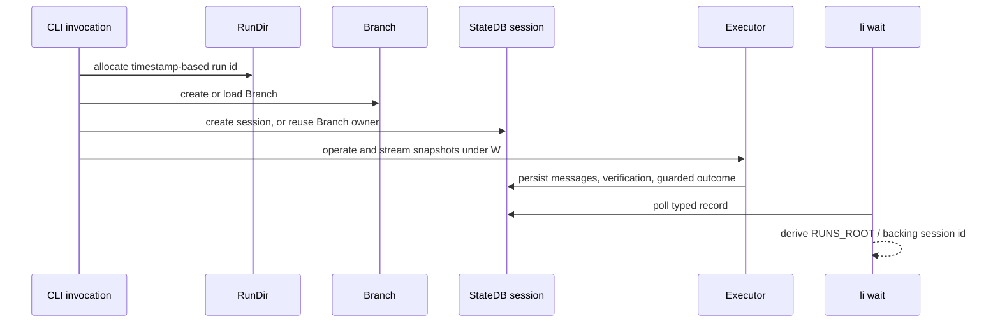

# ADR-0064: CLI execution outcome and completion record

- **Status**: Accepted
- **Kind**: Retrospective
- **Area**: cli-surface
- **Date**: 2026-07-09
- **Relations**: supersedes v0-0029

## Context

CLI execution persists two different kinds of state. StateDB holds sessions,
progressions, terminal status, reason codes, evidence, artifact expectations, and
verification results. `RunDir` in `lionagi/cli/_runs.py` holds branch snapshots, stream
buffers, an optional manifest, an optional flow checkpoint, and the default artifact
directory. A process return code is derived from execution state but is not itself the
durable source of truth.

**P1 — A clean process exit does not prove useful completion.** A provider loop may end
without a commit, artifact, dirty tree, or assistant response. Calling that outcome
`completed` makes automation trust an empty run.

**P2 — Declared deliverables need lifecycle enforcement.** Agent profiles and playbooks
can declare required and optional files. Expectations must be resolved before the work
they govern, persisted, checked at teardown, and reflected in the final reason.

**P3 — Outcome writes can race.** Teardown, cancellation, reconciliation, and repair can
all observe the same row. A stale writer must not move an entity away from a terminal
state or overwrite a different terminal result silently.

**P4 — Scripts need one narrow completion protocol.** Human monitor and status views can
evolve, but a waiter needs stable fields, deterministic ordering, typed success, and no
progress noise on stdout.

**P5 — Several entity kinds participate.** Sessions, flow invocations, show plays, and
scheduled runs have different status vocabularies and different paths to a backing
session. A waiter must use each kind's declared terminal set rather than one guessed
string list.

**P6 — Run workspace identity and StateDB identity are currently split.** Normal agent
execution allocates a timestamp-based `RunDir` id, then creates an independent Session
UUID. `run.json` is written only on the context-import path. `li wait` nevertheless
derives `RUNS_ROOT/<backing-session-id>` without verifying a manifest or directory.

**P7 — Conversation identity can outlive one execution.** Resuming a serialized Branch
reuses its owning session row. If that row is already terminal, the integrity guard
correctly protects the earlier outcome, but the later invocation has no distinct durable
outcome row.

| Concern | Decision |
|---|---|
| File and database roles | D1: `RunDir` stores run-scoped files; StateDB is the authority for durable outcome. |
| Outcome schema and vocabulary | D2: typed entity statuses, reason fields, evidence, exit data, and transition history define the record. |
| Artifact contract | D3: merge declarations by id, validate safe relative paths, snapshot expectations, and verify non-empty files at teardown. |
| Finalization | D4: teardown applies an explicit precedence from execution result through reconciliation, artifact, completion-evidence, and escalation checks. |
| Integrity | D5: `StateDB.update_status` atomically writes status and history with terminal guards and optimistic compare-and-set. |
| Machine completion surface | D6: `li wait` polls durable records and emits one frozen tab-delimited line per resolved terminal target. |
| Known identity/lifecycle limits | D7: Branch reuse, independent workspace ids, and the process-global shared DB registry remain current behavior. |

This ADR deliberately does **not** decide:

- Provider-specific streaming or model retry policy; it records only the outcome
  projected from those paths.
- Orchestration DAG scheduling, play gates, or schedule firing semantics; their owners
  define when their records change status.
- Human monitor/status rendering; only the `li wait` machine line is fixed here.
- Artifact content quality, MIME type, or schema validation; the shipped v1 verifier
  checks path safety and non-empty regular files.
- The future choice between an immutable execution row per resume and an explicit
  multi-leg execution model; D7 and the delta retain that fork.
- A push-backed completion transport; D6 is the shipped polling contract.

## Decision

### D1 — RunDir stores files; StateDB stores the authoritative outcome

The file contract is:

```python
# lionagi/cli/_runs.py
@dataclass(frozen=True, slots=True)
class RunDir:
    run_id: str
    state_root: Path
    artifact_root: Path

    @property
    def manifest_path(self) -> Path: ...       # state_root / "run.json"
    @property
    def checkpoint_path(self) -> Path: ...     # state_root / "checkpoint.json"
    @property
    def branches_dir(self) -> Path: ...        # state_root / "branches"
    @property
    def stream_dir(self) -> Path: ...          # state_root / "stream"
    def branch_path(self, branch_id: str) -> Path: ...
    def stream_buffer_path(self, branch_id: str) -> Path: ...
    def agent_artifact_dir(self, agent_id: str) -> Path: ...
    @property
    def synthesis_path(self) -> Path: ...      # artifact_root / "synthesis.md"
    @property
    def flow_log_path(self) -> Path: ...       # artifact_root / "flow.log"
    @property
    def dag_image_path(self) -> Path: ...       # artifact_root / "flow_dag.png"
    def write_manifest(self, data: dict) -> None: ...
    def read_manifest(self) -> dict: ...
    def ensure_state_dirs(self) -> None: ...
    def ensure_artifact_root(self) -> None: ...

def allocate_run(
    save_dir: str | os.PathLike | None = None,
    run_id: str | None = None,
) -> RunDir: ...
```

Allocation resolves the id as:

```text
explicit run_id
or LIONAGI_RUN_ID
or <UTC YYYYMMDDTHHMMSS>-<first six hex characters of uuid4>
```

It always sets `state_root = RUNS_ROOT / run_id`. `artifact_root` is the expanded,
resolved `save_dir` when supplied and otherwise `state_root / "artifacts"`.

`write_manifest` serializes:

```json
{
  "run_id": "...",
  "state_root": "...",
  "artifact_root": "...",
  "...caller fields": "..."
}
```

The StateDB session projection used by this ADR is:

```sql
-- selected columns from lionagi/state/schema.sql:sessions
id                          TEXT PRIMARY KEY,
progression_id              TEXT,
first_msg_id                TEXT,
last_msg_id                 TEXT,
status                      TEXT,
started_at                  REAL,
ended_at                    REAL,
invocation_id               TEXT,
artifacts_path              TEXT,
artifact_contract_json      JSON,
artifact_verification_json  JSON,
status_reason_code          TEXT,
status_reason_summary       TEXT,
status_evidence_refs        JSON,
updated_at                  REAL
```

**Exact semantics**:

- `allocate_run` creates `branches/` and `stream/`, but does not create the artifact
  directory unless the caller invokes `ensure_artifact_root` or work writes there.
- `agent_artifact_dir` requires a safe path component and verifies containment after
  resolution; an escape raises `ValueError`.
- `read_manifest` returns `{}` when `run.json` does not exist and otherwise propagates
  JSON/read errors.
- A manifest is optional. In current agent execution it is written only when
  `context_from` is supplied. Flow execution uses `checkpoint.json` and stores `run_id`
  in session node metadata, but does not call `write_manifest`.
- StateDB status, reason, evidence, and artifact verification are the authoritative
  outcome when persistence setup succeeded. Branch snapshots, stream termination, and a
  process code alone are insufficient.
- Persistence setup is best-effort. `setup_agent_persist` and orchestration setup catch
  setup failures, close what they can, log a warning, and return `None`; execution may
  continue without a durable outcome. Teardown with `ctx=None` returns the in-memory
  status unchanged.

**Why this way.** Files are appropriate for streams, snapshots, checkpoints, and user
artifacts; a typed database row is appropriate for atomic status, query, and history.
Conflating them would either force large streams into relational rows or make outcome
queries depend on incomplete directory conventions.

### D2 — The durable record has typed status, reason, evidence, and history

Session and invocation valid statuses are:

```python
# lionagi/state/db.py
VALID_SESSION_STATUSES = frozenset({
    "running",
    "completed",
    "completed_empty",
    "failed",
    "timed_out",
    "aborted",
    "cancelled",
})

SESSION_TERMINAL_STATUSES = frozenset({
    "completed",
    "completed_empty",
    "failed",
    "timed_out",
    "aborted",
    "cancelled",
})
```

The entity-specific terminal sets used by the completion surface are:

```python
TERMINAL_STATUSES_BY_ENTITY_TYPE = {
    "session": frozenset({
        "completed", "completed_empty", "failed",
        "timed_out", "aborted", "cancelled",
    }),
    "invocation": frozenset({
        "completed", "completed_empty", "failed",
        "timed_out", "aborted", "cancelled",
    }),
    "schedule_run": frozenset({"completed", "failed", "timed_out", "skipped", "cancelled"}),
    "show": frozenset({"completed", "aborted"}),
    "play": frozenset({
        "merged", "escalated", "gate_failed", "blocked", "aborted_after_finish",
    }),
    "team": frozenset({"archived"}),
}
```

Every applied status write also appends:

```sql
-- lionagi/state/schema.sql:status_transitions
id              TEXT PRIMARY KEY,
entity_type     TEXT NOT NULL,
entity_id       TEXT NOT NULL,
previous_status TEXT,
status          TEXT NOT NULL,
reason_code     TEXT NOT NULL,
reason_summary  TEXT,
evidence_refs   JSON,
source          TEXT NOT NULL,
actor           TEXT,
created_at      REAL NOT NULL,
metadata        JSON
```

Reason codes come from `lionagi/state/reasons.py`. The execution teardown's base mapping
is:

| In-memory status/condition | Durable reason |
|---|---|
| `completed` | `run.completed.ok` |
| `completed_empty` | `run.completed_empty.no_evidence` |
| `timed_out` | `run.timed_out.deadline` |
| `aborted` | `run.cancelled.sigint` in `resolve_run_reason`; other writers may use `run.aborted.user` |
| `cancelled` after external SIGTERM | `run.cancelled.sigterm` |
| other `cancelled` | `run.cancelled.system` |
| exception or generic `failed` | `run.failed.exception` |
| required artifact missing after apparent completion | `run.failed.missing_artifact` |
| undeclared-artifact escalation after apparent completion | `run.failed.escalated` |

The one-shot agent process mapping is:

```python
# lionagi/cli/_util.py
EXIT_CODE_BY_STATUS = {
    "completed": 0,
    "completed_empty": 1,
    "failed": 1,
    "timed_out": 124,
    "aborted": 130,
    "cancelled": 143,
}
```

**Exact semantics**:

- `completed` is the only successful session/invocation terminal status for machine
  aggregation. `completed_empty` is terminal but unsuccessful.
- The current reason is denormalized on the entity row; full history is append-only in
  `status_transitions`.
- Status and history are written in one transaction by D5.
- Evidence is a list of dictionaries. Common fields are `kind`, `id`, `path`, `ref`,
  and optional `label`; storage accepts JSON rather than one rigid Pydantic model.
- `source` must be one of `executor`, `agent`, `admin`, or `system`.
- `li wait` supports session, invocation, play, and schedule-run records. Show and team
  terminal sets exist in StateDB but are not wait-target kinds.
- The terminal and valid-status maps used by `update_status` are sourced from the
  lifecycle policy registry (`lionagi/state/db.py:254-291`,
  `lionagi/state/lifecycle/policy.py:305-320`), which carries the full schema
  vocabulary including `timed_out`, `waiting_dependency`, and `retry_wait`. `li wait`
  reads the same registry-sourced terminal map, so a `timed_out` schedule run is
  recognized as terminal (`lionagi/cli/wait.py:180`).

**Why this way.** A small status vocabulary supports reliable automation, while reason
codes and evidence retain the cause without proliferating statuses. Denormalizing the
latest reason keeps hot reads simple; the transition table preserves audit history.

### D3 — Artifact expectations are merged, validated, snapshotted, and verified

The shipped Python contracts are:

```python
# lionagi/state/artifact_verifier.py
class ExpectedArtifact(TypedDict, total=False):
    id: str
    path: str
    required: bool
    description: str
    source: str

class ProducedArtifact(TypedDict):
    id: str
    path: str
    size: int
    present: bool

class ArtifactContract(TypedDict):
    expected: list[ExpectedArtifact]

class VerificationResult(TypedDict):
    status: Literal["passed", "failed", "warning", "skipped"]
    checked_at: float
    missing_required: list[ExpectedArtifact]
    missing_optional: list[ExpectedArtifact]
    produced: list[ProducedArtifact]

def validate_artifact_contract(contract: dict[str, Any] | None) -> None: ...

def resolve_artifact_contract(
    *,
    playbook_artifacts: dict[str, Any] | None,
    agent_defaults: dict[str, Any] | None,
) -> ArtifactContract | None: ...

def verify_artifact_contract(
    contract: dict[str, Any] | None,
    *,
    artifacts_root: str | None,
) -> VerificationResult | None: ...
```

Resolution iterates agent defaults first and playbook declarations second. Entries are
indexed by `id`; a playbook entry with the same id replaces the agent entry. Defaults
are materialized as:

```python
{
    **raw,
    "required": raw.get("required", True),
    "description": raw.get("description", ""),
    "source": "agent_profile" | "playbook",
}
```

**Validation semantics**:

- `None` is a valid absent contract.
- A present contract must be a dictionary containing `expected: list`.
- Every entry must be a dictionary with a unique id matching
  `^[A-Za-z0-9_-]+$` and a non-empty string path.
- During `resolve_artifact_contract`, repeated ids are collapsed by the intermediate
  dictionary before validation: the later declaration wins, while an overwritten id
  retains its first insertion position. Direct calls to `validate_artifact_contract`
  still reject duplicate ids in the list they receive.
- `required`, `description`, and `source`, when supplied, must be `bool`, `str`, and
  `str` respectively.
- Paths must be relative, non-empty, NUL-free, without glob characters or `..`
  segments, and must resolve under the artifact root.
- Absolute paths and containment escapes raise `ArtifactPathError`.
- v1 recognizes `id`, `path`, `required`, `description`, and `source`. Unknown fields
  are warned about by preflight/runtime validation but are not rejected by
  `validate_artifact_contract`; they do not affect verification.

**Verification semantics**:

- No contract returns `None`; the session verification column remains nullable.
- A required artifact is produced only when its resolved path is a regular file with
  size greater than zero. Directories and empty files count as missing.
- Missing required entries make status `failed`.
- With no missing required entry but at least one missing optional entry, status is
  `warning`.
- Otherwise status is `passed`, including an empty `expected` list.
- Although the TypedDict admits `skipped`, `verify_artifact_contract` itself emits only
  `passed`, `warning`, or `failed`; absence is represented by `None`, not `skipped`.
- A missing/non-directory artifact root marks every expected entry missing, then applies
  the same failed/warning/passed rule.
- Produced entries include id, declared relative path, byte size, and `present=True`.
- `checked_at` is a Unix timestamp from `time.time()`.

**Snapshot timing**:

- A single agent resolves profile defaults before `setup_agent_persist`; the resulting
  contract is stored on session creation before `Branch.operate` starts.
- A flow resolves whole-flow playbook/profile declarations before live persistence.
- Planned leg role defaults are appended once DAG planning resolves roles and before
  node execution begins, then persisted back to `artifact_contract_json`.
- A reactive node's expectation is frozen by its role defaults and spawn id before it is
  queued. Its namespaced entries are appended after that node completes for final
  visibility and teardown verification; this is the shipped reactive-spawn exception.

**Why this way.** Id-based overlay lets a playbook specialize a profile default without
duplicating two expectations. Safe relative paths make the artifact root the trust
boundary. Non-empty file verification is intentionally modest but observable; content
quality belongs to a richer future contract.

### D4 — Teardown computes the final outcome in a fixed precedence order

The finalization entry is:

```python
# lionagi/cli/_runs.py
async def teardown_persist(
    ctx: dict | None,
    *,
    status: str = "completed",
    exception: BaseException | None = None,
    extras: dict | None = None,
    escalated_evidence: list[dict] | None = None,
    cwd: str | None = None,
    engine_session_uid: str | None = None,
    defer_terminal: bool = False,
) -> str: ...
```

`teardown_agent_persist` and `teardown_orchestration_persist` are aliases of this
function. `_teardown_common` applies this order:

```text
1. If defer_terminal, return without any DB mutation.
2. Snapshot progression endpoints, ended_at, and optional metadata.
3. Derive the base status reason from the in-memory status/exception.
4. Resolve and persist artifact verification.
5. For one narrow unclassified ProviderError, reconcile with a linked engine session.
6. Apply missing-required-artifact behavior.
7. If still completed and no artifact was produced, apply completion-evidence gate.
8. If still completed and escalations exist, change to failed/escalated.
9. Apply the guarded status write from D5, or preserve the winner of a race.
10. Unroute hooks, emit SESSION_END unless deferred, detach persistence, release Branch
    ownership, close the owned DB, and sweep the shared DB registry.
```

**Artifact precedence**:

- A failed verification changes `completed` to `failed` with
  `run.failed.missing_artifact` and evidence for the missing required entries.
- If the status is already `failed`, `timed_out`, `aborted`, `cancelled`, or another
  non-completed value, that more specific outcome remains primary. Artifact failure is
  retained in transition metadata as `artifact_verification_status` and
  `missing_required_artifact_ids`.
- Missing optional artifacts never change the execution status.

**Completion-evidence contract**:

```python
# lionagi/state/completion_evidence.py
class CompletionEvidence(TypedDict):
    checked: bool
    ahead_of_base: bool | None
    commits_ahead: int | None
    dirty: bool | None
    base_ref: str | None
    reason: str

def check_completion_evidence(
    cwd: str | None,
    *,
    base_ref: str | None = None,
) -> CompletionEvidence: ...
```

- The gate runs only while the candidate status is `completed` and artifact verification
  did not produce any file.
- A non-empty persisted assistant message is completion evidence for response-only work.
- Git evidence is either at least one commit ahead of a resolved base or a dirty working
  tree.
- Base resolution tries an explicit valid ref, remote HEAD, then `origin/main`,
  `origin/master`, `main`, and `master`.
- A missing cwd, non-Git directory, or failed Git probe yields `checked=False`, meaning
  “no opinion.” It does not demote completion.
- Each local Git subprocess has a 5-second timeout. The source records the reason: these
  probes are local-only and must be cheap; it does not record evidence for why 5 rather
  than another small bound was selected.
- When the check succeeded but found no Git evidence and no assistant output, status
  becomes `completed_empty` with `run.completed_empty.no_evidence`.

**Linked-engine reconciliation**:

- It applies only when candidate status is `failed`, the exception type is exactly
  `ProviderError` (not a subclass), and an engine session uid exists.
- The deterministic linked session id is stored even if its row has not appeared.
- A terminal linked row supplies its status and evidence; a running linked row suppresses
  the phantom failure to `running`; a missing linked row leaves `failed` unchanged.
- Lookup retries default to 3 with a 0.1-second interval after the initial read. The code
  explains the bounded wait—mirror persistence may lag and teardown must never spin
  forever—but records no rationale for the exact count or interval.

**Escalation and resume semantics**:

- Escalated evidence changes only an otherwise `completed` outcome. Any earlier failure
  remains primary.
- Auto-resume after timeout sets `defer_terminal=True` for the first leg. That leg skips
  all DB mutations and `SESSION_END`; the resumed leg owns finalization.
- If finalization itself raises, `teardown_persist` logs the failure and returns the
  original in-memory status; its `finally` block still attempts resource cleanup.

**Why this way.** Outcome checks are ordered from execution fact to increasingly
specific integrity evidence. A later check may demote apparent success but does not
erase a more informative earlier failure. The ordering is part of the contract because
changing it changes which reason scripts and operators see.

### D5 — Status writes are atomic, guarded, and auditable

The universal write contract is:

```python
# lionagi/state/db.py
async def update_status(
    self,
    entity_type: str,
    entity_id: str,
    *,
    new_status: str,
    reason_code: str,
    reason_summary: str = "",
    evidence_refs: list[dict[str, Any]] | None = None,
    source: str = "executor",
    actor: str | None = None,
    metadata: dict[str, Any] | None = None,
    expected_statuses: set[str | None] | frozenset[str | None] | None = None,
    expected_updated_at: float | None = None,
    extra_fields: dict[str, Any] | None = None,
    override: bool = False,
    override_actor: str | None = None,
    override_justification: str | None = None,
) -> bool: ...
```

**Exact semantics**:

- Entity type aliases are canonicalized, reason code and source are validated, and the
  new status must be in that entity type's valid vocabulary.
- A missing target raises `LookupError`.
- If `expected_statuses` is supplied and the current status is not a member, no write or
  transition row occurs and the function returns `False`. A set may contain `None` to
  match SQL NULL.
- If `expected_updated_at` is supplied and the version changed, storage applies no
  write and the function returns `False`.
- The SQL `UPDATE` reasserts the previously read status, including NULL-safe equality,
  so the compare-and-set is enforced at storage rather than only in Python.
- A terminal status may receive a same-status write. Changing a terminal value without
  override is rejected, recorded in `admin_events` as
  `status_transition_rejected`, committed, and then raised as
  `TransitionRejectedError`.
- `override=True` requires both `override_actor` and `override_justification`; a repair is
  recorded as `status_transition_override` before the status/history write.
- `extra_fields` is closed per entity type. Sessions currently allow `ended_at` so it can
  commit atomically with status.
- An applied write updates the entity's status, current reason, evidence, optional extra
  fields, and `updated_at`, then inserts one transition row in the same transaction.

Teardown supplies `expected_statuses={pre_write_status}`. Its race handling is:

- If its own snapshot was already terminal, it skips the write and returns this
  invocation's computed status, logging when that status differs from the durable row.
  Non-status teardown updates performed before that check—such as `ended_at` and artifact
  verification—may already have changed the reused row; terminal immutability guards the
  status value, not the whole session record.
- If the guarded write loses a race, it reads and returns the persisted winner.
- If the row becomes terminal between snapshot and write, it catches
  `TransitionRejectedError`, reads, and returns the persisted winner.

**Why this way.** Terminal records must be trustworthy. Compare-and-set prevents stale
writers from winning silently, while a deliberate repair path remains possible and
audited. Requiring all status writers to share one function keeps denormalized current
reason and append-only history consistent.

### D6 — `li wait` is the frozen machine completion surface

The reusable and CLI contracts are:

```python
# lionagi/cli/wait.py
async def wait_for_terminal(
    ids: list[str],
    *,
    interval: float = 1.0,
    on_result: Callable[[dict[str, Any]], None] | None = None,
    should_stop: Callable[[], bool] | None = None,
) -> list[dict[str, Any]]: ...

def format_wait_line(outcome: dict[str, Any]) -> str: ...
def run_wait(argv: list[str]) -> int: ...
```

The outcome dictionary is:

```python
{
    "run_id": str,
    "kind": "session" | "invocation" | "play" | "schedule_run" | None,
    "status": str,
    "reason": str,
    "artifact_dir": str | None,
    "exit_code": int | None,
    "success": bool,
}
```

Each resolved terminal record prints exactly:

```text
<canonical_id>\tstatus=<terminal_status>\treason=<reason_code-or-unknown>\tartifact_dir=<path-or->\texit_code=<number-or->
```

**Resolution semantics**:

- Input accepts space- or comma-separated ids, trims empty pieces, preserves first
  occurrence order, and deduplicates.
- Resolution order is session, invocation, play, Branch-to-owning-session fallback,
  then schedule run.
- Session/invocation/play/Branch lookups use exact match for ids of length at least 36
  and `LIKE '<prefix>%'` otherwise. Schedule runs try exact id then prefix because their
  ids are shorter.
- Prefix ambiguity is not detected; the database's first matching row wins.
- A target missing at initial resolution becomes `status=not_found`, is reported to
  stderr, and does not print a contract line.
- A row deleted after resolution becomes `status=unknown`, ends its wait, and prints a
  contract line with `reason=unknown`, artifact `-`, and exit code `-`.

**Polling semantics**:

- Already-terminal rows complete immediately. Remaining rows are refetched once per
  tick until they enter the exact D2 terminal set.
- `on_result`, when present, is called once when each target resolves terminal/unknown
  or is initially not found.
- Result list order follows input order, not completion order. The CLI prints through
  `on_result`, so lines appear as targets finish.
- The default interval is 1.0 second. The source records no empirical reason for the
  exact value; it is the inherited polling cadence.
- `li wait` has no maximum wait. It may block indefinitely while a record stays in a
  nonterminal or unrecognized status. Interrupt handling returns the running exit class.
- `should_stop` is checked between ticks by importable callers; `run_wait` instead uses
  the concurrency runner's SIGINT/SIGTERM handling.

**Projection semantics**:

- A reason code is emitted only when it belongs to `VALID_REASON_CODES`; absent or
  unrecognized values become the literal `unknown`.
- Session artifact directory is always derived as `RUNS_ROOT / session.id`.
- Invocation uses its most recently updated backing session; play uses `session_id`;
  schedule run follows `invocation_id` to that invocation's most recently updated
  session.
- The derived path is returned whether or not it exists and whether or not `run.json`
  exists. A target without a backing session uses `-`.
- Success is `completed` for session/invocation/schedule run and `merged` for play.
  `completed_empty` is unsuccessful.

**CLI exit and stream semantics**:

| Condition | Exit |
|---|---|
| Every target resolved and successful | 0 |
| Every target resolved, at least one terminal unsuccessful | 1 |
| Any not found or deleted/unknown | 2 |
| Interrupted or fewer outcomes than requested | 3 |

- A missing StateDB returns 2 after a stderr diagnostic.
- Contract lines are stdout-only. Diagnostics are stderr.
- Parser usage failures remain standard `argparse` exit 2.

**Why this way.** Polling works against the current durable store without another
service. A five-field line is easy to parse in POSIX tools and isolates scripts from
human dashboard changes. Kind-specific terminal and success sets preserve semantic
differences rather than pretending every record uses `completed`.

### D7 — Conversation, execution, workspace, and DB lifecycle are not yet unified

The current agent sequence is:



**Exact identity semantics**:

- Normal new agent execution creates a `RunDir` before
  `setup_agent_persist`; the latter creates a new `Session` UUID. There is no assignment
  making those ids equal.
- The session stores `artifacts_path` pointing at the actual RunDir artifact root, but
  it does not store the RunDir state root as a dedicated column.
- The context-import path writes `run.json` containing Branch/context metadata. Ordinary
  new, resumed, and orchestration paths do not write that manifest.
- Flow stores its RunDir id in session `node_metadata.run_id`, and resume metadata can
  carry `resumed_from`; `li wait` does not consult those fields.
- A resumed Branch found in StateDB reuses its existing session and progressions. No new
  execution row is created.
- If the reused session is already terminal, teardown does not overwrite it. The caller
  receives the later invocation's computed in-memory status, but that status is not
  persisted as a separate durable outcome.

**Exact shared-DB lifecycle semantics**:

- Live persistence opens a StateDB and registers it in a process-global map keyed by
  normalized database URL so hooks reuse the same connection.
- Registering a different instance for the same URL closes the prior instance.
- Teardown closes its owned DB and calls `close_shared_db`, which closes and clears every
  registered shared instance, increments a generation, and prevents a waiter on the old
  lock from resurrecting the registry.
- This suits one-shot CLI ownership. Concurrent long-lived work sharing a process can
  close another run's handle; the lifecycle-owned-scope delta remains open.

**Why this way.** Branch reuse made conversation resume simple, and run directories
evolved independently for snapshots. The terminal guard then exposed that conversation
and execution are different identities. This ADR records the split honestly rather than
claiming the derived path or reused row is a complete execution model.

## Consequences

- Machine consumers can distinguish clean completion, empty completion, missing
  artifacts, timeouts, cancellation, and other typed outcomes from durable state.
- Required artifacts are enforced at teardown; optional misses remain visible without
  turning an otherwise successful run into failure.
- Status records resist stale and concurrent writers, and operational repair remains
  possible with an audit trail.
- The frozen completion line gives scripts a narrow stable surface and leaves human
  tables free to evolve.
- Persistence setup and teardown are best-effort around execution. A run can finish with
  no durable record if setup failed, and teardown failure can leave an older status.
- The synthesized `artifact_dir` may not exist and may not be the actual RunDir state
  root. Consumers must treat it as a candidate path, not manifest proof.
- Resumed conversations can produce an in-memory outcome that has no distinct durable
  execution record because the earlier session is already terminal.
- Polling is simple but unbounded. Vocabulary drift, including the current schedule-run
  `timed_out` gap, can leave a waiter running indefinitely.
- Reversing artifact overlay or outcome precedence changes which reason is authoritative
  and needs migration/compatibility review. Reversing terminal immutability is high cost
  because every automation consumer relies on stable final records. Replacing the wait
  line is a breaking shell contract.

## Current-vs-ideal delta

| # | Delta | Size | Issue |
|---|---|---|---|
| 1 | Bind every CLI execution to one persisted run id and workspace, write a minimal manifest before streaming, and store the workspace link on the execution record; acceptance: `li wait`, monitor tails, context import, and state import resolve the stored link and never synthesize an unverified path. | M | (filled at issue-open time) |
| 2 | Separate reusable conversation branches from immutable execution outcomes; acceptance: every manual resume creates or deliberately appends to a modeled execution record, and its final outcome is persisted before the command returns an exit code. | M | (filled at issue-open time) |
| 3 | Introduce a lifecycle-owned persistence scope for CLI and Studio execution; acceptance: one-shot cleanup retains its connection/thread reclamation tests while concurrent long-lived runs cannot close one another's StateDB handle. | M | (filled at issue-open time) |
| 4 | Align the schedule-run schema, `VALID_STATUSES_BY_ENTITY_TYPE`, and `TERMINAL_STATUSES_BY_ENTITY_TYPE`; acceptance: every schema-valid terminal schedule status, including `timed_out`, is writable through `update_status` and causes `li wait` to terminate with the documented success/failure class. | S | Resolved on main (`lionagi/state/lifecycle/policy.py`) |

## Alternatives considered

### Filesystem-only completion

Treating a branch snapshot, `run.json`, or artifact directory as the outcome would make
recovery independent of StateDB. It lost because manifests are optional, workspace and
session ids differ, and files do not carry the typed terminal reason, compare-and-set
history, or entity-kind status vocabulary.

### Process exit code as the durable truth

Exit codes are easy for shell callers and already map from agent statuses. They lost as
the authority because the process code has no artifact verdict or evidence, cannot be
queried later, and cannot represent a still-running linked engine session. Exit remains
a projection of the durable/in-memory outcome.

### Reopen terminal session rows on resume

Moving an old row from terminal back to running would let later resume outcomes reuse
the same storage. It lost because it destroys the meaning of a terminal record, creates
race ambiguity, and makes historical success/failure depend on the latest conversation
turn.

### Force workspace id to equal conversation/session id without a migration model

This would make the current `li wait` path derivation true. It lost as an immediate fix
because Branch/session reuse spans multiple invocations and a flow already records a
separate RunDir id. Choosing equality before separating execution identity would merely
move the collision.

### Mutable artifact expectations throughout execution

Allowing agents to add required files at teardown would support dynamic deliverables.
It lost because requirements could be changed after observing output, making failure
non-reproducible. Planned and reactive declarations are frozen before their respective
work; later persistence only exposes already-frozen expectations.

### Missing optional artifact fails the run

This would make every declaration strict. It lost because `required=False` would have no
meaning and informative optional outputs would become unsafe to declare. Optional misses
produce a warning verification while preserving outcome.

### Allow terminal overwrites and rely on last writer wins

This would simplify storage and let repair reuse ordinary writes. It lost because stale
teardown or cancellation could silently rewrite a trustworthy final state. The explicit
audited override is a small cost for preserving terminal integrity.

### Push-only completion notification

An event stream could remove one-second polling latency and unbounded database reads. It
lost for the shipped contract because it requires a live broker/service and does not
replace durable recovery after disconnect. A future push mode can reuse the same outcome
shape and line while StateDB remains authoritative.

### New execution row per resumed turn versus one multi-leg execution

Both solve the D7 durability gap. A new row gives immutable turn-level outcomes and
simple terminal semantics; a multi-leg record preserves one user-visible execution with
explicit leg history. Neither is selected in this retrospective ADR because the source
implements neither representation. The delta requires a separate decision before code
changes.

## Notes

An earlier revision of this record transcribed the pre-registry validator behavior; the unified lifecycle policy registry (`lionagi/state/lifecycle/policy.py`) reconciled the schedule-run and dispatch vocabularies, terminal sets, and edge graphs, and the corrected text above reflects that registry.

The current `artifact_dir` field name is historical and stronger than its implementation:
it is a derived run-directory candidate, not the session's stored `artifacts_path` and
not evidence that `run.json` exists. That mismatch is retained until the persisted
workspace-link delta is implemented.
