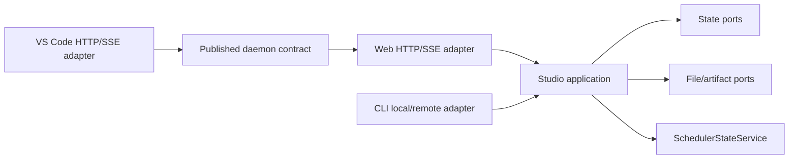

# ADR-0078: Studio application-service boundary

- **Status**: Proposed
- **Kind**: Aspirational
- **Area**: studio
- **Date**: 2026-07-09
- **Relations**: extends ADR-0076 and ADR-0077

## Context

Studio's current service modules are effective HTTP endpoints but weak application
boundaries. They combine FastAPI adaptation, Pydantic bodies, validation, raw SQL,
filesystem access, subprocess/scheduler calls, and product decisions. The web client, VS
Code extension, and `li schedule` client then reproduce parts of the same contract in
TypeScript or `urllib` code.

This aspirational ADR answers six implementation problems without claiming its target is
already shipped.

**P1 — Application behavior cannot be reused without HTTP.** Listing runs, saving a file
definition, mutating a schedule, and resolving an artifact are currently functions near
route handlers, but their error mapping and persistence choices remain transport-aware.
The CLI either duplicates validation or calls the daemon even when an in-process service
would suffice (`lionagi/studio/services/*.py`; `lionagi/studio/cli.py`).

**P2 — Validation has more than one owner.** Schedule payload rules are parsed in the
daemon and again in `li schedule`; the CLI validates recursive chain actions against
scheduler-private limits. Workflow compilation imports execution metadata rather than a
published application contract (`schedules.py`; `cli.py`; `workflow_compile.py`).

**P3 — Persistence differences are hidden behind shared nouns.** Some services call
StateDB, some execute SQL, project routes issue DDL, file definitions are DB-first/file-
second, and workflow definitions are DB-current. A generic repository would erase rather
than solve those differences (ADR-0077).

**P4 — Scheduler integration can leak engine mechanics upward.** Studio must create,
enable, disable, and inspect schedules, but application code should not own firing loops,
leases, overlap, or worker recovery. The existing `SchedulerStateService` is the proper
narrow persistence seam (`scheduler_state.py`).

**P5 — Two clients independently encode a public daemon contract.** The web and VS Code
clients each know trailing slashes, response fields, bearer headers, and SSE parsing. A
route change can break one client while the Python service and the other client continue
to run (`apps/studio/frontend/src/lib/api.ts`; `apps/vscode/src/api/*`).

**P6 — A flag-day repository rewrite would amplify risk.** The daemon currently has 96
registered API routes. Moving every query at once would mix architectural migration with
behavior changes and make compatibility regressions difficult to attribute.

| Concern | Decision |
|---|---|
| Package boundary | D1: Introduce `lionagi.studio.application` between transports and state. |
| Command/query contract | D2: Publish typed, transport-independent request/result models and one explicit error taxonomy. |
| Persistence ports | D3: Use capability-shaped StateDB and filesystem ports; keep file and workflow definitions separate. |
| Scheduler boundary | D4: Submit and inspect schedules through application services backed by `SchedulerStateService`. |
| Client compatibility | D5: Make OpenAPI plus behavior fixtures the versioned contract for web, CLI, and VS Code adapters. |
| Migration quality | D6: Migrate operation-by-operation, keep coupling below 0.3, and require fake-port and cross-client tests. |

Out of scope:

- Replacing StateDB or changing its schema solely to satisfy this layering decision.
- Redefining scheduler firing, budget, lease, retry, or worker semantics.
- Building the unified execution UI in ADR-0081 or the operator protocol in ADR-0083.
- Introducing a general event bus, ORM repository framework, dependency-injection
  container, or network service separate from the Studio daemon.
- Converging file-backed agent/playbook definitions with database-backed workflow
  definitions; that requires a later migration decision.

## Decision

### D1 — `lionagi.studio.application` is the reusable boundary

The target module tree is:

```text
lionagi/studio/
├── application/
│   ├── __init__.py          # public re-exports only
│   ├── errors.py            # closed application error taxonomy
│   ├── models.py            # shared ids, pages, command/query/result models
│   ├── runs.py              # run queries
│   ├── definitions.py       # file-definition commands/queries
│   ├── workflows.py         # DB workflow-definition commands/queries
│   ├── schedules.py         # schedule commands/queries
│   ├── artifacts.py         # metadata + safe content resolution
│   ├── projects.py          # project commands/queries
│   └── ports.py             # capability protocols
├── services/                # FastAPI adapters; no DDL or domain policy
├── scheduler/               # firing/lease/worker mechanics
├── registry.py
└── app.py
```

The composition root constructs application services once and makes them available to
route dependencies and in-process CLI adapters. Application modules may import StateDB data
types and the narrow ports below. They do not import FastAPI, Starlette, VS Code/web types,
or CLI parser namespaces.

Dependency direction is:



Exact semantics:

- A route parses HTTP input, calls exactly one application operation, and maps its result or
  application error. It does not execute DDL, open `aiosqlite`, or choose a file path.
- An in-process CLI calls the same operation directly. A remote CLI serializes the same
  request model through the versioned HTTP adapter.
- Application services are async because StateDB, filesystem thread offload, and scheduler
  calls are async from the caller's perspective.
- Import cycles from application modules back into `services` are forbidden. Compatibility
  adapters may call old service functions only during a bounded migration and must be named
  `legacy_*` so the dependency can be removed mechanically.

Why this way: the boundary corresponds to operator use cases, not tables. It permits reuse
and fake-port tests while keeping the running FastAPI daemon as one deployment unit.

### D2 — Typed commands, queries, results, and failures

The target base models are Python-native Pydantic models:

```python
from typing import Generic, Literal, TypeVar
from pydantic import BaseModel, ConfigDict, Field

T = TypeVar("T")
JsonValue = str | int | float | bool | None | list["JsonValue"] | dict[str, "JsonValue"]

class ContractModel(BaseModel):
    model_config = ConfigDict(extra="forbid", frozen=True)

class Page(ContractModel, Generic[T]):
    items: tuple[T, ...]
    offset: int = Field(ge=0)
    limit: int = Field(ge=1)
    has_next: bool

class RunQuery(ContractModel):
    status: tuple[str, ...] = ()
    playbook: str | None = None
    project: str | None = None
    project_is_null: bool = False
    tags: tuple[str, ...] = ()
    offset: int = Field(default=0, ge=0)
    limit: int = Field(default=20, ge=1, le=5000)

class RunSummary(ContractModel):
    run_id: str
    status: str
    effective_health: str | None
    playbook_name: str | None
    agent_name: str | None
    invocation_kind: str | None
    invocation_id: str | None
    project: str | None
    started_at: float | None
    ended_at: float | None
    updated_at: float | None
    branch_count: int = 0
    message_count: int = 0
    status_reason_code: str | None = None
    status_reason_summary: str | None = None

class SaveDefinition(ContractModel):
    kind: Literal["agent", "playbook"]
    name: str = Field(min_length=1)
    content: str
    message: str | None = None
    expected_version: int | None = Field(default=None, ge=0)

class SaveResult(ContractModel):
    kind: Literal["agent", "playbook"]
    name: str
    version: int = Field(ge=1)
    saved_at: float
    reconciliation_id: str | None = None

class ArtifactQuery(ContractModel):
    artifact_id: str
    include_preview: bool = False
    preview_limit_bytes: int = Field(default=262_144, ge=1, le=1_048_576)

class ArtifactResult(ContractModel):
    id: str
    kind: str
    name: str
    content: dict[str, object]
    display_path: str | None
    sha256: str | None
    media_type: str | None
    preview: bytes | None
    preview_truncated: bool = False
```

`262_144` bytes is the target default bounded preview (256 KiB), with a 1 MiB hard cap.
It is a conservative UI responsiveness and memory bound, not a measured optimum; changing
either value is a contract change with tests.

Schedule commands are a discriminated union rather than one bag of optional fields:

```python
class CronTrigger(ContractModel):
    kind: Literal["cron"] = "cron"
    expression: str

class IntervalTrigger(ContractModel):
    kind: Literal["interval"] = "interval"
    seconds: int = Field(ge=1)

class GithubPollTrigger(ContractModel):
    kind: Literal["github_poll"] = "github_poll"
    repository: str
    poll_interval_seconds: int = Field(ge=1)
    filters: dict[str, JsonValue] = Field(default_factory=dict)

class ScheduleAction(ContractModel):
    kind: Literal["agent", "flow", "fanout", "play", "flow_yaml"]
    model: str | None = None
    prompt: str | None = None
    agent: str | None = None
    playbook: str | None = None
    flow_yaml: str | None = None
    project: str | None = None
    extra_args: tuple[str, ...] = ()
    on_success: dict[str, JsonValue] | None = None
    on_fail: dict[str, JsonValue] | None = None

class SchedulePatch(ContractModel):
    # Every field is optional, but model_fields_set distinguishes omitted from
    # explicit null so nullable fields can be cleared without clearing others.
    name: str | None = None
    description: str | None = None
    trigger: CronTrigger | IntervalTrigger | GithubPollTrigger | None = None
    action: ScheduleAction | None = None
    missed_fire_policy: Literal["skip", "run_once"] | None = None
    overlap_policy: Literal["skip", "allow"] | None = None
    max_runs: int | None = Field(default=None, ge=1)
    budget_usd: float | None = Field(default=None, gt=0)
    budget_tokens: int | None = Field(default=None, ge=1)
    project: str | None = None

class CreateSchedule(ContractModel):
    kind: Literal["create"] = "create"
    name: str
    trigger: CronTrigger | IntervalTrigger | GithubPollTrigger
    action: ScheduleAction
    enabled: bool = True
    max_runs: int | None = Field(default=None, ge=1)
    budget_usd: float | None = Field(default=None, gt=0)
    budget_tokens: int | None = Field(default=None, ge=1)

class PatchSchedule(ContractModel):
    kind: Literal["patch"] = "patch"
    schedule_id: str
    expected_updated_at: float
    changes: SchedulePatch

class SetScheduleEnabled(ContractModel):
    kind: Literal["set_enabled"] = "set_enabled"
    schedule_id: str
    enabled: bool
    expected_updated_at: float | None = None

ScheduleCommand = CreateSchedule | PatchSchedule | SetScheduleEnabled

class ScheduleResult(ContractModel):
    schedule_id: str
    name: str
    enabled: bool
    updated_at: float
    next_fire_at: float | None
```

The minimum service protocol remains compact:

```python
class StudioApplication(Protocol):
    async def list_runs(self, query: RunQuery) -> Page[RunSummary]: ...
    async def save_file_definition(self, command: SaveDefinition) -> SaveResult: ...
    async def mutate_schedule(self, command: ScheduleCommand) -> ScheduleResult: ...
    async def resolve_artifact(self, query: ArtifactQuery) -> ArtifactResult: ...
```

The target error taxonomy is closed at the adapter boundary:

```python
class FieldFailure(ContractModel):
    path: tuple[str | int, ...]
    code: str
    message: str

class StudioApplicationError(Exception):
    code: str

class ValidationFailure(StudioApplicationError):       # code="validation"
    field_errors: tuple[FieldFailure, ...]
class NotFound(StudioApplicationError):                 # code="not_found"
    resource: str; identifier: str
class Conflict(StudioApplicationError):                 # code="conflict"
    resource: str; expected: str | None; actual: str | None
class StateUnavailable(StudioApplicationError):         # code="state_unavailable"
    retryable: bool
class ReconciliationRequired(StudioApplicationError):   # code="reconciliation_required"
    reconciliation_id: str
class PermissionDenied(StudioApplicationError):         # code="permission_denied"
    reason: str
```

Exact error semantics:

- Invalid input never reaches a port and maps to HTTP 422.
- Missing resources map to 404.
- Name conflicts, stale expected versions, and stale `updated_at` values map to 409.
- State unavailability maps to 503 and carries whether retry is safe.
- A definition DB commit followed by file-write failure creates a persisted reconciliation
  record and returns `ReconciliationRequired`, not a success-shaped result.
- Authentication remains the daemon middleware's responsibility; application-level
  `PermissionDenied` represents operation authorization or containment denial, not a
  missing bearer header.
- Adapters serialize stable `code` plus structured fields. Human text is diagnostic and is
  not the discriminant.

### D3 — Capability-shaped state and file ports

The target ports expose behavior required by operations, not generic CRUD:

```python
class RunReadPort(Protocol):
    async def list_runs(self, query: RunQuery) -> Page[RunSummary]: ...
    async def get_run(self, run_id: str, *, message_limit: int, cursor: str | None) -> RunDetail | None: ...

class FileDefinitionPort(Protocol):
    async def read_current(self, kind: str, name: str) -> FileDefinition | None: ...
    async def current_hash(self, kind: str, name: str) -> str | None: ...
    async def write_current(self, kind: str, name: str, content: str) -> FileWriteResult: ...

class DefinitionHistoryPort(Protocol):
    async def latest_version(self, kind: str, name: str) -> int: ...
    async def append_version(self, draft: DefinitionVersionDraft) -> DefinitionVersion: ...
    async def record_reconciliation(self, failure: DefinitionWriteFailure) -> str: ...

class WorkflowDefinitionPort(Protocol):
    async def create(self, command: CreateWorkflow) -> WorkflowDefinition: ...
    async def update(self, command: PatchWorkflow) -> WorkflowDefinition: ...
    async def delete(self, workflow_id: str) -> bool: ...

class ArtifactMetadataPort(Protocol):
    async def get(self, artifact_id: str) -> ArtifactMetadata | None: ...

class ArtifactFilePort(Protocol):
    async def preview(
        self, relative_path: str, *, max_bytes: int, expected_sha256: str | None
    ) -> VerifiedPreview: ...
```

`RunDetail` is the application-owned superset of `RunSummary` with branch/message/graph,
cursor, artifact, and reason projections; `EvidenceRequest` contains the selected pane,
opaque cursor, and bounded page size. They are defined in `application/models.py` and are
serialized by the existing run-detail adapter without exposing StateDB rows directly.

The value types used by those ports are exact transfer shapes:

```python
class FileDefinition(ContractModel):
    kind: Literal["agent", "playbook"]
    name: str
    relative_path: str
    content: str
    sha256: str
    version: int

class FileWriteResult(ContractModel):
    relative_path: str
    sha256: str
    bytes_written: int = Field(ge=0)

class DefinitionVersionDraft(ContractModel):
    kind: Literal["agent", "playbook"]
    name: str
    relative_path: str
    content: str
    content_sha256: str
    message: str | None = None

class DefinitionVersion(DefinitionVersionDraft):
    id: str
    version: int = Field(ge=1)
    created_at: float

class DefinitionWriteFailure(ContractModel):
    version_id: str
    kind: Literal["agent", "playbook"]
    name: str
    expected_sha256: str
    error_code: str

class CreateWorkflow(ContractModel):
    name: str = Field(min_length=1, max_length=120)
    description: str | None = None
    spec: dict[str, JsonValue] | None = None

class PatchWorkflow(ContractModel):
    workflow_id: str
    expected_updated_at: float
    name: str | None = Field(default=None, min_length=1, max_length=120)
    description: str | None = None
    spec: dict[str, JsonValue] | None = None

class WorkflowDefinition(ContractModel):
    id: str
    name: str
    description: str | None
    spec: dict[str, JsonValue] | None
    created_at: float
    updated_at: float

class ArtifactMetadata(ContractModel):
    id: str
    kind: str
    name: str
    content: dict[str, JsonValue]
    relative_path: str | None
    sha256: str | None
    media_type: str | None
    size_bytes: int | None

class VerifiedPreview(ContractModel):
    data: bytes
    sha256: str
    truncated: bool
    media_type: str
```

Exact semantics:

- StateDB owns all schema and migration DDL. No HTTP adapter or application operation
  executes `CREATE TABLE`, `ALTER TABLE`, or index DDL.
- File-backed definitions and workflow definitions have different ports. No
  `DefinitionRepository[Any]` erases source-of-truth or history differences.
- `SaveDefinition.expected_version` is checked before appending. A mismatch is a conflict;
  `None` explicitly requests last-write-wins compatibility behavior.
- Definition save remains DB-history first until a separately accepted migration changes
  the storage protocol. The new persisted reconciliation record makes the partial failure
  observable and recoverable.
- Artifact metadata is fetched before file access. The file port accepts a relative path,
  resolves it under an approved root, rejects escape/symlink containment violations, reads
  at most the requested cap, and verifies a supplied SHA-256 before returning bytes.
- Empty result sets return typed empty pages. Missing individual resources return `None` to
  the application service, which converts them to `NotFound`.

### D4 — Scheduler application operations stop at `SchedulerStateService`

The application layer may validate and submit schedule definitions, enable/disable them,
trigger an explicitly supported manual fire, and query schedule/firing state. Its adapter
depends on the existing `SchedulerStateService` protocol recorded in ADR-0077 D6.

Exact boundary:

- Application validation owns public schedule shapes and optimistic conflict checks.
- `SchedulerStateService` owns persistence calls required by scheduler behavior.
- `lionagi.studio.scheduler` owns cadence calculation, polling, budget evaluation,
  overlap, chain depth, leases, worker execution, and recovery.
- Application code does not import private scheduler constants. Limits required for public
  validation are published from a small scheduler contract module and used by both daemon
  and CLI adapters.
- `li schedule` either invokes the application in-process or uses the remote contract. It
  does not keep an independent recursive validator.
- A state-unavailable result is explicit. No adapter interprets an empty schedule list as
  proof that persistence is healthy.

### D5 — One versioned daemon contract for all clients

OpenAPI describes request/response schemas and status codes; checked-in behavior fixtures
describe semantics OpenAPI cannot express, especially SSE and redirects. The contract
artifact set is:

```text
studio-contract/
├── openapi.json
├── routes.json                 # method, canonical path, trailing-slash policy, auth class
├── examples/
│   ├── runs-page.json
│   ├── run-detail.json
│   ├── invocation-detail.json
│   └── application-errors.json
└── sse/
    ├── session.ndjson
    ├── signals.ndjson
    ├── show.ndjson
    └── leo.ndjson
```

The exact version rule is additive within major version 1:

- Adding an optional response field or a new endpoint is compatible.
- Removing/renaming a field, changing type/nullability, changing method or canonical path,
  altering auth class, or changing an SSE terminal/reconnect rule requires a versioned
  compatibility change and an explicit migration.
- The web and VS Code client parsers run against the same fixtures in CI.
- Trailing-slash redirects are tested from the client-visible origin because an absolute
  redirect can become cross-origin.
- Bearer mode and tokenless mode are both exercised for JSON and SSE.
- Generated clients are permitted but not required; passing the behavior suite is the
  normative enforcement mechanism.

### D6 — Incremental migration, coupling, and testability gates

Migration is strangler-style:

1. Add application models, ports, and adapter tests for one changed operation.
2. Implement the application operation by calling current StateDB/file capabilities.
3. Make the existing HTTP route a thin adapter without changing its wire contract.
4. Point the in-process or remote CLI path at the same request model.
5. Run daemon, web, and VS Code contract fixtures.
6. Remove the superseded service helper or mark a bounded compatibility adapter.

No operation migrates merely to satisfy a directory quota. Changed behavior and the
application extraction should be separate commits or separately testable steps even when
delivered together.

For the target six-component subgraph—web adapter, CLI adapter, VS adapter/contract,
application services, state ports, and file/scheduler ports—with six intended direct
dependencies, `κ = 6/(6×5) = 0.20`. This is below the required 0.3. (The six components
collapse the D1 diagram's finer-grained nodes — the state ports count as one component and the
file/scheduler ports as another — so the diagram's edge count and this κ edge count differ by
construction.) Adding direct transport
→StateDB or transport→filesystem edges increases coupling and fails the design review unless
explicitly justified.

Testability target is `τ ≥ 0.85`, evidenced by:

- application tests using fake state, file, scheduler, and clock ports;
- error-path tests for empty, miss, stale version, DB failure, file-after-commit failure,
  containment denial, and hash mismatch;
- adapter tests pinning HTTP status and payloads; and
- cross-client fixture tests for JSON, trailing slashes, auth, SSE EOF, terminal frames,
  and reconnection.

## Consequences

- Route handlers become small and application behavior becomes reusable without HTTP.
- Schema ownership moves to StateDB while optimized query ports remain possible; the design
  does not require an anemic generic repository.
- File-definition and workflow-definition differences become visible in types. A caller
  cannot accidentally assume rollback or version history exists for both.
- The definition partial-failure window remains until storage changes, but it becomes a
  typed, durable reconciliation state instead of an ambiguous exception.
- Client compatibility is checked once against shared artifacts. The cost is maintaining
  fixtures whenever a deliberate contract change occurs.
- The migration adds interfaces and temporary adapters. Reversing D1 later is moderately
  costly because transports will depend on these models, but ports keep persistence
  replaceable.
- Contributors must decide whether logic is HTTP adaptation, application policy, or
  scheduler/state capability. That additional classification is deliberate maintenance
  work.

## Alternatives considered

### Keep HTTP as the only application boundary

This preserves the current deployment and makes remote and local behavior identical. It
lost because local CLI commands must serialize through HTTP or duplicate validation, and
application tests require constructing transport state. HTTP remains an adapter, not the
only callable form.

### Generic repository per table

Uniform `get/list/create/update/delete` protocols would be quick to scaffold and easy to
mock. They lost because important semantics live above CRUD: append-only version allocation,
status-transition transactions, artifact natural-key upserts, safe path resolution, and
schedule conflict policy. Capability ports make those decisions explicit.

### One repository for every definition kind

This would simplify UI and API vocabulary. It lost because files are current for agents and
playbooks while StateDB rows are current for workflows. A common interface would either
omit version/file semantics or pretend they apply universally.

### Generated clients as the sole compatibility mechanism

Generation would reduce duplicated TypeScript shapes. It lost as the sole mechanism because
OpenAPI does not capture SSE parsing, reconnect, terminal frames, host/auth behavior, or
redirect-origin failures. Generation remains allowed alongside behavior fixtures.

### Introduce a central event bus with the application layer

Commands and queries could publish events for clients and scheduler integration. It lost
because the boundary can be delivered without a new durability, ordering, and retention
system. Endpoint SSE normalization is a separate delta in ADR-0076.

### Flag-day migration of all 96 routes

This would reach a uniform architecture sooner and avoid temporary adapters. It lost because
the blast radius spans every daemon client and mixes contract changes with structural moves.
Operation-by-operation extraction keeps each step reversible and contract-testable.
