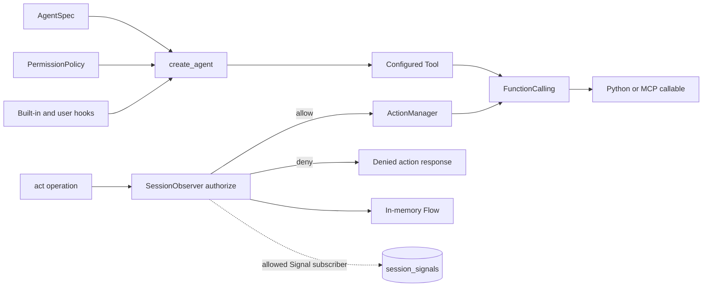
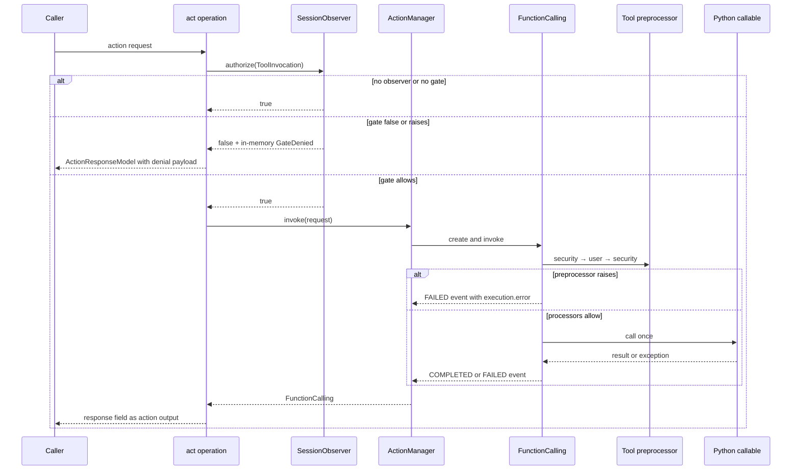

# ADR-0086: Local tool controls and session authorization observation

- **Status**: Accepted
- **Kind**: Retrospective
- **Area**: governance
- **Date**: 2026-07-09
- **Relations**: supersedes v0-0068, v0-0069, v0-0070

## Context

LionAGI ships useful controls around tool execution, but they grew at different layers and do
not form one governance system. This ADR records those controls as they are. It deliberately
does not reinterpret operational signals, mutable logs, or data adapters as evidence-backed
governance.

**P1 — Permission decisions have a local, untyped policy vocabulary.** Agent construction can
attach a `PermissionPolicy` to tool preprocessors. Its result is a mutable dataclass whose
`behavior` field is a string, and enforcement is ultimately a `PermissionError`. There is no
policy version, operation ID, or durable decision identifier
(`lionagi/agent/permissions.py`).

**P2 — Security behavior depends on factory wiring.** `AgentSpec.coding()` adds destructive
command and workspace-path guards when `secure=True`. `create_agent()` converts a configured
permission policy into a security hook, attaches hooks while registering local tools, and
orders security hooks around user argument transforms. The `Tool` itself does not know whether
the factory performed this wiring (`lionagi/agent/spec.py`; `lionagi/agent/factory.py`;
`lionagi/tools/coding.py`).

**P3 — The callable boundary has processors, not an authorization protocol.** `Tool` exposes
optional pre- and postprocessors. `FunctionCalling` invokes them around the callable and the
generic `Event` lifecycle captures ordinary exceptions as a failed event. A preprocessor can
enforce a local rule, but the result is not a typed verdict and alternate `ActionManager`
entry points do not consult session authorization (`lionagi/protocols/action/tool.py`;
`lionagi/protocols/action/function_calling.py`; `lionagi/protocols/action/manager.py`;
`lionagi/protocols/generic/event.py`).

**P4 — Session authorization is a separate optional plane.** A `SessionObserver` can hold one
caller-supplied gate. The action operation asks the branch to authorize a `ToolInvocation`
before it invokes `ActionManager`. A false result or an exception denies; a missing observer or
gate allows. The gate has no declared identity, level, reason code, or policy provenance
(`lionagi/session/control.py`; `lionagi/session/observer.py`;
`lionagi/operations/act/act.py`).

**P5 — Observation is lossy by design.** The same observer manages lifecycle signals,
subscriptions, routes, and optional persistence to `session_signals`. Persistence is a
subscriber and is explicitly best-effort. Payloads may be reduced or truncated, and a
persistence failure cannot change a run outcome (`lionagi/session/signal.py`;
`lionagi/session/observer.py`; `lionagi/state/schema.sql`; `lionagi/state/db.py`).

**P6 — Adjacent facilities have narrower contracts.** The adapter package converts data
representations. `DataLogger` holds mutable operational logs. `MemoryStore` stores caller
content. `completion_evidence` probes local Git state to decide whether a run appears to have
produced work. None supplies an immutable evidence chain, historical policy lookup, or process
certificate (`lionagi/adapters/_base.py`; `lionagi/protocols/generic/log.py`;
`lionagi/protocols/memory.py`; `lionagi/state/completion_evidence.py`).

| Concern | Decision |
|---|---|
| Local permission vocabulary | D1: Retain `PermissionPolicy` as a per-tool, preprocessor-based control with its shipped matching semantics. |
| Factory-installed guards | D2: Retain construction-time guard wiring: an explicit `PermissionPolicy` gets the security → user → security composition; the built-in coding guards register in the ordinary pre bucket and run once. |
| Callable interception | D3: Treat `Tool` processors and `FunctionCalling` as local invocation mechanics, not a universal governance boundary. |
| Session authorization | D4: Retain the optional, fail-closed-when-present session callback and its denied action response. |
| Signals and persistence | D5: Treat observer flows and `session_signals` as best-effort operational observation only. |
| Adjacent facilities | D6: Keep adapters, logs, memory, and completion evidence within their shipped narrow meanings. |

This ADR does **not** decide:

- The evidence-backed target architecture. ADR-0087 owns that aspirational design.
- Authenticated actor identity or cross-caller isolation. No shipped control establishes either
  property.
- Policy authoring syntax or an external policy service. The current policy is an in-process
  Python object.
- A guarantee over direct calls to arbitrary Python functions. Only LionAGI invocation paths
  described below are in scope.
- A new persistence or migration format. The SQL shown here records the current observer table,
  not a proposed evidence schema.

## Decision

### D1 — `PermissionPolicy` remains a local preprocessor policy

The shipped permission contract is two dataclasses and a pre-hook adapter
(`lionagi/agent/permissions.py`):

```python
@dataclass
class PermissionDecision:
    behavior: str  # "allow" | "deny" | "escalate"
    tool_name: str
    action: str
    reason: str
    matched_rule: str | None = None


@dataclass
class PermissionPolicy:
    mode: str = "allow_all"  # "allow_all" | "deny_all" | "rules"
    allow: dict[str, list[str]] = field(default_factory=dict)
    deny: dict[str, list[str]] = field(default_factory=dict)
    escalate: dict[str, list[str]] = field(default_factory=dict)
    on_escalate: Callable | None = None

    @classmethod
    def from_dict(cls, data: dict[str, Any]) -> PermissionPolicy: ...

    @classmethod
    def allow_all(cls) -> PermissionPolicy: ...

    @classmethod
    def deny_all(cls) -> PermissionPolicy: ...

    @classmethod
    def read_only(cls) -> PermissionPolicy: ...

    @classmethod
    def safe(cls) -> PermissionPolicy: ...

    def check(self, tool_name: str, action: str, args: dict) -> PermissionDecision: ...

    def to_pre_hook(self) -> Callable: ...
```

`from_dict()` reads `mode`, `allow`, `deny`, and `escalate`; missing values default to
`"allow_all"` and empty rule maps. It does not restore an `on_escalate` callable. Rule-map keys
normalize these aliases at construction time:

```python
_TOOL_ALIASES = {
    "bash_tool": "bash",
    "reader_tool": "reader",
    "editor_tool": "editor",
    "search_tool": "search",
    "context_tool": "context",
}
```

Exact semantics:

- `mode == "allow_all"` returns `allow` immediately. It does not build a match string and
  therefore does not reject shell-control operators on its own.
- `mode == "deny_all"` returns `deny` immediately.
- Every other mode value follows rules-mode behavior; the dataclass does not validate `mode`
  against a closed enum.
- Rules mode canonicalizes the requested tool name, then builds one match string. Bash uses
  `str(args.get("command", ""))`; editor uses `file_path`; reader uses `path`; search joins
  `pattern` and optional `path`; other tools join the action and argument values in mapping
  iteration order.
- In rules mode, a bash command containing a token matched by `_SHELL_CONTROL` becomes a deny
  decision before wildcard rules are considered.
- Matching is by `fnmatch` against the original text or a lowercase copy. `"*"` always matches.
- All deny rules are checked first, then all allow rules, then all escalation rules. Tool-specific
  rules precede `"*"` rules within each tier. The first match supplies `matched_rule`.
- No match returns `PermissionDecision("deny", ..., "no matching rule, default deny")`.
- `to_pre_hook()` returns an async hook. Allow returns `None`. Deny raises `PermissionError`.
  Escalate calls `on_escalate(decision, args)` when present: literal `True` allows, a `dict`
  replaces the downstream arguments, and every other result denies. With no handler it raises
  `PermissionError` explaining that escalation is required.
- Empty arguments are not special. They yield empty match strings for the named coding tools;
  the configured rules determine the outcome, with rules mode defaulting to deny.
- The policy is in-memory configuration. Reconstructing an agent after process restart requires
  supplying the policy again; `AgentSpec.to_yaml()` does not serialize it.

The presets are convenience constructors, not stronger policy types. `read_only()` allows
reader, search, and context and denies editor and bash. `safe()` allows the non-bash coding
tools, denies five bash pattern families, and escalates all remaining bash commands. The exact
five `safe()` patterns are `rm *`, `sudo *`, `chmod *`, `kill *`, and `mkfs *`.

Why this way: the dataclass and pre-hook conversion make a policy usable without changing
`Tool` or `ActionManager`. They also preserve zero-configuration behavior through
`allow_all`. The source records no stronger rationale for the string vocabulary or preset rule
sets, so this ADR does not infer one.

### D2 — Factory wiring chains policy and guard hooks per tool

The relevant construction-time shape is the `AgentSpec` dataclass
(`lionagi/agent/spec.py`):

```python
@dataclass
class AgentSpec(HooksMixin):
    profile: Profile
    model: str | None = None
    effort: str | None = None
    tools: tuple[str, ...] = ()
    permissions: PermissionPolicy | None = None
    grant_emissions: bool = True
    emits: tuple | None = None
    pack: str | Pack | None = "default"
    lion_system: bool = True
    extra_prompt: str | None = None
    hook_handlers: dict[str, list[Callable]] = field(default_factory=dict)
    cwd: str | None = None
    yolo: bool = False
    mcp_servers: list[str] | None = None
    mcp_config_path: str | None = None
    context_management: bool = True

    @classmethod
    def coding(
        cls,
        *,
        model: str | None = None,
        effort: str | None = "high",
        system_prompt: str | None = None,
        cwd: str | None = None,
        secure: bool = True,
        context_management: bool = True,
        **kwargs: Any,
    ) -> AgentSpec: ...
```

Hook registration uses string keys in `hook_handlers`:

```python
def pre(self, tool_name: str, handler: Callable) -> HooksMixin: ...
def post(self, tool_name: str, handler: Callable) -> HooksMixin: ...
def on_error(self, tool_name: str, handler: Callable) -> HooksMixin: ...

# Stored keys:
# pre:<tool>, post:<tool>, error:<tool>, and factory-added security_pre:<tool>
```

The factory entry point and pre-hook compositor are
(`lionagi/agent/factory.py`):

```python
async def create_agent(
    config: AgentSpec,
    *,
    load_settings: bool = True,
    project_dir: str | None = None,
    trust_project_settings: bool = False,
    trusted_hook_modules: set[str] | frozenset[str] | None = None,
    chat_model: Any = None,
    log_config: Any = None,
) -> Branch: ...


def _chain_pre_hooks(
    tool_name: str,
    security_hooks: list[Callable],
    user_hooks: list[Callable] | None = None,
) -> Callable | None: ...
```

The effective preprocessor is equivalent to:

```python
user_hooks = user_hooks or []
hooks = [*security_hooks, *user_hooks]
if user_hooks:
    hooks.extend(security_hooks)

async def chained(args: dict, **_kw) -> dict:
    for handler in hooks:
        result = await handler(tool_name, args.get("action", ""), args)
        if isinstance(result, dict):
            args = result
    return args
```

Exact semantics:

- `permissions is None` adds no policy hook. A `PermissionPolicy` is inserted at the front of
  `security_pre:*`; unsupported runtime values in the field are ignored by `_apply_permissions`.
- `AgentSpec.coding(secure=True)` registers `guard_destructive` for bash and one `guard_paths`
  instance for reader and editor (`_wire_secure_guards` in `lionagi/agent/spec.py`; the guards
  are defined in `lionagi/agent/hooks.py`). These register through `.security_pre()` into the
  `security_pre:<tool>` bucket, so the built-in guards participate in the security → user →
  security composition the same way an explicit `PermissionPolicy` does. The path
  guard's only allowed root is `cwd`, or `Path.cwd()` when `cwd` is absent. `secure=False`
  skips these three registrations.
- Only hooks in the `security_pre:<tool>`/`security_pre:*` bucket participate in the
  security → user → security composition; the factory writers of that bucket are
  `_apply_permissions` (an explicit `PermissionPolicy`) and `_wire_secure_guards` (the
  built-in coding guards). Those security hooks run
  before user pre-hooks, and when at least one user pre-hook exists the same security chain
  runs again against the final transformed argument mapping; with no user pre-hook it runs
  once.
- Consequently, a user hook that rewrites `command` or a path argument after a security hook
  has passed is rechecked against the final transformed mapping — for the built-in coding
  guards as well as an explicitly configured `PermissionPolicy`
  (`tests/agent/test_coding_preset_guard.py` pins `guard_destructive` to the
  `security_pre:bash` bucket and asserts the post-mutation recheck).
- A hook return that is a `dict` replaces the argument mapping for later hooks and the callable.
  Any other non-exception result leaves the current mapping unchanged.
- `guard_destructive(tool_name, action, args)` inspects only `args["command"]` when present. It
  rejects the compiled destructive pattern set with `PermissionError`; an empty or unmatched
  command returns `None`.
- `guard_paths(allowed_paths, denied_paths)` returns an async hook. No `path` or `file_path`
  allows. Relative paths resolve under the first allowed root; absolute paths resolve directly.
  Allowed roots accept the root itself or descendants. Absolute denied paths reject the path or
  descendants; relative denied glob patterns match path components and plain relative text
  matches the raw path or resolved filename.
- Paths use `Path.resolve(strict=False)`, so normalization occurs even when the target does not
  exist.
- Factory hooks attach while local tools are registered. MCP tools loaded later by `_load_mcp()`
  are registered directly on `ActionManager` and do not pass through `_attach_hooks`; the
  factory policy must not be claimed to govern that later registration path.
- `AgentSpec.to_yaml()` explicitly omits hook callables and also omits `permissions`. A process
  restart or YAML round-trip therefore does not preserve these runtime controls unless the
  caller supplies them again or loads them from trusted settings.

Why this way: the second security pass closes the concrete mutation gap in which a user hook
turns allowed arguments into denied arguments after the first check — but only for the
`security_pre` bucket, i.e. an explicit `PermissionPolicy`. The built-in coding guards sit in
the ordinary pre chain and do not get that recheck today; unifying the two (delta row 1's
"each configured control runs exactly once" contract) is where that asymmetry gets resolved.
Reusing `Tool.preprocessor` keeps the mechanism local to existing tool invocation. The cost is
construction-path coupling: a tool registered outside that path does not inherit the controls
automatically.

### D3 — `Tool` processors are the local callable interception mechanism

`Tool` is a Pydantic `Element` with these invocation-relevant fields
(`lionagi/protocols/action/tool.py`):

```python
class Tool(Element):
    func_callable: Callable[..., Any] = Field(..., exclude=True)
    mcp_config: dict[str, dict[str, Any]] | None = None
    tool_schema: dict[str, Any] | None = None
    request_options: type | None = None
    preprocessor: Callable[[Any], Any] | None = Field(default=None, exclude=True)
    preprocessor_kwargs: dict[str, Any] = Field(default_factory=dict, exclude=True)
    postprocessor: Callable[[Any], Any] | None = Field(default=None, exclude=True)
    postprocessor_kwargs: dict[str, Any] = Field(default_factory=dict, exclude=True)
    strict_func_call: bool = False
```

`FunctionCalling` supplies the executable event
(`lionagi/protocols/action/function_calling.py`):

```python
class FunctionCalling(Event):
    func_tool: Tool = Field(..., exclude=True)
    arguments: dict[str, Any] | BaseModel

    @property
    def function(self): ...

    async def _invoke(self) -> Any: ...

    def to_dict(self, *args, **kw) -> dict[str, Any]: ...
```

The manager exposes the independent route
(`lionagi/protocols/action/manager.py`):

```python
class ActionManager(Manager):
    registry: dict[str, Tool]

    def match_tool(
        self,
        action_request: ActionRequest | BaseModel | dict,
    ) -> FunctionCalling: ...

    async def invoke(
        self,
        func_call: BaseModel | ActionRequest,
    ) -> FunctionCalling: ...
```

The annotation on `invoke()` is narrower than runtime behavior: it forwards to `match_tool()`,
and tests exercise dictionaries successfully. This ADR records the accepted runtime input as
`ActionRequest | BaseModel | dict` while retaining the source annotation above as shipped.

Exact semantics:

- A `Tool` must have exactly one callable source: a Python callable or a one-entry MCP config.
  Providing both, a non-dict MCP config, or multiple MCP entries fails model validation.
- When `tool_schema` is absent, it is generated from the callable and optional
  `request_options` model. `strict_func_call=True` requires exactly the schema's required field
  set; non-strict mode requires only Python parameters without defaults.
- A Pydantic argument model is dumped with `exclude_unset=True`. `request_options`, when set,
  validates and dumps the arguments again before invocation.
- Invocation order is preprocessor → callable → postprocessor. The postprocessor is reached only
  after the callable returns successfully.
- Async detection uses `is_coro_func`. A synchronous callable or processor that returns a
  coroutine object is not automatically awaited.
- `Event.invoke()` changes `PENDING` to `PROCESSING`, captures ordinary `Exception` values in
  `execution.error`, sets `FAILED`, records duration, and does not re-raise. `BaseException`
  sets `CANCELLED` and is re-raised.
- Consequently, `PermissionError` raised by a tool preprocessor becomes a failed
  `FunctionCalling`. It is not the same outward shape as a session-gate denial. On the action
  path, the error remains in `func_call.execution.error`; because `_act()` does not call
  `assert_completed()`, its response payload is `func_call.response`, normally `None` when the
  preprocessor failed before the callable.
- Empty arguments are valid only when the callable has no required fields. Unknown tools fail in
  `match_tool()` before a `FunctionCalling` is created.
- `ActionManager.invoke()` does not consult `Branch.authorize()` or `SessionObserver`. A caller
  holding `branch.acts` can invoke a registered tool directly and bypass the session plane.
- `func_callable`, preprocessors, postprocessors, and their kwargs are excluded from serialized
  `Tool` output. Serialization is not a restartable enforcement record.

Why this way: processors are general transformation hooks and fit schema validation plus
sync/async callables without adding another manager. Their generality is also the limitation:
they have no common verdict or evidence contract and cannot make an authorization claim about
routes that do not use the configured `Tool` instance.

### D4 — Session authorization is optional and fail-closed only when installed

The proposal passed to the gate is a frozen dataclass
(`lionagi/session/control.py`):

```python
@dataclass(frozen=True, slots=True)
class ToolInvocation:
    function: str
    arguments: dict = field(default_factory=dict)
    branch_id: str | None = None
```

The public installation and authorization surface is
(`lionagi/session/session.py`; `lionagi/session/observer.py`;
`lionagi/session/branch.py`):

```python
def Session.gate(self, check: Callable) -> SessionObserver: ...
def SessionObserver.gate(self, check: Gate) -> SessionObserver: ...
async def SessionObserver.authorize(self, action: Any) -> bool: ...
async def Branch.authorize(self, action: Any) -> bool: ...
```

The action operation constructs the proposal and denial payload
(`lionagi/operations/act/act.py`; `lionagi/operations/fields.py`):

```python
class ActionResponseModel(HashableModel):
    function: str = Field(default_factory=str)
    arguments: dict[str, Any] = Field(default_factory=dict)
    output: Any = None


ToolInvocation(
    function=_request["function"],
    arguments=_request["arguments"] if isinstance(_request["arguments"], dict) else {},
    branch_id=str(branch.id),
)

{"error": "denied by governance gate", "function": _request["function"]}
```

Exact semantics:

- `SessionObserver.gate(check)` stores exactly one callable and returns the observer. A later
  call replaces the previous gate; there is no built-in composition.
- A branch included in a `Session` receives that session's observer. Removing the branch clears
  the observer reference. A standalone branch has no observer.
- `Branch.authorize()` returns `True` when no observer exists. `SessionObserver.authorize()`
  returns `True` when no gate exists.
- With a gate, the observer calls it through `maybe_await`, converts its result with `bool()`,
  and treats every raised `Exception` as `False`. It does not preserve a reason or exception in
  the returned boolean.
- On denial, `authorize()` adds `GateDenied(data=action)` directly to the observer's in-memory
  `Flow` and returns `False`.
- `_act()` performs authorization before `branch._action_manager.invoke()`. Denial therefore
  creates no `FunctionCalling` and does not invoke the tool callable.
- A denied action is represented as `ActionResponseModel.output` containing the fixed error
  dictionary above. The action request and denial response are added to branch chat history so
  a subsequent reasoning round can observe the denial.
- When the incoming arguments are not already a dictionary, the gate sees `{}` even though the
  original argument object remains on the later invocation path. The session gate therefore
  must not claim inspection of non-dict argument models.
- Direct `ActionManager.invoke()` and direct calls to the underlying Python function do not
  execute this session check. An unattached `Branch` also permits by definition.
- The installed callback and `GateDenied` flow are in memory. They are not restored after a
  process restart.
- The same `_gate` callable is also used by `SessionObserver.emit()`, but `emit()` passes an
  event payload rather than a `ToolInvocation`. Callers that use both surfaces must accept both
  input shapes themselves.

Why this way: an optional observer callback adds a small pre-invocation stop without changing
plain `Branch` construction. Returning a denial as a tool result lets iterative operations react
instead of treating policy denial as an unexpected Python exception. The trade-off is that the
check is tied to `_act()`, not to the callable boundary.

### D5 — Signals are observation, not authority

Signals inherit identity, timestamp, and metadata from `Element` and add this envelope
(`lionagi/protocols/generic/element.py`; `lionagi/session/signal.py`):

```python
class Element(BaseModel, Observable):
    id: UUID = Field(default_factory=uuid4, frozen=True)
    created_at: float = Field(default_factory=lambda: now_utc().timestamp(), frozen=True)
    metadata: dict = Field(default_factory=dict)


SIGNAL_SCHEMA_VERSION: int = 1


class Signal(Element):
    data: Any = None
    emitter_role: str | None = None
    schema_version: int = SIGNAL_SCHEMA_VERSION


class GateDenied(Signal):
    pass
```

Observer and persistence contracts
(`lionagi/session/observer.py`):

```python
_PAYLOAD_BYTE_CAP: int = 16_384

async def SessionObserver.emit(self, event: Any) -> list[Any]: ...

def SessionObserver.bind_db_persistence(
    self,
    session_id: str,
    db: Any = None,
) -> None: ...

def SessionObserver.unbind_db_persistence(self) -> None: ...
```

The optional table is
(`lionagi/state/schema.sql`; mirrored by `lionagi/state/schema_meta.py`):

```sql
CREATE TABLE IF NOT EXISTS session_signals (
  id          TEXT    PRIMARY KEY,
  session_id  TEXT    NOT NULL REFERENCES sessions(id) ON DELETE CASCADE,
  seq         INTEGER NOT NULL,
  kind        TEXT    NOT NULL,
  op_id       TEXT    NOT NULL DEFAULT '',
  ts          REAL    NOT NULL,
  payload     JSON    NOT NULL DEFAULT '{}'
);

CREATE UNIQUE INDEX IF NOT EXISTS idx_session_signals_seq
  ON session_signals(session_id, seq);
CREATE INDEX IF NOT EXISTS idx_session_signals_session_ts
  ON session_signals(session_id, ts);
```

Exact semantics:

- `emit()` wraps a non-`Observable` object in `Signal(data=event)`. For a `Signal`, filters and
  the event gate see `signal.data`; other observable events are their own payload.
- When an observer gate exists, a false result or exception denies dispatch. The event is still
  added to the in-memory `Flow`, but routes and subscribers are skipped and `emit()` returns an
  empty list.
- Persistence is one ordinary `Signal` subscription. Therefore a gate-denied emitted signal is
  not persisted because subscriber dispatch is skipped.
- `authorize()` adds `GateDenied` directly to the flow rather than calling `emit()`. That denial
  does not reach routes, subscribers, or the database persistence subscription.
- `bind_db_persistence()` persists only `Signal` instances. With a supplied database handle it
  reuses that handle. Without one it opens the default state database only if the path exists.
- Every persistence exception is swallowed. Missing database state, serialization fallback, or
  insert failure cannot alter the producing run.
- Signal payloads are converted to JSON-safe data. `MessageAdded` stores only a compact
  `message_ref` with available identity/role endpoints, not the message body. Unknown values
  fall back to string or `repr` forms.
- The payload column is capped at 16,384 serialized UTF-8 bytes. Oversize content becomes a
  dictionary with `truncated`, `original_bytes`, and a clipped `data` string. The cap bounds the
  stored payload; the surrounding SSE frame can be larger. The code records the bounding
  purpose but no rationale for choosing exactly 16 KiB.
- `insert_session_signal()` assigns a one-based `seq` as `MAX(seq)+1` inside the write
  transaction. SQLite uses its immediate transaction serialization; PostgreSQL takes an
  advisory transaction lock by session ID. Reads use `seq > after_seq`, ascending order, and a
  default page limit of 500. Pagination bounds one read response; the source records no rationale
  for selecting exactly 500.
- Rows disappear when their parent session is deleted because of `ON DELETE CASCADE`. The table
  is append-oriented operational history, not immutable evidence.
- On restart, persisted rows remain when the selected database remains, but the observer flow,
  subscriptions, routes, and gate must be rebuilt.

Why this way: the observer bus prioritizes lifecycle progress and debugging without allowing
telemetry failures to fail work. Payload reduction and best-effort writes are appropriate for
that role. Those same properties preclude completeness, immutability, and authority claims.

### D6 — Adapters, logs, memory, and completion evidence keep narrow meanings

The generic adapter protocol converts representations
(`lionagi/adapters/_base.py`):

```python
@runtime_checkable
class Adapter(Protocol[T]):
    adapter_key: ClassVar[str]
    obj_key: ClassVar[str]

    @classmethod
    def from_obj(
        cls,
        subj_cls: type[T],
        obj: Any,
        /,
        *,
        many: bool = False,
        adapt_meth: str | Callable = "model_validate",
        adapt_kw: dict[str, Any] | None = None,
        **kw: Any,
    ) -> T | list[T]: ...

    @classmethod
    def to_obj(
        cls,
        subj: T | list[T],
        /,
        *,
        many: bool = False,
        adapt_meth: str | Callable = "model_dump",
        adapt_kw: dict[str, Any] | None = None,
        **kw: Any,
    ) -> Any: ...
```

It defines no invocation wrapper, policy input, or execution lifecycle.

Operational logging is configurable and mutable
(`lionagi/protocols/generic/log.py`):

```python
class DataLoggerConfig(BaseModel):
    persist_dir: str | Path = "./data/logs"
    subfolder: str | None = None
    file_prefix: str | None = None
    capacity: int | None = None
    extension: str = ".json"
    use_timestamp: bool = True
    hash_digits: int | None = Field(5, ge=0, le=10)
    auto_save_on_exit: bool = True
    clear_after_dump: bool = True
```

`DataLogger.dump()` clears entries after a successful dump when configured, and some JSON
serialization failure paths also clear unless the caller explicitly passes `clear=False`.
`DataLogger.adump()` snapshots under a lock, writes outside it, and clears only snapshot IDs
after a successful write. `capacity=None` deliberately leaves collection size unbounded until a
caller sets a cap. The five-digit filename hash default and accepted zero-to-ten range reduce
filename collisions, but the source records no rationale for those exact numbers. These are
operational retention choices, not append-only evidence.

The memory protocol stores and searches caller content
(`lionagi/protocols/memory.py`):

```python
@runtime_checkable
class MemoryStore(Protocol):
    async def store(self, item: MemoryItem) -> UUID: ...
    async def retrieve(self, item_id: UUID) -> MemoryItem | None: ...
    async def search(self, query: MemoryQuery) -> list[MemoryItem]: ...
```

It has no compare-and-append, ordered chain read, historical policy version, or verification
operation.

Completion evidence is a local Git-state result
(`lionagi/state/completion_evidence.py`):

```python
_GIT_TIMEOUT = 5


class CompletionEvidence(TypedDict):
    checked: bool
    ahead_of_base: bool | None
    commits_ahead: int | None
    dirty: bool | None
    base_ref: str | None
    reason: str


def check_completion_evidence(
    cwd: str | None,
    *,
    base_ref: str | None = None,
) -> CompletionEvidence: ...


def has_completion_evidence(evidence: CompletionEvidence) -> bool: ...
```

Exact completion semantics:

- The probe runs fixed local Git commands with no shell and a five-second timeout per command.
  The timeout exists to bound a local completion check; no recorded rationale selects exactly
  five seconds.
- Missing `cwd`, a non-repository directory, a failed status probe, or a failed decisive
  revision-count probe returns `checked=False`. `has_completion_evidence()` then returns false,
  meaning no opinion rather than proof of no work.
- Base resolution tries a caller value, the remote default symbolic ref, then
  `origin/main`, `origin/master`, `main`, and `master`.
- With no resolvable base, the probe can still return `checked=True` and report working-tree
  dirtiness while `ahead_of_base` and `commits_ahead` remain `None`.
- Evidence is positive when the checked repository is ahead of the resolved base or dirty. It
  carries no tool-call decisions, policy identity, chain hash, or verification method.

Why this way: each facility solves a concrete local need—representation conversion, operational
logging, recall, or completion signaling. Reusing their names for governance would broaden
their contracts without changing the behaviors that make them non-authoritative.

## Shipped component boundaries



The tool-local path and the session path meet only because `_act()` performs session
authorization before invoking the configured `Tool`. Neither component owns the other.

## Execution sequence as shipped



## Consequences

Positive consequences:

- D1 gives library callers allow-all, deny-all, rules, safe, and read-only choices without a
  policy service.
- D2 protects factory-wired coding tools before invocation; both a configured
  `PermissionPolicy` and the built-in guards are rechecked after user transforms.
- D3 preserves one processor mechanism for both synchronous and asynchronous callables.
- D4 lets an attached session deny a proposed action before `ActionManager` and returns a form
  iterative operations can observe.
- D5 provides typed lifecycle observation, in-memory routing, and optional ordered persistence
  without making telemetry a run dependency.
- D6 keeps generic infrastructure small and independently useful.

Negative and maintenance consequences:

- D1 and D4 expose different result types, reason behavior, and configuration owners. A
  contributor debugging a denial must identify which plane fired.
- D2 controls are properties of the constructed `Tool` instances. New registration paths must
  opt into the same factory wiring or remain outside its coverage.
- D3 captures processor exceptions inside `FunctionCalling`, while D4 returns a denial payload
  before a `FunctionCalling` exists. Consumers cannot treat the two paths as one verdict.
- D4 can be bypassed through direct manager invocation or a standalone branch. Reversing this
  requires moving enforcement to the callable boundary, not merely adding another session
  callback.
- D5 cannot support an audit completeness claim: authorization denials do not pass through
  persistence, gated emissions skip subscribers, payloads can be truncated, writes can fail
  silently, and parent-session deletion cascades.
- D6 means a future evidence system needs its own protocol and store rather than a mode flag on
  an adjacent facility.

Cost of reversal by decision:

| Decision | Reversal cost |
|---|---|
| D1 | Medium: existing policy constructors and hook behavior are public library surface and need adapters or compatibility shims. |
| D2 | Medium: hook ordering is regression-tested; changing it can reopen transformed-argument bypasses. |
| D3 | High: the processor/callable lifecycle is shared by all tool invocation and MCP wrappers. |
| D4 | Medium: denial response and standalone-allow behavior are visible to action callers and tests. |
| D5 | Low for adding a separate authoritative store; high for trying to make the observer table itself authoritative. |
| D6 | Low if new governance types remain separate; high if generic adapter, log, or memory protocols are widened. |

## Current-vs-ideal delta

| # | Delta | Size | Issue |
|---|---|---|---|
| 1 | Define one immutable `GateResult` contract and adapters for `PermissionPolicy`, built-in guards, and the session gate; accept when each configured control runs exactly once, an evaluator exception produces a recorded deny result, and every security-relevant control (built-in coding guards included) evaluates the final post-mutation arguments — closing the current asymmetry in which only an explicit `PermissionPolicy` is re-run after a mutating user pre-hook. Security-relevant. | M | Resolved on main (`lionagi/agent/factory.py::_chain_pre_hooks`) |
| 2 | Add a governed invocation controller at the callable boundary; accept when every LionAGI route to a policy-bound `Tool` reaches the controller and no raw manager or function-calling route can bypass it. | L | (filled at issue-open time) |
| 3 | Add an append-only evidence store and verifier independent of `DataLogger` and session signals; accept when permit, denial, callable failure, and completion records verify as one chain, mutation is detected, and an append failure blocks governed execution. | L | (filled at issue-open time) |
| 4 | Bind an immutable policy snapshot and operation provenance to governed execution; accept when concurrent calls cannot exchange gate results, every evidence record names the active policy version, and historical snapshots remain retrievable. | L | (filled at issue-open time) |
| 5 | Mint a process certificate only at an explicit task boundary; accept when missing evidence, failed verification, or unavailable policy history prevents minting and an approved exception remains permanently marked degraded. | L | (filled at issue-open time) |
| 6 | Project governance evidence into observer signals without making signals authoritative; accept when projections carry evidence identifiers, export failure cannot alter evidence, and ordinary lifecycle persistence remains best-effort. | M | (filled at issue-open time) |

## Alternatives considered

### Keep only tool hooks as the long-term governance design

This would reuse the smallest shipped mechanism and preserve local enforcement. It lost because
hooks do not share a typed verdict, policy version, operation identity, or authoritative record;
they also cannot describe callable failures after a preprocessor has returned. Alternate tool
registration and invocation routes remain a concrete coverage gap.

### Make the session gate the sole mandatory authorization layer

This would produce one obvious callback at session scope and retain the explicit denied action
response. It lost because standalone branches permit, removed branches lose the observer, direct
`ActionManager.invoke()` does not consult the observer, and one callback is also reused for
heterogeneous event payloads. Moving the same callback to more call sites would still leave no
typed result or evidence chain.

### Treat `session_signals` as the evidence store

This would reuse ordered per-session sequence numbers and an existing database table. It lost
because the persistence handler is best-effort, gate-denied emissions skip subscribers,
authorization `GateDenied` values never call `emit()`, payloads are capped and can be lossy, and
session deletion cascades to the rows. Those are observed storage semantics, not missing
documentation.

### Treat `DataLogger` as the evidence store

This would reuse existing file persistence and immutable-on-deserialization `Log` entries. It
lost because live logs are mutable collection members, dumping normally clears them, some
serialization failures may also clear them, and there is no atomic chain append or verifier.

### Treat `MemoryStore` as the evidence store

This would provide an injected protocol and an in-memory reference backend. It lost because
`store`/`retrieve`/`search` is caller-content storage with no ordered append, expected-head
conflict rule, immutable policy history, or tamper verification. Widening it would couple recall
and governance retention.

### Reinterpret the generic adapter protocol as an execution wrapper

This would reuse a registry and `from_obj`/`to_obj` extension points. It lost because adapters
are stateless representation conversion. Adding invocation, authorization, and evidence
lifecycle semantics would violate that stable boundary and force unrelated adapters to
understand tools.

### Use completion evidence as an audit record

This would reuse a simple, local completion signal. It lost because the payload answers only
whether a Git worktree is dirty or ahead of a base. Probe failure deliberately means “no
opinion,” and no field identifies a tool call, policy decision, or causal chain.

### Change the unconfigured default to deny

This would reduce accidental execution when a caller forgets configuration. It lost for the
retrospective contract because plain `Branch` and `AgentSpec` construction have established
zero-configuration behavior. ADR-0087 instead makes fail-closed behavior conditional on an
explicit governed binding, preserving ordinary library use.

## Notes

The two authorization planes are independent, not layered guarantees. A call can pass a session
gate and fail a tool-local preprocessor, or bypass the session plane and still encounter a
preprocessor. No current record binds both outcomes to one operation or policy snapshot.

The public runtime defines no policy-scope, identity-isolation, evidence-chain, certificate, or
governance-tracing contract. That absence is part of the retrospective truth, not a proposal to
fill all adjacent concerns in this ADR.
