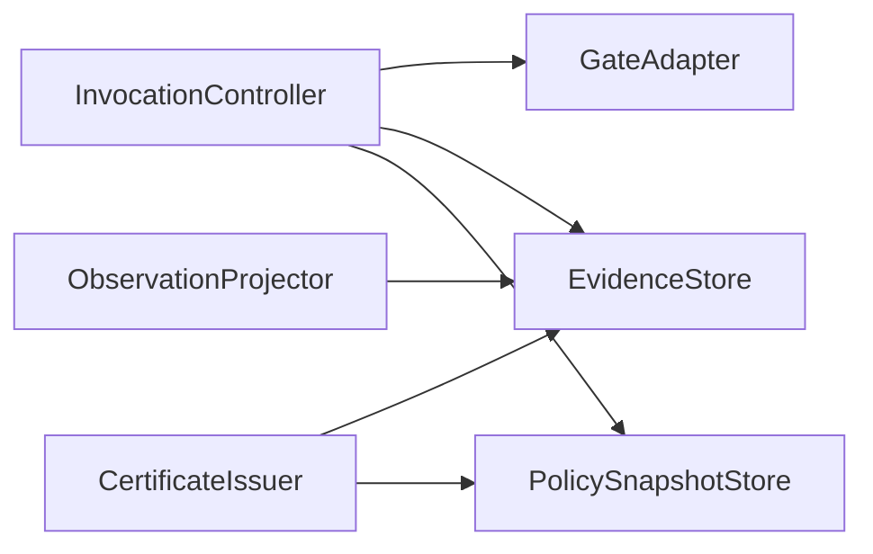

# ADR-0087: Evidence-Backed Governed Execution

- **Status**: Proposed
- **Kind**: Aspirational
- **Area**: governance
- **Date**: 2026-07-09
- **Relations**: supersedes v0-0039, v0-0041, v0-0042, v0-0043, v0-0044, v0-0045, v0-0046, v0-0047, v0-0048, v0-0049, v0-0050, v0-0051, v0-0052; extends ADR-0086

## Context

ADR-0086 records two shipped control planes: factory-installed tool processors and an optional
session authorization callback. They can block individual calls, but they cannot prove which
policy and checks governed one operation. Their denials have different representations,
signals are non-authoritative, and concurrent operations have no immutable provenance record.

**P1 — There is no common verdict.** `PermissionPolicy` returns a mutable string-valued
`PermissionDecision`, processors raise exceptions, and the session gate collapses every result
to `bool`. A certificate cannot summarize those incompatible shapes without first defining one
typed result.

**P2 — Enforcement can be bypassed inside LionAGI.** The action operation consults the session
gate, but `ActionManager.invoke()` and direct `FunctionCalling` construction do not. A policy
claim needs one interception point immediately before the callable, with a refusal path when a
governed descriptor reaches an ungoverned route.

**P3 — Current persistence cannot support an adherence claim.** `session_signals` persistence
is best-effort and subscriber-based, `DataLogger` can clear entries, and `MemoryStore` has no
ordered append or verifier. Governed execution requires an append failure to be part of control
flow rather than an observability warning (`lionagi/session/observer.py`;
`lionagi/protocols/generic/log.py`; `lionagi/protocols/memory.py`).

**P4 — Policy and context must be pinned per operation.** A mutable session-global accumulator
can leak gate results or policy versions between concurrent calls. Each invocation needs its own
immutable operation ID, chain, parent reference, tool ID, and exact policy snapshot.

**P5 — Evidence must be useful without collecting sensitive values by default.** Raw tool
arguments and results can contain secrets or unrestricted caller content. The evidence contract
needs canonical approved payloads and digests, with raw values excluded unless a caller
deliberately supplies a redacted evidence field.

**P6 — A process certificate has a narrow epistemic boundary.** It can establish that declared
checks ran under a retrievable policy and that the referenced evidence chain verifies. It cannot
establish that the tool result is correct, high-quality, safe, or legally compliant.

**P7 — Existing controls must compose, not fork.** `PermissionPolicy`, built-in guards, user
argument hooks, and the installed session gate are useful enforcement seams. A governed mode
must adapt them into the common result rather than independently evaluating the same control on
both old and new paths.

**P8 — Later gate families have prerequisites.** Time-bounded permits, separation-of-duties
checks, and break-glass require actor references, immutable policy versions, and authoritative
evidence. Shipping those concepts before the foundation would create a stronger name than the
implementation can support.

The earlier governance corpus split evidence, certificates, tools, gates, overrides, permits,
policy records, context, registries, and tracing into separate designs. Those concepts form one
dependency chain: evidence precedes certificates; executable gate bindings precede policy
activation; actor references and recorded decisions precede exceptional access; observation is
a projection of all three. This ADR consolidates that chain and sequences it.

| Concern | Decision |
|---|---|
| Package and interception boundary | D1: Add one optional governance package and a no-bypass controller for policy-bound tools. |
| Immutable records and hashing | D2: Use frozen Python models, canonical JSON, and a versioned SHA-256 chain contract. |
| Evidence persistence | D3: Inject an append-only `EvidenceStore` with per-chain atomic append and verification. |
| Gate evaluation | D4: Adapt current controls once into `GateResult` and apply hard, soft, and advisory semantics fail-closed. |
| Context and policy | D5: Pin immutable `OperationContext` and exact `PolicySnapshot` versions with deterministic binding resolution. |
| Certificate minting | D6: Mint a process-only `TaskCertificate` only from a closed explicit boundary and verified evidence. |
| Observation | D7: Project committed evidence identifiers to session signals without making signals authoritative. |
| Later controls | D8: Defer permits, duty separation, break-glass, and external wrappers until the core contracts ship. |

This ADR does **not** decide:

- How actor references are authenticated. A supplied actor reference is policy input, not proof
  of identity.
- Cross-caller isolation. Scope labels and resource IDs do not create an isolation boundary.
- An external policy service or mandatory database. All durable implementations are injected.
- Governance of arbitrary Python calls made outside LionAGI.
- Correctness or quality of tool outcomes.
- The public convenience API for opening and closing task boundaries. D6 defines the internal
  contract and retains that façade as a deferred choice.

## Decision

### D1 — One optional package owns governed invocation

The target module tree is:

```text
lionagi/governance/
├── __init__.py          public types and protocols
├── models.py            immutable contexts, verdicts, records, policies, certificates
├── canonical.py         approved-payload canonicalization and sha256-v1 hashing
├── protocols.py         GateAdapter, EvidenceStore, PolicySnapshotStore
├── evidence.py          verifier and InMemoryEvidenceStore reference backend
├── policy.py            activation, binding resolution, historical lookup
├── controller.py        InvocationController and no-bypass invocation token
├── certificate.py       CertificateIssuer and mint validation
├── projection.py        committed-evidence → observer signal projection
└── deferred.py          type reservations for D8; no executable gate registration
```

The opt-in binding added to the existing construction surface is:

```python
@dataclass(frozen=True, slots=True)
class GovernanceBinding:
    policy_id: UUID
    policy_version: str
    task_boundary_id: UUID
    evidence_store: EvidenceStore
    policy_store: PolicySnapshotStore
    gate_adapters: tuple[GateAdapter, ...]


@dataclass
class AgentSpec(HooksMixin):
    # Existing fields remain unchanged.
    governance: GovernanceBinding | None = None
```

`create_agent()` resolves the exact snapshot before returning a branch. When `governance is
None`, tool registration and invocation remain byte-for-byte on the current path. When it is
present, the factory installs one `InvocationController` on the branch's `ActionManager` and
marks every tool registered on that manager with an excluded runtime descriptor:

```python
class GovernedToolBinding(BaseModel):
    model_config = ConfigDict(frozen=True, extra="forbid")

    tool_id: str
    policy_id: UUID
    policy_version: str


class Tool(Element):
    governance_binding: GovernedToolBinding | None = Field(default=None, exclude=True)
```

The controller surface is:

```python
class InvocationController:
    async def invoke(
        self,
        call: FunctionCalling,
        *,
        context: OperationContext,
    ) -> Any: ...


class ActionManager(Manager):
    async def invoke(
        self,
        func_call: ActionRequest | BaseModel | dict,
        *,
        operation_context: OperationContext | None = None,
    ) -> FunctionCalling: ...
```

Exact boundary semantics:

- An unbound `Tool` follows the existing preprocessor → callable → postprocessor path and
  produces no governance records.
- A bound `Tool` always enters `InvocationController.invoke()` immediately before its callable.
  `ActionManager.invoke()`, `_act()`, and direct `FunctionCalling.invoke()` all converge there.
- A bound tool presented without its manager's controller, without an `OperationContext`, or
  with a context pinned to a different tool or policy fails with `GovernanceBypassError` before
  the callable.
- The controller alone creates a private one-use invocation token accepted by the internal
  callable helper. The token is consumed before the call and cannot be reused. This prevents a
  second LionAGI route from calling the helper after governance evaluation.
- Directly calling `tool.func_callable(...)` outside LionAGI remains possible and outside the
  guarantee. The descriptor is a library boundary, not a Python sandbox.
- Tools registered after branch construction inherit the manager's active binding. Registration
  rejects a supplied conflicting `GovernedToolBinding`.
- Process restart requires reconstructing the binding and injected stores. A durable evidence or
  policy backend may preserve records; the in-memory reference backends do not.

Why this way: the controller is a new responsibility but not a parallel dispatcher. Existing
schema matching, `FunctionCalling`, and action response handling remain the invocation path.
The descriptor makes accidental internal bypass detectable while preserving plain-tool
compatibility.

### D2 — Records are frozen and hashes have one canonical algorithm

All public governance models use:

```python
class GovernanceModel(BaseModel):
    model_config = ConfigDict(frozen=True, extra="forbid")
```

Nested collections in authoritative records are tuples or canonical JSON strings, not mutable
lists or dictionaries. Identifiers are opaque UUIDs. Time fields use Pydantic `AwareDatetime`,
must have a UTC offset, and serialize as `YYYY-MM-DDTHH:MM:SS.ffffffZ`.

The closed record taxonomy is:

```python
class EvidenceType(str, Enum):
    POLICY_BOUND = "policy_bound"
    OPERATION_STARTED = "operation_started"
    GATE_EVALUATED = "gate_evaluated"
    EXCEPTION_GRANTED = "exception_granted"
    OPERATION_DENIED = "operation_denied"
    CALLABLE_COMPLETED = "callable_completed"
    CALLABLE_FAILED = "callable_failed"
    TASK_CLOSED = "task_closed"
    RECORD_SUPERSEDED = "record_superseded"
```

The evidence record is exact:

```python
Digest = Annotated[str, StringConstraints(pattern=r"^[0-9a-f]{64}$")]


class EvidenceRecord(GovernanceModel):
    record_id: UUID
    record_type: EvidenceType
    chain_id: UUID
    operation_id: UUID | None
    sequence: int = Field(ge=0)
    policy_id: UUID
    policy_version: str
    payload_json: str
    payload_digest: Digest
    previous_chain_hash: Digest | None
    chain_hash: Digest
    supersedes_record_id: UUID | None = None
    created_at: AwareDatetime
    hash_algorithm: Literal["sha256-v1"] = "sha256-v1"
```

Canonicalization and hashing semantics (`lionagi/governance/canonical.py`, target):

- Approved payload input accepts only `None`, booleans, integers, strings, lists/tuples of
  approved values, and mappings with string keys. Floats, bytes, arbitrary objects, and nonfinite
  numbers are rejected. Durations are represented as integer microseconds.
- UUIDs, enums, and aware datetimes are projected to strings before approval. Datetimes are
  normalized to UTC with six fractional digits and a terminal `Z`.
- `payload_json` is UTF-8 JSON produced with sorted keys, separators `(",", ":")`,
  `ensure_ascii=False`, and no NaN values.
- `payload_digest = sha256(payload_json.encode("utf-8")).hexdigest()`.
- `chain_hash` is SHA-256 over canonical JSON containing every record field except
  `chain_hash`, including `payload_digest` and `previous_chain_hash`. The genesis record uses
  `previous_chain_hash=None`.
- `sha256-v1` is the only algorithm accepted by the first verifier. The version is stored on
  every record so a future algorithm can coexist without silently changing old verification.
- Corrections never mutate a prior record. They append `RECORD_SUPERSEDED` with
  `supersedes_record_id` and a payload explaining the corrected approved fields.
- Raw arguments, results, secrets, and unrestricted free text are not approved evidence fields.
  Adapters may add explicitly redacted strings, field-name lists, schema IDs, counts, tool IDs,
  and digests.

SHA-256 is selected because Python ships it in `hashlib`, every supported backend can reproduce
it, and this workload does not need a new hashing dependency. This chain detects content or link
changes relative to a trusted expected head; it is not a digital signature and does not prevent
an actor with authority to rewrite the entire store and replace the trusted head.

### D3 — `EvidenceStore` is append-only and authoritative

The storage protocol and result shapes are:

```python
class VerificationFailureCode(str, Enum):
    BROKEN_LINK = "broken_link"
    CONTENT_MISMATCH = "content_mismatch"
    MISSING_POLICY = "missing_policy"
    UNSUPPORTED_ALGORITHM = "unsupported_algorithm"


class AppendReceipt(GovernanceModel):
    chain_id: UUID
    record_id: UUID
    sequence: int
    head_hash: Digest


class VerificationResult(GovernanceModel):
    valid: bool
    verified_head: Digest | None
    checked_records: int = Field(ge=0)
    failure_code: VerificationFailureCode | None = None
    failed_record_id: UUID | None = None


@runtime_checkable
class EvidenceStore(Protocol):
    async def append(self, record: EvidenceRecord) -> AppendReceipt: ...

    async def read(
        self,
        chain_id: UUID,
        *,
        after_sequence: int = -1,
    ) -> tuple[EvidenceRecord, ...]: ...

    async def head(self, chain_id: UUID) -> Digest | None: ...

    async def verify(
        self,
        chain_id: UUID,
        expected_head: Digest,
    ) -> VerificationResult: ...
```

There is intentionally no update or delete operation.

Exact store semantics:

- Append is atomic for one chain. A missing chain accepts only `sequence=0` and
  `previous_chain_hash=None`. An existing chain accepts only the next integer sequence and a
  `previous_chain_hash` equal to its current head.
- The store recomputes payload and chain hashes before commit. Invalid content raises
  `EvidenceIntegrityError`; a stale previous head, wrong sequence, duplicate record ID, or
  duplicate chain hash raises `EvidenceConflictError`. Duplicate append is not treated as
  idempotent success because replay would obscure whether the producing control ran twice.
- Chains are independent. No cross-chain transaction is promised.
- The controller owns one async append lock per active task chain. Head lookup, record
  construction, and `append()` run under that lock; callable execution does not. Concurrent
  operations may therefore interleave records but cannot manufacture the same next sequence in
  one process. A conflict from an independent writer is not retried silently and fails closed.
- `read()` returns ascending sequence order and an empty tuple on miss. `after_sequence=-1`
  returns the full chain.
- `verify()` treats an empty chain, nonzero first sequence, sequence gap, wrong previous hash, or
  expected-head mismatch as `BROKEN_LINK`. Payload rehash failure is `CONTENT_MISMATCH`.
  Unknown `hash_algorithm` is `UNSUPPORTED_ALGORITHM`. It stops at the first failure.
- `checked_records` counts records fully verified before the failure, or the entire chain on
  success. `verified_head` is the last verified hash, which is `None` when the first record
  fails.
- `MISSING_POLICY` is produced by certificate verification after chain verification when the
  exact policy version cannot be retrieved; the evidence store itself does not depend on a
  policy store.
- `InMemoryEvidenceStore` uses one async lock per chain and implements the full conflict and
  verifier contract. It is a semantic reference and test seam, not durable storage.
- A durable implementation must commit the record and head compare in one backend transaction
  and preserve records across restart. Durability beyond that transaction depends on the
  injected backend.

Controller failure behavior is also fixed:

- A failure appending policy, context, gate, exception, or denial records before invocation
  raises `GovernanceEvidenceError(call_executed=False)` and the callable is not reached.
- After a callable succeeds, failure to append `CALLABLE_COMPLETED` raises
  `GovernanceEvidenceError(call_executed=True)`; the callable is never retried automatically.
- If the callable raises and `CALLABLE_FAILED` appends successfully, its original exception is
  re-raised. If that append also fails, the controller raises `OutcomeEvidenceError` containing
  both the callable and store exceptions and marks the operation uncertifiable.
- Any missing terminal record prevents D6 minting. A process restart does not infer a terminal
  state from absence.

Why this way: compare-and-append makes conflicts explicit and gives the verifier one ordered
history. Fail-open evidence would let a caller receive a result carrying a governance claim that
the system cannot substantiate.

### D4 — Existing controls adapt into one `GateResult`

The common gate contract is:

```python
class GateLevel(str, Enum):
    HARD = "hard"
    SOFT = "soft"
    ADVISORY = "advisory"


class GateDecision(str, Enum):
    ALLOW = "allow"
    DENY = "deny"


class GateResult(GovernanceModel):
    result_id: UUID
    gate_id: str
    level: GateLevel
    decision: GateDecision
    reason_code: str
    detail: str | None
    operation_id: UUID
    policy_version: str
    evaluated_at: AwareDatetime


@dataclass(frozen=True, slots=True)
class AdaptedControlResult:
    arguments: Mapping[str, Any]
    gate_results: tuple[GateResult, ...]


@runtime_checkable
class GateAdapter(Protocol):
    gate_id: str

    async def evaluate(
        self,
        *,
        tool: Tool,
        arguments: dict[str, Any],
        context: OperationContext,
    ) -> AdaptedControlResult: ...
```

`arguments` is transient, not evidence. The controller makes a private dictionary copy after
each adapter and never stores the mapping by reference. It can therefore preserve the current
tool argument surface, including values that are intentionally outside D2's approved evidence
payload types.

Exact evaluation semantics:

- Policy activation rejects a gate binding whose `gate_id` has no registered adapter. A
  governed tool with no applicable gate binding denies with `policy.no_gate_binding`.
- The controller invokes each applicable adapter once in snapshot order. It does not also run
  the old session authorization or preprocessor path for the same control.
- The built-in composite adapter preserves current hook phases: each security hook evaluates
  original arguments, each user transform runs once, and—when a user transform exists—each
  security hook evaluates the final arguments again. This is one composite-adapter invocation
  with two intentional security phases, not evaluation from two dispatch paths.
- `PermissionPolicy` allow/deny/escalate, destructive-command guards, path guards, and the
  installed session callback each produce a distinct `GateResult` with their configured stable
  `gate_id`.
- A control returning normally produces `ALLOW`; a `PermissionError` or false session verdict
  produces `DENY` with a stable adapter-owned `reason_code`; every other evaluator exception
  produces `DENY` with `control.evaluator_error`. Exception text is not copied to evidence.
- A hard deny appends `GATE_EVALUATED` and `OPERATION_DENIED`, then blocks.
- A soft deny blocks unless a matching, attributable, unexpired exception record was appended
  before evaluation. The exception and resulting allow remain visible and force a degraded
  certificate.
- An advisory deny is appended and may proceed. Advisory never changes to allow; the record
  truthfully says the gate denied while policy allowed continuation.
- Equal gate IDs in one resolved snapshot are invalid at activation. Gate result order follows
  the snapshot's unique integer `order` fields.
- The action layer maps `GovernanceDeniedError` to an action response containing `function`,
  `operation_id`, and stable `reason_code`; it does not expose sanitized detail unless the caller
  explicitly opts into that display.

Why this way: binary decision and separate enforcement level avoid a third ambiguous decision
state. The adapter preserves shipped controls while the controller becomes the only owner of
when they run and when evidence commits.

### D5 — Context and policy are immutable operation inputs

The per-operation context is:

```python
class ActorRef(GovernanceModel):
    kind: str
    id: str


class OperationContext(GovernanceModel):
    operation_id: UUID
    chain_id: UUID
    task_boundary_id: UUID
    session_id: UUID | None
    branch_id: UUID | None
    actor: ActorRef | None
    parent_operation_id: UUID | None
    tool_id: str
    policy_id: UUID
    policy_version: str
    policy_digest: Digest
    started_at: AwareDatetime

    def child(self, *, operation_id: UUID, chain_id: UUID, tool_id: str) -> OperationContext: ...
```

`child()` returns a new model, retains the task and policy pin, and sets
`parent_operation_id=self.operation_id`. Any other update uses `model_copy(update=...)` and
revalidates; in-place assignment is forbidden.

The policy shapes are:

```python
class PolicyReleaseState(str, Enum):
    STAGED = "staged"
    ACTIVE = "active"


class PolicyScope(str, Enum):
    GLOBAL = "global"
    ROLE = "role"
    RESOURCE = "resource"


class ExecutableGateBinding(GovernanceModel):
    gate_id: str
    adapter_id: str
    level: GateLevel
    order: int = Field(ge=0)
    tool_ids: tuple[str, ...]


class PolicySnapshot(GovernanceModel):
    policy_id: UUID
    version: str
    digest: Digest
    gate_bindings: tuple[ExecutableGateBinding, ...]
    release_state: PolicyReleaseState
    activated_at: AwareDatetime | None = None
    activated_by: ActorRef | None = None


class PolicyBinding(GovernanceModel):
    binding_id: UUID
    scope: PolicyScope
    selector: str | None
    policy_id: UUID
    policy_version: str
    created_at: AwareDatetime


@runtime_checkable
class PolicySnapshotStore(Protocol):
    async def put(self, snapshot: PolicySnapshot) -> None: ...

    async def get(self, policy_id: UUID, version: str) -> PolicySnapshot | None: ...

    async def activate(
        self,
        policy_id: UUID,
        version: str,
        *,
        actor: ActorRef | None,
        activated_at: AwareDatetime,
    ) -> PolicySnapshot: ...

    async def bind(self, binding: PolicyBinding) -> None: ...

    async def resolve(
        self,
        *,
        role: str | None,
        resource: str | None,
    ) -> PolicySnapshot: ...
```

Exact policy semantics:

- `digest` covers policy ID, version, ordered executable gate bindings, levels, tool IDs, and
  adapter IDs. It excludes release state and activation metadata. `put()` recomputes it.
- Re-putting the exact `(policy_id, version, digest)` is idempotent. The same ID/version with a
  different digest raises `PolicyConflictError`.
- Activation is the only staged-to-active transition. It validates unique gate IDs, unique
  order values, nonempty tool sets, and adapter availability; it returns a new frozen active
  projection. Executable content never changes after activation.
- Activation atomically replaces the staged release-state projection for that exact version;
  `get()` returns the active projection afterward while executable content and its digest remain
  unchanged. Every older policy version remains retrievable when the backend is durable.
  Deleting historical snapshots is outside the protocol.
- Bindings can reference only active versions. Activating a staged version affects bindings
  created afterward; existing `OperationContext` values retain their exact pin.
- Resolution matches supplied labels, with resource precedence over role and role over global.
  More than one distinct candidate at the highest matching precedence raises
  `AmbiguousPolicyError` and governed execution denies. No candidate raises
  `PolicyNotFoundError` and denies.
- `GLOBAL` requires `selector=None`; `ROLE` and `RESOURCE` require a nonempty selector. These
  values are routing labels only and do not imply authenticated identity or isolation.
- At invocation, the controller retrieves the exact version and compares its digest to the
  context. Missing history or mismatch denies before any gate or callable.
- Explicit context parameters are authoritative. A task-local `ContextVar` may bridge callbacks
  that cannot accept a parameter, but the controller verifies its operation ID and resets it in
  `finally`; it is never the record of truth.

Why this way: pinning turns policy selection into an operation input instead of ambient mutable
state. The three-scope resolver is the minimum explicit precedence needed by the first release;
additional scope kinds require a later decision and tests.

### D6 — Certificates mint only from closed, verified task evidence

The certificate-side models are:

```python
class ProcessGrade(str, Enum):
    FULL = "FULL"
    DEGRADED = "DEGRADED"


class ClosedTaskBoundary(GovernanceModel):
    task_boundary_id: UUID
    chain_id: UUID
    policy_id: UUID
    policy_version: str
    opened_at: AwareDatetime
    closed_at: AwareDatetime


class GateSummary(GovernanceModel):
    hard_allow: int = Field(ge=0)
    hard_deny: int = Field(ge=0)
    soft_allow: int = Field(ge=0)
    soft_deny: int = Field(ge=0)
    advisory_allow: int = Field(ge=0)
    advisory_deny: int = Field(ge=0)
    exception_count: int = Field(ge=0)


class TaskCertificate(GovernanceModel):
    certificate_id: UUID
    task_boundary_id: UUID
    policy_id: UUID
    policy_version: str
    evidence_chain_head: Digest
    gate_summary: GateSummary
    process_grade: ProcessGrade
    minted_at: AwareDatetime


class CertificateIssuer:
    async def mint(
        self,
        boundary: ClosedTaskBoundary,
        *,
        expected_head: Digest,
    ) -> TaskCertificate: ...
```

Exact mint semantics:

- `closed_at` must be at or after `opened_at`; the chain must contain one matching
  `TASK_CLOSED` record at the expected head.
- The issuer calls `EvidenceStore.verify(chain_id, expected_head)` and refuses every invalid
  result.
- It retrieves the exact historical policy, recomputes its digest, and refuses absence or
  mismatch with `VerificationFailureCode.MISSING_POLICY`.
- Every `OPERATION_STARTED` under the task must have exactly one terminal
  `OPERATION_DENIED`, `CALLABLE_COMPLETED`, or `CALLABLE_FAILED` record. Missing or duplicate
  terminals prevent minting.
- `GateSummary` is derived from committed `GATE_EVALUATED` records, never supplied by the
  caller.
- Any `EXCEPTION_GRANTED` record makes the grade permanently `DEGRADED`. A later correction may
  explain the exception but cannot upgrade that certificate to `FULL`.
- A chain with no exception records and complete required records mints `FULL`, including tasks
  containing ordinary recorded denials or callable failures. Grade describes process adherence,
  not successful outcome.
- A certificate is frozen and can be serialized, but the first release does not call it a
  signature. Authentication of a certificate requires a separately designed signing-key and
  trust-root contract.

**DEFERRED — public task-boundary façade.** The internal `ClosedTaskBoundary` and issuer contract
are decided, but the convenience API that opens and closes a boundary is not. It must be selected
before certificate implementation is exposed as usable. A session end, flow end, and individual
operation are not interchangeable proofs. The retained candidates are:

- `async with governed_task(...) as task:` — explicit and exception-safe, but adds a new context
  manager to ordinary library code.
- `controller.open_task()` / `controller.close_task()` — explicit and framework-neutral, but
  callers can forget closure and need cleanup rules.
- A required boundary argument on `Session.flow()` — natural for DAG work, but excludes direct
  branch and manager use.

The façade must produce a stable boundary ID at open, append `TASK_CLOSED` only once, reject
double close, and make abandoned boundaries unmintable. No candidate is selected by this ADR.

### D7 — Observation is a non-authoritative projection

The target signal contains references, not evidence payloads:

```python
class GovernanceEvidenceProjected(Signal):
    operation_id: str = ""
    chain_id: str = ""
    record_id: str = ""
    record_type: str = ""
    chain_hash: str = ""
    policy_version: str = ""
```

The projector surface is:

```python
class ObservationProjector:
    async def project(
        self,
        record: EvidenceRecord,
        observer: SessionObserver | None,
    ) -> None: ...
```

Exact semantics:

- Projection occurs only after `EvidenceStore.append()` returns a receipt. An uncommitted record
  is never announced.
- The projector copies identifiers, record type, committed chain hash, and policy version. It
  excludes `payload_json`, arguments, results, and sanitized detail.
- Missing observer, observer gate denial, serialization error, subscriber error, or database
  persistence failure is logged and swallowed. None changes the committed chain, callable
  result, or certificate grade.
- Projection may be sampled or disabled. A consumer that needs proof follows the identifiers to
  the evidence store and verifies the expected head.
- The generic adapter registry remains representation-conversion infrastructure. Any future
  trace exporter consumes this signal or `EvidenceRecord` from a separate integration package.

Why this way: operators retain lifecycle visibility without making a lossy transport part of
the control or evidence plane.

### D8 — Later gate families reuse the core and remain deferred

These designs are retained but are **DEFERRED** until D1-D7 implementation gates pass.

The common attributable exception shape is:

```python
class ExceptionGrant(GovernanceModel):
    grant_id: UUID
    actor: ActorRef
    gate_id: str
    tool_id: str
    policy_id: UUID
    policy_version: str
    reason_code: str
    issued_at: AwareDatetime
    expires_at: AwareDatetime
    max_uses: Literal[1] = 1
    used_at: AwareDatetime | None = None
```

Deferred semantics:

- **Time-bounded permit:** `expires_at` is mandatory and must be later than `issued_at`; there is
  no default duration. Policy authors must choose and record the bound. A permit is actor-, tool-,
  gate-, and policy-version-specific, can be consumed once, and denies on expiry, mismatch,
  ambiguity, or unavailable evidence storage.
- **Separation of duties:** a policy-selected hard `GateAdapter` compares caller-supplied actor
  references against a closed tuple of incompatible duty IDs. Missing actor reference or
  assignment history denies. The adapter makes no claim that the actor reference was
  authenticated.
- **Break-glass:** requires an attributable `ExceptionGrant` with an explicit expiry and reason.
  The exception record must append before execution. It cannot override evidence or policy-store
  failure and always forces `DEGRADED` for the task.
- **Integration wrappers:** a wrapper for another agent framework calls
  `InvocationController.invoke()` from a separate integration package and must pass the same
  operation context. It does not modify `Adapter` or claim coverage over calls that bypass the
  wrapper.

The lack of a default permit or break-glass duration is intentional: no deployment evidence in
the current library justifies a universal number. Encoding an inherited guess would make a
security-sensitive budget look reasoned when it is not.

## Component and dependency diagram

The six target components and six directed dependencies are:



`κ = 6 / (6 × 5) = 0.20`. Stores and adapters are protocols; the reference evidence and policy
stores are in memory, and canonicalization plus projection are pure. The isolated component-test
target is `τ = 1.0` before integration tests.

## Governed invocation sequence

```mermaid
sequenceDiagram
    participant Caller
    participant AM as ActionManager / FunctionCalling
    participant GC as InvocationController
    participant PS as PolicySnapshotStore
    participant GA as GateAdapters
    participant ES as EvidenceStore
    participant Tool as Tool callable
    participant Obs as ObservationProjector

    Caller->>AM: invoke policy-bound Tool + OperationContext
    AM->>GC: invoke(call, context)
    GC->>PS: get exact policy version
    PS-->>GC: frozen snapshot or error
    GC->>ES: append policy_bound + operation_started
    GC->>GA: evaluate applicable controls once
    GA-->>GC: transformed arguments + GateResult tuple
    GC->>ES: append gate_evaluated records
    alt append or policy validation fails
        GC-->>Caller: typed failure; callable not run
    else hard or unresolved soft deny
        GC->>ES: append operation_denied
        GC-->>Caller: recorded GovernanceDeniedError
    else permitted or advisory-only
        GC->>Tool: invoke once with one-use token
        alt callable returns
            Tool-->>GC: result
            GC->>ES: append callable_completed
            GC-->>Obs: project committed identifiers
            GC-->>Caller: result
        else callable raises
            Tool-->>GC: exception
            GC->>ES: append callable_failed
            GC-->>Obs: project committed identifiers
            GC-->>Caller: original exception
        end
    end
```

## Implementation sequence and gates

1. Ship D2-D3 immutable records, canonicalization, `InMemoryEvidenceStore`, and chain verifier
   tests. Mutation, broken-link, stale-head, empty-chain, unsupported-algorithm, and concurrent
   append tests must pass. No certificate type is exposed as usable before this gate.
2. Ship D1 and D4 controller integration, adapters, `AgentSpec` binding, and no-bypass tests
   across action, manager, and direct `FunctionCalling` entry points. Plain-tool compatibility
   tests remain green, and each configured control runs only in its declared phases.
3. Ship D5 immutable policy snapshots, historical lookup, deterministic activation and
   resolution, and concurrent operation-context isolation tests. Missing and ambiguous policy
   cases deny before callable execution.
4. Ship D6 certificate verification and minting behind an explicitly selected task-boundary
   façade. Include negative tests for open boundaries, missing terminals, changed content,
   missing policy history, head mismatch, and permanent degraded grade.
5. Ship D7 observation projection. Add D8 permits, duty separation, break-glass, integration
   wrappers, and trace export only as consumers of the stable core contracts.

## Consequences

Positive consequences:

- Governed deployments get one immutable decision vocabulary and causal per-operation records.
- Compare-and-append plus an expected trusted head detects broken links and changed approved
  payloads.
- Exact historical policy versions make old chains verifiable after a new release activates.
- The callable boundary closes LionAGI-internal manager and function-calling bypass routes for a
  policy-bound `Tool`.
- Injected protocols keep tests independent of a database or external policy service.
- Certificates state a narrow process claim and retain exceptional paths as permanently
  degraded.

Negative and maintenance consequences:

- The controller adds policy lookup, gate evaluation, hashing, and evidence writes to every
  governed invocation. No latency budget is asserted until an implementation is measured.
- Evidence storage becomes an intentional availability dependency. Before-call failure denies;
  after-call failure can report that a side effect occurred without authoritative completion
  evidence.
- Policy authors must maintain stable gate IDs, reason codes, executable bindings, and historical
  versions.
- Canonical payload schemas require review whenever a new evidence type is added; storing “just
  one more” raw field can violate the sensitive-value boundary.
- A trusted expected head must come from outside the mutable chain for strong tamper detection.
- Python descriptors prevent accidental framework bypass, not a caller deliberately invoking an
  underlying callable.

Reversal cost:

| Decision | Reversal cost |
|---|---|
| D1 | High: every governed invocation route and tool descriptor depends on the controller boundary. |
| D2 | High: changing canonicalization or hash input requires multi-algorithm verification for historical records. |
| D3 | High: append and conflict semantics are backend compatibility contracts. |
| D4 | Medium: adapters isolate current controls, but gate level and reason code are stored evidence. |
| D5 | High: policy pins and resolution determine historical meaning. |
| D6 | Medium before the public boundary façade is selected; high after certificates are externally retained. |
| D7 | Low: projection is explicitly non-authoritative and replaceable. |
| D8 | Low while deferred; each family requires its own acceptance gate before activation. |

## Alternatives considered

### Extend only `Tool.preprocessor`

This would minimize changes and reuse current permission/guard wiring. It lost because a
preprocessor cannot reliably record callable completion or failure, alternate manager routes can
reach differently configured tools, and the processor contract returns transformed arguments
rather than an authoritative operation outcome.

### Add a parallel governed dispatcher

This would keep current `ActionManager` untouched and make governed execution visibly separate.
It lost because it duplicates schema matching, tool lookup, message projection, and error
handling, while any caller selecting the old dispatcher keeps a bypass. The controller belongs
inside the existing callable path.

### Use session signals, `DataLogger`, or `MemoryStore` for evidence

This would reduce the number of new protocols. It lost on observed contracts: signals are
best-effort and can be skipped or truncated, logger dumps can clear entries, and memory has no
ordered compare-and-append or verifier. Changing all three would couple unrelated lifecycle and
retention policies.

### Require an external policy engine and database

This would provide durable deployment infrastructure and a mature policy language immediately.
It lost because the library needs a testable optional capability and has no single required
deployment stack. Protocol injection permits external implementations without making them the
minimum runtime.

### Keep one mutable context on `Session`

This would make policy and gate results easy to access without threading parameters. It lost
because concurrent calls can overwrite or observe each other's state, restart meaning is
unclear, and historical evidence cannot prove which mutation was active. Explicit frozen
contexts make the pin inspectable.

### Make `ContextVar` authoritative

This would reduce signature changes while preserving task-local behavior. It lost because task
creation, callbacks, and copied contexts can propagate ambient values invisibly. A verified
bridge remains allowed, but the explicit `OperationContext` is authoritative.

### Store raw arguments and results in every record

This would maximize forensic detail and let a verifier recompute more application behavior. It
lost because arbitrary tool values can contain secrets and unrestricted content, and result
correctness is outside the certificate claim. Approved canonical fields plus caller-supplied
redaction provide a narrower, auditable surface.

### Fail open when evidence is unavailable

This would improve tool availability. It lost because a governed result without its required
record cannot substantiate adherence. The selected behavior denies before the call and reports
the irreversible “call executed, evidence missing” case after the call rather than silently
calling it governed.

### Use BLAKE3 or a pluggable algorithm from the first release

This would offer faster hashing or early crypto agility. It lost because evidence records are
small, SHA-256 is in the standard library, and `hash_algorithm` already creates a compatible
future extension point. Multiple first-release algorithms would multiply verifier test cases
without a measured need.

### Make every certificate cryptographically signed

This would let an external verifier authenticate an issuer when it trusts the key. It lost for
the first release because key generation, custody, rotation, revocation, and trust roots are not
defined. Calling an unsigned hash-chain summary a signature would overstate the contract.

### Mint at every operation, session end, or flow end automatically

Per-operation minting is precise but too narrow for a multi-operation task. Session-end minting
can combine unrelated work. Flow-end minting excludes direct branch and manager use. None is
selected implicitly; D6 retains an explicit boundary requirement and defers only its convenience
façade.

### Recreate current controls as new policy code

This would give every gate a clean API immediately. It lost because it risks semantic drift from
tested permission matching, path resolution, destructive patterns, and security-hook ordering.
Adapters keep the current behavior visible while centralizing scheduling and evidence.

### Put governance wrappers in the generic adapter package

This would reuse an existing registry name and extension mechanism. It lost because the adapter
protocol converts representations and has no execution lifecycle. A separate integration package
can call the controller without changing that stable meaning.

## Notes

The six target components are `InvocationController`, `GateAdapter`, `EvidenceStore`,
`PolicySnapshotStore`, `CertificateIssuer`, and `ObservationProjector`. The graph above contains
six directed dependencies, so `κ = 0.20`; protocol injection and pure functions provide the
`τ = 1.0` isolated-test target.

The first implementation must settle the public task-boundary façade before exposing certificate
minting as usable. All other core contracts in D1-D7 are committed by this proposal as the target
shape; D8 remains deferred and may not be advertised as active.
