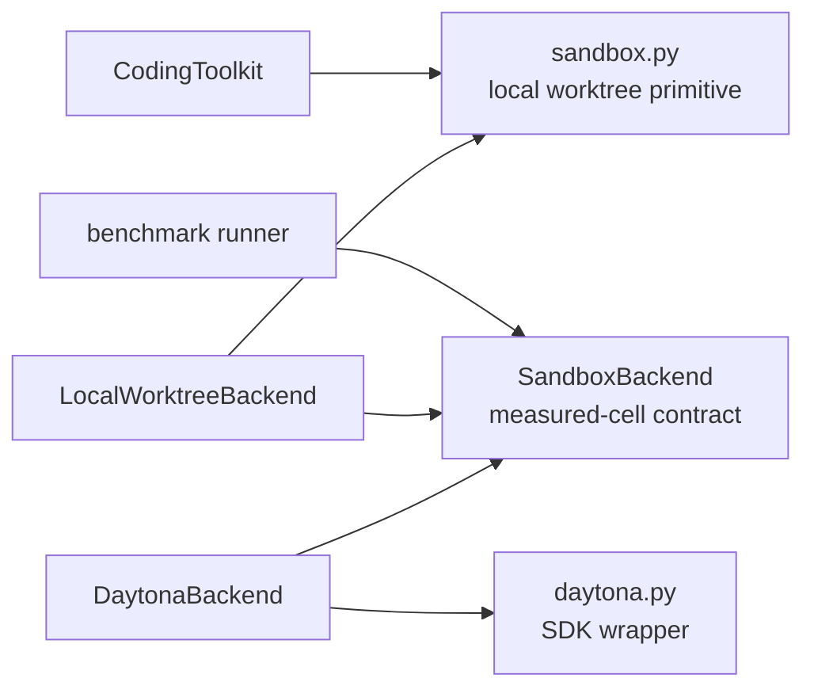

# ADR-0090: Local sandbox and measured-cell backend seams

- **Status**: Proposed
- **Kind**: Retrospective
- **Area**: substrates
- **Date**: 2026-07-09
- **Relations**: supersedes v0-0079, v0-0080, v0-0089

## Context

Lionagi grew two related but non-equivalent local-execution surfaces. They share a Git-worktree
implementation, but they answer different questions and have different callers.

**P1 — “Sandbox” names two lifecycles.** `lionagi/tools/sandbox.py` is an interactive
Git-worktree primitive used directly by `CodingToolkit`. `lionagi/tools/sandbox_backend.py` is a
measured-cell adapter with provision, execute, collect, and teardown legs. Treating them as one
universal abstraction hides the fact that the first can merge a branch while the second always
tears a handle down without promotion.

**P2 — Backend variance needs a typed boundary.** A local worktree and a Daytona workspace do
not provision, execute, transfer files, or stream output the same way. The benchmark caller needs
one contract that exposes those differences as capabilities rather than backend-class branches.

**P3 — Prompt cells and exec cells have different authentication and execution placement.** A
local prompt cell is a host subprocess in a worktree and rejects explicit cell environment
variables. A Daytona adapter executes commands remotely and rejects prompt cells because it
cannot keep their provider call host-side. Calling both simply “remote execution” would erase the
load-bearing distinction.

**P4 — Vocabulary is ahead of enforcement.** `ExecutionTarget` and `ExecutionLimits` describe
host, worktree, remote, and process targets, but no flow, fanout, provider, or operation path reads
them. `ExecutionLimits` is not consulted by either adapter. `Capabilities` describes cold-start,
streaming, transfer, image-build, and prompt-cell support, but does not describe CPU, memory,
disk, provision-resource, or timeout enforcement.

**P5 — Lifecycle helpers expose partial-success states.** Diff collection stages changes; merge
does not prove the repository root is on the recorded base branch; cleanup marks a session
inactive even when removal fails; and the backend protocol returns no teardown result. A caller
cannot infer transactional promotion or complete cleanup from these interfaces.

**P6 — The measured-cell seam has one production-shaped consumer, not a control plane.** The
only non-test client is `benchmarks/orchestration/harness/runner.py`. Its optional backend path
provisions one workspace, runs one prompt-cell trial, collects one output artifact, and tears the
handle down. It accepts the local adapter and rejects Daytona by capability. Normal benchmark
entry points still call `run_once()` without a backend. `lionagi/operations/flow.py` and the CLI
flow/fanout worker builders do not consume `ExecutionTarget` or `SandboxBackend`.

The implemented module boundary is:

```text
lionagi/tools/
├── coding.py             CodingToolkit.sandbox action facade
├── sandbox.py            SandboxSession + five async worktree helpers
├── sandbox_backend.py    measured-cell types, protocol, adapters, registry
├── daytona.py            host-side async SDK wrapper
└── _subprocess.py        bounded subprocess output + timeout handling

benchmarks/orchestration/harness/
├── runner.py             optional measured-cell consumer
├── _cell_entry.py        prompt-cell subprocess entrypoint
└── test_runner_backend.py
```



| Concern | Decision |
|---|---|
| Interactive local worktree lifecycle | D1: Keep `SandboxSession` and its five module-level helpers as the direct `CodingToolkit` primitive. |
| Measured execution contract | D2: Keep the four-leg structural `SandboxBackend` protocol and its concrete Python data contracts. |
| Cell placement, events, and artifacts | D3: Preserve the shipped prompt/exec distinction and each adapter's exact execution semantics. |
| Backend selection | D4: Select registered adapters by name at construction and by `Capabilities` for workload suitability. |
| Architectural boundary | D5: Treat execution targets and limits as descriptive vocabulary until an execution caller enforces them; do not present this seam as flow routing or a general control plane. |

This ADR deliberately does **not** decide:

- Per-worker orchestration isolation; ADR-0091 owns that target because worker ownership,
  promotion, and restart recovery are not cell concerns.
- Recursive experiment proposal, scoring, or promotion; no such loop is implemented in this
  checkout, and the current seam must not imply one.
- Additional registered adapters. The closed runtime registry contains only
  `local_worktree | daytona`; other names fail.
- Process, credential, network, or resource security. A worktree separates Git state, while the
  local adapter still launches a host process with host filesystem reach.
- Automatic merge or artifact promotion from `SandboxBackend.teardown()`. Teardown is disposal,
  not acceptance of a result.

## Decision

### D1 — Keep the direct local-worktree lifecycle

`lionagi/tools/sandbox.py` remains the source of truth for interactive worktrees. The public
contract is a state-only dataclass plus five module-level async functions; `SandboxSession` has
no lifecycle methods of its own.

**The contract** (`lionagi/tools/sandbox.py`; `SandboxSession`, `create_sandbox`,
`sandbox_diff`, `sandbox_commit`, `sandbox_merge`, `sandbox_discard`):

```python
@dataclass
class SandboxSession:
    worktree_path: str
    branch_name: str
    base_branch: str
    repo_root: str
    is_active: bool = True

async def create_sandbox(
    repo_root: str,
    base_branch: str | None = None,
    name: str | None = None,
) -> SandboxSession: ...

async def sandbox_diff(session: SandboxSession) -> dict: ...
async def sandbox_commit(session: SandboxSession, message: str) -> dict: ...
async def sandbox_merge(session: SandboxSession) -> dict: ...
async def sandbox_discard(session: SandboxSession) -> dict: ...
```

The returned payloads are part of the shipped behavior:

```python
# sandbox_diff
{
    "files_changed": list[str],
    "stat": str,
    "patch": str,
    "patch_truncated": bool,
    "full_patch_chars": int,
}

# sandbox_commit, changed tree
{"success": True, "commit": str, "message": str}

# sandbox_commit, empty tree
{"success": True, "message": "Nothing to commit"}

# sandbox_commit, other failure
{"success": False, "error": str}

# sandbox_discard / cleanup fields merged into successful sandbox_merge
{
    "worktree_removed": bool,
    "branch_deleted": bool,
    "errors": list[str],
}
```

**Exact semantics**:

- On create with no `base_branch`, Git is asked for the current branch. An empty result falls
  back to the literal `main`; the Git return code from that probe is not independently checked.
- On create with no name, the branch is `sandbox-` plus eight random hexadecimal characters.
  The worktree path is `<repo_root>/.worktrees/<branch_name>`.
- `git worktree add -b <branch> <path> <base>` is authoritative. Any nonzero result raises
  `RuntimeError("Failed to create worktree: ...")`; there is no fallback or retry.
- Every Git subprocess has a fixed 30-second timeout inherited from `_run_git`. The module records
  no rationale for 30 seconds and does not expose it as configuration.
- Diff collection first runs `git add -A`. It therefore changes the index before reading the
  cached stat, patch, and file list. It does not provide a read-only diff mode.
- Diff collection does not inspect the return code of staging or any of the three diff commands;
  a Git failure can therefore produce a partial or empty payload instead of a raised/typed error.
- Diff returns at most 10,000 patch characters and records the original character count and a
  truncation flag. The source records no rationale for 10,000; callers needing the complete patch
  cannot obtain it from this helper.
- Commit also stages all changes and does not inspect that staging command's result. “Nothing to
  commit” in either stdout or stderr is treated as a successful no-op. Other commit errors are
  returned, not raised.
- Merge stages and attempts an automatic commit with message `sandbox: <branch>`, ignoring that
  commit's result. It then runs `git merge --no-ff <branch>` in `repo_root`.
- Merge does not check that `repo_root` currently has `session.base_branch` checked out and does
  not compare the target head with a recorded base SHA. A merge failure returns
  `{"success": False, "error": ...}` and leaves cleanup to the caller.
- Successful merge calls cleanup. Cleanup force-removes the worktree, force-deletes the branch,
  and then sets `session.is_active = False` even if either Git command failed.
- Cleanup reports only stderr strings containing the word `error`; a nonzero command with a
  differently worded diagnostic can yield a false-empty `errors` list. Repeated cleanup has no
  idempotent-success contract.

`CodingToolkit` owns one closure-local active session. `create` refuses a second active session;
all other actions refuse a missing session; `commit` requires a message. It clears the closure
state only after a successful merge, but clears it unconditionally after discard and wraps the
discard payload in `success=True`, even when its cleanup booleans are false. Later editor, bash,
or search calls are not automatically redirected to `session.worktree_path`; the tool response
tells the caller where to operate.

**Why this way**: the primitive is small, already covered by real temporary-repository tests, and
directly serves an interactive coding workflow. Folding promotion behavior into the measured-cell
protocol would make every backend pretend it can merge Git state, while replacing this primitive
would break the existing tool contract without producing a second need.

### D2 — Keep the four-leg measured-cell protocol

`lionagi/tools/sandbox_backend.py` owns a structural, runtime-checkable protocol. Adapters do not
inherit from a common base class; having the named methods is sufficient for runtime protocol
recognition.

**The contract** (`lionagi/tools/sandbox_backend.py`; data types and `SandboxBackend`):

```python
@dataclass(frozen=True, slots=True)
class ExecutionLimits:
    timeout_s: int | None = None
    cpu: int | None = None
    memory_mb: int | None = None
    disk_mb: int | None = None

@dataclass(frozen=True, slots=True)
class ExecutionTarget:
    kind: Literal[
        "host", "local_worktree", "daytona", "remote_agent", "process"
    ] = "host"
    cwd: str | None = None
    repo: str | None = None
    env: Mapping[str, str] = field(default_factory=dict)
    limits: ExecutionLimits = field(default_factory=ExecutionLimits)
    sandbox_id: str | None = None
    session_id: str | None = None
    metadata: Mapping[str, Any] = field(default_factory=dict)

    def for_worker(
        self, agent_id: str, *, cwd: str | None = None
    ) -> ExecutionTarget: ...

@dataclass(frozen=True, slots=True)
class Capabilities:
    cold_start: Literal["sub100ms", "seconds", "minutes"]
    streaming: bool
    mount_or_upload: Literal["mount", "upload"]
    image_build: bool
    hosts_prompt_cell_host_side: bool

@dataclass(frozen=True, slots=True)
class ProvisionSpec:
    repo_root: str
    base_branch: str | None = None
    name: str | None = None
    repo_url: str | None = None
    ref: str | None = None
    daytona_snapshot: str | None = None
    daytona_image: Any | None = None
    env: Mapping[str, str] = field(default_factory=dict)
    resources: Mapping[str, int] | None = None

@dataclass(slots=True)
class Handle:
    backend: Literal["local_worktree", "daytona"]
    remote_id: str | None
    remote_repo_path: str
    metadata: dict[str, Any] = field(default_factory=dict)

@dataclass(frozen=True, slots=True)
class Cell:
    kind: Literal["prompt_cell", "exec_cell"]
    entrypoint: str
    seed_inputs: Mapping[str, str | bytes] = field(default_factory=dict)
    artifact_manifest: Sequence[str] = ()
    env: Mapping[str, str] = field(default_factory=dict)
    timeout_s: int | None = None

@dataclass(slots=True)
class CellResult:
    exit_code: int
    stdout: str
    stderr: str = ""
    artifacts: dict[str, bytes] = field(default_factory=dict)
    events: list[SubstrateStreamEvent] = field(default_factory=list)

@runtime_checkable
class SandboxBackend(Protocol):
    async def provision(self, spec: ProvisionSpec) -> Handle: ...
    async def run_cell(
        self,
        handle: Handle,
        cell: Cell,
        on_event: Callable[[SubstrateStreamEvent], None] | None = None,
    ) -> CellResult: ...
    async def collect(
        self, handle: Handle, paths: Sequence[str]
    ) -> dict[str, bytes]: ...
    async def teardown(self, handle: Handle) -> None: ...
    def capabilities(self) -> Capabilities: ...
```

`ExecutionTarget.for_worker()` copies every field, uses the supplied `cwd` when truthy, and adds
`{"agent_id": agent_id}` to copied metadata. It does not provision anything and does not validate
the worker identifier.

**Exact lifecycle semantics**:

- Provision returns backend-owned state in `Handle`. The local adapter stores a
  `SandboxSession` at `metadata["session"]`; the Daytona adapter stores a `DaytonaSandbox` at
  `metadata["sandbox"]`. These metadata keys are untyped and required by later legs.
- `run_cell` writes all seed inputs before execution and collects the declared artifacts only
  after the command returns. A nonzero exit is represented by `CellResult.exit_code`; it is not
  raised as an exception by either adapter.
- Exceptions from file writes, subprocess creation outside `_subprocess_sync`, remote execution,
  collection, or teardown propagate. The protocol has no common exception type.
- The protocol does not synthesize a teardown result. A caller that needs cleanup truth must use
  adapter-specific evidence; the benchmark caller logs and swallows teardown exceptions so a
  completed trial result is not masked.
- A provisioned handle is expected to be paired with teardown in a caller-owned `finally` block.
  The protocol does not enforce pairing, persist leases, or reconcile them after restart.
- `DIFF_ARTIFACT = "__diff__"` is a sentinel understood by both adapters. It asks for the
  workspace diff rather than a literal file with that name.

**Why this way**: four lifecycle legs are the least common denominator shared by the two shipped
adapters and the benchmark harness. `Handle` keeps backend state out of the protocol signature,
and the typed `Cell` makes the unit of execution one trial rather than an unstructured command.
The cost is an untyped metadata escape hatch, recorded as a delta rather than disguised.

### D3 — Preserve shipped cell, event, and artifact semantics

The adapters are deliberately not isolation-equivalent.

**Event contract** (`lionagi/tools/sandbox_backend.py`; `SubstrateStreamEvent`):

```python
@dataclass(frozen=True, slots=True)
class SubstrateStreamEvent:
    type: Literal["stdout", "stderr", "signal", "artifact", "result", "error"]
    content: str = ""
    metadata: Mapping[str, Any] = field(default_factory=dict)
```

The type vocabulary is wider than current emission. Both adapters emit `stdout`, optional
`stderr`, and a final `result` with `{"exit_code": int}`. Neither current adapter emits
`signal`, `artifact`, or `error` events. Operational exceptions are raised rather than converted
to `error` events.

#### Local adapter

`LocalWorktreeBackend.provision()` delegates to D1 and returns the worktree path. Its declared
capabilities are:

```python
Capabilities(
    cold_start="sub100ms",
    streaming=False,
    mount_or_upload="mount",
    image_build=False,
    hosts_prompt_cell_host_side=True,
)
```

`sub100ms` is a declared class inherited from the seam design, not a runtime measurement or SLA;
the implementation contains no benchmark or recorded rationale for the threshold.

Exact local execution cases:

- A prompt cell with any non-empty `cell.env` raises `ValueError` before writing seed inputs.
  Authentication remains host-side; only the explicit cell environment is forbidden.
- Seed input strings are UTF-8 encoded; bytes are written unchanged. Parent directories are
  created. Paths are joined as `Path(handle.remote_repo_path) / rel_path` without containment,
  absolute-path, `..`, or symlink validation.
- The subprocess runs with `shell=True` in the worktree. The host environment is not inherited
  wholesale: only `PATH`, `HOME`, `PYTHONPATH`, and `VIRTUAL_ENV` are copied when present, then
  `cell.env` is overlaid for exec cells.
- Timeout is `float(cell.timeout_s or 300)`. Consequently `None` and `0` both mean 300 seconds.
  The 300-second fallback is inherited and has no recorded rationale in this module.
- `_subprocess_sync` caps captured stdout and stderr independently at 100,000 bytes while
  continuing to drain the child. That cap protects the parent from unbounded captured output;
  the exact value has no recorded rationale.
- On timeout, the process group is terminated and the cell returns exit code `-1`, a timeout
  stderr message, and ordinary stdout/stderr/result events. The adapter does not add a typed
  timeout event.
- Because `streaming=False`, callbacks are invoked only after the subprocess finishes: one stdout
  event is always emitted, stderr only when non-empty, then result.
- A missing regular-file artifact becomes `b""`; directories and absent paths are
  indistinguishable. Artifact paths have the same unvalidated join behavior as seed inputs.
- The diff sentinel delegates to D1, so collection stages all changes and returns only the
  possibly 10,000-character-truncated patch as bytes.
- Teardown is a no-op if `metadata.get("session")` is absent. When present, it delegates to
  `sandbox_discard()` and discards that helper's cleanup payload.

#### Daytona adapter

`DaytonaBackend.provision()` calls `DaytonaSandbox.create()` with snapshot, image, environment,
resources, and `delete_on_exit=False`. It uses the remote home directory directly unless
`repo_url` is provided, in which case it clones into `<home>/repo`. A 40-character hexadecimal
`ref` is passed as a detached commit; every other non-empty ref is passed as a branch.

`DaytonaSandbox.create()` applies `resources` only when constructing from an image. Its snapshot
and default-snapshot branches do not pass resources to the SDK, even though the adapter supplied
the mapping. `ProvisionSpec.repo_root` is likewise not used by Daytona provisioning. These are
current projection rules, not portable resource enforcement.

Its declared capabilities are:

```python
Capabilities(
    cold_start="sub100ms",
    streaming=True,
    mount_or_upload="upload",
    image_build=True,
    hosts_prompt_cell_host_side=False,
)
```

Again, `sub100ms` is a declaration, not an enforced measurement.

Exact remote execution cases:

- Every prompt cell raises `ValueError`; there is no silent host or local fallback.
- Seed inputs are uploaded to `<remote_repo_path>/<rel_path>` without adapter-side path
  normalization or parent-directory creation.
- Exec cells pass `cell.env` to the remote command and stream stdout/stderr callbacks as chunks.
- `cell.timeout_s` is never read. `DaytonaSandbox.exec_stream()` has no timeout parameter, so a
  supplied cell timeout is ignored.
- A result event is emitted after remote completion. Exceptions propagate and do not produce a
  `CellResult` or `error` event.
- The diff sentinel calls `DaytonaSandbox.git_diff()`, which stages all changes before returning
  the cached diff. Unlike the local helper, this path does not impose the 10,000-character cap.
- Ordinary artifacts delegate to remote download. `DaytonaSandbox.download()` maps a remote
  `None` payload to `b""`; remote SDK errors still propagate.
- Teardown requires `metadata["sandbox"]` and calls `delete()`. It does not close the underlying
  client in this adapter-owned lifecycle; `DaytonaSandbox.__aexit__` is not used by the adapter.

`DaytonaSandbox.create()` itself defaults to a 15-minute automatic stop interval and a
180-second create timeout. `DaytonaBackend` accepts those defaults. The wrapper records no
rationale for either number, and neither is exposed by `ProvisionSpec`.

**Why this way**: the prompt/exec fork prevents a caller from silently moving a host-authenticated
prompt workload into a backend that cannot host it. Buffering local events reflects the
underlying synchronous subprocess helper; streaming remote chunks reflects the remote SDK. A
single stronger claim would be false for one of the adapters.

### D4 — Use registry names for construction and capabilities for suitability

The registered backend name is a closed literal:

```python
BackendName = Literal["local_worktree", "daytona"]

def get_backend(name: BackendName) -> SandboxBackend: ...

def select_backend_for_cell(
    cell: Cell,
    candidates: Sequence[SandboxBackend],
) -> SandboxBackend: ...
```

**Exact semantics**:

- `get_backend()` lazily constructs one process-global instance per name and returns the same
  object on later calls. The shared registry has no reset, configuration, or concurrency API.
- `local_worktree` constructs `LocalWorktreeBackend`; `daytona` constructs `DaytonaBackend`.
  Any other runtime string raises `ValueError("unknown sandbox backend: ...")`.
- `select_backend_for_cell()` reads `capabilities()` only. For a prompt cell it skips candidates
  that cannot host the provider call host-side. For an exec cell, the first candidate wins.
- Empty or unsuitable candidate lists raise `LookupError`; selection never provisions a fallback.
- Capability selection does not inspect streaming, image-build, transfer, limits, or resources.
  Those declarations remain available to callers but are not part of this selector's predicate.

**Why this way**: a name is needed to construct a configured backend, while class inspection is
the wrong suitability mechanism once an instance exists. First-match selection is deterministic
and minimal for the one current workload predicate. More elaborate ranking has no current caller.

### D5 — Keep the seam bounded to measured cells

The benchmark contract is:

```python
async def run_once(
    task: Task,
    config: OrchestrationConfig,
    trial: int,
    *,
    backend: str | None = None,
) -> RunResult: ...
```

With `backend=None`, it calls the pre-existing in-process body. With a backend, it:

1. resolves the registered adapter and rejects one without host-side prompt-cell support;
2. provisions `ProvisionSpec(repo_root=os.getcwd())`;
3. writes a pickled `(task, config, trial)` as `in.pkl`;
4. runs `_cell_entry.py in.pkl out.pkl` as a prompt cell;
5. uses `out.pkl` only when exit code is zero and the artifact is non-empty;
6. converts cell failure into a `RunResult.error`, using at most the final 2,000 diagnostic
   characters; and
7. attempts teardown in `finally`, logging but swallowing teardown failure.

The cell timeout is 1,800 seconds. The source gives the reason: a reactive flow may run many
turns across several spawned workers, so this is a runaway-process ceiling rather than a normal
trial duration target. The input/output pickle format is private to the same-process benchmark
entrypoint and is not a general wire protocol.

`ExecutionTarget` and `ExecutionLimits` remain codeless data. Repository search finds no consumer
outside their definition and focused tests. `ProvisionSpec.resources` reaches Daytona creation,
but `ExecutionLimits.cpu`, `memory_mb`, `disk_mb`, and `timeout_s` do not. Local provision ignores
`ProvisionSpec.env`, `resources`, `repo_url`, `ref`, snapshot, and image fields; the dataclass
explicitly permits backends to ignore fields they do not need.

**Why this way**: the current evidence supports a measured-cell adapter and one benchmark path.
Promoting the types into normal operation routing before a second production consumer exists
would turn descriptive fields into misleading promises. ADR-0091 reuses only the target-safe
worktree primitive and defines worker ownership independently.

## Consequences

The split keeps the direct coding workflow small while giving the benchmark harness a real,
structural backend seam. Tests can exercise a fake backend, a real temporary Git worktree, and an
injected fake Daytona object without importing or contacting the remote SDK.

Maintainers must know that the two teardown verbs mean different things: `sandbox_merge()` can
promote and then clean up, while `SandboxBackend.teardown()` only disposes. They must also inspect
capabilities before choosing a prompt-cell backend and cannot assume that a supplied limit was
enforced.

The current design deliberately gives up uniform resource ceilings, a typed handle state, path
containment, and restart reconciliation. Reversing D1 would break the public CodingToolkit action
payloads and Git lifecycle. Reversing D2-D4 would affect the benchmark and adapter tests but not
normal flow execution. Reversing D5 by routing orchestration through the seam is a broad change
owned by a separate ADR because it would connect the flow kernel, provider configuration, and
workspace lifecycle.

Failure costs are concrete: a wrong checked-out branch can receive a merge; incomplete cleanup can
be reported through an inactive session; an escaped seed/artifact path can reach outside the
workspace; a remote cell can outlive its requested timeout; and benchmark teardown failure is
only logged.

Counting `CodingToolkit`, the worktree primitive, the backend contract, the two adapters, the
Daytona wrapper, and the benchmark runner gives seven components; the six arrows in the component
diagram are their directed dependencies. Therefore `κ = 6 / (7 × 6) = 0.14`. Static test-surface
assessment is `τ = 0.86`: six of the seven component boundaries have focused unit or integration
coverage; target-branch-safe promotion remains uncovered and is a delta below.

## Current-vs-ideal delta

| # | Delta | Size | Issue |
|---|---|---|---|
| 1 | Make the local worktree lifecycle target-safe and truthful: record the base commit at creation, make diff collection non-staging, refuse promotion to an unverified target, and report idempotent cleanup success only after both worktree and branch cleanup complete. Acceptance: tests cover base advancement, wrong checked-out branch, merge conflict, repeated teardown, and partial cleanup failure without marking the lease clean. | M | (filled at issue-open time) |
| 2 | Make execution limits enforceable or explicitly unsupported per backend. Acceptance: timeout, CPU, memory, disk, and provision-resource support are declared in capabilities; both adapters either enforce each supplied value or reject it before execution, and Daytona applies or rejects `Cell.timeout_s`. | M | (filled at issue-open time) |
| 3 | Replace the untyped local-session entry in `Handle.metadata` with a typed lifecycle state or adapter-private handle. Acceptance: local provision, collect, and teardown no longer depend on `metadata["session"]`, and the fake-backend contract suite still exercises all four lifecycle legs. | S | (filled at issue-open time) |
| 4 | Constrain seed-input and artifact-manifest paths to the provisioned workspace. Acceptance: both adapters reject absolute paths, `..` traversal, and local symlink escapes before write or collection, while valid nested relative paths retain current byte behavior. | M | (filled at issue-open time) |

## Alternatives considered

### One universal execution-substrate package now

A top-level substrate package containing worktrees, measured cells, provider routing, and flow
execution would give one name to every execution concern and one place for future adapters. It
lost because only the measured-cell contract has a real non-test client, while flow/fanout do not
read the target types at all. The abstraction would couple unrelated lifecycles before their
shared invariants are known.

### Extend `SandboxSession` into the remote/backend handle

Adding backend, remote id, metadata, and execution methods directly to `SandboxSession` would
avoid a second lifetime type. It lost because the local primitive owns branch merge/discard state,
whereas the backend handle owns provision/run/collect/teardown state. A remote adapter has no
honest `base_branch` merge contract, and a measured-cell teardown must not imply promotion.

### Select workload support by adapter name or class

`if backend == "daytona"` is simple for two adapters and would make current selection explicit.
It lost because prompt-cell placement is a capability, not an identity. Tests already prove a
fake adapter can satisfy the protocol and participate in selection without inheriting either
concrete class.

### Route all flow/fanout operations through `SandboxBackend`

This would make the dormant target vocabulary active and could eventually enforce resource
limits. It lost for the current ADR because a cell carries seed inputs, one entrypoint, and an
artifact manifest, while a worker operation carries Branch state, provider configuration,
dependency context, spawning, and persistence hooks. ADR-0091 first defines the narrower source
workspace lease needed by concurrent coding workers.

### Treat unimplemented adapters and recursive measurement as current architecture

Carrying earlier Docker, process-provider, or recursive-loop designs forward would preserve more
aspiration. It lost because no corresponding registered backend, execution caller, or loop driver
exists in this checkout. Retrospective architecture records shipped contracts; deferred products
need fresh target ADRs when their callers exist.

### Make diff collection non-staging and complete in this record

That behavior would be safer for inspection and would remove the 10,000-character information
loss. It is the preferred ideal, but changing shipped behavior belongs to implementation work and
tests, not to a retrospective rewrite. The requirement is retained as delta 1.

## Notes

Interpretation uses *in pari materia* to resolve the overlapping sandbox records as one current
area while keeping their two APIs distinct. *Last in time* treats the implemented measured-cell
seam as authoritative over broader unimplemented executor and recursive-loop designs.

Primary code anchors: `lionagi/tools/sandbox.py`; `lionagi/tools/sandbox_backend.py`;
`lionagi/tools/daytona.py`; `lionagi/tools/_subprocess.py`; `lionagi/tools/coding.py`;
`benchmarks/orchestration/harness/runner.py`; `benchmarks/orchestration/harness/_cell_entry.py`.
