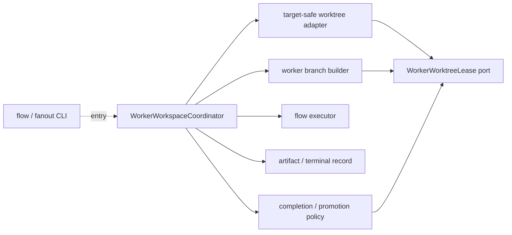
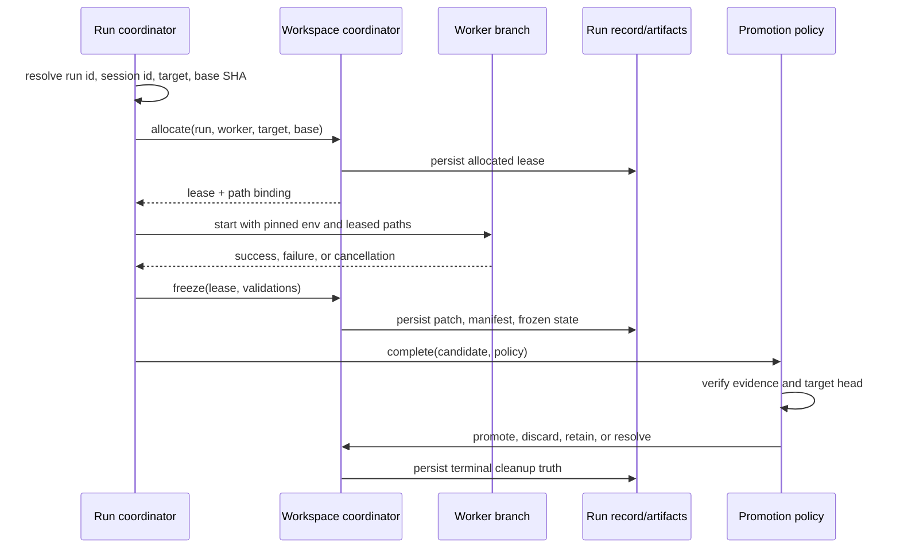

# ADR-0091: Per-Worker Worktree Execution Isolation

- **Status**: Proposed
- **Kind**: Aspirational
- **Area**: substrates
- **Date**: 2026-07-09
- **Relations**: extends ADR-0090; supersedes v0-0080 (in part)

## Context

Flow and fanout already create separate conversation branches and run-scoped artifact
directories, but those boundaries do not give workers separate source trees.

**P1 — Concurrent workers share one project checkout.**
`lionagi/cli/orchestrate/_orchestration.py:build_worker_branch()` makes a per-worker artifact
directory, sets the CLI provider's `repo` to that directory, and grants the same resolved project
root to every worker through `add_dir`. Reactive workers are retargeted to their own artifact
directory but receive that same project-root grant. Concurrent code-capable workers can therefore
read and modify the same checkout.

**P2 — The current executor has no workspace allocation phase.**
`lionagi/operations/flow.py` pre-allocates Branch objects and invokes operations concurrently in
the host process. Neither `DependencyAwareExecutor` nor the CLI worker builder accepts a
workspace lease. A prompt instruction cannot create enforceable ownership when the runtime keeps
granting the shared path.

**P3 — The existing worktree primitive is useful but not safe enough for unattended ownership.**
ADR-0090 records real create/diff/commit/merge/discard behavior, but the primitive does not record
a base SHA, verify the target branch, return truthful idempotent cleanup, constrain seed paths, or
reconcile leases after restart. Those deltas must close before it becomes the adapter beneath this
policy.

**P4 — Run identity is only partially propagated.**
`RunDir` allocates `run_id` as `YYYYMMDDTHHMMSS-<six hex characters>` and inherits an existing
`LIONAGI_RUN_ID` for subprocess handoff. Orchestration may construct a `Session` from
`LIONAGI_SESSION_ID`. No `LIONAGI_WORKER_ID` exists in the source tree, and worker construction
does not pin run/session identity into each worker environment. A retained patch, subprocess, or
worktree therefore lacks one enforced run-to-worker attribution tuple.

**P5 — Promotion has multiple terminal outcomes.** A successful worker can yield a reviewable
patch without merging, or it can be validated and promoted. A failed worker needs diagnostics but
must not merge. Target drift, merge conflict, cancellation, and cleanup failure are different
states; reducing them all to “done” makes recovery unsafe.

**P6 — Worktrees are source-state isolation, not a security sandbox.** A Git worktree has a
different index, working tree, and branch. It does not isolate the worker's process, home
directory, credentials, network, environment, or host resource usage. This ADR deliberately uses
the narrow meaning because it is the minimum boundary needed to stop concurrent source edits
from colliding.

The target adds one coordinator port between orchestration and the target-safe local adapter:



| Concern | Decision |
|---|---|
| Compatibility and opt-in | D1: Add `shared_host` and `worktree_per_worker` workspace modes; keep `shared_host` as the default. |
| Identity and path grants | D2: Bind one sanitized `(run_id, worker_id)` to one branch, worktree, artifact directory, and pinned environment. |
| Ownership and state | D3: Make a coordinator persist typed leases and terminal records; workers never merge or delete their own workspace. |
| Completion and promotion | D4: Default isolated work to `patch_only`; allow `merge_validated` only after validation and target-head checks in dependency order. |
| Restart and cleanup | D5: Reconcile nonterminal leases before new allocation and persist actual cleanup or bounded-retention outcomes. |

This ADR deliberately does **not** decide:

- Process, credential, network, home-directory, or CPU/memory isolation; a separate execution
  substrate must own those guarantees.
- Remote sandbox selection or the measured-cell contract from ADR-0090; worker Branch state is
  not represented as a `Cell` in this first policy.
- Automatic semantic conflict resolution. Git conflicts and unexpected target movement become
  `needs_resolution` records.
- Validation command contents. The flow or project supplies declared validation checks; this ADR
  only defines the evidence needed before promotion.
- Cross-run scheduling or distributed leases. The coordinator is local to one orchestration run
  and one source repository.

## Decision

### D1 — Add an explicit workspace policy with a compatibility default

`shared_host` remains the default and preserves current behavior. `worktree_per_worker` is opt-in
until its adapter satisfies ADR-0090's target-safety deltas and the orchestration integration has
contract tests.

**The contract** (target, Python-native):

```python
import time
from typing import Literal

from pydantic import BaseModel, ConfigDict, Field, model_validator

WorkspaceMode = Literal["shared_host", "worktree_per_worker"]
CompletionPolicy = Literal["patch_only", "merge_validated"]
WorkerLeaseState = Literal["allocated", "running", "frozen", "terminal"]
WorkerTerminalStatus = Literal[
    "promoted",
    "discarded",
    "retained",
    "needs_resolution",
    "teardown_failed",
]

class WorkspacePolicy(BaseModel):
    model_config = ConfigDict(frozen=True, extra="forbid")

    mode: WorkspaceMode = "shared_host"
    completion: CompletionPolicy = "patch_only"
    retain_worktree_on_resolution: bool = False
    retention_until: float | None = None

    @model_validator(mode="after")
    def bounded_retention(self) -> "WorkspacePolicy":
        if self.retain_worktree_on_resolution and self.retention_until is None:
            raise ValueError("retained worktrees require retention_until")
        if self.retention_until is not None and self.retention_until <= time.time():
            raise ValueError("retention_until must be in the future")
        return self
```

There is no inherited retention duration. The default is not to retain the worktree; the patch,
artifact manifest, and diagnostics remain in run artifacts. If a caller opts into worktree
retention, it must supply an absolute expiry. This avoids inventing a one-day or one-week lease
with no evidence while still making unbounded retention unrepresentable.

**Exact semantics**:

- `shared_host` allocates no worktree lease and runs the current worker builder unchanged.
- `worktree_per_worker` requires the coordinator described below. Failure to allocate is a worker
  startup failure; there is no fallback to `shared_host` after the mode was explicitly selected.
- `patch_only` is the isolated-mode default because it preserves a reviewable artifact without
  mutating the target branch. `merge_validated` is an explicit higher-authority policy.
- `retain_worktree_on_resolution=False` still produces `needs_resolution` when appropriate, but
  keeps diagnostics as artifacts and removes the worktree. `True` requires a future timestamp and
  produces `retained` only after the retention record is durable.
- Policy is resolved once per run before the immutable base SHA is read. Workers cannot override
  it through prompts or tool calls.

**Why this way**: compatibility matters because current flow/fanout behavior is host-based. An
opt-in mode creates a measurable migration boundary. Patch-first completion minimizes target-branch
mutation while the new lease and recovery machinery proves itself.

### D2 — Bind worker identity to paths and environment

The coordinator resolves one target branch and immutable base commit before starting any isolated
worker. It uses existing `RunDir` and `Session` identities rather than creating a second run-id
system.

**The lease contract**:

```python
from pathlib import Path

class WorkerWorktreeLease(BaseModel):
    model_config = ConfigDict(frozen=True, extra="forbid")

    run_id: str
    session_id: str
    worker_id: str
    target_branch: str
    base_sha: str
    expected_target_sha: str
    branch_name: str
    worktree_path: Path
    artifact_path: Path
    state_path: Path
    state: WorkerLeaseState = "allocated"
    created_at: float

class WorkerPathBinding(BaseModel):
    model_config = ConfigDict(frozen=True, extra="forbid")

    cwd: Path
    provider_repo: Path
    source_roots: tuple[Path, ...]
    writable_artifact_root: Path
    env: dict[str, str]
```

The concrete layout is:

```text
<repo>/.worktrees/lionagi/<run_id>/<worker_id>/   # worktree_path
<run.state_root>/workspaces/<worker_id>.json      # state_path
<run.artifact_root>/<worker_id>/                  # artifact_path
lionagi/<run_id>/<worker_id>                      # branch_name
```

`run_id` and `worker_id` must first pass the repository's path-component guard and a Git-ref
component validator. The normalized pair must be injective: if two raw identifiers normalize to
the same pair, allocation fails rather than reusing the path or branch. Existing worktree, branch,
or state-record collisions also fail before the worker starts.

The environment and provider binding are exact:

```python
WorkerPathBinding(
    cwd=lease.worktree_path,
    provider_repo=lease.worktree_path,
    source_roots=(lease.worktree_path,),
    writable_artifact_root=lease.artifact_path,
    env={
        "LIONAGI_RUN_ID": lease.run_id,
        "LIONAGI_SESSION_ID": lease.session_id,
        "LIONAGI_WORKER_ID": lease.worker_id,
    },
)
```

**Exact semantics**:

- `base_sha` is the commit resolved from `target_branch` before any allocation. Every worker in
  the run starts from this same SHA unless a future ADR defines staged-base allocation.
- `expected_target_sha` initially equals `base_sha`. The coordinator may advance it only to a
  commit promoted earlier by the same run in declared dependency order.
- Worker child processes inherit the three identity variables exactly. They do not call
  `allocate_run()` to create a new identity.
- The worktree is the provider working directory and only source root. The artifact directory is
  a separate writable non-source grant. The shared checkout and sibling worktrees/artifacts are
  not placed in provider `add_dir` or tool allowlists.
- Every code-capable tool must receive `WorkerPathBinding`, resolve relative paths under the
  worktree or artifact root, and reject escapes. A prompt mentioning the host checkout does not
  create a path grant.
- Reactive workers receive a new lease keyed by their emitted `worker_id`; cloning a Branch does
  not clone its parent's workspace binding.

**Why this way**: the enforced tuple `(run_id, session_id, worker_id)` makes worktree, artifacts,
subprocesses, and terminal records attributable. One immutable base allows deterministic patch
comparison. Keeping artifacts outside the source tree avoids accidentally promoting diagnostic
files.

### D3 — Give the coordinator exclusive lease ownership

Workers can operate inside a lease but cannot merge, discard, retain, or mark it clean. The
coordinator owns every state transition and persists it before exposing the next phase.

**The coordinator and record contracts**:

```python
class ValidationResult(BaseModel):
    model_config = ConfigDict(frozen=True, extra="forbid")

    name: str
    passed: bool
    exit_code: int | None = None
    evidence_ref: str | None = None

class WorkerCandidate(BaseModel):
    model_config = ConfigDict(frozen=True, extra="forbid")

    lease: WorkerWorktreeLease
    patch_ref: str
    patch_sha256: str
    files_changed: tuple[str, ...]
    artifact_manifest_ref: str
    validations: tuple[ValidationResult, ...] = ()
    worker_succeeded: bool
    cancelled: bool = False

class WorkerWorktreeRecord(BaseModel):
    model_config = ConfigDict(frozen=True, extra="forbid")

    lease: WorkerWorktreeLease
    policy: CompletionPolicy
    status: WorkerTerminalStatus
    patch_ref: str | None
    promoted_commit: str | None
    teardown_errors: list[str]
    worktree_removed: bool
    branch_deleted: bool
    retention_until: float | None = None
    completed_at: float

class WorkerWorkspaceCoordinator(Protocol):
    async def allocate(
        self,
        *,
        run: RunDir,
        session_id: str,
        worker_id: str,
        target_branch: str,
        base_sha: str,
    ) -> WorkerWorktreeLease: ...

    async def mark_running(
        self, lease: WorkerWorktreeLease
    ) -> WorkerWorktreeLease: ...

    async def freeze(
        self,
        lease: WorkerWorktreeLease,
        *,
        worker_succeeded: bool,
        cancelled: bool,
        validations: tuple[ValidationResult, ...],
    ) -> WorkerCandidate: ...

    async def complete(
        self,
        candidate: WorkerCandidate,
        policy: WorkspacePolicy,
    ) -> WorkerWorktreeRecord: ...

    async def reconcile(
        self, run: RunDir, policy: WorkspacePolicy
    ) -> list[WorkerWorktreeRecord]: ...
```

The persisted state machine is:

```mermaid
stateDiagram-v2
    [*] --> allocated: lease record fsynced
    allocated --> running: worker path grants installed
    running --> frozen: new actions stopped; patch and manifest captured
    frozen --> terminal: completion policy and cleanup recorded
    allocated --> terminal: startup failure / reconciliation
    running --> terminal: cancellation / recovery failure
```



**Exact semantics**:

- Allocation creates the branch and worktree from `base_sha`, then durably writes the lease before
  returning it. If persistence fails, the coordinator removes what it created or records
  `teardown_failed`; it never starts the worker with an unrecorded lease.
- `mark_running` occurs only after provider and tool path grants match the lease.
- `freeze` stops new worker operations first, then captures a complete, non-staging patch, changed
  file list, artifact manifest, and declared validation evidence. Patch contents are stored as an
  artifact; `patch_sha256` detects later mutation.
- A missing patch is different from an empty patch. Missing capture is a completion failure;
  an empty patch is a valid candidate and results in `discarded` with retained diagnostics.
- Workers have no reference to coordinator promotion or teardown methods. Tool registration must
  not expose D1's direct merge/discard helpers inside an isolated lease.
- The orchestration caller wraps every returned lease in a `finally`-style completion path. If
  worker startup, execution, freeze, or normal completion raises, the coordinator still captures
  available diagnostics and attempts terminal cleanup; an exception cannot abandon an allocated
  lease as an unrecorded side effect.
- Every transition writes a replacement state record atomically. The terminal record is the
  source of truth; in-memory session flags are not.

**Why this way**: exclusive ownership prevents two workers from racing merges or cleanup. A
frozen candidate gives completion policy immutable evidence and separates “worker finished” from
“target mutated.”

### D4 — Complete as patch-only or validated promotion

Completion consumes a frozen candidate and yields exactly one terminal record.

#### `patch_only`

- The coordinator retains `patch_ref`, manifest, and diagnostics in run artifacts.
- It does not commit or merge the worker branch.
- It tears down the worktree and branch.
- A fully successful cleanup records `discarded`; incomplete cleanup records `teardown_failed`.
- Worker success does not change this outcome: patch-only means “produce reviewable evidence,” not
  “promote.”

#### `merge_validated`

Promotion is permitted only when all of these are true:

1. `worker_succeeded is True` and `cancelled is False`;
2. at least the validations declared by the run are present, and every declared validation has
   `passed=True`;
3. the candidate patch hash still matches the frozen artifact;
4. the repository is on `lease.target_branch`;
5. the target head equals `lease.expected_target_sha`; and
6. dependency predecessors have terminal records in the required order.

When all checks pass, the coordinator commits the worker-owned change set on its branch, merges it
with `--no-ff` into the verified target, records the resulting target commit as
`promoted_commit`, advances the expected head for dependent promotions in this run, and tears the
lease down. Full success records `promoted`; successful merge with incomplete cleanup records
`teardown_failed` while retaining `promoted_commit` so the target mutation is not lost.

**Failure and empty cases**:

- Worker failure, cancellation, or failed validation never attempts a merge. Diagnostics and the
  patch are retained as artifacts, cleanup runs, and the record is `discarded` unless cleanup is
  incomplete.
- An empty patch never creates an empty promotion commit; it follows the discarded cleanup path.
- Unexpected target movement that was not a recorded earlier promotion in this run yields
  `needs_resolution`. No rebase or merge is attempted automatically.
- A merge conflict aborts the merge, captures conflict diagnostics, and yields
  `needs_resolution`. It does not choose conflict resolutions or continue later promotions that
  depend on this worker.
- With default retention policy, `needs_resolution` retains artifacts but removes the worktree.
  With explicit bounded retention, the coordinator records the expiry and yields `retained` only
  after confirming the worktree and branch still exist.
- Promotion ordering follows DAG dependency order, not worker completion time. Independent
  candidates may be reviewed concurrently, but target mutation is serialized.

**Why this way**: patch-only is reversible and reviewable. Validated promotion is useful, but it
must be a coordinator decision based on immutable evidence and a verified target head. Serial
target mutation is the smallest honest policy for Git, whose branch update is not a multi-worker
transaction.

### D5 — Reconcile restart, collision, and teardown truthfully

Before allocating any new isolated worktree for a resumed run, the coordinator scans
`<run.state_root>/workspaces/*.json` and reconciles every nonterminal lease.

**Exact restart semantics**:

- A lease record, branch, and worktree that all agree on run id, worker id, branch name, and base
  ancestry may be recovered under the persisted policy. Recovery never changes the base SHA.
- A recorded lease with a missing worktree is terminalized as `teardown_failed` unless both the
  branch and worktree are provably already removed, in which case cleanup booleans record that
  fact and the prior non-promotion outcome may complete as `discarded`.
- An unrecorded matching worktree or multiple possible worktrees is ambiguous. The coordinator
  does not adopt it; it records a diagnostic and refuses new allocation for that worker id.
- A frozen candidate can resume completion only when the patch hash and artifact manifest still
  match. It is never promoted merely because a commit exists on its branch.
- A running lease has no proof that worker actions completed. It is frozen for diagnostics and
  follows failure/cancellation policy; recovery does not restart arbitrary operations.
- Expired retained worktrees are torn down before new allocation. Partial teardown remains
  `teardown_failed` and is retried only through explicit reconciliation.
- The `(run_id, worker_id)` pair is never reused, including after terminal cleanup. A rerun uses a
  new worker identifier or run id.

Teardown must independently record worktree removal and branch deletion. It marks the lease clean
only when both are complete. Repeated teardown treats already-absent, record-matching resources as
successful; a resource occupied by an unrelated branch or path is an error, not “already clean.”

**Why this way**: restart is precisely when in-memory ownership disappears. Persisted, verified
state prevents a resumed coordinator from promoting unvalidated changes or reusing ambient Git
state. Truthful component cleanup makes operator action possible without claiming more than Git
proved.

The end-to-end sequence is:



## Consequences

Concurrent workers gain separate Git source state, deterministic attribution, and coordinator-owned
promotion without requiring a remote control plane. Artifact ownership and teardown outcomes
become auditable, and a failed worker cannot silently merge into whichever branch happens to be
checked out.

Worktree creation, patch capture, state persistence, and serialized promotion add latency and
failure modes. Workers based on the same SHA may conflict during ordered promotion. Disk use
grows with concurrency and explicit retention, which is why retention requires an expiry and the
default removes the worktree.

Contributors must understand two roots per worker: the source worktree and the artifact directory.
They must route every code-capable tool through the same binding, not merely configure the CLI
provider. Reversing D1 is cheap while the mode is opt-in; reversing D2-D5 after terminal records
exist requires a record migration and cleanup tooling because branch/path identity becomes durable.

This mode does not protect host credentials or processes. Workloads requiring that protection
need a separate execution-isolation policy rather than stronger claims about worktrees.

Counting the coordinator, lease port, worktree adapter, worker builder, flow executor, artifact
record, and promotion policy gives seven components. The coordinator depends on five ports, and
the adapter, builder, and promotion policy each depend on the lease port, giving eight directed
dependencies and `κ = 8 / (7 × 6) = 0.19`. Its testability target is `τ = 0.90`: allocation,
identity propagation, path confinement, terminal policy, recovery, and teardown can use fake
leases, while promotion conflicts require temporary-repository integration tests.

## Alternatives considered

### Keep one shared checkout and rely on artifact directories

This preserves current behavior and has no worktree overhead. Per-worker artifacts do separate
outputs, but they do not separate source edits because every worker receives the same project-root
grant. It lost because P1 is specifically a source-collision problem.

### Create one worktree for the whole run

This would protect the host checkout from the run while keeping allocation and cleanup simple.
It lost because concurrent workers would still share one index and working tree, so writes could
overwrite each other and no worker-owned patch could be attributed reliably.

### Copy the repository per worker

Copies provide filesystem independence without Git worktree bookkeeping and can survive branch
deletion. They lost because they duplicate repository data, lose a shared object database,
complicate base/target ancestry checks, and still need a promotion protocol. Git worktrees already
provide the source-state primitive with lower disk cost.

### Serialize workers behind a shared-checkout lock

A lock would prevent simultaneous writes and avoid promotion conflicts. It lost because it removes
the concurrency flow/fanout is designed to provide, and it still leaves ownership, cancellation,
restart, and wrong-target merge semantics unresolved.

### Let each worker merge or discard its own worktree

This reduces coordinator surface and makes the worker lifecycle self-contained. It lost because
workers complete out of dependency order, can observe stale target heads, and cannot safely decide
whether their own validation is sufficient. A prompt-driven worker must not hold target mutation
authority.

### Route the whole worker through `SandboxBackend`

The measured-cell seam would provide provision/run/collect/teardown and a path toward other
backends. It lost for the first local policy because a flow worker has Branch history, dependency
context, spawning, persistence hooks, and provider/tool grants that a `Cell` does not carry.
Worker workspace ownership is the smaller contract needed now; execution placement can compose
later through a separate ADR.

### Make `merge_validated` the isolated-mode default

Automatic integration would reduce review steps and make successful runs immediately useful. It
lost because the new path has not yet proved target-head validation, conflict retention, or restart
reconciliation. `patch_only` preserves all work as an auditable artifact and keeps target mutation
explicit.

### Retain every failed or conflicted worktree indefinitely

This maximizes debugging evidence. It lost because disk consumption grows with failures and stale
worktrees block deterministic identifiers. Artifacts are the durable default; live worktree
retention is explicit and must expire.

## Notes

Interpretation uses *contra proferentem* to keep “isolation” at the minimum source-workspace scope.
The *constitutional* canon avoids connecting the flow kernel, provider routing, measured cells,
and remote execution before those wider contracts have executable consumers.

Current-code anchors used to define the insertion points:
`lionagi/cli/orchestrate/_orchestration.py`; `lionagi/cli/orchestrate/flow.py`;
`lionagi/cli/orchestrate/fanout.py`; `lionagi/cli/_runs.py`;
`lionagi/operations/flow.py`; `lionagi/tools/sandbox.py`.
