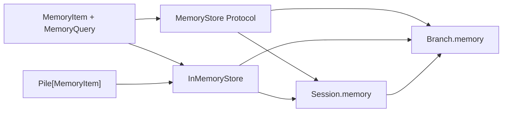

# ADR-0092: Minimal Branch and Session Memory Store

- **Status**: Proposed
- **Kind**: Retrospective
- **Area**: substrates
- **Date**: 2026-07-09
- **Relations**: supersedes v0-0090

## Context

Lionagi now has a small memory seam, but the word “memory” also appears near message persistence,
embedding configuration, context compaction, and external prompt injection. This ADR records only
the contract that actually ships and makes its semantic limits explicit.

**P1 — A structural store needs a stable data shape.** An adapter cannot satisfy
`store`/`retrieve`/`search` portably unless callers agree on item identity, content, tags,
metadata, query fields, and return types.

**P2 — Method compatibility is weaker than search equivalence.** The protocol-level tests can
require a returned UUID, identity retrieval, and typed results, but they cannot truthfully require
every backend to share `InMemoryStore`'s substring matching, tag logic, insertion order, or
read-after-write search timing.

**P3 — Branch/session ownership determines query scope.** A standalone `Branch` needs a default
without setup; branches included in a `Session` need a shared default; an explicitly supplied
branch store must not be overwritten during inclusion or reparenting. A query-level implicit scope
would conflict with these object-ownership rules.

**P4 — The default must stay independent of CLI persistence.** `StateDB` persists messages and
run state for CLI/Studio surfaces, but a library `Branch` works without opening it. Making the
default memory store depend on that lifecycle would turn a zero-configuration library feature
into a file/schema concern.

**P5 — Adjacent storage/embedding surfaces are disconnected.** `AppSettings` still defines seven
storage and embedding fields with defaults, and the `messages` table still has a nullable
`embedding` column. Repository search finds no runtime consumer of those settings and no producer
that assigns message embeddings. They are not configuration for `MemoryStore`.

**P6 — The seam is available but not automatic.** No normal branch operation, tool, engine, or
CLI path calls `MemoryStore.store`, `retrieve`, or `search`. Applications opt in by accessing
`.memory`; no conversational turn is auto-stored, embedded, recalled, or injected by this seam.

The implemented component and ownership boundary is:



| Concern | Decision |
|---|---|
| Data and public surface | D1: Keep `MemoryItem` and `MemoryQuery` as the public Python-native schemas and export all four memory names. |
| Portable backend boundary | D2: Keep exactly three async `MemoryStore` methods and the narrow cross-backend contract fence. |
| Built-in behavior | D3: Keep `InMemoryStore` as the sole built-in backend and record its exact `Pile`-based semantics. |
| Branch/session ownership | D4: Keep lazy read-only direct references and “first claim wins” session sharing. |
| Architectural exclusions | D5: Keep automatic recall, durability, lifecycle management, and disconnected config/schema surfaces outside the current memory seam. |

This ADR deliberately does **not** decide:

- External-adapter fidelity, projection, availability, or lifecycle contracts; ADR-0093 owns that
  aspirational extension.
- Graph traversal or relationship-aware knowledge operations. Three memory methods do not form a
  graph-store API.
- Message-history compaction. Context tooling changes a Branch's active message view and does not
  implement `MemoryStore`.
- Automatic turn storage, summarization, embedding, or recall. No current consumer requires or
  invokes those behaviors.
- A portable ranking formula or metadata filter vocabulary. The current open mapping needs a
  follow-up delta before durable adapters can claim equivalent query behavior.

## Decision

### D1 — Keep the shipped item/query schemas and exports

`lionagi/protocols/memory.py` is the source of truth. `MemoryItem` extends `Element`; it does not
introduce a second identity hierarchy.

**The contract** (`lionagi/protocols/memory.py`; `MemoryItem`, `MemoryQuery`):

```python
class Element(BaseModel, Observable):
    id: UUID = Field(default_factory=uuid4, frozen=True)
    created_at: float = Field(default_factory=<UTC timestamp>, frozen=True)
    metadata: dict = Field(default_factory=dict)

class MemoryItem(Element):
    content: Any = None
    tags: list[str] = Field(default_factory=list)

class MemoryQuery(BaseModel):
    text: str | None = None
    tags: list[str] | None = None
    filters: dict[str, Any] | None = None
    limit: int = 20
```

`Element` also fixes these relevant semantics (`lionagi/protocols/generic/element.py`):

- `id` accepts a UUID or UUID string at validation and serializes as a string.
- `created_at` accepts a float, datetime, or parseable string and is stored as a UTC timestamp.
- `metadata` is coerced to a dictionary where possible and rejects a mismatched `lion_class`.
- Extra `MemoryItem` fields are forbidden through `Element.model_config`.
- Element equality and hashing use only `id`; equality is not a field-by-field fidelity check.

`MemoryQuery` has no explicit validators or constrained fields. In particular, `limit` has no
minimum, and empty strings/lists/maps are valid inputs. D3 records what the reference backend does
with those values rather than implying stronger validation.

The names are re-exported from both public surfaces:

```text
lionagi.protocols.types
├── MemoryItem
├── MemoryQuery
├── MemoryStore
└── InMemoryStore

lionagi (lazy import map and __all__)
├── MemoryItem
├── MemoryQuery
├── MemoryStore
└── InMemoryStore
```

**Exact empty/error semantics**:

- `MemoryItem()` is valid with `content=None`, `tags=[]`, generated UUID and timestamp, and empty
  metadata.
- `MemoryQuery()` is valid and means no text/tag/filter predicates with a final limit of 20 in the
  reference implementation.
- The schemas do not validate that tags are unique or non-empty and do not define reserved
  metadata/filter keys.
- Schema validation errors are ordinary Pydantic errors; there is no memory-specific schema error.

**Why this way**: `Element` supplies the same identity/provenance shape used elsewhere in the
library, while a typed query avoids embedding a service-specific query-string grammar in core.
The small schemas keep adapter entry cheap, but the unbounded filter mapping is explicitly a
portability risk rather than an implicit universal DSL.

### D2 — Keep exactly three async protocol methods

**The contract** (`lionagi/protocols/memory.py`; `MemoryStore`):

```python
@runtime_checkable
class MemoryStore(Protocol):
    async def store(self, item: MemoryItem) -> UUID: ...
    async def retrieve(self, item_id: UUID) -> MemoryItem | None: ...
    async def search(self, query: MemoryQuery) -> list[MemoryItem]: ...
```

The protocol is structural. An adapter does not subclass `InMemoryStore` or register with a
backend registry. Passing `isinstance(adapter, MemoryStore)` checks that the runtime-checkable
members exist; it does not prove signature, async, fidelity, ordering, consistency, or failure
semantics.

The current cross-backend fence in `tests/protocols/test_memory.py` runs against
`InMemoryStore` and a bare fake implementor. It pins only these portable observations:

| Operation | Portable observation exercised today |
|---|---|
| Runtime shape | `isinstance(store, MemoryStore)` is true. |
| `store(item)` | Returns a `UUID` equal to `item.id`. |
| `retrieve(id)` after store | Returns a `MemoryItem` with matching `id`, `content`, and `tags`. |
| `retrieve(unknown_uuid)` | Returns `None`. |

It does **not** currently assert `created_at` or `metadata` fidelity. It also does not assert
search ordering, matching rules, ranking, error mapping, immediate search visibility, or
cross-process durability. Those omissions are intentional and are the reason ADR-0093 adds a
declared fidelity profile for external adapters.

**Exact method-boundary semantics**:

- `store` is create-or-replace by identifier in the reference backend, but the protocol text does
  not separately define insert conflicts or updates.
- `retrieve` is identity lookup, not ranked recall. Unknown identity is the only portable miss
  shape and returns `None`.
- `search` returns a concrete list of `MemoryItem`, not an iterator, score tuple, or page object.
- The protocol has no close, update, delete, transaction, batch, health, score, or namespace
  method. Backends may expose extra APIs, but Branch and Session do not call them.
- No exception hierarchy is defined. Backend exceptions currently propagate unchanged.

**Why this way**: three methods are sufficient for the current access seam and easy to satisfy
structurally. Adding lifecycle, ranking, mutation, or transaction methods before a core consumer
exists would couple Branch/Session to service-specific concerns. The cost is that semantic
interchangeability must be declared outside the base protocol.

### D3 — Keep the `Pile`-backed reference semantics

**The contract** (`lionagi/protocols/memory.py`; `InMemoryStore`):

```python
class InMemoryStore:
    def __init__(self) -> None:
        self._items: Pile[MemoryItem] = Pile(item_type={MemoryItem})

    async def store(self, item: MemoryItem) -> UUID:
        await self._items.ainclude(item)
        return item.id

    async def retrieve(self, item_id: UUID) -> MemoryItem | None:
        return await self._items.aget(item_id, None)

    async def search(self, query: MemoryQuery) -> list[MemoryItem]:
        results = list(self._items.values())
        if query.text:
            needle = query.text.lower()
            results = [r for r in results if needle in str(r.content).lower()]
        if query.tags:
            wanted = set(query.tags)
            results = [r for r in results if wanted & set(r.tags)]
        if query.filters:
            results = [
                r for r in results
                if all(r.metadata.get(k) == v for k, v in query.filters.items())
            ]
        return results[: query.limit]
```

**Exact store/retrieve semantics**:

- `Pile` accepts `MemoryItem` and subclasses because `strict_type` is not enabled.
- First storage appends the UUID to `Pile.progression` and the item to the UUID-keyed collection.
- Storing another item with the same UUID replaces the mapped object but does not append or move
  the UUID in progression. The returned UUID is still the item's own id.
- A stored object is visible to identity retrieval immediately in the same process.
- Missing identity returns `None` because `aget` receives that default. The reference backend
  does not log or distinguish “never existed” from “replaced/removed”; it has no removal method.
- State is an instance field only. A fresh store or process restart is empty; there is no snapshot,
  file, or migration path.

**Exact search semantics**:

- Search snapshots `Pile.values()` in progression order, then applies predicates in the order
  text, tags, filters, limit.
- Text matching is case-insensitive substring matching over `str(item.content)`. It is not token,
  fuzzy, embedding, or semantic search.
- `text=None` and `text=""` apply no text predicate because the check is truthiness-based.
- Tags use **any-of** matching: the requested and item tag sets need at least one shared value.
  Matching is case-sensitive and duplicate-insensitive because both sides are converted to sets.
- `tags=None` and `tags=[]` apply no tag predicate.
- Filters use **all-of** equality against `item.metadata.get(key)`. A missing key behaves like
  value `None`, so a filter value of `None` matches both a missing key and an explicit `None`.
- `filters=None` and `{}` apply no metadata predicate.
- Different predicate groups combine with AND because each filters the prior result list.
- With no predicates, search returns all items in progression order, truncated by the limit.
- `limit=0` returns `[]`. A positive limit returns at most that many items. A negative limit uses
  normal Python slicing and drops the final `abs(limit)` matches; it is not rejected. There is no
  recorded rationale for permitting negative values, and delta 2 must resolve portable limit
  validation before a durable adapter ships.
- Search returns item objects, not copies. Mutating mutable fields on a returned `MemoryItem`
  mutates the same object held by the in-process store.

`Pile.ainclude()` and `aget()` use the Pile's async synchronization. `search()` calls
`Pile.values()` and performs an in-process snapshot without acquiring the store's own explicit
lock. This ADR therefore records thread/async-aware storage primitives but does not claim a
linearizable search snapshot under concurrent mutation.

**Why this way**: `Pile` is already a UUID-keyed ordered primitive in core and adds no dependency
or setup. Its scan is simple and deterministic for small process-local use. Durability, semantic
ranking, and strong concurrent snapshot semantics would require a materially different backend
and are left to the seam.

### D4 — Keep lazy, read-only ownership with first claim winning

Branch and Session expose a direct `MemoryStore` reference. There is no proxy or manager between
the caller and the store.

**The Branch contract** (`lionagi/session/branch.py`; constructor and `memory`):

```python
class Branch(Element, Relational):
    _memory: MemoryStore | None = PrivateAttr(None)

    def __init__(
        self,
        *,
        # other Branch parameters omitted
        memory: MemoryStore | None = None,
        **kwargs,
    ):
        super().__init__(**kwargs)
        self._memory = memory
        ...

    @property
    def memory(self) -> MemoryStore:
        if self._memory is None:
            self._memory = InMemoryStore()
        return self._memory
```

**The Session contract** (`lionagi/session/session.py`; constructor, `memory`,
`include_branches`, `remove_branch`):

```python
class Session(Node, Relational):
    _memory: MemoryStore | None = PrivateAttr(default=None)

    def __init__(self, *, memory: MemoryStore | None = None, **kwargs: Any): ...

    @property
    def memory(self) -> MemoryStore:
        if self._memory is None:
            self._memory = InMemoryStore()
        return self._memory

    def include_branches(self, branches):
        # ownership preflight omitted
        ...
        if branch._memory is None:
            branch._memory = self.memory
        ...
```

**Exact ownership semantics**:

- First access to `Branch.memory` creates and caches one private `InMemoryStore`; repeat access
  returns the same object.
- First access to `Session.memory` similarly creates and caches one store.
- Session model validation creates a default Branch when none was supplied, includes it in the
  branch pile, and runs the same inclusion wiring. A no-argument Session therefore shares one
  store with its default Branch.
- `Session(memory=explicit)` is applied after Pydantic model validation. If validation temporarily
  created a default session store and wired branches to it, the constructor rewires only branches
  still pointing at that temporary object to the explicit store.
- `include_branches()` preflights the whole batch for ownership conflicts before mutating any
  candidate. A Branch already owned by another Session raises `ValueError` and no earlier batch
  member is partially claimed.
- During inclusion, a Branch with `_memory is None` adopts the Session store. A Branch with an
  explicit store or one adopted from an earlier Session keeps it: **first claim wins**.
- `remove_branch()` clears session routing ownership, observer, hooks, operation manager, and
  session user linkage, but deliberately leaves messages, logs, and `_memory` on the Branch.
  Reparenting therefore preserves the previously adopted store.
- Neither class has a public memory setter. Assigning `branch.memory = ...` or
  `session.memory = ...` raises `AttributeError`.
- Query scope follows object identity. Two branches sharing the same store see the same UUID
  collection; a private branch store is isolated by being a different object, not by an implicit
  branch filter in `MemoryQuery`.

**Why this way**: constructor injection supports structural adapters, while lazy defaults make
standalone Branch and Session immediately usable. Read-only properties avoid hot-swapping a
network or in-process store beneath in-flight calls. Preserving a Branch's first store during
reparenting avoids silent loss or scope expansion.

### D5 — Do not infer automatic memory or connect dormant surfaces

The memory seam is an application injection point. No current core path stores messages into it,
searches it before a turn, closes it at Session teardown, or maps it onto `StateDB`.

The disconnected settings contract is exact (`lionagi/config.py`; `AppSettings`):

| Field | Default | Current `MemoryStore` consumer |
|---|---:|---|
| `LIONAGI_EMBEDDING_PROVIDER` | `"openai"` | none |
| `LIONAGI_EMBEDDING_MODEL` | `"text-embedding-3-small"` | none |
| `LIONAGI_AUTO_STORE_EVENT` | `False` | none |
| `LIONAGI_STORAGE_PROVIDER` | `"async_qdrant"` | none |
| `LIONAGI_AUTO_EMBED_LOG` | `False` | none |
| `LIONAGI_QDRANT_URL` | `"http://localhost:6333"` | none |
| `LIONAGI_DEFAULT_QDRANT_COLLECTION` | `"event_logs"` | none |

The defaults are inherited legacy values; the current source records no rationale for their
specific provider, model, URL, or collection values. `LIONAGI_STATE_DB_URL` is not in this list
because StateDB does consume it.

The adjacent message persistence shape is:

```text
messages
├── id            Text, primary key
├── created_at    Float, NOT NULL
├── node_metadata JSON, nullable
├── content       JSON, NOT NULL
├── embedding     LargeBinary, nullable
├── sender        Text, nullable
├── recipient     Text, nullable
├── channel       Text, nullable
├── role          Text, NOT NULL
└── lion_class    Integer, foreign key, NOT NULL
```

`Message` inherits `Node.embedding: list[float] | None`. `StateDB.insert_message()` binds
`msg.get("embedding")` and updates that column on id conflict. Repository search finds no
message-construction call that supplies an embedding; only generic Node tests and state payload
tests exercise embedding values. The field and column do not provide storage or search for
`MemoryItem`.

**Exact non-behavior**:

- Creating or sending a message does not call `MemoryStore.store()`.
- `Branch.chat`, `run`, `operate`, tool execution, and Session flow do not call
  `MemoryStore.search()`.
- Process exit discards the default store.
- Session/Branch teardown does not call a close method because none exists.
- The configuration fields do not select an `InMemoryStore` replacement.
- The message embedding column is not an index and is not queried by `MemoryStore`.

**Why this way**: connecting dormant config or state schema to a new core seam would silently
choose lifecycle, embedding, and persistence policy. The retrospective record keeps those deltas
visible but does not pretend configuration names are implemented architecture.

The ownership sequence is:

```mermaid
sequenceDiagram
    participant A as Application
    participant S as Session
    participant B1 as Branch A
    participant B2 as Branch B
    participant M as MemoryStore

    A->>S: Session(memory=M) or lazy access
    S->>B1: include; assign M only if _memory is None
    S->>B2: include; preserve existing store if already claimed
    A->>B1: memory.store(item)
    B1->>M: store(item)
    A->>B2: memory.retrieve(item.id)
    B2->>M: retrieve(item.id) when B2 shares M
```

## Consequences

Library users receive a usable in-process store with no setup and can inject a structurally
different implementation without changing Branch or Session. Session sharing is explicit by
object identity, and the absence of a setter avoids hot-swapping a store beneath in-flight calls.

The default loses all state at process exit and performs linear, non-semantic search. Returned
objects are live references, negative limits have Python-slice behavior, and search does not claim
a locked consistent snapshot. The open `filters` mapping can acquire incompatible meanings across
adapters, while core supplies no close hook for a networked implementation. Applications that
inject such a backend own its connection lifecycle until ADR-0093's target contract is adopted.

Contributors must distinguish three adjacent surfaces: Branch/Session memory, message history in
StateDB, and ContextProvider prompt injection. Reversing D1 or D2 is a public API break; reversing
D3 changes the zero-config behavior; reversing D4 changes ownership and cross-branch visibility;
cleaning the D5 fields/column requires settings compatibility and a state-schema migration but
does not alter the memory protocol itself.

Counting the item/query schema, protocol, reference store, `Pile`, `Branch`, and `Session` gives
six components. The protocol depends on the schema; the store depends on the schema and `Pile`;
`Branch` depends on the protocol and store; and `Session` depends on the protocol, store, and
`Branch`. Thus `κ = 8 / (6 × 5) = 0.27`. Static test-surface assessment is `τ = 0.83`: the schema,
protocol, reference store, Branch, and Session boundaries have focused tests; external lifecycle
behavior is intentionally outside the current core.

## Current-vs-ideal delta

| # | Delta | Size | Issue |
|---|---|---|---|
| 1 | Remove or deprecate the inert storage, Qdrant, embedding-provider, auto-store, and auto-embed configuration fields together with the unused message-embedding persistence path. Acceptance: runtime configuration names only implemented storage surfaces, schema and adapter definitions no longer carry an always-unproduced message embedding, and compatibility behavior is covered by migration tests. | M | (filled at issue-open time) |
| 2 | Make `MemoryQuery.filters` portability explicit before a durable adapter ships. Acceptance: portable filter keys and comparison semantics are documented, unsupported keys fail visibly, negative limits are rejected or normalized consistently, and the reusable conformance suite distinguishes shared guarantees from backend-declared search behavior. | M | (filled at issue-open time) |

## Alternatives considered

### No built-in backend

Core could publish only the structural protocol and require applications to inject a store. This
would keep persistence policy entirely external and avoid even process-local semantics. It lost
because `Branch().memory` would not be usable without setup, leaving the public access surface as
documentation rather than a working default.

### Use `StateDB` as the default

This would provide restart persistence and reuse an async SQL layer already present for CLI
state. It lost because StateDB owns sessions, branches, messages, and run bookkeeping under a
separate lifecycle. A library Branch that never uses the CLI should not open or migrate that
database to gain memory.

### Ship a second direct-SQLite default

A dedicated stdlib SQLite table would avoid StateDB coupling and give persistence without a new
third-party dependency. It lost as a default because it introduces path selection, cleanup,
cross-process locking, schema, and migration questions that process-local `Pile` avoids. Such an
adapter can satisfy `MemoryStore` externally once its lifecycle is explicit.

### Add update, delete, list, transactions, embedding, and ranking to `MemoryStore`

Those verbs would make the seam more service-complete and reduce adapter-specific APIs. They lost
because no core consumer needs them, their failure/consistency semantics differ materially, and
adding them would make every minimal adapter implement unused behavior.

### Add a `MemoryManager` or Branch proxy

A manager could inject branch/session scope, own backend lifecycle, and later add automatic recall.
It lost because the store already exposes the complete three-method contract and Session can share
the same instance directly. A proxy with no current behavior adds coupling and makes object
identity less transparent.

### Put branch or session scope in `MemoryQuery`

Explicit scope fields would make one global store partitionable. They lost because current
ownership already defines scope by store instance, and an adapter may use its own namespace or
collection. Core cannot add an implicit global-store assumption without a consumer requiring it.

### Wire the legacy configuration block into the seam

Selecting a default by `LIONAGI_STORAGE_PROVIDER` would turn existing names into live behavior and
could revive the embedding settings. It lost because no adapter implementation or dependency
matches those values, and the settings do not define construction, credentials, lifecycle, or
fidelity. Delta 1 removes or deprecates them instead.

### Preserve the message embedding column for future semantic recall

Keeping a nullable column is cheap and could avoid a future migration. It lost as current
architecture because no producer, index, or query path exists. A future semantic-history design
should land producer, storage, and retrieval contracts together rather than rely on permanently
idle plumbing.

## Notes

Interpretation uses *in pari materia* to treat the protocol, reference backend, and Branch/Session
ownership wiring as one current decision set because none provides the access seam independently.

Primary code anchors: `lionagi/protocols/memory.py`;
`lionagi/protocols/generic/element.py`; `lionagi/protocols/generic/pile.py`;
`lionagi/protocols/generic/progression.py`; `lionagi/protocols/types.py`;
`lionagi/__init__.py`; `lionagi/session/branch.py`; `lionagi/session/session.py`;
`lionagi/config.py`; `lionagi/protocols/graph/node.py`;
`lionagi/protocols/messages/message.py`; `lionagi/state/schema_meta.py`;
`lionagi/state/db.py`.
