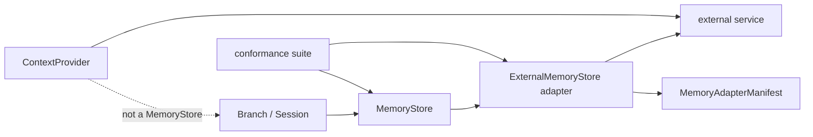
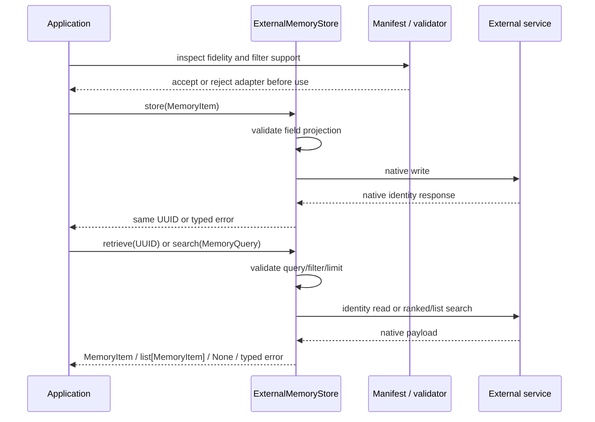

# ADR-0093: External Memory Adapter Fidelity Contract

- **Status**: Proposed
- **Kind**: Aspirational
- **Area**: substrates
- **Date**: 2026-07-09
- **Relations**: supersedes v0-0091; extends ADR-0092

## Context

ADR-0092 intentionally keeps `MemoryStore` structural and small. That makes adapters easy to
inject, but identical method names do not prove identical storage or search behavior.

**P1 — Structural compatibility is not semantic compatibility.** A runtime-checkable Protocol
can see `store`, `retrieve`, and `search`; it cannot see whether metadata is dropped, tags survive
search, writes are immediately searchable, results are ranked, or a service error was silently
converted into an empty result.

**P2 — External services have asymmetric native shapes.** A service may accept tags on write but
not return them in ranked hits, expose direct identity retrieval separately from recall, normalize
timestamps, reject arbitrary metadata, or add native fields that do not fit `MemoryItem`. An
adapter must declare that projection rather than imply a lossless round trip.

**P3 — Query portability is incomplete.** `MemoryQuery.filters` is an open mapping. External
services frequently support a closed filter set, different comparison operators, or no unfiltered
scan. Unsupported keys must fail visibly; ignoring them would broaden a query and return records
the caller intended to exclude.

**P4 — Search and identity consistency can differ.** A successful store should support direct
identity retrieval, while a secondary search index may be eventually consistent. Treating an
immediate search miss as a failed write, or treating ranked recall as identity retrieval, produces
incorrect recovery behavior.

**P5 — Explicit persistence cannot use best-effort prompt-injection failure semantics.**
`lionagi/tools/khive_injection.py` is a `ContextProvider`: it recalls and optionally composes text
for a prompt, optionally writes selected events, and deliberately degrades to no injection on
transport failure. It does not implement `MemoryStore`, return `MemoryItem`, or participate in
Branch/Session store ownership. An explicit `store()` call must not appear successful when its
transport failed.

**P6 — Core must remain dependency-light.** An external adapter can live in a connector or
service-owned package and be passed to `Branch(memory=...)` or `Session(memory=...)`. Lionagi core
should not acquire service-specific clients, connection pools, retry policies, or field mappings
to make that possible.

The target boundary is:



| Concern | Decision |
|---|---|
| Capability and fidelity declaration | D1: Every external adapter publishes an immutable typed manifest alongside `MemoryStore`. |
| Executable evidence | D2: Every adapter runs a common conformance matrix against a deterministic fake and, separately, a live opt-in environment. |
| Projection and query behavior | D3: Loss, normalization, consistency, filter support, misses, and limit behavior are explicit; unsupported semantics never degrade silently. |
| Errors and lifecycle | D4: Persistence errors propagate through stable adapter exceptions; connection, pooling, timeout, retry, and close policy stay adapter-owned and documented. |
| Adjacent khive integration | D5: A khive-backed store is the first named application but remains external and must not be confused with `KhiveInjectionProvider`; its concrete wire mapping is deferred until implementation can be verified against the external source. |

This ADR deliberately does **not** decide:

- Graph traversal, task lifecycle, messaging, or knowledge composition. Those operations do not
  fit the three-method memory contract.
- A service transport. MCP, HTTP, an SDK, or an embedded client may sit behind an adapter if the
  manifest and tests remain true.
- A core connection manager or close hook. Branch and Session continue accepting the smaller
  `MemoryStore` Protocol.
- One portable search score or ordering. External search may be ranked; callers decide whether a
  declared adapter meets their needs.
- The package, release, or installation mechanism for a concrete adapter. The interface is
  independent of distribution.
- Automatic prompt injection. `ContextProvider` owns that optional pre-turn concern.

## Decision

### D1 — Require an immutable fidelity manifest

Every external adapter implements `MemoryStore` and a companion protocol with one immutable
manifest property. The manifest is not added to the base Protocol, so existing core and minimal
in-process stores remain valid.

**The target contract**:

```python
from collections.abc import Iterable
from typing import Literal, Protocol, runtime_checkable

from pydantic import BaseModel, ConfigDict, Field, model_validator

MemoryItemField = Literal["id", "created_at", "metadata", "content", "tags"]
SearchConsistency = Literal["immediate", "eventual"]
Fidelity = Literal["full", "native_fields", "lossy"]

class MemoryAdapterManifest(BaseModel):
    model_config = ConfigDict(frozen=True, extra="forbid")

    adapter: str = Field(min_length=1)
    native_item_fields: frozenset[MemoryItemField]
    dropped_item_fields: frozenset[MemoryItemField]
    supported_filters: frozenset[str]
    search_consistency: SearchConsistency
    retrieve_fidelity: Fidelity
    search_fidelity: Fidelity
    search_returns_tags: bool
    preserves_metadata: bool

    @model_validator(mode="after")
    def coherent_projection(self) -> "MemoryAdapterManifest":
        fields = {"id", "created_at", "metadata", "content", "tags"}
        if self.native_item_fields & self.dropped_item_fields:
            raise ValueError("native and dropped item fields must be disjoint")
        if self.native_item_fields | self.dropped_item_fields != fields:
            raise ValueError("every MemoryItem field must be classified")
        if not {"id", "content", "tags"} <= self.native_item_fields:
            raise ValueError("id, content, and tags are required native fields")
        if self.preserves_metadata and "metadata" not in self.native_item_fields:
            raise ValueError("preserved metadata must be a native field")
        if self.retrieve_fidelity == "full" and (
            self.dropped_item_fields or not self.preserves_metadata
        ):
            raise ValueError("full retrieve fidelity must preserve every item field")
        if self.search_fidelity == "full" and (
            self.dropped_item_fields
            or not self.search_returns_tags
            or not self.preserves_metadata
        ):
            raise ValueError("full search fidelity must preserve all fields and tags")
        return self

@runtime_checkable
class ExternalMemoryStore(MemoryStore, Protocol):
    @property
    def manifest(self) -> MemoryAdapterManifest: ...
```

Field meanings are normative:

| Field | Meaning |
|---|---|
| `adapter` | Stable adapter implementation identifier used in diagnostics and test reports; not a display label selected per request. |
| `native_item_fields` | `MemoryItem` fields the service stores in a native field and the adapter can test on direct retrieval. |
| `dropped_item_fields` | Fields the service cannot represent and the adapter does not persist. Every dropped field must also be described in adapter documentation. |
| `supported_filters` | Exact accepted keys inside `MemoryQuery.filters`; the set does not silently expand through pass-through parameters. |
| `search_consistency` | Whether a successful store must be visible to `search()` immediately or may appear after index convergence. |
| `retrieve_fidelity` | Fidelity of direct identity retrieval. |
| `search_fidelity` | Fidelity of ranked/list search hits, which may be lower than direct retrieval. |
| `search_returns_tags` | Whether search-hit `MemoryItem.tags` contains the stored tags; independent of whether writes accept tags. |
| `preserves_metadata` | Whether the arbitrary metadata mapping round-trips exactly. `True` requires metadata to be native; `False` permits metadata to be dropped or represented lossily as declared. |

The fidelity values mean:

- `full`: every `MemoryItem` field is represented and round-trips without adapter-defined loss.
- `native_fields`: direct retrieval round-trips every field in `native_item_fields`; search
  round-trips the operation's documented native projection, with tag presence governed by
  `search_returns_tags`. Every globally dropped field is absent/defaulted as documented.
- `lossy`: at least one accepted native field is normalized, truncated, synthesized, or otherwise
  not exactly reconstructible. The transformation must have named test fixtures and documentation;
  the enum alone is not sufficient disclosure.

**Exact manifest semantics**:

- The manifest is stable for the lifetime of an adapter instance. A runtime service downgrade
  that invalidates it makes the adapter unavailable; the adapter does not mutate capabilities
  mid-call.
- The manifest describes adapter behavior, not service marketing or optional features that were
  not configured for this instance.
- Every `MemoryItem` field is classified exactly once. An adapter cannot omit an awkward field
  from both sets.
- Additional service-native fields are projected only into documented `MemoryItem` fields or
  omitted. They do not appear as undeclared dynamic attributes.
- Applications may reject an adapter before first use when its manifest does not meet required
  fidelity, filter, consistency, tag, or metadata properties.

**Why this way**: a typed manifest makes semantic differences machine-checkable without expanding
the base core Protocol. Immutable instance-level truth prevents a caller from adopting an adapter
under one contract and observing another later.

### D2 — Make conformance executable

An external package runs the same semantic matrix against two fixtures:

1. a deterministic fake transport that can force misses, unsupported queries, eventual-index
   delay, malformed responses, and transport failure; and
2. an opt-in live service environment that checks the adapter's published manifest against the
   deployed service version.

The reusable suite consumes this harness shape:

```python
class MemoryAdapterHarness(Protocol):
    async def make_store(self) -> ExternalMemoryStore: ...
    async def reset(self) -> None: ...
    async def make_search_index_visible(self) -> None: ...
    async def make_transport_unavailable(self) -> None: ...
    async def close(self) -> None: ...
```

The suite does not require the adapter itself to expose reset, index, or failure controls; those
are test-harness capabilities over a disposable namespace or fake transport.

**Required conformance matrix**:

| Case | Required observation |
|---|---|
| Structural surface | Adapter satisfies both `MemoryStore` and `ExternalMemoryStore`; manifest validates. |
| Store identifier | Successful `store(item)` returns `item.id` as `UUID`. |
| Direct retrieval | Stored id returns a `MemoryItem`; every declared native field matches its fidelity contract. |
| Unknown id | Returns `None`, not an empty item and not a search result. |
| Wrong native kind | If the service identity resolves to a non-memory record, return `None`; never coerce it. |
| Dropped write field | Reject before transport or list the field in `dropped_item_fields`; never silently drop an unclassified field. |
| Typed search | Every result is `MemoryItem`; no native SDK object escapes. |
| Limit | Positive `limit=N` returns at most N; zero returns `[]`; negative is visibly rejected. |
| Empty query | Returns the backend's documented first page up to limit; it is not translated into an arbitrary magic search string. |
| Unsupported filter | Raises `UnsupportedMemoryQuery` naming every rejected key; no remote query is issued. |
| Supported filter | Fake transport proves the key and value are mapped as documented. |
| Tag projection | Search-hit tags agree with `search_returns_tags`; direct retrieval agrees with retrieve fidelity. |
| Metadata projection | Store/retrieve/search behavior agrees with `preserves_metadata` and field classification. |
| Consistency | Immediate adapters surface a successful write at once; eventual adapters may miss before the harness exposes the index and must find it afterward. |
| Transport outage | Explicit calls raise `MemoryAdapterUnavailable`; no empty-list/`None` fallback masquerades as a valid result. |
| Rejected write | Raises `MemoryAdapterError` and returns no identifier. |
| Manifest accuracy | Toggling every fake behavior causes the suite to fail when the manifest says the opposite. |

The external package may add service-specific tests, but it cannot weaken or skip a shared case
without changing its claim that the adapter satisfies this ADR. Live tests may be opt-in; fake
tests are deterministic and required in ordinary CI.

**Why this way**: prose capability declarations drift. A fake makes rare failure and eventual
consistency paths repeatable, while a live check catches wire/schema drift the fake cannot. The
separation avoids making routine core tests depend on external availability.

### D3 — Make projection and query semantics explicit

An adapter may be lossy, but never silently so.

**Write contract**:

- `store(item)` validates field support before issuing a remote write.
- A field the adapter cannot represent is either rejected or included in
  `manifest.dropped_item_fields`. Documentation states the default value observed on retrieval
  and search.
- `id`, `content`, and `tags` are the minimum direct-retrieval anchors already exercised by
  ADR-0092's protocol fence. If the service cannot preserve them across store then retrieve, the
  adapter rejects the write; it must not return a different id or silently lose tags while
  claiming core conformance. Search hits may still omit tags when the manifest declares
  `search_returns_tags=False`.
- A rejected remote write raises `MemoryAdapterError` without returning a UUID. A successful
  transport response that lacks a usable identity is also a write failure.
- Retrying a write is adapter-owned. If the service cannot make repeated writes by the same UUID
  idempotent, the adapter documents duplicate/conflict behavior; the portable layer does not
  auto-retry.

**Retrieve contract**:

- `retrieve(item_id)` uses a direct identity operation, not ranked recall with the UUID as query
  text.
- Unknown identity returns `None`.
- A service object with that identity but the wrong native record kind returns `None`; the adapter
  does not coerce unrelated records into `MemoryItem`.
- A successful `store()` must be directly retrievable according to the declared retrieve fidelity
  without waiting for the search index. Otherwise the write is not acknowledged as successful.
- Projection yields a new `MemoryItem` and no transport-native response object.

**Search contract**:

- `MemoryQuery.text`, `tags`, and positive `limit` are portable input axes. An adapter documents
  its backend-specific ordering and tag-match semantics; ADR-0092 does not claim those are equal
  to `InMemoryStore`.
- `MemoryQuery.filters` accepts only keys in `manifest.supported_filters`. Validation considers
  the full key set before transport so partial filtering cannot occur.
- Unsupported keys raise `UnsupportedMemoryQuery` with all rejected keys sorted. They are never
  ignored, stripped, or moved into free-form query text.
- `limit=0` returns `[]` without transport. `limit<0` raises `UnsupportedMemoryQuery` naming
  `limit`; external adapters do not reproduce the reference backend's negative-slice quirk.
- Empty text/tags/filters is a valid request for the backend's documented first page. If a service
  cannot express that operation, its adapter cannot claim conformance until it implements a safe
  list path; substituting a wildcard with different scope is not allowed.
- `search_consistency="eventual"` permits a newly stored item to be absent before index
  convergence. It does not permit a stale direct `retrieve` or an empty result on transport error.
- Search scores, rank breakdowns, and service-native query options do not enter `MemoryItem` or
  `MemoryQuery` implicitly. They require a separately versioned extension.

**Stable errors**:

```python
class MemoryAdapterError(RuntimeError):
    """Base class for an explicit external MemoryStore operation failure."""

class UnsupportedMemoryQuery(MemoryAdapterError):
    def __init__(self, rejected_keys: Iterable[str]) -> None:
        self.rejected_keys = tuple(sorted(set(rejected_keys)))
        super().__init__(
            "unsupported memory query keys: " + ", ".join(self.rejected_keys)
        )

class MemoryAdapterUnavailable(MemoryAdapterError):
    """Transport or service availability prevented an explicit operation."""
```

Native exceptions are chained as causes but do not escape as the public error type. Validation
errors in constructing `MemoryItem`, `MemoryQuery`, or the manifest remain Pydantic errors; these
adapter exceptions describe operation semantics after valid input reaches the adapter boundary.

**Why this way**: field loss and ignored predicates are correctness failures, not mere feature
differences. Direct retrieval and eventual search answer different questions and need different
miss semantics. Stable exceptions let applications distinguish “not found,” “unsupported,” and
“temporarily unavailable” without knowing the service SDK.

### D4 — Keep operational lifecycle adapter-owned and documented

The base `MemoryStore` does not gain `open`, `close`, `health`, `retry`, or transaction methods.
An external adapter owns any client, pool, authentication, namespace, timeout, and retry policy.

Every adapter's companion documentation must state:

- when connections are created (constructor, first call, or injected client);
- whether one adapter instance is safe for concurrent Branch calls;
- how the owning application closes it and whether close is idempotent;
- request/connect timeout values and why those values were chosen;
- retry count, backoff, jitter, and which operations are safe to retry;
- namespace/collection scope and whether it is fixed at construction;
- write-conflict and duplicate-id behavior; and
- what availability/health evidence invalidates the manifest.

There are no portable timeout, retry, pool-size, or connection-budget numbers in this ADR. The
adapter package must provide real values with service evidence or explicitly state that it
inherits client defaults with no recorded rationale. Core must not silently supply a universal
retry loop: a retried write may duplicate state while a retried search is normally read-only.

**Exact failure semantics**:

- Transport creation failure raises `MemoryAdapterUnavailable` from the first explicit store,
  retrieve, or search that requires it.
- Mid-call transport failure raises `MemoryAdapterUnavailable`; it does not return `None`, `[]`,
  or a generated UUID.
- Malformed service payload raises `MemoryAdapterError` with the native error chained.
- Close failure follows the adapter's documented owner lifecycle; it is never swallowed by Branch
  or Session because they do not own close.
- An adapter may expose an additional async context manager or `close()` method, but callers using
  the base Protocol must still arrange ownership externally.
- There is no fallback to `InMemoryStore` after an external write or read failure. Such fallback
  would split state and make later retrieval nondeterministic.

**Why this way**: lifecycle policy differs by transport and deployment. Adding it to the three
method core Protocol would force the zero-dependency store to mimic network concerns and would not
solve application ownership. Stable operation errors are portable; connection mechanics are not.

### D5 — Keep the khive store target separate from prompt injection

A khive-backed adapter is the first named application of D1-D4, but this ADR does not claim that
it exists in this repository. It remains in an external package, satisfies `ExternalMemoryStore`,
publishes a source-verified manifest, and maps store, identity retrieval, and ranked recall to
their distinct native operations. The exact verb ids, request fields, response fields, defaults,
and loss profile are **DEFERRED** until implementation time, when they can be verified against the
external adapter and service source. Historical mappings are not treated as current wire truth.

`KhiveInjectionProvider` is an adjacent, implemented `ContextProvider`. Its relevant current
contract (`lionagi/tools/khive_injection.py`) is:

```python
class KhiveInjectionProvider:
    def __init__(
        self,
        policy: KhiveInjectionPolicy,
        mcp_config: dict | None = None,
    ): ...

    async def provide(
        self, branch: Branch, instruction: Instruction
    ) -> str | None: ...

    async def writeback(
        self, branch: Branch, action_responses: list
    ) -> None: ...
```

Its policy defaults are also concrete:

```python
@dataclass(frozen=True)
class RecallPolicy:
    limit: int = 5
    min_score: float = 0.4
    max_tokens: int = 800

@dataclass(frozen=True)
class ComposePolicy:
    enabled: bool = False
    max_tokens: int = 2000

@dataclass(frozen=True)
class WritebackPolicy:
    enabled: bool = False
    salience_cap: float = 0.4
    tags: tuple[str, ...] = ()
```

The query task text is truncated to 400 characters. Injection output is token-truncated to the
recall cap plus the compose cap when enabled. These values are inherited implementation defaults;
the module records no measured rationale for 5, 0.4, 800, 2,000, or 400. They are not memory-store
limits and must not be copied into an adapter manifest.

**Exact separation semantics**:

- `provide()` returns rendered prompt text or `None`, never `MemoryItem`.
- It calls recall and optional composition, and it swallows transport failure into no injection so
  the conversational turn continues.
- Optional writeback derives tool error/resolution pairs and issues memory writes. A writeback
  failure is logged and stops the remaining writeback loop; it is not surfaced as an explicit
  persistence result.
- It can emit best-effort feedback after recall. Feedback failure is logged and does not fail the
  injection.
- It has cadence, token, and salience policy; it has no `MemoryAdapterManifest` and does not
  participate in Session's first-claim store sharing.
- A caller wanting explicit persistence injects the external adapter. A caller wanting optional
  prompt enrichment registers the context provider. Using one does not prove the other exists.

**Why this way**: prompt enrichment should degrade gracefully because it is optional context.
Explicit persistence must surface failure because the caller relies on state. Sharing a transport
or native service does not make those contracts interchangeable.

The explicit operation sequence is:



## Consequences

Applications can compare adapters by executable guarantees instead of assuming identical method
names imply identical memory semantics. Core remains dependency-light, while lossy projection,
eventual consistency, filter support, and service availability become visible adoption choices.

Adapter authors must maintain an immutable manifest, deterministic fake, live compatibility
check, field projection documentation, and error mapping as either side evolves. Search hits may
still differ in ordering or rank even when two adapters both conform; the manifest is a capability
contract, not a claim that all backends are interchangeable.

Callers requiring full metadata, tags in search hits, immediate search visibility, or a specific
filter set must reject a manifest that does not provide them. They must also own connection
lifecycle because Branch and Session remain intentionally unaware of it.

Reversing D1-D3 after adapters ship requires a manifest/schema version and conformance migration.
Reversing D4 by adding lifecycle to core would change `MemoryStore` and every implementation.
Reversing D5 would couple optional prompt enrichment to explicit persistence and create ambiguous
failure semantics.

Counting the core protocol, conformance suite, external adapter, external service, and context
provider gives five components. The adapter depends on the protocol and service, the suite depends
on the protocol and adapter, and the context provider depends directly on the service, giving five
directed dependencies and `κ = 5 / (5 × 4) = 0.25`. Its testability target is `τ = 0.90`:
protocol, projection, filters, consistency, and errors are testable through a fake transport, with
only live-service compatibility requiring an opt-in integration environment.

## Alternatives considered

### Put service-specific adapters in lionagi core

This would make installation and examples easy and could share Lionagi's connection utilities.
It lost because every service client, wire change, credential mode, and retry policy would enter
core's dependency and release surface. Constructor injection already provides the needed seam.

### Add the manifest to base `MemoryStore`

One universal protocol would let every caller inspect capabilities, including `InMemoryStore`.
It lost because the existing core contract deliberately has three methods and structurally valid
minimal stores need no service-fidelity declaration. `ExternalMemoryStore` extends rather than
breaks that contract.

### Treat direct context injection as a store adapter

Both surfaces may call the same service, and prompt recall resembles search. It lost because the
context provider returns rendered text, performs optional feedback/writeback, follows cadence and
token budgets, and swallows transport errors. A store returns typed records and must surface
explicit persistence failure.

### Permit undocumented lossy projection

This minimizes adapter code and lets callers inspect returned objects empirically. It lost because
missing metadata or tags can alter provenance and filtering silently. The manifest and fixtures
make the adoption tradeoff explicit before data is written.

### Ignore unsupported filters and run the broader query

Best-effort filter mapping would keep more services usable. It lost because dropping a predicate
broadens result scope and can return records the caller explicitly excluded. Visible rejection is
the only safe portable behavior.

### Put arbitrary native query options in `MemoryQuery.filters`

Pass-through options would expose every service feature without new types. It lost because filter
keys would become an unversioned backend escape hatch and callers could no longer know which
queries are portable. Native extensions require their own versioned API.

### Rehydrate every search hit through identity retrieval

This could upgrade low-fidelity search results, such as missing tags, into full `MemoryItem`s. It
lost as a hidden default because one ranked call becomes N+1 service calls, changing latency,
failure, and rate behavior. A caller may explicitly retrieve selected hits when needed.

### Map identity retrieval onto ranked search

Using one native recall operation would reduce adapter mapping work. It lost because rank search
can miss a valid id, return a different record, or depend on index convergence. Identity miss and
search miss have different contracts.

### Fall back to `InMemoryStore` on external failure

This would keep the application available during an outage. It lost because successful-looking
writes would split across two stores and later retrieval would depend on which process handled the
call. Availability cannot override persistence truth silently.

## Notes

Interpretation uses *expressio unius* to limit this contract to the three `MemoryStore` verbs and
their fidelity. Graph traversal, task operations, prompt enrichment, and service-native features
remain outside the seam unless separately specified.

Primary current-code anchors: `lionagi/protocols/memory.py`;
`tests/protocols/test_memory.py`; `lionagi/session/branch.py`;
`lionagi/session/session.py`; `lionagi/tools/khive_injection.py`;
`lionagi/protocols/context_providers.py`.
