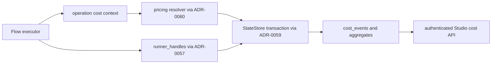

# ADR-0058: Play Cost Tracking

Status: APPROVE-WITH-FIXES
Date: 2026-05-27
Decision owners: @governance-maintainers
Depends on: ADR-0059 (StateStore protocol), ADR-0060 (unified config resolution)
Related: ADR-0022 (run provenance), ADR-0023 (hook system), ADR-0056 (play control API), ADR-0057 (remote sandbox execution)

## Context

Governed orchestration needs cost records that are explainable, replayable, and safe to expose
only to authorized operators. Cost is not a UI decoration: it reveals model choice, run cadence,
task complexity, retries, and which parts of an orchestration consume the most budget. For an
enterprise governance product, that is operational strategy.

The current flow runtime already has the right execution shape for attribution. `FlowAgent`,
`FlowOp`, and `FlowPlan` are typed models for branch identity, operation identity, dependencies,
control operations, and per-op budget weights (`lionagi/cli/orchestrate/flow.py:218`,
`lionagi/cli/orchestrate/flow.py:264`, `lionagi/cli/orchestrate/flow.py:332`). The planner is
also explicitly told to reuse agents because branch memory lowers token cost
(`lionagi/cli/orchestrate/flow.py:365`). During execution, the engine persists a partial DAG
snapshot to `sessions.node_metadata` so Studio can render live state
(`lionagi/cli/orchestrate/flow.py:1257`), records execution segments best-effort
(`lionagi/cli/orchestrate/flow.py:1177`), and writes op outputs to artifact markdown files
(`lionagi/cli/orchestrate/flow.py:1113`). At finalization, it persists a reduced graph summary
(`lionagi/cli/orchestrate/flow.py:1607`).

That is enough structure to attach cost events, but not enough to make a ledger. The state schema
has `sessions`, `branches`, and `plays`; `sessions` already stores resolved model, provider,
effort, and agent hash (`lionagi/state/schema.sql:97`, `lionagi/state/schema.sql:140`), and
`branches` stores per-agent model/provider data for multi-model flows
(`lionagi/state/schema.sql:193`, `lionagi/state/schema.sql:202`). The `plays` table is show-scoped
and has `UNIQUE(show_id, name)` (`lionagi/state/schema.sql:265`, `lionagi/state/schema.sql:302`),
so retry or replay must not create child play rows. ADR-0057 already defines
`runner_handles` as the durable execution-attempt table, with one play allowed to have multiple
attempts (`docs/adrs/ADR-0057-remote-sandbox-execution.md:246`). Cost and replay attribution must
therefore link to execution attempts, not invent a second replay model.

The state access boundary is also changing. ADR-0059 keeps `StateDB` as a facade and requires new
code to use the backend-neutral `StateStore` protocol instead of direct SQLite escape hatches
(`docs/adrs/ADR-0059-postgres-state-backend.md:90`, `docs/adrs/ADR-0059-postgres-state-backend.md:206`).
This ADR must not require any SQLite-only transaction primitive. SQLite and Postgres
implementations must both provide the same cost behavior behind `StateStore`.

Finally, the existing row conversion helper decodes only a fixed list of JSON-like columns
(`lionagi/state/db.py:2278`). Any new JSON fields must be added explicitly to the decode list or
Studio will receive encoded JSON strings instead of objects.

## Decision

### 1. Use integer cents for all financial state

All cost and pricing values are stored and transported inside the Python state layer as integer
cents. Database financial columns use `INTEGER NOT NULL DEFAULT 0`. Python models use `int` fields
with names ending in `_cents`. The only boundary that divides by 100 is the API or UI presentation
boundary, and it returns a decimal string such as `"12.34"` rather than an imprecise numeric
value.

This is non-negotiable. Financial ledger values must not use `REAL`, non-integer numeric types, or
provider-specific decimal strings in state.

### 2. Add an idempotent append-only cost ledger

Cost events are append-only operational facts. Aggregates on `sessions` and `plays` are hot-read
caches derived from `cost_events`; they are updated only when a new event is inserted.

```sql
ALTER TABLE sessions ADD COLUMN cost_cents INTEGER NOT NULL DEFAULT 0;
ALTER TABLE sessions ADD COLUMN token_count INTEGER NOT NULL DEFAULT 0;
ALTER TABLE sessions ADD COLUMN cost_breakdown JSON NOT NULL DEFAULT '{}';
ALTER TABLE sessions ADD COLUMN pricing_version TEXT;
ALTER TABLE sessions ADD COLUMN flow_plan JSON;
ALTER TABLE sessions ADD COLUMN op_snapshots JSON NOT NULL DEFAULT '{}';

ALTER TABLE plays ADD COLUMN cost_cents INTEGER NOT NULL DEFAULT 0;
ALTER TABLE plays ADD COLUMN token_count INTEGER NOT NULL DEFAULT 0;
ALTER TABLE plays ADD COLUMN cost_breakdown JSON NOT NULL DEFAULT '{}';
ALTER TABLE plays ADD COLUMN pricing_version TEXT;
ALTER TABLE plays ADD COLUMN flow_plan JSON;
ALTER TABLE plays ADD COLUMN op_snapshots JSON NOT NULL DEFAULT '{}';

CREATE TABLE IF NOT EXISTS model_pricing (
  id                         TEXT PRIMARY KEY,
  pricing_key                TEXT NOT NULL,
  version                    TEXT NOT NULL,
  currency                   TEXT NOT NULL DEFAULT 'USD',
  model                      TEXT NOT NULL,
  input_per_1m_cents         INTEGER NOT NULL DEFAULT 0,
  output_per_1m_cents        INTEGER NOT NULL DEFAULT 0,
  cache_read_per_1m_cents    INTEGER NOT NULL DEFAULT 0,
  cache_write_per_1m_cents   INTEGER NOT NULL DEFAULT 0,
  reasoning_per_1m_cents     INTEGER NOT NULL DEFAULT 0,
  effective_at               REAL,
  supersedes_id              TEXT REFERENCES model_pricing(id),
  node_metadata              JSON,
  created_at                 REAL NOT NULL,
  UNIQUE(pricing_key, version, model)
);

CREATE TABLE IF NOT EXISTS cost_events (
  id                         TEXT PRIMARY KEY,
  session_id                 TEXT NOT NULL REFERENCES sessions(id) ON DELETE CASCADE,
  play_id                    TEXT REFERENCES plays(id) ON DELETE SET NULL,
  execution_id               TEXT REFERENCES runner_handles(id) ON DELETE SET NULL,
  branch_id                  TEXT REFERENCES branches(id) ON DELETE SET NULL,
  flow_op_id                 TEXT,
  operation_node_id          TEXT,
  agent_id                   TEXT,
  agent_role                 TEXT,
  provider                   TEXT,
  model                      TEXT NOT NULL,
  usage_source               TEXT NOT NULL CHECK(usage_source IN ('provider', 'estimated', 'manual')),
  input_tokens               INTEGER NOT NULL DEFAULT 0,
  output_tokens              INTEGER NOT NULL DEFAULT 0,
  cache_read_tokens          INTEGER NOT NULL DEFAULT 0,
  cache_write_tokens         INTEGER NOT NULL DEFAULT 0,
  reasoning_tokens           INTEGER NOT NULL DEFAULT 0,
  total_tokens               INTEGER NOT NULL DEFAULT 0,
  input_cost_cents           INTEGER NOT NULL DEFAULT 0,
  output_cost_cents          INTEGER NOT NULL DEFAULT 0,
  cache_cost_cents           INTEGER NOT NULL DEFAULT 0,
  reasoning_cost_cents       INTEGER NOT NULL DEFAULT 0,
  total_cost_cents           INTEGER NOT NULL DEFAULT 0,
  pricing_id                 TEXT NOT NULL REFERENCES model_pricing(id),
  pricing_key                TEXT NOT NULL,
  pricing_version            TEXT NOT NULL,
  response_id                TEXT NOT NULL,
  created_at                 REAL NOT NULL,
  node_metadata              JSON,
  UNIQUE(session_id, response_id)
);

CREATE INDEX IF NOT EXISTS idx_cost_events_session_time
  ON cost_events(session_id, created_at);
CREATE INDEX IF NOT EXISTS idx_cost_events_play_time
  ON cost_events(play_id, created_at) WHERE play_id IS NOT NULL;
CREATE INDEX IF NOT EXISTS idx_cost_events_execution_time
  ON cost_events(execution_id, created_at) WHERE execution_id IS NOT NULL;
CREATE INDEX IF NOT EXISTS idx_cost_events_model_time
  ON cost_events(model, created_at);
CREATE INDEX IF NOT EXISTS idx_cost_events_agent_role_time
  ON cost_events(agent_role, created_at) WHERE agent_role IS NOT NULL;
```

`response_id` is required. If a provider does not return a stable response identifier, the runtime
constructs one from the normalized provider request identity, execution context, and model-call
ordinal before insertion. SQLite uses `INSERT OR IGNORE`; Postgres uses `ON CONFLICT DO NOTHING`.
If the insert is ignored, aggregate updates are skipped. Duplicate hook delivery and provider retry
must not double-count spend.

### 3. Keep pricing immutable once referenced

`model_pricing` rows are immutable once any `cost_events.pricing_id` references them. A price
change creates a new `(pricing_key, version, model)` row. Correction of a previously charged event
is represented by a new adjustment event with negative token deltas prohibited and negative cost
prohibited; if a correction is required, write an explicit zero-token manual event with explanatory
metadata and the corrected positive total. The ledger is not edited in place.

Pricing files are resolved through ADR-0060 only:

```text
<root>/pricing/<name>.yaml
<root>/pricing/<name>.yml
```

There is no standalone user pricing file outside the ADR-0060 cascade. ADR-0060 owns root
discovery, shadowing, plugin fallback, and symlink containment for pricing resources.

### 4. Use StateStore transactions, not SQLite-specific primitives

ADR-0059's `StateStore` protocol gains a transaction abstraction and cost methods:

```python
from contextlib import AbstractAsyncContextManager
from typing import Any, Protocol


class StateTransaction(Protocol):
    async def insert_cost_event(self, event: dict[str, Any]) -> bool: ...
    async def increment_session_cost(
        self,
        session_id: str,
        *,
        cost_cents: int,
        token_count: int,
        breakdown_delta: dict[str, int],
        pricing_version: str,
    ) -> None: ...
    async def increment_play_cost(
        self,
        play_id: str,
        *,
        cost_cents: int,
        token_count: int,
        breakdown_delta: dict[str, int],
        pricing_version: str,
    ) -> None: ...


class StateStore(Protocol):
    def transaction(self) -> AbstractAsyncContextManager[StateTransaction]: ...
    async def list_cost_events(
        self,
        *,
        session_id: str | None = None,
        play_id: str | None = None,
        execution_id: str | None = None,
        limit: int = 500,
    ) -> list[dict[str, Any]]: ...
```

The public service function performs one backend-neutral unit of work:

```python
async def record_cost_event(store: StateStore, event: CostEvent) -> bool:
    async with store.transaction() as txn:
        inserted = await txn.insert_cost_event(event.model_dump())
        if not inserted:
            return False
        await txn.increment_session_cost(
            event.session_id,
            cost_cents=event.total_cost_cents,
            token_count=event.total_tokens,
            breakdown_delta=event.breakdown_delta(),
            pricing_version=event.pricing_version,
        )
        if event.play_id:
            await txn.increment_play_cost(
                event.play_id,
                cost_cents=event.total_cost_cents,
                token_count=event.total_tokens,
                breakdown_delta=event.breakdown_delta(),
                pricing_version=event.pricing_version,
            )
        return True
```

SQLite may implement this with its normal transaction machinery. Postgres may use a transaction and
row-level locks where needed. Callers do not choose the database primitive.

### 5. Attribute replay and retry through runner_handles

Replay does not create child play rows and does not add replay-parent columns to `plays` or
`sessions`. A replay creates a new `runner_handles` row, increments `attempt`, and stores replay
metadata in the ADR-0056-owned `runner_handles.metadata_json` field:

```json
{
  "replay": {
    "parent_execution_id": "exec_prev",
    "from_op_id": "review1",
    "mode": "suffix",
    "requested_by": "operator-id",
    "reason": "retry failed suffix after dependency fix"
  }
}
```

Every cost event emitted during that attempt carries the new `execution_id`. Session and play
aggregates remain cumulative unless an API request explicitly filters by execution attempt.

### 6. Add explicit JSON decode coverage

`StateDB._row_to_dict()` and the future SQLite/Postgres store adapters must decode these new JSON
columns into Python objects:

```text
cost_breakdown
flow_plan
op_snapshots
node_metadata
metadata_json
command_json
env_allowlist_json
limits_json
```

This list is part of the contract. Tests must assert API projections return JSON objects, not
encoded strings.

### Component Diagram



Coupling target: six components, six direct dependencies, `k = 6 / (6 * 5) = 0.20`.

## Implementation

### Python contracts

Add `lionagi/state/cost.py`:

```python
from typing import Any, Literal

from pydantic import BaseModel, Field


class TokenUsage(BaseModel):
    input_tokens: int = 0
    output_tokens: int = 0
    cache_read_tokens: int = 0
    cache_write_tokens: int = 0
    reasoning_tokens: int = 0
    total_tokens: int = 0
    source: Literal["provider", "estimated", "manual"] = "provider"


class ModelPrice(BaseModel):
    pricing_key: str
    version: str
    model: str
    input_per_1m_cents: int = 0
    output_per_1m_cents: int = 0
    cache_read_per_1m_cents: int = 0
    cache_write_per_1m_cents: int = 0
    reasoning_per_1m_cents: int = 0


class CostQuote(BaseModel):
    pricing_id: str
    pricing_key: str
    pricing_version: str
    input_cost_cents: int = 0
    output_cost_cents: int = 0
    cache_cost_cents: int = 0
    reasoning_cost_cents: int = 0
    total_cost_cents: int = 0


class CostEvent(BaseModel):
    session_id: str
    play_id: str | None = None
    execution_id: str | None = None
    branch_id: str | None = None
    flow_op_id: str | None = None
    model: str
    provider: str | None = None
    usage_source: Literal["provider", "estimated", "manual"]
    response_id: str
    total_tokens: int = 0
    total_cost_cents: int = 0
    pricing_id: str
    pricing_key: str
    pricing_version: str
    node_metadata: dict[str, Any] = Field(default_factory=dict)

    def breakdown_delta(self) -> dict[str, int]: ...


def normalize_usage(response: Any, *, provider: str | None = None) -> TokenUsage | None: ...
def price_usage(model: str, usage: TokenUsage, price: ModelPrice) -> CostQuote: ...
```

`price_usage()` computes cents with integer arithmetic and deterministic rounding to the nearest
cent after multiplying tokens by per-million-cent rates.

### Runtime integration

Add `lionagi/cli/orchestrate/costing.py` to bridge API post-call events into operation context.
The bridge records `session_id`, optional `play_id`, optional `execution_id`, branch ID,
`FlowOp.id`, agent role, model, provider, normalized usage, and `response_id`. Flow execution must
persist the full `FlowPlan` and per-op snapshots before any replayable model call runs.

### Studio and API surface

Add authenticated endpoints:

| Method | Path | Purpose |
| --- | --- | --- |
| `GET` | `/api/cost/sessions/{session_id}` | Session aggregate and per-model breakdown. |
| `GET` | `/api/cost/sessions/{session_id}/events` | Event list, filterable by op, branch, and execution. |
| `GET` | `/api/cost/plays/{play_id}` | Show play aggregate and attempt breakdown. |
| `GET` | `/api/cost/executions/{execution_id}` | Cost for one ADR-0057 execution attempt. |
| `GET` | `/api/cost/pricing/{name}` | Resolved pricing metadata and active version. |

Service-layer responses keep `cost_cents` as the canonical value. HTTP serializers may add
`cost_usd` as a decimal string computed by dividing cents by 100.

### Phasing and estimates

| Phase | Work | Estimate |
| --- | --- | --- |
| 1 | State schema, StateStore transaction contract, SQLite implementation, Postgres parity hooks | 260-420 LOC |
| 2 | Pricing loader through ADR-0060, immutable pricing rows, integer quote calculation | 180-260 LOC |
| 3 | Flow operation context, API post-call normalization, idempotent insert path | 220-360 LOC |
| 4 | Studio cost services, routers, authenticated frontend views | 300-520 LOC |
| 5 | Replay attempt filtering through `runner_handles` and test coverage | 180-280 LOC |

Testability target: `tau > 0.85`. The ledger is testable with isolated store fixtures, duplicate
event tests, integer arithmetic fixtures, and API auth tests.

## Security

All cost endpoints require bearer authentication when `LIONAGI_STUDIO_AUTH_TOKEN` is set. This
includes `GET` endpoints. The current Studio middleware gates admin reads and mutating API methods
(`apps/studio/server/app.py:52`), but this ADR requires the cost router to enforce read auth as
well because cost data reveals operational strategy.

Cost events must not store raw prompts, completions, API keys, provider request bodies, or absolute
filesystem paths. `node_metadata` is limited to non-secret operational metadata such as provider
response class, usage source, retry count, and redaction status.

Replay requests require the same actor authorization as play control requests. A replay request may
reference only stored `FlowOp.id` values from the persisted plan and must create a new
`runner_handles` attempt. It must not mutate historical cost events.

Pricing immutability is a security property: historical charges must remain explainable against the
exact pricing row used at the time of the call. Updating or deleting a referenced `model_pricing`
row is rejected.

## Migration

The current source tree has no implemented cost ledger, so Phase 0 migration is additive:

1. Add integer-cent columns and ledger tables to SQLite and Postgres DDL.
2. Add the new JSON column names to decode coverage.
3. Backfill existing sessions and plays with `cost_cents = 0`, `token_count = 0`, and empty
   breakdowns.
4. Import pricing files through ADR-0060's `<root>/pricing/<name>.yaml` cascade and materialize
   immutable `model_pricing` rows on first use.
5. Update Studio to hide cost views unless the request is authenticated when
   `LIONAGI_STUDIO_AUTH_TOKEN` is set.

If any pre-release database contains older cost columns using non-integer financial storage, the
migration must perform a one-way offline conversion to integer cents, verify totals against the
old values using decimal arithmetic, and then remove the old columns from all read paths. New
runtime code never writes non-integer financial values.

Acceptance checks:

- Duplicate `API_POST_CALL` delivery with the same `(session_id, response_id)` inserts one event
  and updates aggregates once.
- All financial schema columns are `INTEGER NOT NULL DEFAULT 0`.
- All Python financial fields are `int` cents.
- Pricing changes create a new immutable version row.
- Replay cost can be filtered by `runner_handles.id`.
- Cost `GET` endpoints return `401` without a valid bearer token when auth is configured.
- JSON columns listed above round-trip as objects.

Domain utility: SKIPPED - no lore suggest/compose tool is available in this execution environment.
