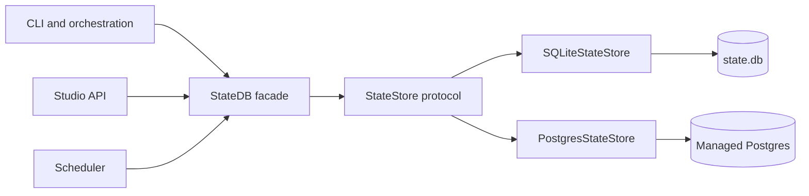
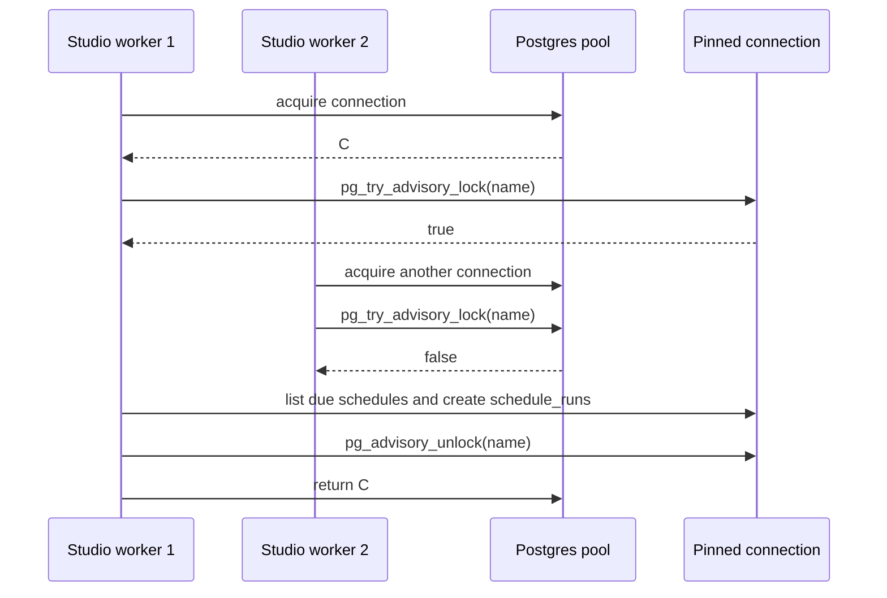

# ADR-0059: Postgres State Backend

Status: proposed
Date: 2026-05-27
Decision owners: @governance-maintainers
Depends on: ADR-0009 (SQLite state layer), ADR-0027 (scheduler engine / state.db), ADR-0053 (artifact persistence — artifact columns consumed, must land first or Postgres runs in experimental mode)
Related: ADR-0033 (unified entity state model), ADR-0034 (frontend data/state), governance direction P18-P20

## Context

LionAGI's current state substrate is `~/.lionagi/state.db`, opened by
`lionagi.state.db.StateDB`. The database is no longer only a four-table local mirror. The
current SQLite schema defines the operational surface used by CLI, Studio, scheduler, and
governance-facing workflows:

| Surface | Current SQLite source |
|---|---|
| messages, message types, progressions | `lionagi/state/schema.sql:25`, `lionagi/state/schema.sql:41`, `lionagi/state/schema.sql:69` |
| projects | `lionagi/state/schema.sql:79` |
| sessions | `lionagi/state/schema.sql:97` |
| branches | `lionagi/state/schema.sql:193` |
| definitions | `lionagi/state/schema.sql:220` |
| shows and plays | `lionagi/state/schema.sql:239`, `lionagi/state/schema.sql:265` |
| teams and team messages | `lionagi/state/schema.sql:310`, `lionagi/state/schema.sql:331` |
| invocations | `lionagi/state/schema.sql:354` |
| schedules and schedule runs | `lionagi/state/schema.sql:380`, `lionagi/state/schema.sql:423` |
| admin events | `lionagi/state/schema.sql:462` |
| artifacts | `lionagi/state/schema.sql:485`; superseded by ADR-0053 before Postgres parity is accepted |
| status transitions | `lionagi/state/schema.sql:540` |

`StateDB` already exposes most of these surfaces as async methods. Examples include message and
progression methods (`lionagi/state/db.py:623`, `lionagi/state/db.py:711`), session methods
(`lionagi/state/db.py:755`, `lionagi/state/db.py:843`, `lionagi/state/db.py:866`), projects
(`lionagi/state/db.py:1096`, `lionagi/state/db.py:1118`), schedules and schedule runs
(`lionagi/state/db.py:1185`, `lionagi/state/db.py:1230`, `lionagi/state/db.py:1240`,
`lionagi/state/db.py:1318`, `lionagi/state/db.py:1410`), artifacts
(`lionagi/state/db.py:1658`, `lionagi/state/db.py:1706`, `lionagi/state/db.py:1714`,
`lionagi/state/db.py:1722`), admin events (`lionagi/state/db.py:1729`,
`lionagi/state/db.py:1758`), branches (`lionagi/state/db.py:1784`,
`lionagi/state/db.py:1806`, `lionagi/state/db.py:1811`), shows and plays
(`lionagi/state/db.py:1935`, `lionagi/state/db.py:1975`, `lionagi/state/db.py:2059`,
`lionagi/state/db.py:2105`), and definitions (`lionagi/state/db.py:2252`).

The old ADR draft under-scoped the backend boundary. A Postgres backend cannot be safe if it
only implements sessions, branches, messages, invocations, schedules, and artifacts while
Studio and CLI keep bypassing the abstraction for projects, shows, plays, definitions, admin
events, schedule reads, or maintenance commands. Direct SQLite access already exists in
maintenance code such as `li state import` and `li state prune`: `_import_runs()` skips a run
as soon as its session row exists (`lionagi/cli/state.py:87`), while `_prune()` selects and
deletes through `db.db.execute()` (`lionagi/cli/state.py:644`, `lionagi/cli/state.py:683`).
Studio also has a security gap: when `LIONAGI_STUDIO_AUTH_TOKEN` is set, current middleware
protects `/api/admin/*` GETs and mutating `/api/*` methods, but ordinary GET endpoints such as
`/api/stats` are not covered (`apps/studio/server/app.py:52`, `apps/studio/server/app.py:86`).

Postgres is added for production Studio, multi-worker schedulers, remote executors, managed
backup, point-in-time recovery, operational metrics, and indexed search over shared state.
SQLite remains the default local backend. This ADR is therefore a backend-boundary decision,
not a replacement of the local developer workflow.



Coupling estimate after the decision: four application clients depend on one facade and one
protocol, while concrete stores do not depend on clients. With components `{CLI, Studio,
Scheduler, StateDB facade, SQLite store, Postgres store}` and intended cross-component deps
`{CLI->StateDB, Studio->StateDB, Scheduler->StateDB, StateDB->SQLite, StateDB->Postgres}`, the
direct coupling score is `5 / (6 * 5) = 0.17`. This is below the `0.3` threshold because callers
do not branch on database-specific primitives.

## Decision

### 1. Keep `StateDB` as the public facade and freeze a complete `StateStore` contract

`StateDB` remains the import path for existing callers. Internally it delegates to a concrete
`StateStore` selected from configuration. The protocol must cover every current StateDB surface
before Postgres is marked production-ready. Direct access to `StateDB.db` becomes SQLite-only
compatibility and is forbidden for new code.

Context-manager factories return async context managers; all state operations themselves are
async.

```python
# lionagi/state/store.py
from __future__ import annotations

from collections.abc import AsyncIterator, Sequence
from contextlib import AbstractAsyncContextManager
from pathlib import Path
from typing import Any, Literal, Protocol

StateBackend = Literal["sqlite", "postgres"]


class StateTransaction(Protocol):
    """A transaction-bound view of StateStore operations."""

    backend: StateBackend


class LockedStateConnection(Protocol):
    """Connection-pinned state view for scheduler and maintenance locks."""

    backend: StateBackend

    async def create_schedule_run(self, run: dict[str, Any]) -> None: ...
    async def update_schedule(self, schedule_id: str, **fields: Any) -> None: ...
    async def list_due_schedules(self, now: float, *, limit: int = 100) -> list[dict[str, Any]]: ...


class StateStore(Protocol):
    backend: StateBackend

    async def open(self) -> None: ...
    async def close(self) -> None: ...
    async def __aenter__(self) -> "StateStore": ...
    async def __aexit__(self, *exc: Any) -> None: ...

    def transaction(self) -> AbstractAsyncContextManager[StateTransaction]: ...
    def locked_connection(self, name: str) -> AbstractAsyncContextManager[LockedStateConnection]: ...

    # Schema and health.
    async def schema_version(self) -> str | None: ...
    async def apply_schema(self) -> None: ...
    async def table_counts(self, tables: Sequence[str]) -> dict[str, int]: ...
    async def checkpoint(self, mode: str = "TRUNCATE") -> dict[str, Any]: ...
    async def vacuum(self) -> None: ...
    async def select_retention_victims(self, *, keep_days: int, keep_n: int) -> list[str]: ...
    async def prune_sessions(self, session_ids: Sequence[str], *, actor: str) -> dict[str, int]: ...

    # Messages and progressions.
    async def insert_message(self, msg: dict[str, Any]) -> None: ...
    async def get_message(self, message_id: str) -> dict[str, Any] | None: ...
    async def create_progression(self, progression_id: str, collection: list[str] | None = None) -> None: ...
    async def get_progression(self, progression_id: str) -> list[str]: ...
    async def append_to_progression(self, progression_id: str, message_id: str) -> None: ...

    # Sessions and status transitions.
    async def create_session(self, session: dict[str, Any]) -> None: ...
    async def get_session(self, session_id: str) -> dict[str, Any] | None: ...
    async def list_sessions(
        self, *, status: str | None = None, limit: int = 100, offset: int = 0
    ) -> list[dict[str, Any]]: ...
    async def list_sessions_for_invocation(self, invocation_id: str) -> list[dict[str, Any]]: ...
    async def count_sessions(self, *, status: str | None = None) -> int: ...
    async def update_session(self, session_id: str, **fields: Any) -> None: ...
    async def touch_session_activity(self, session_id: str, *, at: float | None = None) -> None: ...
    async def update_artifact_verification(self, session_id: str, verification: dict[str, Any] | None) -> None: ...
    async def update_status(
        self,
        entity_type: str,
        entity_id: str,
        *,
        new_status: str,
        reason_code: str,
        reason_summary: str = "",
        evidence_refs: list[dict[str, Any]] | None = None,
        source: str = "executor",
        actor: str | None = None,
        metadata: dict[str, Any] | None = None,
    ) -> None: ...
    async def list_status_transitions(
        self, entity_type: str, entity_id: str, *, limit: int = 100
    ) -> list[dict[str, Any]]: ...

    # Branches.
    async def create_branch(self, branch: dict[str, Any]) -> None: ...
    async def get_branch(self, branch_id: str) -> dict[str, Any] | None: ...
    async def update_branch(self, branch_id: str, **fields: Any) -> None: ...
    async def repair_branch_progression(self, branch_id: str, new_progression_id: str) -> str | None: ...
    async def repair_session_progression(self, session_id: str, new_progression_id: str) -> str | None: ...
    async def list_branches(self, session_id: str) -> list[dict[str, Any]]: ...
    async def get_branch_messages(self, branch_id: str) -> list[dict[str, Any]]: ...

    # Projects.
    async def register_project(
        self, name: str, source: str, *, path: str | None = None, github: str | None = None
    ) -> None: ...
    async def create_project(
        self, name: str, *, github: str | None = None, description: str | None = None, path: str | None = None
    ) -> None: ...
    async def list_projects(self) -> list[dict[str, Any]]: ...
    async def get_project(self, name: str) -> dict[str, Any] | None: ...
    async def update_project(self, name: str, **fields: Any) -> bool: ...
    async def delete_project(self, name: str) -> bool: ...

    # Invocations.
    async def create_invocation(self, invocation: dict[str, Any]) -> None: ...
    async def update_invocation(self, invocation_id: str, **fields: Any) -> None: ...
    async def get_invocation(self, invocation_id: str) -> dict[str, Any] | None: ...
    async def list_invocations(
        self,
        *,
        skill: str | None = None,
        status: str | None = None,
        limit: int = 100,
        offset: int = 0,
    ) -> list[dict[str, Any]]: ...

    # Schedules and schedule runs.
    async def create_schedule(self, schedule: dict[str, Any]) -> None: ...
    async def get_schedule(self, schedule_id: str) -> dict[str, Any] | None: ...
    async def get_schedule_by_name(self, name: str) -> dict[str, Any] | None: ...
    async def list_schedules(
        self,
        *,
        enabled: bool | None = None,
        trigger_type: str | None = None,
        project: str | None = None,
        limit: int = 100,
        offset: int = 0,
    ) -> list[dict[str, Any]]: ...
    async def list_due_schedules(self, now: float, *, limit: int = 100) -> list[dict[str, Any]]: ...
    async def update_schedule(self, schedule_id: str, **fields: Any) -> None: ...
    async def delete_schedule(self, schedule_id: str) -> bool: ...
    async def create_schedule_run(self, run: dict[str, Any]) -> None: ...
    async def update_schedule_run(self, run_id: str, **fields: Any) -> None: ...
    async def list_schedule_runs(
        self, schedule_id: str, *, status: str | None = None, limit: int = 50, offset: int = 0
    ) -> list[dict[str, Any]]: ...
    async def get_schedule_run(self, run_id: str) -> dict[str, Any] | None: ...
    async def list_running_schedule_runs(self, schedule_id: str) -> list[dict[str, Any]]: ...

    # Artifacts. Columns and immutability are owned by ADR-0053.
    async def insert_artifact(self, artifact: dict[str, Any]) -> str: ...
    async def list_artifacts_for_invocation(self, invocation_id: str) -> list[dict[str, Any]]: ...
    async def list_artifacts_for_session(self, session_id: str) -> list[dict[str, Any]]: ...
    async def get_artifact(self, artifact_id: str) -> dict[str, Any] | None: ...
    async def search_artifacts(self, query: str, *, limit: int = 50) -> list[dict[str, Any]]: ...

    # Admin events.
    async def insert_admin_event(
        self, *, action: str, details: dict[str, Any], target_id: str | None = None, actor: str = "admin"
    ) -> str: ...
    async def list_admin_events(
        self, *, action: str | None = None, target_id: str | None = None, limit: int = 100
    ) -> list[dict[str, Any]]: ...

    # Shows and plays.
    async def create_show(self, show: dict[str, Any]) -> None: ...
    async def get_show(self, show_id: str) -> dict[str, Any] | None: ...
    async def get_show_by_topic(self, topic: str) -> dict[str, Any] | None: ...
    async def list_shows(self, *, status: str | None = None) -> list[dict[str, Any]]: ...
    async def update_show(self, show_id: str, **fields: Any) -> None: ...
    async def create_play(self, play: dict[str, Any]) -> None: ...
    async def get_play(self, play_id: str) -> dict[str, Any] | None: ...
    async def list_plays(self, show_id: str) -> list[dict[str, Any]]: ...
    async def update_play(self, play_id: str, **fields: Any) -> None: ...

    # Definitions.
    async def save_definition(
        self, *, kind: str, name: str, path: str, content: str, message: str | None = None
    ) -> int: ...
    async def get_definition(self, kind: str, name: str, *, version: int | None = None) -> dict[str, Any] | None: ...
    async def list_definition_versions(self, kind: str, name: str) -> list[dict[str, Any]]: ...
```

The implementation may split this large protocol into smaller internal protocols
(`StateReadStore`, `StateMaintenanceStore`, `StateSchedulerStore`, and `StateAdminStore`) if
that improves test clarity, but `StateDB.store` must implement the complete union above.

### 2. Maintain exact logical schema parity between SQLite and Postgres

`lionagi/state/schema.sql` remains the SQLite source of truth. `lionagi/state/schema_postgres.sql`
is explicit Postgres DDL, not a string-transpiled copy. A generated inventory in
`lionagi/state/schema_meta.py` compares table names, column names, nullable status, primary keys,
foreign keys, unique constraints, and required indexes for both backends.

Postgres DDL must match the effective SQLite schema exactly for logical columns. Backend type
translation is allowed; semantic drift is not.

| SQLite type/use | Postgres type/use |
|---|---|
| `TEXT` | `TEXT` |
| `INTEGER` flags and counters | `INTEGER` |
| epoch-second `REAL` timestamps | `TIMESTAMPTZ` at storage boundary, returned as epoch seconds by the store |
| `JSON` / JSON text | `JSONB` |
| `BLOB` embeddings | `BYTEA` |
| money or pricing values introduced by ADR-0058 | `INTEGER` cents only, never floating point |

The `branches` table is the reviewer-discovered guardrail: Postgres must not add lifecycle
columns that SQLite does not have. The correct Postgres table mirrors `lionagi/state/schema.sql:193`.

```sql
CREATE TABLE IF NOT EXISTS branches (
  id             TEXT PRIMARY KEY,
  created_at     TIMESTAMPTZ NOT NULL,
  node_metadata  JSONB,
  "user"         TEXT,
  name           TEXT,
  session_id     TEXT NOT NULL REFERENCES sessions(id) ON DELETE CASCADE,
  progression_id TEXT NOT NULL REFERENCES progressions(id),
  system_msg_id  TEXT REFERENCES messages(id),
  model          TEXT,
  provider       TEXT,
  agent_name     TEXT
);
```

Artifact parity is gated on ADR-0053. Current SQLite artifacts have `id`, `invocation_id`,
`session_id`, `created_at`, `updated_at`, `kind`, `name`, `content`, and `file_path`
(`lionagi/state/schema.sql:485`). ADR-0053 changes artifact persistence to immutable rows with
content hash and file metadata. ADR-0059 depends on that decision; Postgres production acceptance
requires the SQLite artifact migration and Postgres artifact DDL to agree before parity tests pass.
If ADR-0053 has not landed, Postgres may be used only in an experimental profile that mirrors the
current artifact columns.

ADR-0058 owns cost and pricing tables. When those tables enter the shared schema, all cost and
pricing values are integer cents in both backends. A `REAL`, `DOUBLE PRECISION`, or Python `float`
is invalid for money.

### 3. Use backend-neutral transaction semantics

All multi-row state mutations go through `async with store.transaction() as txn:`. Callers must
not open SQLite writer locks or issue database-specific transaction prologues. SQLite uses its
driver transaction behavior behind the store. Postgres uses one pooled connection and a database
transaction for the scope.

Examples:

```python
async with db.store.transaction() as txn:
    await txn.create_session(session)
    await txn.create_branch(branch)
    await txn.insert_admin_event(
        action="session_imported",
        target_id=session["id"],
        details={"source": "runs_backfill"},
    )
```

`update_status()` remains the only sanctioned status mutation point. It must atomically update
the entity row and append `status_transitions`, preserving the current invariant documented in
`lionagi/state/schema.sql:531`.

### 4. Pin advisory locks to the same Postgres connection

The scheduler must not use separate acquire and release calls that can land on different pooled
connections. `StateStore.locked_connection(name)` is the only advisory-lock API.

```python
async with db.store.locked_connection("studio_scheduler") as locked:
    due = await locked.list_due_schedules(now=time.time())
    for schedule in due:
        run = build_schedule_run(schedule)
        await locked.create_schedule_run(run)
        await locked.update_schedule(schedule["id"], last_fired_at=run["fired_at"])
```

Postgres implementation:

1. Acquire one pool connection.
2. Execute `pg_try_advisory_lock(hashtext($1))` on that connection.
3. If acquisition fails, raise `LockNotAcquired` or return an empty async context depending on
   scheduler configuration; no schedule fires.
4. Keep the connection pinned for the full context body.
5. Release with `pg_advisory_unlock(hashtext($1))` on the same connection in `finally`.
6. Return the connection to the pool only after release succeeds or the connection is closed.

Cancellation and crash behavior:

- Python cancellation runs the context manager `finally` path and releases on the same connection.
- If the process dies, Postgres releases the session-level advisory lock when the connection is
  closed.
- If release fails because the connection is broken, the connection is discarded rather than
  returned to the pool.

SQLite returns a process-local async lock for local Studio. It is sufficient for the default
single-process local mode but does not claim cross-process scheduling safety.



### 5. Require bearer auth for all Studio API reads and writes

When `LIONAGI_STUDIO_AUTH_TOKEN` is set, every `/api/*` endpoint must require
`Authorization: Bearer <token>` for every HTTP method, including GET. `/health` may remain
unauthenticated only if it returns no state, no backend details, and no path or version
provenance.

The current middleware must change from "admin GET plus mutating API methods" to "all API
methods":

```python
@app.middleware("http")
async def require_studio_bearer_token(request: Request, call_next):
    token = os.getenv("LIONAGI_STUDIO_AUTH_TOKEN")
    if (
        token
        and request.url.path.startswith("/api")
        and request.headers.get("authorization") != f"Bearer {token}"
    ):
        return JSONResponse({"detail": "Unauthorized"}, status_code=401)
    return await call_next(request)
```

This applies to runs, sessions, messages, artifacts, schedules, invocations, teams, projects,
definitions, shows, search, stats, config provenance, and admin routes. Studio responses must not
return absolute local paths or raw filesystem source locations. Log and artifact content may
contain secrets and must not be publicly cacheable.

## Implementation

| Phase | Scope | Files | Estimate |
|---|---|---|---|
| 0. Inventory and API freeze | Generate the method inventory from `StateDB`, fail CI if a public async method is missing from `StateStore`, and replace known `db.db.execute()` maintenance paths with store methods. | `lionagi/state/store.py`, `lionagi/state/db.py`, `lionagi/cli/state.py`, `apps/studio/server/services/*.py`, tests | 500-800 LOC |
| 1. SQLite store split | Move current SQLite implementation behind `SQLiteStateStore`; keep `StateDB` import compatibility and default behavior unchanged. | `lionagi/state/stores/sqlite.py`, `lionagi/state/db.py`, `lionagi/state/stores/__init__.py` | 300-500 LOC plus moves |
| 2. Schema parity harness | Add `schema_postgres.sql`, `schema_meta.py`, and tests that compare the effective SQLite schema, ADR-0053 artifact migration, and Postgres DDL. | `lionagi/state/schema_postgres.sql`, `lionagi/state/schema_meta.py`, `tests/state/test_schema_parity.py` | 250-400 LOC |
| 3. Postgres store MVP | Add optional `asyncpg`, pool lifecycle, parameter translation, JSONB/timestamp conversion, and methods for every protocol surface except full-text search. | `pyproject.toml`, `lionagi/state/stores/postgres.py`, `tests/state/test_state_store_contract.py` | 1200-1800 LOC |
| 4. Scheduler and Studio integration | Use `locked_connection()` in scheduler ticks; route Studio services through `StateDB`; change bearer middleware to protect all `/api/*` methods; expose backend health without DSN leaks. | `apps/studio/server/app.py`, `apps/studio/server/scheduler/engine.py`, `apps/studio/server/services/*.py` | 350-650 LOC |
| 5. Migration CLI | Add SQLite-to-Postgres and Postgres-to-SQLite export with dry-run counts, checksum sampling, resume-safe batches, and dependency-order inserts. | `lionagi/state/migrate.py`, `lionagi/cli/state.py`, `tests/state/test_state_migrate.py` | 500-850 LOC |
| 6. Production search and observability | Add message/artifact search, pool metrics, LISTEN/NOTIFY or polling cursor for Studio freshness, and DBA-facing health checks. | `lionagi/state/search.py`, `apps/studio/server/routers/search.py`, tests | 500-900 LOC |

MVP acceptance:

- SQLite remains unchanged by default.
- Store contract tests pass against SQLite and Postgres for every current StateDB surface.
- No production code outside store implementations calls `StateDB.db` or Studio-local `_open_db`.
- Postgres schema parity tests fail on any logical column drift, including extra branch lifecycle
  columns.
- Two Studio workers cannot fire the same due schedule when using Postgres.
- All `/api/*` GET endpoints return 401 without the bearer token when the token is configured.

Testability estimate `tau = 0.86`: the protocol is contract-testable, schema parity is
mechanically testable, scheduler locking is integration-testable with two workers, and the main
residual risk is operational Postgres tuning outside unit tests.

## Security

1. Bearer auth is mandatory for every Studio `/api/*` route when `LIONAGI_STUDIO_AUTH_TOKEN` is
   configured. GET routes are not exempt.
2. DSNs are secrets. Logs, exceptions, `/api/stats`, health output, and CLI status commands must
   redact username, password, host, and query parameters unless an explicit admin-only diagnostic
   command requests them.
3. Production Postgres deployments must support TLS; `LIONAGI_STATE_SSLMODE=require` is the
   minimum recommended setting outside local development.
4. Use least-privilege database roles. Migration roles may create tables and indexes. Runtime
   roles read and write application tables but do not own the database.
5. SQL values use driver parameter binding. Identifier interpolation is allowed only from
   internal allowlists, following the current `_validate_columns()` pattern.
6. Full-text indexes expose message and artifact text to database readers. Backups and replicas
   are sensitive assets.
7. The schema remains single-tenant. This ADR does not claim tenant isolation or row-level
   authorization for hosted multi-tenant SaaS.
8. Artifact payload limits and blob policy are owned by ADR-0053 and must be enforced before
   accepting writes into either backend.
9. Governance evidence and status transition rows are audit records. Deletion requires an
   explicit retention/archive ADR or command and must be recorded through `admin_events`.
10. Money values introduced by later ADRs use integer cents in schema and Python types. Floats
    are invalid for cost or pricing ledgers.

## Migration

1. Default remains SQLite. Existing local users keep `~/.lionagi/state.db`.
2. ADR-0053 artifact migration lands first or Postgres runs only in experimental mode without
   artifact parity claims.
3. Operators initialize Postgres with the explicit DDL:

   ```bash
   LIONAGI_STATE_BACKEND=postgres \
   LIONAGI_STATE_DSN=postgresql://lionagi_admin:...@db:5432/lionagi \
   li state init
   ```

4. Dry-run migration reads the SQLite schema inventory and the Postgres schema inventory before
   copying rows:

   ```bash
   li state migrate \
     --from sqlite --sqlite-path ~/.lionagi/state.db \
     --to postgres --dsn "$LIONAGI_STATE_DSN" \
     --batch-size 1000 --dry-run
   ```

5. Rows migrate in dependency order:

   ```text
   schema_meta
   message_types
   progressions
   messages
   invocations
   projects
   sessions
   branches
   definitions
   shows
   plays
   teams
   team_messages
   schedules
   schedule_runs
   admin_events
   artifacts
   status_transitions
   ```

6. Verification compares row counts for every table and deterministic checksums over primary key,
   updated timestamp, and selected JSON fields.
7. Cutover is an environment change:

   ```bash
   export LIONAGI_STATE_BACKEND=postgres
   export LIONAGI_STATE_DSN=postgresql://lionagi_app:...@db:5432/lionagi
   ```

8. Rollback is an environment change while SQLite remains authoritative. If Postgres has accepted
   new writes, operators run reverse export before rollback:

   ```bash
   li state migrate --from postgres --dsn "$LIONAGI_STATE_DSN" \
     --to sqlite --sqlite-path ~/.lionagi/state.rollback.db
   ```

## Testing

- Store contract tests run against both backends and cover every method in the protocol.
- Schema parity tests compare SQLite and Postgres logical columns and fail if branches, artifacts,
  cost/pricing columns, or other tables drift.
- Migration tests seed sessions, branches, messages, projects, definitions, shows, plays, teams,
  invocations, schedules, schedule runs, admin events, artifacts, and status transitions.
- Scheduler tests run two workers against the same Postgres database and assert one schedule fire.
- Studio tests assert unauthenticated GET requests to `/api/stats`, `/api/runs`, `/api/sessions`,
  `/api/artifacts`, `/api/schedules`, `/api/projects`, and `/api/teams` fail closed when the
  bearer token is configured.
- Failure-injection tests drop a Postgres connection during live persistence and assert the flow
  continues while persistence errors are logged, preserving current tolerance.
- Cost/pricing schema tests reject floating-point money columns when ADR-0058 tables are present.

## Consequences

- The backend boundary is larger than the prior draft, but it matches the actual code surface.
- SQLite remains the simple local default.
- Production Studio can share state across workers and containers through Postgres.
- Scheduler coordination is connection-safe under pooling.
- Schema drift becomes mechanically visible before deployment.
- Studio read routes stop leaking shared state when token auth is configured.
- Future platform ADRs can depend on one typed state boundary instead of duplicating SQLite access.
