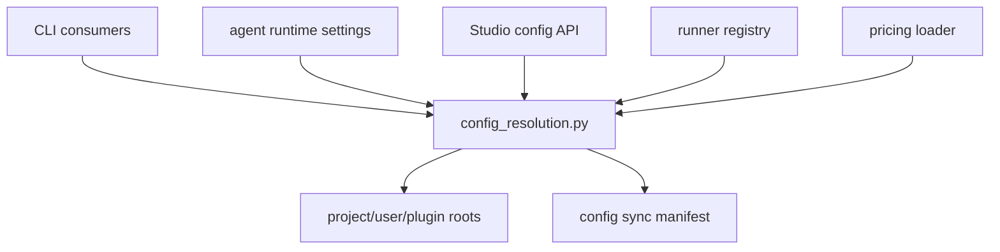
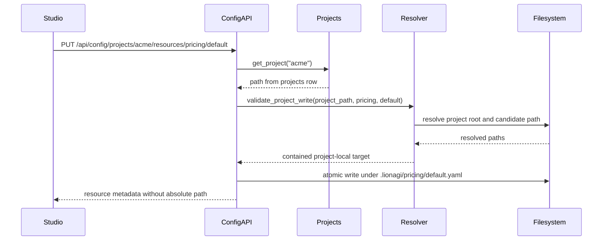

# ADR-0060: Unified Config Resolution

Status: APPROVE-WITH-FIXES
Date: 2026-05-27
Decision owners: @governance-maintainers
Depends on: none
Related: ADR-0026 (project detection), ADR-0057 (remote sandbox execution), ADR-0058 (play cost tracking)

## Context

lionagi has standardized on `.lionagi/` as the user-facing configuration namespace, but lookup
rules are still duplicated across CLI, runtime, Studio, and plugin code. Users can get different
answers depending on whether they invoke an agent, a playbook, a skill, settings, a runner, or a
Studio resource endpoint.

Current source shows the split. Runtime settings are loaded by `load_settings()`, which merges
`~/.lionagi/settings.yaml` and a project `.lionagi/settings.yaml` when project settings are
included (`lionagi/agent/settings.py:51`, `lionagi/agent/settings.py:65`,
`lionagi/agent/settings.py:75`). Named playbooks resolve only from `~/.lionagi/playbooks` and
already reject symlink escapes after `Path.resolve()` (`lionagi/cli/orchestrate/__init__.py:383`,
`lionagi/cli/orchestrate/__init__.py:413`). Skills have a separate resolver under
`~/.lionagi/skills/<name>/SKILL.md`, with the same resolved-path containment rule
(`lionagi/cli/skill.py:26`, `lionagi/cli/skill.py:53`). Studio projects store a mutable `path`
field and allow create/update of that path (`apps/studio/server/services/projects.py:150`,
`apps/studio/server/services/projects.py:177`), so any project-local write API must define how a
project name becomes a trusted filesystem root.

ADR-0058 depends on pricing lookup, and ADR-0057 depends on runner lookup. Those cannot each
define their own paths. Pricing must resolve through `<root>/pricing/<name>.yaml`; runner config
must resolve through `<root>/runners/<name>.yaml`. Settings must also be a first-class resource
kind, not a special case hidden behind `load_settings()`.

The configuration decision must be filesystem-first. It does not need new state.db or Postgres DDL.
The database may continue to store project rows and run provenance, but resource definitions,
compatibility links, generated indexes, and sync manifests remain files.

## Decision

### 1. Add one resolver for all resource kinds

Add `lionagi/config_resolution.py`. It owns resource kinds, root discovery, candidate conventions,
symlink containment, source provenance, shadowing, sync manifests, and project-local write
validation.

```python
from dataclasses import dataclass
from enum import StrEnum
from pathlib import Path


class ResourceKind(StrEnum):
    AGENTS = "agents"
    SKILLS = "skills"
    PLAYBOOKS = "playbooks"
    CHARTERS = "charters"
    HOOKS = "hooks"
    RUNNERS = "runners"
    GATES = "gates"
    PRICING = "pricing"
    MODELS = "models"
    MCP = "mcp"
    SETTINGS = "settings"


class SourceTier(StrEnum):
    PROJECT_LIONAGI = "project_lionagi"
    PROJECT_CLAUDE = "project_claude"
    USER_LIONAGI = "user_lionagi"
    USER_CLAUDE = "user_claude"
    PLUGIN = "plugin"


@dataclass(frozen=True, slots=True)
class ResourceLocation:
    kind: ResourceKind
    name: str
    path: Path
    tier: SourceTier
    root: Path
    layout: str
    plugin: str | None = None
    shadowed_by: tuple[Path, ...] = ()


def resolve_resource(
    kind: ResourceKind | str,
    name: str,
    cwd: Path | None = None,
    *,
    include_plugins: bool = True,
) -> ResourceLocation | None: ...


def list_resources(
    kind: ResourceKind | str,
    cwd: Path | None = None,
    *,
    include_plugins: bool = True,
) -> dict[str, ResourceLocation]: ...


def resource_provenance(
    kind: ResourceKind | str,
    name: str,
    cwd: Path | None = None,
    *,
    include_plugins: bool = True,
) -> list[ResourceLocation]: ...
```

The canonical cascade is:

```text
project .lionagi/
project .claude/
~/.lionagi/
~/.claude/
plugin defaults
```

Within each root, the resolver checks literal candidates for the resource kind. It never expands
untrusted glob patterns from user input. Resource names must be non-empty bare names: no path
separators, NUL, leading dots, `.` / `..`, or glob metacharacters.

| Kind | Canonical candidates |
| --- | --- |
| `agents` | `<root>/agents/<name>/<name>.md`, `<root>/agents/<name>.md` |
| `skills` | `<root>/skills/<name>/SKILL.md`, `<root>/skills/<name>/<name>.md`, `<root>/skills/<name>.md` |
| `playbooks` | `<root>/playbooks/<name>.playbook.yaml`, `<root>/playbooks/<name>.yaml`, `<root>/playbooks/<name>.yml` |
| `charters` | `<root>/charters/<name>.yaml`, `<root>/charters/<name>.yml`, `<root>/charters/<name>.md` |
| `hooks` | `<root>/hooks/<name>.py`, `<root>/hooks/<name>.sh`, `<root>/hooks/<name>.yaml` |
| `runners` | `<root>/runners/<name>.yaml`, `<root>/runners/<name>.yml` |
| `gates` | `<root>/gates/<name>.py`, `<root>/gates/<name>.yaml`, `<root>/gates/<name>.yml` |
| `pricing` | `<root>/pricing/<name>.yaml`, `<root>/pricing/<name>.yml` |
| `models` | `<root>/models/<name>.yaml`, `<root>/models/<name>.yml` |
| `mcp` | `<root>/.mcp.json`, `<root>/<name>.mcp.json` |
| `settings` | `<root>/settings.yaml`, `<root>/settings.yml` |

ADR-0058 references `ResourceKind.PRICING` for model pricing. ADR-0057 references
`ResourceKind.RUNNERS` for runner profiles. Existing `load_settings()` becomes a compatibility
wrapper over `ResourceKind.SETTINGS`; it no longer constructs settings paths independently.

### 2. Preserve settings merge behavior through the resolver

Settings need layering, not just a winning file. Keep the public `load_settings()` function for
compatibility, but implement it by asking the resolver for `ResourceKind.SETTINGS` provenance and
merging from lowest to highest precedence:

```python
def load_settings(
    project_dir: str | Path | None = None,
    *,
    include_project: bool = True,
) -> dict[str, object]:
    cwd = Path(project_dir) if project_dir is not None else None
    locations = resource_provenance(
        ResourceKind.SETTINGS,
        "settings",
        cwd=cwd,
        include_plugins=False,
    )
    if not include_project:
        locations = [loc for loc in locations if not loc.tier.value.startswith("project_")]
    return merge_settings_low_to_high(reversed(locations))
```

Hook safety rules remain in `lionagi/agent/settings.py`: trusted Python modules stay allowlisted,
and project settings remain opt-in for untrusted directories. The change is path authority, not hook
policy.

### 3. Follow symlinks only inside the selected roots

The resolver follows symlinks when they remain within the declared root. It rejects resolved
targets above that root.

```python
def contained_path(root: Path, candidate: Path) -> Path:
    resolved_root = root.expanduser().resolve(strict=True)
    resolved_candidate = candidate.expanduser().resolve(strict=True)
    resolved_candidate.relative_to(resolved_root)
    return resolved_candidate
```

This keeps the existing playbook and skill protections while applying them consistently to every
resource kind. A root may itself resolve to a user-managed location, but each candidate must remain
under that resolved root. Per-resource symlink escapes are rejected for reads, listing, Studio
content fetches, PUT, and DELETE.

### 4. Validate project to filesystem mapping before Studio writes

Studio project-local resource writes use the project row as the authority. The client supplies a
project name, resource kind, name, and content; it does not supply `cwd` or a filesystem root for
mutating endpoints.

For `PUT /api/config/projects/{project}/resources/{kind}/{name}` and
`DELETE /api/config/projects/{project}/resources/{kind}/{name}`:

1. Load the existing project row by name.
2. Require `projects.path` to be present.
3. Expand and resolve `projects.path` with `Path.resolve(strict=True)`.
4. Require the resolved path to be an existing directory.
5. Treat `<resolved-project-path>/.lionagi` as the only writable root.
6. Generate the canonical project-local candidate path for `kind` and `name`.
7. Resolve the candidate parent and final target after write or before delete.
8. Reject the request unless the resolved target is still under the resolved `.lionagi` root.

Project names never become filesystem paths. Mutable project path updates in
`apps/studio/server/services/projects.py` must canonicalize and validate the path before accepting
it for config writes.

### 5. Do not add state database DDL

ADR-0060 has no `state.db` or Postgres schema changes. It uses:

```text
resource files under .lionagi/ and .claude/
~/.lionagi/.config-sync-manifest.json
generated .lionagi/agents.md or ~/.lionagi/agents.md
existing projects.path rows for Studio project root validation
```

No config provenance, sync status, or resource content is stored in `state.db` by this ADR.

### Component Diagram



Coupling target: seven components, eight direct dependencies, `k = 8 / (7 * 6) = 0.19`.

## Implementation

### Core resolver

Phase 1 adds:

- `lionagi/config_resolution.py` with `ResourceKind`, `SourceTier`, `ResourceLocation`,
  root discovery, candidate generation, containment checks, `resolve_resource`,
  `list_resources`, and `resource_provenance`. Estimate: 320 LOC.
- Tests in `tests/cli/test_config_resolution.py` covering precedence, shadowing, invalid names,
  skill directory layouts, playbook layouts, settings, pricing, runners, and deterministic
  ordering. Estimate: 260 LOC.

### Existing consumers

Phase 2 migrates current path owners:

- `lionagi/cli/_agents.py`: preserve `AgentProfile` parsing while using
  `resolve_resource(ResourceKind.AGENTS, name)`. Estimate: 60 LOC changed.
- `lionagi/cli/orchestrate/__init__.py::_resolve_playbook_path()`: use
  `resolve_resource(ResourceKind.PLAYBOOKS, name)` and keep `-f` ad-hoc files separate.
  Estimate: 45 LOC changed.
- `lionagi/cli/skill.py::resolve_skill_path()`: use `resolve_resource(ResourceKind.SKILLS, name)`
  and preserve `strip_frontmatter()`. Estimate: 40 LOC changed.
- `lionagi/agent/settings.py::load_settings()`: use `ResourceKind.SETTINGS` provenance and keep
  explicit project trust behavior. Estimate: 80 LOC changed.
- ADR-0057 runner registry: load runner config from `ResourceKind.RUNNERS`, not from
  `settings.yaml` keys. Estimate: 60 LOC changed when ADR-0057 is implemented.
- ADR-0058 pricing loader: load pricing from `ResourceKind.PRICING`, not from any standalone
  pricing file. Estimate: 50 LOC changed when ADR-0058 is implemented.

### Config CLI and sync

Add `lionagi/cli/config.py` and register it in `lionagi/cli/main.py`:

```bash
li config list <kind> [--cwd PATH] [--all] [--json]
li config which <kind> <name> [--cwd PATH] [--json]
li config provenance <kind> <name> [--cwd PATH] [--json]
li config sync [kind] [--dry-run] [--reset] [--json]
li config agents-md [--cwd PATH] [--global] [--stdout] [--dry-run]
```

`li config sync` materializes compatibility links from `~/.claude/<kind>/` and plugin defaults into
`~/.lionagi/<kind>/`. It records managed paths in `~/.lionagi/.config-sync-manifest.json`, never
overwrites user-owned files, and removes only manifest-owned links on `--reset`.

Estimate: 260 LOC for CLI, 180 LOC for sync helpers, 300 LOC of tests.

### Studio API

Add `apps/studio/server/services/config.py` and `apps/studio/server/routers/config.py`, then mount
the router from `apps/studio/server/app.py`.

| Method | Path | Purpose |
| --- | --- | --- |
| `GET` | `/api/config/kinds` | List supported resource kinds and candidate conventions. |
| `GET` | `/api/config/resources` | List resources by kind, project, optional cwd, and `all`. |
| `GET` | `/api/config/resources/{kind}/{name}` | Return winning metadata and text content when safe. |
| `GET` | `/api/config/resources/{kind}/{name}/provenance` | Return all matching candidates in precedence order. |
| `PUT` | `/api/config/projects/{project}/resources/{kind}/{name}` | Create or update a project-local override. |
| `DELETE` | `/api/config/projects/{project}/resources/{kind}/{name}` | Delete a project-local override. |
| `POST` | `/api/config/sync` | Run sync with `kind`, `dry_run`, and `reset`. |
| `GET` | `/api/config/sync/status` | Return manifest status and unmanaged conflicts. |
| `POST` | `/api/config/agents-md` | Generate a project or global agents index. |

Studio responses must not expose absolute source paths. Return `tier`, `kind`, `name`,
`display_path`, `root_label`, `plugin`, `layout`, `managed`, and shadowing summaries. The CLI may
show absolute paths for local developer diagnostics, but Studio APIs should use display paths and
root labels.

Frontend work adds `apps/studio/frontend/app/projects/[name]/config/page.tsx`,
`apps/studio/frontend/lib/config.ts`, and reusable config components. Estimate: 700-900 LOC.

### Sequence Diagram



## Security

When `LIONAGI_STUDIO_AUTH_TOKEN` is set, all config endpoints require bearer authentication,
including `GET`. Config content may include prompts, hook commands, runner provider details, MCP
server paths, and pricing strategy.

The resolver follows symlinks only when the resolved candidate stays under the resolved root.
Symlink escape attempts must fail in `resolve_resource()`, `list_resources()`,
`resource_provenance()`, Studio content reads, project-local PUT, and project-local DELETE.

Studio mutating endpoints never accept client-supplied filesystem roots. They resolve the project
row, validate the project path, and write only under that project's `.lionagi/` directory.

API responses must not leak absolute paths. Use display paths relative to the selected project or
user root, plus a root label such as `project_lionagi` or `user_lionagi`.

Generated `agents.md` may include private operating instructions. The generator should use
owner-readable permissions where supported and should include a generated-file header so operators
edit the source resources, not the index.

## Migration

Phase 0 is documentation and tests only: no DDL.

1. Add the resolver and tests while keeping current callers unchanged.
2. Migrate agent, playbook, skill, and settings callers to the resolver behind compatibility
   wrappers.
3. Add config CLI commands and sync manifest handling.
4. Add Studio config API with auth, path containment, and project-root validation.
5. Update ADR-0057 implementation to reference `ResourceKind.RUNNERS`.
6. Update ADR-0058 implementation to reference `ResourceKind.PRICING`.
7. Deprecate direct path construction in callers once integration tests prove equivalent or better
   behavior.

Acceptance checks:

- `ResourceKind.SETTINGS` exists and `load_settings()` no longer owns independent path logic.
- Pricing resolves through `<root>/pricing/<name>.yaml` or `.yml`.
- Runner profiles resolve through `<root>/runners/<name>.yaml` or `.yml`.
- Symlink targets inside roots are accepted; symlink targets above roots are rejected.
- Studio PUT and DELETE validate project rows and resolved project paths before touching disk.
- Config endpoints return `401` without a valid bearer token when auth is configured.
- No state.db or Postgres DDL is added for config resolution.

Domain utility: SKIPPED - no lore suggest/compose tool is available in this execution environment.
