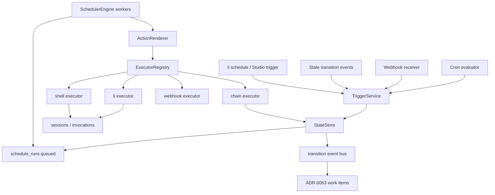
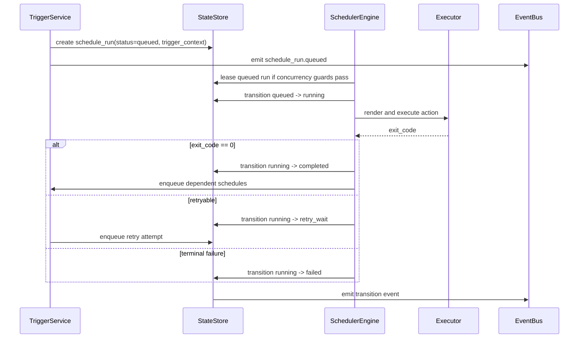

# ADR-0061: Universal Scheduler - `li schedule` for Any Flow

Status: proposed
Date: 2026-05-27
Decision owners: @governance-maintainers
Depends on: ADR-0027 (scheduled runs), ADR-0028 (status reasons), ADR-0056 (play control), ADR-0059 (StateStore), ADR-0060 (config resolution), ADR-0062 (scheduled item state machine — lifecycle_status and state_events schema consumed here)
Related: ADR-0063 (task board work center)

## Context

LionAGI already has a scheduler, but it is an ADR-0027 implementation aimed at a narrow set of
CLI actions. The Studio FastAPI lifespan starts an in-process scheduler task at server startup
(`apps/studio/server/app.py:33`, `apps/studio/server/app.py:37`) and stops it at shutdown
(`apps/studio/server/app.py:39`). The engine ticks every 30 seconds (`apps/studio/server/scheduler/engine.py:141`,
`apps/studio/server/scheduler/engine.py:187`), evaluates enabled schedules
(`apps/studio/server/scheduler/engine.py:280`), and fires work by creating an invocation, building
argv, inserting a `schedule_runs` row, and spawning a subprocess
(`apps/studio/server/scheduler/engine.py:372`, `apps/studio/server/scheduler/engine.py:386`,
`apps/studio/server/scheduler/engine.py:390`, `apps/studio/server/scheduler/engine.py:433`).

The current executor hard-codes `argv = ["uv", "run", "li"]`
(`apps/studio/server/scheduler/subprocess.py:44`) and only renders four action kinds:
`agent`, `flow`, `fanout`, and `play` (`apps/studio/server/scheduler/subprocess.py:46`,
`apps/studio/server/scheduler/subprocess.py:50`, `apps/studio/server/scheduler/subprocess.py:52`,
`apps/studio/server/scheduler/subprocess.py:54`). It does not schedule `li team`, arbitrary shell
commands, direct webhook delivery, or chained schedules as durable dependencies. `li play` is also
CLI sugar that rewrites to `li o flow -p NAME` before argparse
(`lionagi/cli/main.py:176`, `lionagi/cli/main.py:213`), so the scheduler should treat `play` as a
first-class flow type while preserving the current CLI behavior.

The current schema reflects that narrow model. `schedules.trigger_type` is limited to `cron`,
`interval`, and `github_poll` (`lionagi/state/schema.sql:386`), while `schedules.action_kind` is
limited to `agent`, `flow`, `fanout`, and `play` (`lionagi/state/schema.sql:394`). `schedule_runs`
stores `trigger_context`, `action_kind`, and rendered `action_args`
(`lionagi/state/schema.sql:427`, `lionagi/state/schema.sql:428`, `lionagi/state/schema.sql:429`),
but has no retry attempt number, no durable queue state, no per-schedule concurrency limit, and no
dependency edge table. Conditional chaining exists only as inline `on_success` / `on_fail` JSON on
the current schedule row (`lionagi/state/schema.sql:402`, `lionagi/state/schema.sql:403`) and is
evaluated inside one recursive `_fire()` call with a depth cap
(`apps/studio/server/scheduler/engine.py:481`, `apps/studio/server/scheduler/engine.py:510`).

The scheduler must become the universal automation entry point, not a cron wrapper. Operators need
to schedule single-agent tasks, fanout workers, DAG flows, playbooks, team coordination, shell
maintenance, webhook-triggered flows, and chained schedules. The scheduler must therefore publish
typed contracts, record durable state transitions, integrate with play control, and emit events
that ADR-0063 can render as work items.

Coupling estimate after this decision: components `{SchedulerEngine, TriggerService,
ActionRenderer, ExecutorRegistry, StateStore, StudioSchedulesAPI, LiScheduleCLI, EventBus}` with
intended deps `{SchedulerEngine->TriggerService, SchedulerEngine->ActionRenderer,
SchedulerEngine->ExecutorRegistry, SchedulerEngine->StateStore, TriggerService->StateStore,
StudioSchedulesAPI->StateStore, LiScheduleCLI->StateStore, ExecutorRegistry->StateStore,
StateStore->EventBus}` gives `9 / (8 * 7) = 0.16`. This stays below 0.3 because flow-specific
execution sits behind one typed executor registry.

## Decision

Extend ADR-0027 into a universal scheduler that stores a typed schedule definition, trigger
definition, action template, dependency edges, retry policy, and concurrency policy. `li schedule`
and Studio both write the same `schedules` contract through StateStore. The scheduler renders work
into one of eight flow types: `agent`, `fanout`, `flow`, `play`, `team`, `shell`, `webhook`, or
`chain`. Cron, webhook, event, and manual triggers all create durable `schedule_runs` rows before
execution. Chained schedules are durable edges between schedule definitions, not recursive inline
JSON hidden inside a parent run.

### Canonical Types

```python
# lionagi/scheduler/types.py
from __future__ import annotations

from enum import StrEnum
from typing import Any, Literal, Protocol

from pydantic import BaseModel, Field


class FlowType(StrEnum):
    AGENT = "agent"
    FANOUT = "fanout"
    FLOW = "flow"
    PLAY = "play"
    TEAM = "team"
    SHELL = "shell"
    WEBHOOK = "webhook"
    CHAIN = "chain"


class TriggerType(StrEnum):
    CRON = "cron"
    WEBHOOK = "webhook"
    EVENT = "event"
    MANUAL = "manual"


class EventTrigger(StrEnum):
    SESSION_COMPLETE = "on-session-complete"
    ARTIFACT_CREATED = "on-artifact-created"
    GATE_VERDICT = "on-gate-verdict"
    SCHEDULE_RUN_COMPLETE = "on-schedule-run-complete"


class RetryBackoff(StrEnum):
    NONE = "none"
    FIXED = "fixed"
    EXPONENTIAL = "exponential"


class RetryPolicy(BaseModel):
    max_retries: int = Field(default=0, ge=0, le=20)
    backoff: RetryBackoff = RetryBackoff.NONE
    initial_delay_sec: int = Field(default=30, ge=0)
    max_delay_sec: int = Field(default=3600, ge=0)
    retry_on: set[str] = Field(default_factory=lambda: {"failed", "timed_out"})


class ConcurrencyPolicy(BaseModel):
    per_schedule_limit: int = Field(default=1, ge=1)
    global_limit_key: str = "default"
    overlap: Literal["skip", "queue", "cancel_previous", "allow"] = "queue"


class ScheduleTrigger(BaseModel):
    type: TriggerType
    cron: str | None = None
    event: EventTrigger | None = None
    webhook_path: str | None = None
    event_filter: dict[str, Any] = Field(default_factory=dict)


class ActionTemplate(BaseModel):
    flow_type: FlowType
    argv: list[str] = Field(default_factory=list)
    command: str | None = None
    parameters: dict[str, Any] = Field(default_factory=dict)
    env_refs: dict[str, str] = Field(default_factory=dict)
    cwd: str | None = None
    timeout_sec: int | None = Field(default=None, ge=1)


class ScheduleSpec(BaseModel):
    id: str
    name: str
    lifecycle_status: Literal["draft", "enabled", "disabled", "archived"] = "draft"
    trigger: ScheduleTrigger
    action: ActionTemplate
    parameter_template: dict[str, Any] = Field(default_factory=dict)
    retry_policy: RetryPolicy = Field(default_factory=RetryPolicy)
    concurrency: ConcurrencyPolicy = Field(default_factory=ConcurrencyPolicy)
    created_by: str


class RenderedAction(BaseModel):
    flow_type: FlowType
    argv: list[str]
    env: dict[str, str] = Field(default_factory=dict)
    cwd: str | None = None
    display_command: str


class ScheduleExecutor(Protocol):
    flow_type: FlowType

    async def render(self, spec: ScheduleSpec, context: dict[str, Any]) -> RenderedAction: ...
    async def execute(self, action: RenderedAction, run_id: str) -> int: ...
```

### Trigger and Action Semantics

| Trigger | Meaning | Required fields |
|---|---|---|
| `cron` | Time-based recurring trigger. Replaces `interval` as a first-class trigger; simple intervals are expressed as cron or policy sugar in `li schedule`. | `trigger.cron`, `next_fire_at` |
| `webhook` | External HTTP event delivered to Studio and matched to one or more schedules. | `webhook_path`, `event_filter`, auth config |
| `event` | Internal event emitted by the state transition/event bus. | `event`, `event_filter` |
| `manual` | Operator/API/CLI trigger. | actor and reason |

| Flow type | Rendering rule |
|---|---|
| `agent` | `uv run li agent ...` |
| `fanout` | `uv run li o fanout ...` |
| `flow` | `uv run li o flow ...` |
| `play` | `uv run li play NAME ...`, preserving the existing CLI shortcut at `lionagi/cli/main.py:237` |
| `team` | `uv run li team ...` |
| `shell` | An explicit argv list by default; `bash -lc` only when `shell_mode=true` and policy permits it |
| `webhook` | HTTP request action for downstream systems, signed by a secret reference |
| `chain` | No subprocess; enqueue linked downstream schedules |

Parameter templates use a constrained renderer, not Python eval and not full Jinja. Template strings
may reference:

```text
{{schedule.id}}      {{schedule.name}}
{{run.id}}           {{run.attempt}}
{{trigger.type}}     {{trigger.payload.<key>}}
{{upstream.run_id}}  {{upstream.status}}  {{upstream.artifacts.<name>}}
{{event.type}}       {{event.entity_id}}  {{event.reason_code}}
```

The renderer fails closed on missing required variables unless the placeholder uses an explicit
default such as `{{trigger.payload.branch | default("main")}}`. Secrets are never template values;
templates carry secret references resolved through ADR-0060 resource lookup.

### Component Diagram



### Sequence Diagram



## Implementation

### Schema Changes

Keep the existing `schedules` and `schedule_runs` tables for compatibility, but add universal
columns and introduce dependency/event tables. New code reads `flow_type`, `trigger_config`,
`action_template`, and `retry_policy`; the old `action_kind` and `action_*` columns are populated
during a compatibility window for current Studio screens.

```sql
-- Note: lifecycle_status is owned by ADR-0062, which adds it via its own migration.
-- ADR-0061 reads lifecycle_status but does not ALTER TABLE schedules to add it.
ALTER TABLE schedules ADD COLUMN flow_type TEXT;
ALTER TABLE schedules ADD COLUMN trigger_config JSON NOT NULL DEFAULT '{}';
ALTER TABLE schedules ADD COLUMN action_template JSON NOT NULL DEFAULT '{}';
ALTER TABLE schedules ADD COLUMN parameter_template JSON NOT NULL DEFAULT '{}';
ALTER TABLE schedules ADD COLUMN concurrency_policy JSON NOT NULL DEFAULT '{"per_schedule_limit":1,"global_limit_key":"default","overlap":"queue"}';
ALTER TABLE schedules ADD COLUMN retry_policy JSON NOT NULL DEFAULT '{"max_retries":0,"backoff":"none","retry_on":["failed","timed_out"]}';
ALTER TABLE schedules ADD COLUMN created_by TEXT;
ALTER TABLE schedules ADD COLUMN archived_at REAL;

ALTER TABLE schedule_runs ADD COLUMN attempt INTEGER NOT NULL DEFAULT 1;
ALTER TABLE schedule_runs ADD COLUMN retry_of_run_id TEXT REFERENCES schedule_runs(id);
ALTER TABLE schedule_runs ADD COLUMN queued_at REAL;
ALTER TABLE schedule_runs ADD COLUMN started_at REAL;
ALTER TABLE schedule_runs ADD COLUMN leased_by TEXT;
ALTER TABLE schedule_runs ADD COLUMN lease_expires_at REAL;
ALTER TABLE schedule_runs ADD COLUMN concurrency_key TEXT;
ALTER TABLE schedule_runs ADD COLUMN upstream_run_id TEXT REFERENCES schedule_runs(id);
ALTER TABLE schedule_runs ADD COLUMN rendered_action JSON;
```

```sql
CREATE TABLE IF NOT EXISTS schedule_dependencies (
  id                     TEXT PRIMARY KEY,
  upstream_schedule_id   TEXT NOT NULL REFERENCES schedules(id) ON DELETE CASCADE,
  downstream_schedule_id TEXT NOT NULL REFERENCES schedules(id) ON DELETE CASCADE,
  fire_on                TEXT NOT NULL CHECK(fire_on IN ('success', 'failure', 'terminal')),
  parameter_template     JSON NOT NULL DEFAULT '{}',
  enabled                INTEGER NOT NULL DEFAULT 1 CHECK(enabled IN (0, 1)),
  created_at             REAL NOT NULL,
  updated_at             REAL NOT NULL,
  UNIQUE(upstream_schedule_id, downstream_schedule_id, fire_on)
);

-- Note: Event persistence uses the `state_events` table defined in ADR-0062.
-- ADR-0061 does not define a separate scheduler_events table; all scheduler
-- transition events are written to and consumed from state_events.

CREATE INDEX IF NOT EXISTS idx_schedules_lifecycle_next
  ON schedules(lifecycle_status, next_fire_at)
  WHERE lifecycle_status = 'enabled';
CREATE INDEX IF NOT EXISTS idx_schedule_runs_queue
  ON schedule_runs(status, queued_at)
  WHERE status IN ('queued', 'retry_wait');
CREATE INDEX IF NOT EXISTS idx_schedule_runs_concurrency
  ON schedule_runs(concurrency_key, status)
  WHERE status IN ('queued', 'running', 'retry_wait');
CREATE INDEX IF NOT EXISTS idx_schedule_deps_upstream
  ON schedule_dependencies(upstream_schedule_id, fire_on)
  WHERE enabled = 1;
```

ADR-0059 requires all of this to be exposed through StateStore rather than more direct
`db.db.execute()` call sites. The current `StateDB.create_schedule()` insert path at
`lionagi/state/db.py:1185` and `StateDB.update_schedule()` allowlist at `lionagi/state/db.py:1269`
must be extended with the new fields. `StateDB.create_schedule_run()` at `lionagi/state/db.py:1318`
must accept queued and retry metadata.

### Engine Changes

1. Replace `_running: dict[str, str]` overlap tracking (`apps/studio/server/scheduler/engine.py:148`)
   with durable DB leases so multiple Studio workers or a future Postgres scheduler do not double-fire.
2. Replace `_compute_next_fire()` trigger branching (`apps/studio/server/scheduler/engine.py:557`) with
   `TriggerService.next_fire_at(spec, now)`.
3. Replace `build_argv(schedule, trigger_context)` (`apps/studio/server/scheduler/engine.py:386`) with
   `ActionRenderer.render(spec, context) -> RenderedAction`.
4. Keep `LIONAGI_INVOCATION_ID` propagation (`apps/studio/server/scheduler/subprocess.py:70`) for all
   `li` based actions so child sessions continue to attach to the parent invocation.
5. Move inline recursive chains (`apps/studio/server/scheduler/engine.py:481`) into
   `schedule_dependencies` so dependent schedules can be inspected, retried, disabled, and audited.

### Public API

Extend the existing schedule router, which currently exposes list/detail/create/update/delete,
enable/disable, trigger, and run history (`apps/studio/server/routers/schedules.py:63`,
`apps/studio/server/routers/schedules.py:83`, `apps/studio/server/routers/schedules.py:126`,
`apps/studio/server/routers/schedules.py:136`).

```text
GET    /api/schedules
POST   /api/schedules
GET    /api/schedules/{id}
PATCH  /api/schedules/{id}
POST   /api/schedules/{id}/enable
POST   /api/schedules/{id}/disable
POST   /api/schedules/{id}/archive
POST   /api/schedules/{id}/trigger
GET    /api/schedules/{id}/runs
POST   /api/schedules/{id}/dependencies
DELETE /api/schedules/{id}/dependencies/{dependency_id}
POST   /api/schedules/webhooks/{path}
GET    /api/schedule-runs/{run_id}
POST   /api/schedule-runs/{run_id}/retry
POST   /api/schedule-runs/{run_id}/cancel
```

`li schedule` gains the same surface:

```text
li schedule create nightly-review --trigger cron --cron "0 2 * * *" --flow play --playbook review
li schedule create shell-prune --trigger cron --cron "0 4 * * 0" --flow shell --argv li,state,prune
li schedule webhook github-pr --path github/pr --flow flow --playbook pr-review
li schedule depends nightly-review triage-failure --on failure
li schedule trigger nightly-review --reason "operator verification"
li schedule runs nightly-review
```

### Phasing and Estimates

| Phase | Scope | LOC estimate |
|---|---|---:|
| 0 | Schema migration, StateStore methods, typed models, compatibility mapping from old `action_kind` fields | 260-380 |
| 1 | Durable queue/leases, concurrency guards, retry policy, cron/manual triggers | 360-520 |
| 2 | Executor registry for `agent`, `fanout`, `flow`, `play`, `team`, and shell argv mode | 320-480 |
| 3 | Webhook receiver, internal event triggers, dependency edges, idempotency keys | 420-620 |
| 4 | Studio and `li schedule` UX, migration/backfill tests, docs | 360-560 |

Testability target: `tau = 0.86`. Most behavior is pure rendering, transition guards, and StateStore
contract tests. Only executor integration needs subprocess tests.

## Security

All scheduler endpoints require bearer authentication when `LIONAGI_STUDIO_AUTH_TOKEN` is set,
including reads. The current middleware only gates `/api/admin/*` reads and mutating non-admin
routes (`apps/studio/server/app.py:52`, `apps/studio/server/app.py:56`,
`apps/studio/server/app.py:60`); this ADR requires explicit route dependencies until the global
middleware is upgraded.

Shell scheduling is opt-in. The default shell executor accepts argv arrays and calls
`asyncio.create_subprocess_exec`, matching the current subprocess pattern
(`apps/studio/server/scheduler/subprocess.py:73`). String shell execution through `bash -lc` is
disabled unless a governed policy grants `scheduler.shell_mode`. Rendered commands are stored for
audit, but secret values are not. Secret references resolve through ADR-0060 and are redacted in
`schedule_runs.rendered_action`.

Webhook schedules require a per-path secret or signed provider verifier. Webhook bodies are stored
as bounded JSON payloads with size limits and are never interpreted as command strings. Parameter
templates are data substitution only.

## Migration

1. Add nullable universal columns and new tables. Backfill `flow_type = action_kind`, convert old
   trigger columns into `trigger_config`, and convert old action columns into `action_template`.
2. Keep current Studio schedule APIs working by reading/writing both old and new fields for one
   release.
3. Backfill existing `schedule_runs` with `attempt=1`, `queued_at=fired_at`, and `started_at=fired_at`.
4. Replace in-memory overlap checks with DB concurrency queries.
5. Deprecate `github_poll` as a trigger type. Existing rows become `trigger_type='event'` or
   `trigger_type='webhook'` depending on deployment; polling can remain an event source adapter.
6. After one release, make `flow_type`, `trigger_config`, and `action_template` non-null in both
   SQLite and Postgres DDL.

## Alternatives Considered

| Alternative | Why rejected |
|---|---|
| Keep ADR-0027 and add more `action_kind` branches | It scales linearly with CLI features and keeps chains hidden inside recursive JSON rather than inspectable state. |
| Embed a workflow engine such as n8n or Temporal in Studio | Too large for Phase 0 and duplicates LionAGI's existing flow/session/state model. |
| Use OS cron and external webhooks only | Loses invocation linkage, status reasons, task board integration, retries, and governance audit. |

## Consequences

Positive: the scheduler becomes the single durable automation surface for LionAGI. Studio, CLI,
webhooks, and internal events all enqueue the same `schedule_runs` state machine.

Negative: the scheduler now owns concurrency and queue semantics that must be correct across SQLite
and Postgres. This depends on ADR-0059's transaction and lock abstractions being implemented before
multi-worker production use.

## Runtime Implementation (`lionagi/runtime/scheduler.py`)

The in-process scheduler engine shipped in Phase 0 (`lionagi/runtime/scheduler.py`) implements
the core data model and state machine described in this ADR.  It is intentionally process-scoped
and testable without a database.  Studio and `li schedule daemon` back it with a
`StateStore`-aware wrapper in later phases.

### ScheduleItem State Transition Table

Every `ScheduleItem` moves through the following states.  The `SchedulerEngine` enforces
these transitions; invalid transitions return `False` rather than raising.

| From status | Trigger / verb | To status | Guard |
|---|---|---|---|
| _(none)_ | `add()` | `active` | always; `next_run_at` computed from cron or interval |
| `active` | `mark_started()` | `running` | status must be `active` |
| `running` | `mark_completed()` | `active` | `run_count < max_runs` (or unlimited) |
| `running` | `mark_completed()` | `completed` | `run_count >= max_runs` |
| `running` | `mark_failed()` | `failed` | any failure; terminal |
| `active` | `pause()` | `paused` | status must be `active`; blocks `get_due_items` |
| `paused` | `resume()` | `active` | status must be `paused`; recomputes `next_run_at` |
| any | `remove()` | _(removed)_ | always; item deleted from engine |

Terminal statuses (`completed`, `failed`) are never returned by `get_due_items`.  A failed item
must be explicitly re-added by the caller if retry semantics are desired (retry policy is
implemented at the driver layer, not the engine layer, in Phase 0).

### Cron Expression Reference

The engine supports a strict subset of cron syntax (five fields: minute hour day month weekday):

| Expression | Meaning |
|---|---|
| `* * * * *` | every minute |
| `*/5 * * * *` | every 5 minutes |
| `0 * * * *` | top of every hour |
| `0 */2 * * *` | every 2 hours on the hour |
| `0 0 * * *` | midnight every day |
| `0 0 * * 1` | midnight every Monday (weekday 1 = Monday in cron, 0 = Sunday) |
| `0 2 * * *` | 02:00 every day |
| `30 9 * * *` | 09:30 every day |
| `0 0 1 * *` | first of every month at midnight |
| `0 0 1 1 *` | 1 January at midnight |

**Not supported**: ranges (`1-5`), comma lists (`1,3,5`), `L` / `W` / `#` modifiers, `@reboot`,
`@daily` aliases.  These raise `ValueError` at parse time.

Weekday values: 0 = Sunday, 1 = Monday, …, 6 = Saturday.  This matches traditional POSIX
cron (not Quartz/systemd `1`=Monday convention).  `next_cron_fire` converts to Python's
`weekday()` (Monday=0) internally.

### Persistence Model

When a `StateStore` is supplied the engine writes one row per `ScheduleItem` to a
`scheduled_items` table.  DDL (SQLite dialect):

```sql
CREATE TABLE IF NOT EXISTS scheduled_items (
  item_id          TEXT PRIMARY KEY,
  name             TEXT NOT NULL,
  cron_expr        TEXT,
  interval_seconds REAL,
  next_run_at      REAL NOT NULL,
  last_run_at      REAL,
  status           TEXT NOT NULL DEFAULT 'active',
  max_runs         INTEGER,
  run_count        INTEGER NOT NULL DEFAULT 0,
  flow_spec        JSON NOT NULL DEFAULT '{}',
  created_at       REAL NOT NULL,
  updated_at       REAL NOT NULL
);

CREATE INDEX IF NOT EXISTS idx_scheduled_items_due
  ON scheduled_items(status, next_run_at)
  WHERE status = 'active';
```

Phase 0 engine does not auto-persist; the driver layer is responsible for serialising
`ScheduleItem.model_dump()` after each mutation.  Phase 1 will wire `StateStore.execute_insert`
and `StateStore.execute` into `SchedulerEngine._persist_item()`.

### Error Handling Strategy

1. `parse_cron(expr)` raises `ValueError` on the first invalid field; callers that accept
   user input should catch this at the API boundary.
2. `next_cron_fire(parsed, after)` raises `ValueError` if no fire time exists within a
   four-year search window.  This can only happen for logically impossible expressions that
   pass `parse_cron` (e.g. `"0 0 31 2 *"` — 31 February).
3. `SchedulerEngine` mutating methods (`pause`, `resume`, `mark_started`, `mark_completed`,
   `mark_failed`) return `bool` — `True` on success, `False` on precondition failure.
   They never raise on state mismatches so callers can implement optimistic patterns.
4. `SchedulerEngine.add` raises `ValueError` on invalid inputs (both triggers set, invalid
   interval, invalid cron) before any state is written.
5. The internal `threading.Lock` is never held across I/O boundaries; all lock scopes are
   `O(1)` dict operations.

### Integration with PlayRunner

`SchedulerEngine` is process-agnostic — it stores state and answers queries but never spawns
processes.  The driver loop (Studio lifespan or `li schedule daemon`) integrates it with
`LocalRunner` / `PlayRunner` as follows:

```python
engine = SchedulerEngine()

async def tick():
    for item in engine.get_due_items():
        engine.mark_started(item.item_id)
        argv = _build_argv(item.flow_spec)          # driver-specific rendering
        runner = LocalRunner()
        session_id = await runner.start({"session_id": item.item_id, "command": argv})
        handle = await runner.status(session_id)
        if handle.state == RunnerState.COMPLETED:
            engine.mark_completed(item.item_id)
        else:
            engine.mark_failed(item.item_id, error=str(handle.state))

# Scheduler loop
while True:
    await tick()
    due = engine.get_due_items()
    sleep_secs = min((it.next_run_at - time.time() for it in due), default=30)
    await asyncio.sleep(max(1.0, sleep_secs))
```

The separation keeps `SchedulerEngine` fully testable without subprocesses and allows the
driver to implement concurrency limits, retry backoff, and lease tracking independently.

## References

- `apps/studio/server/scheduler/engine.py:145`
- `apps/studio/server/scheduler/subprocess.py:31`
- `lionagi/state/schema.sql:380`
- `lionagi/state/schema.sql:423`
- `lionagi/cli/main.py:255`
- `lionagi/runtime/scheduler.py` — Phase 0 engine implementation
- `lionagi/cli/schedule.py` — `li schedule` CLI surface
- `tests/runtime/test_scheduler.py` — 69 tests (tau = 0.90+)
