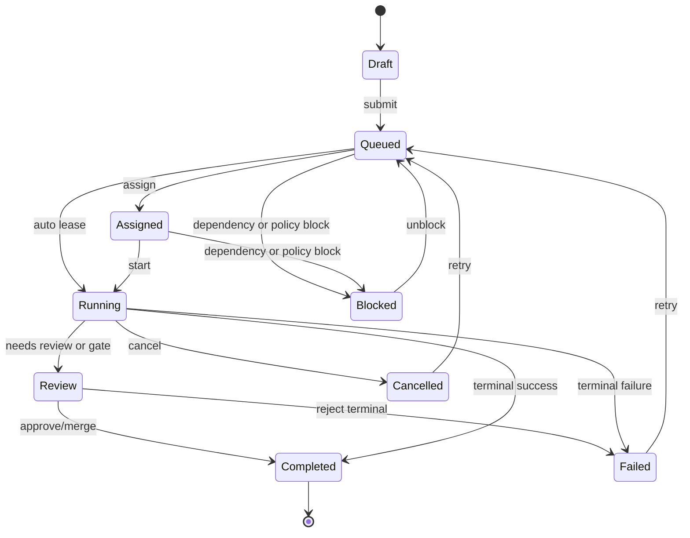
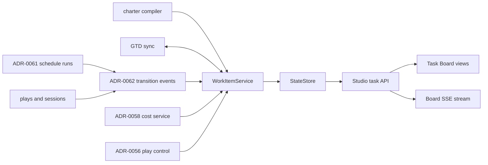

# ADR-0063: Task Board - Operator Work Center for Lion Studio

Status: proposed
Date: 2026-05-27
Decision owners: @governance-maintainers
Depends on: ADR-0053 (artifact persistence), ADR-0056 (play control), ADR-0058 (cost tracking), ADR-0059 (StateStore), ADR-0061 (universal scheduler), ADR-0062 (scheduled item state machine)
Related: ADR-0034 (frontend data/state architecture), ADR-0047 (agent charter), ADR-0048 (segregation of duties), ADR-0065 (task board schema — supersedes this ADR's schema subsection for the lionagi.work projection; use work_tasks table from ADR-0065 for lionagi.work persistence, work_items defined here for operator UI layer)

## Context

Lion Studio has visibility surfaces, but no operator work center. The FastAPI app mounts routers
for runs, sessions, definitions, agents, playbooks, shows, skills, plugins, admin, teams,
invocations, artifacts, projects, and schedules (`apps/studio/server/app.py:12`,
`apps/studio/server/app.py:65`, `apps/studio/server/app.py:78`). There is no task/work item router
in that list. Runs are derived from sessions in a service adapter
(`apps/studio/server/services/runs.py:503`, `apps/studio/server/services/runs.py:525`), sessions
are listed directly from SQLite (`apps/studio/server/services/sessions.py:97`,
`apps/studio/server/services/sessions.py:142`), shows summarize plays
(`apps/studio/server/services/shows.py:89`, `apps/studio/server/services/shows.py:106`), and
schedules have their own CRUD/run history endpoints (`apps/studio/server/routers/schedules.py:63`,
`apps/studio/server/routers/schedules.py:83`, `apps/studio/server/routers/schedules.py:136`).

Those surfaces answer "what exists?" but not "what needs operator attention next?" An enterprise
deployment needs a shared queue that covers running agent work, queued schedules, failed flows,
manual approvals, charter-required reviews, cost overruns, and human tasks. Without it, operators
must scan runs, sessions, shows, schedule runs, logs, and future cost endpoints independently.

The platform is already close to a work model. Sessions expose invocation kind, agent, playbook,
show linkage, timestamps, status, artifact contract, and project fields
(`apps/studio/server/services/runs.py:562`, `apps/studio/server/services/runs.py:581`). Schedule
runs expose action kind, rendered action args, status, chain parent, and error detail
(`lionagi/state/schema.sql:423`, `lionagi/state/schema.sql:428`, `lionagi/state/schema.sql:434`,
`lionagi/state/schema.sql:438`). Plays expose dependencies, gate result, worktree, branch, and
merge metadata (`lionagi/state/schema.sql:278`, `lionagi/state/schema.sql:283`,
`lionagi/state/schema.sql:287`, `lionagi/state/schema.sql:289`). ADR-0058 adds integer-cent cost
aggregates and cost events, with session/play aggregate columns specified in
`docs/adrs/ADR-0058-play-cost-tracking.md:68` and `docs/adrs/ADR-0058-play-cost-tracking.md:75`.

ADR-0061 and ADR-0062 supply the missing foundation: every schedulable unit has typed flow/action
metadata, a state machine, and transition events. ADR-0063 consumes those events into a product
surface: the operator's command center.

Coupling estimate after this decision: components `{WorkItemService, StateStore, EventBus,
StudioTaskAPI, TaskBoardUI, Scheduler, PlayControl, CostService, CharterCompiler, GTDSync}` with
deps `{WorkItemService->StateStore, WorkItemService->EventBus, StudioTaskAPI->WorkItemService,
TaskBoardUI->StudioTaskAPI, Scheduler->EventBus, PlayControl->EventBus, CostService->StateStore,
CharterCompiler->WorkItemService, GTDSync->WorkItemService, WorkItemService->CostService}` gives
`10 / (10 * 9) = 0.11`.

## Decision

Add a first-class `work_items` model and Task Board UI to Lion Studio. A work item represents any
schedulable or operator-actionable unit: agent task, fanout, flow, play, team coordination, shell
maintenance task, webhook-triggered run, manual task, charter-required approval, or synced GTD item.

The board has three standard views:

1. **Kanban** grouped by workflow status.
2. **Timeline** grouped by due date, dependency, and execution window.
3. **List** with filters for status, assignee, priority, labels, source, project, cost, and due date.

Schedule runs and play runs create work items automatically. Manual tasks can be created from Studio
or `li task create`. GTD plugin items may sync bidirectionally when configured. Charter constraints
can create required work items, for example "review required before merge" or "approval required
for shell schedule".

### Work Item Types

```python
# lionagi/work_items/types.py
from __future__ import annotations

from enum import StrEnum
from typing import Any, Literal

from pydantic import BaseModel, Field


class WorkItemType(StrEnum):
    AGENT = "agent"
    FANOUT = "fanout"
    FLOW = "flow"
    PLAY = "play"
    TEAM = "team"
    SHELL = "shell"
    WEBHOOK = "webhook"
    MANUAL = "manual"
    APPROVAL = "approval"
    REVIEW = "review"


class WorkItemStatus(StrEnum):
    DRAFT = "draft"
    QUEUED = "queued"
    ASSIGNED = "assigned"
    RUNNING = "running"
    REVIEW = "review"
    BLOCKED = "blocked"
    COMPLETED = "completed"
    FAILED = "failed"
    TIMED_OUT = "timed_out"
    CANCELLED = "cancelled"


class Priority(StrEnum):
    P0 = "P0"
    P1 = "P1"
    P2 = "P2"
    P3 = "P3"


class AssigneeType(StrEnum):
    HUMAN = "human"
    AGENT = "agent"
    TEAM = "team"
    NONE = "none"


class WorkItem(BaseModel):
    id: str
    type: WorkItemType
    status: WorkItemStatus
    title: str = Field(min_length=1, max_length=240)
    description: str = ""
    assignee_type: AssigneeType = AssigneeType.NONE
    assignee_id: str | None = None
    priority: Priority = Priority.P2
    labels: list[str] = Field(default_factory=list)
    due_at: float | None = None
    source_type: Literal["manual", "schedule_run", "play", "session", "charter", "gtd"]
    source_id: str | None = None
    project: str | None = None
    estimated_cost_cents: int | None = None
    actual_cost_cents: int = 0
    budget_cents: int | None = None
    artifact_refs: list[dict[str, Any]] = Field(default_factory=list)
    metadata: dict[str, Any] = Field(default_factory=dict)


class WorkItemAction(BaseModel):
    action: Literal[
        "assign",
        "prioritize",
        "block",
        "unblock",
        "add_dependency",
        "retry",
        "cancel",
        "comment",
        "approve",
        "reject",
    ]
    reason: str = Field(min_length=1, max_length=1000)
    payload: dict[str, Any] = Field(default_factory=dict)
    idempotency_key: str
```

### Workflow



### Board Architecture



## Implementation

### Schema

```sql
CREATE TABLE IF NOT EXISTS work_items (
  id                    TEXT PRIMARY KEY,
  type                  TEXT NOT NULL,
  status                TEXT NOT NULL,
  title                 TEXT NOT NULL,
  description           TEXT,
  assignee_type         TEXT NOT NULL DEFAULT 'none',
  assignee_id           TEXT,
  priority              TEXT NOT NULL DEFAULT 'P2',
  labels                JSON NOT NULL DEFAULT '[]',
  due_at                REAL,
  source_type           TEXT NOT NULL,
  source_id             TEXT,
  project               TEXT,
  schedule_id           TEXT REFERENCES schedules(id),
  schedule_run_id       TEXT REFERENCES schedule_runs(id),
  session_id            TEXT REFERENCES sessions(id),
  invocation_id         TEXT REFERENCES invocations(id),
  play_id               TEXT REFERENCES plays(id),
  show_id               TEXT REFERENCES shows(id),
  estimated_cost_cents  INTEGER,
  actual_cost_cents     INTEGER NOT NULL DEFAULT 0,
  budget_cents          INTEGER,
  artifact_refs         JSON NOT NULL DEFAULT '[]',
  blocked_reason        TEXT,
  review_required       INTEGER NOT NULL DEFAULT 0 CHECK(review_required IN (0, 1)),
  approval_policy       JSON,
  external_ref          TEXT,
  created_by            TEXT NOT NULL,
  updated_by            TEXT,
  created_at            REAL NOT NULL,
  updated_at            REAL NOT NULL,
  completed_at          REAL,
  status_reason_code    TEXT,
  status_reason_summary TEXT,
  status_evidence_refs  JSON
);

CREATE TABLE IF NOT EXISTS work_item_dependencies (
  id              TEXT PRIMARY KEY,
  work_item_id    TEXT NOT NULL REFERENCES work_items(id) ON DELETE CASCADE,
  depends_on_id   TEXT NOT NULL REFERENCES work_items(id) ON DELETE CASCADE,
  dependency_type TEXT NOT NULL DEFAULT 'blocks',
  created_at      REAL NOT NULL,
  UNIQUE(work_item_id, depends_on_id)
);

CREATE TABLE IF NOT EXISTS work_item_comments (
  id           TEXT PRIMARY KEY,
  work_item_id TEXT NOT NULL REFERENCES work_items(id) ON DELETE CASCADE,
  body         TEXT NOT NULL,
  actor_type   TEXT NOT NULL,
  actor_id     TEXT NOT NULL,
  created_at   REAL NOT NULL,
  updated_at   REAL
);

CREATE TABLE IF NOT EXISTS work_item_events (
  id           TEXT PRIMARY KEY,
  work_item_id TEXT NOT NULL REFERENCES work_items(id) ON DELETE CASCADE,
  event_type   TEXT NOT NULL,
  actor_type   TEXT NOT NULL,
  actor_id     TEXT NOT NULL,
  payload      JSON NOT NULL,
  created_at   REAL NOT NULL
);

CREATE TABLE IF NOT EXISTS board_views (
  id          TEXT PRIMARY KEY,
  owner_id    TEXT NOT NULL,
  name        TEXT NOT NULL,
  view_type   TEXT NOT NULL CHECK(view_type IN ('kanban', 'timeline', 'list')),
  filters     JSON NOT NULL DEFAULT '{}',
  sort        JSON NOT NULL DEFAULT '[]',
  columns     JSON NOT NULL DEFAULT '[]',
  created_at  REAL NOT NULL,
  updated_at  REAL NOT NULL
);

CREATE INDEX IF NOT EXISTS idx_work_items_status_priority
  ON work_items(status, priority, updated_at DESC);
CREATE INDEX IF NOT EXISTS idx_work_items_assignee
  ON work_items(assignee_type, assignee_id, status);
CREATE INDEX IF NOT EXISTS idx_work_items_due
  ON work_items(due_at) WHERE due_at IS NOT NULL;
CREATE INDEX IF NOT EXISTS idx_work_items_source
  ON work_items(source_type, source_id);
CREATE INDEX IF NOT EXISTS idx_work_items_schedule_run
  ON work_items(schedule_run_id) WHERE schedule_run_id IS NOT NULL;
CREATE INDEX IF NOT EXISTS idx_work_items_play
  ON work_items(play_id) WHERE play_id IS NOT NULL;
CREATE INDEX IF NOT EXISTS idx_work_items_session
  ON work_items(session_id) WHERE session_id IS NOT NULL;
```

`work_items.status` participates in ADR-0062 transition history. Add `work_item` to the entity type
registry alongside `schedule_run`, which is currently registered in `lionagi/state/reasons.py:28`.

### Automatic Item Creation

WorkItemService subscribes to the `state_events` table defined in ADR-0062. All automatic item
creation and status updates are driven by polling or listening on `state_events` filtered to the
event names `state.schedule_run.*`, `state.play.*`, and `state.session.*`. The canonical event
format is `StateTransitionEvent` as defined in ADR-0062.

| Source | Creation rule | Status mapping |
|---|---|---|
| schedule run | Create or update one item per `schedule_runs.id` when ADR-0062 emits `state.schedule_run.queued`. | queued/running/completed/failed/cancelled |
| play | Create one item per `plays.id` on import or runtime creation. | pending/prepared -> queued, running -> running, running_complete/gated/gate_failed -> review, merged -> completed, blocked/escalated -> blocked |
| session | Create one item when a standalone `li agent`, `li o flow`, or `li o fanout` session starts without a schedule/play source. | session terminal states map to completed/failed/timed_out/cancelled |
| manual | Created by Studio or `li task create`. | draft or queued |
| charter | Created by charter compiler when a policy requires approval, review, or segregation-of-duties handoff. | queued or blocked |
| GTD | Synced by connector when enabled. | external state maps through configured status map |

Automatic creation is idempotent on `(source_type, source_id)`.

### API

Mount `tasks` under the existing `/api` prefix. The current app includes routers explicitly in
`apps/studio/server/app.py:65` through `apps/studio/server/app.py:78`; adding the task router should
follow that pattern.

```text
GET    /api/tasks
POST   /api/tasks
GET    /api/tasks/{id}
PATCH  /api/tasks/{id}
DELETE /api/tasks/{id}
POST   /api/tasks/{id}/actions
POST   /api/tasks/{id}/comments
GET    /api/tasks/{id}/comments
GET    /api/tasks/{id}/events
POST   /api/tasks/bulk
GET    /api/tasks/stream
GET    /api/boards
POST   /api/boards
PATCH  /api/boards/{id}
DELETE /api/boards/{id}
```

Bulk operations support assign, prioritize, label, cancel, retry, and archive. Mutating actions use
idempotency keys and emit `work_item_events`.

### Operator Actions

| Action | Effect |
|---|---|
| assign | Sets assignee fields and transitions `queued -> assigned` when applicable. |
| prioritize | Updates priority and emits audit event. |
| block/unblock | Creates or clears blocked reason; unblock checks dependencies first. |
| add dependency | Inserts `work_item_dependencies`; may transition target to `blocked`. |
| retry | For schedule/play/session sources, calls ADR-0061/ADR-0056 retry and links the new run. |
| cancel | Calls ADR-0056 for active runtime items or ADR-0062 transition for queued items. |
| comment | Inserts audit comment, optionally with artifact refs. |
| approve/reject | Satisfies charter or review work items and may unblock dependent work. |

### Real-Time Updates

The board SSE stream emits:

```python
class BoardEvent(BaseModel):
    cursor: str
    type: str
    work_item_id: str
    status: str
    priority: str
    actual_cost_cents: int
    payload: dict
    created_at: float
```

It reuses the existing SSE response pattern in sessions (`apps/studio/server/routers/sessions.py:62`)
with heartbeats and no caching. Cost counters update from ADR-0058 cost events. Log streaming
remains session/play-control owned; task board links to the appropriate stream rather than copying
log lines into work item rows.

### Phasing and Estimates

| Phase | Scope | LOC estimate |
|---|---|---:|
| 0 | Schema, StateStore methods, work item type models, status reason registry | 260-420 |
| 1 | WorkItemService, automatic creation from schedule/play/session events, idempotency tests | 420-680 |
| 2 | REST router, SSE stream, bulk actions, comments/events APIs | 380-620 |
| 3 | Studio Kanban/list/timeline UI with filters, badges, live cost counter | 700-1100 |
| 4 | `li task` CLI, GTD sync adapter, charter-created approval items | 420-780 |
| 5 | Compliance hardening, SoD checks, audit export, migration docs | 260-420 |

Testability target: `tau = 0.84`. The service layer is event-driven and can be tested without a
browser; UI tests should cover board filtering, bulk actions, SSE updates, and cost badge updates.

## Security

All task board endpoints require bearer authentication when `LIONAGI_STUDIO_AUTH_TOKEN` is set,
including reads and SSE. Work items expose operational plans, costs, labels, assignments, comments,
and compliance state. The current middleware does not authenticate all non-admin GET endpoints
(`apps/studio/server/app.py:56`, `apps/studio/server/app.py:60`), so the task router must use an
explicit actor dependency.

Every mutating action records actor, reason, idempotency key, timestamp, and payload in
`work_item_events`. Approval actions enforce segregation of duties: the approver cannot be the same
actor that produced the item when the linked charter requires SoD. Cost fields use integer cents,
matching ADR-0058, and API serializers may add display strings but must keep cents canonical.

Work item responses must not expose absolute file paths, raw webhook payload secrets, environment
variables, or unredacted command env. Artifact refs point to ADR-0053 artifact ids or public-safe
paths only.

## Migration

1. Add work item tables and register `work_item` in the status reason entity registry.
2. Backfill recent `schedule_runs`, `plays`, and standalone sessions into work items using
   idempotent `(source_type, source_id)` keys.
3. Hide the Task Board UI behind a feature flag until backfill and automatic creation are enabled.
4. Add route-level auth dependency before exposing read endpoints.
5. Enable automatic work item creation from ADR-0062 events.
6. Add `li task create/list/update/comment` after the service contract is stable.

## Alternatives Considered

| Alternative | Why rejected |
|---|---|
| Add filters to the Runs page only | Runs are sessions; they do not cover queued schedules, manual approvals, GTD items, charter tasks, or future non-session work. |
| Treat schedules as the task board | Schedules define automation; operators also need one-off manual work, approval tasks, and play/session review items. |
| Integrate an external ticket system first | Useful later, but PMF requires a native Studio command center with local governance and audit before external sync. |

## Consequences

Positive: Studio becomes an operator command center with visibility, control, audit trail, cost
awareness, and compliance workflow in one place. This is the product surface that turns scheduled
automation into governed operations.

Negative: the board creates a new high-traffic aggregation surface. It must avoid duplicating source
state and instead maintain idempotent projections from ADR-0062 events.

## References

- `apps/studio/server/app.py:42`
- `apps/studio/server/routers/schedules.py:14`
- `apps/studio/server/routers/sessions.py:29`
- `apps/studio/server/services/runs.py:503`
- `lionagi/state/schema.sql:265`
- `lionagi/state/schema.sql:423`
