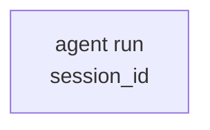
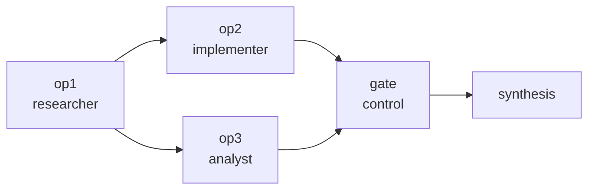
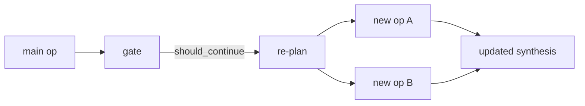
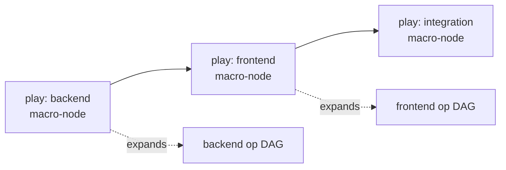
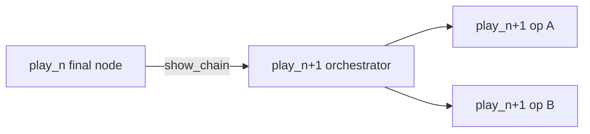
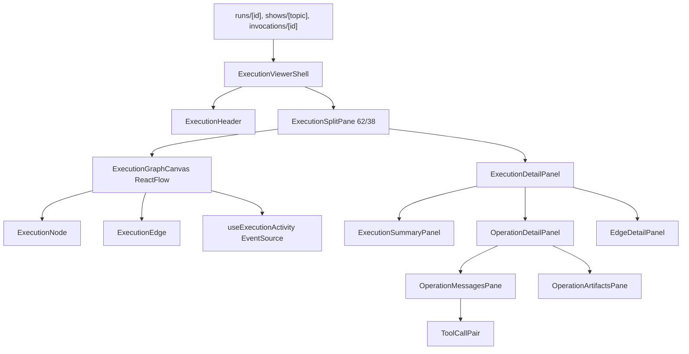

# ADR-0066: Unified Execution Viewer

Status: proposed
Date: 2026-05-27
Decision owners: @studio-maintainers, @orchestration-maintainers
Depends on: ADR-0009 (SQLite state layer), ADR-0020 (skill invocations), ADR-0025 (session lifecycle), ADR-0034 (frontend data/state), ADR-0056 (play control API)
Related: ADR-0055 (artifact viewer), ADR-0064 (work system integration), ADR-0065 (task board schema)

## Context

Lion Studio's most important operator surface is the execution detail view: a user must understand
what ran, what is running now, what failed, which tool calls happened, and how one operation led to
the next. Today that surface is split across several related but inconsistent views.

The current run detail page already converts session branches into readable steps and pairs
ActionRequest with ActionResponse in a local adapter
(`apps/studio/frontend/app/runs/[id]/page.tsx:27-120`). It also reads session graph metadata and
renders an embedded `WorkerCanvas`, but the page remains section-oriented with a sidebar, summary,
small DAG section, branch log section, errors, and files
(`apps/studio/frontend/app/runs/[id]/page.tsx:760-850`). This makes the DAG secondary even though
the operator's mental model is graph-first.

The current show DAG renders plays as ReactFlow nodes and infers dependencies from `_show.md`
(`apps/studio/frontend/app/shows/[topic]/components/PlayDag.tsx:17-110`). This is useful, but it is
not connected to the run detail graph or operation detail pane. Shows, plays, and single-agent runs
therefore appear as unrelated views even though the runtime already models them as connected
execution scopes.

The backend has enough structure to unify the surface. `FlowPlan` defines agents as persistent
branches and operations as a dependency DAG (`lionagi/cli/orchestrate/flow.py:332-425`). During flow
execution, Studio-facing operation segments are persisted into `sessions.node_metadata` with
`op_id`, `branch_id`, `branch_name`, `status`, `started_at`, and `ended_at`
(`lionagi/cli/orchestrate/flow.py:1177-1234`). The early DAG snapshot is also persisted into the
session row while execution is still live (`lionagi/cli/orchestrate/flow.py:1257-1280`). The Studio
session service already converts that metadata into graph nodes and edges
(`apps/studio/server/services/sessions.py:28-74`) and exposes segments from `node_metadata`
(`apps/studio/server/services/sessions.py:286-317`).

Important source note: the requirement says messages have `invocation_id`. In the checked-in schema
reviewed for this ADR, `sessions.invocation_id` exists (`lionagi/state/schema.sql:134-139`) and
`messages` has `id`, `created_at`, `node_metadata`, `content`, sender/recipient/channel, role, and
class (`lionagi/state/schema.sql:41-52`), but no top-level message `invocation_id`. This ADR does
not depend on a message-level invocation column. Operation-scoped reads use branch progressions plus
operation segment boundaries, and may additionally use a future or environment-specific message
invocation field when present.

## Decision

Build a single Unified Execution Viewer that represents single-agent runs, plays, flows, and shows
as one execution graph model and renders them with a persistent split-pane layout:

```text
left 62%: ReactFlow execution DAG canvas
right 38%: selected execution detail panel
```

The viewer becomes the canonical detail shell for:

- `/runs/{session_id}` - single session or play/flow session;
- `/shows/{topic}` - show-level graph of play macro-nodes, each expandable to its session DAG;
- `/invocations/{id}` - multi-session skill invocation graph when an invocation is the parent scope.

Single-agent runs are a trivial DAG with one node. Plays and flows are operation DAGs from
`FlowPlan` metadata. Shows are one larger graph where play nodes are macro-nodes linked by show
dependencies or chronological chaining. Re-planned work is attached to the graph rather than shown
as a separate run: gate node -> re-plan node -> new operation sub-DAG. Show chaining is also graph
native: play_n final node -> play_n+1 orchestrator node.

## Unified Execution Graph Model

### Execution Scope

```ts
export type ExecutionScopeKind = "agent_run" | "play" | "flow" | "show" | "invocation";

export interface ExecutionScope {
  id: string;
  kind: ExecutionScopeKind;
  title: string;
  status: ExecutionStatus;
  sessionId?: string;
  invocationId?: string | null;
  showTopic?: string | null;
  createdAt: number;
  updatedAt: number;
  graph: ExecutionGraph;
}
```

### Graph, Nodes, And Edges

```ts
export type ExecutionStatus =
  | "queued"
  | "idle"
  | "thinking"
  | "tool_calling"
  | "streaming"
  | "running"
  | "completed"
  | "failed"
  | "paused"
  | "cancelled"
  | "timed_out"
  | "aborted";

export type ExecutionNodeKind =
  | "agent"
  | "operation"
  | "gate"
  | "replan"
  | "synthesis"
  | "control"
  | "play"
  | "show";

export interface ExecutionNodeData {
  id: string;
  kind: ExecutionNodeKind;
  label: string;
  status: ExecutionStatus;
  role?: string | null;
  agentId?: string | null;
  branchId?: string | null;
  branchName?: string | null;
  sessionId?: string | null;
  invocationId?: string | null;
  showTopic?: string | null;
  playName?: string | null;
  opId?: string | null;
  model?: string | null;
  startedAt?: number | null;
  endedAt?: number | null;
  latestActivity?: ExecutionActivity | null;
  metrics?: {
    durationSeconds?: number | null;
    messageCount?: number;
    toolCallCount?: number;
    errorCount?: number;
  };
  nestedGraphRef?: {
    kind: "session" | "show" | "invocation";
    id: string;
  } | null;
}

export type ExecutionEdgeKind =
  | "dependency"
  | "data_flow"
  | "control"
  | "replan"
  | "show_chain"
  | "expansion";

export interface ExecutionEdgeData {
  id: string;
  source: string;
  target: string;
  kind: ExecutionEdgeKind;
  label?: string;
  status?: "inactive" | "ready" | "active" | "satisfied" | "failed";
  condition?: string;
  map?: Record<string, string>;
  payloadRefs?: string[];
}

export interface ExecutionGraph {
  id: string;
  scopeKind: ExecutionScopeKind;
  nodes: ExecutionNodeData[];
  edges: ExecutionEdgeData[];
  layoutDirection: "LR" | "TB";
  generatedAt: number;
}
```

### Graph Construction Rules

| Runtime shape | Graph representation |
| --- | --- |
| Single agent run | One `agent` node, no edges. Node points to session + branch messages. |
| Play / flow | One node per `FlowOp`; dependency edges from `depends_on`; agent reuse shown on node metadata, not by merging nodes. |
| Show | One `play` macro-node per play; dependency edges from persisted play deps or `_show.md`; each play node expands to the linked session operation DAG. |
| Re-plan | Control/gate node emits `replan` edge to a `replan` node, then dependency edges into the newly planned operation sub-DAG. |
| Show chaining | Final terminal node of play_n links to orchestrator/start node of play_n+1 with `show_chain`. |
| Invocation | Multi-session graph: invocation root links to child session/play/show graphs. For `/show`, the show graph is primary. |

### Graph Model Diagrams

Single agent run:



Play / flow operation DAG:



Re-plan chain:



Show as one graph with expandable macro-nodes:



Show chaining across plays:



## Split-Pane Layout Component Architecture

The new frontend component tree is:



The shell owns selection state:

```ts
export type ExecutionSelection =
  | { type: "none" }
  | { type: "node"; nodeId: string; node: ExecutionNodeData }
  | { type: "edge"; edgeId: string; edge: ExecutionEdgeData };
```

Panel behavior:

| Selection | Right pane content |
| --- | --- |
| None | Run/play/show summary, current status, live activity feed, artifact contract summary. |
| Node | Operation detail: scoped messages, artifacts, status history, timings, tool calls, branch metadata. |
| Edge | Dependency/data-flow detail: source/target, condition, field map, payload refs, satisfaction state. |

This replaces the current pattern where `WorkerCanvas` contains an internal side panel
(`apps/studio/frontend/components/canvas/WorkerCanvas.tsx:305-360`). `WorkerCanvas` should be
factored into a reusable canvas core that accepts `selection` and `onSelectionChange`, while
`ExecutionViewerShell` owns the right pane. The existing `SidePanel` remains useful for editable
playbook/worker graph authoring, but the execution viewer uses a read-oriented detail panel.

Layout contract:

- Desktop: `grid-template-columns: minmax(0, 62fr) minmax(360px, 38fr)`.
- Minimum right pane width: 360px.
- Minimum canvas width before responsive collapse: 720px.
- Mobile and narrow widths: canvas above, detail panel below, with sticky selection summary.
- No section-card nesting; the canvas is the primary surface.

## Operation-Scoped Message Viewing

Problem: one branch can execute multiple operations. If the same agent ran `op2` and `op5`,
clicking `op2` must show only the messages for `op2`, not the entire branch history.

Decision: every operation execution has explicit invocation boundaries. The frontend scopes by
`op_id`, but the backend resolves that `op_id` to boundary event/message ids before reading
messages. Segment timestamps remain a fallback only.

Segment boundary contract:

```ts
export interface OperationSegment {
  op_id: string;
  branch_id: string;
  branch_name: string;
  status: string;
  started_at: number | null;
  ended_at: number | null;
  start_event_id?: string | null;
  end_event_id?: string | null;
  first_message_id?: string | null;
  last_message_id?: string | null;
  api_calling_event_id?: string | null;
}
```

The runtime should extend the current segment writer in
`lionagi/cli/orchestrate/flow.py:1177-1234` to persist boundary ids when available. Until that
lands, the API uses the existing time-window segment fields as the compatibility path.

Decision: operation detail fetches scoped messages by operation id:

```http
GET /api/sessions/{session_id}/messages?op_id={op_id}
GET /api/sessions/{session_id}/messages?op_id={op_id}&include_full_branch=true
```

Response:

```ts
export interface OperationMessagesResponse {
  session_id: string;
  op_id: string | null;
  branch_id: string | null;
  branch_name: string | null;
  scope: "operation" | "branch" | "session";
  segment?: {
    started_at: number | null;
    ended_at: number | null;
    status: string | null;
  } | null;
  messages: ExecutionMessage[];
}

export interface ExecutionMessage {
  id: string;
  role: string;
  lion_class: string;
  sender: string | null;
  timestamp: number;
  content: Record<string, unknown>;
  branch_id?: string;
  invocation_id?: string | null;
}
```

Backend algorithm:

1. Read `sessions.node_metadata.segments` for `op_id`.
2. Resolve `branch_id` from the matching segment.
3. Load the branch progression from `branches.progression_id`.
4. Fetch ordered message ids from `progressions.collection`.
5. If `first_message_id` and `last_message_id` exist, slice the ordered progression inclusively.
6. Else if boundary event ids exist, map them to message ids and slice the progression.
7. Else filter by the segment time window:
   `started_at <= message.created_at <= ended_at + epsilon`.
8. If a future message-level operation/invocation field exists, use it as a stricter filter before
   falling back to segment boundaries.
9. If `op_id` is absent or no segment exists, return branch or session scope with
   `scope="branch"` and include a response warning field in phase 2.

Frontend behavior:

- `ExecutionGraphCanvas` emits node selection.
- `OperationDetailPanel` calls `getSessionMessages(sessionId, { opId })`.
- The messages pane displays the scoped transcript.
- A "Full branch" toggle refetches with `include_full_branch=true`.
- The toggle must be explicit because operation scope is the default and safety-critical view.

## Live DAG Activity

Each graph node shows a status badge and a live text snippet. The snippet is the last approximately
50 characters of the current activity: "thinking about cache invalidation", "used exec_command",
"responded with review findings", or "failed: timeout".

Status vocabulary for live activity:

```ts
export type ActivityStatus =
  | "idle"
  | "thinking"
  | "tool_calling"
  | "streaming"
  | "completed"
  | "failed";

export interface ExecutionActivity {
  node_id: string;
  op_id?: string | null;
  branch_id?: string | null;
  status: ActivityStatus;
  text: string;
  message_id?: string | null;
  action_request_id?: string | null;
  action_response_id?: string | null;
  timestamp: number;
}
```

SSE endpoint:

```http
GET /api/sessions/{session_id}/dag-activity
```

SSE event format:

```json
{
  "type": "node_activity",
  "session_id": "sess_123",
  "node_id": "op2",
  "op_id": "op2",
  "branch_id": "branch_456",
  "status": "tool_calling",
  "text": "exec_command: npm test",
  "message_id": "msg_789",
  "action_request_id": "req_1",
  "action_response_id": null,
  "timestamp": 1779907200.0
}
```

Terminal and heartbeat events:

```json
{ "type": "heartbeat", "timestamp": 1779907205.0 }
{ "type": "done", "session_id": "sess_123", "timestamp": 1779907210.0 }
```

Implementation guidance:

- Reuse the existing SSE route pattern in `apps/studio/server/routers/sessions.py:24-57`.
- Do not replace `/api/sessions/{id}/stream` immediately. `dag-activity` is a higher-level stream
  that maps raw messages and segment updates into node activity patches.
- Add `useExecutionActivity(sessionId, graph)` to update ReactFlow node data in-place.
- Handle out-of-order events by applying only newer `timestamp` values per node.

## Paired Tool Call Display

Backend message separation is correct: ActionRequest and ActionResponse are separate messages.
The frontend must render them as one paired unit.

Component:

```ts
export interface ToolCallPairProps {
  request: ExecutionMessage;
  response?: ExecutionMessage;
  defaultExpanded?: boolean;
}

export interface ToolCallViewModel {
  request_id: string;
  response_id?: string;
  tool_name: string;
  args: Record<string, unknown>;
  output?: unknown;
  status: "pending" | "ok" | "error";
  started_at: number;
  completed_at?: number | null;
}
```

Matching logic:

1. Index ActionResponse messages by `content.action_request_id`.
2. For each ActionRequest, first match by ActionResponse `action_request_id`.
3. Also support the current request-side link `content.action_response_id`, which is already used
   in the run detail adapter (`apps/studio/frontend/app/runs/[id]/page.tsx:86-114`) and backend
   filesystem run adapter (`apps/studio/server/services/runs.py:224-343`).
4. Render orphan responses as diagnostic tool result cards, but mark them as unmatched.
5. Render unmatched ActionRequest as pending with a spinner.

Display:

- Collapsible card.
- Header: tool name, status, elapsed time if response exists.
- Args: syntax-highlighted JSON, collapsed by default for long payloads.
- Result: truncated to a readable default, expandable for full output.
- Error styling derives from parsed status, not string color alone.

## Node Appearance And Interaction

Node kinds:

| Kind | Meaning |
| --- | --- |
| `agent` | Single-agent session or standalone branch execution. |
| `operation` | Standard FlowOp. |
| `gate` | Control/critic checkpoint. |
| `replan` | Orchestrator operation that produced a follow-up plan. |
| `synthesis` | Final consolidation node. |
| `control` | Runtime control or non-gate orchestration node. |
| `play` | Show-level play macro-node. |
| `show` | Root node for a show or invocation-level grouping. |

Status colors:

| Status | Appearance |
| --- | --- |
| queued / idle | gray border, muted badge. |
| running / thinking / streaming | blue border and pulse, reduced-motion aware. |
| tool_calling | blue badge with tool glyph and live snippet. |
| completed | green border and check. |
| failed | red border and failure badge. |
| paused | amber border and pause badge. |

Interaction:

- Click node: select node and load scoped detail in the right pane.
- Click edge: select edge and show dependency/data-flow detail.
- Double-click expandable macro-node: drill into nested graph, preserving breadcrumb.
- Escape or pane click: clear selection.
- Node footer: truncated latest activity text below node name, approximately 50 chars.
- Existing `StepNode` status handling and reduced-motion pulse are retained as prior art
  (`apps/studio/frontend/components/canvas/StepNode.tsx:30-180`) but expanded to the new status
  vocabulary.

## API Specifications

### Get Unified Graph

Phase 1 may continue to use `GET /api/sessions/{id}` and `GET /api/shows/{topic}`. Phase 2 adds a
normalized graph endpoint:

```http
GET /api/executions/{kind}/{id}/graph
```

Where `kind` is `session`, `show`, or `invocation`.

Response:

```ts
export interface ExecutionGraphResponse {
  scope: ExecutionScope;
  graph: ExecutionGraph;
  sources: Array<{
    kind: "session" | "show" | "invocation";
    id: string;
    path?: string;
  }>;
  warnings: string[];
}
```

### Get Operation Messages

```http
GET /api/sessions/{session_id}/messages?op_id={op_id}&include_full_branch=false
```

Errors:

- `404` if the session does not exist.
- `404` if `op_id` is supplied and not found in the graph.
- `409` if the operation maps ambiguously to multiple overlapping segments.

### Stream DAG Activity

```http
GET /api/sessions/{session_id}/dag-activity
```

Errors:

- `404` if the session does not exist, matching the pre-flight behavior of the existing stream route
  (`apps/studio/server/routers/sessions.py:24-30`).

## Backend Service Changes

Add these functions to `apps/studio/server/services/sessions.py`:

```python
async def get_session_messages(
    session_id: str,
    *,
    op_id: str | None = None,
    include_full_branch: bool = False,
) -> dict[str, Any]: ...

async def get_session_dag_activity_after(
    session_id: str,
    after_ts: float,
) -> list[dict[str, Any]]: ...

def build_execution_graph_from_session(session: dict[str, Any]) -> dict[str, Any]: ...
```

Add routes to `apps/studio/server/routers/sessions.py`:

```python
@router.get("/{session_id}/messages")
async def get_session_messages(session_id: str, op_id: str | None = None, include_full_branch: bool = False): ...

@router.get("/{session_id}/dag-activity")
async def stream_session_dag_activity(session_id: str): ...
```

Graph construction should first wrap the existing `_graph_from_metadata()` behavior, then replace it
with a typed graph adapter once the frontend type contracts are in place.

## Frontend Service Changes

Add types and client functions to `apps/studio/frontend/lib/api.ts` and
`apps/studio/frontend/lib/types.ts`:

```ts
export async function getExecutionGraph(
  kind: "session" | "show" | "invocation",
  id: string,
): Promise<ExecutionGraphResponse>;

export async function getSessionMessages(
  sessionId: string,
  params?: { opId?: string; includeFullBranch?: boolean },
): Promise<OperationMessagesResponse>;

export function streamDagActivity(
  sessionId: string,
  onEvent: (event: ExecutionActivityEvent) => void,
): () => void;
```

New components:

```text
apps/studio/frontend/components/execution/
  ExecutionViewerShell.tsx
  ExecutionSplitPane.tsx
  ExecutionGraphCanvas.tsx
  ExecutionNode.tsx
  ExecutionEdge.tsx
  ExecutionDetailPanel.tsx
  ExecutionSummaryPanel.tsx
  OperationDetailPanel.tsx
  OperationMessagesPane.tsx
  EdgeDetailPanel.tsx
  ToolCallPair.tsx
  useExecutionActivity.ts
  graphAdapters.ts
```

Existing components to reuse or refactor:

- `components/canvas/useLayout` for layout.
- `components/canvas/WorkerCanvas.tsx` as the ReactFlow implementation reference.
- `components/canvas/StepNode.tsx` as visual prior art for execution status.
- `components/canvas/ConditionEdge.tsx` as edge rendering prior art.
- `ExpectedArtifacts` and `OutcomeRenderer` for artifact sections.

## Coupling And Testability

Target component set:

```text
C = 8
ExecutionViewerShell, ExecutionGraphCanvas, ExecutionDetailPanel,
OperationMessagesPane, ToolCallPair, useExecutionActivity,
graphAdapters, sessions API service
```

Allowed direct dependencies:

```text
Shell -> Canvas, DetailPanel, graphAdapters, useExecutionActivity
Canvas -> ExecutionNode, ExecutionEdge
DetailPanel -> Summary, OperationMessagesPane, EdgeDetailPanel
OperationMessagesPane -> ToolCallPair
graphAdapters -> API types only
```

Estimated dependency count after design: 10.

```text
kappa_after = 10 / (8 * 7) = 0.18
```

This is below the target of 0.3. The key coupling decision is that `ExecutionViewerShell` owns
selection and data orchestration; the canvas does not own the side panel. The old `WorkerCanvas`
keeps its embedded `SidePanel` only for graph editing until it is split.

Testability target:

```text
tau = 0.85
```

Required tests:

- Unit tests for graph adapters: agent run, play, show, re-plan chain, show chaining.
- Unit tests for operation message scoping against segment windows.
- Unit tests for ToolCallPair matching by `action_request_id` and `action_response_id`.
- SSE reducer tests for out-of-order and duplicate activity events.
- Playwright tests for split-pane selection: no selection, node selection, edge selection,
  full-branch toggle, macro-node expansion.

## Alternatives Considered

| Alternative | Why rejected |
| --- | --- |
| Keep separate run, show, and invocation views | Violates the requirement that run types be coherently designed together; duplicates graph, selection, and message-rendering logic. |
| Make branch transcript the primary view and show DAG as a section | Preserves the current defect: operators cannot understand live graph activity at a glance. |
| Store ActionRequest and ActionResponse as one backend message | Backend separation is correct for auditability and replay; pairing is a presentation concern. |
| Scope operation messages only by branch | Fails when one branch executes multiple operations, especially reused agents in FlowPlan. |
| Require a new execution table before frontend work | Slows delivery unnecessarily. `sessions.node_metadata`, branches, progressions, and messages already support phase 1. |
| Use the current `PlayDag` as the show viewer | It renders a static play-level DAG but does not handle nested operation DAGs, live activity, or detail selection. |

## Phasing

### Phase 1 - Session Viewer Unification

- Add `components/execution/*` shell, canvas, detail panel, message pane, and ToolCallPair.
- Route `/runs/{id}` through `ExecutionViewerShell`.
- Use existing `GET /api/sessions/{id}` graph and segments.
- Add `GET /api/sessions/{id}/messages?op_id=...`.
- Keep existing `/api/sessions/{id}/stream`; derive basic node activity client-side.

### Phase 2 - First-Class DAG Activity

- Add `GET /api/sessions/{id}/dag-activity`.
- Persist or derive per-node latest activity server-side.
- Add richer statuses: thinking, tool_calling, streaming.
- Add Playwright coverage for live updates.

### Phase 3 - Show And Invocation Graphs

- Replace `PlayDag` usage with `ExecutionViewerShell` in show detail pages.
- Add play macro-node expansion to nested session graphs.
- Add show chaining edges.
- Use `/invocations/{id}` as a multi-session execution graph, not only a session table.

### Phase 4 - Re-plan And Control Polish

- Persist explicit re-plan edge metadata in `sessions.node_metadata`.
- Render gate -> re-plan -> new operation chains with distinct edge and node types.
- Integrate paused/cancelled runtime states from ADR-0056.
- Add activity retention and time-travel controls if operators need historical playback.

## Consequences

Positive:

- Operators get one graph-first mental model for runs, plays, shows, and invocations.
- Reused agents no longer leak unrelated branch history into operation detail.
- Tool calls become readable without changing backend audit semantics.
- Live execution becomes visible at the DAG level instead of only in transcripts.
- The show graph and session graph share component and data contracts.

Negative:

- `WorkerCanvas` must be split or wrapped carefully to avoid breaking graph editing surfaces.
- Segment-window scoping depends on accurate `started_at` and `ended_at`; malformed metadata needs
  clear fallback behavior.
- The first phase still has two streams: raw session message stream and derived DAG activity.
- Show macro-node expansion adds navigation state and breadcrumb complexity.

## Acceptance Criteria

- `/runs/{id}` opens with the DAG canvas as the primary left pane and detail panel on the right.
- A single-agent run renders as one node.
- A play/flow renders operation nodes and dependency edges from `sessions.node_metadata`.
- Clicking an operation fetches only that operation's messages by default.
- The full branch transcript is available only through an explicit toggle.
- ActionRequest and ActionResponse render as one `ToolCallPair`.
- Node latest activity updates live during a running session.
- Shows render as play macro-node DAGs and can expand to operation DAGs.
- Re-plan chains are visible as graph continuation, not separate detached runs.
- Component tests and Playwright coverage pass.

## References

- `apps/studio/frontend/app/runs/[id]/page.tsx`
- `apps/studio/frontend/app/shows/[topic]/components/PlayDag.tsx`
- `apps/studio/frontend/components/canvas/WorkerCanvas.tsx`
- `apps/studio/frontend/components/canvas/SidePanel.tsx`
- `apps/studio/frontend/components/canvas/StepNode.tsx`
- `apps/studio/frontend/components/canvas/ConditionEdge.tsx`
- `apps/studio/frontend/app/invocations/[id]/page.tsx`
- `apps/studio/server/routers/sessions.py`
- `apps/studio/server/services/sessions.py`
- `apps/studio/server/services/runs.py`
- `apps/studio/server/services/shows.py`
- `lionagi/cli/orchestrate/flow.py`
- `lionagi/state/schema.sql`

Domain utility: SKIPPED - no lore suggest/compose tool is available in this environment, so this ADR uses direct repository evidence and existing ADR patterns.
