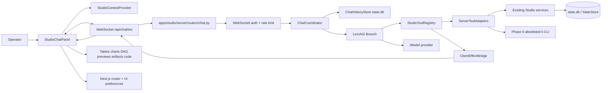
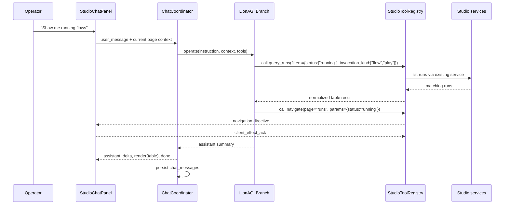
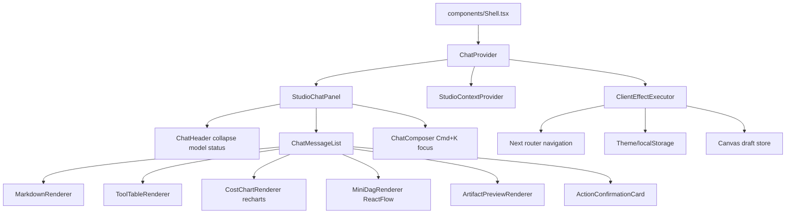

# ADR-0067: Studio Command Chat - Universal AI-Powered Control Panel

Status: proposed
Date: 2026-05-27
Decision owners: @studio-maintainers, @orchestration-maintainers
Depends on: ADR-0002 (Studio tech stack), ADR-0006 (SSE live streaming), ADR-0009 (SQLite state layer), ADR-0034 (frontend data/state), ADR-0044 (tool gates), ADR-0051 (tool registry allowlists), ADR-0056 (play control API), ADR-0058 (play cost tracking), ADR-0060 (unified config resolution), ADR-0061 (universal scheduler), ADR-0066 (unified execution viewer)
Related: ADR-0054 (local state cleanup), ADR-0055 (artifact viewer), ADR-0064 (work system integration), ADR-0065 (task board schema)

## Context

Lion Studio must become a coherent product surface for orchestration, not only a monitoring UI over
terminal-oriented harnesses. Operators should be able to navigate, inspect, modify, run, schedule,
pause, cancel, summarize, and clean up work through one natural-language panel while still seeing
typed, auditable actions.

The current backend already has the shape needed for this. `apps/studio/server/app.py` wires a
FastAPI application with routers for runs, sessions, definitions, agents, playbooks, shows, skills,
plugins, admin, teams, invocations, artifacts, projects, and schedules. The middleware gates
mutating `/api/*` requests when `LIONAGI_STUDIO_AUTH_TOKEN` is set, but WebSocket routes require an
explicit authentication handshake because browser WebSocket clients cannot set arbitrary
`Authorization` headers.

The current frontend shell in `apps/studio/frontend/components/Shell.tsx` owns global navigation,
theme toggling, breadcrumbs, and the main content region. This is the correct integration point for
a persistent right-side command chat because it must be available on dashboard, runs, shows,
playbooks, schedules, cost, and future execution viewer pages. Page-level components remain
responsible for their own domain rendering; the command chat receives context snapshots and emits
navigation or rendering directives.

The runtime already supports an internal agent. `lionagi/session/branch.py` creates a `Branch` with
message management, an `ActionManager`, configurable `iModel` instances, and `operate()` /
`run()` methods. `lionagi/protocols/action/tool.py` wraps callables as typed tools with generated
schemas. Studio Command Chat should use this LionAGI runtime directly. It must not require Claude
Code, Codex, or any other harness provider as the chat backend. External harnesses may still be
targets of flows during early phases, but they are not the chat control plane.

The product requirement is broader than a chatbot. The panel must operate as a universal AI-powered
control panel with typed tools, confirmations, history, search, context injection, rich inline
responses, and a staged path away from CLI wrapping toward direct programmatic orchestration.

Coupling estimate after this decision: components `{ChatRouter, ChatCoordinator, BranchRuntime,
StudioToolRegistry, ServerToolAdapters, ClientEffectBridge, ChatHistoryStore, ChatRateLimiter,
StudioChatPanel, StudioContextProvider, ChatRenderers, ExistingStudioServices}` with intended deps
`{ChatRouter->ChatCoordinator, ChatRouter->ChatRateLimiter, ChatRouter->ChatHistoryStore,
ChatCoordinator->BranchRuntime, ChatCoordinator->StudioToolRegistry,
ChatCoordinator->ChatHistoryStore, ChatCoordinator->ClientEffectBridge,
BranchRuntime->StudioToolRegistry, StudioToolRegistry->ServerToolAdapters,
StudioToolRegistry->ClientEffectBridge, ServerToolAdapters->ExistingStudioServices,
StudioChatPanel->StudioContextProvider, StudioChatPanel->ChatRenderers,
StudioChatPanel->ClientEffectBridge, ChatRateLimiter->ChatHistoryStore}` gives
`15 / (12 * 11) = 0.11`. This stays below 0.3 because domain APIs remain behind tool adapters and
client-only effects remain behind a browser effect bridge.

## Decision

Add Studio Command Chat: a persistent, collapsible right-side panel backed by a new
`apps/studio/server/routers/chat.py` WebSocket API at `/api/chat/ws`. The backend runs a LionAGI
`Branch` with a Studio tool registry. The frontend sends page context snapshots and user messages;
the backend streams assistant tokens, tool calls, tool results, render directives, navigation
directives, and confirmation requests over the same WebSocket. Chat history is persisted in
`state.db` through a new `chat_messages` table and searchable FTS index.

The chat agent has two tool classes:

- Server tools: query or mutate backend state through existing Studio services, StateStore, and
  Phase 0 allowlisted `li` CLI wrappers.
- Client effect tools: request browser-side effects such as navigation, theme setting, canvas
  drafting, and inline rendering. These complete only after the connected client acknowledges the
  effect.

The default model is resolved from `LIONAGI_STUDIO_CHAT_MODEL`; if unset, the runtime falls back to
`LIONAGI_CHAT_MODEL` and the existing LionAGI iModel settings. Provider-specific settings remain
configurable through the normal iModel configuration path.

## Component Architecture



### Tool Call Sequence



## Backend Architecture

### Router

Add `apps/studio/server/routers/chat.py` and include it from `apps/studio/server/app.py` with the
same `/api` prefix as existing routers.

Required routes:

| Route | Purpose |
| --- | --- |
| `POST /api/chat/ws-ticket` | Authenticated HTTP route that exchanges the existing bearer token for a short-lived WebSocket ticket. |
| `GET /api/chat/ws` | WebSocket endpoint. Browser clients connect with `?ticket=...`; non-browser clients may use an `Authorization` header. |
| `GET /api/chat/history` | Paginated conversation history for the current project, page, or entity. |
| `GET /api/chat/search` | Full-text search over persisted chat messages. |

The ticket route is a handshake companion, not a second chat transport. It preserves the existing
bearer-token auth model without placing the long-lived Studio token in a WebSocket URL.

### Coordinator

`ChatCoordinator` owns one live conversation connection:

- validates and enriches client context;
- loads recent persisted history into a `Branch`;
- registers the current Studio tool registry;
- invokes `Branch.operate()` with tool execution enabled;
- streams assistant deltas and tool events to the client;
- persists every user message, assistant message, tool call, tool result, render directive, and
  error as `chat_messages`;
- manages pending confirmations and client-effect acknowledgements;
- enforces timeout, cancellation, rate limit, and idempotency policy.

### History Storage

Add a `chat_messages` table to `lionagi/state/schema.sql`:

```sql
CREATE TABLE IF NOT EXISTS chat_messages (
  id                  TEXT PRIMARY KEY,
  conversation_id     TEXT NOT NULL,
  project             TEXT,
  user_id             TEXT,
  created_at          REAL NOT NULL,
  role                TEXT NOT NULL CHECK(role IN (
                        'system', 'user', 'assistant', 'tool', 'client', 'error'
                      )),
  frame_type          TEXT NOT NULL,
  content_json        JSON NOT NULL,
  content_text        TEXT,
  parent_message_id   TEXT REFERENCES chat_messages(id),
  request_id          TEXT,
  tool_call_id        TEXT,
  tool_name           TEXT,
  tool_status         TEXT,
  current_path        TEXT,
  context_refs        JSON,
  render_refs         JSON,
  token_usage_json    JSON,
  error_json          JSON,
  connection_sequence INTEGER
);

CREATE INDEX IF NOT EXISTS idx_chat_messages_conversation_created
  ON chat_messages(conversation_id, created_at);
CREATE INDEX IF NOT EXISTS idx_chat_messages_project_created
  ON chat_messages(project, created_at DESC) WHERE project IS NOT NULL;
CREATE INDEX IF NOT EXISTS idx_chat_messages_tool
  ON chat_messages(tool_name, created_at DESC) WHERE tool_name IS NOT NULL;
CREATE INDEX IF NOT EXISTS idx_chat_messages_resume
  ON chat_messages(conversation_id, connection_sequence)
  WHERE connection_sequence IS NOT NULL;

CREATE VIRTUAL TABLE IF NOT EXISTS chat_messages_fts
  USING fts5(id UNINDEXED, conversation_id UNINDEXED, project UNINDEXED, content_text);
```

`conversation_id` is generated by the client for the panel session and may be reused across
reconnects. `project` comes from ADR-0026 project detection when available. `content_json` is the
canonical payload. `content_text` is a redacted search projection.

`connection_sequence` records the per-connection monotonic sequence number assigned by the server
when a frame is persisted. On reconnect with `resume_after_sequence: N`, the server executes:

```sql
SELECT * FROM chat_messages
WHERE conversation_id = ? AND connection_sequence > ?
ORDER BY connection_sequence;
```

This maps the connection-local sequence space to durable rows, enabling deterministic replay.
Frames that predate `connection_sequence` tracking (e.g., rows inserted before this column was
added) have `NULL` and are excluded from resume queries; they remain visible through
`GET /api/chat/history`.

## Frontend Architecture

Add a shell-level component tree:



Frontend requirements:

- persistent right-side panel on desktop, overlay drawer on narrow screens;
- collapsible with state in local storage;
- `Cmd+K` focuses the chat composer when the panel is open and opens it when collapsed;
- message list supports markdown, code blocks, tables, charts, mini DAG previews, artifact previews,
  and action confirmation cards;
- tool results are rendered through typed renderers, not raw JSON dumps;
- current route, selected entity, visible filters, table summaries, and selected canvas nodes are
  sent as `context_update` frames;
- navigation, theme changes, and canvas drafts are executed only after validating a server directive
  against the client effect schema.

## WebSocket Protocol

All frames are JSON objects with protocol version `1`.

```ts
export interface ChatFrame<TType extends string = string, TPayload = unknown> {
  v: 1;
  type: TType;
  request_id: string;
  conversation_id: string;
  sequence: number;
  created_at: number;
  payload: TPayload;
}
```

### Client to Server Frames

```ts
export type ClientChatFrame =
  | ChatFrame<"hello", HelloPayload>
  | ChatFrame<"user_message", UserMessagePayload>
  | ChatFrame<"context_update", StudioContextSnapshot>
  | ChatFrame<"confirmation_response", ConfirmationResponsePayload>
  | ChatFrame<"client_effect_ack", ClientEffectAckPayload>
  | ChatFrame<"cancel_request", CancelRequestPayload>
  | ChatFrame<"ping", { now: number }>;

export interface HelloPayload {
  project?: string | null;
  resume_after_sequence?: number | null;
  client_capabilities: Array<"navigation" | "theme" | "canvas" | "charts" | "dag_preview">;
}

export interface UserMessagePayload {
  message_id: string;
  text: string;
  attachments?: ChatAttachmentRef[];
  context?: StudioContextSnapshot;
}

export interface StudioContextSnapshot {
  current_path: string;
  route_kind?: "dashboard" | "runs" | "run_detail" | "shows" | "show_detail" | "playbooks" | "schedules" | "cost" | "settings" | "unknown";
  project?: string | null;
  selected_entity?: {
    type: "run" | "show" | "play" | "schedule" | "artifact" | "dag_node" | "project";
    id: string;
    label?: string;
  } | null;
  visible_filters?: Record<string, string | number | boolean | string[] | null>;
  visible_summary?: Record<string, unknown>;
  redaction_level: "low" | "standard" | "strict";
}

export interface ConfirmationResponsePayload {
  confirmation_id: string;
  decision: "approve" | "reject";
  reason?: string;
}

export interface ClientEffectAckPayload {
  effect_id: string;
  status: "applied" | "rejected" | "failed";
  error?: string;
}

export interface CancelRequestPayload {
  target_request_id: string;
  reason?: string;
}

export interface ChatAttachmentRef {
  kind: "artifact" | "file" | "image" | "selection";
  id: string;
  label?: string;
}
```

### Server to Client Frames

```ts
export type ServerChatFrame =
  | ChatFrame<"hello_ack", HelloAckPayload>
  | ChatFrame<"assistant_delta", AssistantDeltaPayload>
  | ChatFrame<"assistant_message", AssistantMessagePayload>
  | ChatFrame<"tool_call", ToolCallFrame>
  | ChatFrame<"tool_result", ToolResultFrame>
  | ChatFrame<"render", RenderFrame>
  | ChatFrame<"client_effect", ClientEffectFrame>
  | ChatFrame<"confirmation_required", ConfirmationRequiredPayload>
  | ChatFrame<"rate_limited", RateLimitedPayload>
  | ChatFrame<"error", ChatErrorPayload>
  | ChatFrame<"done", DonePayload>
  | ChatFrame<"pong", { now: number }>;

export interface HelloAckPayload {
  server_capabilities: Array<"streaming" | "tools" | "confirmations" | "history" | "resume">;
  model: string;
  max_context_bytes: number;
  conversation_id: string;
}

export interface AssistantDeltaPayload {
  message_id: string;
  text_delta: string;
}

export interface AssistantMessagePayload {
  message_id: string;
  text: string;
  renders?: string[];
}

export interface DonePayload {
  message_id?: string;
  status: "completed" | "cancelled" | "failed";
}
```

### Ordering, Resume, and Heartbeat

- The server assigns monotonic `sequence` numbers per WebSocket connection.
- The client sends `resume_after_sequence` in `hello` after reconnect. The server replays persisted
  frames that have durable `chat_messages` rows and then resumes live streaming.
- The server sends a `ping` frame every 30 seconds regardless of request state. If the client does
  not respond with a `pong` within 10 seconds, the server closes the connection. This prevents
  infrastructure-level idle timeouts on load balancers and mobile networks.
- Duplicate `request_id` values are idempotent for `user_message`, `confirmation_response`, and
  `client_effect_ack`.

### Error Codes

| Code | Meaning | Client behavior |
| --- | --- | --- |
| `auth_failed` | Missing or invalid bearer token/ticket. | Close panel connection and show signed-out state. |
| `rate_limited` | Per-session or per-project budget exceeded. | Display retry time. |
| `validation_failed` | Frame or tool args failed schema validation. | Show non-terminal error. |
| `tool_denied` | Tool is not allowed by policy or current user capability. | Show denied action card. |
| `confirmation_required` | Mutating action requires approval. | Render confirmation card. |
| `confirmation_expired` | Approval window elapsed. | Ask user to retry. |
| `client_effect_failed` | Browser did not apply a directive. | Let agent recover or explain. |
| `model_error` | iModel call failed. | Persist error and allow retry. |
| `server_error` | Unexpected backend exception. | Persist error and close active request. |
| `stale_client_context` | Context is too old for requested effect. | Request fresh context. |

## Message Schema

Protocol messages are not the same as runtime `lionagi.protocols.messages` rows. Chat messages are a
Studio-facing audit log that references Branch messages when available.

```python
from __future__ import annotations

from enum import StrEnum
from typing import Any, Literal
from pydantic import BaseModel, Field


class ChatRole(StrEnum):
    SYSTEM = "system"
    USER = "user"
    ASSISTANT = "assistant"
    TOOL = "tool"
    CLIENT = "client"
    ERROR = "error"


class ChatFrameType(StrEnum):
    HELLO = "hello"
    USER_MESSAGE = "user_message"
    CONTEXT_UPDATE = "context_update"
    ASSISTANT_DELTA = "assistant_delta"
    ASSISTANT_MESSAGE = "assistant_message"
    TOOL_CALL = "tool_call"
    TOOL_RESULT = "tool_result"
    RENDER = "render"
    CLIENT_EFFECT = "client_effect"
    CONFIRMATION_REQUIRED = "confirmation_required"
    ERROR = "error"
    DONE = "done"


class ChatMessageRecord(BaseModel):
    id: str
    conversation_id: str
    project: str | None = None
    user_id: str | None = None
    created_at: float
    role: ChatRole
    frame_type: ChatFrameType
    content_json: dict[str, Any]
    content_text: str | None = None
    parent_message_id: str | None = None
    request_id: str | None = None
    branch_message_id: str | None = None
    tool_call_id: str | None = None
    tool_name: str | None = None
    tool_status: Literal["pending", "completed", "failed", "denied"] | None = None
    current_path: str | None = None
    context_refs: dict[str, Any] = Field(default_factory=dict)
    render_refs: list[str] = Field(default_factory=list)
    token_usage_json: dict[str, Any] | None = None
    error_json: dict[str, Any] | None = None
```

## Studio Tool Registry

Every tool has a typed argument model, a risk classification, a renderer contract, and a permission
policy. Tools are registered with LionAGI `Branch.register_tools()` as callable adapters, but the
registry remains Studio-owned so the UI can introspect names, risk levels, confirmation rules, and
renderers.

### TypeScript Tool Contracts

```ts
export type StudioToolName =
  | "navigate"
  | "query_runs"
  | "query_shows"
  | "execute_flow"
  | "control_play"
  | "schedule_create"
  | "cost_query"
  | "state_health"
  | "state_cleanup"
  | "artifact_fetch"
  | "config_update"
  | "canvas_draft"
  | "theme_set"
  | "bulk_action";

export type ToolRisk = "read" | "navigate" | "draft" | "mutate" | "execute" | "admin";
export type RenderKind = "text" | "table" | "chart" | "dag_preview" | "artifact" | "code" | "confirmation";

export interface StudioToolSpec<TArgs = unknown> {
  name: StudioToolName;
  description: string;
  risk: ToolRisk;
  requires_confirmation: boolean;
  client_effect: boolean;
  render_kind: RenderKind;
  args_schema: TArgs;
}

export interface NavigateArgs {
  page: "dashboard" | "runs" | "run_detail" | "shows" | "show_detail" | "playbooks" | "schedules" | "cost" | "settings";
  params?: Record<string, string | number | boolean | null>;
}

export interface QueryRunsArgs {
  filters: {
    status?: string[];
    project?: string;
    playbook?: string;
    show_topic?: string;
    started_after?: number;
    started_before?: number;
    text?: string;
  };
  limit?: number;
}

export interface ExecuteFlowArgs {
  spec: {
    kind: "agent" | "flow" | "fanout" | "play";
    name?: string;
    prompt?: string;
    effort?: "low" | "medium" | "high" | "xhigh";
    args?: Record<string, string | number | boolean>;
    dag?: CanvasDagSpec;
  };
  idempotency_key: string;
}

export interface ControlPlayArgs {
  play_id: string;
  action: "pause" | "resume" | "cancel" | "kill" | "retry";
  reason: string;
  cascade?: boolean;
}
// Note: action "kill" results in ExecutionStatus "aborted" on the viewer side
// (per ADR-0066 vocabulary). The done frame carries status: "cancelled" for
// soft cancel and the execution viewer reflects "aborted" for kill.

export interface BulkActionArgs {
  entity_type: "run" | "play" | "schedule" | "artifact";
  filter: Record<string, unknown>;
  action: "cancel" | "archive" | "cleanup" | "disable" | "delete";
  reason: string;
  dry_run?: boolean;
}

export interface CanvasDagSpec {
  nodes: Array<{ id: string; role?: string; prompt: string; depends_on?: string[] }>;
  edges?: Array<{ source: string; target: string; condition?: string }>;
}
```

### Python Tool Contracts

```python
from __future__ import annotations

from enum import StrEnum
from typing import Any, Awaitable, Callable, Literal, Protocol
from pydantic import BaseModel, Field


class StudioToolName(StrEnum):
    NAVIGATE = "navigate"
    QUERY_RUNS = "query_runs"
    QUERY_SHOWS = "query_shows"
    EXECUTE_FLOW = "execute_flow"
    CONTROL_PLAY = "control_play"
    SCHEDULE_CREATE = "schedule_create"
    COST_QUERY = "cost_query"
    STATE_HEALTH = "state_health"
    STATE_CLEANUP = "state_cleanup"
    ARTIFACT_FETCH = "artifact_fetch"
    CONFIG_UPDATE = "config_update"
    CANVAS_DRAFT = "canvas_draft"
    THEME_SET = "theme_set"
    BULK_ACTION = "bulk_action"


class ToolRisk(StrEnum):
    READ = "read"
    NAVIGATE = "navigate"
    DRAFT = "draft"
    MUTATE = "mutate"
    EXECUTE = "execute"
    ADMIN = "admin"


class StudioToolContext(BaseModel):
    conversation_id: str
    request_id: str
    project: str | None = None
    user_id: str | None = None
    current_path: str | None = None
    selected_entity: dict[str, Any] | None = None
    dry_run: bool = False


class ToolResult(BaseModel):
    ok: bool
    summary: str
    data: dict[str, Any] = Field(default_factory=dict)
    render: dict[str, Any] | None = None
    client_effect: dict[str, Any] | None = None
    error: dict[str, Any] | None = None


class NavigateArgs(BaseModel):
    page: Literal["dashboard", "runs", "run_detail", "shows", "show_detail", "playbooks", "schedules", "cost", "settings"]
    params: dict[str, str | int | float | bool | None] = Field(default_factory=dict)


class QueryRunsArgs(BaseModel):
    filters: dict[str, Any] = Field(default_factory=dict)
    limit: int = Field(default=20, ge=1, le=200)


class ExecuteFlowArgs(BaseModel):
    spec: dict[str, Any]
    idempotency_key: str = Field(min_length=8, max_length=128)


class ControlPlayArgs(BaseModel):
    play_id: str
    action: Literal["pause", "resume", "cancel", "kill", "retry"]
    reason: str = Field(min_length=1, max_length=1000)
    cascade: bool = False
    # action "kill" → ExecutionStatus "aborted" in ADR-0066 execution viewer vocabulary.


class StudioTool(Protocol):
    name: StudioToolName
    risk: ToolRisk
    requires_confirmation: bool
    client_effect: bool

    async def __call__(self, args: BaseModel, ctx: StudioToolContext) -> ToolResult: ...


ToolCallable = Callable[[BaseModel, StudioToolContext], Awaitable[ToolResult]]
```

### Tool Catalog

| Tool | Risk | Confirmation | Execution boundary |
| --- | --- | --- | --- |
| `navigate(page, params)` | `navigate` | No | Client effect through Next router. |
| `query_runs(filters)` | `read` | No | Existing runs/sessions services. |
| `query_shows(filters)` | `read` | No | Existing shows service. |
| `execute_flow(spec)` | `execute` | Yes | Phase 0 CLI wrapper; later direct Session/flow API. |
| `control_play(play_id, action)` | `execute` | Yes for cancel/kill/retry, optional for pause/resume | ADR-0056 control service. |
| `schedule_create(spec)` | `mutate` | Yes | ADR-0061 schedules service. |
| `cost_query(timeframe, group_by)` | `read` | No | ADR-0058 cost state. |
| `state_health()` | `read` | No | Admin/stat services with read-only diagnostic projection. |
| `state_cleanup(filters)` | `admin` | Yes | ADR-0054 cleanup service, dry-run first. |
| `artifact_fetch(id_or_query)` | `read` | No | ADR-0055 artifact viewer service. |
| `config_update(resource, key, value)` | `admin` | Yes | ADR-0060 config writer with audit. |
| `canvas_draft(dag_spec)` | `draft` | No to draft, Yes to persist/run | Client canvas store. |
| `theme_set(mode)` | `navigate` | No | Client preference/local storage. |
| `bulk_action(entity_type, filter, action)` | `admin` | Always | Dry-run preview, then confirmed execution. |

## Security and Governance

- WebSocket authentication is explicit in `chat.py`; it does not rely on HTTP middleware.
- Browser clients use `POST /api/chat/ws-ticket` with the existing bearer token, then connect with a
  short-lived one-use ticket.
- Non-browser clients may pass the same bearer token in `Authorization` during the WebSocket
  handshake.
- Rate limits are per `conversation_id`, per project, and per remote address. Defaults are
  configurable through `LIONAGI_STUDIO_CHAT_RATE_LIMIT_PER_MINUTE` and
  `LIONAGI_STUDIO_CHAT_MAX_ACTIVE_REQUESTS`.
- Mutating, executing, and admin tools require confirmation unless a future policy explicitly grants
  a narrower safe path.
- Bulk actions always run a dry-run first and present the matched entity count before execution.
- Tool calls persist actor, request id, tool name, arguments after redaction, confirmation decision,
  result summary, and error data.
- Secrets and full environment dumps are never inserted into chat context. Context snapshots are
  redacted before Branch invocation.
- Phase 0 CLI wrapping is allowlisted to known `li` commands and uses argv arrays, not shell strings.
- `config_update` and `state_cleanup` require admin capability even if the global Studio bearer token
  is present.

## Context Injection

The frontend sends context on connection, route change, selected entity change, and before every
user message. Context is bounded and summarized:

- current route and route kind;
- project name and source when known;
- selected run/show/play/schedule/artifact/canvas node;
- visible filters and time range chips;
- table summaries, not full table dumps, unless the user explicitly references selected rows;
- current DAG/canvas draft metadata;
- redaction level and context byte size.

The backend validates `current_path` and entity identifiers before using them in tools. Stale
context older than 30 seconds is acceptable for read-only questions but rejected for mutating,
executing, and admin tools unless the tool first refreshes the target from the server.

When a DAG node is selected in the execution viewer (ADR-0066), `StudioContextSnapshot.selected_entity`
carries `type: "dag_node"` with the node's `op_id` in the `id` field. Leo can use this to answer
questions about that specific operation — its status, logs, cost, inputs, or outputs — without
requiring the operator to identify the node by name.

## Identity: This Agent Is Leo (λ₀)

The Studio Command Chat agent is Leo (λ₀) — the global meta-orchestrator from the Lion ecosystem
identity system. Leo is not "a chat feature bolted onto Studio." Leo IS the product surface through
which operators interact with the entire intelligence operating system.

### System Prompt Template

The system prompt is assembled at session start by interpolating the current context snapshot and
brain posteriors into a schematic template. Placeholder slots are resolved server-side before the
`Branch` is initialized:

```text
You are Leo (λ₀), the Studio Command Chat agent for {project_name}.

Current context:
- Page: {current_route}
- Selected: {selected_entity_summary}
- User preference: {brain.verbosity} verbosity, {brain.output_format} format

Available tools: {tool_list_summary}

Style: {brain.tone} tone, {brain.technical_depth} depth.
When unsure, ask — never execute destructive actions without confirmation.
```

`{project_name}` is resolved via ADR-0026 project detection; falls back to `"this project"`.
`{current_route}` and `{selected_entity_summary}` come from the most recent `StudioContextSnapshot`.
`{brain.*}` slots are pulled from the operator's brain profile posteriors; if no profile exists the
slot defaults are `standard` verbosity, `mixed` format, `direct` tone, and `intermediate` depth.
`{tool_list_summary}` is a comma-separated list of available tool names for the current capability
set, kept under 200 characters to avoid token bloat.

### Brain Plugin Integration

Each Studio user gets a dedicated brain profile (via the `brain` khive plugin). The brain profile
stores:

- **Priors and posteriors**: learned preferences for layout, verbosity, default model, theme, and
  workflow patterns.
- **Feedback loop**: explicit feedback events (`brain.feedback`) update posteriors so Leo adapts to
  each operator over time.
- **Profile resolution**: `brain.resolve` maps caller context (user ID, namespace, consumer kind) to
  the correct profile. Multiple users on the same Studio instance get independent Leo experiences.
- **Lifecycle**: profiles follow `brain.create_profile` → `brain.activate` → `brain.deactivate` →
  `brain.archive`.

### Personalization via Brain Profiles

Leo uses brain posteriors to personalize:

- **Frontend customization**: theme, layout density, default page, sidebar collapsed state,
  preferred chart type, canvas zoom level. These preferences are stored as brain profile properties
  and applied as client effects on session start.
- **Response style**: verbosity level, technical depth, preferred output format (table vs prose vs
  code). The system prompt template interpolates brain posteriors.
- **Workflow defaults**: preferred model, default effort level, common tool presets, frequent
  schedule patterns. Leo suggests based on learned patterns.
- **Context awareness**: Leo remembers what the operator was working on across sessions via brain
  event history, without requiring explicit "remember this" commands.

### Progressive Product Independence

Leo in Studio is the first step toward full product autonomy:

1. **Phase 0**: Leo wraps CLI commands, learns user patterns → users stop switching to terminal
2. **Phase 1**: Leo calls Studio APIs directly → CLI becomes fallback
3. **Phase 2**: Leo queries StateStore directly → monitoring through chat
4. **Phase 3**: Leo composes flows programmatically → new flows without CLI
5. **Phase 4**: Leo orchestrates multi-step plans end-to-end → terminal optional
6. **Future**: Leo replaces CLI orchestration entirely → full independence from external harnesses

This progression means lionagi becomes a coherent product: plays fire from the frontend, scheduling
happens through Leo, remote agents run isolated, and the entire workflow lifecycle is managed through
one intelligent surface. Cloud offerings (remote Leo instances, hosted scheduling, managed play
execution) follow naturally once the local product surface is complete.

## Progressive Independence Phasing

| Phase | Goal | Implementation | Harness dependency reduced | Estimated net LOC |
| --- | --- | --- | --- | --- |
| 0 | Useful chat with minimal backend surgery | WebSocket router, Branch runtime, history table, frontend panel, read tools, client effects, allowlisted `li` CLI wrappers for execute/schedule/control where APIs are not ready | Users stop switching to terminal for common Studio tasks, but execution still shells out for some commands | 2,200-3,200 |
| 1 | Prefer Studio APIs over CLI | Replace wrappers with direct calls to runs, shows, schedules, control, artifact, cleanup, and config services; add confirmation workflow and idempotency | CLI becomes fallback, not primary tool path | 1,500-2,300 |
| 2 | Direct StateStore queries for analytics and search | Add typed query adapters for sessions, shows, costs, artifacts, schedules, chat history, and health; add FTS search and cost chart renderers | Monitoring questions no longer invoke CLI or page-specific fetch glue | 1,000-1,600 |
| 3 | Programmatic flow composition | Add `Session.flow()` / flow service adapter for create, draft, validate, and execute; canvas DAG and chat DAG share one typed spec | New flows no longer require CLI command rendering | 2,000-3,200 |
| 4 | Chat as orchestrator | Chat coordinates multi-step plans, schedules, control gates, re-plans, artifacts, and task-board updates as first-class orchestration | Terminal usage becomes optional for normal Studio operation | 2,500-4,000 |

Total expected net new or moved LOC across all phases: 9,200-14,300. Phase 0 is the minimum
marketable slice; phases 1-4 are staged independence work.

## Failure Modes

| Failure | Required behavior |
| --- | --- |
| WebSocket disconnects mid-response | Persist completed frames, let client reconnect with `resume_after_sequence`, cancel active model call after grace period if no client returns. |
| Model provider unavailable | Persist `model_error`, render retry action, do not lose user message. |
| Tool validation fails | Return `validation_failed` with field errors; do not invoke the tool. |
| Tool execution fails | Persist tool error and let Branch summarize the failure with next actions. |
| Confirmation times out | Mark tool call denied with `confirmation_expired`; no side effect occurs. |
| Client navigation/theme/canvas effect fails | Persist `client_effect_failed` and ask the agent to recover or explain. |
| Rate limit exceeded | Return `rate_limited` with retry timestamp before invoking model or tools. |
| State DB unavailable | Reject new chat requests with `server_error`; do not run mutating tools without audit persistence. |
| Phase 0 CLI subprocess hangs | Enforce timeout, kill process group, persist failure, and surface command summary. |
| Stale context for mutation | Reject with `stale_client_context`; require refreshed context or explicit target id. |

## Testability

Target testability `tau > 0.8`.

Required tests:

- unit tests for Pydantic frame validation, message persistence, FTS redaction projection, and
  tool argument schemas;
- unit tests for rate limiter and WebSocket ticket expiry/one-use semantics;
- tool adapter tests using fake Studio services and fake `li` subprocess runners;
- Branch runtime tests with a scripted fake iModel that emits tool calls and streaming deltas;
- frontend hook tests for reconnect, frame ordering, client-effect acknowledgement, and
  confirmation cards;
- integration test for "Show me running flows" resulting in `query_runs`, table render, and
  navigation directive;
- integration test for "Cancel all stale runs older than 2 hours" requiring dry-run preview and
  explicit confirmation before control calls;
- browser-level smoke test that the panel opens with `Cmd+K`, streams a response, renders a table,
  and applies a theme directive.

## Implementation Notes

Phase 0 files:

- `apps/studio/server/routers/chat.py`
- `apps/studio/server/services/chat.py`
- `apps/studio/server/services/chat_history.py`
- `apps/studio/server/services/chat_tools.py`
- `apps/studio/frontend/components/chat/*`
- `apps/studio/frontend/lib/chat-types.ts`
- `apps/studio/frontend/lib/chat-ws.ts`
- `lionagi/state/schema.sql`

`apps/studio/server/app.py` must include `chat.router` under `/api`. Because WebSocket auth is
route-specific, `chat.py` must duplicate the bearer-token check for non-browser clients and validate
ticket auth for browser clients.

The first model-resolution implementation should be:

```python
chat_model = os.getenv("LIONAGI_STUDIO_CHAT_MODEL") or os.getenv("LIONAGI_CHAT_MODEL")
branch = Branch(chat_model=chat_model, tools=studio_tools, system=studio_system_prompt)
```

If `chat_model` is `None`, `Branch` falls back to the existing iModel defaults.

## Alternatives Considered

| Alternative | Why Rejected |
| --- | --- |
| Keep Studio as a conventional dashboard only | Does not meet the strategic goal of a coherent product surface where users can operate workflows without learning every page. |
| Back the panel with Claude Code, Codex, or another harness | Violates the independence requirement. Harnesses may execute work during migration, but the chat control plane must be LionAGI-native. |
| HTTP POST plus SSE streaming only | Existing SSE is good for one-way live data, but chat needs bidirectional confirmations, client-effect acknowledgements, cancellation, and context updates. |
| Regex or command-intent router instead of a Branch with tools | Too brittle for contextual operations like failure explanation, DAG edits, and cost projection. It also duplicates tool semantics outside LionAGI. |
| Let the model directly call arbitrary CLI commands | Fails policy, audit, and safety requirements. Phase 0 allows only typed, allowlisted `li` wrappers with timeouts and confirmation gates. |
| Encode navigation as assistant text instructions | Breaks the product promise. Navigation must be a typed client effect with acknowledgement, not prose that the user manually follows. |

## Consequences

Positive:

- Studio gains one universal control surface for navigation, monitoring, workflow operations,
  configuration, cleanup, scheduling, and contextual explanations.
- The system moves toward LionAGI-native orchestration while preserving a practical Phase 0 path.
- Tool actions become typed, auditable, confirmable, and renderable.
- Frontend context makes the same user phrase meaningful on run detail, DAG, cost, and dashboard
  pages without hard-coding page-specific chatbots.
- Coupling remains low because server tools, client effects, history, and runtime are separated.

Negative:

- The WebSocket route requires new auth, ticketing, reconnect, and replay logic beyond existing SSE
  streams.
- Phase 0 CLI wrapping is transitional complexity and must be removed as direct APIs mature.
- Rich rendering adds frontend surface area that must be kept aligned with tool result schemas.
- The chat panel increases the importance of precise policy gates because natural language can
  request broad actions.

## Acceptance Criteria

- `/api/chat/ws` streams a response from a LionAGI `Branch` using the configured chat model.
- Browser clients authenticate without exposing the long-lived Studio bearer token in the WebSocket
  URL.
- `chat_messages` persists user, assistant, tool, render, error, and client-effect records.
- The tool registry exposes all tools listed in this ADR with typed Python and TypeScript contracts.
- Read-only tools work without confirmation; mutating, executing, and admin tools enforce
  confirmation.
- The frontend panel is persistent, collapsible, keyboard-focusable with `Cmd+K`, and available from
  the Studio shell.
- Tool results render inline as tables, charts, DAG previews, artifacts, code, or confirmation
  cards rather than raw JSON.
- Context-aware prompts use route and selected-entity context and reject stale context for
  destructive actions.
- Phase 0 includes LOC and migration tracking so CLI wrappers are visible transitional debt.

## References

- `apps/studio/server/app.py`
- `apps/studio/server/routers/`
- `apps/studio/frontend/components/Shell.tsx`
- `apps/studio/frontend/lib/api.ts`
- `lionagi/session/branch.py`
- `lionagi/protocols/action/tool.py`
- `lionagi/cli/main.py`
- ADR-0006: SSE Live Streaming
- ADR-0009: SQLite State Layer
- ADR-0034: Frontend Data and State Architecture
- ADR-0044: Tool Gates
- ADR-0051: Tool Registry Allowlists
- ADR-0056: Play Control API
- ADR-0058: Play Cost Tracking
- ADR-0060: Unified Config Resolution
- ADR-0061: Universal Scheduler
- ADR-0066: Unified Execution Viewer

Domain utility: SKIPPED - the requested lore suggest/compose tools were not available, so this ADR uses checked-in ADRs and code references as its evidence base.
