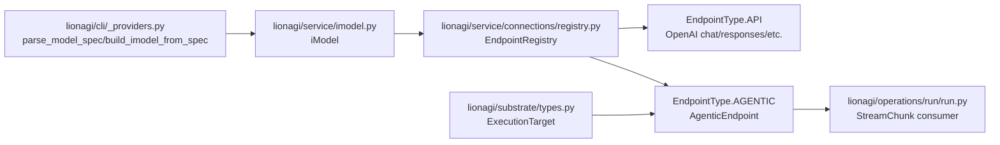

# ADR-0079: Substrate Executor Provider Interface

**Status**: Superseded in part by [ADR-0089](ADR-0089-sandbox-backend-seam-and-measurement-loop.md) (its `ExecutionTarget`/`ExecutionLimits` types are adopted there; the `ExecutorProvider` protocol half is parked, not carried forward)
**Date**: 2026-06-03
**Related**: #1196, [ADR-0080](ADR-0080-remote-sandbox-substrate-execution.md), [ADR-0072](ADR-0072-reactive-capability-bus.md)

## Context

Issue #1196 needs executor providers to be explicit enough that `claude_code`,
`codex`, OpenAI API endpoints, and non-LLM process executors can be routed
without special cases in flow/play. The current code already has the right
runtime spine:

- CLI model specs are parsed by `parse_model_spec()` and constructed by
  `build_imodel_from_spec()` in `lionagi/cli/_providers.py:201` and
  `lionagi/cli/_providers.py:238`; that constructor forces
  `endpoint="query_cli"` for agentic CLI providers at
  `lionagi/cli/_providers.py:276`.
- `iModel` derives a provider from `provider/model` strings and calls
  `match_endpoint(provider=..., endpoint=...)` in `lionagi/service/imodel.py:117`
  and `lionagi/service/imodel.py:130`.
- `EndpointRegistry` already has `EndpointType.API` and
  `EndpointType.AGENTIC` (`lionagi/service/connections/registry.py:22`) and
  registers endpoint classes through `EndpointRegistry.register()`
  (`lionagi/service/connections/registry.py:79`).
- The operation path already routes CLI/agentic endpoints by the existing
  `chat_model.is_cli` flag: `prepare_operate_kw()` chooses `RunParam` at
  `lionagi/operations/operate/operate.py:160`, and `operate()` delegates to
  `run_and_collect` at `lionagi/operations/operate/operate.py:326`.
- `run()` rejects non-CLI endpoints at `lionagi/operations/run/run.py:48` and
  consumes provider-neutral `StreamChunk` events from `model.stream()` at
  `lionagi/operations/run/run.py:161`.

The missing piece is not another registry. The missing piece is a typed
executor-provider contract that names what `AgenticEndpoint` subclasses already
do, plus a small substrate target type that #1195 remote sandbox execution can
also consume. This is a shared seam: executor routing and sandbox routing both
need to say "run this operation on this execution target and stream typed
events back".

## Problem

Executor selection is real but implicit. The runtime currently decides between
API and CLI/agentic execution by `EndpointType`, provider registration, and
`is_cli`, but there is no named provider contract for non-LLM executors or for
remote substrate targets. Without a typed seam, #1196 would either keep adding
provider-specific branches or introduce a parallel executor architecture beside
`EndpointRegistry`.

## Decision

Introduce a typed substrate execution contract while keeping the existing
`Endpoint`, `AgenticEndpoint`, `EndpointRegistry`, `iModel`, `operate()`, and
`run()` path as the runtime. Existing providers retrofit into this contract by
typing the surface they already expose; arbitrary process execution plugs in as
one more `AgenticEndpoint` provider.

## Concrete Proposed Design

### Component Diagram



### New Typed Substrate Data

Add a small shared type module. It is intentionally data-only; it does not own
provider registration or execution.

```python
# lionagi/substrate/types.py
from __future__ import annotations

from dataclasses import dataclass, field
from typing import Any, Literal, Mapping

ExecutionTargetKind = Literal[
    "host",
    "local_worktree",
    "daytona",
    "remote_agent",
    "process",
]


@dataclass(frozen=True, slots=True)
class ExecutionLimits:
    timeout_s: int | None = None
    cpu: int | None = None
    memory_mb: int | None = None
    disk_mb: int | None = None


@dataclass(frozen=True, slots=True)
class ExecutionTarget:
    kind: ExecutionTargetKind = "host"
    cwd: str | None = None
    repo: str | None = None
    env: Mapping[str, str] = field(default_factory=dict)
    limits: ExecutionLimits = field(default_factory=ExecutionLimits)
    sandbox_id: str | None = None
    session_id: str | None = None
    metadata: Mapping[str, Any] = field(default_factory=dict)

    def for_worker(self, agent_id: str, *, cwd: str | None = None) -> "ExecutionTarget":
        return ExecutionTarget(
            kind=self.kind,
            cwd=cwd or self.cwd,
            repo=self.repo,
            env=self.env,
            limits=self.limits,
            sandbox_id=self.sandbox_id,
            session_id=self.session_id,
            metadata={**self.metadata, "agent_id": agent_id},
        )
```

`ExecutionTarget` is the common substrate abstraction for #1196 and #1195. For
normal local execution it is absent or `kind="host"`. For a Daytona-backed flow
operation it carries `kind="daytona"`, a remote `cwd`, and `sandbox_id`. For an
arbitrary-process executor it carries the local or remote process context.

### Endpoint and Executor Provider Protocols

Add protocols that describe the existing endpoint surface. They are typing and
documentation contracts; they do not replace `Endpoint` or `AgenticEndpoint`.
The broader `EndpointProvider` covers API providers such as OpenAI chat. The
narrower `ExecutorProvider` covers CLI/agentic/process providers that may run on
an `ExecutionTarget` and yield provider-neutral `StreamChunk` objects.

```python
# lionagi/service/connections/executor_provider.py
from __future__ import annotations

from collections.abc import AsyncIterator
from typing import Any, ClassVar, Protocol

from pydantic import BaseModel

from lionagi.service.types.stream_chunk import StreamChunk
from lionagi.substrate.types import ExecutionTarget


class EndpointProvider(Protocol):
    is_cli: ClassVar[bool]

    def create_payload(
        self,
        request: dict | BaseModel,
        **kwargs: Any,
    ) -> tuple[dict, dict]: ...

    async def call(
        self,
        request: dict | BaseModel,
        **kwargs: Any,
    ) -> Any: ...

    async def stream(
        self,
        request: dict | BaseModel,
        **kwargs: Any,
    ) -> AsyncIterator[Any]: ...


class ExecutorProvider(EndpointProvider, Protocol):
    @property
    def provider_session_id(self) -> str | None: ...

    async def stream(
        self,
        request: dict | BaseModel,
        *,
        execution_target: ExecutionTarget | None = None,
        **kwargs: Any,
    ) -> AsyncIterator[StreamChunk]: ...
```

> *Historical paths:* the citations below predate a later refactor that merged
> each `lionagi/providers/{company}/{endpoint}/{endpoint.py, models.py}` pair into
> a single `lionagi/providers/{company}/{endpoint}.py` module — drop the trailing
> `/endpoint.py` to locate the current file; the `:NN` line numbers predate the merge.

`Endpoint` already satisfies the `EndpointProvider` shape: it declares
`is_cli=False` at `lionagi/service/connections/endpoint.py:23`, implements
`create_payload()` at `lionagi/service/connections/endpoint.py:80`, `call()` at
`lionagi/service/connections/endpoint.py:169`, and `stream()` at
`lionagi/service/connections/endpoint.py:329`. `OpenaiChatEndpoint` retrofits
through that base class while preserving its request-specific payload override
at `lionagi/providers/openai/chat/endpoint.py:24`.

`AgenticEndpoint` already satisfies the important parts of the narrower
`ExecutorProvider` protocol:
`is_cli=True` at `lionagi/service/connections/agentic_endpoint.py:26`,
`provider_session_id` at `lionagi/service/connections/agentic_endpoint.py:35`,
and the subclass requirement to yield `StreamChunk` from `stream()` at
`lionagi/service/connections/agentic_endpoint.py:23`. Existing concrete
providers already implement the same signature shape:

- `CodexCLIEndpoint.stream(self, request, **kwargs)` at
  `lionagi/providers/openai/codex/endpoint.py:104` maps Codex process output to
  `StreamChunk` at `lionagi/providers/openai/codex/endpoint.py:122`,
  `:130`, `:133`, `:141`, and `:153`.
- `ClaudeCodeCLIEndpoint.stream(self, request, **kwargs)` at
  `lionagi/providers/anthropic/claude_code/endpoint.py:110` maps Claude Code
  output to `StreamChunk` at `lionagi/providers/anthropic/claude_code/endpoint.py:128`,
  `:137`, `:161`, `:166`, `:171`, and `:178`.
- OpenAI API endpoints remain `EndpointType.API`; `OpenaiChatEndpoint` is an
  `EndpointProvider`, not an `ExecutorProvider`. `CodexConfigs` declares its CLI
  endpoint as `EndpointType.AGENTIC` in `lionagi/providers/openai/_config.py:76`,
  while OpenAI chat/responses remain normal API endpoints in the same provider
  family.

These protocols make the existing contracts explicit for type checking, docs,
tests, and routing code. Runtime dispatch still comes from
`EndpointRegistry.match()`.

### Registry and Model Spec Compatibility

Do not add a second executor registry. Continue registering providers with
`ProviderConfig.register`, which delegates to `register_endpoint()` through
`lionagi/service/connections/provider_config.py:151`, and continue loading
registered modules through `_import_all_providers()` in
`lionagi/service/connections/registry.py:207`.

The only registry extension required for an arbitrary process provider is to
import its endpoint module in `_import_all_providers()` until the provider
registry becomes plugin-discoverable:

```python
# lionagi/providers/process/_config.py
class ProcessConfigs(ProviderConfig, Enum):
    EXEC = (
        "exec",
        ["query_cli", "cli", "run"],
        EndpointType.AGENTIC,
        LazyType("lionagi.providers.process.models:ProcessExecRequest"),
    )

ProcessConfigs._PROVIDER = "process"
ProcessConfigs._PROVIDER_ALIASES = ["proc", "shell"]
```

That means existing model strings keep working:

- `claude` -> `claude_code/sonnet` through `BACKENDS` in
  `lionagi/cli/_providers.py:129`.
- `codex` -> `codex/gpt-5.3-codex-spark` through the same alias table.
- `openai/gpt-...` remains an API endpoint unless explicitly resolved to an
  agentic endpoint.
- `process/local` or `process/<profile>` can be parsed as a normal
  provider/model spec by `iModel`, with the provider prefix `process`.

### Arbitrary Process Provider

Add a non-LLM process provider as an `AgenticEndpoint`. This is how arbitrary
process execution plugs in without changing `operate()` or `run()`.

```python
# lionagi/providers/process/models.py
from __future__ import annotations

from pydantic import BaseModel, Field


class ProcessExecRequest(BaseModel):
    messages: list[dict] = Field(default_factory=list)
    command: list[str] | str
    cwd: str | None = None
    env: dict[str, str] = Field(default_factory=dict)
    timeout_s: int | None = None
    stdin_from_last_message: bool = True


# lionagi/providers/process/endpoint.py
@ProcessConfigs.EXEC.register
class ProcessExecEndpoint(AgenticEndpoint):
    def create_payload(self, request: dict | BaseModel, **kwargs):
        req = ProcessExecRequest(**{**to_dict(request), **kwargs})
        return {"request": req}, {}

    async def stream(
        self,
        request: dict | BaseModel,
        *,
        execution_target: ExecutionTarget | None = None,
        **kwargs,
    ) -> AsyncIterator[StreamChunk]:
        ...
```

The process endpoint must:

- Yield stdout as `StreamChunk(type="text", content=...)`.
- Yield stderr or nonzero exit metadata as `StreamChunk(type="error", ...)`.
- Yield final exit status as `StreamChunk(type="result", metadata={"exit_code": ...})`.
- Honor `ExecutionTarget`: local process for `host`/`local_worktree`; remote
  process via the #1195 Daytona adapter for `daytona`.
- Refuse hidden shell expansion by default when `command` is a list; allow
  explicit shell strings only when the request model opts in.

### Failure Modes

| Failure | Contracted behavior |
|---------|---------------------|
| Unknown provider or endpoint | Preserve current `EndpointRegistry.match()` fallback behavior at `lionagi/service/connections/registry.py:143`; tests must cover agentic providers so accidental fallback is visible. |
| Non-CLI endpoint routed to `run()` | Preserve `ValueError("run operation only supports CLI endpoints")` from `lionagi/operations/run/run.py:48`. |
| Provider stream emits malformed event | Adapter converts to `StreamChunk(type="error", metadata={...})` or raises; `run()` remains the consumer boundary. |
| Process exits nonzero | Emit an error chunk plus terminal result metadata; caller decides whether a nonzero process is operation failure. |
| Remote target unavailable | The process endpoint raises a substrate acquisition error before spawning the process; no host fallback unless explicitly configured. |

## Consequences

**Positive**

- The executor contract is explicit but reuses the existing provider registry,
  `iModel`, and operation routing path.
- Existing `claude_code` and `codex` endpoints are retrofit by typing the surface
  they already implement.
- OpenAI API endpoints remain API providers; they do not need to pretend to be
  process executors.
- Non-LLM execution becomes a provider, so arbitrary process work can stream
  through the same `StreamChunk` consumer used by current CLI providers.
- #1195 can share `ExecutionTarget` rather than inventing a separate remote
  sandbox target vocabulary.

**Negative**

- `ExecutionTarget` introduces a new shared package-level type. That is a small
  coupling increase, but it prevents larger coupling between provider internals
  and sandbox internals.
- Arbitrary process execution now sits behind a model-shaped spec
  (`process/<profile>`), which is compatible with `iModel` but semantically not
  an LLM model.
- `_import_all_providers()` remains a hardcoded import list until provider
  discovery is addressed separately.

### Coupling and Testability

Measured design components: CLI model parser, `iModel`, `EndpointRegistry`,
`AgenticEndpoint`/`ExecutorProvider`, concrete providers, and `run()` stream
consumer. Proposed dependency edges: 6. `kappa = 6 / (6 * 5) = 0.20`, under the
0.30 target. Testability target is high because the protocol can be exercised
with a scripted `AgenticEndpoint`, existing `lionagi.testing._endpoint`, and a
fake process provider without launching Claude/Codex.

## Alternatives Considered

| Alternative | Trade-off |
|-------------|-----------|
| Keep implicit provider conventions only | Lowest immediate work, but #1196 remains undocumented and arbitrary process execution would require more ad hoc checks around `operate()` and `run()`. |
| Build a new executor registry separate from `EndpointRegistry` | Cleaner naming for "executor", but it duplicates provider matching, aliases, request option models, and registration decorators that already exist in `lionagi/service/connections/registry.py`. Rejected by the requirement not to invent a parallel architecture. |
| Model arbitrary processes as CodingToolkit tools | Reuses tool invocation, but flow/play executor selection happens through `iModel` and `AgenticEndpoint`; a tool cannot replace the selected operation executor or stream provider-neutral chunks through `run()` without an LLM deciding to call it. |
| Make every OpenAI API endpoint implement `ExecutorProvider` | Uniform typing, but it blurs API calls and agentic/process execution. API endpoints should stay `EndpointType.API`; only streaming agentic/process runtimes need the executor-provider protocol. |

## Migration and Compatibility

1. Add `lionagi/substrate/types.py` and the `ExecutorProvider` protocol without
   changing runtime behavior.
2. Add type tests or lightweight unit tests proving `ClaudeCodeCLIEndpoint` and
   `CodexCLIEndpoint` satisfy the protocol and still register through their
   current `ProviderConfig` enums.
3. Add the `process` provider behind the existing `EndpointRegistry` import list.
4. Teach routing/planning code to pass an optional `ExecutionTarget` through
   provider kwargs. Existing providers ignore the kwarg because their
   `create_payload()` filters request fields by their current Pydantic request
   models.
5. Keep all existing model specs, aliases, and CLI flags compatible. No current
   caller must pass `ExecutionTarget`.

## Open Questions for Ocean

- Should arbitrary process specs be named `process/<profile>` to match `iModel`,
  or should a future parser accept a separate `executor://profile` syntax?
- Where should process profiles live: the ADR-0060 resource resolver, casts pack
  config, agent profiles, or provider config kwargs?
- Should nonzero arbitrary process exits always fail the operation, or should
  callers opt into treating them as normal result chunks?
- Is hardcoded provider import acceptable for the `process` provider, or should
  #1196 include provider discovery as part of the same implementation tranche?
- What secrets are allowed in `ExecutionTarget.env`, and should the target carry
  secret references rather than raw values?

## References

- `../explorer/executor_inventory.md`
- `lionagi/cli/_providers.py`
- `lionagi/service/imodel.py`
- `lionagi/service/connections/registry.py`
- `lionagi/service/connections/agentic_endpoint.py`
- `lionagi/service/types/stream_chunk.py`
- `lionagi/providers/openai/codex.py`
- `lionagi/providers/anthropic/claude_code.py`
- `lionagi/operations/operate/operate.py`
- `lionagi/operations/run/run.py`
