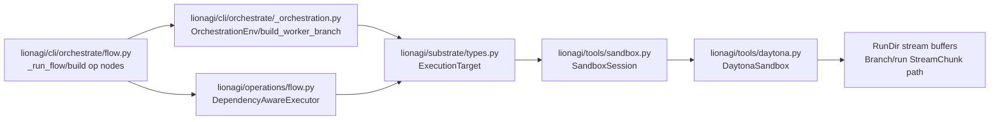
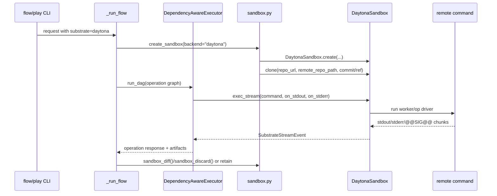

# ADR-0080: Remote Sandbox Substrate Execution

**Status**: Superseded by [ADR-0089](ADR-0089-sandbox-backend-seam-and-measurement-loop.md) (backend contract absorbed; the flow/play `DependencyAwareExecutor` integration is deferred to a future ADR, not carried by ADR-0089)
**Date**: 2026-06-03
**Related**: #1195, [ADR-0079](ADR-0079-substrate-executor-provider-interface.md), [ADR-0057](ADR-0057-remote-sandbox-execution.md)

## Context

Issue #1195 asks for flow/play operations to run in a remote isolated environment and
stream results back. The current code has two relevant but disconnected pieces:

- `lionagi/tools/sandbox.py` is a local git-worktree sandbox. `SandboxSession`
  records `worktree_path`, `branch_name`, `base_branch`, and `repo_root` at
  `lionagi/tools/sandbox.py:26`; public APIs create, diff, commit, merge, and
  discard the worktree at `lionagi/tools/sandbox.py:146`,
  `:160`, `:165`, `:170`, and `:175`.
- `lionagi/tools/daytona.py` is a host-side remote sandbox wrapper. It creates a
  Daytona sandbox through `AsyncDaytona()` and `client.create(...)` at
  `lionagi/tools/daytona.py:119` and `:137`; clones repositories through
  `self._sb.git.clone(...)` at `lionagi/tools/daytona.py:187`; streams commands
  through `exec_stream()` using `create_session`, `SessionExecuteRequest`,
  `execute_session_command`, `get_session_command_logs_async`, and
  `get_session_command` at `lionagi/tools/daytona.py:238` through `:249`.

Flow/play execution does not currently acquire either sandbox. `_run_flow()` has
`cwd` but no sandbox/substrate parameter (`lionagi/cli/orchestrate/flow.py:285`).
`setup_orchestration()` sets the orchestrator endpoint repo kwarg from local
`cwd` at `lionagi/cli/orchestrate/_orchestration.py:436`. `build_worker_branch()`
creates local artifact directories and grants the local project root through
provider kwargs `repo` and `add_dir` at
`lionagi/cli/orchestrate/_orchestration.py:578` through `:586`. The graph engine
ultimately executes each op locally by assigning `operation._branch = branch` and
calling `await operation.invoke()` at `lionagi/operations/flow.py:291`.

ADR-0057 proposed a broader PlayRunner-backed remote execution architecture. This
ADR refines the current-code substrate seam for #1195: extend `sandbox.py` and
`daytona.py`, then route flow/play operations through those extensions without
replacing the branch, operation, provider, or Daytona wrappers.

## Problem

Flow/play workers currently run in the host process and receive local filesystem
paths through provider kwargs. The local worktree sandbox is opt-in tooling, and
the Daytona wrapper is not wired into orchestration. #1195 needs an isolation
boundary that executes the operation remotely while preserving the current
Branch/Operation result contract and streaming enough live output for monitor
and artifact consumers.

## Decision

Extend the current local sandbox and Daytona wrapper behind the common
`ExecutionTarget` from ADR-0079. The default path remains local and unchanged.
Remote sandbox execution is an opt-in substrate target that can run either an
agentic provider process or a whole flow/play worker operation in Daytona, while
streaming typed events back to the host.

## Concrete Proposed Design

### Component Diagram



### Sequence Diagram



### Extend `lionagi/tools/sandbox.py`

Keep the existing local worktree behavior as the default. Extend
`SandboxSession` rather than replacing it:

```python
# lionagi/tools/sandbox.py
from typing import Literal, Any

SandboxBackend = Literal["local_worktree", "daytona"]


@dataclass
class SandboxSession:
    worktree_path: str
    branch_name: str
    base_branch: str
    repo_root: str
    is_active: bool = True
    backend: SandboxBackend = "local_worktree"
    remote_id: str | None = None
    remote_repo_path: str | None = None
    metadata: dict[str, Any] = field(default_factory=dict)

    def execution_target(self) -> ExecutionTarget:
        return ExecutionTarget(
            kind="daytona" if self.backend == "daytona" else "local_worktree",
            cwd=self.remote_repo_path or self.worktree_path,
            repo=self.repo_root,
            sandbox_id=self.remote_id,
            metadata=self.metadata,
        )
```

Extend the public functions with a backend parameter while preserving current
callers:

```python
async def create_sandbox(
    repo_root: str,
    base_branch: str | None = None,
    name: str | None = None,
    *,
    backend: SandboxBackend = "local_worktree",
    daytona_snapshot: str | None = None,
    daytona_image: Any | None = None,
    repo_url: str | None = None,
    ref: str | None = None,
    env: dict[str, str] | None = None,
    resources: dict[str, int] | None = None,
) -> SandboxSession: ...


async def sandbox_exec_stream(
    session: SandboxSession,
    command: str,
    *,
    cwd: str | None = None,
    env: dict[str, str] | None = None,
    on_event: Callable[[SubstrateStreamEvent], Awaitable[None] | None] | None = None,
) -> int: ...
```

`backend="local_worktree"` keeps the current path: `_create_worktree_sync()`,
`_get_diff_sync()`, `_commit_sync()`, `_merge_sync()`, and
`_cleanup_worktree_sync()` remain the local implementation. `backend="daytona"`
uses `DaytonaSandbox` and stores the remote sandbox id and remote repo path on
`SandboxSession`.

### Extend `lionagi/tools/daytona.py`

Keep `DaytonaSandbox` as the Daytona adapter. Add a flow/op oriented method
that composes the real Daytona client calls already wrapped by the class:

```python
# lionagi/tools/daytona.py
@dataclass(slots=True)
class RemoteRunResult:
    exit_code: int
    sandbox_id: str
    repo_path: str
    artifacts: dict[str, bytes] = field(default_factory=dict)
    diff: str | None = None


async def run_lionagi_command(
    self,
    argv: Sequence[str],
    *,
    cwd: str,
    env: dict[str, str] | None = None,
    on_event: Callable[[SubstrateStreamEvent], Awaitable[None] | None] | None = None,
    artifact_paths: Sequence[str] = (),
    capture_diff: bool = True,
) -> RemoteRunResult: ...
```

The method must use the existing wrappers:

- `DaytonaSandbox.create(...)` for lifecycle, which calls `AsyncDaytona()` and
  `client.create(...)` (`lionagi/tools/daytona.py:119`, `:137`).
- `DaytonaSandbox.clone(...)`, which calls `self._sb.git.clone(...)`
  (`lionagi/tools/daytona.py:172`, `:187`).
- `DaytonaSandbox.exec_stream(...)`, which calls
  `self._sb.process.create_session(...)`,
  `SessionExecuteRequest(command=..., run_async=True)`,
  `execute_session_command(...)`,
  `get_session_command_logs_async(...)`,
  `get_session_command(...)`, and `delete_session(...)`
  (`lionagi/tools/daytona.py:238` through `:253`).
- `DaytonaSandbox.download(...)` / `read_text(...)` for artifacts
  (`lionagi/tools/daytona.py:266`, `:270`).
- `DaytonaSandbox.git_diff(...)` for a remote patch (`lionagi/tools/daytona.py:191`).
- `DaytonaSandbox.delete()` for cleanup (`lionagi/tools/daytona.py:153`).

### Stream Event Contract

Add a generic substrate event type next to `ExecutionTarget`. Provider-facing
adapters still yield `StreamChunk`; sandbox-facing adapters yield
`SubstrateStreamEvent` and can be mapped to `StreamChunk` by executor providers
when needed.

```python
# lionagi/substrate/types.py
from typing import Any, Literal

SubstrateEventType = Literal[
    "stdout",
    "stderr",
    "signal",
    "artifact",
    "result",
    "error",
]


@dataclass(frozen=True, slots=True)
class SubstrateStreamEvent:
    type: SubstrateEventType
    content: str = ""
    metadata: Mapping[str, Any] = field(default_factory=dict)
```

`DaytonaSandbox.exec_stream()` currently documents `@@SIG@@` parsing at
`lionagi/tools/daytona.py:228`. The extension should parse stdout lines with
that prefix into `SubstrateStreamEvent(type="signal", metadata=...)`; ordinary
stdout/stderr become `stdout`/`stderr`; final exit code becomes `result`;
exceptions become `error`.

### Flow and Play Integration

Extend the existing flow/play call chain without replacing it:

1. Add an optional substrate selector to the CLI layer and thread it into
   `_run_flow()` next to `cwd`, because `_run_flow()` is the current flow/play
   entry point (`lionagi/cli/orchestrate/flow.py:285`).
2. Add `execution_target: ExecutionTarget | None` and
   `sandbox_session: SandboxSession | None` to `OrchestrationEnv`.
3. In `setup_orchestration()`, acquire the sandbox only when the selector is
   remote. Local default behavior remains the current `cwd` -> endpoint `repo`
   assignment at `lionagi/cli/orchestrate/_orchestration.py:436`.
4. In `build_worker_branch()`, continue creating per-agent artifact directories
   at `lionagi/cli/orchestrate/_orchestration.py:578`. For a remote target, set
   provider kwargs to remote paths and attach the `ExecutionTarget`:

   ```python
   w_imodel.endpoint.config.kwargs["execution_target"] = (
       env.execution_target.for_worker(agent_id)
   )
   w_imodel.endpoint.config.kwargs["repo"] = remote_artifact_dir
   w_imodel.endpoint.config.kwargs["add_dir"] = [remote_project_root]
   ```

5. In `flow.py`, attach the same target to operation metadata when adding the op
   node at `lionagi/cli/orchestrate/flow.py:697`:

   ```python
   node = builder.add_operation(
       "operate",
       branch=w_branch,
       depends_on=dep_nodes or None,
       instruction=instruction,
       context=ctx,
       execution_target=env.execution_target.for_worker(agent_ids[i])
       if env.execution_target
       else None,
   )
   ```

6. In `DependencyAwareExecutor._execute_operation()`, keep the local default
   exactly as-is. Only when operation metadata contains an execution target,
   delegate invocation to the substrate adapter; otherwise keep
   `operation._branch = branch` followed by `await operation.invoke()` at
   `lionagi/operations/flow.py:291`.

   ```python
   target = operation.metadata.get("execution_target")
   if target is None:
       operation._branch = branch
       await operation.invoke()
   else:
       await invoke_operation_on_substrate(operation, branch, target, on_event=...)
   ```

The remote path must return the same operation response shape the local
`Operation.invoke()` path stores at `lionagi/operations/flow.py:299`, and must
persist stream events into the same run stream/artifact surfaces used by current
CLI endpoints.

### Failure Modes

| Failure | Contracted behavior |
|---------|---------------------|
| Daytona package missing | Preserve `_require_daytona()` import guidance from `lionagi/tools/daytona.py:40`; do not silently fall back to host execution. |
| Sandbox create fails | Close the Daytona client as current `DaytonaSandbox.create()` does at `lionagi/tools/daytona.py:139` and mark the operation failed. |
| Clone/ref checkout fails | Emit a substrate `error` event and delete or retain the sandbox according to retention policy. |
| Remote command exits nonzero | Emit `result` with `exit_code`; operation status policy decides whether this is failed or completed with error output. |
| Stream parser sees malformed `@@SIG@@` | Emit the raw line as `stdout` plus parser metadata; do not drop output. |
| Host loses stream connection | Attempt final `get_session_command()` and artifact download; if unavailable, mark remote status unknown and retain sandbox for inspection. |
| Cleanup fails | Surface cleanup status in metadata; never report a clean success if remote resources may still be running. |

## Consequences

**Positive**

- `sandbox.py` remains the local worktree API, so existing CodingToolkit sandbox
  callers keep working.
- `daytona.py` remains the only Daytona adapter and continues to cite concrete
  Daytona SDK calls.
- Flow/play remote execution has a real insertion point in `_run_flow()`,
  `setup_orchestration()`, `build_worker_branch()`, and
  `DependencyAwareExecutor._execute_operation()`.
- The execution target is shared with ADR-0079, so executor providers and remote
  sandbox routing use the same substrate vocabulary.

**Negative**

- Per-operation remote execution requires serializing enough branch/operation
  state for a remote worker driver. That driver is not present today and must be
  implemented carefully.
- Remote path setup touches both CLI orchestration and operation execution; this
  is a wider change than exposing Daytona as a standalone tool.
- Existing `repo` and `add_dir` provider kwargs are local-path oriented; remote
  execution must translate them to remote paths rather than passing host paths.

### Coupling and Testability

Measured design components: flow CLI, orchestration env, operation executor,
shared substrate types, `SandboxSession`, `DaytonaSandbox`, and run stream
persistence. Proposed dependency edges: 8. `kappa = 8 / (7 * 6) = 0.19`, under
the 0.30 target. Testability target is high if the Daytona adapter is exercised
behind a fake `DaytonaSandbox` that records calls to `clone()`, `exec_stream()`,
`download()`, `git_diff()`, and `delete()`.

## Alternatives Considered

| Alternative | Trade-off |
|-------------|-----------|
| Implement only the broad PlayRunner design from ADR-0057 | Aligns with long-term run control, but it does not answer the current code seam in `sandbox.py`, `daytona.py`, `build_worker_branch()`, and `_execute_operation()`. Too large for #1195 by itself. |
| Expose Daytona only as a CodingToolkit `sandbox` tool | Minimal flow changes, but the LLM would decide whether to use isolation. It does not make a flow/play operation itself run remotely and does not protect host-side provider/tool execution. |
| Run the provider CLI remotely but keep the branch and tools local | Easier streaming, but file edits, tools, and subprocesses can still hit the host. That violates the isolation goal. |
| Replace `SandboxSession` with a new remote-only runner object | Cleaner remote design, but it discards the local worktree API that #1195 explicitly says to extend. |

## Migration and Compatibility

1. Add `ExecutionTarget` and `SubstrateStreamEvent` from ADR-0079 with no runtime
   behavior change.
2. Extend `SandboxSession` with backend metadata while keeping constructor
   compatibility through defaults.
3. Add `backend="daytona"` support to `create_sandbox()` and a new
   `sandbox_exec_stream()` helper; keep existing local helper functions as the
   local backend implementation.
4. Add `DaytonaSandbox.run_lionagi_command()` using the current Daytona wrapper
   methods.
5. Add a disabled-by-default flow/play substrate selector and pass the target
   through `_run_flow()`, `setup_orchestration()`, `build_worker_branch()`, and
   operation metadata.
6. Add the `_execute_operation()` remote branch behind `if target is not None`;
   local operation invocation remains byte-for-byte equivalent in behavior.
7. Add tests with fake Daytona/process adapters before enabling any CLI default.

## Open Questions for Ocean

- Should the first #1195 implementation isolate each worker operation, or should
  it run the whole flow/play invocation remotely first and defer per-op remote
  execution?
- What is the retention policy for failed Daytona sandboxes: delete immediately,
  retain for a fixed TTL, or retain until an operator decision?
- Which secrets may be injected into `DaytonaSandbox.create(env=...)`, and should
  the design require a broker instead of raw env vars?
- Should remote artifacts be downloaded into the current `RunDir` filesystem
  layout first, or uploaded directly into ADR-0053 artifact persistence?
- Is Daytona the only approved remote backend for this tranche, or should the
  public selector be provider-neutral from day one?
- Should nonzero remote command exit codes fail the operation automatically, or
  should this be configurable per executor provider?

## References

- `../explorer-2/sandbox_inventory.md`
- `lionagi/tools/sandbox.py`
- `lionagi/tools/daytona.py`
- `lionagi/cli/orchestrate/flow.py`
- `lionagi/cli/orchestrate/_orchestration.py`
- `lionagi/operations/flow.py`
- `lionagi/operations/run/run.py`
- `lionagi/cli/_runs.py`
