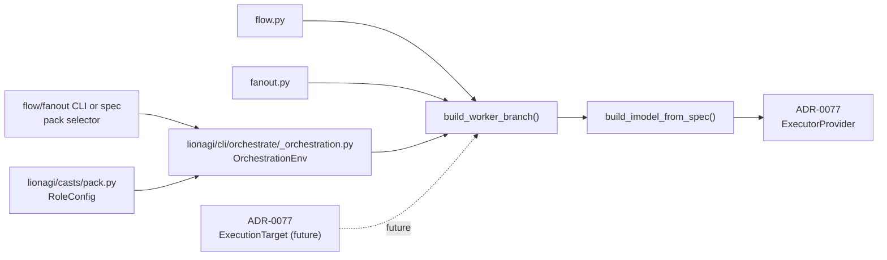
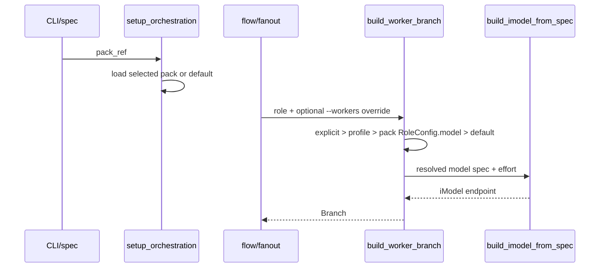

# ADR-0080: Role to Substrate Routing Policy

**Status**: Proposed
**Date**: 2026-06-03
**Related**: #1210, [ADR-0074](ADR-0074-role-composition-and-pack-config.md), [ADR-0077](ADR-0077-substrate-executor-provider-interface.md), [ADR-0078](ADR-0078-remote-sandbox-substrate-execution.md)

## Context

Issue #1210 asks for role-to-substrate routing so `li o flow` and `li o fanout` can
route workers by role instead of requiring a manually repeated `--workers`
model list on every invocation. The issue proposes role defaults such as
judgment roles on a stronger substrate, implementation roles on coding
substrates, and bulk/research roles on cheaper substrates, with precedence:
explicit per-node or `--workers` override, profile frontmatter, then routing
policy default.

The live code already has most of this precedence. `Role` is a behavioral
pattern with `body` and `emits`, not a runtime route, at
`lionagi/casts/pattern.py:116` through `:126`. The casts `Profile` docstring
states it is pure configuration with no model/tools/permissions in
`lionagi/casts/profile.py:18` through `:22`. ADR-0074 made the pack the per-role
configuration layer; `RoleConfig` already has optional `model` and `effort`
fields at `lionagi/casts/pack.py:30` through `:50`, and `Pack.from_file(...)`
parses them at `lionagi/casts/pack.py:86` through `:93`.

`flow` and `fanout` already consume that config through one shared branch
builder. `build_worker_branch(...)` resolves `w_cfg = role_config(role)` at
`lionagi/cli/orchestrate/_orchestration.py:534` through `:536`, applies model
precedence `explicit override > user profile > pack config > default` at
`lionagi/cli/orchestrate/_orchestration.py:542` through `:551`, applies effort
precedence at `lionagi/cli/orchestrate/_orchestration.py:553` through `:559`,
and creates the worker iModel with `build_imodel_from_spec(...)` at
`lionagi/cli/orchestrate/_orchestration.py:567` through `:575`.
`build_imodel_from_spec(...)` maps the model string onto the provider/endpoint
registry path at `lionagi/cli/_providers.py:238` through `:281`, which is the
same executor-provider path formalized by ADR-0077.

Flow calls `build_worker_branch(...)` at `lionagi/cli/orchestrate/flow.py:653`
through `:662`. Fanout calls it at `lionagi/cli/orchestrate/fanout.py:221`
through `:231`. Flow dry-run already reports pack-sourced models as `(pack)` at
`lionagi/cli/orchestrate/flow.py:593` through `:606`.

The current gap is activation and naming. Tests prove custom packs can parse
`model: codex/x` and `effort: high` at `tests/casts/test_pack.py:11` through
`:35`, but runtime `role_config(role)` loads only the packaged default pack at
`lionagi/cli/orchestrate/_orchestration.py:143` through `:164`. Tests also
lock the current compatibility rule that the shipped default pack must not pin a
provider: `tests/casts/test_pack.py:57` through `:67` and
`tests/cli/orchestrate/test_role_config.py:54` through `:56`.

## Problem

Role routing is partly present but not usable as an explicit policy. The
optional route target exists as `RoleConfig.model`, and flow/fanout consume it,
but users cannot select a routing pack for an orchestration run. Hardcoding
provider defaults into `lionagi/casts/packs/default.yaml` would violate the
existing default-pack compatibility contract. Adding model fields to `Role` or
casts `Profile` would mix behavioral/persona definitions with runtime substrate
selection.

## Decision

Use the pack `RoleConfig` as the role routing policy. A role carries an optional
routing target through `RoleConfig.model` and `RoleConfig.effort`, not through
the behavioral `Role` class. `RoleConfig.model` is the current executor-provider
target: it is parsed as a model spec and mapped through `build_imodel_from_spec(...)`
onto the ADR-0077 `EndpointProvider`/`ExecutorProvider` path. When ADR-0077's
`ExecutionTarget` type lands, extend `RoleConfig` with an optional
`execution_target` field for remote/local substrate details; until then, #1210
should ship a thin reference implementation for model-spec routing and pack
selection only.

The thin #1210 slice should proceed. It is not ADR-only. It should add an
opt-in pack selection surface and tests, but it should not hardcode provider
defaults into the shipped default pack.

## Concrete Proposed Design

### Component Diagram



### Sequence Diagram



### Routing Type Surface

Keep the current additive `RoleConfig.model` field as the first-generation route
target:

```python
# current: lionagi/casts/pack.py:30-50
@dataclass(frozen=True, slots=True)
class RoleConfig:
    model: str | None = None
    effort: str | None = None
    default_modes: tuple[str, ...] = ()
    modes_allow: tuple[str, ...] = ()
    active: bool = True
```

Map it to the ADR-0077 executor-provider interface like this:

```text
RoleConfig.model
  -> build_worker_branch(...): resolved w_model
  -> build_imodel_from_spec(w_model)
  -> iModel(endpoint="query_cli", model=...)
  -> EndpointRegistry / AgenticEndpoint / ExecutorProvider
```

After ADR-0077 lands, extend the same config rather than adding a competing
route object:

```python
# future after ADR-0077 types exist
from lionagi.substrate.types import ExecutionTarget


@dataclass(frozen=True, slots=True)
class RoleConfig:
    model: str | None = None
    effort: str | None = None
    execution_target: ExecutionTarget | None = None
    default_modes: tuple[str, ...] = ()
    modes_allow: tuple[str, ...] = ()
    active: bool = True
```

`execution_target` maps to ADR-0077's `ExecutionTarget`, and should be attached
to the worker endpoint kwargs only where ADR-0078 attaches remote substrate
targets. Do not invent a second provider registry or a Daytona-specific role
field.

### Pack Selection Surface

Add an orchestration pack selector. This makes the already parsed optional
per-role `model` field usable without changing built-in role definitions.

```python
# proposed flow/fanout signatures
async def _run_flow(..., pack: str | None = None, ...) -> tuple[str, str]: ...
async def _run_fanout(..., pack: str | None = None, ...) -> str: ...

def setup_orchestration(
    *,
    pattern_name: str,
    model_spec: str,
    agent_name: str | None,
    pack: str | None = None,
    ...
) -> OrchestrationEnv: ...
```

`pack` accepts either `"default"`/`None` or a YAML path. The initial slice should
support paths because users can already create custom pack files and
`Pack.from_file(...)` exists at `lionagi/casts/pack.py:72` through `:96`.
Named pack discovery can be a follow-up.

Extend `OrchestrationEnv`:

```python
@dataclass
class OrchestrationEnv:
    ...
    pack: Pack | None = None
```

Change role config lookup to accept the selected pack:

```python
def role_config(role: str, pack: Pack | None = None):
    p = pack if pack is not None else _default_pack()
    return p.config(role) if p else None
```

Then update all current call sites:

- `build_worker_branch(...)`: `w_cfg = None if env.bare else role_config(role, env.pack)`.
- `resolve_modes(...)`: accept `pack: Pack | None = None` or keep using default
  until the implementation is ready to thread selected pack modes everywhere.
- Flow dry-run at `lionagi/cli/orchestrate/flow.py:594`: use
  `role_config(ta.assignee, env.pack)` so dry-run shows the selected routing
  policy.

### CLI and Spec Surface

Add `--pack PATH_OR_NAME` to both `flow` and `fanout`. Flow already has parser
surface near `--workers` and `--bare` at `lionagi/cli/orchestrate/__init__.py:246`
through `:263`; fanout has common model/team/worker options in the same file.
Add a string `pack` spec field to `_validate_spec_fields(...)` at
`lionagi/cli/orchestrate/__init__.py:638`, hydrate it near the existing flow
spec fields at `lionagi/cli/orchestrate/__init__.py:827` through `:859`, and
pass it to `_run_flow(...)` at `lionagi/cli/orchestrate/__init__.py:937` through
`:967`. Fanout can accept CLI `--pack` first; spec-file fanout is not currently
the same surface as flow specs.

Example opt-in routing pack:

```yaml
name: local-routing
roles:
  researcher:
    model: codex/gpt-5.5
    effort: high
    default_modes: [evidential]
  critic:
    model: claude_code/opus
    effort: high
    default_modes: [adversarial]
  implementer:
    model: claude_code/sonnet
    effort: high
```

The shipped default pack should continue to omit model values until Ocean
explicitly accepts a default cost/provider policy.

### Precedence

Keep the current precedence from `build_worker_branch(...)`:

1. `--workers` / explicit `model_override` from flow at
   `lionagi/cli/orchestrate/flow.py:658` or fanout at
   `lionagi/cli/orchestrate/fanout.py:228`.
2. User profile model from `resolve_worker_spec(role)` and profile frontmatter.
3. Selected pack `RoleConfig.model`.
4. `env.default_model_spec`.

This matches #1210's requested precedence while preserving current behavior.

### Thin Reference Implementation Verdict

Proceed with the thin reference implementation.

The slice is tractable because:

- Optional per-role target already exists as `RoleConfig.model`.
- `Pack.from_file(...)` already parses `model` and `effort`.
- `build_worker_branch(...)` already consumes pack model and effort for both
  flow and fanout.
- Flow dry-run already exposes pack-sourced model resolution.

The slice must not:

- Add `model`, `provider`, `substrate`, or routing fields to `Role`.
- Add runtime routing fields to casts `Profile`.
- Hardcode the #1210 proposed provider table into
  `lionagi/casts/packs/default.yaml`.
- Define a provider or execution-target interface separate from ADR-0077.

Precise implementation targets:

- `lionagi/cli/orchestrate/__init__.py`: add `--pack` to flow/fanout; validate
  and hydrate flow spec field `pack`; pass `pack=args.pack` to `_run_flow(...)`
  and `_run_fanout(...)`.
- `lionagi/cli/orchestrate/flow.py`: add `pack: str | None = None` to
  `_run_flow(...)`, pass it into `setup_orchestration(...)`, and use
  `role_config(ta.assignee, env.pack)` in dry-run model resolution.
- `lionagi/cli/orchestrate/fanout.py`: add `pack: str | None = None` to
  `_run_fanout(...)` and pass it into `setup_orchestration(...)`.
- `lionagi/cli/orchestrate/_orchestration.py`: add pack loading, store
  `env.pack`, update `role_config(...)`, `resolve_modes(...)`, and
  `build_worker_branch(...)` to use the selected pack.
- `tests/cli/orchestrate/test_flow_planning.py`: assert a temporary pack with
  `researcher.model` appears as `(pack)` in dry-run and is overridden by
  `--workers`.
- `tests/casts/test_pack.py`: keep existing parser/default-pack tests; add
  `execution_target` tests only after ADR-0077 types land.

## Coupling and Testability

The thin slice touches CLI parser/spec loader, `_orchestration.py`, `flow.py`,
`fanout.py`, and tests. Runtime dependencies remain:

- flow/fanout -> `build_worker_branch(...)`
- `build_worker_branch(...)` -> selected `Pack`
- `build_worker_branch(...)` -> `build_imodel_from_spec(...)`

With 5 components and 4 direct dependencies, `k = 4 / (5 * 4) = 0.20`, below
the 0.3 target. Testability target `tau = 0.90`: tests can use temporary YAML
packs and dry-run stubs without starting external providers.

## Consequences

**Positive**

- Makes role routing usable with the least new surface.
- Reuses ADR-0074's pack config instead of creating `casts/routing.yaml`.
- Preserves existing worker precedence and `--workers` behavior.
- Maps model routing onto the ADR-0077 executor-provider path through existing
  `build_imodel_from_spec(...)`.
- Keeps default provider/cost policy opt-in until Ocean accepts concrete
  defaults.

**Negative**

- Users must supply a pack path for routing until named pack discovery exists.
- The first slice routes by model spec only; remote/local execution target
  routing waits on ADR-0077/ADR-0078 implementation.
- Selected pack threading must be applied consistently to modes and model
  resolution to avoid dry-run/runtime drift.

## Alternatives Considered

| Alternative | Trade-off |
|-------------|-----------|
| Add `model` or `substrate` directly to `Role` | Easy to inspect, but `Role` is the behavioral prompt/emission pattern. Runtime routing there would couple provider policy to the built-in persona library. |
| Use user profile frontmatter only | Already works for custom profiles, but profiles shadow casts role bodies and require a full prompt file just to set a route. That is the gap ADR-0074 avoided with packs. |
| Create standalone `casts/routing.yaml` | Clear name, but it duplicates `Pack`, which already owns per-role runtime config, modes, active roster, and policy. |
| Hardcode the #1210 provider table in `default.yaml` now | Gives immediate defaults, but violates existing tests and the compatibility rule that shipped packs do not pin provider/cost policy. Ocean must accept concrete defaults first. |
| Wait for ADR-0077 before any #1210 implementation | Avoids future migration, but unnecessarily blocks the existing model-spec route, which already maps to provider endpoints through `build_imodel_from_spec(...)`. |

## Migration and Compatibility

1. Keep `default.yaml` model values unset.
2. Add `--pack` and flow spec `pack` as opt-in surfaces.
3. Thread the selected pack through `OrchestrationEnv`, dry-run resolution, and
   `build_worker_branch(...)`.
4. Preserve existing precedence exactly.
5. After ADR-0077 lands, add optional `execution_target` parsing to `RoleConfig`
   and map it to endpoint kwargs in the same branch builder path.
6. If Ocean later accepts default role-provider policy, populate a separate
   named routing pack first. Promote to default only with a follow-up ADR or ADR
   amendment.

Existing commands without `--pack` continue using the default pack with no
provider hardcoding. Existing `--workers` and user profile frontmatter continue
to win over pack routing.

## Open Questions for Ocean

- Should `--pack` accept only filesystem paths in the first slice, or also named
  packs under `~/.lionagi/packs/`?
- Should the #1210 proposed provider table live in a separately shipped
  non-default pack such as `heterogeneous.yaml`?
- What are the accepted default providers and model aliases for roles such as
  `digester` and `polisher`, which are named in #1210 but are not built-in roles
  in the current roster inventory?
- Should `execution_target` be serialized as a nested pack object, a named
  substrate profile, or only a reference to a substrate profile once ADR-0077 and
  ADR-0078 are implemented?
- Should selected packs affect the planner roster's displayed model labels, or
  should the planner continue seeing only role descriptions and the default
  worker model?

## References

- #1210: Role to substrate routing policy.
- `../explorer-4/casts_routing_inventory.md`.
- `lionagi/casts/pattern.py:116`.
- `lionagi/casts/profile.py:18`.
- `lionagi/casts/pack.py:30`, `:46`, `:72`, `:86`.
- `lionagi/cli/orchestrate/_orchestration.py:143`, `:161`, `:534`, `:542`, `:567`.
- `lionagi/cli/orchestrate/flow.py:593`, `:653`.
- `lionagi/cli/orchestrate/fanout.py:221`.
- `lionagi/cli/_providers.py:238`.
- `tests/casts/test_pack.py:11`, `:57`.
- `tests/cli/orchestrate/test_role_config.py:54`.
