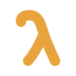

---
hide:
  - navigation
  - toc
---

<!-- markdownlint-disable MD046 -->

<article class="lion-home" aria-label="LionAGI documentation home">
  <section class="lion-hero" aria-labelledby="lion-hero-title">
    

      

        
        lionagi 0.28
        Governed orchestration
      

      <h1 id="lion-hero-title">
        Agents that work. 
        Orchestration you control.
      </h1>

      

        Run the coding agents and models you already use, compose them into parallel
        fan-outs and dependency-aware flows, and keep every run inspectable, resumable,
        and under your control.
      

      

        <a class="lion-button lion-button--primary" href="getting-started/install/">
          Start building →
        </a>
        <a class="lion-button lion-button--secondary" href="api/">
          Explore the Python SDK
        </a>
      

      <ul class="lion-proof" aria-label="LionAGI highlights">
        <li>Python 3.10+</li>
        <li>CLI and SDK</li>
        <li>Apache-2.0</li>
      </ul>
    

    

      

        <i></i><i></i><i></i>
        terminal
        ready
      

      <pre><code># install once
$ pip install lionagi

# one durable agent turn
$ li agent claude/sonnet \
    "Map the risks in this change"

# a planned DAG of specialists
$ li o flow codex/gpt-5.5 \
    "Audit auth and propose fixes" --cwd .</code></pre>
      

        plan<i></i>research<i></i>implement<i></i>review
      

      

        <b></b> state persisted locally
        ~/.lionagi/runs/
      

    

  </section>

  <section class="lion-section" aria-labelledby="choose-surface">
    

      
Start where you work

      <h2 id="choose-surface">One system, three useful surfaces.</h2>
      
Use the terminal for direct work, Python for application control, and Studio for live operations.

    

    

      <article class="lion-surface-card">
        

          01
          <code>li</code>
        

        <h3>Command line</h3>
        
Start one agent, fan out independent workers, or ask an orchestrator to plan a DAG.

        <a href="getting-started/first-flow/">Run your first flow →</a>
      </article>

      <article class="lion-surface-card">
        

          02
          <code>Branch</code>
        

        <h3>Python SDK</h3>
        
Build stateful model interactions with typed output, tools, providers, and explicit graph execution.

        <a href="api/branch/">Meet the core API →</a>
      </article>

      <article class="lion-surface-card lion-surface-card--accent">
        

          03
          <code>local :8765</code>
        

        <h3>Lion Studio</h3>
        
See active agents, schedules, execution graphs, artifacts, and run history in one local-first cockpit.

        <a href="https://lion-studio.khive.ai">Open Studio ↗</a>
      </article>
    

  </section>

  <section class="lion-section lion-section--split" aria-labelledby="right-structure">
    

      
Scale with intent

      <h2 id="right-structure">Use exactly as much structure as the task needs.</h2>
      
Each lane adds a capability without replacing the one before it.

      <a class="lion-text-link" href="choosing-a-surface/">Choose the right surface →</a>
    

    <ol class="lion-ladder">
      <li>
        01
        

          
<code>li agent</code>One focused branch

          
Ask, act, inspect, and resume. The smallest useful unit of agent work.

        

      </li>
      <li>
        02
        

          
<code>li o fanout</code>Independent workers

          
Split one task across parallel workers, then optionally synthesize their results.

        

      </li>
      <li>
        03
        

          
<code>li o flow</code>Dependency-aware DAG

          
Let an orchestrator plan specialist work while the engine resolves dependencies.

        

      </li>
      <li>
        04
        

          
<code>li schedule</code>Durable operations

          
Promote repeatable work into playbooks, schedules, monitored runs, and Studio workflows.

        

      </li>
    </ol>
  </section>

  <section class="lion-section lion-sdk" aria-labelledby="plain-python">
    

      
A Python API that stays Python

      <h2 id="plain-python">Typed results without hiding the loop.</h2>
      

        A <code>Branch</code> owns conversation state, tools, and model configuration.
        <code>operate()</code> adds tool use and structured output; <code>Session</code>
        coordinates branches when the work becomes a graph.
      

      

        <a href="api/operations/">Structured operations →</a>
        <a href="api/session/">Session and flows →</a>
      

    

    

      
risk_assessment.pyPython

      <pre><code>from pydantic import BaseModel
from lionagi import Branch

class Assessment(BaseModel):
    risk: str
    reasons: list[str]

branch = Branch(
    chat_model="codex/gpt-5.5",
    system="You are a careful reviewer.",
)

result = await branch.operate(
    instruction="Assess this change.",
    response_format=Assessment,
)</code></pre>
    

  </section>

  <section class="lion-section" aria-labelledby="control-feature">
    

      
Trust comes from visibility

      <h2 id="control-feature">Control is a feature, not an afterthought.</h2>
    

    

      <article>
        
        <h3>Typed, inspectable state</h3>
        
Branches, messages, operations, and graphs are explicit objects—not state hidden inside a chain.

        <a href="concepts/#branch">Understand Branch →</a>
      </article>
      <article>
        
        <h3>Runs that survive the terminal</h3>
        
Run records, branch snapshots, artifacts, monitoring, and resume are built into the CLI path.

        <a href="cookbook/resumable-background/">Learn durable runs →</a>
      </article>
      <article>
        
        <h3>Governed tool execution</h3>
        
Permission policies, guard hooks, and isolated git worktrees put boundaries around agent actions.

        <a href="api/agent-config/">Configure an agent →</a>
      </article>
      <article>
        
        <h3>Providers without lock-in</h3>
        
API models and coding-agent CLIs share one model-service boundary and compose in the same flow.

        <a href="reference/providers/">Browse providers →</a>
      </article>
    

  </section>

  <section class="lion-section" aria-labelledby="use-real-work">
    

      

        
Copy, run, adapt

        <h2 id="use-real-work">Start with real work.</h2>
      

      <a class="lion-text-link" href="cookbook/">View the cookbook →</a>
    

    

      <a href="cookbook/codebase-audit/">
        Engineering
        <h3>Audit a codebase in parallel</h3>
        
Fan out focused reviewers and keep their findings independent.

        <b aria-hidden="true">↗</b>
      </a>
      <a href="cookbook/research-synthesis/">
        Research
        <h3>Synthesize across workers</h3>
        
Gather multiple perspectives, then consolidate them into one result.

        <b aria-hidden="true">↗</b>
      </a>
      <a href="cookbook/resumable-background/">
        Operations
        <h3>Run long work in the background</h3>
        
Detach a flow, monitor its durable state, and resume any branch later.

        <b aria-hidden="true">↗</b>
      </a>
    

  </section>

  <section class="lion-final" aria-labelledby="build-first-run">
    
    
Your next run can be durable

    <h2 id="build-first-run">Start with one agent. Add orchestration when it earns its place.</h2>
    

      <a class="lion-button lion-button--primary" href="getting-started/install/">Install lionagi →</a>
      <a class="lion-button lion-button--secondary" href="comparison/">See how it compares</a>
    

  </section>
</article>

<!-- markdownlint-enable MD046 -->
