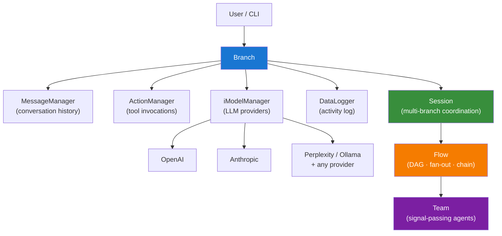

# lionagi

<div class="hero" markdown>

## Orchestrate multi-agent AI workflows.

Provider-agnostic · CLI + Python · Structured output · ReAct loops · Lion Studio UI

```bash
pip install lionagi
```

[](https://pypi.org/project/lionagi/)
[](https://pypi.org/project/lionagi/)
[](https://github.com/ohdearquant/lionagi/blob/main/LICENSE)
[](https://github.com/ohdearquant/lionagi)

</div>

---

## Quick Start

=== "Python"

    ```python
    import asyncio
    from lionagi import Branch

    branch = Branch(chat_model="claude/sonnet")

    async def main():
        _, response = await branch.chat("Explain async/await in Python in one paragraph.")
        print(response.response)

    asyncio.run(main())
    ```

=== "CLI"

    ```bash
    # Single agent turn
    li agent claude/sonnet "Explain async/await in Python in one paragraph."

    # Continue the conversation
    li agent -c "Give me a code example."

    # Parallel fan-out: 3 workers, results saved
    li o fanout claude "Audit this directory for dead code" -n 3 --save ./results

    # Multi-agent DAG flow
    li o flow claude "Research Python async best practices and write a summary"
    ```

=== "Structured Output"

    ```python
    import asyncio
    from pydantic import BaseModel
    from lionagi import Branch

    class Analysis(BaseModel):
        summary: str
        confidence: float
        keywords: list[str]

    branch = Branch(chat_model="claude/sonnet")

    async def main():
        result = await branch.operate(
            instruction="Analyze the sentiment of: 'lionagi makes multi-agent easy'",
            response_format=Analysis,
        )
        print(result)  # Analysis(summary=..., confidence=0.98, keywords=[...])

    asyncio.run(main())
    ```

---

## Architecture



**Branch** is the core processing unit — it holds the message history, registers tools, and routes calls to LLM providers via pluggable `iModel` instances. **Session** coordinates multiple branches. **Flow** orchestrates them in DAGs, fan-outs, and chains. **Team** adds mid-run signal passing between agents.

---

## Features

<div class="grid cards" markdown>

-   :material-brain: **Multi-provider LLM Support**

    ---

    Connect to OpenAI, Anthropic, Perplexity, Ollama, and any OpenAI-compatible endpoint. Switch models per branch or per operation — no code changes.

    [:octicons-arrow-right-24: Providers](reference/providers.md)

-   :material-console: **CLI + Python Dual Interface**

    ---

    Everything accessible from `li` on the command line or the Python API. Same concepts, same primitives — pick what fits the task.

    [:octicons-arrow-right-24: CLI Reference](cli-reference.md)

-   :material-monitor-dashboard: **Lion Studio UI**

    ---

    Browser-based visual workspace for running, inspecting, and replaying agent workflows. Ships as a local app bundled with lionagi.

    [:octicons-arrow-right-24: Studio](studio/index.md)

-   :material-puzzle: **Marketplace Plugins**

    ---

    Extend lionagi with community plugins — skills, tools, and playbooks distributed through the Claude Code Marketplace.

    [:octicons-arrow-right-24: Marketplace](marketplace/index.md)

-   :material-code-json: **Structured Output**

    ---

    Pass any Pydantic model as `response_format` to `branch.operate()`. lionagi validates, retries, and returns a typed Python object — no JSON wrangling.

    [:octicons-arrow-right-24: operate() API](api/operations.md)

-   :material-refresh: **ReAct Loops**

    ---

    `branch.ReAct()` runs think-act-observe cycles with registered tools until the task is complete or a step limit is reached.

    [:octicons-arrow-right-24: ReAct](api/operations.md)

</div>

---

## Get Started

<div class="grid cards" markdown>

-   :material-rocket-launch: **Install**

    ---

    `pip install lionagi` · set one env var · verify with `li --help`

    [:octicons-arrow-right-24: Install guide](getting-started/install.md)

-   :material-play-circle: **First Flow**

    ---

    Run a single agent, a fan-out, and a DAG flow in five commands.

    [:octicons-arrow-right-24: First flow](getting-started/first-flow.md)

-   :material-lightbulb: **Concepts**

    ---

    Branch · Session · Flow · Team · iModel · operate

    [:octicons-arrow-right-24: Concepts](concepts.md)

-   :material-chef-hat: **Cookbook**

    ---

    Five runnable scenarios: codebase audit, research synthesis, multi-model pipeline, team coordination, resumable background run.

    [:octicons-arrow-right-24: Cookbook](cookbook/index.md)

-   :material-api: **API Docs**

    ---

    Full reference for Branch, Session, Flow, iModel, and operations.

    [:octicons-arrow-right-24: API](api/index.md)

-   :material-book-open: **CLI Reference**

    ---

    All subcommands — `agent`, `orchestrate`, `team`, `studio`, `state`, `invoke`.

    [:octicons-arrow-right-24: CLI](cli-reference.md)

</div>

---

## Migration

!!! tip "Upgrading?"

    See the migration guides for every breaking change:

    - [0.22.5 → 0.22.6](migration/0.22.5-to-0.22.6.md)
    - [0.22.9 → 0.23.0](migration/0.22.9-to-0.23.0.md)
    - [0.23.0 → 0.23.1](migration/0.23.0-to-0.23.1.md)
