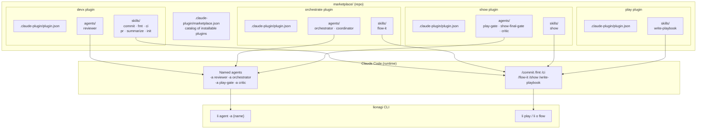

# Marketplace

The lionagi marketplace packages curated skills, agents, and configuration as installable [Claude Code](https://claude.ai/code) plugins. Each plugin targets a specific capability — developer workflows, multi-agent orchestration, show direction, or playbook authoring. Install only what you need.

Source: `marketplace/` in the lionagi repo. Catalog manifest: `.claude-plugin/marketplace.json`.

## Available Plugins

| Plugin | Skills | Agents | Purpose |
|---|---|---|---|
| [`devx`](devx.md) | `/commit` `/fmt` `/ci` `/pr` `/summarize` `/init` | `reviewer` | Developer experience: commits, CI, formatting, PRs, summaries |
| [`orchestrate`](orchestrate.md) | `/flow-it` | `orchestrator` `coordinator` | Multi-agent DAG orchestration via `li o flow` and `li o fanout` |
| `show` | `/show` | `play-gate` `show-final-gate` `critic` | Multi-play workflow direction with quality gates |
| `play` | `/write-playbook` | — | Playbook authoring for `li play` and `li o flow` |

!!! tip "Where to start"
    - **New to lionagi?** Install `devx` first — covers your day-to-day development workflow.
    - **Running multi-step workflows?** Add `show` + `orchestrate`.
    - **Authoring playbooks?** Add `play`.

## How Plugins Work

A plugin is a directory with this structure (source: `marketplace/scripts/validate_manifests.py`):

```
{plugin}/
├── .claude-plugin/
│   └── plugin.json         # required: name, version, description
├── skills/
│   └── {skill-name}/
│       └── SKILL.md        # at least one required per plugin
└── agents/                 # optional
    └── {agent-name}.md
```

Claude Code loads `SKILL.md` files as slash commands — `/commit` maps to `marketplace/devx/skills/commit/SKILL.md`. Agent profiles in `agents/` are loaded as named agents you can pass with `li agent -a {name}`.

Plugin manifests must pass `marketplace/scripts/validate_manifests.py`:
- `plugin.json` requires `name`, `version`, and `description` (all strings)
- Every plugin source directory must contain at least one `SKILL.md`
- Optional fields: `repository`, `license`, `homepage`, `author` (object), `mcpServers` (object, no stubs)

## Plugin → Skill → Agent Relationship



## Installing Plugins

### From the marketplace (recommended)

```bash
# 1. Register the lionagi marketplace with Claude Code
claude /plugin marketplace add ohdearquant/lionagi

# 2. Install the plugins you need
claude /plugin install devx@lionagi
claude /plugin install orchestrate@lionagi
claude /plugin install show@lionagi
claude /plugin install play@lionagi
```

**Prerequisites** (`marketplace/README.md:11–13`):
- Claude Code CLI v1.x+
- lionagi ≥ 0.26.0 (`pip install lionagi`)
- No other dependencies required for the four catalog plugins

### Manual install from a checkout

If you're working from a lionagi clone:

```bash
# Example: install devx manually
cp -r marketplace/devx/.claude-plugin /your-project/.claude-plugin
cp -r marketplace/devx/skills /your-project/.claude/skills
cp -r marketplace/devx/agents /your-project/.claude/agents
```

## Decision Record

Marketplace architecture rationale: [ADR-0003](../adrs/ADR-0003-claude-code-marketplace.md).
Plugin auto-discovery design: [ADR-0007](../adrs/ADR-0007-plugin-auto-discovery.md).
