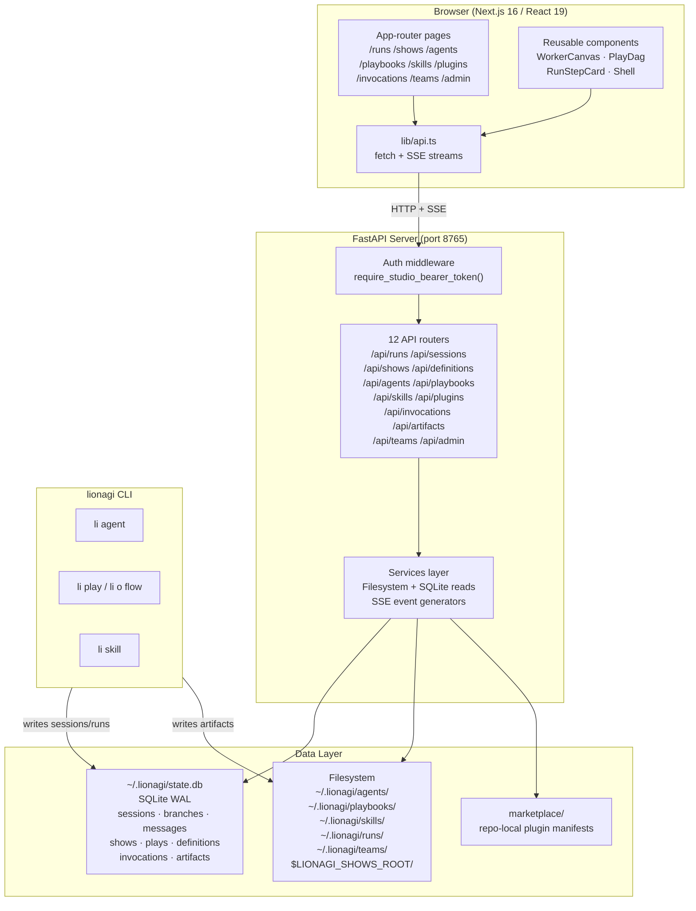

# Lion Studio

Lion Studio is the local web interface for the Lion ecosystem. It provides a real-time dashboard for inspecting and managing every artifact produced by `li` commands — shows, sessions, runs, agents, playbooks, skills, teams, and marketplace plugins.

Studio is a companion to the CLI, not a replacement. The CLI owns execution; Studio owns observation and light authoring.

## Key Capabilities

| Capability | What you can do |
|---|---|
| **Runs & Sessions** | Live-stream session messages via SSE; drill from run → session → branch → message |
| **Shows** | Visualise play DAGs; watch live file changes; drill to individual play sessions |
| **Agent management** | Browse, edit, and validate agent profile markdown |
| **Playbook authoring** | Edit declarative YAML playbooks or visual DAG graphs |
| **Skill browser** | Browse skill markdown from `~/.lionagi/skills/` |
| **Plugin marketplace** | Inspect marketplace plugins, their skills, and embedded agents |
| **Invocations** | Trace skill invocations to their child sessions and artifacts |
| **Teams** | Inspect team coordination state from `~/.lionagi/teams/` |
| **Admin** | Doctor, health checks, phantom-session pruning, force-transition |

## How to Launch

=== "CLI (recommended)"

    ```bash
    li studio
    # or explicitly:
    li studio start
    ```

    Port and host come from environment variables (see [Setup](setup.md)), or can be overridden:

    ```bash
    li studio start --port 9000 --host 0.0.0.0
    ```

=== "Python module"

    ```bash
    uv run python -m apps.studio.server
    ```

    Reads `LIONAGI_STUDIO_HOST` and `LIONAGI_STUDIO_PORT` from the environment.

=== "Uvicorn direct"

    ```bash
    uv run uvicorn apps.studio.server.app:app \
        --reload \
        --host 127.0.0.1 \
        --port 8765
    ```

    `--reload` enables hot-reload for backend development.

After the server starts, open the frontend separately (see [Setup → Development mode](setup.md#development-mode)):

```
http://localhost:3000   ← Next.js frontend (dev)
http://localhost:8765   ← FastAPI backend API
```

## Architecture



!!! note "Frontend launch"
    `li studio` starts only the backend server. The frontend (Next.js) must be started separately with `pnpm dev` in `apps/studio/frontend/`. This split lets you iterate on the frontend independently of the backend.

!!! note "Screenshots"
    Screenshots of each page will be added once the UI stabilises. See the feature descriptions in [Features](features.md) for what each page shows.
